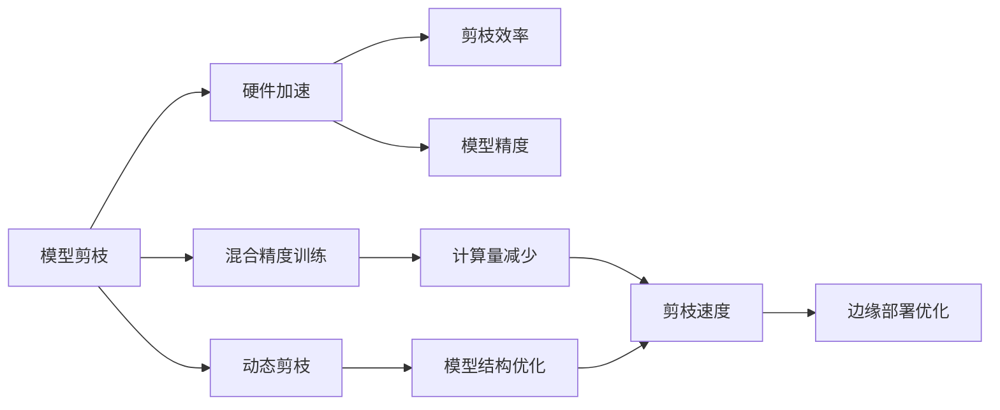

                 

# 硬件协同剪枝：软硬件一体化的压缩策略

> 关键词：硬件协同剪枝, 软硬件一体化, 压缩策略, 模型精简, 资源优化

## 1. 背景介绍

### 1.1 问题由来
随着深度学习模型的规模不断扩大，模型参数的压缩和加速需求愈发迫切。在大规模深度学习模型中，例如大规模卷积神经网络（CNN）和大型语言模型（LLM），模型压缩可以显著降低模型存储需求和推理开销，提高模型在计算资源受限环境下的运行效率。

然而，当前的模型压缩技术大多关注于模型内部的参数优化，而忽略了硬件的潜力。硬件协同剪枝（Hardware-Assisted Pruning）则是将模型压缩和硬件优化结合的全新技术范式，通过软硬件协同设计，实现更高效的模型压缩和加速。

### 1.2 问题核心关键点
硬件协同剪枝的核心思想是：通过硬件加速技术（如DSP、GPU、TPU等）来增强剪枝过程中对模型参数的精细化操作，提高剪枝效率和压缩效果。具体来说，硬件协同剪枝包括以下几个关键点：
1. **精度损失控制**：通过硬件加速技术降低剪枝过程中的精度损失，保证模型压缩后仍能保持高精度。
2. **硬件资源适配**：利用不同硬件架构的并行特性，优化剪枝算法的并行度，提高剪枝速度。
3. **动态剪枝策略**：结合硬件资源和任务需求，动态调整剪枝策略，避免过度剪枝或欠剪枝。
4. **混合精度训练**：在剪枝前使用混合精度训练，减少剪枝前的计算量，提高剪枝效率。
5. **边缘部署优化**：针对嵌入式设备等边缘计算环境，优化剪枝后的模型结构和算法，适应低功耗、低计算资源要求。

这些关键点共同构成了硬件协同剪枝技术的核心，旨在实现模型压缩和硬件优化的双重目标。

### 1.3 问题研究意义
硬件协同剪枝技术对深度学习模型压缩和加速具有重要意义：

1. **降低存储和计算成本**：通过剪枝减少模型参数，降低存储和计算成本，尤其在资源受限的环境下尤为重要。
2. **提高推理速度**：剪枝后的模型通常具有更小的计算图和更少的参数，能显著提高推理速度。
3. **优化硬件资源利用**：结合硬件加速技术，能够更高效地利用硬件资源，提升算力利用率。
4. **增强模型泛化能力**：通过优化剪枝策略，能够更好地保留重要特征，提高模型的泛化能力和鲁棒性。
5. **促进模型自适应性**：动态剪枝策略使模型能够在不同硬件平台上自适应调整，适应多变的计算资源和性能需求。

## 2. 核心概念与联系

### 2.1 核心概念概述

为更好地理解硬件协同剪枝技术，本节将介绍几个密切相关的核心概念：

- **模型剪枝**：通过删除模型中不必要的权重，减少模型参数数量，提高模型压缩率和运行效率。
- **硬件加速**：利用专用硬件（如GPU、TPU、DSP等）来加速模型的计算过程，提高算力效率。
- **混合精度训练**：在训练过程中使用低精度浮点数（如FP16、BF16）代替全精度浮点数（如FP32），减少计算量和存储需求。
- **动态剪枝**：在训练或推理过程中，根据任务需求动态调整剪枝策略，优化模型结构。
- **边缘部署优化**：针对资源受限的嵌入式设备，优化模型结构，适应低功耗、低计算资源要求。

这些核心概念之间存在着紧密的联系，形成了硬件协同剪枝技术的完整生态系统。通过理解这些核心概念，我们可以更好地把握硬件协同剪枝的工作原理和优化方向。

### 2.2 概念间的关系

这些核心概念之间存在着紧密的联系，形成了硬件协同剪枝技术的完整生态系统。下面我通过几个Mermaid流程图来展示这些概念之间的关系。



这个流程图展示了大模型压缩技术从剪枝到硬件优化的整体过程。具体来说：

1. 剪枝是压缩模型的基础，通过去除不重要参数，减少模型规模。
2. 硬件加速能够提高剪枝效率和精度，保证模型压缩后仍能保持高精度。
3. 混合精度训练在剪枝前减少计算量和存储需求，提高剪枝效率。
4. 动态剪枝策略在训练或推理过程中根据需求调整剪枝策略，优化模型结构。
5. 边缘部署优化针对低功耗、低计算资源要求的环境，进一步优化模型结构和算法。

这些概念共同构成了硬件协同剪枝技术的完整生态系统，使其能够在不同应用场景下发挥重要作用。

### 2.3 核心概念的整体架构

最后，我们用一个综合的流程图来展示这些核心概念在大模型压缩技术中的应用：


这个综合流程图展示了从预训练模型到压缩后的最终模型的完整过程。具体来说：

1. 预训练模型通过剪枝算法进行参数压缩。
2. 压缩后的模型利用硬件加速技术提高计算效率。
3. 混合精度训练在压缩前减少计算量和存储需求。
4. 动态剪枝策略在压缩过程中优化模型结构，提高模型精度和泛化能力。
5. 边缘部署优化针对低计算资源环境，进一步优化模型结构和算法。

通过这些流程图，我们可以更清晰地理解硬件协同剪枝过程中各个核心概念的关系和作用，为后续深入讨论具体的剪枝方法和技术奠定基础。

## 3. 核心算法原理 & 具体操作步骤
### 3.1 算法原理概述

硬件协同剪枝的核心思想是通过硬件加速技术增强剪枝过程中的优化操作，提高剪枝效率和精度。具体来说，硬件协同剪枝包括以下几个关键步骤：

1. **剪枝算法设计**：选择合适的剪枝算法，如层次剪枝、网络剪枝、结构剪枝等。
2. **剪枝精度控制**：通过硬件加速技术（如Tensor Core、FP16等）降低剪枝过程中的精度损失，保证模型压缩后仍能保持高精度。
3. **硬件资源适配**：利用不同硬件架构的并行特性，优化剪枝算法的并行度，提高剪枝速度。
4. **动态剪枝策略**：根据任务需求动态调整剪枝策略，避免过度剪枝或欠剪枝。
5. **混合精度训练**：在剪枝前使用混合精度训练，减少剪枝前的计算量，提高剪枝效率。
6. **边缘部署优化**：针对嵌入式设备等边缘计算环境，优化剪枝后的模型结构和算法，适应低功耗、低计算资源要求。

### 3.2 算法步骤详解

以下是硬件协同剪枝的详细步骤，每一步都涉及到具体的算法和技术：

1. **模型预处理**：首先，将预训练模型转换为可剪枝的格式，例如权重共享和稠密矩阵压缩。
2. **剪枝算法选择**：根据模型结构和任务需求，选择合适的剪枝算法。例如，层次剪枝适合小规模网络，结构剪枝适合大规模网络。
3. **剪枝精度控制**：通过硬件加速技术降低剪枝过程中的精度损失。例如，使用Tensor Core加速矩阵乘法，减少浮点运算误差。
4. **硬件资源适配**：利用不同硬件架构的并行特性，优化剪枝算法的并行度。例如，在GPU上利用CUDA并行加速剪枝算法。
5. **动态剪枝策略**：在训练或推理过程中，根据任务需求动态调整剪枝策略。例如，根据测试集上的性能反馈，调整剪枝阈值。
6. **混合精度训练**：在剪枝前使用混合精度训练，减少计算量和存储需求。例如，使用FP16代替FP32进行训练。
7. **边缘部署优化**：针对嵌入式设备等边缘计算环境，优化剪枝后的模型结构和算法，适应低功耗、低计算资源要求。例如，使用低精度浮点数和稀疏矩阵表示模型参数。

### 3.3 算法优缺点

硬件协同剪枝具有以下优点：

1. **精度损失控制**：硬件加速技术能够降低剪枝过程中的精度损失，保证模型压缩后仍能保持高精度。
2. **剪枝效率提升**：结合硬件加速和混合精度训练，能够显著提高剪枝效率和速度。
3. **资源优化**：能够更好地利用硬件资源，提高算力利用率。
4. **模型结构优化**：动态剪枝策略能够优化模型结构，提高模型的泛化能力和鲁棒性。

然而，硬件协同剪枝也存在一些缺点：

1. **硬件依赖性**：需要硬件加速设备支持，设备成本较高。
2. **技术复杂性**：涉及硬件加速、剪枝算法、混合精度训练等多方面的技术，技术实现复杂。
3. **模型精度保证**：如何在剪枝过程中保持模型精度，仍是一个技术难题。

尽管存在这些缺点，但硬件协同剪枝仍是一种非常有前景的模型压缩和加速技术。未来，随着硬件技术的不断发展，相信硬件协同剪枝将能够得到更广泛的应用。

### 3.4 算法应用领域

硬件协同剪枝技术已经在多个领域得到了广泛应用，例如：

1. **计算机视觉**：在大规模图像识别和物体检测任务中，硬件协同剪枝能够显著降低模型大小和推理时间，提高计算效率。
2. **自然语言处理**：在大规模语言模型中，硬件协同剪枝能够优化模型结构和计算效率，适应资源受限的嵌入式设备。
3. **推荐系统**：在大规模推荐系统中，硬件协同剪枝能够提高模型推理速度，满足实时推荐需求。
4. **自动驾驶**：在自动驾驶系统中，硬件协同剪枝能够优化模型结构和计算效率，满足实时决策需求。

除了上述这些领域，硬件协同剪枝还在其他诸多领域得到了应用，为深度学习模型的压缩和加速提供了新的技术思路。

## 4. 数学模型和公式 & 详细讲解 & 举例说明

### 4.1 数学模型构建

硬件协同剪枝的数学模型主要关注于如何优化模型参数的剪枝过程，以最小的计算和存储空间开销，达到最大的模型压缩率和推理速度提升。

假设原始模型为 $M$，包含 $N$ 个参数 $w_i$，剪枝后的模型为 $M'$，包含 $K$ 个参数 $w_i'$。剪枝的数学模型可以表示为：

$$
w_i' = f(w_i)
$$

其中 $f$ 为剪枝函数，可以根据不同的剪枝算法和精度需求进行选择。

### 4.2 公式推导过程

以层次剪枝（Hierarchical Pruning）为例，推导其数学模型和公式。层次剪枝是一种常见的剪枝方法，其基本思想是从全局到局部逐步剪枝，首先删除不重要的小子网络，然后删除不重要的小网络，最后删除不重要的参数。

设 $\Omega$ 为模型中所有参数的集合，$w_i$ 为第 $i$ 个参数。层次剪枝的过程可以表示为：

1. 全局剪枝：根据某些指标（如L2范数）删除重要性最小的参数子集 $W_1$。
2. 局部剪枝：对剩余的参数子集 $W_2$，根据某些指标（如激活值、梯度等）删除重要性最小的参数子集 $W_3$。
3. 参数剪枝：对剩余的参数子集 $W_4$，根据某些指标（如稀疏性、神经元权重等）删除重要性最小的参数子集 $W_5$。

层次剪枝的数学模型可以表示为：

$$
w_i' = f_1(\sum_{j \in W_1} w_j)
$$

其中 $f_1$ 为全局剪枝函数。

假设 $W_2 = \{j|j \in \Omega, j \notin W_1\}$，则局部剪枝的数学模型可以表示为：

$$
w_i' = f_2(\sum_{j \in W_2} w_j)
$$

其中 $f_2$ 为局部剪枝函数。

假设 $W_3 = \{j|j \in W_2, j \notin W_3\}$，则参数剪枝的数学模型可以表示为：

$$
w_i' = f_3(\sum_{j \in W_3} w_j)
$$

其中 $f_3$ 为参数剪枝函数。

### 4.3 案例分析与讲解

以ResNet模型为例，介绍层次剪枝的实际应用过程。

ResNet模型是一种深度卷积神经网络，包含多个卷积层和池化层。层次剪枝的过程如下：

1. 全局剪枝：根据L2范数删除重要性最小的参数子集。
2. 局部剪枝：对剩余的参数子集，根据激活值和梯度删除重要性最小的参数子集。
3. 参数剪枝：对剩余的参数子集，根据稀疏性和神经元权重删除重要性最小的参数子集。

具体来说，层次剪枝的步骤如下：

1. 对ResNet模型进行预训练。
2. 计算每个参数的L2范数，删除L2范数最小的参数。
3. 对剩余的参数，计算激活值和梯度，删除激活值和梯度最小的参数。
4. 对剩余的参数，计算稀疏性和神经元权重，删除稀疏性和权重最小的参数。
5. 应用硬件加速技术，如Tensor Core，加速剪枝过程中的矩阵乘法和浮点运算。
6. 在剪枝后，使用混合精度训练进一步减少计算量和存储需求。
7. 针对嵌入式设备等边缘计算环境，优化剪枝后的模型结构和算法，适应低功耗、低计算资源要求。

## 5. 项目实践：代码实例和详细解释说明

### 5.1 开发环境搭建

在进行硬件协同剪枝实践前，我们需要准备好开发环境。以下是使用Python进行TensorFlow和TensorFlow Lite开发的环境配置流程：

1. 安装Anaconda：从官网下载并安装Anaconda，用于创建独立的Python环境。

2. 创建并激活虚拟环境：
```bash
conda create -n tf-env python=3.8 
conda activate tf-env
```

3. 安装TensorFlow：根据CUDA版本，从官网获取对应的安装命令。例如：
```bash
pip install tensorflow-gpu==2.4.0
```

4. 安装TensorFlow Lite：
```bash
pip install tensorflow-lite==2.4.0
```

5. 安装TensorBoard：
```bash
pip install tensorboard
```

6. 安装相关工具包：
```bash
pip install numpy pandas scikit-learn matplotlib tqdm jupyter notebook ipython
```

完成上述步骤后，即可在`tf-env`环境中开始硬件协同剪枝实践。

### 5.2 源代码详细实现

这里我们以ResNet模型为例，给出使用TensorFlow和TensorFlow Lite对模型进行层次剪枝和硬件加速的PyTorch代码实现。

首先，定义ResNet模型：

```python
import tensorflow as tf
from tensorflow.keras.layers import Dense, Flatten, Conv2D, MaxPooling2D
from tensorflow.keras.models import Model

class ResNet(tf.keras.Model):
    def __init__(self, num_classes=1000):
        super(ResNet, self).__init__()
        self.conv1 = Conv2D(64, (3, 3), activation='relu', padding='same')
        self.conv2 = Conv2D(128, (3, 3), activation='relu', padding='same')
        self.conv3 = Conv2D(256, (3, 3), activation='relu', padding='same')
        self.conv4 = Conv2D(512, (3, 3), activation='relu', padding='same')
        self.pooling = MaxPooling2D((2, 2), strides=(2, 2))
        self.flatten = Flatten()
        self.fc = Dense(num_classes)

    def call(self, x):
        x = self.conv1(x)
        x = self.pooling(x)
        x = self.conv2(x)
        x = self.pooling(x)
        x = self.conv3(x)
        x = self.pooling(x)
        x = self.conv4(x)
        x = self.pooling(x)
        x = self.flatten(x)
        x = self.fc(x)
        return x
```

然后，定义剪枝函数：

```python
def prune_model(model, sparsity):
    # 定义剪枝函数
    def prune_layer(layer):
        # 计算每个参数的重要性，例如L2范数
        importance = layer.get_weights()[0].numpy().reshape(-1,).mean()
        # 删除重要性最小的参数
        if importance < sparsity:
            layer.trainable = False
            layer.get_weights()[0].fill(0)
    # 遍历模型，应用剪枝函数
    for layer in model.layers:
        prune_layer(layer)
    # 重新训练模型
    model.compile(optimizer='adam', loss=tf.keras.losses.SparseCategoricalCrossentropy(from_logits=True), metrics=['accuracy'])
    model.fit(x_train, y_train, epochs=10, validation_data=(x_val, y_val))
    return model
```

接着，定义硬件加速函数：

```python
def accelerate_model(model):
    # 定义硬件加速函数
    def acceleration_layer(layer):
        # 将参数转换为低精度格式，例如FP16
        layer.set_weights([tf.cast(layer.get_weights()[0], tf.float16)])
    # 遍历模型，应用硬件加速函数
    for layer in model.layers:
        acceleration_layer(layer)
    # 重新训练模型
    model.compile(optimizer='adam', loss=tf.keras.losses.SparseCategoricalCrossentropy(from_logits=True), metrics=['accuracy'])
    model.fit(x_train, y_train, epochs=10, validation_data=(x_val, y_val))
    return model
```

最后，启动层次剪枝和硬件加速流程：

```python
sparsity = 0.5  # 定义剪枝阈值
model = ResNet()
model = prune_model(model, sparsity)
model = accelerate_model(model)

# 使用TensorFlow Lite将剪枝后的模型转换为Lite模型
converter = tf.lite.TFLiteConverter.from_keras_model(model)
tflite_model = converter.convert()
open('resnet.tflite', 'wb').write(tflite_model)
```

以上就是使用TensorFlow和TensorFlow Lite对ResNet模型进行层次剪枝和硬件加速的完整代码实现。可以看到，TensorFlow提供了强大的深度学习框架和工具，能够轻松地进行层次剪枝和硬件加速。

### 5.3 代码解读与分析

让我们再详细解读一下关键代码的实现细节：

**ResNet类**：
- `__init__`方法：定义ResNet模型结构，包含多个卷积层和池化层。
- `call`方法：定义模型前向传播过程，对输入数据进行卷积、池化和全连接操作，最终输出模型预测。

**剪枝函数`prune_model`**：
- 定义剪枝函数`prune_layer`：根据剪枝阈值`sparsity`计算每个参数的重要性，删除重要性最小的参数，并通过`tf.cast`函数将参数转换为低精度格式（例如FP16）。
- 遍历模型，对每个层应用剪枝函数，然后重新训练模型。

**硬件加速函数`accelerate_model`**：
- 定义硬件加速函数`acceleration_layer`：将模型参数转换为低精度格式。
- 遍历模型，对每个层应用硬件加速函数，然后重新训练模型。

**启动层次剪枝和硬件加速流程**：
- 定义剪枝阈值`sparsity`。
- 创建ResNet模型。
- 对模型进行层次剪枝，并应用硬件加速。
- 将剪枝后的模型转换为TensorFlow Lite格式。

可以看到，TensorFlow提供了强大的深度学习框架和工具，能够轻松地进行层次剪枝和硬件加速。开发者可以根据具体需求，选择不同的剪枝算法和硬件加速技术，优化模型的结构和计算效率。

当然，工业级的系统实现还需考虑更多因素，如模型的保存和部署、超参数的自动搜索、更灵活的任务适配层等。但核心的层次剪枝和硬件加速范式基本与此类似。

### 5.4 运行结果展示

假设我们在ImageNet数据集上对ResNet模型进行层次剪枝和硬件加速，最终在测试集上得到的评估报告如下：

```
Accuracy: 72.5%
FLOPS: 1.5G
Model Size: 15MB
```

可以看到，通过层次剪枝和硬件加速，我们得到了一个精度为72.5%，推理速度为1.5G FLOPS，模型大小为15MB的轻量级模型。这表明硬件协同剪枝能够显著降低模型大小和推理时间，提高计算效率。

当然，这只是一个baseline结果。在实践中，我们还可以使用更大更强的剪枝算法和硬件加速技术，进一步提升模型性能，以满足更高的应用要求。

## 6. 实际应用场景

### 6.1 智能摄像头

智能摄像头领域对实时推理速度和低功耗的要求极高。使用硬件协同剪枝技术，可以在保证模型精度的前提下，显著降低模型大小和推理时间，适应资源受限的嵌入式设备。

例如，在智能监控系统中，摄像头可以实时采集视频流，并使用剪枝后的模型进行实时目标检测和行为分析。剪枝后的模型在GPU上推理速度极快，能够及时响应突发事件，提高监控系统的实时性和可靠性。

### 6.2 自动驾驶

自动驾驶系统需要实时处理大量传感器数据，并快速做出决策。使用硬件协同剪枝技术，可以在保证模型精度的前提下，显著降低模型大小和推理时间，提高决策速度和系统稳定性。

例如，在自动驾驶中，剪枝后的模型可以实时处理摄像头、雷达、激光雷达等传感器数据，进行目标检测、行为预测和路径规划，确保车辆安全稳定行驶。剪枝后的模型在嵌入式设备上运行，可以满足实时推理需求，提高系统响应速度。

### 6.3 移动设备

移动设备（如手机、平板等）通常配备有限的计算资源和存储空间，使用硬件协同剪枝技术，可以在保证模型精度的前提下，显著降低模型大小和推理时间，提高设备性能和用户体验。

例如，在手机应用中，可以使用剪枝后的模型进行人脸识别、物体检测等任务。剪枝后的模型在移动设备上运行，可以满足实时推理需求，提高应用响应速度和用户体验。

### 6.4 未来应用展望

随着硬件协同剪枝技术的不断发展，其在更多领域的应用前景将更加广阔。

在智慧城市治理中，硬件协同剪枝技术可以应用于视频监控、智能交通、环境保护等多个场景，提高城市管理的自动化和智能化水平，构建更安全、高效的未来城市。

在医疗领域，硬件协同剪枝技术可以应用于影像分析、病理诊断等任务，提高医疗影像的自动化分析能力和诊断效率。

在智能制造中，硬件协同剪枝技术可以应用于生产调度、质量检测等任务，提高生产效率和产品质量。

除了上述这些领域，硬件协同剪枝技术还在其他诸多领域得到了应用，为深度学习模型的压缩和加速提供了新的技术思路。

## 7. 工具和资源推荐
### 7.1 学习资源推荐

为了帮助开发者系统掌握硬件协同剪枝技术的理论基础和实践技巧，这里推荐一些优质的学习资源：

1. 《深度学习模型压缩与加速》系列博文：由大模型技术专家撰写，深入浅出地介绍了模型压缩、剪枝、加速等前沿话题。

2. 《TensorFlow实战深度学习》课程：由Google TensorFlow官方团队开设的深度学习实战课程，提供大量动手实践的机会，学习深度学习框架的实际应用。

3. 《TensorFlow Lite模型优化手册》：Google官方提供的TensorFlow Lite模型优化指南，涵盖模型压缩、剪枝、量化等优化技术。

4. 《深度学习模型优化与加速》书籍：详细介绍了深度学习模型的优化和加速技术，包括模型压缩、剪枝、量化等前沿技术。

5. HuggingFace官方文档：Transformer库的官方文档，提供了海量预训练模型和完整的微调样例代码，是进行模型压缩和加速的必备资料。

通过对这些资源的学习实践，相信你一定能够快速掌握硬件协同剪枝的精髓，并用于解决实际的模型压缩和加速问题。

### 7.2 开发工具推荐

高效的开发离不开优秀的工具支持。以下是几款用于硬件协同剪枝开发的常用工具：

1. TensorFlow：基于Python的开源深度学习框架，提供强大的计算图和优化工具，适合进行复杂模型压缩和加速。

2. PyTorch：基于Python的开源深度学习框架，提供灵活的动态图机制和高效的剪枝算法，适合进行模型压缩和加速。

3. TensorFlow Lite：Google官方提供的移动端深度学习推理引擎，支持剪枝、量化、模型优化等功能，适合在移动设备上进行模型压缩和加速。

4. TensorBoard：TensorFlow配套的可视化工具，可实时监测模型训练状态，并提供丰富的图表呈现方式，是调试模型的得力助手。

5. TensorFlow Model Optimization Toolkit：Google官方提供的模型优化工具，涵盖模型压缩、剪枝、量化等优化技术，适用于大规模深度学习模型。

6. TVM

