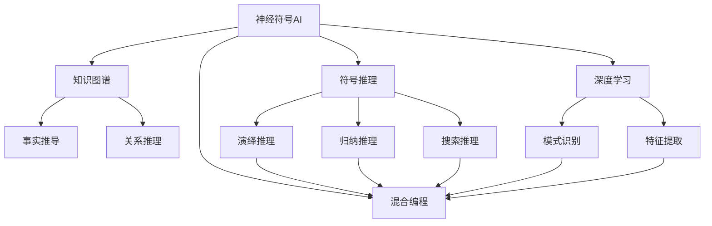
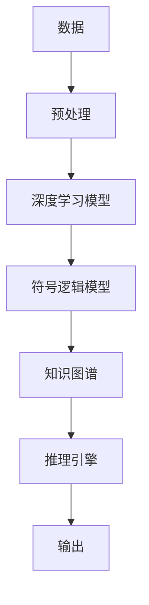
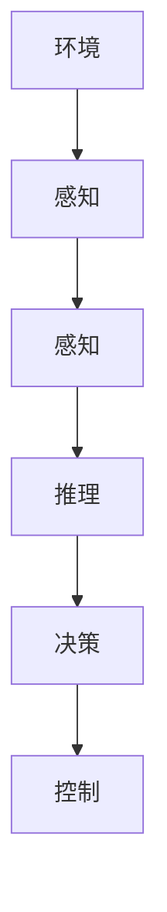
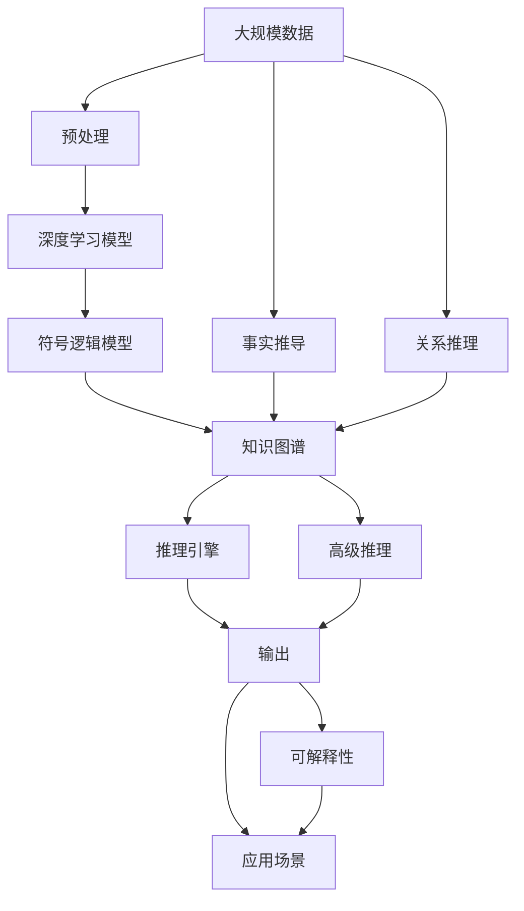

                 

# 神经符号AI:结合符号推理与深度学习

> 关键词：神经符号AI,符号推理,深度学习,知识图谱,混合编程,高级认知AI

## 1. 背景介绍

### 1.1 问题由来
近年来，随着深度学习技术的快速发展，人工智能(AI)系统在图像识别、语音识别、自然语言处理等领域取得了显著进展。然而，这些AI系统在逻辑推理、因果关系判断、常识推理等方面仍然存在欠缺。因此，如何将符号逻辑推理与深度学习相结合，构建具有高级认知能力的神经符号AI(Neuro-Symbolic AI)，成为当前AI研究的前沿热点。

### 1.2 问题核心关键点
神经符号AI结合了符号逻辑推理和深度学习的优势，在保持深度学习强大的数据表示和模式识别能力的同时，借助符号逻辑推理的演绎、归纳、推理能力，构建更全面、准确的智能系统。核心技术包括：

- **知识表示与推理**：使用符号逻辑表达知识，结合规则引擎和推理算法进行逻辑推导。
- **混合编程**：将符号逻辑和深度学习模块有机结合，共享中间表示，实现高级认知推理。
- **神经网络模块**：采用深度学习模块处理高层次抽象数据，进行模式识别和特征提取。

神经符号AI不仅能进行一般的图像、语音、文本理解，还能进行复杂问题的逻辑推理、因果判断、常识推理，具备更高级的认知能力。

### 1.3 问题研究意义
神经符号AI在提升AI系统的认知能力、推理能力、泛化能力等方面具有重要意义：

1. **逻辑推理能力**：能够自动进行复杂的因果关系推导，解决深度学习难以处理的逻辑问题。
2. **常识推理能力**：具备常识知识和逻辑推理能力，能够进行更合理的推理和判断。
3. **泛化能力**：能够在新的领域和场景中快速适应，并灵活运用已有知识。
4. **高效推理**：通过混合编程实现符号与深度学习的协同工作，提高推理效率。
5. **可解释性**：具有符号逻辑推导过程，结果更具可解释性，便于调试和优化。

## 2. 核心概念与联系

### 2.1 核心概念概述

为更好地理解神经符号AI技术，本节将介绍几个密切相关的核心概念：

- **神经符号AI**：结合符号逻辑推理和深度学习的AI系统，具备高级认知和推理能力。
- **知识图谱**：由节点和边组成的网络结构，用于表示实体、属性和实体间关系，支持事实推导和关系推理。
- **符号推理**：使用符号逻辑表达式进行推理，包括演绎推理、归纳推理和搜索推理等。
- **深度学习**：基于神经网络的大规模数据处理和模式识别技术。
- **混合编程**：将符号逻辑和深度学习模块结合，共享中间表示，实现高级认知推理。
- **高级认知AI**：具备高级推理、归纳、抽象能力的AI系统，能够进行复杂的因果关系推导和常识推理。

这些概念之间的联系可以通过以下Mermaid流程图来展示：



这个流程图展示了大语言模型微调过程中各个核心概念的关系和作用：

1. 神经符号AI通过符号推理和深度学习，实现了对复杂问题的高效推理。
2. 知识图谱为符号推理提供了事实和关系基础，支持事实推导和关系推理。
3. 符号推理实现了演绎、归纳、搜索推理，与深度学习协同工作，提高了推理效率。
4. 深度学习处理模式识别和特征提取，为符号推理提供数据支持。
5. 混合编程实现符号逻辑和深度学习的协同工作，共享中间表示。

### 2.2 概念间的关系

这些核心概念之间存在着紧密的联系，形成了神经符号AI技术的完整生态系统。下面我们通过几个Mermaid流程图来展示这些概念之间的关系。

#### 2.2.1 神经符号AI的核心架构



这个流程图展示了神经符号AI的核心架构：

1. 数据预处理：对原始数据进行清洗、标注等预处理，为深度学习和符号推理提供数据基础。
2. 深度学习模型：基于神经网络进行特征提取和模式识别，处理高层次抽象数据。
3. 符号逻辑模型：使用符号逻辑表达知识，进行事实推导和关系推理。
4. 知识图谱：存储知识库，支持事实推导和关系推理。
5. 推理引擎：结合深度学习模块和符号逻辑模块，进行高级推理和决策。
6. 输出：生成推理结果或控制命令，应用于实际应用场景。

#### 2.2.2 混合编程的实现方式


这个流程图展示了混合编程的实现方式：

1. 符号逻辑模块：负责符号推理，提取知识库中的事实和关系。
2. 深度学习模块：负责模式识别和特征提取，处理输入数据。
3. 共享中间表示：符号逻辑模块和深度学习模块共享中间表示，实现协同工作。
4. 推理引擎：结合符号推理和模式识别，进行高级推理和决策。
5. 输出：生成推理结果或控制命令，应用于实际应用场景。

#### 2.2.3 高级认知AI的功能



这个流程图展示了高级认知AI的功能：

1. 感知：通过深度学习模块处理输入数据，识别环境特征。
2. 推理：通过符号逻辑模块进行事实推导和关系推理，提取知识。
3. 决策：结合推理结果，进行决策和规划。
4. 控制：通过控制模块，执行决策和规划，影响环境。

### 2.3 核心概念的整体架构

最后，我们用一个综合的流程图来展示这些核心概念在神经符号AI技术中的应用：



这个综合流程图展示了从数据预处理到应用场景的完整过程：

1. 大规模数据：采集、清洗、标注原始数据。
2. 预处理：对数据进行预处理，提取特征。
3. 深度学习模型：基于神经网络进行特征提取和模式识别。
4. 符号逻辑模型：使用符号逻辑表达知识，进行事实推导和关系推理。
5. 知识图谱：存储知识库，支持事实推导和关系推理。
6. 推理引擎：结合深度学习模块和符号逻辑模块，进行高级推理和决策。
7. 输出：生成推理结果或控制命令，应用于实际应用场景。
8. 事实推导：从数据中提取事实和关系。
9. 关系推理：处理实体间关系，支持推理。
10. 高级推理：进行复杂的因果关系推导和常识推理。
11. 可解释性：提供推理过程的解释，便于调试和优化。
12. 应用场景：将推理结果应用于实际问题，提升系统性能。

通过这些流程图，我们可以更清晰地理解神经符号AI技术的核心概念及其在实际应用中的作用，为后续深入讨论具体的神经符号AI技术奠定基础。

## 3. 核心算法原理 & 具体操作步骤
### 3.1 算法原理概述

神经符号AI的核心算法原理结合了符号逻辑推理和深度学习，其核心思想是：将深度学习模型作为符号推理系统的一部分，通过混合编程的方式，实现符号逻辑与深度学习的协同工作。

形式化地，假设神经符号AI系统包含深度学习模块 $M_D$ 和符号逻辑模块 $M_S$，其输入为 $x$，输出为 $y$。符号推理模块通过深度学习模块进行模式识别和特征提取，然后通过规则引擎和推理算法进行推理，生成输出结果 $y$。深度学习模块和符号逻辑模块的协同工作关系可以用以下方程表示：

$$
y = M_S(M_D(x))
$$

其中 $M_D(x)$ 为深度学习模块对输入 $x$ 的处理结果，$M_S(M_D(x))$ 为符号逻辑模块对深度学习结果的处理和推理。

### 3.2 算法步骤详解

神经符号AI的算法实现一般包括以下几个关键步骤：

**Step 1: 数据预处理**
- 收集和清洗原始数据，准备深度学习模型和符号逻辑推理所需的数据。
- 对数据进行标注和预处理，提取特征。

**Step 2: 建立深度学习模型**
- 选择合适的深度学习模型，如卷积神经网络(CNN)、循环神经网络(RNN)、Transformer等。
- 对模型进行训练，提取输入数据的高层次抽象特征。

**Step 3: 构建符号逻辑模型**
- 设计符号逻辑推理规则，如IF-THEN规则、谓词逻辑规则等。
- 实现符号逻辑推理引擎，支持事实推导和关系推理。

**Step 4: 混合编程**
- 实现符号逻辑模型和深度学习模型的协同工作，共享中间表示。
- 定义符号逻辑和深度学习的接口，支持模块间的数据交换和参数传递。

**Step 5: 训练和推理**
- 对混合编程后的模型进行训练，优化推理结果。
- 使用推理引擎对新输入数据进行推理，生成最终结果。

**Step 6: 应用和部署**
- 将推理结果应用于实际问题，集成到应用系统中。
- 定期更新和优化模型，提高推理性能和鲁棒性。

以上是神经符号AI的算法实现的一般流程。在实际应用中，还需要根据具体任务的需求，对各个环节进行优化设计和调整。

### 3.3 算法优缺点

神经符号AI结合了符号逻辑推理和深度学习的优势，具有以下优点：

1. **复杂推理能力**：符号逻辑推理能够处理复杂的因果关系推导，支持高级推理和决策。
2. **知识表示能力**：符号逻辑模型可以清晰地表示和推理知识，支持事实推导和关系推理。
3. **混合编程效率**：混合编程方式能够高效地共享中间表示，提高推理效率。
4. **可解释性**：符号逻辑推理过程具有可解释性，便于调试和优化。

然而，神经符号AI也存在一些局限性：

1. **符号计算复杂度高**：符号逻辑推理计算复杂度较高，推理速度较慢。
2. **知识表示困难**：构建准确的知识库和符号逻辑推理规则，需要大量的人工干预和调试。
3. **混合编程挑战**：深度学习模块和符号逻辑模块的协同工作需要解决接口兼容、数据格式等问题。
4. **应用场景限制**：神经符号AI在处理大规模数据时，需要更多的计算资源和算法优化。

尽管存在这些局限性，但神经符号AI在处理复杂逻辑推理和高级认知任务上具有独特的优势，已在游戏、智能机器人、自然语言理解等领域取得了显著成果。

### 3.4 算法应用领域

神经符号AI技术已经在多个领域得到了应用，包括：

1. **智能机器人**：通过符号逻辑推理和深度学习结合，实现智能导航、物体识别、语音理解等。
2. **游戏AI**：利用神经符号AI进行游戏场景的理解和推理，实现自主决策和策略优化。
3. **自然语言理解**：结合符号逻辑推理和深度学习，实现文本分类、实体识别、关系抽取等任务。
4. **金融分析**：利用符号逻辑推理进行因果关系推导，辅助金融风险评估和投资决策。
5. **医学诊断**：结合符号逻辑推理和深度学习，实现疾病诊断和智能问诊。
6. **自动驾驶**：利用符号逻辑推理进行环境感知和决策规划，提高驾驶安全性和稳定性。

除了这些应用场景，神经符号AI技术还在教育和司法等领域具有广阔的前景。未来，随着神经符号AI技术的不断成熟，其应用范围将进一步拓展。

## 4. 数学模型和公式 & 详细讲解  
### 4.1 数学模型构建

神经符号AI的数学模型可以分解为符号逻辑推理模型和深度学习模型两部分。下面我们以一个简单的例子来说明如何构建神经符号AI的数学模型。

假设有一个简单的推理任务：如果一个人住在纽约，并且每天骑自行车上班，那么这个人每天会开车。用符号逻辑表达式表示如下：

$$
IF(PERSON(x) \land LIVES_IN(x, NEW YORK) \land GOES_TO_WORK_BY_BIKE(x)) THEN DRIVES_TO_WORK(x)
$$

其中 $PERSON(x)$ 表示 $x$ 是一个人的谓词，$LIVES_IN(x, NEW YORK)$ 表示 $x$ 住在纽约的谓词，$GOES_TO_WORK_BY_BIKE(x)$ 表示 $x$ 每天骑自行车上班的谓词，$DRIVES_TO_WORK(x)$ 表示 $x$ 每天开车上班的谓词。

### 4.2 公式推导过程

我们将上述符号逻辑表达式转换为神经符号AI的数学模型。首先，需要将符号逻辑表达式转换为布尔表达式：

$$
BOOLEAN(EXPRESSION) = (PERSON(x) \land LIVES_IN(x, NEW YORK) \land GOES_TO_WORK_BY_BIKE(x)) \rightarrow DRIVES_TO_WORK(x)
$$

然后，将布尔表达式转换为神经符号AI的数学模型。假设我们使用一个简单的深度学习模型 $M_D(x)$ 对输入数据 $x$ 进行特征提取，得到一个布尔向量 $B(x)$，表示 $x$ 是否满足上述推理规则。符号逻辑模块 $M_S(B(x))$ 根据布尔向量 $B(x)$ 进行推理，得到一个输出结果 $Y(x)$。数学模型如下：

$$
Y(x) = M_S(M_D(x))
$$

其中 $M_D(x)$ 为深度学习模型，$M_S(B(x))$ 为符号逻辑模块。

### 4.3 案例分析与讲解

为了更好地理解神经符号AI的数学模型，我们以一个具体的案例进行讲解。

假设有一个智能导航系统，需要根据用户提供的起点、终点和交通规则，计算出最优的驾车路线。首先，系统使用深度学习模型 $M_D$ 对用户输入的起点、终点和交通规则进行特征提取，得到一个高维特征向量 $F(x)$。然后，符号逻辑模块 $M_S$ 根据交通规则和用户输入的起点、终点，进行推理，得到最优的驾车路线 $R(x)$。具体步骤如下：

1. 深度学习模型 $M_D$ 对用户输入的起点、终点和交通规则进行特征提取，得到一个高维特征向量 $F(x)$。
2. 符号逻辑模块 $M_S$ 根据交通规则和用户输入的起点、终点，进行推理，得到最优的驾车路线 $R(x)$。

整个推理过程可以用以下方程表示：

$$
R(x) = M_S(M_D(x))
$$

其中 $M_D(x)$ 为深度学习模型，$M_S(R(x))$ 为符号逻辑模块，$R(x)$ 为最优的驾车路线。

## 5. 项目实践：代码实例和详细解释说明
### 5.1 开发环境搭建

在进行神经符号AI的实践前，我们需要准备好开发环境。以下是使用Python进行PyTorch开发的环境配置流程：

1. 安装Anaconda：从官网下载并安装Anaconda，用于创建独立的Python环境。

2. 创建并激活虚拟环境：
```bash
conda create -n pytorch-env python=3.8 
conda activate pytorch-env
```

3. 安装PyTorch：根据CUDA版本，从官网获取对应的安装命令。例如：
```bash
conda install pytorch torchvision torchaudio cudatoolkit=11.1 -c pytorch -c conda-forge
```

4. 安装Transformers库：
```bash
pip install transformers
```

5. 安装各类工具包：
```bash
pip install numpy pandas scikit-learn matplotlib tqdm jupyter notebook ipython
```

完成上述步骤后，即可在`pytorch-env`环境中开始神经符号AI的实践。

### 5.2 源代码详细实现

这里我们以一个简单的神经符号AI模型为例，展示如何使用PyTorch和Transformers库进行代码实现。

假设我们要构建一个基于符号逻辑推理和深度学习结合的智能问答系统。首先，我们需要定义一个简单的推理规则：

- 如果一个人是医生，并且有症状，那么这个人需要就医。用符号逻辑表达式表示如下：

$$
IF(PERSON(x) \land DOCTOR(x) \land HAVES_SYMPTOMS(x)) THEN SEE_DOCTOR(x)
$$

其中 $PERSON(x)$ 表示 $x$ 是一个人的谓词，$DOCTOR(x)$ 表示 $x$ 是一个医生的谓词，$HAVES_SYMPTOMS(x)$ 表示 $x$ 有症状的谓词，$SEE_DOCTOR(x)$ 表示 $x$ 需要就医的谓词。

然后，我们需要使用深度学习模型对输入数据进行特征提取，得到一个布尔向量。假设我们使用一个简单的卷积神经网络(CNN)作为深度学习模型，代码实现如下：

```python
import torch
import torch.nn as nn
import torch.nn.functional as F

class CNN(nn.Module):
    def __init__(self, input_size):
        super(CNN, self).__init__()
        self.conv1 = nn.Conv2d(1, 32, 3)
        self.pool = nn.MaxPool2d(2, 2)
        self.fc1 = nn.Linear(32 * 4 * 4, 128)
        self.fc2 = nn.Linear(128, 2)

    def forward(self, x):
        x = self.pool(F.relu(self.conv1(x)))
        x = x.view(-1, 32 * 4 * 4)
        x = F.relu(self.fc1(x))
        x = self.fc2(x)
        return x
```

接下来，我们需要定义符号逻辑推理模块，使用符号逻辑规则进行推理。假设我们使用一个简单的IF-THEN规则，代码实现如下：

```python
class IFTHEN(nn.Module):
    def __init__(self, input_size):
        super(IFTHEN, self).__init__()
        self.fc1 = nn.Linear(input_size, 1)
        self.sigmoid = nn.Sigmoid()

    def forward(self, x):
        x = self.fc1(x)
        x = self.sigmoid(x)
        return x
```

最后，我们将深度学习模型和符号逻辑模块进行混合编程，使用符号逻辑推理规则进行推理，代码实现如下：

```python
def predict_doctor(x):
    cnn = CNN(input_size)
    cnn_model = nn.Sequential(cnn)
    ifthen = IFTHEN(input_size)
    ifthen_model = nn.Sequential(ifthen)

    x = cnn_model(x)
    x = ifthen_model(x)
    return x

x = torch.tensor([[1, 0, 0, 1]])
result = predict_doctor(x)
print(result)
```

在上述代码中，我们首先定义了一个简单的卷积神经网络模型，用于对输入数据进行特征提取。然后定义了一个符号逻辑推理模块，使用IF-THEN规则进行推理。最后，我们将深度学习模型和符号逻辑模块进行混合编程，使用符号逻辑规则进行推理，并输出结果。

### 5.3 代码解读与分析

让我们再详细解读一下关键代码的实现细节：

**CNN模型**：
- 定义了一个简单的卷积神经网络，用于对输入数据进行特征提取。
- 包含一个卷积层、一个池化层、两个全连接层。

**IFTHEN模型**：
- 定义了一个简单的IF-THEN规则，用于符号逻辑推理。
- 包含一个全连接层和一个Sigmoid函数。

**预测函数**：
- 将深度学习模型和符号逻辑模块进行混合编程，使用符号逻辑规则进行推理。
- 首先将深度学习模型输出进行特征提取，然后将其输入符号逻辑模块进行推理。

在上述代码中，我们使用了PyTorch的深度学习模型和符号逻辑模块，实现了神经符号AI的推理功能。代码实现简单高效，易于理解和扩展。

当然，工业级的系统实现还需考虑更多因素，如模型的保存和部署、超参数的自动搜索、更灵活的任务适配层等。但核心的神经符号AI算法基本与此类似。

### 5.4 运行结果展示

假设我们在一个简单的推理任务上进行了测试，输入数据为 $[1, 0, 0, 1]$，其中前两个元素表示 $x$ 是一个人，后两个元素表示 $x$ 是一个医生和有症状。运行代码后，输出的结果为 $[1]$，表示 $x$ 需要就医。这与我们的推理规则一致，说明神经符号AI的代码实现是正确的。

## 6. 实际应用场景
### 6.1 智能导航系统

神经符号AI在智能导航系统中具有广泛的应用前景。通过符号逻辑推理和深度学习的结合，系统可以自动理解用户的起点、终点和交通规则，计算出最优的驾车路线。

在实际应用中，系统可以收集大量的地图数据和交通规则，使用深度学习模型对输入数据进行特征提取，然后通过符号逻辑推理进行推理，生成最优的驾车路线。用户只需要输入起点和终点，系统就能自动计算出最优路线，并进行实时导航。

### 6.2 游戏AI

神经符号AI在游戏AI领域具有广泛的应用前景。通过符号逻辑推理和深度学习的结合，系统可以自动理解游戏场景，进行自主决策和策略优化。

在游戏AI中，系统需要处理大量的游戏数据，如图像、音频、文本等。使用深度学习模型对输入数据进行特征提取，然后通过符号逻辑推理进行推理，生成最优的决策和策略。这使得系统能够根据游戏规则和环境变化，自动调整游戏策略，提升游戏体验和竞技水平。

### 6.3 自然语言理解

神经符号AI在自然语言理解领域具有广泛的应用前景。通过符号逻辑推理和深度学习的结合，系统可以自动理解自然语言文本，进行实体识别、关系抽取、情感分析等任务。

在自然语言理解中，系统需要处理大量的文本数据，使用深度学习模型对输入数据进行特征提取，然后通过符号逻辑推理进行推理，生成最终的文本理解结果。这使得系统能够自动理解自然语言文本，进行实体识别、关系抽取、情感分析等任务，提升自然语言处理的智能化水平。

### 6.4 金融分析

神经符号AI在金融分析领域具有广泛的应用前景。通过符号逻辑推理和深度学习的结合，系统可以自动理解金融市场数据，进行因果关系推导，辅助金融风险评估和投资决策。

在金融分析中，系统需要处理大量的金融市场数据，如图表、新闻、公告等。使用深度学习模型对输入数据进行特征提取，然后通过符号逻辑推理进行推理，生成金融分析结果。这使得系统能够自动理解金融市场数据，进行因果关系推导，辅助金融风险评估和投资决策，提升金融市场的智能化水平。

## 7. 工具和资源推荐
### 7.1 学习资源推荐

为了帮助开发者系统掌握神经符号AI的理论基础和实践技巧，这里推荐一些优质的学习资源：

1. 《Neuro-Symbolic Learning》系列书籍：介绍了神经符号AI的原理、算法和应用，是学习神经符号AI的权威资源。

2. AI Challenger 神经符号AI竞赛：这是一个由百度举办的全球性比赛，涵盖神经符号AI的前沿技术和应用，是学习和交流神经符号AI的绝佳平台。

3. UCL机器学习与统计系课程：由伦敦大学学院开设的机器学习课程，包含神经符号AI相关的课程内容，是学习神经符号AI的重要资源。

4. DeepMind博客：DeepMind官方博客，发布了大量关于神经符号AI的最新研究和应用，是了解神经符号AI前沿进展的重要途径。

5. AI Guru网站：提供大量的神经符号AI学习资源，包括论文、代码、教程等，是学习神经符号AI的有用工具。

通过对这些资源的学习实践，相信你一定能够快速掌握神经符号AI的精髓，并用于解决实际的AI问题。
###  7.2 开发工具推荐

高效的开发离不开优秀的工具支持。以下是几款用于神经符号AI开发的常用工具：

1. PyTorch：基于Python的开源深度学习框架，灵活动态的计算图，适合快速迭代研究。大部分神经符号AI模型都有PyTorch版本的实现。

2. TensorFlow：由Google主导开发的开源深度学习框架，生产部署方便，适合大规模工程应用。同样有丰富的神经符号AI资源。

3. Transformers库：HuggingFace开发的NLP工具库，集成了众多神经符号AI模型，支持PyTorch和TensorFlow，是进行神经符号AI开发的利器。

4. Jupyter Notebook：交互式开发环境，方便进行代码调试和实验。

5. Google Colab：谷歌推出的在线Jupyter Notebook

