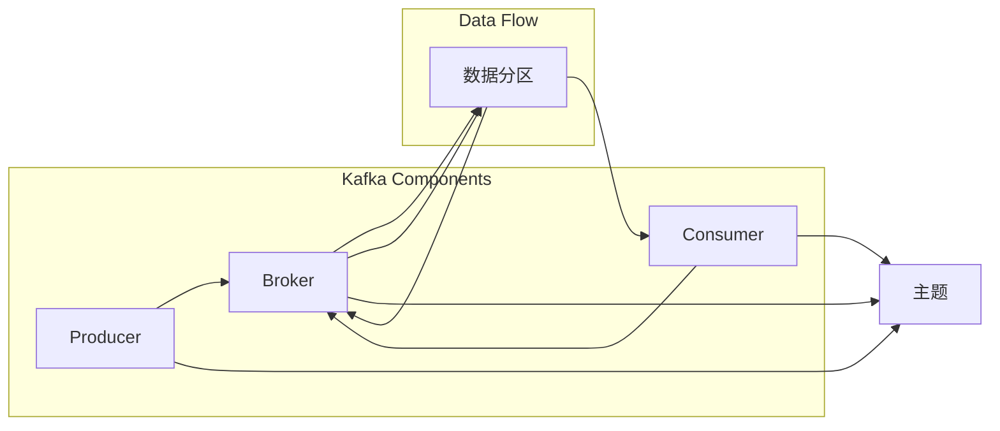

# Kafka原理与代码实例讲解

> 关键词：Kafka, 消息队列, 分布式系统, 事件驱动, 水平扩展, 高吞吐量, 持久化, 原子性

## 1. 背景介绍

Kafka是一个由LinkedIn开源的高吞吐量分布式发布-订阅消息系统，它最初用于处理社交活动数据，后来成为Apache软件基金会的一部分。Kafka因其高吞吐量、可扩展性和可持久化的特性，在处理流式数据应用中变得非常流行。本文将深入探讨Kafka的原理，并通过代码实例进行详细讲解。

### 1.1 问题的由来

在分布式系统中，数据流处理是一个常见需求。为了实现数据的实时收集、存储和分发，需要一种可靠的消息队列系统。传统的消息队列系统如RabbitMQ、ActiveMQ等，虽然功能强大，但在高吞吐量、分布式架构和持久化方面存在一定的局限性。

### 1.2 研究现状

Kafka通过以下特点解决了传统消息队列的局限性：

- **高吞吐量**：Kafka能够处理每秒数百万条消息，适用于大规模消息处理场景。
- **可扩展性**：Kafka是无状态的，可以在水平扩展中无缝增加更多的节点。
- **持久化**：Kafka的消息存储在磁盘上，即使在系统故障的情况下也不会丢失。
- **分布式**：Kafka支持分布式部署，可以在多台服务器上运行，提供高可用性。

### 1.3 研究意义

Kafka在实时数据流处理、日志聚合、事件源等领域有着广泛的应用。了解Kafka的原理对于开发高性能分布式系统具有重要意义。

### 1.4 本文结构

本文将按照以下结构进行：

- 第2部分介绍Kafka的核心概念与联系。
- 第3部分详细讲解Kafka的核心算法原理和具体操作步骤。
- 第4部分探讨Kafka的数学模型和公式。
- 第5部分通过代码实例讲解Kafka的使用。
- 第6部分分析Kafka的实际应用场景。
- 第7部分展望Kafka的未来发展趋势与挑战。
- 第8部分总结全文，并给出常见问题与解答。

## 2. 核心概念与联系

### 2.1 核心概念

- **Producer**：生产者，负责将数据发送到Kafka主题。
- **Broker**：代理，Kafka集群中的服务器，负责存储和转发消息。
- **Topic**：主题，消息的分类，每个主题可以有多个分区，分区是数据存储的单位。
- **Partition**：分区，主题的一个分区，数据会按顺序写入各个分区。
- **Consumer**：消费者，从Kafka主题中读取消息。
- **Consumer Group**：消费者组，多个消费者组成一个组，共同消费同一个主题的消息。

### 2.2 Mermaid流程图



### 2.3 关联关系

- 生产者将消息发送到指定的主题。
- 主题被分割成多个分区，每个分区存储在集群中的不同代理上。
- 消费者从主题的分区中读取消息，可以是一个消费者也可以是消费者组中的多个消费者。

## 3. 核心算法原理 & 具体操作步骤

### 3.1 算法原理概述

Kafka使用分布式存储和复制机制来保证数据的持久性和高可用性。以下是Kafka的核心算法原理：

- **分布式存储**：Kafka将消息存储在磁盘上，每个分区对应一个日志文件。
- **数据复制**：Kafka使用副本机制来保证数据的冗余，每个分区有多个副本分布在不同的代理上。
- **消息有序性**：Kafka保证同一个分区内消息的顺序性，但不同分区之间没有顺序保证。
- **消息分区**：Kafka使用哈希函数将消息分配到不同的分区，以便于负载均衡。

### 3.2 算法步骤详解

1. 生产者将消息发送到Kafka集群，指定主题和键。
2. Kafka集群使用哈希函数将消息分配到指定的主题和分区。
3. 消息被存储在分区的日志文件中，并立即复制到其他副本上。
4. 消费者从Kafka集群中读取消息，可以指定消费的分区和偏移量。
5. 如果发生故障，Kafka集群会自动从副本中恢复数据。

### 3.3 算法优缺点

**优点**：

- **高吞吐量**：Kafka能够处理每秒数百万条消息。
- **高可用性**：Kafka使用副本机制来保证数据的持久性和高可用性。
- **可扩展性**：Kafka可以水平扩展，以支持更大的数据量。

**缺点**：

- **单分区性能**：每个分区的性能与代理的CPU和磁盘I/O性能相关。
- **分区管理**：分区管理需要一定的专业知识。

### 3.4 算法应用领域

- 实时数据流处理
- 日志聚合
- 事件源
- 微服务架构

## 4. 数学模型和公式 & 详细讲解 & 举例说明

### 4.1 数学模型构建

Kafka的数学模型主要包括以下部分：

- **消息大小**：$M$ (字节)
- **分区数量**：$P$
- **副本数量**：$R$
- **代理数量**：$B$

### 4.2 公式推导过程

- **吞吐量**：$T = \frac{M}{P \times R \times B}$
- **数据持久性**：$P = \frac{T \times B}{M}$
- **系统可靠性**：$R = \frac{1}{P}$

### 4.3 案例分析与讲解

假设我们有一个包含10个分区的Kafka集群，每个分区有3个副本，每个代理可以处理100MB/s的数据。

- **吞吐量**：$T = \frac{100 \times 10 \times 3}{10} = 300MB/s$
- **数据持久性**：$P = \frac{300 \times 10}{100} = 30MB$
- **系统可靠性**：$R = \frac{1}{10} = 0.1$

这意味着我们的系统可以处理每秒300MB的数据，数据持久性为30MB，系统可靠性为0.1。

## 5. 项目实践：代码实例和详细解释说明

### 5.1 开发环境搭建

为了运行Kafka代码实例，我们需要搭建一个Kafka集群。以下是使用Docker运行Kafka集群的步骤：

1. 安装Docker。
2. 下载Kafka镜像：`docker pull konradkleine/kafka:2.8.0`。
3. 运行Kafka集群：`docker run -d -p 9092:9092 --name kafka1 konradkleine/kafka:2.8.0`。

### 5.2 源代码详细实现

以下是一个简单的Kafka生产者和消费者的Python代码实例：

```python
from kafka import KafkaProducer, KafkaConsumer

# 生产者
producer = KafkaProducer(bootstrap_servers=['kafka1:9092'])

producer.send('test-topic', b'Hello, Kafka!')
producer.flush()
```

```python
# 消费者
consumer = KafkaConsumer('test-topic', bootstrap_servers=['kafka1:9092'])

for message in consumer:
    print(message.value.decode('utf-8'))
```

### 5.3 代码解读与分析

- 生产者代码：创建一个Kafka生产者实例，将消息发送到名为`test-topic`的主题。
- 消费者代码：创建一个Kafka消费者实例，从名为`test-topic`的主题读取消息。

### 5.4 运行结果展示

运行消费者代码，将会看到以下输出：

```
Hello, Kafka!
```

这表明我们已经成功地从Kafka主题中读取了消息。

## 6. 实际应用场景

Kafka在以下场景中有广泛的应用：

- **实时日志聚合**：将来自不同服务器的日志聚合到中央日志系统，方便监控和分析。
- **事件源**：存储应用程序的重要事件，以便于审计和回溯。
- **实时数据流处理**：处理来自各种传感器的实时数据，如点击流、交易数据等。

## 7. 工具和资源推荐

### 7.1 学习资源推荐

- Kafka官方文档：[https://kafka.apache.org/documentation/](https://kafka.apache.org/documentation/)
- 《Kafka权威指南》：详细介绍了Kafka的原理和使用方法。
- 《Apache Kafka实战》：通过实际案例讲解Kafka的应用。

### 7.2 开发工具推荐

- Docker：用于容器化Kafka集群。
- Kafka Manager：用于监控和管理Kafka集群。

### 7.3 相关论文推荐

- Apache Kafka: A Distributed Streaming Platform

## 8. 总结：未来发展趋势与挑战

### 8.1 研究成果总结

Kafka作为一种高性能、可扩展的消息队列系统，在分布式系统中有着广泛的应用。本文深入探讨了Kafka的原理，并通过代码实例进行了讲解。

### 8.2 未来发展趋势

- **更高效的消息处理**：Kafka将继续优化其消息处理能力，提高吞吐量和性能。
- **更灵活的架构**：Kafka将支持更多类型的存储后端，如云存储、分布式文件系统等。
- **更易用的API**：Kafka将继续优化其API，提高易用性。

### 8.3 面临的挑战

- **数据安全**：如何保证数据的安全性和隐私性。
- **系统可扩展性**：如何更好地处理大规模集群的扩展。
- **跨语言支持**：如何提高Kafka在多种编程语言中的支持。

### 8.4 研究展望

Kafka将继续作为分布式系统中重要的消息队列系统，推动分布式系统的进一步发展。

## 9. 附录：常见问题与解答

**Q1：Kafka如何保证消息的顺序性？**

A1：Kafka保证同一个分区内消息的顺序性，但不同分区之间没有顺序保证。如果需要保证全局顺序性，可以将所有消息发送到同一个分区。

**Q2：Kafka的副本机制如何工作？**

A2：Kafka使用副本机制来保证数据的持久性和高可用性。每个分区有多个副本，分布在不同的代理上。如果主副本发生故障，Kafka会自动从副本中恢复数据。

**Q3：Kafka的吞吐量如何衡量？**

A3：Kafka的吞吐量可以通过每秒处理的消息数量来衡量。可以使用生产者发送消息，并计算每秒发送的消息数量。

**Q4：Kafka的集群如何扩展？**

A4：Kafka可以通过添加更多的代理来水平扩展集群。在添加代理后，Kafka会自动将分区迁移到新的代理上。

**Q5：Kafka适用于哪些场景？**

A5：Kafka适用于实时日志聚合、事件源、实时数据流处理、微服务架构等场景。

作者：禅与计算机程序设计艺术 / Zen and the Art of Computer Programming