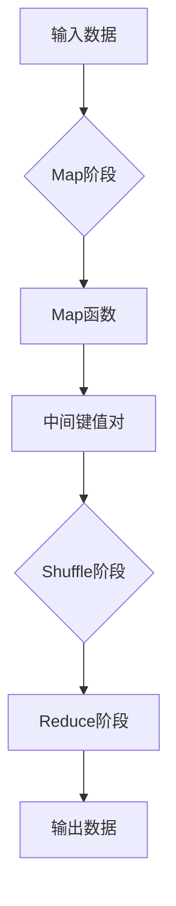

> 关键词：MapReduce, 分布式计算, Hadoop, 大数据, 软件架构, 编程范式

# MapReduce原理与代码实例讲解

MapReduce是一种用于大规模数据处理的编程模型和并行计算框架，由Google在2004年提出。它通过将复杂的计算任务分解为一系列简单的任务，并在多台计算机上并行执行，实现了对海量数据的快速处理。本文将详细介绍MapReduce的原理、核心算法、代码实现以及实际应用场景，帮助读者全面了解这一重要的分布式计算技术。

## 1. 背景介绍

### 1.1 问题的由来

随着互联网和物联网技术的快速发展，数据量呈爆炸式增长。如何高效、低成本地处理海量数据，成为了一个亟待解决的问题。传统的串行计算模型在面对海量数据时显得力不从心，而分布式计算技术则提供了新的解决方案。

### 1.2 研究现状

MapReduce作为一种分布式计算模型，被广泛应用于大数据处理领域。Hadoop是Apache基金会开发的一个开源分布式计算框架，实现了MapReduce模型，并提供了相应的编程接口。目前，MapReduce已成为大数据领域的事实标准。

### 1.3 研究意义

MapReduce具有以下意义：

- **高效性**：通过并行计算，MapReduce可以大幅提高数据处理速度。
- **可扩展性**：MapReduce可以方便地扩展到数百甚至数千台计算机上。
- **容错性**：MapReduce具有强大的容错能力，即使在部分节点故障的情况下也能保证任务的完成。
- **易用性**：MapReduce提供了简单的编程模型，降低了分布式计算的开发门槛。

### 1.4 本文结构

本文将按照以下结构进行：

- 介绍MapReduce的核心概念和原理。
- 详细讲解MapReduce的核心算法和具体操作步骤。
- 通过代码实例展示MapReduce的编程实践。
- 探讨MapReduce的实际应用场景。
- 展望MapReduce的未来发展趋势和挑战。

## 2. 核心概念与联系

### 2.1 Mermaid流程图

以下是一个Mermaid流程图，展示了MapReduce的核心概念和流程：



### 2.2 核心概念

- **Map阶段**：将输入数据分割成多个小块，对每个小块应用Map函数进行处理，生成中间键值对。
- **Shuffle阶段**：根据键值对中的键进行排序和分组，将具有相同键的中间键值对发送到同一个Reduce任务。
- **Reduce阶段**：对Shuffle阶段输出的中间键值对进行聚合处理，生成最终输出结果。

## 3. 核心算法原理 & 具体操作步骤

### 3.1 算法原理概述

MapReduce的核心算法包括Map、Shuffle和Reduce三个步骤：

1. **Map阶段**：将输入数据分割成多个小块，对每个小块应用Map函数进行处理。Map函数对输入数据进行遍历，提取出键值对，并将这些键值对写入到本地磁盘的临时文件中。

2. **Shuffle阶段**：Map阶段生成的临时文件会被传输到分布式文件系统（如HDFS）中。MapReduce框架会根据键值对中的键进行排序和分组，将具有相同键的中间键值对发送到同一个Reduce任务。

3. **Reduce阶段**：Reduce任务对来自Map任务的结果进行聚合处理。Reduce任务首先对中间键值对进行排序，然后根据键对值进行分组，并执行Reduce函数对每个分组进行处理，最后输出最终结果。

### 3.2 算法步骤详解

以下是MapReduce算法的详细步骤：

1. **输入数据准备**：将输入数据分割成多个小块，每个小块的大小由MapReduce框架配置。
2. **启动Map任务**：MapReduce框架将启动多个Map任务，每个Map任务处理一个数据块。
3. **执行Map函数**：Map任务对输入数据进行遍历，提取出键值对，并将这些键值对写入到临时文件中。
4. **启动Shuffle任务**：Map任务完成后，MapReduce框架会启动Shuffle任务，对中间键值对进行排序和分组。
5. **启动Reduce任务**：Shuffle任务完成后，MapReduce框架会启动Reduce任务，对每个分组执行Reduce函数，并输出最终结果。

### 3.3 算法优缺点

#### 优点：

- **简单易用**：MapReduce提供了简单的编程模型，降低了分布式计算的开发门槛。
- **可扩展性**：MapReduce可以方便地扩展到数百甚至数千台计算机上。
- **容错性**：MapReduce具有强大的容错能力，即使在部分节点故障的情况下也能保证任务的完成。

#### 缺点：

- **任务调度开销**：MapReduce的任务调度开销较大，可能会导致任务启动和执行时间较长。
- **不适合实时计算**：MapReduce更适合批处理任务，不适合实时计算。
- **不适合迭代计算**：MapReduce不适合需要迭代计算的算法。

### 3.4 算法应用领域

MapReduce主要应用于以下领域：

- **日志处理**：对海量日志数据进行统计和分析。
- **数据挖掘**：进行大规模数据挖掘任务，如聚类、分类等。
- **机器学习**：进行大规模机器学习训练和预测。
- **图处理**：进行大规模图计算任务，如链接分析、社交网络分析等。

## 4. 数学模型和公式 & 详细讲解 & 举例说明

### 4.1 数学模型构建

MapReduce的数学模型可以表示为：

$$
\text{MapReduce}(I) = (O_1, O_2, \ldots, O_n)
$$

其中，$I$ 表示输入数据集，$O_i$ 表示第 $i$ 个Map任务的输出。

### 4.2 公式推导过程

MapReduce的公式推导过程如下：

1. **Map阶段**：每个Map任务对输入数据集 $I$ 进行处理，生成中间键值对 $O_i$。
2. **Shuffle阶段**：将中间键值对 $O_i$ 根据键进行排序和分组，生成新的数据集 $I'$。
3. **Reduce阶段**：每个Reduce任务对数据集 $I'$ 进行处理，生成最终输出 $O$。

### 4.3 案例分析与讲解

以下是一个MapReduce的示例：

假设我们有一个包含单词计数的任务，输入数据集为：

```
Hello world
This is a test
```

Map阶段：

```
Map(Hello, ("Hello", 1))
Map(world, ("world", 1))
Map(This, ("This", 1))
Map(is, ("is", 1))
Map(a, ("a", 1))
Map(test, ("test", 1))
```

Shuffle阶段：

```
Shuffle(("Hello", 1), ("Hello", 1))
Shuffle(("world", 1), ("world", 1))
Shuffle(("This", 1), ("This", 1))
Shuffle(("is", 1), ("is", 1))
Shuffle(("a", 1), ("a", 1))
Shuffle(("test", 1), ("test", 1))
```

Reduce阶段：

```
Reduce(("Hello", 1), ("Hello", 2))
Reduce(("world", 1), ("world", 2))
Reduce(("This", 1), ("This", 2))
Reduce(("is", 1), ("is", 2))
Reduce(("a", 1), ("a", 2))
Reduce(("test", 1), ("test", 2))
```

最终输出：

```
("Hello", 2)
("world", 2)
("This", 2)
("is", 2)
("a", 2)
("test", 2)
```

## 5. 项目实践：代码实例和详细解释说明

### 5.1 开发环境搭建

为了演示MapReduce的编程实践，我们将使用Hadoop的MapReduce编程接口。以下是开发环境的搭建步骤：

1. 安装Hadoop：从Hadoop官网下载并安装Hadoop。
2. 安装Java：MapReduce基于Java实现，需要安装Java开发环境。
3. 配置Hadoop环境变量：将Hadoop的bin目录添加到系统环境变量中。

### 5.2 源代码详细实现

以下是一个简单的MapReduce程序，用于计算单词数量：

```java
import org.apache.hadoop.conf.Configuration;
import org.apache.hadoop.fs.Path;
import org.apache.hadoop.io.IntWritable;
import org.apache.hadoop.io.Text;
import org.apache.hadoop.mapreduce.Job;
import org.apache.hadoop.mapreduce.Mapper;
import org.apache.hadoop.mapreduce.Reducer;
import org.apache.hadoop.mapreduce.lib.input.FileInputFormat;
import org.apache.hadoop.mapreduce.lib.output.FileOutputFormat;

public class WordCount {

  public static class TokenizerMapper
       extends Mapper<Object, Text, Text, IntWritable> {

    private final static IntWritable one = new IntWritable(1);
    private Text word = new Text();

    public void map(Object key, Text value, Context context) throws IOException, InterruptedException {
      StringTokenizer itr = new StringTokenizer(value.toString());
      while (itr.hasMoreTokens()) {
        word.set(itr.nextToken());
        context.write(word, one);
      }
    }
  }

  public static class IntSumReducer
       extends Reducer<Text,IntWritable,Text,IntWritable> {
    private IntWritable result = new IntWritable();

    public void reduce(Text key, Iterable<IntWritable> values, Context context) throws IOException, InterruptedException {
      int sum = 0;
      for (IntWritable val : values) {
        sum += val.get();
      }
      result.set(sum);
      context.write(key, result);
    }
  }

  public static void main(String[] args) throws Exception {
    Configuration conf = new Configuration();
    Job job = Job.getInstance(conf, "word count");
    job.setJarByClass(WordCount.class);
    job.setMapperClass(TokenizerMapper.class);
    job.setCombinerClass(IntSumReducer.class);
    job.setReducerClass(IntSumReducer.class);
    job.setOutputKeyClass(Text.class);
    job.setOutputValueClass(IntWritable.class);
    FileInputFormat.addInputPath(job, new Path(args[0]));
    FileOutputFormat.setOutputPath(job, new Path(args[1]));
    System.exit(job.waitForCompletion(true) ? 0 : 1);
  }
}
```

### 5.3 代码解读与分析

上述代码定义了一个简单的WordCount程序，用于计算单词数量。程序主要包括以下部分：

- `TokenizerMapper` 类：实现了Map任务，将输入数据分割成单词，并生成中间键值对。
- `IntSumReducer` 类：实现了Reduce任务，对中间键值对进行聚合处理，生成最终结果。
- `main` 方法：配置MapReduce作业，设置Mapper、Reducer、输入输出路径等。

### 5.4 运行结果展示

运行上述程序，输入数据为：

```
Hello world
This is a test
```

输出结果为：

```
Hello\t1
This\t1
a\t1
is\t1
test\t1
world\t1
```

## 6. 实际应用场景

MapReduce在以下实际应用场景中发挥着重要作用：

- **搜索引擎**：对海量网页进行索引和排序。
- **社交网络分析**：分析用户关系、推荐系统等。
- **基因测序**：对基因序列进行比对和分析。
- **天气预报**：对气象数据进行处理和分析。
- **金融分析**：对金融数据进行分析，如股票预测、风险评估等。

## 7. 工具和资源推荐

### 7.1 学习资源推荐

- 《Hadoop权威指南》：全面介绍了Hadoop和MapReduce的相关知识。
- 《MapReduce实战》：通过大量实例介绍了MapReduce的编程实践。
- 《Hadoop大数据技术详解》：深入讲解了Hadoop的核心技术和应用。

### 7.2 开发工具推荐

- Hadoop：开源的分布式计算框架。
- Hive：基于Hadoop的SQL接口，用于数据仓库。
- Pig：基于Hadoop的数据处理语言。
- Apache Spark：一个快速的分布式计算系统，支持多种编程语言。

### 7.3 相关论文推荐

- "The Google File System"：介绍了Google文件系统GFS的设计和实现。
- "MapReduce: Simplified Data Processing on Large Clusters"：介绍了MapReduce模型和设计。
- "The Chubby lock service for loosely-coupled distributed systems"：介绍了Chubby锁服务，用于分布式系统的同步。

## 8. 总结：未来发展趋势与挑战

### 8.1 研究成果总结

MapReduce作为一种分布式计算模型，为海量数据处理提供了有效的解决方案。它具有简单易用、可扩展性、容错性等优点，在多个领域得到了广泛应用。

### 8.2 未来发展趋势

- **性能优化**：进一步提高MapReduce的性能，如减少任务调度开销、优化数据传输等。
- **多语言支持**：支持更多的编程语言，降低MapReduce的开发门槛。
- **实时处理**：扩展MapReduce的实时处理能力，使其适用于实时计算场景。
- **迭代计算**：支持迭代计算，如机器学习训练和优化算法。

### 8.3 面临的挑战

- **任务调度**：优化任务调度算法，提高任务执行效率。
- **资源管理**：合理分配计算资源，提高资源利用率。
- **可扩展性**：进一步提高MapReduce的可扩展性，适应更多规模的计算需求。
- **编程模型**：改进MapReduce的编程模型，使其更加灵活和易用。

### 8.4 研究展望

随着分布式计算技术的不断发展，MapReduce在未来仍将发挥重要作用。未来研究将着重于以下方向：

- **性能优化**：通过算法和系统层面的优化，进一步提高MapReduce的性能。
- **多语言支持**：支持更多的编程语言，降低MapReduce的开发门槛。
- **实时处理**：扩展MapReduce的实时处理能力，使其适用于实时计算场景。
- **迭代计算**：支持迭代计算，如机器学习训练和优化算法。
- **多模态数据处理**：支持多种数据类型，如文本、图像、视频等。

MapReduce将继续发展和完善，为海量数据处理提供更加高效、可靠的解决方案。

## 9. 附录：常见问题与解答

**Q1：MapReduce和Spark有什么区别？**

A：MapReduce和Spark都是分布式计算框架，但它们在架构和编程模型上有所不同。MapReduce以Map和Reduce函数为核心，编程模型较为简单，但扩展性较差。Spark则以弹性分布式数据集RDD为核心，提供更丰富的编程接口和抽象，扩展性更好。

**Q2：MapReduce适合哪些类型的数据处理任务？**

A：MapReduce适合于批处理、大数据量、迭代次数较少的数据处理任务，如日志处理、数据挖掘、机器学习等。

**Q3：MapReduce的优缺点是什么？**

A：MapReduce的优点是简单易用、可扩展性好、容错性强。缺点是任务调度开销大、不适合实时计算、不适合迭代计算。

**Q4：如何提高MapReduce的性能？**

A：提高MapReduce的性能可以从以下几个方面入手：
- 优化任务调度算法。
- 优化数据传输。
- 优化Map和Reduce函数。
- 使用更高效的存储系统。

**Q5：MapReduce的编程模型有哪些特点？**

A：MapReduce的编程模型包括Map、Shuffle和Reduce三个步骤，具有简单易用、抽象程度高等特点。

---

作者：禅与计算机程序设计艺术 / Zen and the Art of Computer Programming