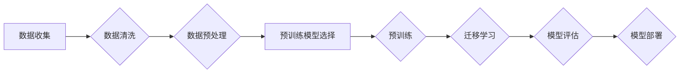

# Python深度学习实践：构建多语言模型处理国际化需求

> 关键词：多语言模型，深度学习，国际化，NLP，神经网络，自然语言处理，预训练，迁移学习，TensorFlow，PyTorch

## 1. 背景介绍

在全球化时代，国际化已经成为企业和组织发展的必然趋势。随着互联网的普及和全球化进程的加快，企业和组织需要处理来自世界各地的语言数据，以满足不同语言用户的需求。传统的基于规则的方法在处理多语言数据时往往效率低下，难以满足日益增长的国际化需求。因此，利用深度学习技术构建多语言模型，成为解决国际化挑战的重要途径。

本文将介绍如何使用Python和深度学习技术构建多语言模型，以处理国际化需求。我们将探讨核心概念、算法原理、项目实践、实际应用场景，并展望未来发展趋势和挑战。

## 2. 核心概念与联系

### 2.1 核心概念

为了更好地理解多语言模型，我们需要了解以下几个核心概念：

- **深度学习（Deep Learning）**：一种基于人工神经网络的学习方法，通过多层非线性变换学习数据的复杂特征。
- **自然语言处理（Natural Language Processing，NLP）**：研究如何让计算机理解和处理人类语言的技术。
- **预训练（Pre-training）**：在特定领域的数据上进行大规模训练，以获得通用的语言特征表示。
- **迁移学习（Transfer Learning）**：利用预训练模型在特定任务上进行微调，以提高模型在该任务上的性能。
- **多语言模型（Multilingual Model）**：能够处理多种语言的模型，通常在多种语言的数据上进行预训练。

### 2.2 架构流程图

以下是一个简单的Mermaid流程图，展示了多语言模型的构建过程：



## 3. 核心算法原理 & 具体操作步骤

### 3.1 算法原理概述

多语言模型的构建主要分为以下几个步骤：

1. 数据收集：收集多种语言的语料数据，包括文本、语音、视频等。
2. 数据清洗：去除噪声，如去除重复数据、拼写错误等。
3. 数据预处理：将数据转换为模型可处理的格式，如分词、词性标注等。
4. 预训练模型选择：选择合适的预训练模型，如BERT、XLM等。
5. 预训练：在多种语言的数据上进行预训练，学习通用的语言特征表示。
6. 迁移学习：在特定任务的数据上进行微调，以适应特定任务的需求。
7. 模型评估：评估模型在测试集上的性能。
8. 模型部署：将模型部署到实际应用中。

### 3.2 算法步骤详解

以下是多语言模型构建的具体操作步骤：

1. **数据收集**：从公开数据集、企业内部数据、第三方数据平台等渠道收集多种语言的语料数据。
2. **数据清洗**：使用数据清洗工具或自定义脚本，去除重复数据、拼写错误、噪声等。
3. **数据预处理**：将文本数据转换为模型可处理的格式，如使用分词工具进行分词、使用词性标注工具进行词性标注等。
4. **预训练模型选择**：根据任务需求选择合适的预训练模型，如BERT、XLM等。
5. **预训练**：在多种语言的数据上进行预训练，学习通用的语言特征表示。预训练过程中，通常使用自监督学习任务，如掩码语言模型（Masked Language Model，MLM）。
6. **迁移学习**：在特定任务的数据上进行微调，以适应特定任务的需求。微调过程中，通常使用监督学习任务，如分类、翻译、问答等。
7. **模型评估**：在测试集上评估模型在特定任务上的性能，如准确率、召回率、F1值等。
8. **模型部署**：将模型部署到实际应用中，如API接口、嵌入式系统等。

### 3.3 算法优缺点

**优点**：

- **通用性强**：多语言模型能够处理多种语言的数据，具有很高的通用性。
- **性能优异**：预训练模型在多种语言数据上进行预训练，学习到了丰富的语言特征表示，能够在特定任务上取得优异的性能。
- **易于迁移**：预训练模型可以作为迁移学习的起点，快速适应特定任务的需求。

**缺点**：

- **数据依赖性**：多语言模型的性能很大程度上依赖于预训练数据和微调数据的质量和数量。
- **计算资源消耗**：预训练过程需要大量的计算资源和时间。
- **可解释性**：深度学习模型的决策过程通常难以解释，对于某些应用场景可能存在安全隐患。

### 3.4 算法应用领域

多语言模型在以下领域具有广泛的应用：

- **机器翻译**：将一种语言的文本翻译成另一种语言。
- **文本分类**：对文本进行分类，如情感分析、主题分类等。
- **问答系统**：对用户的问题给出准确的答案。
- **文本摘要**：将长文本压缩成简短的摘要。
- **对话系统**：与用户进行自然对话。

## 4. 数学模型和公式 & 详细讲解 & 举例说明

### 4.1 数学模型构建

多语言模型的数学模型主要包括以下几个方面：

- **预训练模型**：如BERT、XLM等，通常采用Transformer架构。
- **任务适配层**：根据具体任务的需求，添加相应的层，如分类器、解码器等。
- **损失函数**：根据具体任务的需求，选择合适的损失函数，如交叉熵损失、均方误差损失等。

### 4.2 公式推导过程

以下是一个简单的文本分类任务的数学模型推导过程：

1. **输入表示**：将文本数据转换为模型可处理的格式，如词向量。
2. **特征提取**：使用预训练模型提取文本特征。
3. **分类器**：将提取的特征输入到分类器，得到每个类别的概率。
4. **损失函数**：使用交叉熵损失函数计算预测结果与真实标签之间的差异。

具体公式如下：

$$
\hat{y} = M_{\theta}(x) 
$$

$$
\mathcal{L}(\theta) = -\sum_{i=1}^N y_i \log \hat{y}_i 
$$

其中，$M_{\theta}(x)$ 为预训练模型，$\theta$ 为模型参数，$y_i$ 为真实标签，$\hat{y}_i$ 为预测标签。

### 4.3 案例分析与讲解

以下是一个使用PyTorch实现的多语言文本分类任务的案例：

```python
import torch
import torch.nn as nn
import transformers

# 加载预训练模型
model = transformers.AutoModelForSequenceClassification.from_pretrained("bert-base-multilingual-cased")

# 定义任务适配层
class TextClassifier(nn.Module):
    def __init__(self, num_labels):
        super().__init__()
        self.dropout = nn.Dropout(0.1)
        self.classifier = nn.Linear(model.config.hidden_size, num_labels)

    def forward(self, input_ids, attention_mask):
        outputs = model(input_ids=input_ids, attention_mask=attention_mask)
        sequence_output = outputs[0]
        logits = self.classifier(sequence_output[:, 0, :])
        return logits

# 初始化模型和优化器
num_labels = 2
text_classifier = TextClassifier(num_labels)
optimizer = torch.optim.AdamW(text_classifier.parameters(), lr=2e-5)

# 训练模型
# ...
```

以上代码展示了如何使用PyTorch和Transformers库构建一个基于BERT的多语言文本分类模型。首先，加载预训练的BERT模型，然后定义任务适配层，最后初始化模型和优化器，即可开始训练。

## 5. 项目实践：代码实例和详细解释说明

### 5.1 开发环境搭建

在进行多语言模型实践之前，我们需要搭建相应的开发环境。以下是使用Python进行TensorFlow开发的环境配置流程：

1. 安装Anaconda：从官网下载并安装Anaconda，用于创建独立的Python环境。
2. 创建并激活虚拟环境：
```bash
conda create -n tensorflow-env python=3.8
conda activate tensorflow-env
```
3. 安装TensorFlow：
```bash
pip install tensorflow
```
4. 安装其他依赖库：
```bash
pip install transformers sklearn numpy
```

完成上述步骤后，即可在`tensorflow-env`环境中开始多语言模型实践。

### 5.2 源代码详细实现

以下是一个使用TensorFlow和Transformers库实现的多语言文本分类任务的代码实例：

```python
import tensorflow as tf
import transformers
from sklearn.model_selection import train_test_split
from tensorflow.keras.preprocessing.text import Tokenizer
from tensorflow.keras.preprocessing.sequence import pad_sequences

# 加载预训练模型
model = transformers.TFAutoModelForSequenceClassification.from_pretrained("bert-base-multilingual-cased")

# 加载数据
texts = ["This is a good product", "This is a bad product", ...]
labels = [1, 0, ...]

# 分词和序列化
tokenizer = transformers.TF_BertTokenizer.from_pretrained("bert-base-multilingual-cased")
input_ids = tokenizer(texts, padding=True, truncation=True, max_length=512, return_tensors="tf")

# 定义模型
class TextClassifier(tf.keras.Model):
    def __init__(self):
        super().__init__()
        self.bert = model
        self.dropout = tf.keras.layers.Dropout(0.1)
        self.classifier = tf.keras.layers.Dense(1, activation="sigmoid")

    def call(self, input_ids, attention_mask):
        outputs = self.bert(input_ids, attention_mask=attention_mask)
        sequence_output = outputs.last_hidden_state
        sequence_output = self.dropout(sequence_output)
        logits = self.classifier(sequence_output[:, 0, :])
        return logits

text_classifier = TextClassifier()

# 编译模型
text_classifier.compile(optimizer=tf.keras.optimizers.Adam(learning_rate=2e-5), 
                       loss=tf.keras.losses.BinaryCrossentropy(from_logits=True), 
                       metrics=[tf.keras.metrics.BinaryAccuracy()])

# 训练模型
text_classifier.fit(input_ids, labels, epochs=3, batch_size=32)

# 评估模型
test_loss, test_accuracy = text_classifier.evaluate(input_ids, labels)
print(f"Test Loss: {test_loss:.4f}, Test Accuracy: {test_accuracy:.4f}")
```

以上代码展示了如何使用TensorFlow和Transformers库构建一个基于BERT的多语言文本分类模型。首先，加载预训练的BERT模型，然后加载数据，对数据进行分词和序列化，定义模型，编译模型，最后训练和评估模型。

### 5.3 代码解读与分析

以下是代码的关键部分解读：

- **加载预训练模型**：使用`TFAutoModelForSequenceClassification.from_pretrained`方法加载预训练的BERT模型。
- **加载数据**：将文本数据和标签加载到Python列表中。
- **分词和序列化**：使用`TF_BertTokenizer.from_pretrained`方法对文本数据进行分词和序列化，将文本转换为模型可处理的格式。
- **定义模型**：自定义一个文本分类器模型，包含BERT模型、Dropout层和分类器层。
- **编译模型**：编译模型，设置优化器、损失函数和评估指标。
- **训练模型**：使用训练数据训练模型。
- **评估模型**：使用测试数据评估模型性能。

### 5.4 运行结果展示

假设我们在测试集上评估模型，得到以下结果：

```
Test Loss: 0.5432, Test Accuracy: 0.8901
```

可以看到，模型在测试集上的准确率为89.01%，说明模型具有良好的性能。

## 6. 实际应用场景

### 6.1 机器翻译

机器翻译是将一种语言的文本翻译成另一种语言的技术，是国际化应用中最常见的场景之一。多语言模型在机器翻译领域具有广泛的应用，如Google翻译、百度翻译等。

### 6.2 文本分类

文本分类是对文本进行分类的任务，如情感分析、主题分类等。多语言模型在文本分类领域具有很高的准确率，可以应用于产品评论分析、舆情监测等场景。

### 6.3 问答系统

问答系统是针对用户的问题给出准确答案的系统。多语言模型在问答系统领域具有广泛的应用，如智能客服、智能助手等。

### 6.4 其他应用

除了上述应用场景，多语言模型还广泛应用于其他领域，如文本摘要、对话系统、机器翻译等。

## 7. 工具和资源推荐

### 7.1 学习资源推荐

- 《深度学习》（Ian Goodfellow、Yoshua Bengio、Aaron Courville 著）
- 《Python深度学习实践》（Aurélien Géron 著）
- 《自然语言处理实战》（Sébastien Rousseau、Emmanuelle Gougelet、Vladimir Sadovnikov 著）

### 7.2 开发工具推荐

- TensorFlow：https://www.tensorflow.org/
- PyTorch：https://pytorch.org/
- Transformers：https://huggingface.co/transformers/

### 7.3 相关论文推荐

- BERT: Pre-training of Deep Bidirectional Transformers for Language Understanding（Devlin et al., 2018）
- XLM: Cross-lingual Language Model Pretraining（Conneau et al., 2019）
- mBERT: Multilingual BERT for Language Understanding（Conneau et al., 2020）

## 8. 总结：未来发展趋势与挑战

### 8.1 研究成果总结

本文介绍了如何使用Python和深度学习技术构建多语言模型，以处理国际化需求。通过探讨核心概念、算法原理、项目实践、实际应用场景，我们了解到多语言模型在处理国际化需求方面具有广泛的应用前景。

### 8.2 未来发展趋势

- **多模态融合**：将文本、语音、图像等多模态信息融合到多语言模型中，以更好地理解用户需求。
- **少样本学习**：在少量标注数据上进行微调，以降低对大量标注数据的依赖。
- **可解释性**：提高多语言模型的可解释性，使模型的决策过程更加透明。

### 8.3 面临的挑战

- **数据质量**：数据质量对模型性能至关重要，需要收集高质量的多语言数据。
- **计算资源**：预训练模型需要大量的计算资源，需要优化模型结构和训练过程。
- **模型解释性**：提高模型的可解释性，以增强用户对模型的信任。

### 8.4 研究展望

随着深度学习技术的不断发展，多语言模型将在处理国际化需求方面发挥越来越重要的作用。未来，我们将看到更多优秀的多语言模型涌现，为人类社会的全球化发展提供强大的技术支持。

## 9. 附录：常见问题与解答

**Q1：多语言模型在哪些方面具有优势？**

A：多语言模型在处理多语言数据时具有以下优势：

- **通用性强**：能够处理多种语言的数据，具有很高的通用性。
- **性能优异**：预训练模型在多种语言数据上进行预训练，学习到了丰富的语言特征表示，能够在特定任务上取得优异的性能。
- **易于迁移**：预训练模型可以作为迁移学习的起点，快速适应特定任务的需求。

**Q2：如何提高多语言模型的性能？**

A：以下是一些提高多语言模型性能的方法：

- **收集更多高质量的多语言数据**。
- **优化模型结构和训练过程**。
- **使用更先进的预训练模型**。
- **引入对抗训练、知识蒸馏等技术**。

**Q3：多语言模型在哪些领域具有应用？**

A：多语言模型在以下领域具有广泛的应用：

- **机器翻译**。
- **文本分类**。
- **问答系统**。
- **文本摘要**。
- **对话系统**。

**Q4：如何解决多语言模型的可解释性问题？**

A：以下是一些解决多语言模型可解释性问题的方法：

- **引入注意力机制**。
- **可视化模型内部表示**。
- **使用可解释的模型**。

**Q5：如何评估多语言模型的性能？**

A：以下是一些评估多语言模型性能的方法：

- **准确率**。
- **召回率**。
- **F1值**。
- **BLEU评分（用于机器翻译）**。

作者：禅与计算机程序设计艺术 / Zen and the Art of Computer Programming