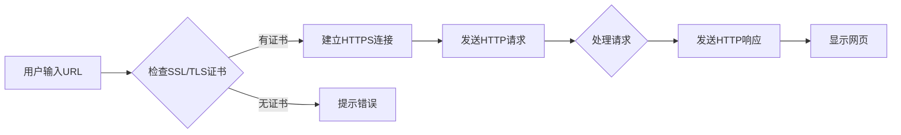

# SEO 要求：优先考虑支持 HTTPS 的网站

> 关键词：SEO, HTTPS, 网站安全，搜索引擎优化，搜索引擎排名，网络安全，内容分发网络，SSL/TLS证书，搜索引擎算法，用户信任

## 1. 背景介绍

在互联网时代，搜索引擎优化（Search Engine Optimization，SEO）对于网站的成功至关重要。SEO的目标是通过提高网站在搜索引擎结果页面（Search Engine Results Page，SERP）中的排名，吸引更多的潜在用户访问。随着网络安全的日益重视，搜索引擎也调整了其算法，优先考虑那些支持HTTPS的网站。本文将深入探讨为什么支持HTTPS对于SEO至关重要，并提供实现HTTPS的详细指南。

### 1.1 网站安全的崛起

随着网络攻击和网络诈骗的增加，用户对网站安全的关注度日益提高。HTTPS（HTTP Secure）是一种在HTTP协议上增加SSL/TLS安全套接字层的加密通信协议，它能够保护用户与网站之间的数据传输安全，防止中间人攻击和数据泄露。

### 1.2 搜索引擎的偏好

搜索引擎，特别是Google，已经明确表示支持HTTPS的网站将获得更高的排名。这是为了提供一个更加安全、可信的网络环境，并鼓励网站所有者采取安全措施。

### 1.3 用户信任与用户体验

支持HTTPS的网站能够增强用户对网站的信任感，因为HTTPS能够确保用户的个人信息在传输过程中不被拦截或篡改。此外，HTTPS还可以改善用户体验，因为浏览器通常会显示一个安全指示，如绿色的锁形图标。

## 2. 核心概念与联系

### 2.1 核心概念

- **HTTPS**：一种安全的HTTP协议，使用SSL/TLS加密数据传输。
- **SSL/TLS证书**：用于验证网站身份并加密数据的数字证书。
- **搜索引擎算法**：搜索引擎用于排名网站的一套规则，其中安全因素是一个重要因素。
- **内容分发网络（CDN）**：通过在全球多个位置存储和分发内容来提高网站性能和速度的网络服务。

### 2.2 Mermaid 流程图



## 3. 核心算法原理 & 具体操作步骤

### 3.1 算法原理概述

搜索引擎算法通过多种因素来评估网站的排名，其中网站的安全性和可靠性是关键因素之一。支持HTTPS的网站在算法中会获得更高的权重。

### 3.2 算法步骤详解

1. **获取SSL/TLS证书**：从证书颁发机构（CA）获取SSL/TLS证书。
2. **配置服务器**：在Web服务器上安装并配置SSL/TLS证书。
3. **测试HTTPS连接**：使用在线工具测试HTTPS连接的安全性。
4. **优化HTTPS性能**：使用CDN和压缩技术提高HTTPS网站的加载速度。
5. **监控和更新**：定期检查SSL/TLS证书的有效性，确保网站安全。

### 3.3 算法优缺点

#### 优点：

- 提高网站排名
- 增强用户信任
- 保护用户数据
- 改善用户体验

#### 缺点：

- 需要额外配置和成本
- HTTPS连接可能比HTTP慢

### 3.4 算法应用领域

- 所有需要用户输入敏感信息的网站，如电子商务网站、在线银行和社交媒体平台。
- 所有希望提高用户信任和品牌形象的网站。

## 4. 数学模型和公式 & 详细讲解 & 举例说明

### 4.1 数学模型构建

HTTPS的安全性基于非对称加密和对称加密的结合。非对称加密用于验证网站身份，而对称加密用于加密数据传输。

### 4.2 公式推导过程

非对称加密使用公钥和私钥，公钥用于加密，私钥用于解密。

$$
\text{公钥加密} \rightarrow \text{密文} = E_{\text{公钥}}(明文)
$$
$$
\text{私钥解密} \rightarrow \text{明文} = D_{\text{私钥}}(\text{密文})
$$

### 4.3 案例分析与讲解

假设用户A想要访问网站B。用户A的浏览器向网站B发送请求，网站B使用自己的公钥对请求进行加密，然后将加密后的请求发送回用户A的浏览器。用户A的浏览器使用网站B的公钥解密请求，然后将明文请求发送回网站B。网站B使用自己的私钥解密请求，然后处理请求并返回响应。

## 5. 项目实践：代码实例和详细解释说明

### 5.1 开发环境搭建

为了演示如何配置HTTPS，我们将使用一个简单的Nginx服务器。

### 5.2 源代码详细实现

以下是一个简单的Nginx配置文件示例，用于配置HTTPS：

```nginx
server {
    listen 443 ssl;
    server_name example.com;

    ssl_certificate /etc/nginx/ssl/example.crt;
    ssl_certificate_key /etc/nginx/ssl/example.key;

    location / {
        root /var/www/html;
        index index.html index.htm;
    }
}
```

### 5.3 代码解读与分析

上述配置文件定义了一个Nginx服务器，监听443端口（HTTPS端口），并指定了SSL证书和密钥的路径。`location`块定义了根目录和默认的索引文件。

### 5.4 运行结果展示

配置完成后，重启Nginx服务器，并使用浏览器访问`https://example.com`。浏览器应该显示一个绿色的锁形图标，表明网站支持HTTPS。

## 6. 实际应用场景

### 6.1 电子商务网站

电子商务网站需要处理敏感用户信息，如信用卡信息。使用HTTPS可以确保用户信息在传输过程中不被窃取。

### 6.2 在线银行

在线银行处理的是用户的财务信息，安全性至关重要。HTTPS可以保护用户交易安全，防止欺诈。

### 6.3 社交媒体平台

社交媒体平台需要保护用户的个人数据和隐私。HTTPS可以增强用户对平台的信任。

## 7. 工具和资源推荐

### 7.1 学习资源推荐

- [SSL/TLS证书基础知识](https://www.ssllabs.com/ssltest/encoding.html)
- [Nginx HTTPS配置教程](https://docs.nginx.com/nginx/admin-guide/http/ssl-server-configurations/)
- [Google SEO指南](https://support.google.com/webmasters/answer/6073538?hl=en)

### 7.2 开发工具推荐

- [Let's Encrypt](https://letsencrypt.org/)：提供免费的SSL/TLS证书。
- [SSL Labs SSL/TLS测试工具](https://www.ssllabs.com/ssltest/)
- [Nginx配置文件编辑器](https://www.ttytter.com/)

### 7.3 相关论文推荐

- [HTTPS协议详解](https://www.ietf.org/rfc/rfc2818.txt)

## 8. 总结：未来发展趋势与挑战

### 8.1 研究成果总结

本文探讨了HTTPS在SEO中的重要性，并提供了实现HTTPS的详细指南。随着网络安全的不断重视，支持HTTPS将成为网站的基本要求。

### 8.2 未来发展趋势

预计未来所有网站都将默认支持HTTPS，而不再区分HTTP和HTTPS。

### 8.3 面临的挑战

- **成本**：获取SSL/TLS证书可能需要额外成本。
- **配置**：配置HTTPS可能需要一定的技术知识。
- **性能**：HTTPS可能比HTTP慢。

### 8.4 研究展望

随着技术的进步，SSL/TLS的性能瓶颈将得到解决，同时，自动化工具将简化HTTPS的配置过程。

## 9. 附录：常见问题与解答

**Q1：为什么我的网站不支持HTTPS？**

A：可能是因为你没有安装SSL/TLS证书，或者Web服务器没有正确配置。

**Q2：我需要为每个域名都获取一个SSL/TLS证书吗？**

A：不是，你可以使用多域名证书或通配符证书来保护多个域名。

**Q3：HTTPS会对我的网站性能产生影响吗？**

A：是的，HTTPS可能比HTTP慢，但是可以通过使用高效加密算法和CDN来缓解这个问题。

**Q4：HTTPS证书多久需要更新一次？**

A：大多数证书的有效期为1年，到期后需要续费并重新生成新的证书。

**Q5：如何确保我的网站安全？**

A：除了使用HTTPS，你还应该使用安全的密码策略、定期更新软件、实施入侵检测系统等。

作者：禅与计算机程序设计艺术 / Zen and the Art of Computer Programming