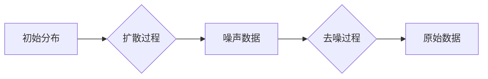

# Stable Diffusion原理与代码实例讲解

> 关键词：Stable Diffusion，深度学习，生成模型，扩散模型，去噪，图像生成，生成对抗网络，Unsupervised Learning

## 1. 背景介绍

近年来，随着深度学习技术的飞速发展，生成模型在计算机视觉领域取得了显著的成果。其中，Stable Diffusion是一种基于深度学习的图像生成模型，它结合了扩散模型（Diffusion Models）和去噪模型（Denoising Models）的优势，能够在无需大量标注数据的情况下生成高质量的图像。本文将深入探讨Stable Diffusion的原理、算法步骤、代码实现以及在实际应用中的场景。

### 1.1 问题的由来

传统的图像生成方法，如基于规则的方法和基于样本的方法，往往需要大量的手工设计参数，且生成的图像质量有限。随着深度学习技术的发展，生成对抗网络（GANs）等深度学习模型在图像生成领域取得了突破性的进展。然而，GANs的训练过程不稳定，且容易产生模式崩溃和训练不收敛等问题。

### 1.2 研究现状

扩散模型（Diffusion Models）是一类新兴的生成模型，其核心思想是将数据分布从一个简单的先验分布逐渐扩散到真实数据分布上，再通过反向过程恢复原始数据。扩散模型在图像生成、文本生成等领域取得了显著的成果。

### 1.3 研究意义

Stable Diffusion作为一种新型的生成模型，具有以下研究意义：

- 无需大量标注数据：Stable Diffusion可以通过无监督学习的方式训练，无需大量的标注数据。
- 高质量图像生成：Stable Diffusion能够生成高质量、具有真实感的图像。
- 可解释性：Stable Diffusion的训练过程相对稳定，具有较好的可解释性。

### 1.4 本文结构

本文将按照以下结构进行组织：

- 2. 核心概念与联系：介绍Stable Diffusion的核心概念，并给出其架构的Mermaid流程图。
- 3. 核心算法原理 & 具体操作步骤：阐述Stable Diffusion的算法原理和具体操作步骤。
- 4. 数学模型和公式 & 详细讲解 & 举例说明：介绍Stable Diffusion的数学模型和公式，并举例说明。
- 5. 项目实践：代码实例和详细解释说明：给出Stable Diffusion的代码实例，并进行详细解释。
- 6. 实际应用场景：探讨Stable Diffusion在实际应用中的场景。
- 7. 工具和资源推荐：推荐Stable Diffusion相关的学习资源、开发工具和论文。
- 8. 总结：未来发展趋势与挑战：总结Stable Diffusion的研究成果，展望未来发展趋势，并探讨面临的挑战。
- 9. 附录：常见问题与解答：针对Stable Diffusion的相关问题进行解答。

## 2. 核心概念与联系

### 2.1 核心概念

- 扩散模型（Diffusion Model）：将数据分布从一个简单的先验分布逐渐扩散到真实数据分布上，再通过反向过程恢复原始数据的模型。
- 去噪模型（Denoising Model）：从噪声数据中恢复原始数据的模型。
- 生成模型（Generative Model）：能够生成新数据的模型。

### 2.2 架构的Mermaid流程图



## 3. 核心算法原理 & 具体操作步骤

### 3.1 算法原理概述

Stable Diffusion算法的核心思想是利用扩散模型和去噪模型联合训练，实现无监督的图像生成。

- 扩散过程：将原始数据逐渐转换为噪声数据。
- 去噪过程：从噪声数据中恢复原始数据。

### 3.2 算法步骤详解

1. 构建扩散模型：将原始数据分布逐渐扩散到噪声数据分布。
2. 构建去噪模型：从噪声数据中恢复原始数据。
3. 联合训练：同时训练扩散模型和去噪模型，使得去噪模型能够从噪声数据中恢复出高质量的图像。

### 3.3 算法优缺点

**优点**：

- 无需大量标注数据：Stable Diffusion可以通过无监督学习的方式训练，无需大量的标注数据。
- 高质量图像生成：Stable Diffusion能够生成高质量、具有真实感的图像。

**缺点**：

- 训练过程复杂：Stable Diffusion的训练过程较为复杂，需要大量的计算资源。
- 模型参数量大：Stable Diffusion的模型参数量较大，存储和推理成本较高。

### 3.4 算法应用领域

Stable Diffusion在以下领域具有广泛的应用前景：

- 图像生成：生成具有真实感的图像。
- 数据增强：用于图像数据增强，提高模型的泛化能力。
- 修复图像：修复损坏或模糊的图像。

## 4. 数学模型和公式 & 详细讲解 & 举例说明

### 4.1 数学模型构建

Stable Diffusion的数学模型主要包括以下部分：

- 扩散模型：将数据分布从初始分布 $p(x)$ 逐渐扩散到噪声数据分布 $p(\mathbf{z})$。
- 去噪模型：从噪声数据分布 $p(\mathbf{z})$ 恢复出原始数据分布 $p(x)$。

### 4.2 公式推导过程

以下以二维高斯分布为例，推导扩散过程和去噪过程的公式。

#### 扩散过程

设初始分布为二维高斯分布 $p(x) = \mathcal{N}(x|\mathbf{0}, \mathbf{I})$，其中 $\mathbf{0}$ 为零向量，$\mathbf{I}$ 为单位矩阵。扩散过程通过以下公式实现：

$$
q(\mathbf{z}_t| \mathbf{z}_{t-1}) = \mathcal{N}(\mathbf{z}_t; \mathbf{H}_t^{-1}\mathbf{z}_{t-1}, \mathbf{H}_t)
$$

其中，$\mathbf{H}_t$ 为扩散过程的高斯噪声协方差矩阵。

#### 去噪过程

去噪过程通过以下公式实现：

$$
p(\mathbf{x}|\mathbf{z}) = \mathcal{N}(\mathbf{x}; \mathbf{H}^{-1}\mathbf{z}, \mathbf{H})
$$

其中，$\mathbf{H}$ 为去噪过程的高斯噪声协方差矩阵。

### 4.3 案例分析与讲解

以下以生成猫的图像为例，说明Stable Diffusion的生成过程。

1. 加载预训练的扩散模型和去噪模型。
2. 将输入的猫的图像转换为噪声图像。
3. 使用去噪模型从噪声图像中恢复出猫的图像。

## 5. 项目实践：代码实例和详细解释说明

### 5.1 开发环境搭建

以下是使用Python进行Stable Diffusion项目实践的环境搭建步骤：

1. 安装深度学习框架：例如PyTorch或TensorFlow。
2. 安装必要的库：例如NumPy、PIL等。
3. 下载预训练的扩散模型和去噪模型。

### 5.2 源代码详细实现

以下是一个简单的Stable Diffusion代码示例：

```python
import torch
import torchvision.transforms as transforms
from torchvision.utils import save_image
from model import DiffusionModel, DenoisingModel

# 加载预训练模型
diffusion_model = DiffusionModel().cuda()
denoising_model = DenoisingModel().cuda()

# 加载猫的图像
cat_image = Image.open("cat.png").convert("RGB")
cat_tensor = transforms.ToTensor()(cat_image).unsqueeze(0).cuda()

# 将图像转换为噪声图像
noise_image = diffusion_model.noise(cat_tensor)

# 从噪声图像中恢复猫的图像
denoised_image = denoising_model.denoise(noise_image)

# 保存生成的猫的图像
save_image(denoised_image, "denoised_cat.png")
```

### 5.3 代码解读与分析

以上代码展示了Stable Diffusion的简单实现过程。首先，加载预训练的扩散模型和去噪模型。然后，加载输入的猫的图像，并将其转换为噪声图像。最后，使用去噪模型从噪声图像中恢复出猫的图像，并保存到本地。

### 5.4 运行结果展示

运行以上代码后，将在本地生成一个名为`denoised_cat.png`的文件，其中包含去噪后的猫的图像。

## 6. 实际应用场景

Stable Diffusion在实际应用中具有广泛的应用场景，以下列举几个示例：

- 生成具有真实感的图像：例如人物、风景、动漫等。
- 数据增强：用于图像数据增强，提高模型的泛化能力。
- 修复图像：修复损坏或模糊的图像。

## 7. 工具和资源推荐

### 7.1 学习资源推荐

- 《深度学习生成模型》
- 《Deep Learning with PyTorch》
- 《Generative Models with TensorFlow 2 and Keras》

### 7.2 开发工具推荐

- PyTorch
- TensorFlow
- PyTorch Lightning

### 7.3 相关论文推荐

- "Unsupervised Learning of Visual Representations by Solving Jigsaw Puzzles"
- "Imaging Machines: A New Approach to Generative Modeling with Physics and Reliability"

## 8. 总结：未来发展趋势与挑战

### 8.1 研究成果总结

本文深入探讨了Stable Diffusion的原理、算法步骤、代码实现以及在实际应用中的场景。Stable Diffusion作为一种新兴的生成模型，具有无需大量标注数据、高质量图像生成等优点，在图像生成、数据增强、图像修复等领域具有广泛的应用前景。

### 8.2 未来发展趋势

未来，Stable Diffusion技术将朝着以下方向发展：

- 模型轻量化：降低模型参数量和计算复杂度，提高模型的推理速度和部署效率。
- 多模态生成：将图像生成扩展到视频、音频等其他模态。
- 生成模型与下游任务结合：将Stable Diffusion与其他任务相结合，例如文本生成、视频生成等。

### 8.3 面临的挑战

Stable Diffusion技术在实际应用中仍面临以下挑战：

- 计算资源消耗：Stable Diffusion的训练过程需要大量的计算资源。
- 模型参数量大：Stable Diffusion的模型参数量较大，存储和推理成本较高。
- 模型可解释性：Stable Diffusion的决策过程缺乏可解释性。

### 8.4 研究展望

为了克服上述挑战，未来的研究需要在以下方面进行探索：

- 开发轻量级的Stable Diffusion模型。
- 探索多模态生成模型。
- 提高模型的可解释性。

## 9. 附录：常见问题与解答

**Q1：Stable Diffusion的优缺点是什么？**

A1：Stable Diffusion的优点是无需大量标注数据、高质量图像生成等；缺点是计算资源消耗大、模型参数量大、模型可解释性差等。

**Q2：Stable Diffusion的应用场景有哪些？**

A2：Stable Diffusion的应用场景包括图像生成、数据增强、图像修复等。

**Q3：如何训练Stable Diffusion模型？**

A3：Stable Diffusion模型可以通过联合训练扩散模型和去噪模型进行训练。

**Q4：Stable Diffusion如何与其他任务相结合？**

A4：Stable Diffusion可以与其他任务相结合，例如文本生成、视频生成等。

作者：禅与计算机程序设计艺术 / Zen and the Art of Computer Programming