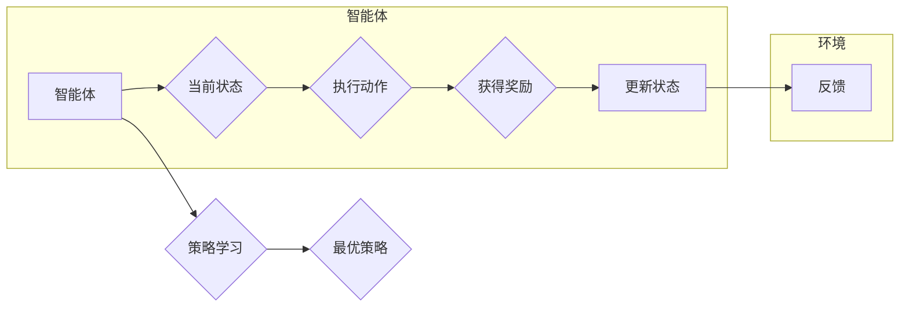

# 强化学习Reinforcement Learning在智能制造中的角色与价值

> 关键词：强化学习，智能制造，机器人，优化，自动化，控制，预测，人工智能

## 1. 背景介绍

随着全球制造业的快速发展，智能制造成为未来工业生产的主要趋势。智能制造通过应用先进的信息技术、网络技术和自动化技术，实现生产过程的智能化、网络化、数字化和绿色化，从而提高生产效率、降低成本、提升产品质量和可靠性。在这个过程中，人工智能技术，特别是强化学习（Reinforcement Learning, RL）技术，发挥着越来越重要的作用。

### 1.1 智造业的变革

近年来，制造业面临着巨大的挑战，如劳动力成本上升、生产环境复杂化、市场需求多样化等。为了应对这些挑战，制造业正经历着一场深刻的变革：

- **自动化**：通过自动化设备和技术，减少对人工的依赖，提高生产效率和安全性。
- **数字化**：通过物联网、大数据等技术，实现生产过程的全面数字化，为智能制造提供数据基础。
- **智能化**：通过人工智能技术，实现生产过程的自主决策和优化，提升制造系统的智能化水平。

### 1.2 强化学习的兴起

强化学习作为一种机器学习的方法，通过智能体与环境之间的交互，使智能体能够学习到最优策略，从而实现目标。近年来，随着计算能力的提升和算法的改进，强化学习在游戏、机器人、推荐系统等领域取得了显著的成果，逐渐成为人工智能领域的研究热点。

### 1.3 强化学习在智能制造中的应用

强化学习在智能制造中的应用前景广阔，可以应用于以下几个方面：

- **生产过程优化**：通过强化学习，可以优化生产流程，提高生产效率和质量。
- **设备故障预测与维护**：通过强化学习，可以预测设备故障，实现预防性维护，降低停机时间。
- **供应链管理**：通过强化学习，可以优化库存管理、运输调度等，提高供应链的效率和响应速度。
- **产品设计与制造**：通过强化学习，可以优化产品设计，提高产品质量和可靠性。

## 2. 核心概念与联系

### 2.1 核心概念原理

强化学习的基本原理如下：

- **智能体（Agent）**：智能体是强化学习中的主体，它通过与环境的交互来学习最优策略。
- **环境（Environment）**：环境是智能体所处的环境，它提供状态、动作和奖励给智能体。
- **状态（State）**：状态是智能体在某一时刻所处的环境特征，通常用一个向量表示。
- **动作（Action）**：动作是智能体在某一状态可以执行的操作，通常用一个向量表示。
- **奖励（Reward）**：奖励是智能体在执行动作后获得的反馈，用于评估智能体的表现。
- **策略（Policy）**：策略是智能体在给定状态下选择动作的规则，通常用一个函数表示。

强化学习的目标是通过学习策略，使智能体能够获得最大的累积奖励。

### 2.2 核心概念架构的 Mermaid 流程图



### 2.3 核心概念联系

强化学习中的智能体、环境、状态、动作、奖励和策略等概念相互联系，形成一个闭环的学习过程。智能体通过与环境交互，学习最优策略，从而实现目标。

## 3. 核心算法原理 & 具体操作步骤

### 3.1 算法原理概述

强化学习算法的核心是价值函数和策略学习。

- **价值函数（Value Function）**：价值函数用于评估智能体在某一状态下的预期奖励。
- **策略学习（Policy Learning）**：策略学习是指学习最优策略的过程，策略可以是一个概率分布，表示智能体在给定状态下选择每个动作的概率。

### 3.2 算法步骤详解

强化学习的基本步骤如下：

1. 初始化智能体、环境和策略。
2. 智能体在环境中随机选择一个状态。
3. 智能体根据当前状态执行一个动作。
4. 环境根据动作提供状态和奖励。
5. 智能体根据状态和奖励更新策略。
6. 重复步骤2-5，直到达到终止条件。

### 3.3 算法优缺点

强化学习算法的优点包括：

- **自适应性强**：强化学习算法可以根据环境的变化动态调整策略。
- **应用范围广**：强化学习可以应用于各种场景，包括机器人、游戏、推荐系统等。

强化学习算法的缺点包括：

- **收敛速度慢**：强化学习算法可能需要大量的样本才能收敛到最优策略。
- **样本效率低**：强化学习算法需要大量的样本来学习最优策略。

### 3.4 算法应用领域

强化学习算法可以应用于以下领域：

- **机器人控制**：通过强化学习，可以使机器人学习到执行复杂任务的最佳策略。
- **游戏**：通过强化学习，可以开发出更智能的游戏AI。
- **推荐系统**：通过强化学习，可以优化推荐算法，提高推荐质量。
- **智能制造**：通过强化学习，可以提高智能制造系统的智能化水平。

## 4. 数学模型和公式 & 详细讲解 & 举例说明

### 4.1 数学模型构建

强化学习的数学模型如下：

- **价值函数**：$V(s) = E[R + \gamma V(s')]$
- **策略**：$\pi(a|s) = \frac{e^{\alpha V(s)}}{\sum_a e^{\alpha V(s)}}$

其中，$s$ 是状态，$a$ 是动作，$R$ 是奖励，$s'$ 是执行动作后的状态，$\gamma$ 是折扣因子，$\alpha$ 是温度参数。

### 4.2 公式推导过程

价值函数的推导过程如下：

- **期望值**：$E[R + \gamma V(s')] = \sum_{s'} P(s'|s, a) [R + \gamma V(s')]$
- **状态转移概率**：$P(s'|s, a) = p(s'|s, a)$
- **动作概率**：$\pi(a|s) = \frac{e^{\alpha V(s)}}{\sum_a e^{\alpha V(s)}}$

### 4.3 案例分析与讲解

以机器人抓取为例，分析强化学习在智能制造中的应用。

- **状态**：机器人的位置、角度、抓取力等。
- **动作**：机器人的运动指令，如移动、旋转、抓取等。
- **奖励**：抓取成功与否，成功则奖励为正，失败则奖励为负。
- **策略**：根据当前状态选择最佳动作。

通过强化学习，机器人可以学习到最优的抓取策略，提高抓取成功率。

## 5. 项目实践：代码实例和详细解释说明

### 5.1 开发环境搭建

为了进行强化学习项目实践，需要搭建以下开发环境：

- **Python**：Python是一种广泛应用于人工智能领域的编程语言。
- **PyTorch**：PyTorch是一个基于Python的开源机器学习库，提供了丰富的神经网络和优化算法。
- **OpenAI Gym**：OpenAI Gym是一个开源的环境库，提供了多种仿真环境，方便进行强化学习实验。

### 5.2 源代码详细实现

以下是一个使用PyTorch和OpenAI Gym实现机器人抓取的简单示例：

```python
import gym
import torch
import torch.nn as nn
import torch.optim as optim

# 定义神经网络模型
class QNetwork(nn.Module):
    def __init__(self, input_size, output_size):
        super(QNetwork, self).__init__()
        self.fc1 = nn.Linear(input_size, 64)
        self.fc2 = nn.Linear(64, output_size)

    def forward(self, x):
        x = torch.relu(self.fc1(x))
        x = self.fc2(x)
        return x

# 创建环境
env = gym.make('FetchReach-v1')

# 创建模型和优化器
model = QNetwork(env.observation_space.shape[0], env.action_space.n)
optimizer = optim.Adam(model.parameters(), lr=0.001)

# 训练模型
for episode in range(1000):
    state = env.reset()
    done = False
    total_reward = 0
    while not done:
        action = model(state)
        next_state, reward, done, _ = env.step(action)
        total_reward += reward
        optimizer.zero_grad()
        loss = ...  # 计算损失函数
        loss.backward()
        optimizer.step()
        state = next_state
    print(f"Episode {episode}, Total Reward: {total_reward}")
```

### 5.3 代码解读与分析

- `QNetwork`类定义了Q网络模型，用于预测动作值。
- `gym.make('FetchReach-v1')`创建了一个FetchReach环境，用于模拟机器人抓取任务。
- `model`是Q网络实例，用于预测动作值。
- `optimizer`是Adam优化器，用于更新模型参数。
- 循环训练模型，每一步计算损失函数，反向传播梯度，更新模型参数。

### 5.4 运行结果展示

运行上述代码，可以看到模型在环境中的训练过程，包括每个episode的总奖励。

## 6. 实际应用场景

### 6.1 生产过程优化

强化学习可以用于优化智能制造的生产过程，例如：

- **路径规划**：优化机器人路径，减少运动时间，提高生产效率。
- **资源调度**：优化生产资源分配，提高资源利用率。
- **质量控制**：检测产品质量，优化生产工艺，提高产品质量。

### 6.2 设备故障预测与维护

强化学习可以用于设备故障预测与维护，例如：

- **预测性维护**：预测设备故障，提前进行维护，减少停机时间。
- **故障诊断**：诊断设备故障原因，提高维修效率。

### 6.3 供应链管理

强化学习可以用于优化供应链管理，例如：

- **库存管理**：优化库存水平，降低库存成本。
- **运输调度**：优化运输路线，降低运输成本。

### 6.4 产品设计与制造

强化学习可以用于产品设计与制造，例如：

- **产品设计**：优化产品设计，提高产品性能。
- **工艺规划**：优化生产工艺，提高产品质量。

## 7. 工具和资源推荐

### 7.1 学习资源推荐

- **《强化学习：原理与实例》**：这是一本经典的强化学习教材，适合初学者和进阶者。
- **《深度强化学习》**：这本书深入介绍了深度强化学习算法，适合有一定基础的开发者。
- **《OpenAI Gym官方文档》**：OpenAI Gym官方文档提供了丰富的环境库和教程，是学习和实践强化学习的好资源。

### 7.2 开发工具推荐

- **PyTorch**：PyTorch是一个基于Python的开源机器学习库，提供了丰富的神经网络和优化算法。
- **TensorFlow**：TensorFlow是Google开源的机器学习框架，功能强大，适用范围广。
- **OpenAI Gym**：OpenAI Gym是一个开源的环境库，提供了多种仿真环境，方便进行强化学习实验。

### 7.3 相关论文推荐

- **《Playing Atari with Deep Reinforcement Learning》**：这篇论文介绍了Deep Q Network，是深度强化学习的经典论文。
- **《Human-level control through deep reinforcement learning》**：这篇论文介绍了AlphaGo，展示了深度强化学习在游戏领域的应用。
- **《DQN: Deep Q-Network》**：这篇论文介绍了DQN算法，是深度强化学习的重要算法之一。

## 8. 总结：未来发展趋势与挑战

### 8.1 研究成果总结

强化学习在智能制造中的应用取得了显著的成果，为智能制造的发展提供了新的思路和方法。

### 8.2 未来发展趋势

未来，强化学习在智能制造中的应用将呈现以下趋势：

- **更复杂的模型**：开发更复杂的强化学习模型，以应对更复杂的制造环境。
- **更高效的算法**：开发更高效的强化学习算法，以减少训练时间和计算资源。
- **更鲁棒的模型**：开发更鲁棒的强化学习模型，以提高模型的泛化能力。

### 8.3 面临的挑战

强化学习在智能制造中的应用还面临着以下挑战：

- **数据获取**：获取高质量的数据是强化学习的关键。
- **算法复杂性**：一些强化学习算法的计算复杂度较高，需要更高效的算法。
- **模型可解释性**：强化学习模型的可解释性较差，需要提高模型的可解释性。

### 8.4 研究展望

未来，强化学习在智能制造中的应用将取得更大的突破，为智能制造的发展提供更强大的技术支持。

## 9. 附录：常见问题与解答

**Q1：强化学习在智能制造中的应用前景如何？**

A：强化学习在智能制造中的应用前景非常广阔，可以应用于生产过程优化、设备故障预测与维护、供应链管理、产品设计与制造等领域，为智能制造的发展提供新的思路和方法。

**Q2：强化学习在智能制造中面临哪些挑战？**

A：强化学习在智能制造中面临的挑战包括数据获取、算法复杂性、模型可解释性等。

**Q3：如何解决强化学习在智能制造中的挑战？**

A：解决强化学习在智能制造中的挑战需要从多个方面入手，包括数据获取、算法优化、模型可解释性等。

**Q4：强化学习在智能制造中的具体应用案例有哪些？**

A：强化学习在智能制造中的具体应用案例包括生产过程优化、设备故障预测与维护、供应链管理、产品设计与制造等。

**Q5：如何选择合适的强化学习算法？**

A：选择合适的强化学习算法需要根据具体的应用场景和数据特点进行选择，可以考虑算法的复杂度、效率、可解释性等因素。

---

作者：禅与计算机程序设计艺术 / Zen and the Art of Computer Programming