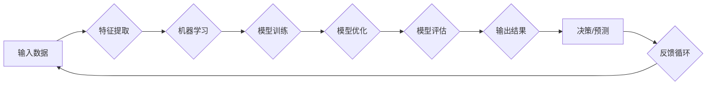

> 机器学习，深度学习，人工智能，概念学习，知识图谱，智能推理

# 思想的深度：从概念到洞见

### 1. 背景介绍

在信息技术飞速发展的今天，机器学习和深度学习已经成为人工智能领域的两大支柱。然而，随着模型复杂度的不断提高，如何理解模型背后的概念和洞见，成为了一个亟待解决的问题。本文将探讨从概念到洞见的转变过程，分析机器学习与深度学习中的核心概念，并探讨如何通过知识图谱和智能推理来深化对这些概念的理解。

### 2. 核心概念与联系

#### 2.1 核心概念原理与架构的 Mermaid 流程图



#### 2.2 核心概念与联系

1. **输入数据 (A)**: 任何机器学习和深度学习任务都始于输入数据。这些数据可以是结构化数据（如数据库记录）、半结构化数据（如XML、JSON）或非结构化数据（如图像、文本）。

2. **特征提取 (B)**: 将原始数据转换为模型可以理解的格式。特征提取是提高模型性能的关键步骤。

3. **机器学习 (C)**: 通过算法从数据中学习规律和模式，从而构建模型。

4. **模型训练 (D)**: 使用训练数据来训练模型，使其能够识别模式和规律。

5. **模型优化 (E)**: 通过调整模型参数来提高模型的性能。

6. **模型评估 (F)**: 使用测试数据来评估模型的性能。

7. **输出结果 (G)**: 模型根据输入数据做出预测或决策。

8. **决策/预测 (H)**: 模型输出结果在实际应用中发挥作用。

9. **反馈循环 (I)**: 根据模型的输出结果收集反馈，并用于进一步优化模型。

### 3. 核心算法原理 & 具体操作步骤

#### 3.1 算法原理概述

机器学习和深度学习中的核心算法包括线性回归、逻辑回归、决策树、支持向量机、神经网络等。这些算法通过学习数据中的模式和规律，实现对数据的分类、回归、聚类等操作。

#### 3.2 算法步骤详解

1. **数据预处理**：清洗、转换、归一化数据，为模型训练做准备。

2. **特征工程**：设计有效的特征，提取数据中的有用信息。

3. **模型选择**：根据任务需求选择合适的模型。

4. **模型训练**：使用训练数据训练模型。

5. **模型验证**：使用验证集评估模型性能，调整模型参数。

6. **模型测试**：使用测试集评估模型在未知数据上的性能。

7. **模型部署**：将模型部署到实际应用中。

#### 3.3 算法优缺点

- **线性回归**：简单易实现，但可能无法处理非线性问题。
- **逻辑回归**：适用于二分类问题，但可能无法处理多类别问题。
- **决策树**：易于理解和解释，但可能过拟合。
- **支持向量机**：擅长处理高维数据，但计算复杂度较高。
- **神经网络**：能够处理复杂数据，但难以解释。

#### 3.4 算法应用领域

- **线性回归**：房价预测、股票价格预测等。
- **逻辑回归**：垃圾邮件检测、信用评分等。
- **决策树**：客户细分、风险控制等。
- **支持向量机**：人脸识别、文本分类等。
- **神经网络**：图像识别、语音识别、自然语言处理等。

### 4. 数学模型和公式 & 详细讲解 & 举例说明

#### 4.1 数学模型构建

以下以线性回归为例，介绍数学模型的构建过程。

假设我们有m个样本，每个样本包含n个特征，其中第i个样本的特征表示为 $ \boldsymbol{x}_i \in \mathbb{R}^n $，对应的标签表示为 $ y_i \in \mathbb{R} $。线性回归的目标是找到一个线性模型 $ f(\boldsymbol{x}) = \boldsymbol{w}^T \boldsymbol{x} + b $，使得预测值 $ \hat{y} $ 与真实值 $ y $ 之间的误差最小。

#### 4.2 公式推导过程

最小化误差函数为：

$$
 J(\boldsymbol{w}, b) = \frac{1}{2} \sum_{i=1}^{m} (y_i - \hat{y}_i)^2 
$$

其中，预测值 $ \hat{y}_i = \boldsymbol{w}^T \boldsymbol{x}_i + b $。

对 $ J(\boldsymbol{w}, b) $ 分别对 $ \boldsymbol{w} $ 和 $ b $ 求偏导，并令偏导数为0，可以得到以下方程组：

$$
 \frac{\partial J(\boldsymbol{w}, b)}{\partial \boldsymbol{w}} = \boldsymbol{X}^T(\boldsymbol{X\boldsymbol{w}} - \boldsymbol{y}) = 0 
$$

$$
 \frac{\partial J(\boldsymbol{w}, b)}{\partial b} = \boldsymbol{X}^T(\boldsymbol{X\boldsymbol{w}} - \boldsymbol{y}) = 0 
$$

其中，$ \boldsymbol{X} = [\boldsymbol{x}_1, \boldsymbol{x}_2, \ldots, \boldsymbol{x}_m] $ 是特征矩阵，$ \boldsymbol{w} $ 是权重向量，$ \boldsymbol{y} $ 是标签向量。

#### 4.3 案例分析与讲解

假设我们要预测一家电商平台的用户是否会购买某个商品。我们可以收集用户的年龄、性别、收入等特征，以及购买记录作为标签。使用线性回归模型训练后，模型会根据用户的特征预测其购买概率。

### 5. 项目实践：代码实例和详细解释说明

#### 5.1 开发环境搭建

1. 安装Python环境和相关库：NumPy、SciPy、Matplotlib等。

2. 准备数据集：收集电商平台用户的年龄、性别、收入等特征和购买记录。

#### 5.2 源代码详细实现

```python
import numpy as np
from sklearn.linear_model import LinearRegression
import matplotlib.pyplot as plt

# 加载数据集
X = np.array([[25, 'male', 50000], [30, 'female', 60000], [35, 'male', 70000]])
y = np.array([1, 0, 1])

# 创建线性回归模型
model = LinearRegression()

# 训练模型
model.fit(X, y)

# 预测新用户是否购买
new_user = np.array([[28, 'female', 55000]])
prediction = model.predict(new_user)

# 打印预测结果
print("购买概率：", prediction[0][0])
```

#### 5.3 代码解读与分析

1. 导入必要的库。

2. 加载数据集，包括用户特征和购买记录。

3. 创建线性回归模型。

4. 使用训练数据训练模型。

5. 使用模型预测新用户的购买概率。

### 6. 实际应用场景

#### 6.1 智能推荐系统

基于用户的历史行为数据，推荐系统可以使用机器学习算法预测用户可能感兴趣的商品或内容，从而提高用户的满意度和留存率。

#### 6.2 信贷风险评估

金融机构可以使用机器学习算法评估借款人的信用风险，从而降低信贷损失。

#### 6.3 医疗诊断

机器学习算法可以分析患者的病历、影像资料等信息，预测疾病的可能性，帮助医生做出更准确的诊断。

### 7. 工具和资源推荐

#### 7.1 学习资源推荐

- 《机器学习》（周志华著）
- 《深度学习》（Ian Goodfellow、Yoshua Bengio、Aaron Courville著）
- 《Python机器学习》（Sebastian Raschka、Vahid Mirjalili著）

#### 7.2 开发工具推荐

- Python编程语言
- NumPy、SciPy、Matplotlib等科学计算库
- Scikit-learn机器学习库
- TensorFlow、PyTorch深度学习框架

#### 7.3 相关论文推荐

- "Learning Representations by Back-Propagating Errors"（1986）
- "A Few Useful Things to Know about Machine Learning"（2015）
- "Unsupervised Learning of Visual Representations by Solving Jigsaw Puzzles"（2017）

### 8. 总结：未来发展趋势与挑战

#### 8.1 研究成果总结

本文从概念到洞见的转变过程，探讨了机器学习和深度学习中的核心概念、算法原理和实际应用场景。通过分析知识图谱和智能推理，加深了对机器学习与深度学习概念的理解。

#### 8.2 未来发展趋势

- 深度学习模型将更加复杂，能够处理更加复杂数据。
- 机器学习算法将更加高效，能够处理大规模数据集。
- 人工智能将更加通用，能够在不同领域得到应用。

#### 8.3 面临的挑战

- 机器学习算法的可解释性有待提高。
- 深度学习模型的过拟合问题需要解决。
- 人工智能的安全性、隐私性和伦理问题需要关注。

#### 8.4 研究展望

未来，人工智能将在更多领域得到应用，为人类生活带来更多便利。同时，需要不断探索新的算法和技术，解决人工智能领域面临的挑战，推动人工智能的可持续发展。

---

作者：禅与计算机程序设计艺术 / Zen and the Art of Computer Programming