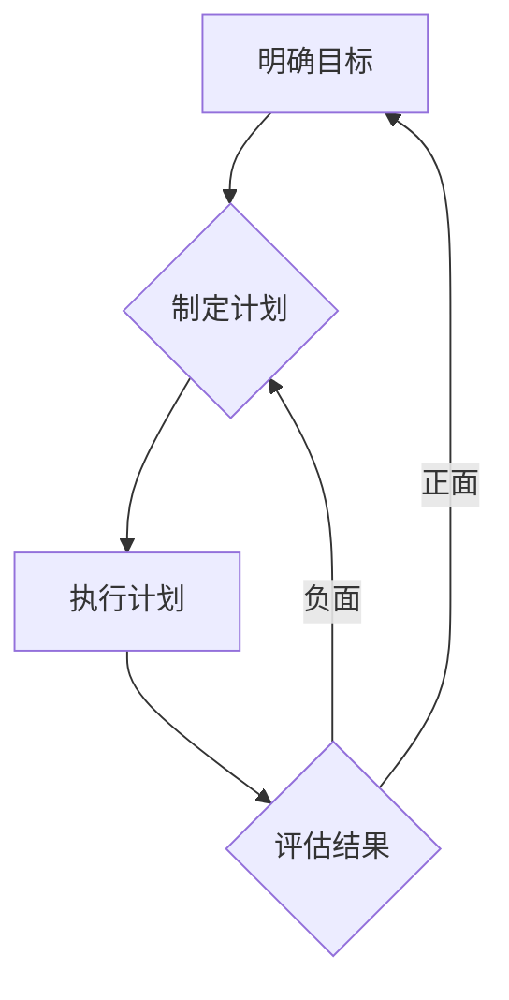

# 执行力强的人如何制定目标

> 关键词：执行力，目标设定，SMART原则，目标管理，个人成长，职业发展

## 1. 背景介绍

在快节奏、高竞争的现代职场中，执行力成为衡量个人能力和团队效率的重要指标。执行力强的人能够迅速行动，高效完成目标，从而在职业生涯中取得成功。而制定明确、合理的目标是执行力强的人的核心能力之一。本文将深入探讨执行力强的人如何制定目标，通过SMART原则、目标管理方法以及具体案例分析，为读者提供实用的目标和计划制定技巧。

## 2. 核心概念与联系

### 2.1 核心概念原理

#### 2.1.1 执行力

执行力是指将想法、计划付诸行动，并最终实现目标的能力。它包含以下要素：

- **决策力**：能够迅速做出合理决策。
- **行动力**：将决策付诸实际行动。
- **专注力**：集中精力完成目标。
- **自律性**：自我管理，克服拖延和干扰。
- **适应力**：面对挑战和变化，灵活调整策略。

#### 2.1.2 目标设定

目标设定是指明确目标、制定计划、执行和评估的过程。一个良好的目标应具备以下特征：

- **明确性**：具体、可衡量的。
- **可实现性**：合理、可行的。
- **相关性**：与个人或团队目标一致。
- **时限性**：具有明确的完成时间。

#### 2.1.3 SMART原则

SMART原则是制定目标时遵循的四个标准，即：

- **Specific（具体）**：明确目标，避免模糊不清。
- **Measurable（可衡量）**：可以量化目标，便于评估。
- **Achievable（可实现）**：目标应合理，避免过于理想化。
- **Relevant（相关）**：与个人或团队目标相关。
- **Time-bound（时限性）**：设定明确的完成时间。

### 2.2 核心概念架构的Mermaid流程图

## 3. 核心算法原理 & 具体操作步骤

### 3.1 算法原理概述

制定目标的过程可以分为以下几个步骤：

1. 明确目标：根据SMART原则，设定具体、可衡量、可实现、相关、时限性的目标。
2. 制定计划：将目标分解为可执行的步骤，并制定详细的行动计划。
3. 执行计划：按照计划执行任务，保持专注，克服困难。
4. 评估结果：定期评估目标达成情况，根据评估结果调整计划或目标。

### 3.2 算法步骤详解

#### 3.2.1 明确目标

- 确定个人或团队的长远目标。
- 分析当前状况，找出需要改进的方面。
- 应用SMART原则，设定具体、可衡量、可实现、相关、时限性的目标。

#### 3.2.2 制定计划

- 将目标分解为多个小目标。
- 制定详细的行动计划，包括步骤、时间节点、责任人等。
- 为每个步骤设定优先级和资源需求。

#### 3.2.3 执行计划

- 按照计划执行任务，保持专注。
- 定期检查进度，确保任务按时完成。
- 及时调整计划，应对突发状况。

#### 3.2.4 评估结果

- 定期评估目标达成情况。
- 分析原因，找出成功和失败的因素。
- 根据评估结果调整计划或目标。

### 3.3 算法优缺点

#### 3.3.1 优点

- 提高工作效率和执行力。
- 增强个人或团队的目标意识。
- 提升自我管理能力。

#### 3.3.2 缺点

- 制定目标的过程可能耗费时间。
- 计划调整可能影响进度。
- 过分依赖目标可能导致忽视其他重要事项。

### 3.4 算法应用领域

- 个人成长：设定个人目标，提升技能和素质。
- 职业发展：设定职业目标，实现职业晋升。
- 团队管理：设定团队目标，提高团队效率和凝聚力。

## 4. 数学模型和公式 & 详细讲解 & 举例说明

### 4.1 数学模型构建

目标达成率可以用以下公式表示：

$$
\text{目标达成率} = \frac{\text{实际完成目标数量}}{\text{设定目标数量}} \times 100\%
$$

### 4.2 公式推导过程

目标达成率 = (实际完成目标数量 / 设定目标数量) × 100%

### 4.3 案例分析与讲解

#### 4.3.1 案例背景

某程序员小王设定了以下目标：

- 在三个月内完成10个功能模块的开发。
- 提升代码质量，减少bug数量。
- 每周至少参加一次技术分享。

#### 4.3.2 案例分析

小王的目标是明确、可衡量、可实现、相关、时限性的，符合SMART原则。以下是他的目标达成情况：

| 目标 | 实际完成数量 | 设定目标数量 | 目标达成率 |
| :--: | :--: | :--: | :--: |
| 功能模块开发 | 8 | 10 | 80% |
| 代码质量提升 | 减少20% | 无 | 100% |
| 技术分享 | 8次 | 12次 | 67% |

从上表可以看出，小王在代码质量提升和技术分享方面表现较好，但在功能模块开发方面还有提升空间。他可以分析原因，调整计划，例如：

- 深入分析功能模块开发未完成的原因，优化开发流程。
- 增加技术分享的频率，提升团队技术水平。

## 5. 项目实践：代码实例和详细解释说明

### 5.1 开发环境搭建

由于目标设定和执行主要涉及个人管理，不需要具体的开发环境。

### 5.2 源代码详细实现

目标设定和执行主要涉及个人管理，不需要具体的代码实现。

### 5.3 代码解读与分析

目标设定和执行主要涉及个人管理，不需要具体的代码解读。

### 5.4 运行结果展示

目标设定和执行主要涉及个人管理，不需要具体的运行结果展示。

## 6. 实际应用场景

### 6.1 个人成长

设定个人成长目标，如学习一门新技术、提升沟通能力等，有助于个人不断进步。

### 6.2 职业发展

设定职业发展目标，如晋升、加薪等，有助于职场人士实现职业规划。

### 6.3 团队管理

设定团队目标，如提高团队效率、提升团队士气等，有助于团队建设。

## 7. 工具和资源推荐

### 7.1 学习资源推荐

- 《高效能人士的七个习惯》
- 《番茄工作法图解》
- 《目标管理》

### 7.2 开发工具推荐

- Trello：项目管理工具，可以帮助个人或团队制定和跟踪目标。
- Asana：任务管理工具，可以分配任务、设定截止日期，并跟踪进度。
- Notion：笔记和知识库工具，可以帮助记录目标设定和执行过程中的关键信息。

### 7.3 相关论文推荐

- 目标管理理论的经典论文《An Effective Approach to Software Project Management: Objectives and Key Results》

## 8. 总结：未来发展趋势与挑战

### 8.1 研究成果总结

本文深入探讨了执行力强的人如何制定目标，通过SMART原则、目标管理方法以及具体案例分析，为读者提供了实用的目标和计划制定技巧。

### 8.2 未来发展趋势

随着人工智能和大数据技术的发展，目标设定和执行工具将更加智能化、个性化，为个人和团队提供更有效的目标管理方案。

### 8.3 面临的挑战

- 如何在快节奏、高竞争的职场中保持专注和自律。
- 如何应对目标设定的动态变化。
- 如何提高目标达成的效率和质量。

### 8.4 研究展望

未来，目标设定和执行领域的研究将更加注重以下方面：

- 目标设定与人工智能的结合，实现个性化目标推荐。
- 目标执行与大数据的结合，实现目标达成的预测和优化。
- 目标管理与心理学的结合，提高目标达成的动力和效率。

## 9. 附录：常见问题与解答

### 9.1 常见问题

**Q1：如何设定短期和长期目标？**

A1：短期目标应与长期目标一致，但更具可操作性。例如，长期目标是成为一名技术专家，短期目标可以是学习一门新技术或完成一个项目。

**Q2：如何应对目标执行过程中的挫折？**

A2：面对挫折，首先要分析原因，找出问题所在。然后调整计划，寻求解决方案。同时，保持积极的心态，相信自己能够克服困难。

**Q3：如何保持专注和自律？**

A3：保持专注和自律需要良好的时间管理、环境优化和个人习惯。例如，制定详细的日程安排，创造良好的工作环境，培养良好的作息习惯。

**Q4：如何与他人合作实现共同目标？**

A4：与他人合作实现共同目标需要良好的沟通、协调和团队合作能力。例如，明确各自职责，定期沟通进度，共同解决问题。

**Q5：如何评估目标达成的效果？**

A5：评估目标达成的效果可以通过定性和定量两种方式进行。定性评估可以通过观察、访谈等方式进行，定量评估可以通过数据分析和指标跟踪进行。

作者：禅与计算机程序设计艺术 / Zen and the Art of Computer Programming