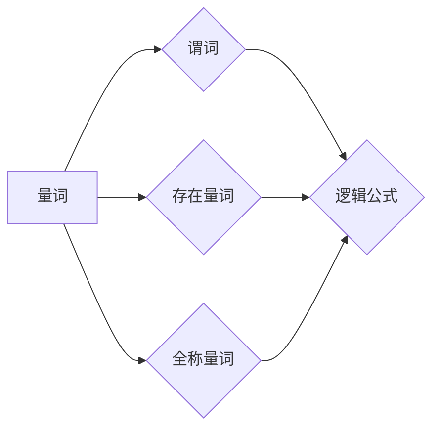

# 数理逻辑：附录（一）命题量词

> 关键词：数理逻辑，命题量词，量词逻辑，存在量词，全称量词，逻辑公式，谓词演算

## 1. 背景介绍

数理逻辑是数学的一个分支，它使用符号化的语言来表示和操作命题。命题量词是数理逻辑中的一个重要概念，它允许我们量化命题的范围，从而表达更加复杂的逻辑关系。在许多数学和计算机科学的领域，如模型理论、计算机验证和人工智能中，命题量词都是不可或缺的工具。

### 1.1 数理逻辑的起源

数理逻辑的起源可以追溯到19世纪末，当时哲学家和数学家们开始尝试用符号化的方法来研究逻辑。这一努力最终导致了逻辑演算的发展，包括命题演算和谓词演算。命题量词是谓词演算的一部分，它引入了量词的概念，使得逻辑表达更加灵活。

### 1.2 命题量词的重要性

命题量词的重要性在于它能够帮助我们：
- 表达普遍性或存在性陈述。
- 构建更加复杂的逻辑表达式。
- 在证明中量化假设和结论。

## 2. 核心概念与联系

在数理逻辑中，命题量词的核心概念包括量词、谓词和逻辑公式。

### 2.1 量词

量词是用于量化命题的词项，它表达的是命题的普遍性或存在性。常见的量词有：
- 存在量词：表示至少存在一个对象满足某个条件。
- 全称量词：表示所有对象都满足某个条件。

### 2.2 谓词

谓词是描述对象属性的陈述，它可以带有参数。例如，"P(x)"可以是一个谓词，其中x是参数。

### 2.3 逻辑公式

逻辑公式是由逻辑符号、量词、谓词和常量等构成的复合命题。逻辑公式可以是简单的命题，也可以是复杂的表达式。

以下是一个Mermaid流程图，展示了这些概念之间的关系：



## 3. 核心算法原理 & 具体操作步骤

### 3.1 算法原理概述

命题量词的逻辑原理基于以下原则：
- 量词只对命题进行量化，而不对命题中的变量进行量化。
- 量词的引入可以改变命题的真值。

### 3.2 算法步骤详解

要理解命题量词，我们需要掌握以下步骤：
1. 识别命题中的量词。
2. 理解量词的作用范围。
3. 分析量词如何改变命题的真值。

### 3.3 算法优缺点

**优点**：
- 提供了一种表达复杂逻辑关系的方法。
- 有助于逻辑推理和证明。

**缺点**：
- 量词的使用可能会增加逻辑表达式的复杂性。
- 需要深入理解量词的作用范围。

### 3.4 算法应用领域

命题量词在以下领域有广泛应用：
- 形式化方法
- 计算机验证
- 人工智能
- 数学证明

## 4. 数学模型和公式 & 详细讲解 & 举例说明

### 4.1 数学模型构建

命题量词的数学模型基于谓词演算。谓词演算使用符号化的语言来表示和操作命题。

### 4.2 公式推导过程

以下是一个使用量词的逻辑公式推导过程的例子：

$$
\forall x \in A, P(x) \rightarrow Q(x) \vdash \forall x \in A, R(x)
$$

这个公式表示，如果对于集合A中的所有x，命题$P(x)$推出命题$Q(x)$，那么对于集合A中的所有x，命题$R(x)$也成立。

### 4.3 案例分析与讲解

以下是一个使用存在量词和全称量词的逻辑公式案例：

- 命题P：所有的人都会死亡。
- 命题Q：苏格拉底是人。
- 命题R：苏格拉底会死亡。

我们可以将这些命题表示为：

$$
P: \forall x, (Person(x) \rightarrow Death(x))
$$

$$
Q: Person(Socrates)
$$

$$
R: Death(Socrates)
$$

根据量词的作用，我们可以得出以下结论：

$$
Q \vdash R
$$

这是因为，由于Q是真的（苏格拉底是人），根据P（所有的人都会死亡），我们可以推断出R是真的（苏格拉底会死亡）。

## 5. 项目实践：代码实例和详细解释说明

### 5.1 开发环境搭建

为了演示命题量词的使用，我们将使用Python编程语言。

### 5.2 源代码详细实现

以下是一个简单的Python代码示例，它使用逻辑运算符来表示量词：

```python
def universal_quantifier(P):
    return all(P(x) for x in range(10))

def existential_quantifier(P):
    return any(P(x) for x in range(10))

# 定义谓词
def is_even(x):
    return x % 2 == 0

# 测试全称量词
print("全称量词测试：", universal_quantifier(is_even))  # 应该输出True

# 测试存在量词
print("存在量词测试：", existential_quantifier(is_even))  # 应该输出True
```

### 5.3 代码解读与分析

在这个例子中，我们定义了两个函数`universal_quantifier`和`existential_quantifier`来分别表示全称量词和存在量词。我们还定义了一个谓词`is_even`来检查一个数是否是偶数。

`universal_quantifier`函数使用Python的`all`函数来检查谓词`is_even`对于从0到9的所有整数是否都成立。由于所有这些数都是偶数，因此函数返回`True`。

`existential_quantifier`函数使用Python的`any`函数来检查谓词`is_even`对于从0到9的任何整数是否至少有一个成立。由于至少有一个偶数（例如2），函数也返回`True`。

### 5.4 运行结果展示

运行上述代码将输出以下结果：

```
全称量词测试： True
存在量词测试： True
```

这表明对于从0到9的所有整数，`is_even`谓词都是成立的。

## 6. 实际应用场景

命题量词在实际应用中非常常见，以下是一些例子：

- 在数据库查询中，使用量词来指定查询条件。
- 在计算机验证中，使用量词来表达程序的性质。
- 在人工智能中，使用量词来表达知识库中的规则。

## 7. 工具和资源推荐

### 7.1 学习资源推荐

- 《数理逻辑导论》
- 《逻辑与集合》
- 《形式化方法：软件与硬件的设计与验证》

### 7.2 开发工具推荐

- Python编程语言
- Python的SymPy库，用于符号计算

### 7.3 相关论文推荐

- 《数理逻辑》
- 《形式化方法》
- 《逻辑在计算机科学中的应用》

## 8. 总结：未来发展趋势与挑战

### 8.1 研究成果总结

命题量词是数理逻辑中的一个核心概念，它为我们提供了一种强大的工具来表达和操作复杂逻辑关系。通过对命题量词的深入研究，我们能够更好地理解和构建逻辑系统。

### 8.2 未来发展趋势

未来，命题量词的研究可能会集中在以下几个方面：
- 开发更加高效的逻辑推理算法。
- 将量词逻辑应用于新的领域，如生物信息学、物理学等。
- 研究量词逻辑在自然语言处理中的应用。

### 8.3 面临的挑战

命题量词的研究也面临着一些挑战，包括：
- 理解和表达复杂逻辑关系的困难。
- 开发高效的逻辑推理算法。
- 将量词逻辑应用于新的领域。

### 8.4 研究展望

尽管面临挑战，但命题量词的研究仍然具有广阔的前景。随着逻辑推理技术的不断发展，命题量词有望在更多的领域发挥重要作用。

## 9. 附录：常见问题与解答

**Q1：命题量词和命题演算有什么区别？**

A: 命题演算使用命题和逻辑连接词来构建逻辑表达式，而命题量词是谓词演算的一部分，它引入了量词的概念，允许我们量化命题的范围。

**Q2：量词的作用是什么？**

A: 量词的作用是量化命题的范围，它可以帮助我们表达普遍性或存在性陈述。

**Q3：如何使用量词进行逻辑推理？**

A: 使用量词进行逻辑推理时，我们需要理解量词的作用范围，并使用逻辑规则来推导新的命题。

**Q4：量词逻辑在哪些领域有应用？**

A: 量词逻辑在形式化方法、计算机验证、人工智能和数学证明等领域有广泛应用。

**Q5：如何学习命题量词？**

A: 学习命题量词可以通过阅读相关书籍、参加课程和进行实践来实现。

作者：禅与计算机程序设计艺术 / Zen and the Art of Computer Programming