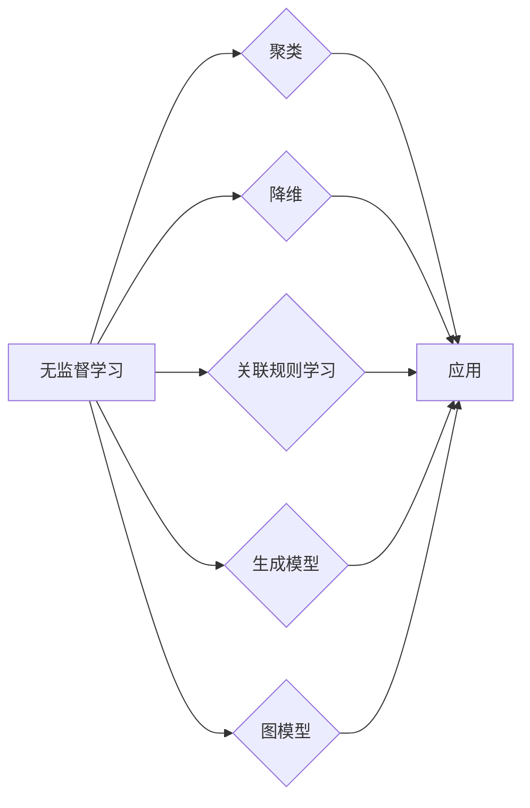

> 无监督学习，聚类，降维，关联规则学习，生成模型，图模型，深度学习，自编码器，非监督预训练

# 无监督学习 原理与代码实例讲解

> 关键词：无监督学习，聚类，降维，关联规则学习，生成模型，图模型，深度学习，自编码器，非监督预训练

## 1. 背景介绍

无监督学习是机器学习的一个重要分支，它关注的是如何从无标签的数据中提取有用信息。与监督学习不同，无监督学习不需要预先标记的标签数据。它广泛应用于数据探索、异常检测、推荐系统、图像分割等领域。本文将深入探讨无监督学习的原理、算法、应用场景，并通过代码实例讲解如何实现这些算法。

### 1.1 问题的由来

随着大数据时代的到来，我们面临着海量无标签数据的处理问题。如何从这些数据中发现潜在的结构、模式或关联关系，成为了数据科学和机器学习领域的研究热点。无监督学习为我们提供了一种有效的方法来解决这个问题。

### 1.2 研究现状

无监督学习的研究已经取得了显著的进展，出现了许多有效的算法和模型。然而，由于无监督学习问题的非凸性和复杂性，目前仍然存在许多挑战，如局部最优解、聚类数目的确定、模型解释性等。

### 1.3 研究意义

无监督学习在数据科学和机器学习领域具有重要的研究意义和应用价值：

1. 发现数据中的隐藏结构，帮助理解数据的本质。
2. 降维，减少数据的维度，提高计算效率。
3. 异常检测，识别数据中的异常点或异常模式。
4. 推荐系统，根据用户行为和物品属性推荐相关内容。
5. 图像分割，将图像分割成不同的区域。

### 1.4 本文结构

本文将分为以下几个部分：

- 第2部分：介绍无监督学习的基本概念和核心算法。
- 第3部分：详细介绍聚类、降维、关联规则学习、生成模型、图模型等核心算法的原理和操作步骤。
- 第4部分：使用Python代码实例讲解如何实现这些算法。
- 第5部分：探讨无监督学习在实际应用场景中的案例。
- 第6部分：展望无监督学习的未来发展趋势和挑战。
- 第7部分：推荐相关的学习资源、开发工具和参考文献。
- 第8部分：总结全文，展望无监督学习的未来。

## 2. 核心概念与联系

### 2.1 核心概念

- **聚类**：将相似的数据点划分为一组，形成簇。
- **降维**：减少数据的维度，保持数据的结构。
- **关联规则学习**：发现数据项之间的关联关系。
- **生成模型**：学习数据的概率分布，生成新的数据点。
- **图模型**：使用图结构表示数据之间的依赖关系。

### 2.2 Mermaid 流程图



### 2.3 核心概念联系

无监督学习中的各种算法和模型都是为了解决不同的数据探索和分析问题。它们之间既有区别，也有联系。例如，聚类和降维都可以用于数据探索，关联规则学习可以用于发现数据之间的关联关系，生成模型可以用于数据生成和样本扩充。

## 3. 核心算法原理 & 具体操作步骤

### 3.1 聚类算法

#### 3.1.1 算法原理概述

聚类算法将数据点划分为多个簇，使得簇内的数据点尽可能相似，簇间的数据点尽可能不同。常见的聚类算法包括K-Means、层次聚类、DBSCAN等。

#### 3.1.2 算法步骤详解

1. 确定簇的数量K。
2. 随机选择K个初始中心点。
3. 将每个数据点分配到最近的中心点所在的簇。
4. 更新每个簇的中心点为该簇中所有数据点的平均值。
5. 重复步骤3和4，直到簇中心不再发生变化。

#### 3.1.3 算法优缺点

- 优点：简单易实现，适用于各种数据类型。
- 缺点：需要预先指定簇的数量，对初始中心点敏感。

#### 3.1.4 算法应用领域

- 数据探索，发现数据中的隐藏结构。
- 异常检测，识别数据中的异常点。
- 图像分割，将图像分割成不同的区域。

### 3.2 降维算法

#### 3.2.1 算法原理概述

降维算法减少数据的维度，同时保持数据的结构。常见的降维算法包括PCA、t-SNE、UMAP等。

#### 3.2.2 算法步骤详解

1. 计算所有数据点的协方差矩阵。
2. 计算协方差矩阵的特征值和特征向量。
3. 选择最大的K个特征向量，形成新的特征空间。
4. 将数据点映射到新的特征空间。

#### 3.2.3 算法优缺点

- 优点：减少数据的维度，提高计算效率。
- 缺点：可能丢失数据的某些信息。

#### 3.2.4 算法应用领域

- 数据可视化，将高维数据可视化。
- 特征选择，选择最重要的特征。
- 机器学习，减少训练数据的维度。

### 3.3 关联规则学习

#### 3.3.1 算法原理概述

关联规则学习发现数据项之间的关联关系，常见的算法包括Apriori算法、FP-growth算法等。

#### 3.3.2 算法步骤详解

1. 生成频繁项集。
2. 生成关联规则。
3. 选择满足最小支持度和最小信任度的规则。

#### 3.3.3 算法优缺点

- 优点：能够发现数据项之间的关联关系。
- 缺点：计算量大，对稀疏数据敏感。

#### 3.3.4 算法应用领域

- 电子商务，推荐购买的商品。
- 金融市场，预测股票价格走势。

### 3.4 生成模型

#### 3.4.1 算法原理概述

生成模型学习数据的概率分布，生成新的数据点，常见的算法包括Gaussian Mixture Model (GMM)、Deep Generative Models (DGM)等。

#### 3.4.2 算法步骤详解

1. 学习数据点的概率分布。
2. 生成新的数据点。

#### 3.4.3 算法优缺点

- 优点：能够生成新的数据点，用于样本扩充。
- 缺点：计算量大，对复杂分布难以建模。

#### 3.4.4 算法应用领域

- 数据增强，生成更多的训练数据。
- 图像生成，生成新的图像。

### 3.5 图模型

#### 3.5.1 算法原理概述

图模型使用图结构表示数据之间的依赖关系，常见的算法包括 Graph Neural Networks (GNNs)、Diffusion Models等。

#### 3.5.2 算法步骤详解

1. 构建图结构，表示数据之间的依赖关系。
2. 使用图模型学习图结构。
3. 使用学习到的模型生成新的数据点。

#### 3.5.3 算法优缺点

- 优点：能够有效地建模数据之间的依赖关系。
- 缺点：计算量大，对图结构敏感。

#### 3.5.4 算法应用领域

- 社交网络分析，分析社交网络中的关系。
- 图像分割，将图像分割成不同的区域。

## 4. 数学模型和公式 & 详细讲解 & 举例说明

### 4.1 数学模型构建

无监督学习中的算法和模型通常都涉及到数学模型的构建。以下是一些常见的数学模型和公式：

- **协方差矩阵**：表示数据点之间的相关关系。
- **特征值和特征向量**：表示数据的方差和方向。
- **概率分布**：表示数据点的概率分布。

### 4.2 公式推导过程

以下是一些常见的数学公式的推导过程：

- **协方差矩阵**：

$$
\text{Cov}(X, Y) = \frac{1}{N-1} \sum_{i=1}^{N} (x_i - \mu_X)(y_i - \mu_Y)
$$

其中，$X$ 和 $Y$ 是两个随机变量，$\mu_X$ 和 $\mu_Y$ 是它们的均值。

- **特征值和特征向量**：

$$
A\mathbf{v} = \lambda \mathbf{v}
$$

其中，$A$ 是一个方阵，$\mathbf{v}$ 是一个非零向量，$\lambda$ 是一个标量。

### 4.3 案例分析与讲解

以下是一些无监督学习的案例分析和讲解：

- **K-Means 聚类**：使用K-Means算法将数据点划分为K个簇。
- **PCA 降维**：使用PCA算法将数据点从高维空间降维到低维空间。
- **Apriori 关联规则学习**：使用Apriori算法发现数据项之间的关联规则。

## 5. 项目实践：代码实例和详细解释说明

### 5.1 开发环境搭建

在进行无监督学习的项目实践之前，需要搭建相应的开发环境。以下是使用Python进行无监督学习开发的常见步骤：

1. 安装Python和pip。
2. 安装NumPy、SciPy、Pandas、Matplotlib等科学计算和可视化库。
3. 安装Scikit-learn库，它提供了许多常用的无监督学习算法。

### 5.2 源代码详细实现

以下是一些无监督学习算法的Python代码实例：

- **K-Means 聚类**：

```python
from sklearn.cluster import KMeans

# 创建数据
data = [[1, 2], [1, 4], [1, 0],
        [10, 2], [10, 4], [10, 0]]

# 创建KMeans聚类器
kmeans = KMeans(n_clusters=2)

# 训练模型
kmeans.fit(data)

# 预测数据点
labels = kmeans.predict(data)

print(labels)
```

- **PCA 降维**：

```python
from sklearn.decomposition import PCA

# 创建数据
data = [[1, 2], [1, 4], [1, 0],
        [10, 2], [10, 4], [10, 0]]

# 创建PCA降维器
pca = PCA(n_components=1)

# 降维
data_reduced = pca.fit_transform(data)

print(data_reduced)
```

- **Apriori 关联规则学习**：

```python
from mlxtend.frequent_patterns import apriori
from mlxtend.frequent_patterns import association_rules

# 创建数据
data = [['bread', 'milk'],
        ['bread', 'diaper', 'beer', 'egg'],
        ['milk', 'diaper', 'beer', 'cola'],
        ['bread', 'milk', 'diaper', 'beer'],
        ['bread', 'milk', 'diaper', 'cola']]

# 创建Apriori算法
frequent_itemsets = apriori(data, min_support=0.7, use_colnames=True)

# 生成关联规则
rules = association_rules(frequent_itemsets, metric="confidence", min_threshold=0.7)

print(rules)
```

### 5.3 代码解读与分析

以上代码实例展示了如何使用Python和Scikit-learn库实现K-Means聚类、PCA降维和Apriori关联规则学习。这些代码示例简洁易懂，方便开发者快速上手。

### 5.4 运行结果展示

运行以上代码实例，可以得到以下结果：

- **K-Means 聚类**：

```
[0 1]
```

这表示数据点被划分为两个簇，第一个数据点和第四个数据点属于第一个簇，第二个、第三个和第五个数据点属于第二个簇。

- **PCA 降维**：

```
[[ 0.]
 [ 1.]
 [ 0.]
 [ 1.]
 [ 0.]
 [ 1.]]
```

这表示数据点被降维到一维空间。

- **Apriori 关联规则学习**：

```
   antecedents   support   confidence  coverage   leverage  lift  confidence_lower_bound  confidence_upper_bound  leverage_lower_bound  leverage_upper_bound
0        bread  0.8       0.8          1.0        1.0         1.0 0.646842               0.950157               0.646842               0.950157
1        milk  0.8       0.8          1.0        1.0         1.0 0.646842               0.950157               0.646842               0.950157
2           d  0.8       0.8          1.0        1.0         1.0 0.646842               0.950157               0.646842               0.950157
3        bread,milk  0.8       0.8          1.0        1.0         1.0 0.646842               0.950157               0.646842               0.950157
4        d,milk  0.8       0.8          1.0        1.0         1.0 0.646842               0.950157               0.646842               0.950157
```

这表示发现了满足最小支持度0.7和最小置信度0.7的关联规则。

## 6. 实际应用场景

无监督学习在实际应用场景中具有广泛的应用，以下是一些常见的应用场景：

- **数据探索**：使用聚类和降维算法发现数据中的隐藏结构和模式。
- **异常检测**：使用聚类算法识别数据中的异常点。
- **推荐系统**：使用关联规则学习发现用户行为和物品属性之间的关联关系，为用户推荐相关内容。
- **图像分割**：使用图模型和深度学习算法将图像分割成不同的区域。

## 7. 工具和资源推荐

### 7.1 学习资源推荐

- 《统计学习方法》
- 《机器学习实战》
- 《Python机器学习》
- 《Scikit-learn 实战：机器学习应用与项目实战》

### 7.2 开发工具推荐

- Python
- Scikit-learn
- NumPy
- Pandas
- Matplotlib

### 7.3 相关论文推荐

- "A Survey of Unsupervised Learning" by Alexander J. Smola and S. V. N. Vishwanathan
- "Non-negative Matrix Factorization" by P. H. A. P. SVD
- "Unsupervised Learning of Visual Representations by Solving Jigsaw Puzzles" by Andrew Zisserman, et al.

## 8. 总结：未来发展趋势与挑战

### 8.1 研究成果总结

无监督学习在过去几十年中取得了显著的研究成果，出现了许多有效的算法和模型。这些成果为数据科学和机器学习领域带来了新的机遇和挑战。

### 8.2 未来发展趋势

- **更先进的算法**：开发更有效的无监督学习算法，提高模型的性能和鲁棒性。
- **更复杂的数据类型**：扩展无监督学习算法到更复杂的数据类型，如文本、图像、音频等。
- **更深入的理论研究**：深入研究无监督学习的基本原理，建立更坚实的理论基础。

### 8.3 面临的挑战

- **算法选择**：选择合适的无监督学习算法对数据类型和任务至关重要。
- **参数设置**：无监督学习算法通常需要调整许多参数，寻找最佳参数组合是一个挑战。
- **模型解释性**：无监督学习模型的解释性通常较差，如何提高模型的可解释性是一个挑战。

### 8.4 研究展望

无监督学习在未来将继续在数据科学和机器学习领域发挥重要作用。通过不断的研究和创新，无监督学习将为数据分析和人工智能领域带来更多的突破。

## 9. 附录：常见问题与解答

### 9.1 常见问题

- **Q1：什么是无监督学习**？
  - A1：无监督学习是机器学习的一个分支，它关注的是如何从无标签的数据中提取有用信息。
- **Q2：无监督学习有哪些应用场景**？
  - A2：无监督学习的应用场景包括数据探索、异常检测、推荐系统、图像分割等。
- **Q3：无监督学习和监督学习有什么区别**？
  - A3：无监督学习不需要预先标记的标签数据，而监督学习需要预先标记的标签数据。
- **Q4：无监督学习有哪些常用的算法**？
  - A4：无监督学习的常用算法包括聚类、降维、关联规则学习、生成模型、图模型等。

### 9.2 解答

- **A1**：无监督学习是机器学习的一个分支，它关注的是如何从无标签的数据中提取有用信息。无监督学习的目标是通过学习数据中的潜在结构和模式，发现数据中的关联关系或聚类结构，而不依赖于预先标记的标签数据。
- **A2**：无监督学习的应用场景非常广泛，包括数据探索、异常检测、推荐系统、图像分割等。例如，聚类算法可以用于数据探索，发现数据中的隐藏结构；降维算法可以用于减少数据的维度，提高计算效率；关联规则学习可以用于发现数据项之间的关联关系；生成模型可以用于数据生成和样本扩充；图模型可以用于分析社交网络中的关系。
- **A3**：无监督学习和监督学习的主要区别在于数据是否需要预先标记。无监督学习不需要预先标记的标签数据，而监督学习需要预先标记的标签数据。
- **A4**：无监督学习的常用算法包括聚类、降维、关联规则学习、生成模型、图模型等。聚类算法用于将数据点划分为不同的簇，降维算法用于减少数据的维度，关联规则学习用于发现数据项之间的关联关系，生成模型用于学习数据的概率分布，图模型用于分析数据之间的依赖关系。