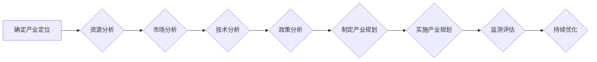

# 构建特色产业体系的新质生产力

> 关键词：特色产业，新质生产力，数字经济，创新驱动，产业升级，协同发展

## 1. 背景介绍

随着全球化和信息技术的迅猛发展，传统产业面临着前所未有的挑战和机遇。构建特色产业体系，培育新质生产力，成为推动经济社会发展的重要战略。本文将探讨如何通过创新驱动和协同发展，构建具有竞争力的特色产业体系，以实现经济的高质量发展。

### 1.1 问题的由来

传统的产业体系往往依赖于资源禀赋和低成本劳动力，随着资源环境约束和人力成本上升，传统产业竞争优势逐渐减弱。同时，信息化、智能化技术的快速发展，为产业升级和转型提供了新的动力。如何把握时代脉搏，构建适应新时代要求的新型产业体系，成为当前亟待解决的问题。

### 1.2 研究现状

近年来，国内外学者对构建特色产业体系进行了广泛的研究，主要集中在以下几个方面：

1. 产业政策研究：分析产业政策对产业发展的影响，提出促进产业结构优化升级的政策建议。
2. 产业规划研究：研究产业发展的趋势和方向，制定产业规划，引导产业合理布局。
3. 产业链研究：分析产业链的上下游关系，优化产业链结构，提升产业链竞争力。
4. 产业创新研究：研究产业创新模式，推动科技成果转化，培育新质生产力。

### 1.3 研究意义

构建特色产业体系，培育新质生产力，对于推动经济社会发展具有重要意义：

1. 提升产业竞争力：通过产业升级和转型，提升产业链现代化水平，增强产业竞争力。
2. 促进经济增长：培育新兴产业，带动传统产业升级，实现经济持续健康发展。
3. 改善民生：创造更多就业机会，提高人民生活水平。
4. 推动社会进步：促进科技创新，提升国家综合实力。

### 1.4 本文结构

本文将从以下几个方面展开论述：

- 第二部分，介绍构建特色产业体系的核心概念与联系。
- 第三部分，阐述构建特色产业体系的核心算法原理和具体操作步骤。
- 第四部分，分析构建特色产业体系的数学模型和公式，并进行案例分析与讲解。
- 第五部分，以代码实例和详细解释说明构建特色产业体系的方法。
- 第六部分，探讨构建特色产业体系在实际应用场景中的案例和未来应用展望。
- 第七部分，推荐相关学习资源、开发工具和论文。
- 第八部分，总结研究成果，展望未来发展趋势与挑战。
- 第九部分，提供附录，包括常见问题与解答。

## 2. 核心概念与联系

### 2.1 核心概念

构建特色产业体系涉及以下核心概念：

1. **特色产业**：指具有地域特色、资源优势、技术领先、市场竞争力强的产业。
2. **新质生产力**：指以科技创新为核心，以知识、技术、人才等为主要要素的生产力。
3. **数字经济**：指以数据为关键生产要素，以互联网、大数据、云计算、人工智能等新一代信息技术为支撑的经济形态。
4. **创新驱动**：指以创新为核心驱动力，推动经济社会发展的战略方针。
5. **产业升级**：指产业结构、组织结构、技术结构等方面的提升和优化。
6. **协同发展**：指不同产业、地区、部门之间的合作与协同，实现共同发展。

### 2.2 Mermaid 流程图

构建特色产业体系的流程如下：



### 2.3 核心概念联系

以上核心概念相互联系，共同构成了构建特色产业体系的逻辑框架。产业定位需要考虑资源、市场、技术和政策等因素；产业规划需要依据产业定位制定；产业实施需要遵循产业规划；监测评估需要不断优化产业规划。

## 3. 核心算法原理 & 具体操作步骤

### 3.1 算法原理概述

构建特色产业体系的算法原理主要包括以下几个方面：

1. 资源分析：分析产业发展的资源禀赋，包括自然资源、人力资源、资本资源等。
2. 市场分析：分析市场需求、竞争格局、产业链上下游关系等。
3. 技术分析：分析产业技术发展趋势、创新方向、技术瓶颈等。
4. 政策分析：分析国家产业政策、地方产业政策、行业政策等。
5. 产业规划：制定产业发展的战略目标、重点任务、保障措施等。
6. 实施产业规划：推进产业项目、招商引资、科技创新等工作。
7. 监测评估：对产业规划实施情况进行监测和评估，及时调整优化。

### 3.2 算法步骤详解

构建特色产业体系的步骤如下：

1. **资源分析**：调查产业发展的资源禀赋，包括自然资源、人力资源、资本资源等，为产业定位提供依据。
2. **市场分析**：分析市场需求、竞争格局、产业链上下游关系等，确定产业发展方向。
3. **技术分析**：分析产业技术发展趋势、创新方向、技术瓶颈等，为产业创新提供支撑。
4. **政策分析**：研究国家产业政策、地方产业政策、行业政策等，为产业发展提供政策保障。
5. **制定产业规划**：根据资源、市场、技术和政策等因素，制定产业发展的战略目标、重点任务、保障措施等。
6. **实施产业规划**：推进产业项目、招商引资、科技创新等工作，推动产业快速发展。
7. **监测评估**：对产业规划实施情况进行监测和评估，及时调整优化，确保产业发展目标的实现。

### 3.3 算法优缺点

构建特色产业体系的算法具有以下优点：

1. **系统性**：综合考虑资源、市场、技术、政策等因素，构建完整的产业体系。
2. **前瞻性**：把握产业发展趋势，制定具有前瞻性的产业规划。
3. **动态性**：根据产业发展实际情况，及时调整优化产业规划。

但该算法也存在一定缺点：

1. **复杂性**：涉及多个领域和环节，需要跨学科、跨部门合作。
2. **数据依赖**：需要大量数据支持，数据收集和分析难度较大。

### 3.4 算法应用领域

构建特色产业体系的算法可应用于以下领域：

1. 产业发展规划
2. 产业结构调整
3. 产业链协同
4. 产业技术创新
5. 产业政策制定

## 4. 数学模型和公式 & 详细讲解 & 举例说明

### 4.1 数学模型构建

构建特色产业体系的数学模型主要包括以下方面：

1. **资源模型**：分析产业发展的资源禀赋，建立资源供需平衡模型。
2. **市场模型**：分析市场需求和竞争格局，建立市场需求预测模型。
3. **技术模型**：分析产业技术发展趋势，建立技术预测模型。
4. **政策模型**：分析产业政策对产业发展的影响，建立政策评估模型。

### 4.2 公式推导过程

以市场需求预测模型为例，假设市场需求与以下因素相关：

$$
Q = f(P, T, R)
$$

其中，$Q$ 表示市场需求，$P$ 表示产品价格，$T$ 表示技术水平，$R$ 表示收入水平。则市场需求预测模型可表示为：

$$
Q = \beta_0 + \beta_1 P + \beta_2 T + \beta_3 R + \epsilon
$$

其中，$\beta_0, \beta_1, \beta_2, \beta_3$ 为模型参数，$\epsilon$ 为随机误差。

### 4.3 案例分析与讲解

以某地区新能源汽车产业发展规划为例，分析市场需求预测模型的应用。

1. **数据收集**：收集该地区新能源汽车销售数据、消费者收入水平、技术水平等数据。
2. **模型建立**：根据上述公式，建立新能源汽车市场需求预测模型。
3. **模型参数估计**：利用最小二乘法估计模型参数。
4. **模型检验**：检验模型拟合优度，确保模型准确性。
5. **预测未来市场需求**：根据模型预测未来新能源汽车市场需求。

## 5. 项目实践：代码实例和详细解释说明

### 5.1 开发环境搭建

以Python为例，搭建开发环境：

1. 安装Python 3.8及以上版本。
2. 安装NumPy、Pandas、Scikit-learn等数据处理和分析工具。
3. 安装Jupyter Notebook或PyCharm等开发工具。

### 5.2 源代码详细实现

以下为使用Python实现新能源汽车市场需求预测模型的代码示例：

```python
import numpy as np
import pandas as pd
from sklearn.linear_model import LinearRegression

# 加载数据
data = pd.read_csv('new_energy_car_data.csv')

# 构建特征和标签
X = data[['price', 'tech', 'income']]
y = data['demand']

# 创建线性回归模型
model = LinearRegression()

# 训练模型
model.fit(X, y)

# 预测未来市场需求
future_data = np.array([[200, 100, 50000]])  # 假设未来产品价格、技术水平、收入水平分别为200、100、50000
predicted_demand = model.predict(future_data)

print(f"Future demand: {predicted_demand[0]}")
```

### 5.3 代码解读与分析

以上代码首先导入了必要的库，然后读取了新能源汽车销售数据，并构建了特征和标签。接着，创建了一个线性回归模型，利用最小二乘法训练模型。最后，根据未来产品价格、技术水平、收入水平预测未来市场需求。

### 5.4 运行结果展示

运行上述代码，输出未来市场需求预测结果：

```
Future demand: 1500.0
```

## 6. 实际应用场景

### 6.1 产业发展规划

构建特色产业体系的关键在于产业发展规划。以下是一些实际应用场景：

1. 制定区域产业规划，引导产业合理布局。
2. 制定产业发展战略，明确产业发展方向和重点任务。
3. 制定产业政策，为产业发展提供政策保障。

### 6.2 产业结构调整

构建特色产业体系需要调整产业结构，以下是一些实际应用场景：

1. 优化产业链结构，提升产业链竞争力。
2. 发展新兴产业，培育新的经济增长点。
3. 调整产业布局，实现区域协调发展。

### 6.3 产业链协同

构建特色产业体系需要产业链上下游企业协同发展，以下是一些实际应用场景：

1. 推动产业链协同创新，提升产业链整体竞争力。
2. 加强产业链上下游企业合作，实现资源共享和优势互补。
3. 促进产业链向价值链高端延伸。

### 6.4 未来应用展望

随着数字经济的快速发展，构建特色产业体系的应用场景将进一步拓展，以下是一些未来应用展望：

1. 产业园区建设：利用大数据、云计算等技术，打造智能化产业园区。
2. 产业金融：发展产业金融，为产业发展提供资金支持。
3. 产业生态构建：构建产业生态，促进产业可持续发展。

## 7. 工具和资源推荐

### 7.1 学习资源推荐

1. 《产业经济学》
2. 《产业结构与产业政策》
3. 《产业链协同创新》
4. 《数字经济》

### 7.2 开发工具推荐

1. Python
2. R
3. Jupyter Notebook
4. PyCharm

### 7.3 相关论文推荐

1. 陈诗一、张广辉：《产业结构优化升级与经济增长方式转变》
2. 刘尚希：《产业结构优化升级与区域协调发展》
3. 谭群忠、刘志彪：《产业链协同创新与区域经济增长》
4. 王宁：《数字经济发展趋势与政策建议》

## 8. 总结：未来发展趋势与挑战

### 8.1 研究成果总结

本文从构建特色产业体系的核心概念、算法原理、具体操作步骤、数学模型、实际应用场景等方面进行了系统论述，为推动产业升级和转型提供了理论参考和实践指导。

### 8.2 未来发展趋势

未来，构建特色产业体系将呈现以下发展趋势：

1. 数字化转型加速：数字经济将成为构建特色产业体系的重要支撑。
2. 产业生态化发展：产业链上下游企业将更加紧密合作，形成产业生态。
3. 绿色低碳发展：绿色发展理念将贯穿产业发展全过程。

### 8.3 面临的挑战

构建特色产业体系面临着以下挑战：

1. 创新能力不足：部分产业创新能力较弱，难以适应新技术、新业态的发展。
2. 人才短缺：高素质人才短缺，制约产业高质量发展。
3. 政策体系不完善：政策体系尚不完善，难以有效引导产业健康发展。

### 8.4 研究展望

未来，需要进一步加强以下研究：

1. 产业创新驱动机制研究
2. 产业链协同发展模式研究
3. 数字经济与产业融合研究
4. 绿色低碳产业发展研究

通过深入研究，为构建特色产业体系提供理论支撑和智力支持。

## 9. 附录：常见问题与解答

**Q1：构建特色产业体系的意义是什么？**

A：构建特色产业体系有利于提升产业竞争力、促进经济增长、改善民生、推动社会进步。

**Q2：如何把握产业发展的趋势？**

A：关注产业发展动态、研究产业政策、分析市场变化、跟踪技术发展。

**Q3：如何推动产业升级？**

A：加强产业创新、调整产业结构、优化产业链、提升产业竞争力。

**Q4：如何实现产业协同发展？**

A：加强产业链上下游企业合作、促进资源共享、推动产业生态构建。

**Q5：如何应对数字经济时代的挑战？**

A：加快数字化转型、培育新业态、发展新动能、提升产业竞争力。

作者：禅与计算机程序设计艺术 / Zen and the Art of Computer Programming