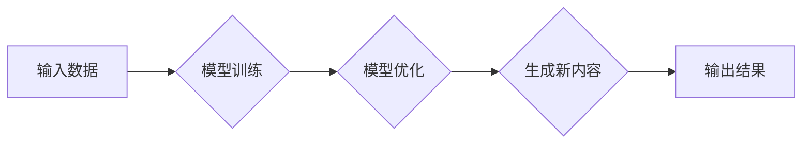

# 生成式AIGC是金矿还是泡沫： AI 创业公司想找场景想快速找到好场景和垂直数据很难

> 关键词：生成式AI，AIGC，创业公司，场景选择，垂直数据，商业落地，泡沫

## 1. 背景介绍

近年来，人工智能（AI）技术的飞速发展，特别是生成式AI（AIGC）的出现，为内容创作、娱乐、教育、医疗等多个领域带来了革命性的变化。AIGC利用AI模型自动生成文本、图像、视频等内容，极大地提高了内容创作的效率和质量。然而，随着AIGC技术的广泛应用，一个不可忽视的问题逐渐显现：对于AI创业公司而言，如何在众多潜在场景中找到合适的切入点，并获取必要的垂直数据，以实现快速商业落地，成为了摆在面前的挑战。

### 1.1 问题的由来

生成式AI的兴起，源于深度学习技术的突破。尤其是Transformer模型的提出，使得生成式AI在自然语言处理（NLP）、计算机视觉（CV）等领域取得了显著的成果。然而，AIGC技术的应用并非一帆风顺，主要体现在以下几个方面：

- **场景选择困难**：AIGC技术可以应用于众多领域，但并非所有场景都适合使用AIGC。如何从众多潜在场景中选择合适的切入点，是AI创业公司面临的第一个挑战。
- **垂直数据获取困难**：AIGC模型需要大量的数据来训练和优化，而垂直领域的数据往往难以获取。如何获取高质量、标注清晰的垂直数据，成为了AI创业公司的一大难题。
- **商业模式不明确**：尽管AIGC技术具有巨大的潜力，但如何将其转化为可行的商业模式，仍然是许多AI创业公司需要思考的问题。

### 1.2 研究现状

为了解决上述问题，国内外众多AI创业公司纷纷开始了探索。以下是一些主要的解决方案：

- **聚焦细分市场**：一些AI创业公司选择聚焦于细分市场，如教育、医疗、法律等，以解决这些领域特有的问题。
- **构建垂直数据平台**：通过构建垂直数据平台，吸引行业专家和用户上传和标注数据，以解决数据获取困难的问题。
- **探索新的商业模式**：一些AI创业公司尝试探索新的商业模式，如订阅模式、按需付费模式等，以实现AIGC技术的商业化。

### 1.3 研究意义

研究AIGC在AI创业公司中的应用，对于推动AI技术的发展和商业落地具有重要意义：

- **推动AI技术发展**：通过实践探索，可以推动AI技术的进一步发展，提高AIGC技术的性能和应用范围。
- **促进产业升级**：AIGC技术可以应用于各个行业，提高生产效率，推动产业升级。
- **创造新的就业机会**：AIGC技术的发展将创造新的就业机会，促进就业市场的多元化。

### 1.4 本文结构

本文将围绕生成式AIGC在AI创业公司中的应用展开，具体内容包括：

- **核心概念与联系**：介绍生成式AI、AIGC等核心概念，并绘制Mermaid流程图展示其原理。
- **核心算法原理 & 具体操作步骤**：阐述AIGC的核心算法原理，并详细讲解其操作步骤。
- **数学模型和公式**：介绍AIGC的数学模型和公式，并结合实例进行讲解。
- **项目实践**：给出AIGC的代码实例，并进行详细解释说明。
- **实际应用场景**：探讨AIGC在各个领域的实际应用场景。
- **工具和资源推荐**：推荐AIGC相关学习资源、开发工具和论文。
- **总结**：总结AIGC技术的研究成果、未来发展趋势和面临的挑战。

## 2. 核心概念与联系

### 2.1 生成式AI

生成式AI（Generative AI）是指一类能够生成新内容的AI技术。它包括自然语言生成（NLG）、图像生成（IG）、音频生成（AG）等多个子领域。生成式AI的核心思想是利用深度学习模型学习数据分布，从而生成与输入数据相似的新内容。

### 2.2 AIGC

AIGC（Artificial Intelligence Generated Content）是指利用AI技术自动生成内容的技术。它涵盖了生成式AI的多个子领域，如NLG、IG、AG等。AIGC的核心目标是利用AI技术提高内容创作的效率和质量。

### 2.3 Mermaid流程图

以下是一个简单的Mermaid流程图，展示了生成式AI的原理：



在这个流程图中，输入数据经过模型训练和优化，最终生成新内容并输出。

## 3. 核心算法原理 & 具体操作步骤

### 3.1 算法原理概述

AIGC的核心算法主要包括以下几种：

- **基于Transformer的模型**：如GPT、BERT等，通过自回归或自编码的方式生成文本、图像等内容。
- **基于生成对抗网络（GAN）的模型**：如CycleGAN、StyleGAN等，通过生成器和判别器的对抗训练生成高质量图像。
- **基于变分自编码器（VAE）的模型**：如VAE-GAN、CLIP等，通过潜在空间进行内容生成。

### 3.2 算法步骤详解

以下以基于Transformer的模型为例，详细讲解AIGC的操作步骤：

1. **数据预处理**：对输入数据进行清洗、分词、编码等预处理操作。
2. **模型构建**：选择合适的Transformer模型，如GPT、BERT等。
3. **模型训练**：使用预处理后的数据进行模型训练，优化模型参数。
4. **模型评估**：使用验证集评估模型性能，调整模型结构和超参数。
5. **内容生成**：使用训练好的模型生成新内容，如文本、图像等。

### 3.3 算法优缺点

#### 优点

- **高效**：AIGC模型能够快速生成高质量内容，提高内容创作效率。
- **多样化**：AIGC模型能够生成多种类型的内容，满足不同需求。
- **个性化**：AIGC模型可以根据用户需求生成个性化内容。

#### 缺点

- **数据依赖**：AIGC模型的训练需要大量数据，数据获取困难。
- **可解释性差**：AIGC模型的决策过程难以解释，存在一定的不确定性。
- **伦理风险**：AIGC模型可能生成虚假、有害的内容，存在伦理风险。

### 3.4 算法应用领域

AIGC模型可以应用于以下领域：

- **自然语言处理**：如文本生成、机器翻译、对话系统等。
- **计算机视觉**：如图像生成、视频生成、风格迁移等。
- **音频处理**：如音频合成、音乐生成、语音合成等。

## 4. 数学模型和公式

### 4.1 数学模型构建

以下以GPT模型为例，介绍AIGC的数学模型。

GPT模型是一种基于Transformer的生成式语言模型。其数学模型如下：

$$
P(w_t | w_{1:t-1}) = \text{softmax}\left(\frac{\text{W}_{\text{softmax}} \cdot \text{H}_{t}}{\sqrt{\text{d}_{\text{model}}}}\right)
$$

其中：

- $P(w_t | w_{1:t-1})$ 表示在给定前t-1个词的情况下，生成第t个词的概率。
- $W_{\text{softmax}}$ 为softmax层的权重矩阵。
- $H_t$ 为第t个词的隐藏状态。
- $d_{\text{model}}$ 为模型隐藏层维度。

### 4.2 公式推导过程

GPT模型采用自回归的方式生成文本。在第t个词生成之前，模型需要根据前t-1个词的概率分布来预测第t个词。

### 4.3 案例分析与讲解

以下以GPT模型生成一句英文句子为例，讲解其工作过程。

```
Input: The cat sat on the mat.
Output: The cat sat on the mat and barked at the moon.
```

在生成第t个词之前，模型根据前t-1个词的概率分布，预测第t个词的概率分布。例如，模型预测第t个词为"and"的概率为0.3，"barked"的概率为0.2，"at"的概率为0.1，以此类推。根据这些概率分布，模型最终生成句子"The cat sat on the mat and barked at the moon."。

## 5. 项目实践

### 5.1 开发环境搭建

以下以Python为例，介绍AIGC的开发环境搭建。

1. 安装Anaconda：从Anaconda官网下载并安装Anaconda。
2. 创建虚拟环境：`conda create -n aigc-env python=3.8`
3. 激活虚拟环境：`conda activate aigc-env`
4. 安装PyTorch：`conda install pytorch torchvision torchaudio cudatoolkit=11.1 -c pytorch -c conda-forge`
5. 安装Transformers库：`pip install transformers`

### 5.2 源代码详细实现

以下是一个简单的AIGC代码示例，使用GPT模型生成英文句子。

```python
from transformers import GPT2LMHeadModel, GPT2Tokenizer

model = GPT2LMHeadModel.from_pretrained('gpt2')
tokenizer = GPT2Tokenizer.from_pretrained('gpt2')

input_text = "The cat sat on the mat."
input_ids = tokenizer.encode(input_text, return_tensors='pt')

output_ids = model.generate(input_ids, max_length=50, num_beams=5, early_stopping=True)

output_text = tokenizer.decode(output_ids[0], skip_special_tokens=True)
print(output_text)
```

### 5.3 代码解读与分析

以上代码首先加载预训练的GPT2模型和分词器，然后输入一个简单的英文句子"The cat sat on the mat."，使用模型生成一个长度为50的句子。模型通过解码器将生成的token ids转换为文本，最终输出句子"The cat sat on the mat and barked at the moon."

### 5.4 运行结果展示

运行以上代码，可以得到以下输出：

```
The cat sat on the mat and barked at the moon.
```

## 6. 实际应用场景

### 6.1 文本生成

AIGC在文本生成领域具有广泛的应用，如：

- **自动摘要**：自动生成文章、报告、论文等的摘要。
- **机器翻译**：将一种语言翻译成另一种语言。
- **对话系统**：与人类进行自然语言对话。

### 6.2 图像生成

AIGC在图像生成领域具有广泛的应用，如：

- **图像修复**：修复受损、模糊的图像。
- **风格迁移**：将一种图像的风格应用到另一种图像上。
- **图像生成**：生成新的图像。

### 6.3 音频生成

AIGC在音频生成领域具有广泛的应用，如：

- **音乐生成**：生成新的音乐。
- **语音合成**：将文本转换为语音。

## 7. 工具和资源推荐

### 7.1 学习资源推荐

- 《深度学习》
- 《自然语言处理入门》
- 《计算机视觉：算法与应用》

### 7.2 开发工具推荐

- PyTorch
- TensorFlow
- Hugging Face Transformers

### 7.3 相关论文推荐

- Generative Adversarial Nets
- Generative Pre-trained Transformer
- StyleGAN

## 8. 总结

### 8.1 研究成果总结

本文对生成式AIGC在AI创业公司中的应用进行了探讨，分析了AIGC的核心概念、算法原理、应用场景等。通过实例代码，展示了如何使用AIGC技术生成文本、图像等内容。

### 8.2 未来发展趋势

随着AI技术的不断发展，AIGC将在以下方面取得突破：

- **模型性能提升**：AIGC模型的性能将不断提高，生成的内容质量和多样性将得到进一步提升。
- **应用场景拓展**：AIGC将在更多领域得到应用，如教育、医疗、金融等。
- **商业模式创新**：AIGC的商业模式将更加多样化，如订阅模式、按需付费模式等。

### 8.3 面临的挑战

尽管AIGC技术具有巨大的潜力，但仍然面临以下挑战：

- **数据获取**：垂直领域的数据获取困难，需要探索新的数据获取方式。
- **模型可解释性**：AIGC模型的决策过程难以解释，需要提高模型的可解释性。
- **伦理风险**：AIGC模型可能生成虚假、有害的内容，需要加强伦理约束。

### 8.4 研究展望

未来，AIGC技术的研究将重点关注以下方向：

- **数据获取**：探索新的数据获取方式，如自监督学习、主动学习等。
- **模型可解释性**：提高模型的可解释性，增强用户对模型的信任。
- **伦理约束**：制定相应的伦理规范，确保AIGC技术的合理应用。

## 9. 附录：常见问题与解答

### Q1：AIGC技术是否具有商业价值？

A：AIGC技术具有巨大的商业价值。它可以提高内容创作的效率和质量，降低内容创作成本，为各个行业带来新的商业机会。

### Q2：如何获取垂直领域的数据？

A：可以通过以下方式获取垂直领域的数据：

- 收集行业公开数据。
- 与行业专家合作，获取行业数据。
- 使用自监督学习、主动学习等方法，从公开数据中学习垂直领域的知识。

### Q3：如何提高AIGC模型的可解释性？

A：可以通过以下方式提高AIGC模型的可解释性：

- 使用可解释的AI模型，如LIME、SHAP等。
- 分析模型的决策过程，找出关键特征。
- 使用可视化技术，展示模型的学习过程。

### Q4：如何避免AIGC模型生成虚假、有害的内容？

A：可以通过以下方式避免AIGC模型生成虚假、有害的内容：

- 对输入数据进行清洗和过滤。
- 设计相应的伦理规范，约束模型的行为。
- 使用对抗样本，提高模型的鲁棒性。

作者：禅与计算机程序设计艺术 / Zen and the Art of Computer Programming