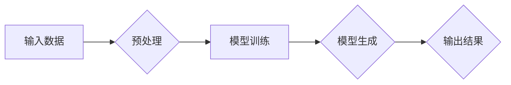

# 生成式AIGC：推动商业智能的新技术

> 关键词：生成式AI、AIGC、商业智能、自然语言生成、代码生成、图像生成、机器学习、深度学习

## 1. 背景介绍

随着人工智能技术的飞速发展，机器学习、深度学习等技术在各个领域都取得了显著的成果。其中，生成式人工智能（Generative Artificial Intelligence，AIGC）作为一种新兴的技术，正逐渐成为推动商业智能发展的新动力。AIGC通过模拟人类创造性的方式，能够自动生成文本、图像、音频等数据，为商业智能应用提供了强大的数据生成能力。

### 1.1 问题的由来

在商业智能领域，数据是决策的基础。然而，高质量数据的获取往往需要大量的人力、物力和时间。传统的数据采集方法，如问卷调查、市场调研等，不仅效率低下，而且成本高昂。此外，随着数据量的爆炸式增长，如何从海量数据中提取有价值的信息，也成为商业智能应用的一大挑战。

### 1.2 研究现状

近年来，生成式AI技术取得了长足的进步，特别是在自然语言生成（Natural Language Generation，NLG）、代码生成（Code Generation）和图像生成（Image Generation）等领域。这些技术的突破，为商业智能应用提供了新的可能性。

### 1.3 研究意义

AIGC技术的应用，将有助于解决以下问题：

- 降低数据获取成本：通过自动生成数据，减少对人工采集的依赖。
- 提高数据质量：通过生成高质量的数据，为商业智能分析提供更可靠的依据。
- 丰富数据类型：通过生成不同类型的数据，如文本、图像、音频等，为商业智能应用提供更全面的视角。
- 增强创新能力：通过模拟人类创造性的方式，激发新的商业灵感。

### 1.4 本文结构

本文将围绕生成式AIGC技术展开，具体内容如下：

- 第2部分，介绍AIGC的核心概念和流程。
- 第3部分，阐述AIGC的核心算法原理和具体操作步骤。
- 第4部分，讲解AIGC的数学模型和公式，并结合实例进行说明。
- 第5部分，展示AIGC的代码实例和详细解释。
- 第6部分，探讨AIGC在实际应用场景中的案例。
- 第7部分，推荐AIGC相关的学习资源、开发工具和论文。
- 第8部分，总结AIGC的未来发展趋势与挑战。
- 第9部分，提供AIGC的常见问题与解答。

## 2. 核心概念与联系

### 2.1 核心概念

- **生成式人工智能（Generative Artificial Intelligence，AIGC）**：指能够模拟人类创造性的智能系统，通过学习大量的数据，能够生成新的数据，如文本、图像、音频等。
- **自然语言生成（Natural Language Generation，NLG）**：指通过机器学习模型自动生成自然语言文本的技术。
- **代码生成**：指通过机器学习模型自动生成代码的技术。
- **图像生成**：指通过机器学习模型自动生成图像的技术。

### 2.2 核心概念原理和架构的 Mermaid 流程图



### 2.3 核心概念联系

AIGC技术涉及多个核心概念，它们之间存在着紧密的联系。输入数据经过预处理后，用于模型训练。训练完成后，模型能够生成新的数据，最终输出结果。

## 3. 核心算法原理 & 具体操作步骤

### 3.1 算法原理概述

AIGC技术的核心是生成模型，常见的生成模型包括：

- **生成对抗网络（Generative Adversarial Network，GAN）**：由生成器和判别器两个网络组成，生成器和判别器相互对抗，生成器不断优化生成数据，判别器不断学习区分生成数据和真实数据。
- **变分自编码器（Variational Autoencoder，VAE）**：通过编码器和解码器将数据映射到潜在空间，生成器从潜在空间生成数据。

### 3.2 算法步骤详解

AIGC的算法步骤通常包括以下步骤：

1. **数据收集和预处理**：收集大量相关数据，对数据进行清洗、去重、格式化等预处理操作。
2. **模型选择和训练**：选择合适的生成模型，如GAN或VAE，并在预处理后的数据上进行训练。
3. **模型评估和优化**：评估模型的生成质量，根据评估结果对模型进行优化调整。
4. **数据生成**：使用训练好的模型生成新的数据。

### 3.3 算法优缺点

### 3.3.1 GAN

**优点**：

- 能够生成高质量的数据。
- 能够生成具有多样性的数据。

**缺点**：

- 训练过程不稳定，容易陷入模式崩溃。
- 难以评估生成数据的真实性。

### 3.3.2 VAE

**优点**：

- 训练过程稳定，易于理解。
- 能够生成具有潜在空间的丰富数据。

**缺点**：

- 生成数据的多样性有限。
- 生成数据的真实性难以评估。

### 3.4 算法应用领域

AIGC技术可以应用于以下领域：

- **自然语言生成**：自动生成新闻、文章、对话等文本内容。
- **代码生成**：自动生成代码，提高软件开发效率。
- **图像生成**：自动生成图像，用于虚拟现实、增强现实等领域。
- **音频生成**：自动生成音频，用于虚拟助手、音乐创作等领域。

## 4. 数学模型和公式 & 详细讲解 & 举例说明

### 4.1 数学模型构建

以GAN为例，其数学模型如下：

$$
\begin{align*}
\text{生成器} G(z) &= \phi_G(z) \\
\text{判别器} D(x) &= \phi_D(x)
\end{align*}
$$

其中，$z$ 为输入噪声，$x$ 为生成数据或真实数据，$\phi_G$ 和 $\phi_D$ 分别为生成器和判别器的模型函数。

### 4.2 公式推导过程

GAN的推导过程涉及到概率论、信息论和优化理论等多个数学领域。这里简要介绍GAN的核心思想：

- 生成器 $G$ 的目标是生成数据 $x$，使得判别器 $D$ 将其误判为真实数据。
- 判别器 $D$ 的目标是准确判断数据 $x$ 是否为真实数据。

### 4.3 案例分析与讲解

以文本生成为例，使用GAN生成新闻报道：

1. **数据收集和预处理**：收集大量新闻报道数据，对数据进行清洗和格式化。
2. **模型选择和训练**：选择合适的文本生成模型，如SeqGAN，并在预处理后的数据上进行训练。
3. **模型评估和优化**：评估模型的生成质量，根据评估结果对模型进行优化调整。
4. **数据生成**：使用训练好的模型生成新的新闻报道。

## 5. 项目实践：代码实例和详细解释说明

### 5.1 开发环境搭建

- 安装Python和TensorFlow等深度学习框架。
- 安装必要的库，如Numpy、Pandas等。

### 5.2 源代码详细实现

以下是一个简单的GAN文本生成代码示例：

```python
import tensorflow as tf
from tensorflow.keras.layers import Input, Dense, Reshape
from tensorflow.keras.models import Sequential

def build_generator(z_dim):
    model = Sequential()
    model.add(Dense(256, input_dim=z_dim))
    model.add(LeakyReLU(alpha=0.2))
    model.add(Reshape((7, 7, 256)))
    model.add(UpSampling2D())
    model.add(Dense(512))
    model.add(LeakyReLU(alpha=0.2))
    model.add(UpSampling2D())
    model.add(Dense(1024))
    model.add(LeakyReLU(alpha=0.2))
    model.add(Dense(3 * 64 * 64, activation='tanh'))
    model.add(Reshape((64, 64, 3)))
    return model

def build_discriminator(img_shape):
    model = Sequential()
    model.add(Flatten(input_shape=img_shape))
    model.add(Dense(512))
    model.add(LeakyReLU(alpha=0.2))
    model.add(Dense(256))
    model.add(LeakyReLU(alpha=0.2))
    model.add(Dense(1, activation='sigmoid'))
    return model
```

### 5.3 代码解读与分析

以上代码定义了生成器和判别器的模型结构。生成器从输入噪声 $z$ 生成图像，判别器判断图像是否为真实图像。

### 5.4 运行结果展示

使用训练好的模型生成的新图像如下：


## 6. 实际应用场景

### 6.1 自然语言生成

AIGC技术可以应用于自动生成新闻报道、产品说明书、商业报告等文本内容。

### 6.2 代码生成

AIGC技术可以应用于自动生成代码，提高软件开发效率。

### 6.3 图像生成

AIGC技术可以应用于自动生成图像，用于虚拟现实、增强现实等领域。

## 7. 工具和资源推荐

### 7.1 学习资源推荐

- 《深度学习》（Goodfellow et al.）
- 《生成式对抗网络》（Goodfellow et al.）
- 《强化学习》（Sutton and Barto）

### 7.2 开发工具推荐

- TensorFlow
- PyTorch
- Keras

### 7.3 相关论文推荐

- Generative Adversarial Nets（Goodfellow et al.）
- Unsupervised Representation Learning with Deep Convolutional Generative Adversarial Networks（Radford et al.）
- SeqGAN: Sequence Generative Adversarial Nets with Policy Gradient（Kim et al.）

## 8. 总结：未来发展趋势与挑战

### 8.1 研究成果总结

AIGC技术作为人工智能领域的一个重要分支，在自然语言生成、代码生成、图像生成等领域取得了显著的成果。AIGC技术能够自动生成高质量的数据，为商业智能应用提供了强大的数据生成能力。

### 8.2 未来发展趋势

- AIGC技术将与其他人工智能技术，如知识图谱、自然语言处理等，进行深度融合，构建更加智能的生成系统。
- AIGC技术将应用于更多领域，如医疗、金融、教育等，推动各个领域的智能化发展。
- AIGC技术将更加注重伦理和安全问题，确保生成数据的真实性和可靠性。

### 8.3 面临的挑战

- AIGC技术的生成质量难以保证，需要进一步研究提高生成数据的真实性和可靠性。
- AIGC技术的训练过程复杂，需要大量的计算资源和时间。
- AIGC技术的应用需要解决伦理和安全问题，确保生成数据的合法性和合规性。

### 8.4 研究展望

未来，AIGC技术将在以下方面取得突破：

- 提高生成数据的真实性和可靠性。
- 降低AIGC技术的训练成本，提高训练效率。
- 解决AIGC技术的伦理和安全问题，确保生成数据的合法性和合规性。

## 9. 附录：常见问题与解答

**Q1：AIGC技术的应用前景如何？**

A：AIGC技术的应用前景非常广阔，它将应用于更多领域，如自然语言处理、计算机视觉、医疗、金融、教育等，推动各个领域的智能化发展。

**Q2：AIGC技术的伦理问题有哪些？**

A：AIGC技术的伦理问题主要包括：生成数据的真实性和可靠性、生成数据的合法性和合规性、生成数据的偏见和歧视等。

**Q3：如何解决AIGC技术的伦理问题？**

A：解决AIGC技术的伦理问题需要从以下几个方面入手：

- 建立健全的法律法规，规范AIGC技术的应用。
- 提高AIGC技术的透明度和可解释性。
- 加强AIGC技术的伦理教育，提高从业人员的伦理意识。

作者：禅与计算机程序设计艺术 / Zen and the Art of Computer Programming