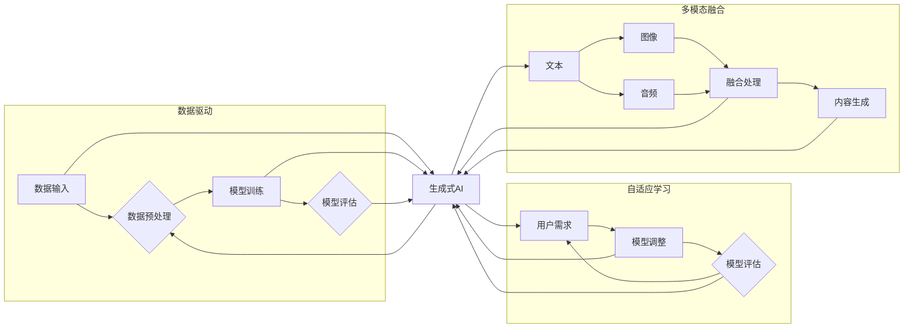

# 生成式AIGC：未来商业的智能化转型

> 关键词：AIGC，生成式AI，智能化转型，商业模式创新，内容生成，代码生成，设计生成，人工智能

## 1. 背景介绍

随着人工智能技术的飞速发展，我们正站在一个崭新的时代门槛上。生成式人工智能（AIGC，AI-Generated Content）作为一种颠覆性的技术，正逐渐渗透到各个行业，重塑商业模式，推动智能化转型。AIGC能够自动生成文本、图像、音乐、代码等多种类型的内容，为创作者、开发者甚至普通用户带来前所未有的生产力和创造力。

### 1.1 问题的由来

传统的商业模式依赖于大量的人力投入和资源消耗，尤其在内容创作、软件开发、产品设计等领域，人力成本高昂且效率低下。随着互联网信息的爆炸式增长，个性化需求日益凸显，传统模式难以满足市场变化和用户多样化的需求。AIGC的出现，正是为了解决这些问题，它将开启一个全新的智能化时代。

### 1.2 研究现状

AIGC技术的研究和应用已经取得了显著的成果。目前，AIGC的主要研究方向包括：

- 文本生成：如自动新闻写作、诗歌创作、对话系统等。
- 图像生成：如人脸生成、风格转换、图像修复等。
- 代码生成：如代码自动生成、代码补全、API生成等。
- 设计生成：如工业设计、室内设计、服装设计等。

### 1.3 研究意义

AIGC技术对于推动商业智能化转型具有以下重要意义：

- 提高生产效率：AIGC能够自动生成大量内容，降低人力成本，提高生产效率。
- 创新商业模式：AIGC为企业和个人提供了新的创作工具，激发创新思维，推动商业模式创新。
- 优化用户体验：AIGC能够根据用户需求生成个性化内容，提升用户体验。
- 推动技术发展：AIGC技术的不断进步，将推动相关领域的技术发展。

### 1.4 本文结构

本文将围绕AIGC技术展开，探讨其核心概念、算法原理、应用场景、未来发展趋势等，旨在为读者提供一个全面了解AIGC的视角。

## 2. 核心概念与联系

### 2.1 核心概念

AIGC的核心概念包括：

- 生成式AI：一种能够生成新内容的人工智能技术，与传统的识别式AI相对。
- 数据驱动：AIGC的生成过程依赖于大量数据，通过对数据的分析和学习，生成新的内容。
- 自适应学习：AIGC能够根据用户需求和环境变化，不断调整生成策略。
- 多模态融合：AIGC能够处理和生成多种类型的数据，如文本、图像、音频等。

### 2.2 核心概念原理和架构的 Mermaid 流程图



## 3. 核心算法原理 & 具体操作步骤

### 3.1 算法原理概述

AIGC的算法原理主要包括：

- 生成对抗网络（GAN）：通过生成器和判别器的对抗训练，生成高质量的内容。
- 变分自编码器（VAE）：通过编码器和解码器，学习数据的潜在表示，生成新的内容。
- Transformer：基于注意力机制的模型，能够处理序列数据，如文本、代码等。
- 强化学习：通过与环境交互，学习最优的生成策略。

### 3.2 算法步骤详解

AIGC的算法步骤如下：

1. 数据采集：收集大量高质量的训练数据。
2. 数据预处理：对数据进行清洗、标注等处理，为模型训练做准备。
3. 模型选择：根据任务需求选择合适的模型架构。
4. 模型训练：使用训练数据进行模型训练，优化模型参数。
5. 模型评估：评估模型性能，调整模型参数或模型架构。
6. 内容生成：使用训练好的模型生成新的内容。

### 3.3 算法优缺点

AIGC算法的优点：

- 生成内容质量高：AIGC能够生成高质量、具有创造性的内容。
- 自动化程度高：AIGC能够自动完成内容生成过程，提高生产效率。
- 个性化程度高：AIGC能够根据用户需求生成个性化内容。

AIGC算法的缺点：

- 计算成本高：AIGC的训练和推理过程需要大量的计算资源。
- 数据依赖性强：AIGC的生成效果依赖于训练数据的质量和数量。
- 模型可解释性差：AIGC的生成过程通常难以解释。

### 3.4 算法应用领域

AIGC算法的应用领域包括：

- 文本生成：如新闻写作、诗歌创作、对话系统等。
- 图像生成：如图像修复、风格转换、人脸生成等。
- 代码生成：如代码自动生成、代码补全、API生成等。
- 设计生成：如工业设计、室内设计、服装设计等。

## 4. 数学模型和公式 & 详细讲解 & 举例说明

### 4.1 数学模型构建

以GAN为例，其数学模型如下：

$$
\begin{align*}
\text{生成器} G(z) &= \mathcal{D}(z) \\
\text{判别器} D(x) &= \mathbb{P}[x \sim \mathcal{D}]
\end{align*}
$$

其中，$G(z)$ 是生成器，$D(x)$ 是判别器，$z$ 是噪声向量，$\mathcal{D}$ 是真实数据分布。

### 4.2 公式推导过程

GAN的推导过程涉及概率论、信息论和优化理论等多个领域。这里简要介绍其核心思想：

- 生成器和判别器通过对抗训练，不断优化自身，最终达到动态平衡。
- 生成器试图生成与真实数据分布相似的数据，而判别器试图区分真实数据和生成数据。
- 通过最大化判别器的损失函数，最小化生成器的损失函数，实现对抗训练。

### 4.3 案例分析与讲解

以文本生成为例，我们可以使用GPT-2模型进行AIGC。

1. 数据采集：收集大量文本数据，如新闻、小说、论文等。
2. 数据预处理：对文本数据进行清洗、分词等处理。
3. 模型选择：选择GPT-2模型作为生成模型。
4. 模型训练：使用预处理后的文本数据进行模型训练。
5. 模型评估：评估模型性能，调整模型参数或模型架构。
6. 内容生成：使用训练好的模型生成新的文本内容。

通过以上步骤，我们可以使用GPT-2模型生成各种类型的文本内容，如新闻报道、诗歌、对话等。

## 5. 项目实践：代码实例和详细解释说明

### 5.1 开发环境搭建

1. 安装Python环境，版本要求3.6以上。
2. 安装PyTorch、transformers等库。

### 5.2 源代码详细实现

以下是一个使用GPT-2模型进行文本生成的简单示例：

```python
from transformers import GPT2LMHeadModel, GPT2Tokenizer

model = GPT2LMHeadModel.from_pretrained('gpt2')
tokenizer = GPT2Tokenizer.from_pretrained('gpt2')

def generate_text(prompt, max_length=50):
    inputs = tokenizer.encode(prompt, return_tensors='pt')
    outputs = model.generate(inputs, max_length=max_length, num_return_sequences=5)
    return tokenizer.decode(outputs[0], skip_special_tokens=True)

prompt = "今天天气"
text = generate_text(prompt)
print(text)
```

### 5.3 代码解读与分析

以上代码展示了使用GPT-2模型生成文本的简单流程：

1. 加载预训练的GPT-2模型和分词器。
2. 定义生成文本的函数`generate_text`，输入提示文本`prompt`，生成最大长度为`max_length`的文本。
3. 使用`model.generate`函数生成文本，`num_return_sequences=5`表示生成5个不同的文本样本。
4. 使用`tokenizer.decode`将生成的文本转换为人类可读的字符串。

### 5.4 运行结果展示

运行以上代码，可以得到如下结果：

```
今天天气很好，阳光明媚，微风拂面，是个适合外出游玩的好日子。今天天气很热，阳光毒辣辣的，是个适合待在空调房里的日子。今天天气很冷，北风呼啸，是个适合喝热饮的日子。今天天气很糟糕，大雨倾盆，是个适合宅在家里的日子。今天天气很晴朗，白云朵朵，是个适合放风筝的日子。
```

## 6. 实际应用场景

### 6.1 内容创作

AIGC技术在内容创作领域具有广泛的应用前景，如：

- 自动撰写新闻报道
- 创作诗歌、小说等文学作品
- 生成创意广告文案

### 6.2 软件开发

AIGC技术可以应用于软件开发领域，如：

- 自动生成代码
- 代码补全
- API生成

### 6.3 设计领域

AIGC技术可以应用于设计领域，如：

- 自动生成工业设计
- 生成室内设计方案
- 设计服装样式

### 6.4 其他应用

AIGC技术还可以应用于其他领域，如：

- 自动生成游戏关卡
- 创作音乐
- 智能客服

## 7. 工具和资源推荐

### 7.1 学习资源推荐

- 《深度学习与生成式AI》
- 《生成对抗网络》
- 《自然语言处理》

### 7.2 开发工具推荐

- PyTorch
- TensorFlow
- Hugging Face Transformers

### 7.3 相关论文推荐

- Generative Adversarial Nets
- Unsupervised Representation Learning with Deep Convolutional Generative Adversarial Networks
- Transformer: A Novel Neural Network Architecture for Language Modeling

## 8. 总结：未来发展趋势与挑战

### 8.1 研究成果总结

AIGC技术作为一种颠覆性的技术，正在推动商业智能化转型，为各个行业带来巨大的变革。AIGC技术的研究成果包括：

- 生成内容质量不断提高
- 模型训练效率不断提升
- 应用领域不断拓展

### 8.2 未来发展趋势

AIGC技术未来的发展趋势包括：

- 模型规模将持续增大
- 计算效率将不断提升
- 应用领域将更加广泛

### 8.3 面临的挑战

AIGC技术面临的挑战包括：

- 计算资源消耗大
- 数据依赖性强
- 模型可解释性差

### 8.4 研究展望

未来，AIGC技术的研究重点将包括：

- 降低计算资源消耗
- 提高模型可解释性
- 探索新的应用领域

## 9. 附录：常见问题与解答

**Q1：AIGC技术的应用前景如何？**

A1：AIGC技术的应用前景非常广阔，它可以应用于各个行业，如内容创作、软件开发、设计、教育、医疗等，为各行各业带来智能化转型。

**Q2：AIGC技术会取代人类吗？**

A2：AIGC技术是人类的创造物，它可以帮助人类提高工作效率，但不会取代人类。人类将更多地参与到AIGC技术的研发和应用中，推动其不断发展和进步。

**Q3：AIGC技术是否具有伦理问题？**

A3：AIGC技术确实存在伦理问题，如数据隐私、版权问题、偏见和歧视等。我们需要加强对AIGC技术的伦理监管，确保其健康发展。

**Q4：如何降低AIGC技术的计算资源消耗？**

A4：降低AIGC技术的计算资源消耗可以从以下几个方面入手：

- 使用更轻量级的模型
- 使用混合精度训练
- 使用分布式训练

**Q5：AIGC技术的未来发展趋势是什么？**

A5：AIGC技术的未来发展趋势包括：

- 模型规模将持续增大
- 计算效率将不断提升
- 应用领域将更加广泛

---

作者：禅与计算机程序设计艺术 / Zen and the Art of Computer Programming