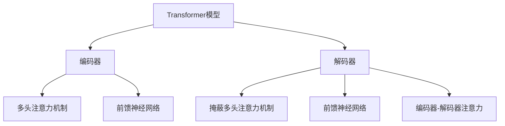
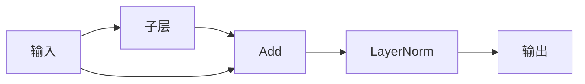

# Transformer大模型实战 叠加和归一组件

## 1. 背景介绍

### 1.1 问题的由来

随着深度学习在自然语言处理、计算机视觉等领域的广泛应用,Transformer模型因其强大的并行计算能力和长期依赖捕捉能力而备受关注。然而,训练大规模Transformer模型面临着巨大的计算和内存开销挑战。为了解决这一问题,研究人员提出了一系列优化技术,其中叠加(Add)和归一(Norm)是两个关键的优化组件。

### 1.2 研究现状

传统的Transformer模型在每一层中都包含了多头注意力机制和前馈神经网络,这两个模块都涉及大量的矩阵乘法运算,计算复杂度高。为了加速训练,一种常见的优化方法是使用更小的embedding维度,但这可能会导致信息损失。另一种方法是模型并行,将模型分割到多个GPU上训练,但这需要额外的通信开销。

近年来,研究人员发现,在Transformer的每一层中插入叠加和归一组件可以显著提高模型的训练效率和性能。这两个组件看似简单,但对于大规模Transformer模型的训练至关重要。

### 1.3 研究意义

叠加和归一组件的引入不仅能够加速Transformer模型的训练,还能提高模型的泛化能力和鲁棒性。通过深入探讨这两个组件的原理和实现细节,我们可以更好地理解和优化大规模Transformer模型的训练过程,从而推动自然语言处理、计算机视觉等领域的发展。

### 1.4 本文结构

本文将从以下几个方面深入探讨Transformer大模型中的叠加和归一组件:

1. 核心概念与联系
2. 核心算法原理与具体操作步骤
3. 数学模型和公式详细讲解与案例分析
4. 项目实践:代码实例和详细解释说明
5. 实际应用场景
6. 工具和资源推荐
7. 总结:未来发展趋势与挑战
8. 附录:常见问题与解答

## 2. 核心概念与联系

在深入探讨叠加和归一组件之前,我们需要先了解一些基本概念。

### 2.1 Transformer模型

Transformer是一种基于注意力机制的序列到序列(Seq2Seq)模型,广泛应用于机器翻译、文本生成、对话系统等自然语言处理任务。它由编码器(Encoder)和解码器(Decoder)两个主要部分组成,每个部分由多个相同的层组成。每一层包含两个子层:多头注意力机制(Multi-Head Attention)和前馈神经网络(Feed-Forward Neural Network)。

### 2.2 叠加(Add)

叠加操作是指在Transformer的每一层中,将子层的输出与输入相加。具体来说,对于编码器和解码器中的每一层,我们有:

$$
\text{Output} = \text{LayerNorm}(\text{Input} + \text{Sublayer}(\text{Input}))
$$

其中,Sublayer可以是多头注意力机制或前馈神经网络。通过将子层的输出与输入相加,我们可以更好地保留原始输入的信息,从而提高模型的表现。

### 2.3 归一(Norm)

归一操作是指在叠加之后,对输出进行归一化处理。在Transformer中,常用的归一化方法是层归一化(Layer Normalization)。层归一化的目的是加快模型的收敛速度,提高模型的泛化能力。

具体来说,对于一个输入向量 $\mathbf{x} = (x_1, x_2, \dots, x_n)$,层归一化的计算公式如下:

$$
\text{LayerNorm}(\mathbf{x}) = \gamma \odot \frac{\mathbf{x} - \mu}{\sqrt{\sigma^2 + \epsilon}} + \beta
$$

其中,

- $\mu = \frac{1}{n}\sum_{i=1}^{n}x_i$ 是输入向量的均值
- $\sigma^2 = \frac{1}{n}\sum_{i=1}^{n}(x_i - \mu)^2$ 是输入向量的方差
- $\gamma$ 和 $\beta$ 是可学习的缩放和偏移参数
- $\epsilon$ 是一个很小的常数,用于避免分母为零
- $\odot$ 表示元素wise乘积运算

通过层归一化,我们可以加速模型的收敛,同时提高模型的泛化能力。

### 2.4 叠加和归一的联系

叠加和归一操作在Transformer模型中是紧密相连的。它们共同构成了一个基本的残差连接(Residual Connection)和归一化(Normalization)模块,如下图所示:

这个模块的作用是:

1. 将子层(如多头注意力或前馈神经网络)的输出与原始输入相加,以保留原始信息。
2. 对相加的结果进行层归一化,以加快收敛速度和提高泛化能力。

通过这种残差连接和归一化的设计,Transformer模型能够更好地捕捉长期依赖关系,同时避免梯度消失或梯度爆炸的问题。

## 3. 核心算法原理与具体操作步骤

### 3.1 算法原理概述

叠加和归一组件的核心原理是基于残差连接(Residual Connection)和归一化(Normalization)。残差连接可以帮助模型更好地保留原始输入的信息,避免信息丢失。而归一化则可以加快模型的收敛速度,提高模型的泛化能力。

在Transformer模型中,每一层都包含一个或多个子层(如多头注意力机制或前馈神经网络)。对于每个子层,我们首先计算其输出,然后将输出与原始输入相加,得到残差连接的结果。接着,我们对残差连接的结果进行层归一化,得到最终的输出。

这个过程可以用以下公式表示:

$$
\text{Output} = \text{LayerNorm}(\text{Input} + \text{Sublayer}(\text{Input}))
$$

其中,Sublayer表示子层的计算过程,可以是多头注意力机制或前馈神经网络。

层归一化(Layer Normalization)的具体计算公式如下:

$$
\text{LayerNorm}(\mathbf{x}) = \gamma \odot \frac{\mathbf{x} - \mu}{\sqrt{\sigma^2 + \epsilon}} + \beta
$$

其中,

- $\mu = \frac{1}{n}\sum_{i=1}^{n}x_i$ 是输入向量的均值
- $\sigma^2 = \frac{1}{n}\sum_{i=1}^{n}(x_i - \mu)^2$ 是输入向量的方差
- $\gamma$ 和 $\beta$ 是可学习的缩放和偏移参数
- $\epsilon$ 是一个很小的常数,用于避免分母为零
- $\odot$ 表示元素wise乘积运算

通过这种残差连接和归一化的设计,Transformer模型能够更好地捕捉长期依赖关系,同时避免梯度消失或梯度爆炸的问题。

### 3.2 算法步骤详解

现在,我们来详细解释一下叠加和归一组件的具体实现步骤。

1. **计算子层输出**

对于每一层中的每个子层(如多头注意力机制或前馈神经网络),我们首先计算其输出。假设输入为 $\mathbf{x}$,子层的计算过程为 $f(\cdot)$,则子层的输出为:

$$
\text{Sublayer}(\mathbf{x}) = f(\mathbf{x})
$$

2. **残差连接**

接下来,我们将子层的输出与原始输入相加,得到残差连接的结果:

$$
\text{Residual} = \mathbf{x} + \text{Sublayer}(\mathbf{x})
$$

残差连接的目的是保留原始输入的信息,避免信息丢失。

3. **层归一化**

对残差连接的结果进行层归一化,得到最终的输出:

$$
\text{Output} = \text{LayerNorm}(\text{Residual})
$$

层归一化的具体计算过程如下:

$$
\text{LayerNorm}(\mathbf{x}) = \gamma \odot \frac{\mathbf{x} - \mu}{\sqrt{\sigma^2 + \epsilon}} + \beta
$$

其中,

- $\mu = \frac{1}{n}\sum_{i=1}^{n}x_i$ 是输入向量的均值
- $\sigma^2 = \frac{1}{n}\sum_{i=1}^{n}(x_i - \mu)^2$ 是输入向量的方差
- $\gamma$ 和 $\beta$ 是可学习的缩放和偏移参数
- $\epsilon$ 是一个很小的常数,用于避免分母为零
- $\odot$ 表示元素wise乘积运算

层归一化的目的是加快模型的收敛速度,提高模型的泛化能力。

4. **重复上述步骤**

对于每一层中的每个子层,我们都重复上述步骤,即计算子层输出、残差连接和层归一化。

通过这种方式,Transformer模型能够更好地捕捉长期依赖关系,同时避免梯度消失或梯度爆炸的问题。

### 3.3 算法优缺点

**优点:**

1. **保留原始信息**:通过残差连接,我们可以更好地保留原始输入的信息,避免信息丢失。
2. **加速收敛**:层归一化可以加快模型的收敛速度,提高训练效率。
3. **提高泛化能力**:层归一化还可以提高模型的泛化能力,使模型在测试数据上表现更好。
4. **避免梯度问题**:残差连接和归一化可以有效避免梯度消失或梯度爆炸的问题,使模型更加稳定。

**缺点:**

1. **额外计算开销**:残差连接和层归一化会引入一些额外的计算开销,尽管相对于整个模型的计算量来说,这个开销是可以忽略不计的。
2. **超参数选择**:层归一化中的缩放和偏移参数需要谨慎选择,以避免不当的缩放或偏移导致模型性能下降。

总的来说,叠加和归一组件的优点远远大于缺点。它们在大规模Transformer模型的训练中发挥了关键作用,是不可或缺的优化技术。

### 3.4 算法应用领域

叠加和归一组件广泛应用于各种基于Transformer的模型,包括但不限于:

1. **机器翻译**:Google的GNMT(Google Neural Machine Translation)、OpenNMT等机器翻译系统都采用了Transformer模型。
2. **文本生成**:GPT(Generative Pre-trained Transformer)、BART(Bidirectional and Auto-Regressive Transformers)等文本生成模型都基于Transformer架构。
3. **对话系统**:DialoGPT、Meena等开放域对话系统也使用了Transformer模型。
4. **计算机视觉**:Vision Transformer(ViT)在图像分类、目标检测等计算机视觉任务上取得了优异的表现。
5. **语音识别**:Transformer-Transducer模型在语音识别领域也有广泛应用。
6. **推理任务**:BERT(Bidirectional Encoder Representations from Transformers)等预训练语言模型在自然语言推理、问答系统等任务上表现出色。

总的来说,叠加和归一组件是Transformer模型中不可或缺的重要组成部分,在各种任务和领域中发挥着关键作用。

## 4. 数学模型和公式详细讲解与举例说明

在上一节中,我们介绍了叠加和归一组件的核心算法原理和具体操作步骤。现在,我们将深入探讨其中涉及的数学模型和公式,并通过具体案例进行详细讲解和举例说明。

### 4.1 数学模型构建

我们首先回顾一下叠加和归一组件的核心数学模型。对于每一层中的每个子层(如多头注意力机制或前馈神经网络),我们有:

$$