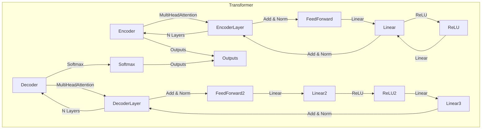

# Transformer大模型实战 线性层和softmax层

## 1. 背景介绍

### 1.1 问题的由来

在自然语言处理(NLP)和计算机视觉(CV)等领域,Transformer模型凭借其强大的表现力和并行计算能力,已经成为深度学习的主流架构之一。Transformer的核心组件包括多头注意力机制、位置编码、层归一化和前馈神经网络等。其中,线性层和softmax层在整个Transformer架构中扮演着至关重要的角色。

线性层(Linear Layer)作为前馈神经网络的基本组成部分,负责对输入进行仿射变换,从而提取更加抽象和高级的特征表示。而softmax层则通过对线性层的输出进行归一化处理,输出一组代表概率分布的值,常用于多分类任务的输出层。

### 1.2 研究现状

目前,Transformer模型在机器翻译、文本生成、图像分类等多个领域取得了卓越的成绩,但其内部机理和优化方法仍有待进一步探索。线性层和softmax层作为Transformer的核心组件,对模型的性能和效率影响重大,因此成为研究的热点。

一些学者专注于线性层的优化,如通过知识蒸馏、剪枝等方法压缩模型大小,或者探索新的激活函数来提高非线性表达能力。另一些研究则集中在softmax层,试图通过改进交叉熵损失函数、设计新的归一化方法等手段来提高模型的收敛速度和泛化能力。

### 1.3 研究意义

深入理解线性层和softmax层的原理和实现细节,对于全面把握Transformer模型的工作机制至关重要。本文将系统地介绍这两个核心组件的理论基础、数学模型、实现方法和优化技巧,旨在为读者提供一个全面而深入的视角,帮助读者掌握Transformer模型的精髓。

此外,本文还将探讨线性层和softmax层在实际应用中的常见问题和解决方案,为读者在实践中遇到的难题提供参考和借鉴。相信通过对这两个关键组件的深入剖析,必将为读者在Transformer模型的研究和应用方面带来诸多启发和收获。

### 1.4 本文结构

本文共分为9个部分,内容安排如下:

1. 背景介绍:阐述研究问题的由来、现状和意义,并概述全文结构。

2. 核心概念与联系:介绍线性层和softmax层在Transformer架构中的地位和作用,并说明它们与其他组件的关系。

3. 核心算法原理和具体操作步骤:深入探讨线性层和softmax层的理论基础、数学原理和实现细节。

4. 数学模型和公式详细讲解与举例说明:对线性层和softmax层的数学模型进行严格的推导,并结合具体案例进行讲解和分析。

5. 项目实践:代码实例和详细解释说明:提供基于PyTorch和TensorFlow的线性层和softmax层实现代码,并进行逐行解读和分析。

6. 实际应用场景:介绍线性层和softmax层在机器翻译、文本生成等领域的实际应用,并分析其在这些场景中的作用和效果。

7. 工具和资源推荐:为读者提供相关的学习资源、开发工具、论文等推荐,以帮助读者更好地掌握和实践本文内容。

8. 总结:未来发展趋势与挑战:总结本文的主要内容,并对线性层和softmax层在Transformer模型中的未来发展趋势和面临的挑战进行展望和讨论。

9. 附录:常见问题与解答:针对线性层和softmax层的实现和应用中可能遇到的常见问题,提供解答和建议。

## 2. 核心概念与联系

在深入探讨线性层和softmax层之前,我们有必要先了解一下它们在Transformer架构中的地位和作用,以及与其他组件的关系。

如上图所示,Transformer模型由编码器(Encoder)和解码器(Decoder)两个主要部分组成。

在编码器部分,输入序列首先经过多头注意力机制(Multi-Head Attention)进行特征提取,然后将注意力输出与输入进行残差连接(Add & Norm),再送入前馈神经网络(Feed Forward)进行进一步处理。前馈神经网络由两个线性层(Linear)和一个ReLU激活函数组成,用于对输入进行非线性变换,提取更加抽象的特征表示。

解码器部分的结构与编码器类似,不同之处在于它还包含一个额外的多头注意力机制,用于关注编码器的输出。在解码器的最后一层,我们会得到一个对每个目标词的概率分布,这个分布是通过softmax层(Softmax)对前一层的线性层输出进行归一化得到的。

可见,线性层和softmax层在Transformer架构中扮演着极其重要的角色。线性层作为前馈神经网络的核心部分,负责对输入进行仿射变换,提取高级特征;而softmax层则将这些特征映射为概率分布,为下游任务(如机器翻译、文本生成等)提供输出。

因此,深入理解线性层和softmax层的原理和实现细节,对于全面掌握Transformer模型的工作机制至关重要。下面我们将对这两个组件进行更加深入的探讨。

## 3. 核心算法原理和具体操作步骤

### 3.1 算法原理概述

#### 3.1.1 线性层(Linear Layer)

线性层是神经网络中最基本的一种操作,它对输入进行仿射变换(affine transformation),即进行线性变换后再加上一个偏置项。具体来说,给定一个输入矩阵 $X \in \mathbb{R}^{m \times n}$,线性层的计算过程为:

$$\text{Output} = XW + b$$

其中 $W \in \mathbb{R}^{n \times p}$ 为可学习的权重矩阵, $b \in \mathbb{R}^p$ 为可学习的偏置向量,输出 $\text{Output} \in \mathbb{R}^{m \times p}$。

线性层的作用是将输入从一个向量空间映射到另一个向量空间,通过改变输入的维度来实现特征的提取和转换。在Transformer中,线性层主要用于前馈神经网络,对输入进行非线性变换,提取更加抽象和高级的特征表示。

#### 3.1.2 Softmax层(Softmax Layer)

Softmax层是一种广泛应用于多分类任务的输出激活函数,它将一个任意实数向量 $z \in \mathbb{R}^K$ 映射到另一个 $K$ 维实数向量 $\sigma(z)$,其中每个元素值都在 $(0, 1)$ 之间,并且所有元素之和为 $1$。形式化地,softmax函数定义为:

$$\sigma(z)_i = \frac{e^{z_i}}{\sum_{j=1}^K e^{z_j}}, \quad i=1,\ldots,K$$

其中 $z_i$ 表示输入向量 $z$ 的第 $i$ 个元素。

Softmax层的输出可以被解释为一个离散概率分布,常用于多分类问题的输出层。在Transformer中,softmax层的输入通常来自于解码器的最后一层线性层,其输出即代表了下一个词的概率分布,可用于生成或预测任务。

### 3.2 算法步骤详解

#### 3.2.1 线性层实现步骤

1) **初始化权重矩阵和偏置向量**

对于一个线性层,我们需要初始化两个可学习的参数:权重矩阵 $W$ 和偏置向量 $b$。通常采用一些初始化策略(如Xavier初始化、He初始化等)来初始化这些参数,以加快模型收敛并提高性能。

2) **前向传播**

给定输入 $X$,线性层的前向传播过程为:

$$\text{Output} = XW + b$$

其中 $W$ 为权重矩阵, $b$ 为偏置向量。这一步实现了将输入从一个向量空间映射到另一个向量空间的过程。

3) **反向传播**

在训练过程中,我们需要计算线性层参数 $W$ 和 $b$ 相对于损失函数的梯度,并通过优化算法(如SGD、Adam等)来更新这些参数。假设损失函数为 $\mathcal{L}$,则梯度计算过程为:

$$\frac{\partial \mathcal{L}}{\partial W} = X^T \frac{\partial \mathcal{L}}{\partial \text{Output}}$$

$$\frac{\partial \mathcal{L}}{\partial b} = \sum_i \frac{\partial \mathcal{L}}{\partial \text{Output}_i}$$

其中 $\frac{\partial \mathcal{L}}{\partial \text{Output}}$ 为损失函数相对于线性层输出的梯度,可以通过后续层的反向传播得到。

4) **参数更新**

根据计算得到的梯度,我们可以使用优化算法更新线性层的参数:

$$W \leftarrow W - \eta \frac{\partial \mathcal{L}}{\partial W}$$

$$b \leftarrow b - \eta \frac{\partial \mathcal{L}}{\partial b}$$

其中 $\eta$ 为学习率。

以上即为线性层的基本实现步骤。在实际应用中,我们还可以引入一些技巧和优化方法,如正则化、初始化策略、参数约束等,以提高模型的性能和稳定性。

#### 3.2.2 Softmax层实现步骤

1) **计算指数值**

对于输入向量 $z \in \mathbb{R}^K$,我们首先计算每个元素的指数值:

$$a_i = e^{z_i}, \quad i=1,\ldots,K$$

2) **计算指数和**

接下来,我们计算所有指数值之和:

$$\text{sum} = \sum_{i=1}^K a_i$$

3) **归一化**

最后,我们将每个指数值除以指数和,得到softmax层的输出:

$$\sigma(z)_i = \frac{a_i}{\text{sum}}, \quad i=1,\ldots,K$$

通过这一步,我们得到了一个 $K$ 维实数向量,其中每个元素值都在 $(0, 1)$ 之间,并且所有元素之和为 $1$,可以被解释为一个概率分布。

4) **反向传播**

在训练过程中,我们需要计算softmax层输出相对于输入的梯度,以便进行反向传播。设损失函数为 $\mathcal{L}$,softmax层输出为 $\sigma(z)$,则梯度计算过程为:

$$\frac{\partial \mathcal{L}}{\partial z_i} = \sigma(z)_i \left( \frac{\partial \mathcal{L}}{\partial \sigma(z)_i} - \sum_{j=1}^K \sigma(z)_j \frac{\partial \mathcal{L}}{\partial \sigma(z)_j} \right)$$

其中 $\frac{\partial \mathcal{L}}{\partial \sigma(z)_i}$ 为损失函数相对于softmax层输出的梯度,可以通过后续层的反向传播得到。

以上即为softmax层的基本实现步骤。需要注意的是,softmax层通常作为神经网络的输出层,其输入通常来自于前一层的线性层。因此,在实际应用中,我们需要将线性层和softmax层结合起来,共同完成模型的前向传播和反向传播过程。

### 3.3 算法优缺点

#### 3.3.1 线性层

**优点:**

1. **简单高效**:线性层的计算过程非常简单,只涉及矩阵乘法和向量加法,计算效率高。
2. **可解释性强**:线性层