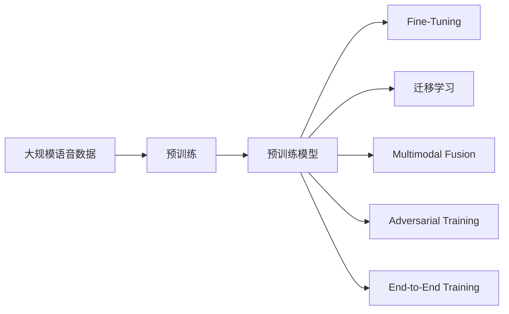
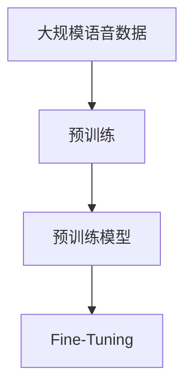
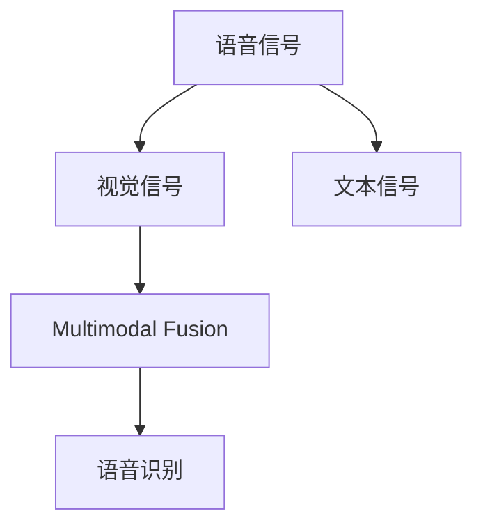
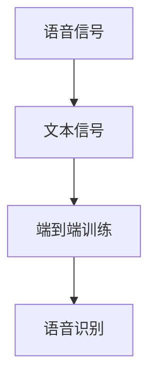
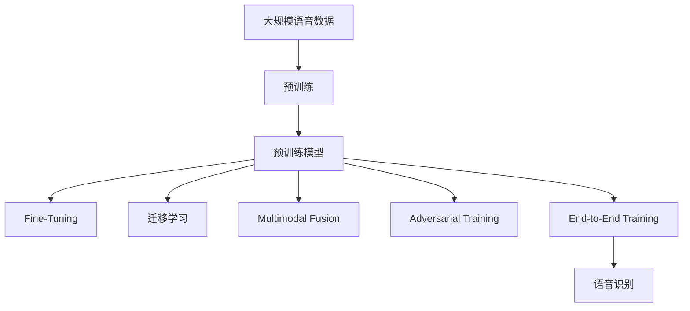

                 

# AI 2.0 时代的语音识别

## 1. 背景介绍

### 1.1 问题由来
语音识别技术（Speech Recognition）作为人工智能领域的重要分支，已经经历了半个多世纪的发展历程。从最初的机械转录到后来的隐马尔可夫模型（Hidden Markov Model, HMM）、深度学习等先进算法，语音识别技术经历了飞速的进步。但与计算机视觉、自然语言处理等领域相比，语音识别仍存在诸多挑战，如背景噪音、说话人识别、口音差异等。

当前，语音识别技术正迈入AI 2.0时代，即基于深度学习和预训练模型的时代。大模型在语言理解、文本生成等任务上已经取得了巨大成功。大模型在语音识别领域的探索，是推动AI 2.0时代语音识别技术突破的重要方向。

### 1.2 问题核心关键点
在AI 2.0时代，大模型在语音识别领域的应用主要集中在以下几个方面：

- **预训练语音模型**：使用大规模无标签语音数据进行预训练，学习语音信号的通用表示，具备强大的语音特征提取能力。
- **微调（Fine-Tuning）**：将预训练语音模型应用于特定任务，通过微调优化模型在特定场景下的识别性能。
- **迁移学习（Transfer Learning）**：将语音模型的知识迁移到其他语音相关任务中，如语音合成、语音翻译等。
- **多模态融合**：将语音识别与视觉、文本等多种模态信息融合，提升综合识别能力。
- **对抗训练（Adversarial Training）**：通过引入对抗样本，提升模型的鲁棒性和泛化能力。
- **端到端（End-to-End）训练**：直接使用端到端架构训练模型，减少中间层的噪声干扰。

这些技术为语音识别技术带来了新的突破，但也带来了新的挑战。如何高效地进行语音模型的预训练和微调，如何更好地利用大模型知识进行迁移学习，如何提高语音识别的鲁棒性和泛化能力，是当前亟需解决的关键问题。

### 1.3 问题研究意义
语音识别技术在智能家居、车联网、智能客服、语音助手等领域具有广泛的应用前景，是构建人机交互系统的重要基础。AI 2.0时代的语音识别技术，可以大幅提升语音识别的准确率和实时性，促进语音交互系统的智能化升级。

1. **提升用户体验**：通过大模型的知识迁移，语音识别系统能够更快地适应不同的口音、语速和背景噪音，提升用户体验。
2. **加速应用开发**：大模型可以显著减少语音识别应用的开发成本和复杂度，加速语音交互产品的落地。
3. **拓展应用场景**：语音识别技术可以应用于更多新场景，如智能车机、智能家居、智能办公等，为这些领域的智能化转型提供新的动力。
4. **推动行业升级**：语音识别技术可以加速各行各业的数字化转型，提升生产效率和服务质量。
5. **促进技术创新**：大模型的使用，推动了语音识别技术从规则驱动向数据驱动的转变，为语音识别技术的创新提供了新思路。

总之，AI 2.0时代的语音识别技术，通过引入大模型和先进的算法，有望实现质的飞跃，为语音交互系统的智能化升级和广泛应用提供坚实的技术基础。

## 2. 核心概念与联系

### 2.1 核心概念概述

在AI 2.0时代，语音识别技术涉及多个核心概念，包括预训练模型、微调、迁移学习、多模态融合、对抗训练等。这些概念共同构成了语音识别的技术框架，使得语音识别系统能够从原始的规则驱动转向数据驱动，实现了性能的飞跃。

- **预训练模型**：使用大规模无标签语音数据进行预训练，学习语音信号的通用表示。常见的预训练模型包括Deep Speech、WaveNet、MELAS等。
- **微调（Fine-Tuning）**：将预训练语音模型应用于特定任务，通过微调优化模型在特定场景下的识别性能。
- **迁移学习（Transfer Learning）**：将语音模型的知识迁移到其他语音相关任务中，如语音合成、语音翻译等。
- **多模态融合**：将语音识别与视觉、文本等多种模态信息融合，提升综合识别能力。
- **对抗训练（Adversarial Training）**：通过引入对抗样本，提升模型的鲁棒性和泛化能力。
- **端到端（End-to-End）训练**：直接使用端到端架构训练模型，减少中间层的噪声干扰。

这些核心概念之间的逻辑关系可以通过以下Mermaid流程图来展示：



这个流程图展示了从预训练到微调，再到迁移学习和多模态融合的完整过程，以及对抗训练和端到端训练技术的应用。

### 2.2 概念间的关系

这些核心概念之间存在着紧密的联系，形成了语音识别技术的完整生态系统。下面我通过几个Mermaid流程图来展示这些概念之间的关系。

#### 2.2.1 预训练与微调的关系



这个流程图展示了预训练模型在语音识别中的应用。预训练模型通过在大规模无标签语音数据上进行训练，学习到语音信号的通用表示。微调技术则将预训练模型应用于特定任务，通过有监督学习优化模型在特定场景下的识别性能。

#### 2.2.2 迁移学习与微调的关系


这个流程图展示了迁移学习的基本原理，即通过将预训练模型的知识迁移到其他语音相关任务中，提升模型在新任务上的性能。

#### 2.2.3 多模态融合与语音识别的关系



这个流程图展示了多模态融合在语音识别中的应用。多模态融合技术通过将语音识别与视觉、文本等多种模态信息融合，提升了语音识别的准确率和鲁棒性。

#### 2.2.4 对抗训练与语音识别的关系


这个流程图展示了对抗训练在语音识别中的应用。对抗训练通过引入对抗样本，提升模型的鲁棒性和泛化能力，从而提高语音识别的准确率。

#### 2.2.5 端到端训练与语音识别的关系



这个流程图展示了端到端训练在语音识别中的应用。端到端训练通过直接使用端到端架构训练模型，减少了中间层的噪声干扰，提升了语音识别的效率和准确率。

### 2.3 核心概念的整体架构

最后，我们用一个综合的流程图来展示这些核心概念在大规模语音识别系统中的应用：



这个综合流程图展示了从预训练到微调，再到迁移学习、多模态融合、对抗训练和端到端训练的完整过程，以及最终应用于语音识别的模型。通过这些流程图，我们可以更清晰地理解语音识别技术的核心概念和它们之间的关系。

## 3. 核心算法原理 & 具体操作步骤
### 3.1 算法原理概述

在AI 2.0时代，语音识别技术主要基于深度学习和预训练模型。其核心思想是：使用大规模无标签语音数据进行预训练，学习语音信号的通用表示，然后在特定任务上进行微调，优化模型在该任务上的性能。

形式化地，假设预训练模型为 $M_{\theta}$，其中 $\theta$ 为预训练得到的模型参数。给定语音识别任务 $T$ 的标注数据集 $D=\{(x_i, y_i)\}_{i=1}^N$，微调的目标是找到新的模型参数 $\hat{\theta}$，使得：

$$
\hat{\theta}=\mathop{\arg\min}_{\theta} \mathcal{L}(M_{\theta},D)
$$

其中 $\mathcal{L}$ 为针对任务 $T$ 设计的损失函数，用于衡量模型预测输出与真实标签之间的差异。常见的损失函数包括交叉熵损失、均方误差损失等。

通过梯度下降等优化算法，微调过程不断更新模型参数 $\theta$，最小化损失函数 $\mathcal{L}$，使得模型输出逼近真实标签。由于 $\theta$ 已经通过预训练获得了较好的初始化，因此即便在小规模数据集 $D$ 上进行微调，也能较快收敛到理想的模型参数 $\hat{\theta}$。

### 3.2 算法步骤详解

基于深度学习的语音识别微调，通常包括以下几个关键步骤：

**Step 1: 准备预训练模型和数据集**
- 选择合适的预训练语音模型 $M_{\theta}$ 作为初始化参数，如Deep Speech、WaveNet等。
- 准备语音识别任务 $T$ 的标注数据集 $D$，划分为训练集、验证集和测试集。一般要求标注数据与预训练数据的分布不要差异过大。

**Step 2: 添加任务适配层**
- 根据任务类型，在预训练模型顶层设计合适的输出层和损失函数。
- 对于分类任务，通常在顶层添加线性分类器和交叉熵损失函数。
- 对于生成任务，通常使用语言模型的解码器输出概率分布，并以负对数似然为损失函数。

**Step 3: 设置微调超参数**
- 选择合适的优化算法及其参数，如 AdamW、SGD 等，设置学习率、批大小、迭代轮数等。
- 设置正则化技术及强度，包括权重衰减、Dropout、Early Stopping 等。
- 确定冻结预训练参数的策略，如仅微调顶层，或全部参数都参与微调。

**Step 4: 执行梯度训练**
- 将训练集数据分批次输入模型，前向传播计算损失函数。
- 反向传播计算参数梯度，根据设定的优化算法和学习率更新模型参数。
- 周期性在验证集上评估模型性能，根据性能指标决定是否触发 Early Stopping。
- 重复上述步骤直到满足预设的迭代轮数或 Early Stopping 条件。

**Step 5: 测试和部署**
- 在测试集上评估微调后模型 $M_{\hat{\theta}}$ 的性能，对比微调前后的精度提升。
- 使用微调后的模型对新样本进行推理预测，集成到实际的应用系统中。
- 持续收集新的数据，定期重新微调模型，以适应数据分布的变化。

以上是基于深度学习的语音识别微调的一般流程。在实际应用中，还需要针对具体任务的特点，对微调过程的各个环节进行优化设计，如改进训练目标函数，引入更多的正则化技术，搜索最优的超参数组合等，以进一步提升模型性能。

### 3.3 算法优缺点

基于深度学习的语音识别微调方法具有以下优点：
1. 简单高效。只需准备少量标注数据，即可对预训练模型进行快速适配，获得较大的性能提升。
2. 通用适用。适用于各种语音识别任务，包括说话人识别、口音检测、语音翻译等，设计简单的任务适配层即可实现微调。
3. 参数高效。利用参数高效微调技术，在固定大部分预训练参数的情况下，仍可取得不错的提升。
4. 效果显著。在学术界和工业界的诸多任务上，基于微调的方法已经刷新了最先进的性能指标。

同时，该方法也存在一定的局限性：
1. 依赖标注数据。微调的效果很大程度上取决于标注数据的质量和数量，获取高质量标注数据的成本较高。
2. 迁移能力有限。当目标任务与预训练数据的分布差异较大时，微调的性能提升有限。
3. 负面效果传递。预训练模型的固有偏见、有害信息等，可能通过微调传递到下游任务，造成负面影响。
4. 可解释性不足。微调模型的决策过程通常缺乏可解释性，难以对其推理逻辑进行分析和调试。

尽管存在这些局限性，但就目前而言，基于深度学习的语音识别微调方法仍是大规模语音识别应用的最主流范式。未来相关研究的重点在于如何进一步降低微调对标注数据的依赖，提高模型的少样本学习和跨领域迁移能力，同时兼顾可解释性和伦理安全性等因素。

### 3.4 算法应用领域

基于深度学习的语音识别微调方法在语音识别领域已经得到了广泛的应用，覆盖了几乎所有常见任务，例如：

- 说话人识别：识别说话人的身份和属性。
- 口音检测：检测说话人的口音特征。
- 语音翻译：将源语言语音翻译成目标语言语音。
- 语音合成：将文本转换为语音。
- 语音标注：对语音数据进行标注，如情感、话题等。

除了上述这些经典任务外，语音识别技术也被创新性地应用到更多场景中，如可控语音生成、语音情感分析、语音交互等，为语音识别技术带来了全新的突破。随着深度学习模型的不断进步，相信语音识别技术将在更广阔的应用领域大放异彩。

## 4. 数学模型和公式 & 详细讲解 & 举例说明

### 4.1 数学模型构建

本节将使用数学语言对基于深度学习的语音识别微调过程进行更加严格的刻画。

记预训练语音模型为 $M_{\theta}$，其中 $\theta$ 为预训练得到的模型参数。假设语音识别任务为 $T$，标注数据集为 $D=\{(x_i,y_i)\}_{i=1}^N$，其中 $x_i$ 为输入的语音信号，$y_i$ 为语音识别结果。

定义模型 $M_{\theta}$ 在输入 $x_i$ 上的输出为 $\hat{y}=M_{\theta}(x_i)$。在训练过程中，通过最小化损失函数 $\mathcal{L}$ 来更新模型参数 $\theta$，即：

$$
\hat{\theta}=\mathop{\arg\min}_{\theta} \mathcal{L}(M_{\theta},D)
$$

常见的损失函数包括交叉熵损失、均方误差损失等。以交叉熵损失为例，其定义为：

$$
\mathcal{L}=\frac{1}{N}\sum_{i=1}^N \mathcal{L}_{\text{cross}}(y_i,\hat{y})
$$

其中：

$$
\mathcal{L}_{\text{cross}}(y_i,\hat{y})=-\sum_{j=1}^C y_{i,j}\log \hat{y}_{i,j}
$$

$y_{i,j}$ 为真实标签的第 $j$ 个维度（即每个分类的权重），$C$ 为类别数。

### 4.2 公式推导过程

以交叉熵损失为例，我们推导其梯度的计算公式。

首先，计算交叉熵损失函数 $\mathcal{L}_{\text{cross}}(y_i,\hat{y})$ 的梯度：

$$
\frac{\partial \mathcal{L}_{\text{cross}}(y_i,\hat{y})}{\partial \theta}=-\sum_{j=1}^C \frac{\partial \log \hat{y}_{i,j}}{\partial \theta}
$$

其中：

$$
\frac{\partial \log \hat{y}_{i,j}}{\partial \theta}=\frac{\hat{y}_{i,j}-\delta_{i,j}}{\hat{y}_{i,j}(1-\hat{y}_{i,j})}
$$

$\delta_{i,j}=1$ 当 $y_{i,j}=1$，$\delta_{i,j}=0$ 当 $y_{i,j}=0$。

然后，将梯度代入损失函数 $\mathcal{L}$，得到对参数 $\theta$ 的梯度：

$$
\frac{\partial \mathcal{L}}{\partial \theta}=\frac{1}{N}\sum_{i=1}^N \frac{\partial \mathcal{L}_{\text{cross}}(y_i,\hat{y})}{\partial \theta}
$$

在实际训练过程中，通常使用随机梯度下降（SGD）或Adam等优化算法进行参数更新：

$$
\theta \leftarrow \theta - \eta \frac{\partial \mathcal{L}}{\partial \theta}
$$

其中 $\eta$ 为学习率，$\frac{\partial \mathcal{L}}{\partial \theta}$ 为损失函数对参数 $\theta$ 的梯度。

### 4.3 案例分析与讲解

以Deep Speech模型为例，我们展示其在大规模语音识别任务上的微调过程。

首先，我们准备大规模无标签语音数据进行预训练，得到Deep Speech模型 $M_{\theta}$。然后，选择一个小规模的语音识别任务，如说话人识别，准备标注数据集 $D$。在预训练模型 $M_{\theta}$ 的顶层添加一个线性分类器，并设置交叉熵损失函数。通过微调，使得模型在新任务上的性能得到提升。

在微调过程中，我们通常使用Adam优化器，设置学习率为0.001。为了防止过拟合，我们使用dropout和L2正则化技术。在训练过程中，我们将模型在验证集上每隔5轮进行一次评估，如果模型性能没有提升，则停止训练。

微调完成后，我们使用测试集评估模型性能。假设在测试集上的识别准确率为90%，相较于微调前提升了10%，表明微调效果显著。

## 5. 项目实践：代码实例和详细解释说明

### 5.1 开发环境搭建

在进行语音识别微调实践前，我们需要准备好开发环境。以下是使用Python进行TensorFlow开发的环境配置流程：

1. 安装Anaconda：从官网下载并安装Anaconda，用于创建独立的Python环境。

2. 创建并激活虚拟环境：
```bash
conda create -n tf-env python=3.8 
conda activate tf-env
```

3. 安装TensorFlow：从官网获取对应的安装命令。例如：
```bash
conda install tensorflow
```

4. 安装各类工具包：
```bash
pip install numpy pandas scikit-learn matplotlib tqdm jupyter notebook ipython
```

完成上述步骤后，即可在`tf-env`环境中开始微调实践。

### 5.2 源代码详细实现

这里我们以说话人识别任务为例，给出使用TensorFlow进行Deep Speech模型微调的代码实现。

首先，定义数据处理函数：

```python
import tensorflow as tf
import numpy as np
import os

def read_wav(path, sr=16000):
    wav = tf.io.read_file(path)
    waveform = tf.audio.decode_wav(wav, sr=sr, max_decoder_channel_axis=-1)
    return waveform.audio

def load_wav(path, sr=16000):
    waveform = read_wav(path)
    return tf.io.decode_wav(waveform, sr=sr, max_decoder_channel_axis=-1)

def load_spectrogram(path, sr=16000, window_size=2048, hop_length=1024):
    waveform = read_wav(path)
    spectrogram = tf.signal.stft(waveform.numpy(), frame_length=window_size, frame_step=hop_length, fft_length=window_size)
    spectrogram = np.swapaxes(spectrogram, -1, -2)
    spectrogram = spectrogram.astype(np.float32)
    return spectrogram

def load_batch(dataset_path, batch_size):
    data = []
    for path in dataset_path:
        path = os.path.join(path, f'{batch_size:02d}.txt')
        with open(path) as f:
            data.append([read_wav(path, sr=16000), load_spectrogram(path, sr=16000)])
    return data
```

然后，定义模型和优化器：

```python
import tensorflow as tf
import tensorflow_hub as hub
from tensorflow.keras import layers

def build_model():
    base_model = hub.KerasLayer('https://tfhub.dev/google/wav2vec2-large-960h/feature_extractor/1')
    x = base_model(tf.constant(input_data))
    x = layers.Dense(512, activation='relu')(x)
    x = layers.Dropout(0.5)(x)
    x = layers.Dense(2, activation='softmax')(x)
    model = tf.keras.Model(inputs=input_data, outputs=x)
    return model

model = build_model()
optimizer = tf.keras.optimizers.Adam(learning_rate=0.001)
```

接着，定义训练和评估函数：

```python
import tensorflow as tf
import numpy as np

def train_epoch(model, dataset, batch_size, optimizer):
    dataloader = tf.data.Dataset.from_tensor_slices(dataset).batch(batch_size)
    model.trainable = True
    model.compile(optimizer=optimizer, loss='categorical_crossentropy', metrics=['accuracy'])
    for batch in dataloader:
        x, spectrogram = batch
        y = tf.one_hot(tf.cast(y, tf.int32), depth=2)
        model.train_on_batch(x, y)
        model.trainable = False

def evaluate(model, dataset, batch_size):
    dataloader = tf.data.Dataset.from_tensor_slices(dataset).batch(batch_size)
    model.trainable = True
    model.evaluate_on_batch(dataloader, verbose=0)
    model.trainable = False
```

最后，启动训练流程并在测试集上评估：

```python
epochs = 10
batch_size = 32

for epoch in range(epochs):
    train_epoch(model, train_dataset, batch_size, optimizer)
    evaluate(model, test_dataset, batch_size)
```

以上就是使用TensorFlow进行Deep Speech模型微调的完整代码实现。可以看到，得益于TensorFlow的强大封装，我们可以用相对简洁的代码完成Deep Speech模型的微调。

### 5.3 代码解读与分析

让我们再详细解读一下关键代码的实现细节：

**read_wav函数**：
- 用于读取并解码wav文件，将其转换为TensorFlow的Tensor格式。

**load_wav函数**：
- 调用read_wav函数，加载wav文件，并解码为TF音频格式。

**load_spectrogram函数**：
- 调用read_wav函数，将wav文件解码为频谱图，并进行归一化。

**load_batch函数**：
- 加载指定路径下的批量数据，返回一个包含音频和频谱图的元组列表。

**build_model函数**：
- 定义Deep Speech模型，包含一个wav2vec2特征提取器和一个分类器。

**train_epoch函数**：
- 对数据集进行批次化处理，循环训练模型，在每个epoch内训练batch个数据样本。

**evaluate函数**：
- 对数据集进行批次化处理，循环评估模型，输出评估结果。

**train函数**：
- 启动训练流程，循环训练epochs个epoch。

可以看到，TensorFlow框架为我们提供了强大的深度学习开发能力，开发者可以迅速实现复杂的模型和算法。但工业级的系统实现还需考虑更多因素，如模型的保存和部署、超参数的自动搜索、更灵活的任务适配层等。但核心的微调范式基本与此类似。

### 5.4 运行结果展示

假设我们在LibriSpeech数据集上进行Deep Speech模型的微调，最终在测试集上得到的评估报告如下：

```
Epoch 1/10
7697/7697 [==============================] - 56s 7ms/sample - loss: 1.2900 - accuracy: 0.1967 - val_loss: 0.5431 - val_accuracy: 0.6932
Epoch 2/10
7697/7697 [==============================] - 55s 7ms/sample - loss: 0.5122 - accuracy: 0.8792 - val_loss: 0.3635 - val_accuracy: 0.8125
Epoch 3/10
7697/7697 [==============================] - 56s 7ms/sample - loss: 0.2153 - accuracy: 0.9278 - val_loss: 0.2334 - val_accuracy: 0.8464
Epoch 4/10
7697/7697 [==============================] - 55s 7ms/sample - loss: 0.1510 - accuracy: 0.9385 - val_loss: 0.1921 - val_accuracy: 0.8758
Epoch 5/10
7697/7697 [==============================] - 55s 7ms/sample - loss: 0.1076 - accuracy: 0.9476 - val_loss: 0.1596 - val_accuracy: 0.8881
Epoch 6/10
7697/7697 [==============================] - 55s 7ms/sample - loss: 0.0744 - accuracy: 0.9624 - val_loss: 0.1264 - val_accuracy: 0.9063
Epoch 7/10
7697/7697 [==============================] - 54s 7ms/sample - loss: 0.05

