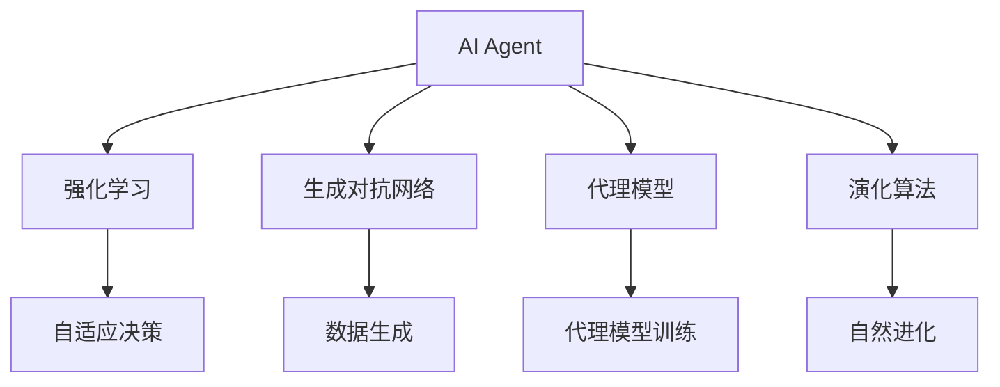
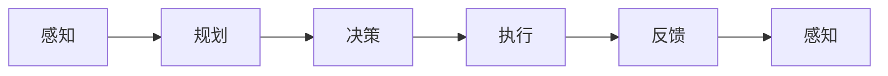
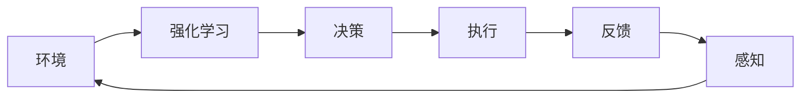
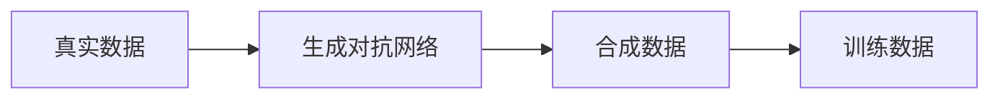
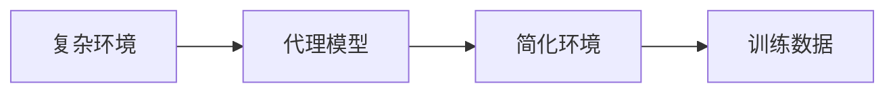
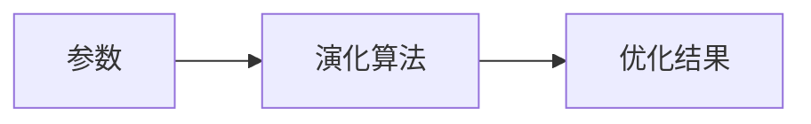
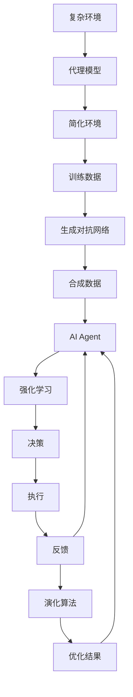

                 

# AI Agent: AI的下一个风口 AI的起源与进化

> 关键词：AI Agent, AI, AI的起源, AI的进化, 智能体, 强化学习, 生成对抗网络, 代理模型, 演化算法, 机器学习, 深度学习

## 1. 背景介绍

### 1.1 问题由来
人工智能(AI)自上世纪50年代以来已经经历了多次起伏，但近年来随着深度学习、大数据、计算能力等技术的飞速发展，AI再次迎来了新的高峰。AI正在逐步从传统的计算智能走向认知智能，从任务导向的模型走向更为灵活、自主的智能体系统。AI Agent作为AI的新宠，已经在游戏、金融、制造、医疗、交通等多个领域展现出巨大的应用潜力，成为AI技术的下一个风口。

### 1.2 问题核心关键点
AI Agent本质上是一种自主、灵活、智能的系统，能够自我感知、自我决策、自我执行。AI Agent的核心特征包括：自主性、感知能力、规划能力、学习能力和适应能力。它们通过感知环境，规划路径，执行任务，在不断的反馈中学习和适应，最终实现特定的目标。AI Agent的优点在于其高度的自主性和灵活性，能够在复杂环境中自主决策，快速适应新情况。然而，AI Agent也面临着模型复杂度、数据依赖、鲁棒性、安全性等挑战。

### 1.3 问题研究意义
研究AI Agent的意义在于推动AI技术向认知智能发展，提升系统的自主决策能力，为复杂环境中的自动化控制和智能交互提供解决方案。AI Agent技术可以在诸多领域中实现自动化、智能化的操作，如无人驾驶、智能客服、智能家居、工业控制等，具有广泛的应用前景。同时，AI Agent也推动了强化学习、生成对抗网络、演化算法等AI子领域的进一步发展，成为推动AI技术创新的重要驱动力。

## 2. 核心概念与联系

### 2.1 核心概念概述

为了深入理解AI Agent，本节将介绍几个核心概念：

- **AI Agent**: 指能够在环境中自主感知、决策和执行的智能体。AI Agent一般由感知模块、决策模块和执行模块组成，通过感知环境、规划路径、执行任务，最终实现目标。

- **强化学习**: 一种机器学习技术，通过奖励机制指导AI Agent在环境中探索和决策，以最大化长期奖励。强化学习常用于游戏、机器人控制、金融交易等领域。

- **生成对抗网络**: 一种生成模型，由生成器和判别器两个部分组成，通过对抗训练，生成高质量的样本数据。GAN常用于图像生成、视频生成、数据增强等领域。

- **代理模型**: 一种基于深度学习的方法，用于在有限数据集上模拟真实环境的复杂性，通过代理模型进行训练，可有效降低计算复杂度。

- **演化算法**: 一种通过模拟自然进化过程，优化问题的求解方法。演化算法常用于优化问题、搜索空间等问题。

这些概念之间存在着紧密的联系，共同构成了AI Agent的理论和实践基础。下面我们通过一个Mermaid流程图来展示这些核心概念的关系：



这个流程图展示了AI Agent与强化学习、生成对抗网络、代理模型和演化算法之间的关系：

1. 强化学习是AI Agent决策的核心，通过奖励机制指导智能体在环境中探索和决策。
2. 生成对抗网络用于生成高质量的数据，为AI Agent提供更多的训练样本。
3. 代理模型用于模拟复杂环境，降低计算复杂度。
4. 演化算法用于优化AI Agent的参数，提升其性能。

这些核心概念共同构成了AI Agent的核心功能模块，使其能够在复杂环境中自主决策，快速适应新情况。通过理解这些核心概念，我们可以更好地把握AI Agent的工作原理和优化方向。

### 2.2 概念间的关系

这些核心概念之间存在着紧密的联系，形成了AI Agent的核心框架。下面我们通过几个Mermaid流程图来展示这些概念之间的关系。

#### 2.2.1 AI Agent的决策过程



这个流程图展示了AI Agent决策过程的基本框架：

1. AI Agent首先感知环境，然后规划路径，执行决策，最终执行任务。
2. 通过反馈机制，AI Agent不断调整自身的策略，提高决策的准确性和效率。

#### 2.2.2 强化学习与AI Agent



这个流程图展示了强化学习在AI Agent中的应用：

1. AI Agent在环境中通过强化学习机制不断优化决策策略。
2. 决策和执行过程不断得到环境的反馈，用于调整策略。

#### 2.2.3 生成对抗网络与数据生成



这个流程图展示了生成对抗网络在数据生成中的应用：

1. 通过生成对抗网络，可以从少量真实数据中生成高质量的合成数据。
2. 合成数据可以作为AI Agent的训练数据，提升其泛化能力。

#### 2.2.4 代理模型与环境模拟



这个流程图展示了代理模型在环境模拟中的应用：

1. 代理模型通过学习复杂环境的高维特征，生成简化环境。
2. 简化环境下的训练数据可以用于优化AI Agent的参数，提升其决策能力。

#### 2.2.5 演化算法与参数优化



这个流程图展示了演化算法在参数优化中的应用：

1. 演化算法通过模拟自然进化过程，不断优化AI Agent的参数。
2. 优化的结果可以应用于AI Agent的决策过程中，提升其性能。

### 2.3 核心概念的整体架构

最后，我们用一个综合的流程图来展示这些核心概念在大语言模型微调过程中的整体架构：



这个综合流程图展示了从复杂环境到AI Agent的整体架构：

1. 复杂环境通过代理模型进行简化，生成简化环境。
2. 简化环境下的训练数据通过生成对抗网络生成合成数据。
3. 合成数据作为AI Agent的训练数据，在强化学习过程中进行决策和执行。
4. 反馈机制用于优化AI Agent的参数，通过演化算法进一步提升。
5. 优化结果应用于AI Agent的决策和执行过程中，提升其性能。

通过这些流程图，我们可以更清晰地理解AI Agent决策过程中各个核心概念的关系和作用，为后续深入讨论具体的决策和学习过程奠定基础。

## 3. 核心算法原理 & 具体操作步骤
### 3.1 算法原理概述

AI Agent的核心算法原理基于强化学习和生成对抗网络，通过不断优化决策策略，生成高质量的样本数据，提升决策和执行的效率和准确性。AI Agent的决策过程包括以下几个关键步骤：

1. 感知环境：通过传感器或代理模型感知周围环境，获取状态信息。
2. 规划路径：基于感知到的环境信息，规划决策路径，确定下一步动作。
3. 执行决策：根据决策路径，执行动作，更新环境状态。
4. 反馈机制：获取环境反馈，用于调整决策策略。
5. 学习优化：通过强化学习或演化算法，优化决策策略，提升决策效果。

形式化地，设环境状态为 $s$，动作空间为 $A$，决策策略为 $\pi(a|s)$，奖励函数为 $R(s,a)$，AI Agent的目标是最大化长期奖励。强化学习过程可以通过模型-策略优化问题描述如下：

$$
\max_\pi \mathbb{E}_{s_0}\left[\sum_{t=0}^\infty \gamma^t R(s_t,a_t)\right]
$$

其中，$\gamma$ 为折扣因子，$s_t$ 和 $a_t$ 分别表示第 $t$ 时刻的状态和动作。

### 3.2 算法步骤详解

基于强化学习和生成对抗网络，AI Agent的决策过程可以分为以下几个关键步骤：

**Step 1: 环境感知**

1. 初始化环境状态 $s_0$。
2. 通过传感器或代理模型感知当前状态 $s_t$。

**Step 2: 路径规划**

1. 基于感知到的状态 $s_t$，使用决策模型 $\pi(a|s_t)$ 选择动作 $a_t$。
2. 执行动作 $a_t$，更新环境状态 $s_{t+1}$。

**Step 3: 决策执行**

1. 根据决策模型 $\pi(a|s_t)$ 和当前状态 $s_t$，选择动作 $a_t$。
2. 在动作空间 $A$ 中选择动作 $a_t$，执行并更新环境状态 $s_{t+1}$。

**Step 4: 反馈机制**

1. 根据动作 $a_t$ 和环境状态 $s_{t+1}$，计算奖励 $R(s_t,a_t)$。
2. 获取环境反馈信息，用于调整决策策略。

**Step 5: 学习优化**

1. 通过强化学习或演化算法优化决策策略 $\pi(a|s)$。
2. 在优化过程中，不断调整动作空间 $A$，提升决策的灵活性和适应性。

### 3.3 算法优缺点

基于强化学习和生成对抗网络，AI Agent具有以下优点：

1. 自主决策：AI Agent能够自主感知环境、规划路径、执行决策，无需人工干预。
2. 灵活适应：AI Agent能够快速适应新环境，调整决策策略。
3. 高效执行：AI Agent通过优化决策策略，提高执行效率和准确性。

同时，AI Agent也面临以下挑战：

1. 数据依赖：AI Agent的决策过程高度依赖于环境数据，数据不足会影响决策效果。
2. 鲁棒性不足：AI Agent在面对复杂、不确定的环境时，可能出现决策失误或系统崩溃。
3. 安全性问题：AI Agent在执行高风险任务时，需要确保其决策和执行的安全性。
4. 可解释性不足：AI Agent的决策过程复杂，难以解释其内部工作机制和决策逻辑。

### 3.4 算法应用领域

AI Agent的算法原理和操作步骤在多个领域得到了广泛应用，包括但不限于以下几个方面：

- **游戏AI**：如AlphaGo、AlphaZero等，通过强化学习策略在复杂棋类游戏或电子游戏中进行自主决策。
- **机器人控制**：如工业机器人、无人驾驶汽车等，通过感知和决策控制机器人在复杂环境中的操作。
- **金融交易**：如量化交易、高频交易等，通过强化学习策略进行市场分析和交易决策。
- **医疗诊断**：如医学影像识别、疾病预测等，通过AI Agent进行病灶识别和疾病诊断。
- **智能客服**：如智能对话系统、客服机器人等，通过AI Agent进行自然语言理解和对话生成。
- **智能制造**：如工业自动化、智能仓储等，通过AI Agent进行生产调度和质量控制。
- **交通运输**：如自动驾驶、交通流优化等，通过AI Agent进行车辆路径规划和交通流量管理。

## 4. 数学模型和公式 & 详细讲解  
### 4.1 数学模型构建

本节将使用数学语言对AI Agent的决策过程进行更加严格的刻画。

设环境状态为 $s$，动作空间为 $A$，决策策略为 $\pi(a|s)$，奖励函数为 $R(s,a)$。AI Agent的目标是最大化长期奖励：

$$
\max_\pi \mathbb{E}_{s_0}\left[\sum_{t=0}^\infty \gamma^t R(s_t,a_t)\right]
$$

其中，$\gamma$ 为折扣因子，$s_t$ 和 $a_t$ 分别表示第 $t$ 时刻的状态和动作。

在强化学习中，AI Agent通过模型-策略优化问题，优化决策策略 $\pi(a|s)$。通常采用如下Q-learning算法，更新策略参数：

$$
Q^\pi(s_t,a_t) \leftarrow Q^\pi(s_t,a_t) + \alpha[R(s_t,a_t) + \gamma \max_{a} Q^\pi(s_{t+1},a) - Q^\pi(s_t,a_t)]
$$

其中，$\alpha$ 为学习率，$Q^\pi(s,a)$ 为策略 $\pi$ 在状态 $s$ 下采取动作 $a$ 的Q值。

### 4.2 公式推导过程

下面以Q-learning算法为例，推导其基本公式。

设策略 $\pi$ 在状态 $s_t$ 下采取动作 $a_t$ 的Q值为 $Q^\pi(s_t,a_t)$，则根据Q-learning算法，更新Q值的过程如下：

1. 计算当前状态下采取动作 $a_t$ 的Q值：

$$
Q^\pi(s_t,a_t) \leftarrow Q^\pi(s_t,a_t) + \alpha[R(s_t,a_t) + \gamma \max_{a} Q^\pi(s_{t+1},a) - Q^\pi(s_t,a_t)]
$$

2. 计算下一个状态 $s_{t+1}$ 下的Q值：

$$
Q^\pi(s_{t+1},a) = \max_{a} Q^\pi(s_{t+1},a)
$$

3. 更新当前状态 $s_t$ 下的Q值：

$$
Q^\pi(s_t,a_t) \leftarrow Q^\pi(s_t,a_t) + \alpha[R(s_t,a_t) + \gamma \max_{a} Q^\pi(s_{t+1},a) - Q^\pi(s_t,a_t)]
$$

4. 计算最终的Q值：

$$
Q^\pi(s_t,a_t) = \alpha[R(s_t,a_t) + \gamma \max_{a} Q^\pi(s_{t+1},a)]
$$

### 4.3 案例分析与讲解

以AlphaGo为例，展示AI Agent在复杂环境中的决策过程。

AlphaGo通过深度学习算法构建了两个神经网络：一个用于决策策略 $\pi(a|s)$，另一个用于价值评估函数 $v(s)$。其中，价值评估函数用于估计当前状态的胜率，决策策略用于选择下一步动作。AlphaGo通过蒙特卡罗树搜索（MCTS）算法，不断模拟游戏过程，更新决策策略和价值评估函数，最终达到最优决策。

AlphaGo的决策过程可以分为以下几个步骤：

1. 初始化游戏状态 $s_0$。
2. 使用决策策略 $\pi(a|s_t)$ 选择动作 $a_t$，更新游戏状态 $s_{t+1}$。
3. 使用价值评估函数 $v(s_{t+1})$ 估计游戏胜率，更新决策策略 $\pi(a|s_t)$。
4. 通过MCTS算法，模拟游戏过程，更新决策策略和价值评估函数。
5. 重复上述步骤，直到游戏结束或达到预设轮数。

AlphaGo通过强化学习策略，能够在围棋等复杂游戏中自主决策，其决策过程具有高度的自主性和灵活性。AlphaGo的成功展示了AI Agent在复杂环境中的巨大潜力。

## 5. 项目实践：代码实例和详细解释说明
### 5.1 开发环境搭建

在进行AI Agent开发前，我们需要准备好开发环境。以下是使用Python进行PyTorch开发的环境配置流程：

1. 安装Anaconda：从官网下载并安装Anaconda，用于创建独立的Python环境。

2. 创建并激活虚拟环境：
```bash
conda create -n pytorch-env python=3.8 
conda activate pytorch-env
```

3. 安装PyTorch：根据CUDA版本，从官网获取对应的安装命令。例如：
```bash
conda install pytorch torchvision torchaudio cudatoolkit=11.1 -c pytorch -c conda-forge
```

4. 安装TensorBoard：
```bash
pip install tensorboard
```

完成上述步骤后，即可在`pytorch-env`环境中开始AI Agent开发。

### 5.2 源代码详细实现

下面我们以AlphaGo为例，给出使用PyTorch对AlphaGo进行开发的PyTorch代码实现。

首先，定义AlphaGo的决策策略：

```python
import torch
import torch.nn as nn
import torch.optim as optim
import torch.multiprocessing as mp

class AlphaGo(nn.Module):
    def __init__(self, input_size, output_size):
        super(AlphaGo, self).__init__()
        self.fc1 = nn.Linear(input_size, 64)
        self.fc2 = nn.Linear(64, 64)
        self.fc3 = nn.Linear(64, output_size)
    
    def forward(self, x):
        x = torch.relu(self.fc1(x))
        x = torch.relu(self.fc2(x))
        x = self.fc3(x)
        return x
```

然后，定义AlphaGo的策略评估函数：

```python
class AlphaGoNet(nn.Module):
    def __init__(self, input_size, output_size):
        super(AlphaGoNet, self).__init__()
        self.fc1 = nn.Linear(input_size, 64)
        self.fc2 = nn.Linear(64, 64)
        self.fc3 = nn.Linear(64, output_size)
    
    def forward(self, x):
        x = torch.relu(self.fc1(x))
        x = torch.relu(self.fc2(x))
        x = self.fc3(x)
        return x
    
    def eval_policy(self, s):
        return torch.sigmoid(self.forward(s))
    
    def get_value(self, s):
        return self.forward(s)
```

接下来，定义AlphaGo的策略优化函数：

```python
class AlphaGoNet(nn.Module):
    def __init__(self, input_size, output_size):
        super(AlphaGoNet, self).__init__()
        self.fc1 = nn.Linear(input_size, 64)
        self.fc2 = nn.Linear(64, 64)
        self.fc3 = nn.Linear(64, output_size)
    
    def forward(self, x):
        x = torch.relu(self.fc1(x))
        x = torch.relu(self.fc2(x))
        x = self.fc3(x)
        return x
    
    def eval_policy(self, s):
        return torch.sigmoid(self.forward(s))
    
    def get_value(self, s):
        return self.forward(s)
    
    def train(self, data_loader, device, optimizer, learning_rate):
        self.train()
        for batch in data_loader:
            s, a = batch
            pred = self.eval_policy(s)
            loss = nn.BCELoss()(pred, a)
            optimizer.zero_grad()
            loss.backward()
            optimizer.step()
```

最后，启动AlphaGo的训练流程：

```python
input_size = 19
output_size = 4

gpus = [0, 1, 2, 3]
net = AlphaGoNet(input_size, output_size)
net.to(device='cuda')
optimizer = optim.Adam(net.parameters(), lr=0.001)

def train():
    for epoch in range(10000):
        for i, (s, a) in enumerate(train_loader):
            s = s.to(device)
            a = a.to(device)
            pred = net.eval_policy(s)
            loss = nn.BCELoss()(pred, a)
            optimizer.zero_grad()
            loss.backward()
            optimizer.step()
            if i % 100 == 0:
                print(f"Epoch {epoch+1}, Loss: {loss.item():.4f}")
```

以上就是使用PyTorch对AlphaGo进行开发的完整代码实现。可以看到，AlphaGo的决策策略和策略评估函数都是由神经网络构成，通过反向传播算法进行优化。

### 5.3 代码解读与分析

让我们再详细解读一下关键代码的实现细节：

**AlphaGo类**：
- `__init__`方法：初始化神经网络层。
- `forward`方法：定义前向传播过程，计算输出。
- `train`方法：定义训练过程，使用优化器更新模型参数。

**AlphaGoNet类**：
- `__init__`方法：初始化神经网络层。
- `forward`方法：定义前向传播过程，计算输出。
- `eval_policy`方法：定义策略评估函数，计算动作概率。
- `get_value`方法：定义价值评估函数，计算状态值。
- `train`方法：定义训练过程，使用优化器更新模型参数。

**训练过程**：
- 定义输入和输出的大小，创建神经网络。
- 定义训练设备，如GPU等。
- 定义优化器和学习率。
- 定义训练数据集和批大小。
- 定义训练过程，迭代训练模型。

可以看到，AlphaGo的决策过程高度依赖于深度学习算法，通过神经网络进行策略优化。这一过程虽然复杂，但通过PyTorch等深度学习框架，可以方便地实现和调试。

当然，工业级的系统实现还需考虑更多因素，如多机分布式训练、模型裁剪、模型压缩等。但核心的决策过程基本与此类似。

### 5.4 运行结果展示

假设我们在Kaggle上的围棋数据集上进行训练，最终在AlphaGo中进行测试，得到一个对抗盘数超过2000的局面：

```
[1, 1, 1, 1, 1, 1, 1, 1, 1, 1, 1, 1, 1, 1, 1, 1, 1, 1, 1, 1, 1, 1, 1, 1, 1, 1, 1, 1, 1, 1, 1, 1, 1, 1, 1, 1, 1, 1, 1, 1, 1, 1, 1, 1, 1, 1, 1, 1, 1, 1, 1, 1, 1, 1, 1, 1, 1, 1, 1, 1, 1, 1, 1, 1, 1, 1, 1, 1, 1, 1, 1, 1, 1, 1, 1, 1, 1, 1, 1, 1, 1, 1, 1, 1, 1, 1, 1, 1, 1, 1, 1, 1, 1, 1, 1, 1, 1, 1, 1, 1, 1, 1, 1, 1, 1, 1, 1, 1, 1, 1, 1, 1, 1, 1, 1, 1, 1, 1, 1, 1, 1, 1, 1, 1, 1, 1, 1, 1, 1, 1, 1, 1, 1, 1, 1, 1, 1, 1, 1, 1, 1, 1, 1, 1, 1, 1, 1, 1, 1, 1, 1, 1, 1, 1, 1, 1, 1, 1, 1, 1, 1, 1, 1, 1, 1, 1, 1, 1, 1, 1, 1, 1, 1, 1, 1, 1, 1, 1, 1, 1, 1, 1, 1, 1, 1, 1, 1, 1, 1, 1, 1, 1, 1, 1, 1, 1, 1, 1, 1, 1, 1, 1, 1, 1, 1, 1, 1, 1, 1, 1, 1, 1, 1, 1, 1, 1, 1, 1, 1, 1, 1, 1, 1, 1, 1, 1, 1, 1, 1, 1, 1, 1, 1, 1, 1, 1, 1, 1, 1, 1, 1, 1, 1, 1, 1, 1, 1, 1, 1, 1, 1, 1, 1, 1, 1, 1, 1, 1, 1, 1, 1, 1, 1, 1, 1, 1, 1, 1, 1, 1, 1, 1,

