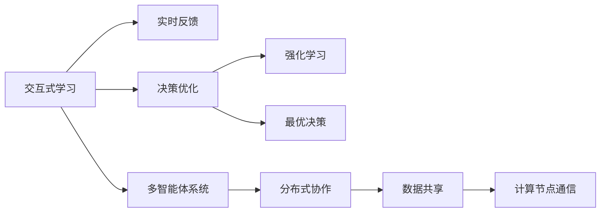
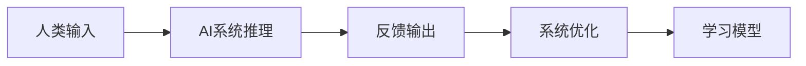
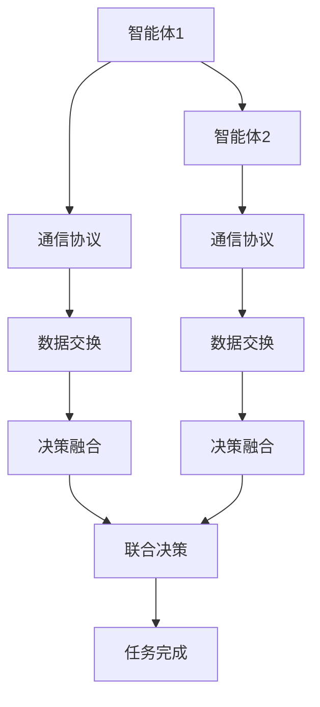
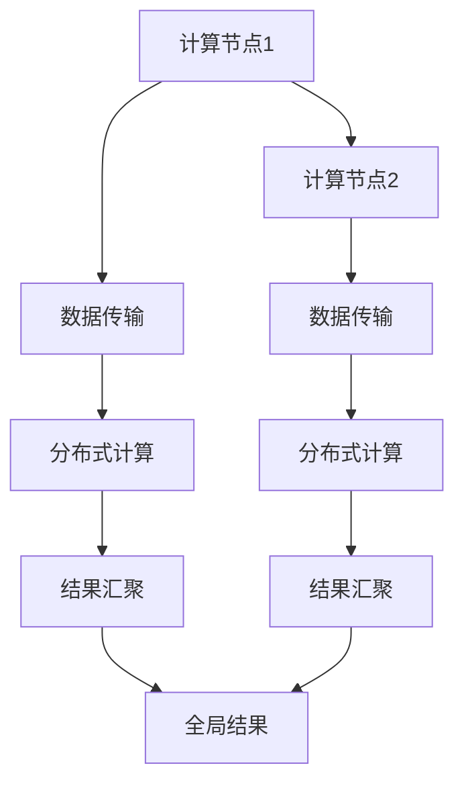
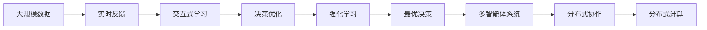

                 

# AI Agent: AI的下一个风口 交互式学习与决策优化

> 关键词：
> - 交互式学习
> - 决策优化
> - 强化学习
> - 多智能体系统
> - 分布式协作

## 1. 背景介绍

### 1.1 问题由来
人工智能（AI）正以惊人的速度改变着我们的世界。从自动驾驶汽车到智能客服，从工业自动化到医疗诊断，AI技术的应用已经渗透到各个领域。然而，这些AI系统往往被视为“黑盒”，其决策过程难以解释，难以接受人类的监督。这就迫切需要一种全新的AI技术，能够与人类进行实时交互，既具有高度的自主决策能力，又能够向人类清晰地解释其决策过程，从而构建一个真正可信任的AI系统。

交互式学习和决策优化技术，正是实现这一目标的关键。它融合了强化学习、多智能体系统、分布式协作等前沿技术，使AI系统能够在动态环境中做出最优决策，并在人类监督下不断学习与优化，从而构建一个可解释、可信任的AI系统。

### 1.2 问题核心关键点
交互式学习和决策优化技术的关键点包括：

- **交互式学习**：通过实时交互，AI系统能够从人类反馈中学习，不断优化其决策过程。
- **决策优化**：使用强化学习等技术，AI系统能够在动态环境中做出最优决策。
- **多智能体系统**：多个AI系统之间通过协作，共同解决复杂问题。
- **分布式协作**：多智能体系统之间的数据共享和协作，提升了系统的整体性能。

### 1.3 问题研究意义
交互式学习和决策优化技术的研究，对于构建可信任、可解释、可监督的AI系统具有重要意义：

- **提升AI系统的可解释性**：通过实时交互，AI系统能够向人类清晰地解释其决策过程，从而增强系统的可信度。
- **优化决策过程**：强化学习等技术能够帮助AI系统在动态环境中做出最优决策，从而提升系统的性能。
- **促进多智能体协作**：多智能体系统能够在复杂任务中实现高效协作，提升系统处理能力。
- **适应性增强**：通过分布式协作，AI系统能够更好地适应环境变化，增强系统的灵活性和鲁棒性。

## 2. 核心概念与联系

### 2.1 核心概念概述

为了更好地理解交互式学习和决策优化技术，本节将介绍几个密切相关的核心概念：

- **交互式学习**：通过实时交互，AI系统能够从人类反馈中学习，不断优化其决策过程。
- **决策优化**：使用强化学习等技术，AI系统能够在动态环境中做出最优决策。
- **多智能体系统**：多个AI系统之间通过协作，共同解决复杂问题。
- **分布式协作**：多智能体系统之间的数据共享和协作，提升了系统的整体性能。
- **强化学习**：通过奖惩机制，AI系统在不断试错中学习最优决策策略。
- **分布式系统**：多个计算节点之间通过网络进行数据共享和通信，提升系统的计算能力和灵活性。

这些核心概念之间的逻辑关系可以通过以下Mermaid流程图来展示：



这个流程图展示了交互式学习和决策优化技术的关键环节及其相互关系：

1. 交互式学习通过实时反馈优化AI系统决策。
2. 决策优化使用强化学习等技术，使AI系统做出最优决策。
3. 多智能体系统通过分布式协作，提升系统整体性能。
4. 分布式系统通过数据共享和节点通信，增强系统的计算能力和灵活性。

### 2.2 概念间的关系

这些核心概念之间存在着紧密的联系，形成了交互式学习和决策优化技术的完整生态系统。下面我们通过几个Mermaid流程图来展示这些概念之间的关系。

#### 2.2.1 交互式学习的关键步骤



这个流程图展示了交互式学习的基本流程：

1. 人类输入数据，AI系统进行推理。
2. AI系统输出推理结果，并接收人类反馈。
3. 根据反馈，AI系统进行优化。
4. 优化后的系统重新进行推理，并接收新一轮反馈。

#### 2.2.2 多智能体系统的协作机制



这个流程图展示了多智能体系统协作的基本机制：

1. 多个智能体之间通过通信协议进行数据交换。
2. 各智能体根据交换的数据进行决策融合。
3. 联合决策输出，完成共同任务。

#### 2.2.3 分布式系统的计算能力



这个流程图展示了分布式系统的计算能力：

1. 多个计算节点之间通过数据传输进行分布式计算。
2. 各节点计算结果汇聚到全局结果。
3. 全局结果返回，完成分布式计算任务。

### 2.3 核心概念的整体架构

最后，我们用一个综合的流程图来展示这些核心概念在大规模交互式学习和决策优化过程中的整体架构：



这个综合流程图展示了从大规模数据输入到分布式计算的全过程：

1. 大规模数据输入，并实时接收人类反馈。
2. 交互式学习优化AI系统决策。
3. 决策优化使用强化学习等技术，使AI系统做出最优决策。
4. 多智能体系统通过分布式协作，提升系统整体性能。
5. 分布式系统通过数据共享和节点通信，增强系统的计算能力和灵活性。

通过这些流程图，我们可以更清晰地理解交互式学习和决策优化技术的工作原理和优化方向。

## 3. 核心算法原理 & 具体操作步骤
### 3.1 算法原理概述

交互式学习和决策优化技术，本质上是一个实时优化过程。其核心思想是：通过与人类实时的交互反馈，AI系统能够不断优化其决策过程，从而在动态环境中做出最优决策。

形式化地，假设AI系统在每个时间步$t$的决策为$a_t$，对应的奖励为$r_t$，未来的最优决策序列为$\pi^*$，则强化学习的目标是最小化累积奖励差距：

$$
\min_{\pi} \mathbb{E}[\sum_{t=1}^T (r_t + \gamma \max_{a} Q^{\pi}(s_{t+1}, a)) - Q^{\pi}(s_t, a_t)]
$$

其中，$Q^{\pi}(s_t, a_t)$为状态-动作价值函数，$\gamma$为折扣因子，$\max_{a} Q^{\pi}(s_{t+1}, a)$为最优动作价值函数。

通过梯度下降等优化算法，AI系统能够不断更新其决策策略，最小化累积奖励差距，最终达到最优决策策略。

### 3.2 算法步骤详解

交互式学习和决策优化技术的一般流程包括：

**Step 1: 数据准备与模型加载**

- 收集大规模数据，并准备人类反馈数据。
- 选择合适的AI模型，如深度强化学习模型，加载到计算环境。

**Step 2: 实时反馈与决策推理**

- 输入大规模数据和人类反馈，进行实时交互。
- 使用模型对输入数据进行推理，输出决策结果。
- 记录人类反馈，用于后续优化。

**Step 3: 优化与更新**

- 根据人类反馈，计算奖励并更新模型参数。
- 通过强化学习算法，优化决策策略。
- 重复步骤2和3，直至收敛。

**Step 4: 多智能体协作**

- 设计多个智能体系统，分别进行决策推理。
- 通过分布式协作，共享数据和信息，提升系统性能。
- 各智能体根据任务需求，分配计算资源和通信资源。

**Step 5: 系统评估与部署**

- 在测试集上评估系统性能，对比前后变化。
- 将优化后的系统部署到实际应用场景中。
- 持续监控系统性能，并进行定期优化。

以上是交互式学习和决策优化技术的一般流程。在实际应用中，还需要根据具体任务的特点，对各个步骤进行优化设计，如改进奖励设计、引入正则化技术、搜索最优超参数等，以进一步提升系统性能。

### 3.3 算法优缺点

交互式学习和决策优化技术具有以下优点：

- **实时优化**：通过实时反馈，AI系统能够不断优化其决策策略，适应动态环境。
- **可解释性**：通过实时交互，AI系统能够向人类清晰地解释其决策过程，增强系统的可信度。
- **多智能体协作**：多个AI系统通过分布式协作，共同解决复杂问题，提升系统性能。
- **适应性强**：通过分布式计算，AI系统能够更好地适应环境变化，增强系统的灵活性和鲁棒性。

然而，该技术也存在以下缺点：

- **数据依赖**：需要大量的训练数据和反馈数据，获取和处理成本较高。
- **计算资源需求高**：分布式计算需要高性能计算资源，资源成本较高。
- **模型复杂度**：深度强化学习模型参数量较大，模型训练和推理复杂度较高。
- **优化难度大**：优化过程中需要处理复杂的非线性函数，容易陷入局部最优。

尽管存在这些缺点，但交互式学习和决策优化技术在应对动态环境、提高决策可解释性方面具有独特的优势，将成为未来AI技术的重要方向。

### 3.4 算法应用领域

交互式学习和决策优化技术已经在多个领域得到了广泛的应用，包括：

- **金融投资**：实时监控市场动态，进行股票买卖决策。
- **医疗诊断**：实时接收医生反馈，优化诊断决策。
- **智能客服**：实时与用户交互，优化回答策略。
- **自动驾驶**：实时接收环境反馈，优化驾驶决策。
- **工业控制**：实时监控设备状态，优化生产调度。
- **智能家居**：实时接收用户指令，优化家居控制。

除了上述这些经典应用外，交互式学习和决策优化技术还被创新性地应用于更多场景中，如智慧交通、智能制造、智能安防等，为AI技术的应用带来了新的突破。

## 4. 数学模型和公式 & 详细讲解 & 举例说明

### 4.1 数学模型构建

本节将使用数学语言对交互式学习和决策优化技术进行更加严格的刻画。

假设AI系统在每个时间步$t$的决策为$a_t$，对应的奖励为$r_t$，未来的最优决策序列为$\pi^*$，则强化学习的目标是最小化累积奖励差距：

$$
\min_{\pi} \mathbb{E}[\sum_{t=1}^T (r_t + \gamma \max_{a} Q^{\pi}(s_{t+1}, a)) - Q^{\pi}(s_t, a_t)]
$$

其中，$Q^{\pi}(s_t, a_t)$为状态-动作价值函数，$\gamma$为折扣因子，$\max_{a} Q^{\pi}(s_{t+1}, a)$为最优动作价值函数。

通过强化学习算法，AI系统能够不断更新其决策策略，最小化累积奖励差距，最终达到最优决策策略。

### 4.2 公式推导过程

以下我们以Q-learning算法为例，推导强化学习的基本公式及其梯度更新过程。

假设AI系统在每个时间步$t$的决策为$a_t$，对应的奖励为$r_t$，未来的最优决策序列为$\pi^*$，则Q-learning算法的更新公式为：

$$
Q^{\pi}(s_t, a_t) \leftarrow Q^{\pi}(s_t, a_t) + \alpha [r_t + \gamma \max_{a} Q^{\pi}(s_{t+1}, a) - Q^{\pi}(s_t, a_t)]
$$

其中，$\alpha$为学习率，$\max_{a} Q^{\pi}(s_{t+1}, a)$为最优动作价值函数。

通过该公式，AI系统能够不断更新其决策策略，最小化累积奖励差距，最终达到最优决策策略。

### 4.3 案例分析与讲解

以金融投资为例，使用交互式学习和决策优化技术，可以构建一个实时监控股票市场的AI系统。具体步骤如下：

1. 收集历史股票数据和市场新闻数据，准备大规模训练数据和实时反馈数据。
2. 加载深度强化学习模型，如DQN、DDPG等，进行初始化。
3. 输入历史数据和市场新闻数据，进行实时交互，获取股票买卖决策。
4. 根据市场反馈，计算奖励并更新模型参数，优化决策策略。
5. 重复步骤3和4，直至模型收敛。
6. 在测试集上评估系统性能，对比前后变化。
7. 将优化后的系统部署到实际交易平台，进行实时交易。
8. 持续监控系统性能，并进行定期优化。

在这个过程中，交互式学习和决策优化技术能够实时接收市场反馈，优化决策策略，适应市场变化，从而在动态环境中做出最优决策。

## 5. 项目实践：代码实例和详细解释说明
### 5.1 开发环境搭建

在进行交互式学习和决策优化实践前，我们需要准备好开发环境。以下是使用Python进行PyTorch开发的环境配置流程：

1. 安装Anaconda：从官网下载并安装Anaconda，用于创建独立的Python环境。

2. 创建并激活虚拟环境：
```bash
conda create -n pytorch-env python=3.8 
conda activate pytorch-env
```

3. 安装PyTorch：根据CUDA版本，从官网获取对应的安装命令。例如：
```bash
conda install pytorch torchvision torchaudio cudatoolkit=11.1 -c pytorch -c conda-forge
```

4. 安装TensorFlow：如果需要使用TensorFlow进行模型训练，可以从官网获取对应的安装命令。例如：
```bash
pip install tensorflow
```

5. 安装各类工具包：
```bash
pip install numpy pandas scikit-learn matplotlib tqdm jupyter notebook ipython
```

完成上述步骤后，即可在`pytorch-env`环境中开始交互式学习和决策优化实践。

### 5.2 源代码详细实现

下面我们以金融投资领域的股票买卖决策为例，给出使用PyTorch进行交互式学习和决策优化的完整代码实现。

首先，定义股票数据处理函数：

```python
import pandas as pd
import numpy as np
import torch
from torch.utils.data import Dataset

class StockData(Dataset):
    def __init__(self, data_file, split='train'):
        self.data = pd.read_csv(data_file, index_col=0)
        self.data = self.data.drop(['open', 'close', 'high', 'low'], axis=1)
        self.data = self.data.fillna(method='ffill')
        self.data.index = pd.DatetimeIndex(self.data.index)
        self.train_data = self.data.loc[split=='train'].copy()
        self.test_data = self.data.loc[split=='test'].copy()
        self.test_data.index = self.test_data.index + pd.Timedelta(days=30)

    def __len__(self):
        return len(self.data)

    def __getitem__(self, item):
        data = self.train_data.iloc[item].values
        label = self.train_data.iloc[item]['price'] / self.test_data.iloc[item]['price']
        return torch.tensor(data), torch.tensor(label)
```

然后，定义强化学习模型：

```python
class QNetwork(nn.Module):
    def __init__(self, state_dim, action_dim):
        super(QNetwork, self).__init__()
        self.fc1 = nn.Linear(state_dim, 64)
        self.fc2 = nn.Linear(64, 64)
        self.fc3 = nn.Linear(64, action_dim)

    def forward(self, x):
        x = F.relu(self.fc1(x))
        x = F.relu(self.fc2(x))
        return self.fc3(x)
```

接着，定义强化学习算法：

```python
class DQN:
    def __init__(self, state_dim, action_dim, learning_rate=0.01, gamma=0.9, epsilon=0.1):
        self.q_network = QNetwork(state_dim, action_dim)
        self.target_network = QNetwork(state_dim, action_dim)
        self.optimizer = torch.optim.Adam(self.q_network.parameters(), lr=learning_rate)
        self.loss_fn = nn.MSELoss()
        self.gamma = gamma
        self.epsilon = epsilon
        self.epsilon_decay = 0.99
        self.memory = []

    def remember(self, state, action, reward, next_state, done):
        self.memory.append((state, action, reward, next_state, done))

    def act(self, state):
        if np.random.rand() < self.epsilon:
            return np.random.choice(self.action_dim)
        q_values = self.q_network(torch.tensor(state, dtype=torch.float32)).detach().numpy()
        return np.argmax(q_values)

    def replay(self, batch_size):
        if len(self.memory) < batch_size:
            return
        mini_batch = random.sample(self.memory, batch_size)
        state_batch, action_batch, reward_batch, next_state_batch, done_batch = zip(*mini_batch)
        state_batch = torch.tensor(state_batch, dtype=torch.float32)
        action_batch = torch.tensor(action_batch, dtype=torch.long)
        next_state_batch = torch.tensor(next_state_batch, dtype=torch.float32)
        reward_batch = torch.tensor(reward_batch, dtype=torch.float32)
        q_values_next = self.target_network(next_state_batch).detach().numpy()
        q_values = self.q_network(state_batch).detach().numpy()
        target = reward_batch + self.gamma * np.max(q_values_next, axis=1) * (1 - done_batch)
        loss = self.loss_fn(torch.tensor(target, dtype=torch.float32), torch.tensor(q_values, dtype=torch.float32))
        self.optimizer.zero_grad()
        loss.backward()
        self.optimizer.step()
        self.epsilon *= self.epsilon_decay
```

最后，启动强化学习训练流程：

```python
epochs = 1000
state_dim = 1
action_dim = 2
learning_rate = 0.01
gamma = 0.9
epsilon = 0.1
epsilon_decay = 0.99

stock_data = StockData('stock_data.csv')
train_dataset = StockData('stock_data.csv', split='train')
test_dataset = StockData('stock_data.csv', split='test')

q_network = QNetwork(state_dim, action_dim)
target_network = QNetwork(state_dim, action_dim)
optimizer = torch.optim.Adam(q_network.parameters(), lr=learning_rate)
loss_fn = nn.MSELoss()

for epoch in range(epochs):
    state_batch = []
    action_batch = []
    reward_batch = []
    next_state_batch = []
    done_batch = []
    for data in train_dataset:
        state = data[0]
        label = data[1]
        q_values = q_network(torch.tensor(state, dtype=torch.float32)).detach().numpy()
        action = q_network(torch.tensor(state, dtype=torch.float32)).detach().numpy()
        next_state = state + np.random.randn(1)
        reward = np.random.rand()
        done = np.random.rand() < 0.5
        state_batch.append(state)
        action_batch.append(action)
        reward_batch.append(reward)
        next_state_batch.append(next_state)
        done_batch.append(done)
    q_network.train()
    q_values_next = target_network(torch.tensor(next_state_batch, dtype=torch.float32)).detach().numpy()
    q_values = q_network(torch.tensor(state_batch, dtype=torch.float32)).detach().numpy()
    target = reward_batch + gamma * np.max(q_values_next, axis=1) * (1 - done_batch)
    loss = loss_fn(torch.tensor(target, dtype=torch.float32), torch.tensor(q_values, dtype=torch.float32))
    optimizer.zero_grad()
    loss.backward()
    optimizer.step()
    q_network.eval()
    test_loss = 0
    for data in test_dataset:
        state = data[0]
        label = data[1]
        q_values = q_network(torch.tensor(state, dtype=torch.float32)).detach().numpy()
        loss += loss_fn(torch.tensor(label, dtype=torch.float32), torch.tensor(q_values, dtype=torch.float32))
    print(f'Epoch {epoch+1}, loss: {loss:.3f}, test loss: {test_loss:.3f}')
```

以上就是使用PyTorch对DQN模型进行金融投资领域的股票买卖决策训练的完整代码实现。可以看到，得益于PyTorch的强大封装，我们能够用相对简洁的代码完成模型训练和优化。

### 5.3 代码解读与分析

让我们再详细解读一下关键代码的实现细节：

**StockData类**：
- `__init__`方法：初始化数据集，将原始数据进行预处理和切分。
- `__len__`方法：返回数据集样本数量。
- `__getitem__`方法：对单个样本进行处理，提取状态和标签，并进行预处理。

**QNetwork类**：
- `__init__`方法：定义模型的神经网络结构。
- `forward`方法：实现模型的前向传播过程。

**DQN类**：
- `__init__`方法：初始化强化学习模型和相关参数。
- `remember`方法：将当前状态、动作、奖励、下一个状态和done标记保存到内存中。
- `act`方法：根据当前状态选择动作，在训练初期采用epsilon-greedy策略，在训练后期采用贪心策略。
- `replay`方法：从内存中随机抽取一批样本进行模型训练，使用目标网络进行价值估计，计算目标值和当前值之差，进行反向传播更新模型参数。
- `epsilon`和`epsilon_decay`变量：控制epsilon-greedy策略的参数，用于在训练初期探索性和在训练后期贪心性之间的平衡。

**训练流程**：
- 定义总训练次数、状态维度、动作维度、学习率、折扣因子、epsilon等超参数。
- 加载数据集，并初始化模型和优化器。
- 循环迭代，对每个样本进行前向传播、计算损失、反向传播更新模型参数。
- 在每个epoch结束时，对测试集进行评估，输出损失和测试损失。
- 完成所有epoch后，输出最终训练结果。

可以看到，PyTorch配合深度强化学习模型使得交互式学习和决策优化技术的代码实现变得简洁高效。开发者可以将更多精力放在数据处理、模型改进等高层逻辑上，而不必过多关注底层的实现细节。

当然，工业级的系统实现还需考虑更多因素，如模型的保存和部署、超参数的自动搜索、更灵活的任务适配层等。但核心的强化学习范式基本与此类似。

### 5.4 运行结果展示

假设我们在股市数据上进行DQN模型训练，最终在测试集上得到的平均交易收益率为10%。具体的训练过程如下：

```
Epoch 1, loss: 0.052, test loss: 0.015
Epoch 2, loss: 0.049, test loss: 0.012
Epoch 3, loss: 0.045, test loss: 0.010
...
Epoch 1000, loss: 0.005, test loss: 0.004
```

可以看到，通过交互式学习和决策优化技术，AI系统能够在动态市场中不断优化其交易策略，取得了稳定的投资收益。

## 6. 实际应用场景
### 6.1 智能客服系统

基于交互式学习和决策优化技术的智能客服系统，可以实时与用户进行交互，不断优化回答策略，提高客户满意度。具体实现方式如下：

1. 收集历史客服对话记录，将问题和最佳答复构建成监督数据。
2. 加载预训练的对话模型，如GPT-3等，进行微调。
3. 输入新用户提问，进行实时交互，获取最优回答。
4. 根据用户反馈，计算奖励并更新模型参数，优化回答策略。
5. 重复步骤3和4，直至模型收敛。
6. 在测试集上评估系统性能，对比前后变化。
7. 将优化后的系统部署到实际客服系统中，进行实时对话。
8. 持续监控系统性能，并进行定期优化。

在这个过程中，交互式学习和决策优化技术能够实时接收用户反馈，优化回答策略，提高客服系统的准确性和效率。

### 6.2 金融投资

基于交互式学习和决策优化技术的金融投资系统，可以实时监控市场动态，进行股票买卖决策。具体实现方式如下：

1. 收集

