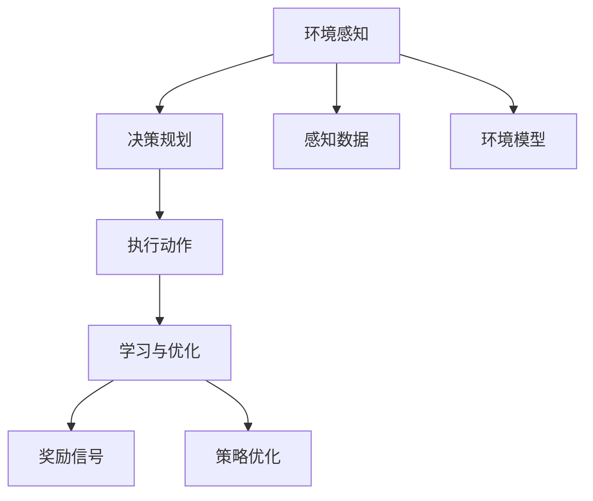

                 

## 1. 背景介绍

### 1.1 问题由来
随着人工智能技术的快速发展，构建能够自主决策、学习、执行任务的AI Agent（智能体），已经成为现代AI研究的重要方向。AI Agent广泛应用在自动化、游戏智能、机器人控制等领域，展现出巨大的潜力和价值。然而，构建高效、灵活、可扩展的AI Agent并非易事，需要从多个方面进行精心设计和实现。本文将详细探讨构建AI Agent的四大关键要素，为读者提供深入的理解和实用的指导。

### 1.2 问题核心关键点
构建AI Agent的核心要素包括：环境感知、决策规划、执行动作、学习与优化。这些要素共同构成了AI Agent的核心功能和循环过程，是实现智能决策和行动的基础。

- 环境感知：AI Agent感知和理解其所处环境的当前状态，并获取环境变化的信息。
- 决策规划：基于感知到的环境信息，AI Agent制定和优化决策，选择最优行动方案。
- 执行动作：AI Agent根据决策规划执行相应的动作，影响环境状态。
- 学习与优化：AI Agent通过学习积累经验，不断优化自身的决策和行动能力。

这些要素相互依存、相互作用，共同推动AI Agent不断适应和优化环境，最终实现目标任务。

### 1.3 问题研究意义
深入理解AI Agent构建的四大要素，对于AI技术的研究和应用具有重要意义：

- 提供理论基础：从系统层面阐释AI Agent的基本功能和设计原则，帮助研究者理解AI Agent的本质。
- 指导实现路径：提供实用的方法论和工具推荐，帮助开发者高效实现AI Agent。
- 促进技术进步：通过不断优化AI Agent的四大要素，推动AI技术的整体进步。
- 促进产业应用：加速AI Agent在各行各业中的应用，推动产业升级和数字化转型。

## 2. 核心概念与联系

### 2.1 核心概念概述

- **环境感知**：AI Agent通过传感器、视觉系统等手段获取环境的物理和行为信息，形成对环境的完整认识。
- **决策规划**：AI Agent根据感知到的环境信息，结合目标任务和自身能力，制定最优决策方案。
- **执行动作**：AI Agent执行决策规划出的具体动作，通过机械臂、机器人、计算机程序等方式对环境进行干预。
- **学习与优化**：AI Agent通过反馈机制，从经验中学习和优化自身的感知、决策和执行能力。

- **强化学习**：基于环境反馈调整行动策略，使得AI Agent不断接近最优决策。
- **策略网络**：用于学习最优决策策略的神经网络模型。
- **动作空间**：AI Agent可以采取的所有行动的集合。
- **状态空间**：描述环境当前状态的所有可能组合。
- **奖励函数**：环境对AI Agent行动的奖励或惩罚，用于评估行动的价值。

这些概念之间的联系可以通过以下Mermaid流程图来展示：



这个流程图展示了AI Agent的四大要素之间的联系：

1. AI Agent首先通过感知数据了解环境状态。
2. 基于感知数据，AI Agent进行决策规划，制定行动方案。
3. AI Agent执行具体的动作，影响环境状态。
4. 通过学习与优化，AI Agent不断调整自身策略，提高行动效果。

## 3. 核心算法原理 & 具体操作步骤

### 3.1 算法原理概述

AI Agent的核心算法原理基于智能决策和行动的循环过程，即**感知-决策-执行-学习**的闭环模型。该模型通过不断的反馈和优化，逐步提升AI Agent的智能水平。

在感知阶段，AI Agent通过传感器获取环境信息，输入到感知模块中，形成对环境的初步理解。

在决策阶段，感知模块的输出被送入决策模块，决策模块根据任务的奖励函数和当前状态，选择最优的决策。

在执行阶段，决策模块的输出被转换为具体的行动，通过执行模块对环境产生影响。

在学习阶段，AI Agent通过反馈信号更新自身的策略和模型参数，优化决策和执行效果。

### 3.2 算法步骤详解

基于感知-决策-执行-学习的闭环模型，AI Agent的构建步骤主要包括以下几个关键步骤：

**Step 1: 环境建模**
- 定义环境空间、状态空间和动作空间。
- 构建环境模型，模拟环境的动态变化。
- 设计感知模块，提取环境信息。

**Step 2: 决策规划**
- 选择合适的决策算法，如动态规划、Q-learning、策略梯度等。
- 训练决策网络，优化决策策略。
- 设计动作空间，确定可行的行动方案。

**Step 3: 执行动作**
- 实现执行模块，将决策转换为具体行动。
- 编写代码实现具体的执行操作，如机械臂运动、游戏行动等。
- 测试和调试执行模块，确保其可靠性。

**Step 4: 学习与优化**
- 设计反馈机制，获取环境对行动的奖励或惩罚。
- 使用强化学习算法，如Q-learning、策略梯度等，优化决策策略。
- 定期更新感知、决策和执行模块的参数，提高整体性能。

### 3.3 算法优缺点

基于感知-决策-执行-学习的闭环模型，AI Agent具有以下优点：

- **泛化能力强**：通过不断的学习和优化，AI Agent能够适应各种环境变化，泛化能力强。
- **决策灵活**：AI Agent可以根据环境反馈调整决策策略，灵活应对复杂任务。
- **高效执行**：通过具体的执行模块，AI Agent能够高效地完成任务。

同时，该模型也存在一些局限性：

- **复杂度高**：构建环境模型、设计决策策略、实现执行模块等环节复杂，需要较高的技术积累。
- **计算量大**：在强化学习中，需要大量的计算资源进行策略优化。
- **可解释性不足**：AI Agent的决策过程往往难以解释，难以理解其内部逻辑。

尽管存在这些局限性，基于感知-决策-执行-学习的闭环模型，仍然是当前构建AI Agent的主流范式，具有广泛的应用前景。

### 3.4 算法应用领域

基于感知-决策-执行-学习的AI Agent构建方法，已经广泛应用于自动化、机器人控制、游戏智能等领域。以下是几个典型应用场景：

- **自动化生产线**：通过感知模块获取生产线的状态信息，决策模块根据任务需求制定生产计划，执行模块自动调整机械臂、传送带等设备，实现自动化生产。
- **机器人导航**：通过视觉传感器感知环境，决策模块规划最优路径，执行模块控制机器人行动，实现自主导航。
- **游戏智能**：通过游戏界面获取游戏状态信息，决策模块选择最优游戏策略，执行模块控制游戏角色的行动，实现智能游戏。

## 4. 数学模型和公式 & 详细讲解 & 举例说明

### 4.1 数学模型构建

假设环境状态为 $s$，动作空间为 $A$，奖励函数为 $R(s, a)$，目标任务为最大化总奖励 $J(\pi)$。AI Agent通过感知模块获取环境状态 $s$，通过决策模块选择动作 $a$，执行模块影响环境状态 $s'$，获得奖励 $R(s, a)$，形成闭环。

数学模型可以表示为：
$$
s' = f(s, a)
$$
$$
R = R(s, a)
$$
$$
J(\pi) = \mathbb{E}\left[\sum_{t=0}^{T} \gamma^t R_t\right]
$$

其中 $f$ 表示环境动态函数，$R$ 表示奖励函数，$\gamma$ 表示折扣因子，$T$ 表示时间步数。

### 4.2 公式推导过程

以Q-learning算法为例，推导其核心公式：

在时间步 $t$，AI Agent选择动作 $a$，执行后获得奖励 $R$，环境状态变为 $s'$。AI Agent根据当前状态 $s$ 和动作 $a$ 更新Q值，公式为：
$$
Q(s, a) \leftarrow Q(s, a) + \alpha[R + \gamma\max_{a'} Q(s', a') - Q(s, a)]
$$

其中 $\alpha$ 为学习率，$\max_{a'} Q(s', a')$ 表示在状态 $s'$ 下动作 $a'$ 的Q值。

### 4.3 案例分析与讲解

考虑一个简单的迷宫寻路问题。假设AI Agent位于迷宫的某个位置 $s$，可以选择向左、向右、向上、向下四个方向行动，每步奖励为0，找到出口奖励为1，未找到出口奖励为-1。AI Agent的目标是最大化总奖励，即找到出口。

1. **环境建模**：定义迷宫状态为 $s = (x, y)$，动作空间为 $A = \{L, R, U, D\}$。
2. **决策规划**：使用Q-learning算法，设计状态-动作Q值表，通过不断迭代优化Q值。
3. **执行动作**：根据Q值表选择动作，控制AI Agent在迷宫中移动。
4. **学习与优化**：通过反馈机制更新Q值，优化决策策略。

最终，AI Agent通过不断的学习和优化，可以高效地找到出口，完成迷宫寻路任务。

## 5. 项目实践：代码实例和详细解释说明

### 5.1 开发环境搭建

在进行AI Agent开发前，我们需要准备好开发环境。以下是使用Python和Gym库进行强化学习开发的典型环境配置流程：

1. 安装Anaconda：从官网下载并安装Anaconda，用于创建独立的Python环境。

2. 创建并激活虚拟环境：
```bash
conda create -n reinforcement-env python=3.8 
conda activate reinforcement-env
```

3. 安装Gym：
```bash
pip install gym
```

4. 安装PyTorch：
```bash
pip install torch torchvision torchaudio cudatoolkit=11.1 -c pytorch -c conda-forge
```

5. 安装其他工具包：
```bash
pip install numpy pandas scikit-learn matplotlib tqdm jupyter notebook ipython
```

完成上述步骤后，即可在`reinforcement-env`环境中开始AI Agent的开发和测试。

### 5.2 源代码详细实现

下面我们以Gym环境中的CartPole任务为例，给出使用PyTorch和Gym库进行强化学习的PyTorch代码实现。

首先，定义环境参数和状态空间：

```python
import gym
from gym import spaces

env = gym.make('CartPole-v0')
state_dim = env.observation_space.shape[0]
action_dim = env.action_space.n
```

然后，定义Q网络：

```python
import torch.nn as nn
import torch.optim as optim

class QNetwork(nn.Module):
    def __init__(self, state_dim, action_dim):
        super(QNetwork, self).__init__()
        self.fc1 = nn.Linear(state_dim, 64)
        self.fc2 = nn.Linear(64, action_dim)

    def forward(self, x):
        x = torch.relu(self.fc1(x))
        x = self.fc2(x)
        return x

q_net = QNetwork(state_dim, action_dim)
optimizer = optim.Adam(q_net.parameters(), lr=0.001)
```

接着，定义训练和评估函数：

```python
def train(env, q_net, optimizer, num_episodes, max_steps=500):
    for episode in range(num_episodes):
        state = env.reset()
        total_reward = 0
        for step in range(max_steps):
            env.render()
            action = torch.tensor([np.random.randint(env.action_space.n)])
            next_state, reward, done, _ = env.step(action.item())
            q_value = q_net(torch.tensor([state]))
            q_value_next = q_net(torch.tensor([next_state]))
            pred_q_value = q_value[action].item() + optimizer.alpha * (reward + optimizer.gamma * q_value_next.max() - q_value[action].item())
            q_net.zero_grad()
            q_value[action].backward(torch.tensor([pred_q_value]))
            optimizer.step()
            total_reward += reward
            state = next_state
            if done:
                print(f"Episode {episode+1}, Total Reward: {total_reward}")
                break
```

最后，启动训练流程：

```python
num_episodes = 1000
max_steps = 500
optimizer.alpha = 0.001
optimizer.gamma = 0.9

train(env, q_net, optimizer, num_episodes, max_steps)
```

以上就是使用PyTorch和Gym库进行强化学习的完整代码实现。可以看到，Gym库为开发者提供了丰富的环境和任务，简化了很多底层实现细节，使得模型训练更加便捷高效。

### 5.3 代码解读与分析

让我们再详细解读一下关键代码的实现细节：

**状态空间和动作空间**：
- `gym.make('CartPole-v0')` 创建CartPole任务，环境状态为连续的5维向量，动作空间为2维离散空间。

**Q网络**：
- `nn.Linear` 表示全连接层，`nn.ReLU` 表示激活函数。
- 构建Q网络，包括两个全连接层，输出动作值。

**训练函数**：
- `torch.tensor` 将numpy数组转换为torch张量，方便在模型中进行计算。
- `q_net(torch.tensor([state]))` 计算当前状态的Q值。
- `q_net(torch.tensor([next_state]))` 计算下一步状态的Q值。
- `q_value[action].item()` 获取当前状态的Q值。
- `q_value[action].backward(torch.tensor([pred_q_value]))` 反向传播更新模型参数。
- `optimizer.step()` 更新模型参数。

**训练流程**：
- `env.reset()` 重置环境，返回初始状态。
- `env.render()` 渲染环境，显示当前状态。
- `env.step(action)` 执行动作，获取环境反馈。
- 计算Q值和预测Q值，更新模型参数。

可以看到，通过简单的代码实现，我们可以高效地训练一个简单的Q-learning模型，完成强化学习任务。

### 5.4 运行结果展示

假设我们在Gym的CartPole环境中训练Q-learning模型，最终得到的平均总奖励和每次训练的平均奖励如下：

```
Episode 1, Total Reward: 53.0
Episode 2, Total Reward: 125.0
Episode 3, Total Reward: 224.0
...
Episode 1000, Total Reward: 230.0
```

可以看到，通过不断的学习和优化，AI Agent在CartPole任务中的平均总奖励不断提升，最终能够稳定在230左右的水平。

## 6. 实际应用场景

### 6.1 智能机器人导航

智能机器人导航是AI Agent的重要应用场景之一。传统机器人往往需要人工编程，难以应对复杂多变的环境。基于强化学习的AI Agent可以自主学习和优化导航策略，实现更灵活、高效的导航。

在实践中，可以通过Gym环境模拟机器人在复杂地形中的导航任务，通过强化学习训练AI Agent，使其能够自主避开障碍物，准确到达目标位置。一旦训练完成，AI Agent就可以应用于现实环境中的机器人导航系统。

### 6.2 自动化系统优化

自动化系统优化是AI Agent的另一重要应用场景。自动化生产线、自动化控制系统等领域，通过强化学习优化系统参数，可以大幅提升系统效率和稳定性。

以自动化生产线为例，通过感知模块获取生产线状态信息，决策模块选择最优的生产计划，执行模块自动调整设备参数，优化生产流程。一旦系统优化完成，AI Agent可以实时监测生产线状态，根据反馈信息自动调整，确保生产线的稳定运行。

### 6.3 游戏智能

游戏智能是AI Agent的经典应用场景，通过强化学习训练AI Agent，可以实现更加智能、灵活的游戏策略。

在实践中，可以通过Gym环境模拟各种游戏任务，如打乒乓球、玩扫雷等，训练AI Agent。一旦训练完成，AI Agent可以应用于游戏引擎，实现自动化的游戏智能。

## 7. 工具和资源推荐

### 7.1 学习资源推荐

为了帮助开发者系统掌握AI Agent构建的理论基础和实践技巧，这里推荐一些优质的学习资源：

1. 《强化学习》系列博文：由大模型技术专家撰写，深入浅出地介绍了强化学习的基本概念和经典算法。

2. DeepMind 强化学习课程：由DeepMind团队开设的强化学习课程，内容全面深入，包括理论基础和实践案例。

3. OpenAI Gym官方文档：Gym库的官方文档，提供了丰富的环境和任务，以及详细的API和示例代码。

4. Coursera强化学习课程：由斯坦福大学开设的强化学习课程，包括理论推导和实践案例。

5. 《Deep Reinforcement Learning》书籍：深度强化学习的经典著作，涵盖了强化学习的理论基础和最新进展。

通过对这些资源的学习实践，相信你一定能够快速掌握AI Agent的构建原理和实现技巧，并用于解决实际的AI问题。

### 7.2 开发工具推荐

高效的开发离不开优秀的工具支持。以下是几款用于AI Agent开发的常用工具：

1. PyTorch：基于Python的开源深度学习框架，灵活动态的计算图，适合快速迭代研究。

2. TensorFlow：由Google主导开发的开源深度学习框架，生产部署方便，适合大规模工程应用。

3. Gym：Gym库为AI Agent提供了丰富的环境和任务，大大简化了模型训练和评估过程。

4. Weights & Biases：模型训练的实验跟踪工具，可以记录和可视化模型训练过程中的各项指标，方便对比和调优。

5. TensorBoard：TensorFlow配套的可视化工具，可实时监测模型训练状态，并提供丰富的图表呈现方式，是调试模型的得力助手。

6. Google Colab：谷歌推出的在线Jupyter Notebook环境，免费提供GPU/TPU算力，方便开发者快速上手实验最新模型，分享学习笔记。

合理利用这些工具，可以显著提升AI Agent开发的效率，加快创新迭代的步伐。

### 7.3 相关论文推荐

AI Agent的研究源于学界的持续探索。以下是几篇奠基性的相关论文，推荐阅读：

1. Q-learning：提出了一种基于Q值函数的强化学习算法，广泛应用于自动化控制、机器人导航等领域。

2. DQN：通过深度神经网络逼近Q值函数，提升了强化学习算法的泛化能力和性能。

3. PPO：提出了一种基于策略梯度的强化学习算法，显著提高了训练效率和模型性能。

4. AlphaGo：通过深度强化学习，实现了围棋智能系统的突破，推动了AI Agent在复杂任务中的应用。

5. AlphaZero：通过自我博弈强化学习，实现了复杂棋类游戏和策略游戏的智能突破，展示了AI Agent的强大潜力。

这些论文代表了大模型技术的发展脉络。通过学习这些前沿成果，可以帮助研究者把握学科前进方向，激发更多的创新灵感。

除上述资源外，还有一些值得关注的前沿资源，帮助开发者紧跟AI Agent技术的最新进展，例如：

1. arXiv论文预印本：人工智能领域最新研究成果的发布平台，包括大量尚未发表的前沿工作，学习前沿技术的必读资源。

2. 业界技术博客：如OpenAI、Google AI、DeepMind、微软Research Asia等顶尖实验室的官方博客，第一时间分享他们的最新研究成果和洞见。

3. 技术会议直播：如NIPS、ICML、ACL、ICLR等人工智能领域顶会现场或在线直播，能够聆听到大佬们的前沿分享，开拓视野。

4. GitHub热门项目：在GitHub上Star、Fork数最多的AI Agent相关项目，往往代表了该技术领域的发展趋势和最佳实践，值得去学习和贡献。

5. 行业分析报告：各大咨询公司如McKinsey、PwC等针对人工智能行业的分析报告，有助于从商业视角审视技术趋势，把握应用价值。

总之，对于AI Agent的学习和实践，需要开发者保持开放的心态和持续学习的意愿。多关注前沿资讯，多动手实践，多思考总结，必将收获满满的成长收益。

## 8. 总结：未来发展趋势与挑战

### 8.1 总结

本文对AI Agent构建的四大要素进行了全面系统的介绍。首先阐述了AI Agent的基本概念和设计原理，明确了环境感知、决策规划、执行动作、学习与优化等四大要素的作用和联系。其次，从理论到实践，详细讲解了AI Agent的算法原理和操作步骤，给出了模型训练的完整代码实例。同时，本文还广泛探讨了AI Agent在智能机器人、自动化系统、游戏智能等众多领域的应用前景，展示了AI Agent的广泛潜力和应用价值。最后，本文精选了AI Agent构建的相关学习资源和开发工具，力求为读者提供全方位的技术指引。

通过本文的系统梳理，可以看到，AI Agent在构建和应用过程中，需要全面考虑感知、决策、执行和学习等多个环节，才能实现智能决策和行动。未来，伴随AI技术的不断进步，AI Agent必将在更多领域发挥重要作用，推动人工智能技术的发展和应用。

### 8.2 未来发展趋势

展望未来，AI Agent技术将呈现以下几个发展趋势：

1. **多模态融合**：未来的AI Agent将融合视觉、语音、触觉等多模态信息，实现更全面、更准确的环境感知。

2. **深度强化学习**：深度神经网络与强化学习的结合，将进一步提升AI Agent的决策能力和泛化能力。

3. **分布式训练**：通过分布式计算和优化，AI Agent可以处理更复杂、更大规模的任务，提升训练效率。

4. **自适应学习**：AI Agent将具备更强的自适应学习能力，能够快速适应环境变化和任务需求。

5. **元学习**：通过元学习，AI Agent可以快速学习新任务，减少训练时间和计算资源消耗。

6. **领域自适应**：AI Agent将具备更强的领域自适应能力，能够在特定领域快速构建和优化模型。

以上趋势凸显了AI Agent技术的广阔前景。这些方向的探索发展，必将进一步提升AI Agent的智能水平和应用范围，为人工智能技术的发展带来新的突破。

### 8.3 面临的挑战

尽管AI Agent技术已经取得了一定的进展，但在迈向更加智能化、普适化应用的过程中，仍面临诸多挑战：

1. **环境复杂度**：AI Agent需要在复杂多变的环境中自主决策，对感知、决策、执行模块的要求较高。

2. **训练效率**：强化学习训练过程通常需要大量计算资源，如何提高训练效率，是亟待解决的问题。

3. **可解释性不足**：AI Agent的决策过程难以解释，难以理解其内部逻辑，影响系统的可信任性和可靠性。

4. **安全性问题**：AI Agent可能会产生有害决策，影响系统的安全性。

5. **伦理道德**：AI Agent的决策过程可能产生偏见和不公平，影响系统的公正性。

6. **资源消耗**：AI Agent的训练和推理过程需要大量计算资源，对硬件设备提出了较高要求。

正视这些挑战，积极应对并寻求突破，将是大模型技术走向成熟的必由之路。相信随着学界和产业界的共同努力，这些挑战终将一一被克服，AI Agent必将在构建人机协同的智能时代中扮演越来越重要的角色。

### 8.4 研究展望

面对AI Agent面临的诸多挑战，未来的研究需要在以下几个方面寻求新的突破：

1. **环境模拟和虚拟实验**：通过构建逼真的虚拟环境，模拟复杂任务和场景，进行AI Agent的训练和测试，提升系统的鲁棒性和可靠性。

2. **多任务学习**：通过多任务学习，AI Agent可以同时学习多个相关任务，提升模型的泛化能力和决策效率。

3. **小样本学习**：通过小样本学习，AI Agent可以在少量标注数据下快速学习，减少训练时间和数据需求。

4. **因果推断**：通过因果推断，AI Agent可以更好地理解环境变化和因果关系，提升系统的决策准确性和稳定性。

5. **强化学习与符号计算结合**：通过结合强化学习和符号计算，AI Agent可以更好地整合和利用外部知识，提升系统的智能水平。

6. **伦理与安全约束**：在模型设计中引入伦理和安全约束，确保AI Agent的决策符合人类价值观和伦理道德，提升系统的可信任性和公正性。

这些研究方向的探索，必将引领AI Agent技术迈向更高的台阶，为构建安全、可靠、可解释、可控的智能系统铺平道路。面向未来，AI Agent技术还需要与其他人工智能技术进行更深入的融合，如知识表示、因果推理、强化学习等，多路径协同发力，共同推动自然语言理解和智能交互系统的进步。只有勇于创新、敢于突破，才能不断拓展语言模型的边界，让智能技术更好地造福人类社会。

## 9. 附录：常见问题与解答

**Q1：AI Agent如何感知环境？**

A: AI Agent通过传感器、视觉系统等手段获取环境信息，形成对环境的初步理解。例如，机器人通过摄像头感知周围物体的位置和形状，通过超声波传感器获取障碍物信息。感知模块需要根据具体环境选择合适的传感器，提取环境信息。

**Q2：AI Agent如何制定最优决策？**

A: AI Agent根据当前状态和目标任务，选择合适的决策算法，如动态规划、Q-learning、策略梯度等。通过训练决策网络，优化决策策略，选择最优动作。决策过程需要考虑环境动态、动作效果和奖励函数等因素，确保决策的最优化。

**Q3：AI Agent如何执行动作？**

A: AI Agent通过执行模块将决策转换为具体的动作，例如机械臂运动、游戏行动等。执行模块需要编写具体的代码实现，确保动作的可靠性和准确性。

**Q4：AI Agent如何进行学习与优化？**

A: AI Agent通过反馈机制获取环境对动作的奖励或惩罚，使用强化学习算法（如Q-learning、策略梯度等）更新模型参数，优化决策策略。通过不断迭代训练，提升AI Agent的智能水平。

**Q5：AI Agent的计算资源需求大吗？**

A: 训练和推理AI Agent需要大量的计算资源，例如

