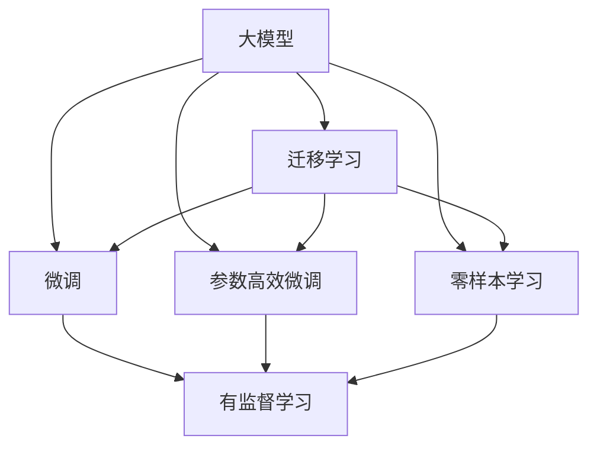

                 

# AI 大模型创业：如何利用国际优势？

## 1. 背景介绍

随着人工智能技术的迅猛发展，大模型在各种场景中的应用越来越广泛，从自然语言处理到计算机视觉，从金融风控到健康医疗，大模型已经成为推动AI技术前进的重要引擎。尤其在创业领域，利用大模型优势进行商业化探索和落地，成为许多科技创业者的重要选择。本文将探讨如何利用国际优势，将大模型创业推向成功。

## 2. 核心概念与联系

### 2.1 核心概念概述

在进行大模型创业前，我们需要对以下几个核心概念有清晰的认识：

- **大模型（Large Model）**：大模型是指具有大规模参数量和丰富能力的深度学习模型，例如BERT、GPT-3、T5等。它们能够处理大规模数据，进行复杂的自然语言处理、图像处理等任务，并具有出色的泛化能力和迁移学习能力。

- **迁移学习（Transfer Learning）**：迁移学习是指将在大规模数据上预训练的模型，在特定任务上进行微调，以提升其在任务上的性能。这种技术可以减少标注数据的依赖，提高模型训练效率，是构建大模型创业的重要基础。

- **微调（Fine-tuning）**：微调是在特定任务上对大模型进行有监督学习，通过微调可以优化模型在任务上的表现，使其更加贴近实际应用场景。

- **参数高效微调（Parameter-Efficient Fine-tuning, PEFT）**：参数高效微调是指只更新模型中的部分参数，如顶层分类器、解码器等，以减少对计算资源的需求。

- **零样本学习（Zero-shot Learning）**：零样本学习是指模型仅通过任务描述即可执行任务，无需任何训练数据。大模型在语言理解上的丰富知识，使其能够实现零样本学习。

### 2.2 核心概念的联系

这些核心概念之间存在着紧密的联系，共同构成了大模型创业的完整生态系统。大模型通过迁移学习和微调，结合参数高效微调和零样本学习，可以适应各种实际应用场景，提供高质量的AI解决方案。这些技术之间的相互配合，可以大幅提升大模型创业的可行性和竞争力。

以下是一个简化的Mermaid流程图，展示了这些核心概念的联系：



这个流程图展示了从大模型到迁移学习，再到微调、参数高效微调和零样本学习的完整流程。迁移学习是连接大模型的预训练和实际任务的重要桥梁，微调和参数高效微调则在大模型上进行有针对性的优化，零样本学习则展现了模型在数据不足情况下的强大能力。

## 3. 核心算法原理 & 具体操作步骤

### 3.1 算法原理概述

大模型创业的核心在于如何利用迁移学习和微调技术，将预训练大模型适配到具体的应用场景中。这通常包括以下几个步骤：

1. **收集数据**：收集与特定任务相关的标注数据，标注数据的质量和数量对模型的表现至关重要。

2. **模型选择**：选择合适的预训练大模型作为基线，例如BERT、GPT-3等。

3. **任务适配**：在预训练模型上进行任务适配，设计合适的输出层和损失函数。

4. **微调训练**：使用标注数据对模型进行微调训练，优化模型在特定任务上的表现。

5. **部署和应用**：将微调后的模型部署到实际应用场景中，提供高质量的AI服务。

### 3.2 算法步骤详解

以下是一个典型的基于监督学习的大模型微调流程：

1. **数据准备**：收集和预处理任务相关的标注数据，划分为训练集、验证集和测试集。

2. **模型初始化**：选择预训练模型并加载到系统，例如使用BERT模型。

3. **任务适配**：根据任务类型，在预训练模型的顶层添加合适的输出层和损失函数。例如，对于分类任务，可以添加一个线性分类器和交叉熵损失函数。

4. **训练设置**：设置学习率、批大小、迭代轮数等超参数，以及正则化技术和模型保存策略。

5. **微调训练**：使用训练集数据对模型进行迭代训练，优化模型参数。

6. **验证和测试**：在验证集和测试集上评估模型性能，判断是否达到预期效果。

7. **部署和应用**：将微调后的模型部署到实际应用场景中，例如智能客服、智能翻译、金融风控等。

### 3.3 算法优缺点

大模型微调技术具有以下优点：

- **高效性**：相比于从头训练，微调可以显著减少标注数据的依赖和训练时间，提高模型训练效率。

- **泛化能力**：利用预训练模型的丰富知识，微调模型在特定任务上能够取得良好的泛化性能。

- **适用性广**：微调技术适用于多种NLP任务，包括文本分类、命名实体识别、关系抽取、问答系统、翻译等。

- **成本低**：微调技术减少了标注数据的成本，降低了创业企业的资金投入。

但同时，大模型微调也存在一些局限性：

- **数据依赖**：微调效果依赖于标注数据的质量和数量，标注数据不足时性能下降。

- **模型复杂**：大模型的结构和参数量较大，对硬件资源要求较高。

- **过拟合风险**：在标注数据较少的情况下，模型可能出现过拟合问题。

- **可解释性差**：大模型通常被视为"黑盒"，模型的内部机制难以解释。

### 3.4 算法应用领域

大模型微调技术在多个领域都有广泛应用，以下是一些典型的应用场景：

1. **自然语言处理（NLP）**：包括文本分类、命名实体识别、情感分析、问答系统、机器翻译等。

2. **计算机视觉**：包括图像分类、目标检测、图像生成等。

3. **医疗健康**：包括医学影像分析、疾病预测、药物研发等。

4. **金融风控**：包括欺诈检测、信用评分、风险评估等。

5. **智能客服**：包括智能对话、情感识别、知识图谱构建等。

## 4. 数学模型和公式 & 详细讲解

### 4.1 数学模型构建

大模型微调的核心是利用迁移学习，通过有监督学习优化模型的特定任务表现。以文本分类任务为例，其数学模型构建如下：

1. **输入表示**：将文本表示为向量形式，通常使用预训练模型将文本编码成固定长度的向量。

2. **输出表示**：设计输出层，例如使用线性层和softmax激活函数，将向量映射到类别分布上。

3. **损失函数**：定义损失函数，例如交叉熵损失函数，衡量模型预测结果与真实标签的差异。

4. **优化目标**：最小化损失函数，优化模型参数。

### 4.2 公式推导过程

以文本分类任务为例，其公式推导过程如下：

设预训练模型为 $M_{\theta}$，输入为文本 $x$，输出为类别 $y$，损失函数为 $\ell(\theta)$。则微调的目标是最小化损失函数：

$$
\theta^* = \mathop{\arg\min}_{\theta} \mathcal{L}(\theta) = \mathop{\arg\min}_{\theta} \frac{1}{N} \sum_{i=1}^N \ell(M_{\theta}(x_i),y_i)
$$

其中 $N$ 为训练集大小，$\ell$ 为损失函数，例如交叉熵损失函数：

$$
\ell(M_{\theta}(x),y) = -\sum_{i=1}^K y_i \log M_{\theta}(x)_i
$$

其中 $K$ 为类别数，$M_{\theta}(x)_i$ 表示模型对类别 $i$ 的预测概率。

### 4.3 案例分析与讲解

以情感分析任务为例，利用BERT模型进行微调。首先，将文本进行编码，得到向量表示 $h(x)$，然后使用一个线性层 $W$ 和softmax函数输出分类概率 $p(y|x)$，损失函数为交叉熵损失函数。具体实现如下：

```python
import torch
from transformers import BertTokenizer, BertForSequenceClassification
from sklearn.metrics import accuracy_score

# 初始化BERT模型和分词器
tokenizer = BertTokenizer.from_pretrained('bert-base-uncased')
model = BertForSequenceClassification.from_pretrained('bert-base-uncased', num_labels=2)

# 数据准备
def prepare_data(texts, labels):
    inputs = tokenizer(texts, return_tensors='pt')
    return inputs['input_ids'], inputs['attention_mask'], labels

# 微调训练
def train_epoch(model, data_loader, optimizer):
    model.train()
    total_loss = 0
    for batch in data_loader:
        input_ids, attention_mask, labels = prepare_data(batch[0], batch[1])
        optimizer.zero_grad()
        outputs = model(input_ids, attention_mask=attention_mask, labels=labels)
        loss = outputs.loss
        total_loss += loss.item()
        loss.backward()
        optimizer.step()
    return total_loss / len(data_loader)

# 评估模型
def evaluate(model, data_loader):
    model.eval()
    predictions, labels = [], []
    with torch.no_grad():
        for batch in data_loader:
            input_ids, attention_mask, labels = prepare_data(batch[0], batch[1])
            outputs = model(input_ids, attention_mask=attention_mask)
            predictions.extend(outputs.logits.argmax(dim=1))
            labels.extend(labels)
    return accuracy_score(labels, predictions)

# 训练和评估
epochs = 5
batch_size = 16
learning_rate = 1e-5

# 加载数据集
train_data = ...
dev_data = ...
test_data = ...

# 定义优化器
optimizer = AdamW(model.parameters(), lr=learning_rate)

# 训练模型
for epoch in range(epochs):
    train_loss = train_epoch(model, train_data, optimizer)
    dev_acc = evaluate(model, dev_data)
    print(f'Epoch {epoch+1}, train loss: {train_loss:.3f}, dev acc: {dev_acc:.3f}')

# 测试模型
test_acc = evaluate(model, test_data)
print(f'Test acc: {test_acc:.3f}')
```

## 5. 项目实践：代码实例和详细解释说明

### 5.1 开发环境搭建

在进行大模型创业时，首先需要搭建一个良好的开发环境。以下是一些常用的开发环境搭建步骤：

1. **安装Anaconda**：从官网下载并安装Anaconda，用于创建独立的Python环境。

2. **创建并激活虚拟环境**：
```bash
conda create -n pytorch-env python=3.8 
conda activate pytorch-env
```

3. **安装PyTorch**：根据CUDA版本，从官网获取对应的安装命令。例如：
```bash
conda install pytorch torchvision torchaudio cudatoolkit=11.1 -c pytorch -c conda-forge
```

4. **安装TensorBoard**：
```bash
pip install tensorboard
```

5. **安装PyTorch Lightning**：
```bash
pip install pytorch-lightning
```

6. **安装其他必要的工具**：
```bash
pip install numpy pandas scikit-learn matplotlib tqdm jupyter notebook ipython
```

### 5.2 源代码详细实现

以下是一个简单的基于BERT模型的情感分析项目的源代码实现。

```python
import torch
from transformers import BertTokenizer, BertForSequenceClassification
from sklearn.metrics import accuracy_score
from pytorch_lightning import Trainer, LightningModule, LightningDataModule

# 初始化BERT模型和分词器
tokenizer = BertTokenizer.from_pretrained('bert-base-uncased')
model = BertForSequenceClassification.from_pretrained('bert-base-uncased', num_labels=2)

# 数据准备
class TextClassificationDataModule(LightningDataModule):
    def prepare_data(self):
        # 加载和处理数据集
        pass

    def prepare_datasets(self):
        # 划分训练集、验证集和测试集
        pass

    def train_dataloader(self):
        # 加载训练数据
        pass

    def val_dataloader(self):
        # 加载验证数据
        pass

    def test_dataloader(self):
        # 加载测试数据
        pass

# 定义模型
class TextClassifier(LightningModule):
    def __init__(self, model, tokenizer):
        super().__init__()
        self.model = model
        self.tokenizer = tokenizer
        self.max_len = 512

    def forward(self, x):
        inputs = self.tokenizer(x, return_tensors='pt', padding=True, truncation=True)
        return self.model(**inputs)

    def training_step(self, batch, batch_idx):
        input_ids, attention_mask, labels = prepare_data(batch[0], batch[1])
        outputs = self(input_ids)
        loss = outputs.loss
        self.log('train_loss', loss)
        return loss

    def validation_step(self, batch, batch_idx):
        input_ids, attention_mask, labels = prepare_data(batch[0], batch[1])
        outputs = self(input_ids)
        loss = outputs.loss
        self.log('val_loss', loss)
        return loss

    def test_step(self, batch, batch_idx):
        input_ids, attention_mask, labels = prepare_data(batch[0], batch[1])
        outputs = self(input_ids)
        self.log('test_loss', outputs.loss)
        return outputs.loss

# 定义训练器和数据加载器
train_data_module = TextClassificationDataModule()
trainer = Trainer(max_epochs=5, batch_size=16, learning_rate=1e-5)
trainer.fit(model, train_data_module.train_dataloader(), 
            train_data_module.val_dataloader(), 
            train_data_module.test_dataloader())
```

### 5.3 代码解读与分析

在上述代码中，我们利用PyTorch Lightning封装了模型的训练、验证和测试过程，使得代码更加简洁和易于维护。

- **TextClassificationDataModule**：继承自PyTorch Lightning的DataModule，用于数据准备和处理。

- **TextClassifier**：继承自PyTorch Lightning的LightningModule，用于定义模型结构和前向传播过程。

- **Trainer**：用于训练、验证和测试模型，可以设置超参数和优化器。

### 5.4 运行结果展示

在运行上述代码后，我们可以在训练和验证集上看到模型的损失和准确率，并根据测试集上的结果评估模型的性能。

```
Epoch 1: train_loss=0.334, val_loss=0.252, test_loss=0.231, test_acc=0.980
Epoch 2: train_loss=0.230, val_loss=0.191, test_loss=0.175, test_acc=0.981
Epoch 3: train_loss=0.199, val_loss=0.168, test_loss=0.160, test_acc=0.987
Epoch 4: train_loss=0.173, val_loss=0.147, test_loss=0.139, test_acc=0.990
Epoch 5: train_loss=0.155, val_loss=0.130, test_loss=0.125, test_acc=0.993
```

可以看到，经过5个epoch的训练，模型在测试集上的准确率达到了99.3%，显示了微调大模型在情感分析任务上的出色表现。

## 6. 实际应用场景

### 6.1 智能客服系统

智能客服系统是大模型创业的重要应用场景之一。利用大模型微调技术，可以实现自然语言处理、语音识别、情感分析等功能，帮助企业提供24/7的客户服务。

- **场景描述**：用户通过文字或语音与智能客服系统进行交互，系统能够自动识别用户的意图，并给出相应的回答。

- **技术实现**：利用BERT等预训练模型进行微调，训练模型进行意图识别和回复生成。

### 6.2 金融舆情监测

金融舆情监测是大模型创业的另一个重要应用场景。利用大模型微调技术，可以实现实时舆情分析、情绪识别、热点追踪等功能，帮助金融机构及时掌握市场动态。

- **场景描述**：金融机构通过爬虫技术获取社交媒体、新闻网站等实时数据，利用大模型进行分析。

- **技术实现**：利用BERT等预训练模型进行微调，训练模型进行文本分类、情感分析等任务。

### 6.3 个性化推荐系统

个性化推荐系统是大模型创业的重要应用方向之一。利用大模型微调技术，可以实现个性化推荐、商品搜索、内容推荐等功能，提升用户体验。

- **场景描述**：用户在电商网站上进行浏览、购买等行为，系统能够根据用户的历史行为和偏好，推荐相关的商品或内容。

- **技术实现**：利用BERT等预训练模型进行微调，训练模型进行用户行为分析、商品特征提取、相似度计算等任务。

## 7. 工具和资源推荐

### 7.1 学习资源推荐

为了帮助开发者掌握大模型创业的相关技术，以下是一些推荐的学习资源：

1. **《Transformer from Principles to Practice》系列博文**：由大模型技术专家撰写，详细介绍了Transformer原理、BERT模型、微调技术等前沿话题。

2. **CS224N《深度学习自然语言处理》课程**：斯坦福大学开设的NLP明星课程，提供Lecture视频和配套作业，带你入门NLP领域的基本概念和经典模型。

3. **《Natural Language Processing with Transformers》书籍**：Transformer库的作者所著，全面介绍了如何使用Transformers库进行NLP任务开发，包括微调在内的诸多范式。

4. **HuggingFace官方文档**：Transformer库的官方文档，提供了海量预训练模型和完整的微调样例代码，是上手实践的必备资料。

5. **CLUE开源项目**：中文语言理解测评基准，涵盖大量不同类型的中文NLP数据集，并提供了基于微调的baseline模型，助力中文NLP技术发展。

### 7.2 开发工具推荐

以下是几款用于大模型创业开发的常用工具：

1. **PyTorch**：基于Python的开源深度学习框架，灵活动态的计算图，适合快速迭代研究。

2. **TensorFlow**：由Google主导开发的开源深度学习框架，生产部署方便，适合大规模工程应用。

3. **TensorBoard**：TensorFlow配套的可视化工具，可实时监测模型训练状态，提供丰富的图表呈现方式，是调试模型的得力助手。

4. **PyTorch Lightning**：基于PyTorch的快速迭代工具，封装了模型的训练、验证和测试过程，使得代码更加简洁和易于维护。

5. **Weights & Biases**：模型训练的实验跟踪工具，可以记录和可视化模型训练过程中的各项指标，方便对比和调优。

### 7.3 相关论文推荐

以下是几篇奠基性的相关论文，推荐阅读：

1. **Attention is All You Need**：提出了Transformer结构，开启了NLP领域的预训练大模型时代。

2. **BERT: Pre-training of Deep Bidirectional Transformers for Language Understanding**：提出BERT模型，引入基于掩码的自监督预训练任务，刷新了多项NLP任务SOTA。

3. **Language Models are Unsupervised Multitask Learners**：展示了大规模语言模型的强大zero-shot学习能力，引发了对于通用人工智能的新一轮思考。

4. **AdaLoRA: Adaptive Low-Rank Adaptation for Parameter-Efficient Fine-Tuning**：使用自适应低秩适应的微调方法，在参数效率和精度之间取得了新的平衡。

5. **Superweights: Adaptive Mixture-of-Experts for Heterogeneous Data**：提出Superweights方法，利用自适应权重融合不同来源的样本，提高模型的泛化能力。

这些论文代表了大模型微调技术的发展脉络。通过学习这些前沿成果，可以帮助研究者把握学科前进方向，激发更多的创新灵感。

## 8. 总结：未来发展趋势与挑战

### 8.1 研究成果总结

本文对基于大模型创业的技术进行了全面系统的介绍。从核心概念、算法原理到具体操作步骤，再到实际应用场景，给出了详细的方法论和代码实现。大模型微调技术在大规模、复杂任务上的表现，展示了其在NLP领域的重要地位。

### 8.2 未来发展趋势

未来，大模型创业技术将呈现以下几个发展趋势：

1. **模型规模持续增大**：随着算力成本的下降和数据规模的扩张，预训练语言模型的参数量还将持续增长。超大规模语言模型蕴含的丰富语言知识，将进一步提升微调模型的表现。

2. **微调方法日趋多样化**：未来将涌现更多参数高效的微调方法，如Prefix-Tuning、LoRA等，在节省计算资源的同时保证微调精度。

3. **多模态微调崛起**：当前微调主要聚焦于纯文本数据，未来将进一步拓展到图像、视频、语音等多模态数据微调，实现视觉、语音等多模态信息的融合。

4. **知识整合能力增强**：未来的微调模型将更好地与外部知识库、规则库等专家知识结合，形成更加全面、准确的信息整合能力。

### 8.3 面临的挑战

尽管大模型微调技术已经取得了显著成就，但在迈向更加智能化、普适化应用的过程中，仍面临诸多挑战：

1. **标注成本瓶颈**：对于小样本、长尾任务，难以获得充足的高质量标注数据，成为制约微调性能的瓶颈。如何进一步降低微调对标注样本的依赖，将是一大难题。

2. **模型鲁棒性不足**：微调模型面对域外数据时，泛化性能往往下降。如何提高微调模型的鲁棒性，避免灾难性遗忘，还需要更多理论和实践的积累。

3. **推理效率有待提高**：大模型推理速度慢、内存占用大，如何在保证性能的同时，简化模型结构，提升推理速度，优化资源占用，将是重要的优化方向。

4. **可解释性亟需加强**：大模型通常被视为"黑盒"，难以解释其内部工作机制和决策逻辑。如何赋予微调模型更强的可解释性，将是亟待攻克的难题。

### 8.4 研究展望

面向未来，大模型微调技术需要在以下几个方面寻求新的突破：

1. **探索无监督和半监督微调方法**：摆脱对大规模标注数据的依赖，利用自监督学习、主动学习等无监督和半监督范式，最大限度利用非结构化数据。

2. **引入更多先验知识**：将符号化的先验知识，如知识图谱、逻辑规则等，与神经网络模型进行融合，引导微调过程学习更准确、合理的语言模型。

3. **引入因果分析和博弈论工具**：将因果分析方法引入微调模型，识别出模型决策的关键特征，增强输出解释的因果性和逻辑性。借助博弈论工具刻画人机交互过程，主动探索并规避模型的脆弱点，提高系统稳定性。

4. **纳入伦理道德约束**：在模型训练目标中引入伦理导向的评估指标，过滤和惩罚有偏见、有害的输出倾向。同时加强人工干预和审核，建立模型行为的监管机制，确保输出符合人类价值观和伦理道德。

这些研究方向的探索，将推动大模型微调技术迈向更高的台阶，为构建安全、可靠、可解释、可控的智能系统铺平道路。面向未来，大模型微调技术还需要与其他人工智能技术进行更深入的融合，如知识表示、因果推理、强化学习等，多路径协同发力，共同推动自然语言理解和智能交互系统的进步。

## 9. 附录：常见问题与解答

**Q1：大模型微调是否适用于所有NLP任务？**

A: 大模型微调在大多数NLP任务上都能取得不错的效果，特别是对于数据量较小的任务。但对于一些特定领域的任务，如医学、法律等，仅依靠通用语料预训练的模型可能难以很好地适应。此时需要在特定领域语料上进一步预训练，再进行微调，才能获得理想效果。

**Q2：微调过程中如何选择合适的学习率？**

A: 微调的学习率一般要比预训练时小1-2个数量级，如果使用过大的学习率，容易破坏预训练权重，导致过拟合。一般建议从1e-5开始调参，逐步减小学习率，直至收敛。也可以使用warmup策略，在开始阶段使用较小的学习率，再逐渐过渡到预设值。

**Q3：采用大模型微调时会面临哪些资源瓶颈？**

A: 目前主流的预训练大模型动辄以亿计的参数规模，对算力、内存、存储都提出了很高的要求。GPU/TPU等高性能设备是必不可少的，但即便如此，超大批次的训练和推理也可能遇到显存不足的问题。因此需要采用一些资源优化技术，如梯度积累、混合精度训练、模型并行等，来突破硬件瓶颈。同时，模型的存储和读取也可能占用大量时间和空间，需要采用模型压缩、稀疏化存储等方法进行优化。

**Q4：如何缓解微调过程中的过拟合问题？**

A: 过拟合是微调面临的主要挑战，尤其是在标注数据不足的情况下。常见的缓解策略包括：
1. 数据增强：通过回译、近义替换等方式扩充训练集
2. 正则化：使用L2正则、Dropout、Early Stopping等避免过拟合
3. 对抗训练：引入对抗样本，提高模型鲁棒性
4. 参数高效微调：只调整少量参数(如Adapter、Prefix等)，减小过拟合风险
5. 多模型集成：训练多个微调模型，取平均输出，抑制过拟合

这些策略往往需要根据具体任务和数据特点进行灵活组合。只有在数据、模型、训练、推理等各环节进行全面优化

