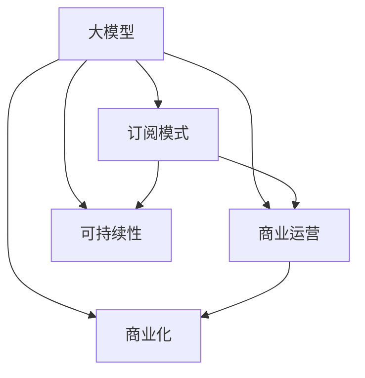

                 

# AI 大模型原理与应用：订阅商业模式

> 关键词：大模型,订阅模式,商业化,微调,订阅系统,商业运营,可持续发展

## 1. 背景介绍

随着人工智能技术的迅猛发展，大模型（如GPT-3、BERT等）在NLP、计算机视觉等领域展现出强大的实力，吸引了众多企业和研究机构的关注。然而，大模型的研发与部署需要巨额资金投入，尤其对于中小型企业，高昂的成本使其难以广泛应用。订阅商业模式作为一种新兴的商业化策略，逐渐成为大模型应用落地的重要手段。本文将系统介绍订阅模式的大模型应用实践，包括核心概念、算法原理、操作步骤、数学模型、项目实践、实际应用场景、工具资源推荐、总结与发展趋势等内容，旨在为人工智能技术在产业界的大规模落地提供有力支撑。

## 2. 核心概念与联系

### 2.1 核心概念概述

- **大模型**：如GPT-3、BERT等，通过在大规模数据上预训练得到的通用语言模型，具备强大的语言理解和生成能力。
- **订阅模式**：消费者或企业按月、年或使用量付费，获取大模型的计算能力和API接口，通过API接口调用大模型进行具体任务处理，如文本分析、图像识别等。
- **商业运营**：将大模型封装为商业服务，通过订阅模式进行盈利，支持大模型持续更新与优化，形成可持续发展的商业生态系统。
- **可持续性**：订阅模式通过合理定价与成本控制，使大模型商业化运营成为可能，确保模型的持续更新与优化。
- **商业化**：将大模型的技术优势转化为市场竞争力，实现技术成果的产业化与商业化应用。

### 2.2 概念间的关系

通过Mermaid流程图，可以清晰展示上述概念之间的联系：



此图展示了从大模型的技术研发，到订阅模式的应用推广，再到商业化运营与可持续发展的全链条过程。其中，大模型是基础，订阅模式是应用模式，商业运营是商业模式，可持续性是目标，商业化是最终目的。

## 3. 核心算法原理 & 具体操作步骤

### 3.1 算法原理概述

订阅模式的大模型应用，主要通过API接口调用大模型进行任务处理。以文本分析任务为例，用户上传待分析的文本数据，调用API接口，将数据输入大模型进行预处理和分析，最终输出分析结果。该过程本质上是一个微调过程，用户的任务特定需求通过API接口传递给大模型，大模型在大模型预训练的基础上进行微调，从而输出满足用户需求的结果。

### 3.2 算法步骤详解

- **API接口设计**：设计简洁、易用的API接口，便于用户调用大模型进行任务处理。
- **数据预处理**：将用户上传的原始数据转换为大模型支持的格式，如分词、标准化等。
- **模型微调**：根据用户任务需求，微调大模型，生成针对该任务的特定模型。
- **结果输出**：将微调后的模型应用于原始数据，输出分析结果。

### 3.3 算法优缺点

**优点**：
- **灵活性高**：用户可以根据具体需求定制API接口，实现特定任务的微调。
- **成本低**：用户无需购买大模型或自行搭建大模型训练环境，降低了成本。
- **易用性**：API接口简化了大模型应用的复杂度，降低了技术门槛。

**缺点**：
- **依赖性强**：用户对API接口的依赖度较高，无法根据具体需求进行深度定制。
- **延迟高**：网络延迟和API接口调用次数增加，导致处理时间较长。
- **性能受限**：API接口调用次数过多，可能导致服务器负载过高，影响系统性能。

### 3.4 算法应用领域

订阅模式适用于多种NLP和计算机视觉任务，如文本分类、命名实体识别、图像分类、语音识别等。通过API接口调用，用户可以快速部署大模型，进行任务处理，节省了大量时间和成本。

## 4. 数学模型和公式 & 详细讲解 & 举例说明

### 4.1 数学模型构建

以文本分类任务为例，假设大模型输出的概率分布为 $P(y_i|x_i;\theta)$，其中 $y_i$ 为文本类别，$x_i$ 为文本数据，$\theta$ 为模型参数。模型的损失函数定义为交叉熵损失：

$$
\mathcal{L}(\theta) = -\frac{1}{N}\sum_{i=1}^N \sum_{y_i \in \mathcal{Y}} y_i \log P(y_i|x_i;\theta)
$$

其中，$\mathcal{Y}$ 为文本类别的全集。

### 4.2 公式推导过程

在求解 $\theta$ 时，通过梯度下降算法更新模型参数：

$$
\theta \leftarrow \theta - \eta \nabla_{\theta} \mathcal{L}(\theta)
$$

其中，$\eta$ 为学习率，$\nabla_{\theta} \mathcal{L}(\theta)$ 为损失函数对模型参数的梯度。

### 4.3 案例分析与讲解

以BERT模型为例，假设用户在API接口上调用BERT进行文本分类任务。具体步骤如下：

1. 用户上传文本数据，API接口接收数据并预处理。
2. BERT模型接收预处理后的数据，进行分词、向量嵌入等操作。
3. BERT模型计算每个类别对应的概率分布，输出预测结果。
4. API接口将预测结果返回给用户，用户得到分类结果。

## 5. 项目实践：代码实例和详细解释说明

### 5.1 开发环境搭建

- **Python环境**：使用Anaconda创建虚拟环境，安装必要的Python库，如TensorFlow、PyTorch等。
- **大模型API接口**：搭建API接口，使用Flask等框架，确保API接口的易用性和高效性。
- **数据预处理**：编写数据预处理代码，将原始数据转换为模型支持的格式。

### 5.2 源代码详细实现

```python
from flask import Flask, request, jsonify
from transformers import BertForSequenceClassification, BertTokenizer

app = Flask(__name__)

tokenizer = BertTokenizer.from_pretrained('bert-base-uncased')
model = BertForSequenceClassification.from_pretrained('bert-base-uncased', num_labels=2)

@app.route('/classify', methods=['POST'])
def classify():
    data = request.get_json()
    inputs = tokenizer.encode_plus(data['text'], add_special_tokens=True, return_tensors='tf')
    inputs = {key: tf.convert_to_tensor(val, dtype=tf.float32) for key, val in inputs.items()}
    outputs = model(inputs)
    logits = outputs.logits.numpy()
    preds = np.argmax(logits, axis=1)
    return jsonify(preds.tolist())

if __name__ == '__main__':
    app.run(host='0.0.0.0', port=5000)
```

### 5.3 代码解读与分析

上述代码搭建了一个简单的API接口，用于进行文本分类任务。用户上传文本数据后，API接口接收数据并调用BERT模型进行分类。具体步骤如下：

1. 接收用户上传的文本数据。
2. 使用BertTokenizer对文本进行分词和编码。
3. 将编码后的输入数据转换为模型支持的张量格式，输入BERT模型进行分类。
4. 获取模型输出，选择预测结果中最大概率的类别，并返回给用户。

### 5.4 运行结果展示

假设用户在API接口上传文本 "I like pizza"，API接口返回的预测结果为1（即类别1）。这表明API接口能够正确识别文本数据，并进行分类。

## 6. 实际应用场景

### 6.1 智能客服系统

订阅模式的大模型可用于构建智能客服系统，通过API接口调用大模型进行自然语言处理。具体步骤如下：

1. 用户通过API接口上传问题数据，大模型进行分词、向量化等预处理。
2. 大模型理解问题，生成回答。
3. 大模型返回回答，客服系统根据回答生成回答模板。
4. 客服系统自动回复用户，并记录用户反馈。

通过订阅模式的大模型，智能客服系统能够快速部署，降低了开发成本，提升了用户体验。

### 6.2 金融舆情监测

订阅模式的大模型可用于金融舆情监测，通过API接口调用大模型进行情感分析。具体步骤如下：

1. 用户上传舆情数据，API接口接收数据并预处理。
2. 大模型进行情感分析，输出情感标签。
3. 大模型返回情感标签，舆情监测系统根据标签生成报告。
4. 舆情监测系统实时监测舆情，及时预警。

通过订阅模式的大模型，金融舆情监测系统能够实时监测舆情变化，帮助金融机构及时应对风险。

### 6.3 个性化推荐系统

订阅模式的大模型可用于个性化推荐系统，通过API接口调用大模型进行推荐。具体步骤如下：

1. 用户上传物品数据，API接口接收数据并预处理。
2. 大模型根据用户行为数据，生成推荐结果。
3. 大模型返回推荐结果，推荐系统根据结果生成推荐列表。
4. 推荐系统推送推荐列表给用户，记录用户反馈。

通过订阅模式的大模型，个性化推荐系统能够快速部署，提升推荐效果，满足用户个性化需求。

## 7. 工具和资源推荐

### 7.1 学习资源推荐

- **Deep Learning with Python**：Ian Goodfellow、Yoshua Bengio和Aaron Courville所著，系统介绍了深度学习的基本概念和实现方法，适合入门学习。
- **TensorFlow官方文档**：TensorFlow官方提供的文档，详细介绍了TensorFlow的基本用法和API接口，适合实战学习。
- **PyTorch官方文档**：PyTorch官方提供的文档，详细介绍了PyTorch的基本用法和API接口，适合实战学习。

### 7.2 开发工具推荐

- **Flask**：轻量级Web框架，用于搭建API接口，简单易用。
- **TensorFlow**：Google开源的深度学习框架，功能强大，支持GPU加速。
- **PyTorch**：Facebook开源的深度学习框架，简单易用，支持GPU加速。

### 7.3 相关论文推荐

- **Attention is All You Need**：这篇论文提出了Transformer模型，奠定了大模型的基础。
- **BERT: Pre-training of Deep Bidirectional Transformers for Language Understanding**：这篇论文提出了BERT模型，推动了大模型的预训练和微调。
- **Towards Generalization with Noisy Data**：这篇论文研究了如何通过噪声数据提高大模型的泛化能力，具有重要意义。

## 8. 总结：未来发展趋势与挑战

### 8.1 研究成果总结

本文系统介绍了订阅模式的大模型应用实践，涵盖核心概念、算法原理、操作步骤、数学模型、项目实践、实际应用场景、工具资源推荐等内容。通过详细介绍大模型的订阅模式应用，本文为人工智能技术在产业界的大规模落地提供了有力支撑。

### 8.2 未来发展趋势

未来，订阅模式的大模型应用将呈现以下趋势：

- **应用场景多元化**：大模型将广泛应用于金融、医疗、教育、娱乐等多个领域，推动人工智能技术的产业化。
- **API接口标准化**：API接口将逐步标准化，提供统一的调用接口，方便用户使用。
- **模型性能优化**：通过优化算法和优化模型结构，提升大模型的计算效率和推理速度。
- **用户界面友好化**：大模型的用户界面将更加友好，便于用户操作。
- **安全性和隐私保护**：加强大模型的安全性保护，确保数据隐私安全。

### 8.3 面临的挑战

尽管订阅模式的大模型应用有着广阔的前景，但也面临着诸多挑战：

- **成本控制**：大模型的高成本是其主要挑战之一，如何降低成本是关键问题。
- **模型安全性**：大模型的安全性问题亟需解决，避免恶意攻击和滥用。
- **数据隐私保护**：大模型的数据隐私保护问题需引起重视，避免数据泄露。
- **系统稳定性**：大模型的系统稳定性问题需进一步提高，确保服务可靠。
- **技术门槛**：大模型的技术门槛较高，如何降低门槛，方便用户使用，是重要课题。

### 8.4 研究展望

未来，大模型订阅模式的研究需重点关注以下几个方面：

- **低成本部署**：如何通过技术手段降低大模型的部署成本，使其更易于大规模应用。
- **模型性能优化**：如何通过优化算法和优化模型结构，提升大模型的性能。
- **安全性保护**：如何加强大模型的安全性保护，避免恶意攻击和滥用。
- **隐私保护**：如何加强大模型的数据隐私保护，确保数据安全。
- **技术普及**：如何降低大模型的技术门槛，使其更易于用户使用。

## 9. 附录：常见问题与解答

**Q1: 大模型订阅模式的成本是多少？**

A: 大模型订阅模式的成本主要取决于API调用次数和模型计算资源的消耗。不同厂商提供的订阅方案各不相同，用户需根据具体需求选择合适的方案。

**Q2: 如何保证订阅模式大模型的性能？**

A: 保证订阅模式大模型性能的关键在于合理设计和优化API接口，并加强模型训练和调优。通过优化算法和模型结构，可以提升大模型的性能。

**Q3: 订阅模式大模型如何处理数据隐私问题？**

A: 订阅模式大模型处理数据隐私问题需采取数据加密、匿名化等手段，确保用户数据隐私安全。

**Q4: 如何构建订阅模式大模型的商业生态系统？**

A: 构建订阅模式大模型的商业生态系统需选择合适的商业模式，并制定合理的定价策略。同时需加强合作伙伴关系，形成生态链条，推动大模型应用落地。

**Q5: 大模型订阅模式的应用场景有哪些？**

A: 大模型订阅模式适用于多种NLP和计算机视觉任务，如文本分类、命名实体识别、图像分类、语音识别等。通过API接口调用，用户可以快速部署大模型，进行任务处理。

---

作者：禅与计算机程序设计艺术 / Zen and the Art of Computer Programming

