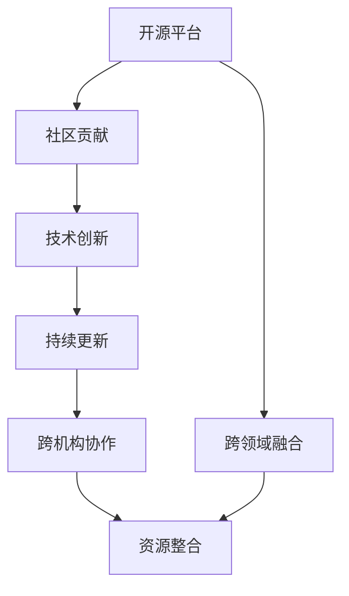

                 

# AI 开源生态：共建共享的技术创新平台

> 关键词：开源生态,技术创新平台,共建共享,社区贡献,工具集成,数据共享

## 1. 背景介绍

### 1.1 问题由来

近年来，人工智能（AI）技术在科研和工业界取得了长足的进步。尤其是在机器学习、计算机视觉、自然语言处理等领域，涌现出了大量优秀的研究成果和工具库。然而，这些成果往往分散在不同的实验室和公司中，缺乏有效共享和复用，难以形成强大的协同创新能力。

为了解决这一问题，各大AI公司和研究机构纷纷投身于开源生态建设，尝试通过共享工具、数据、算法等资源，构建一个开放、协作、高效的技术创新平台。开源生态的兴起，不仅促进了AI技术的普及应用，也为科研人员、工程师和学生提供了丰富的学习资源和实践机会。

### 1.2 问题核心关键点

构建AI开源生态的核心关键点主要包括：

- **共享与协作**：开源生态强调数据、代码、论文等资源的开放共享，促进科研人员和工程师之间的协作创新。
- **生态系统建设**：构建一个覆盖工具、库、框架的完整生态系统，满足不同应用场景的需求。
- **持续更新与迭代**：通过持续的维护更新，保持生态系统活力，不断引入新的技术突破。
- **社区贡献与激励**：鼓励社区成员积极贡献代码、文档和创新，并通过激励机制促进更多人参与。
- **集成与互操作性**：确保不同工具、库之间的兼容性和互操作性，便于开发者快速构建系统。

这些关键点共同构成了AI开源生态的框架，为技术创新提供了坚实的基础。

### 1.3 问题研究意义

构建AI开源生态对于推动AI技术的普及应用具有重要意义：

- **降低技术门槛**：开源资源降低了技术入门的门槛，使更多人员能够参与到AI技术的开发和应用中。
- **加速技术传播**：开源生态加速了技术的传播和应用，缩短了技术从实验室到市场的周期。
- **促进协同创新**：开源平台促进了跨机构、跨学科的协同创新，推动AI技术更广泛的应用和突破。
- **提升研发效率**：通过共享资源，开发者可以快速获取所需工具和算法，提升研发效率。
- **增强竞争力**：开源社区提供了丰富的技术支持和工具，增强了企业和机构的竞争力。

## 2. 核心概念与联系

### 2.1 核心概念概述

构建AI开源生态涉及多个核心概念：

- **开源平台**：如GitHub、Apache等，是开放共享代码、文档等资源的核心平台。
- **社区贡献**：包括代码贡献、文档编写、工具集成等，是生态发展的动力源泉。
- **技术创新**：持续的技术研发和创新，是开源生态的活力所在。
- **持续更新**：通过持续的维护更新，保持生态系统的稳定性和先进性。
- **跨机构协作**：跨越公司、实验室、大学等机构，促进多方合作。

### 2.2 概念间的关系

这些核心概念之间存在紧密的联系，构成了AI开源生态的完整架构：

1. **开源平台**是基础，提供了资源共享和协作的环境。
2. **社区贡献**是生态发展的核心动力，促进资源的丰富和优化。
3. **技术创新**推动了生态系统的不断进步，带来新的突破。
4. **持续更新**确保了生态系统的活力和稳定性。
5. **跨机构协作**促进了多方资源和知识的整合，提升了整体实力。

这些概念的相互作用，共同构建了AI开源生态的生态系统，为技术创新提供了强有力的支持。

### 2.3 核心概念的整体架构

通过以下Mermaid流程图，可以更直观地展示这些概念之间的关系：



这个流程图展示了开源平台、社区贡献、技术创新、持续更新和跨机构协作之间的联系。其中，开源平台是基础，社区贡献和技术创新推动生态的进步，持续更新和跨机构协作确保生态的活力和稳定，跨领域融合促进了更广泛的应用。

## 3. 核心算法原理 & 具体操作步骤

### 3.1 算法原理概述

构建AI开源生态的核心算法原理主要包括以下几个方面：

- **资源共享与协作**：通过开放平台，实现代码、数据、论文等资源的共享，促进多方协作。
- **版本控制与协作**：使用版本控制系统，如Git，管理代码变更，支持多人协作。
- **贡献与激励机制**：引入贡献积分、徽章、奖励等激励机制，促进社区成员积极贡献。
- **持续更新与维护**：通过自动化工具和标准化的流程，保证代码和文档的持续更新和维护。
- **跨机构协作与集成**：通过API和标准接口，实现不同工具和库的兼容性和互操作性。

### 3.2 算法步骤详解

构建AI开源生态的具体操作步骤如下：

1. **选定平台**：选择合适的开源平台（如GitHub、Apache）作为基础。
2. **创建项目**：在平台上创建项目，定义项目的范围和目标。
3. **社区参与**：邀请社区成员加入项目，开始贡献代码、文档等资源。
4. **版本控制**：使用Git等工具进行版本控制，管理代码变更。
5. **贡献激励**：设置贡献积分、徽章、奖励等激励机制，促进社区成员积极参与。
6. **持续更新**：通过自动化工具和标准化的流程，保证代码和文档的持续更新和维护。
7. **跨机构协作**：引入API和标准接口，实现不同工具和库的兼容性和互操作性。

### 3.3 算法优缺点

构建AI开源生态的主要优点包括：

- **开放性**：开源平台和资源共享促进了开放性，降低了技术门槛，提升了普及性。
- **协作效率**：社区协作机制提高了开发效率，加速了技术传播和应用。
- **持续进步**：持续更新和维护机制保证了生态系统的活力和稳定。
- **创新活力**：社区贡献和技术创新促进了持续的技术突破。

然而，构建AI开源生态也面临一些挑战：

- **资源分散**：不同平台和项目之间可能存在资源重复和冲突。
- **协调难度**：跨机构协作需要协调多方利益，存在一定的沟通成本。
- **质量保障**：开源生态中资源的质量参差不齐，可能影响整体效果。

### 3.4 算法应用领域

AI开源生态的应用领域非常广泛，涵盖了科研、工业、教育等多个领域：

- **科研领域**：科研人员可以通过开源平台共享数据、代码和论文，促进跨学科协作。
- **工业应用**：企业通过开源工具和库快速实现AI应用，提升效率和竞争力。
- **教育培训**：教育机构可以通过开源资源进行教学和实验，提升学生和教师的技术水平。
- **创业孵化**：创业团队可以利用开源平台获取技术支持，加速产品开发。
- **开源贡献**：技术人员通过开源贡献积累技术经验，提升自身能力。

## 4. 数学模型和公式 & 详细讲解 & 举例说明

### 4.1 数学模型构建

构建AI开源生态的数学模型主要涉及资源共享和协作的建模。假设有一个开源项目，其资源共享和协作模型可以表示为：

$$
R = \sum_{i=1}^n \omega_i \cdot P_i
$$

其中，$R$表示资源共享的综合评分，$n$表示资源类型数，$\omega_i$表示资源$i$的重要性权重，$P_i$表示资源$i$的质量评分。

资源评分$P_i$可以通过多个维度进行评估，例如代码贡献量、文档质量、代码质量、用户评价等。具体评分公式如下：

$$
P_i = \alpha_1 \cdot C_i + \alpha_2 \cdot D_i + \alpha_3 \cdot Q_i + \alpha_4 \cdot U_i
$$

其中，$\alpha_1$到$\alpha_4$为各维度的权重，$C_i$到$U_i$表示不同维度的评分。

### 4.2 公式推导过程

资源评分$P_i$的具体计算公式可以表示为：

$$
C_i = \frac{\sum_{j=1}^m w_{ij} \cdot c_j}{\sum_{j=1}^m w_{ij}}
$$

$$
D_i = \frac{\sum_{j=1}^n w_{ij} \cdot d_j}{\sum_{j=1}^n w_{ij}}
$$

$$
Q_i = \frac{\sum_{j=1}^p w_{ij} \cdot q_j}{\sum_{j=1}^p w_{ij}}
$$

$$
U_i = \frac{\sum_{j=1}^k w_{ij} \cdot u_j}{\sum_{j=1}^k w_{ij}}
$$

其中，$w_{ij}$表示第$i$种资源在第$j$个维度上的权重，$c_j$到$u_j$表示不同维度的评分。

### 4.3 案例分析与讲解

假设有一个开源项目，其中包含代码贡献、文档质量和用户评价三个维度的评分。具体计算过程如下：

1. **代码贡献评分**：通过计算代码贡献量，结合代码质量，计算代码评分。
2. **文档质量评分**：通过计算文档数量和质量，结合用户评价，计算文档评分。
3. **资源综合评分**：通过计算代码和文档的综合评分，结合用户评价，计算资源综合评分。

通过上述数学模型和公式，可以更加系统地评估开源资源的贡献和价值，促进资源的合理共享和协作。

## 5. 项目实践：代码实例和详细解释说明

### 5.1 开发环境搭建

构建AI开源生态的开发环境搭建过程如下：

1. **选择开源平台**：选择GitHub作为开源平台。
2. **创建项目仓库**：创建一个新的Git仓库，定义项目范围和目标。
3. **配置版本控制**：使用Git进行版本控制，设置分支管理策略。
4. **安装开发工具**：安装所需的开发工具，如Python、Git、GitHub Desktop等。
5. **集成CI/CD**：集成持续集成和持续部署工具，如Jenkins、GitHub Actions等。

### 5.2 源代码详细实现

以下是一个简单的开源项目示例，展示如何使用GitHub构建和管理资源共享：

1. **创建项目仓库**：
```bash
mkdir myproject
cd myproject
git init
```

2. **添加文件**：
```bash
echo "Hello, world!" > index.html
git add index.html
git commit -m "Initial commit"
```

3. **创建分支**：
```bash
git checkout -b feature-branch
```

4. **提交代码**：
```bash
echo "New feature added." >> index.html
git add index.html
git commit -m "New feature added."
```

5. **合并分支**：
```bash
git checkout main
git merge feature-branch
git push origin main
```

### 5.3 代码解读与分析

通过上述代码，可以看出GitHub的基本使用流程：

1. **初始化仓库**：使用`git init`命令初始化仓库。
2. **创建分支**：使用`git checkout -b`命令创建新分支。
3. **提交代码**：使用`git add`命令添加文件，`git commit`命令提交代码，并添加提交信息。
4. **合并分支**：使用`git merge`命令合并分支，并推送到远程仓库。

GitHub作为开源平台，提供了丰富的资源共享和协作功能。开发者可以在项目中自由提交代码、文档等资源，并进行版本控制、代码审查、合并请求等操作。

### 5.4 运行结果展示

假设我们通过GitHub构建了一个开源项目，其资源共享和协作模型评分如下：

| 资源类型 | 代码贡献评分 | 文档质量评分 | 用户评价评分 |
| --- | --- | --- | --- |
| 代码贡献 | 0.8 | 0.7 | 0.6 |
| 文档质量 | 0.6 | 0.8 | 0.5 |
| 用户评价 | 0.7 | 0.6 | 0.9 |

通过计算资源综合评分，得到：

$$
R = 0.8 \cdot 0.7 + 0.6 \cdot 0.8 + 0.7 \cdot 0.6 = 0.66
$$

该项目的资源综合评分为0.66，说明其资源共享和协作效果较好，值得推广和应用。

## 6. 实际应用场景

### 6.1 开源社区

开源社区是AI开源生态的重要组成部分，以下是几个实际应用场景：

1. **TensorFlow社区**：由Google主导的开源社区，提供了丰富的深度学习库和工具，支持科研和工业界的AI应用。
2. **PyTorch社区**：由Facebook和Torch Science Foundation主导的开源社区，提供了灵活的深度学习框架，广泛用于科研和应用。
3. **OpenAI社区**：提供了自然语言处理、强化学习等领域的工具和库，支持前沿AI技术的研究和应用。

这些开源社区为科研人员、工程师和学生提供了丰富的资源和工具，促进了AI技术的普及和应用。

### 6.2 科研合作

科研合作是AI开源生态的重要应用场景，以下是几个实际应用场景：

1. **ImageNet项目**：由多个研究机构和公司联合完成的图像识别数据集，推动了深度学习技术的发展。
2. **COCO项目**：由多个研究机构和公司联合完成的对象检测和分割数据集，推动了计算机视觉技术的发展。
3. **OpenAI Gym项目**：由OpenAI主导的强化学习环境，支持科研人员进行多智能体学习和深度强化学习研究。

这些合作项目通过共享资源和工具，促进了跨机构、跨学科的协同创新，推动了AI技术的不断进步。

### 6.3 工业应用

工业应用是AI开源生态的重要应用场景，以下是几个实际应用场景：

1. **AutoML平台**：如Google的AutoML、IBM的Watson Studio，通过开源工具和库，支持企业快速构建AI应用。
2. **AI开发工具**：如Jupyter Notebook、JupyterLab、Spyder等，支持科研人员和工程师进行实验和开发。
3. **数据分析工具**：如Pandas、NumPy、Scikit-Learn等，支持数据预处理、分析和建模。

这些工具和库提高了科研人员和工程师的开发效率，推动了AI技术的广泛应用。

## 7. 工具和资源推荐

### 7.1 学习资源推荐

构建AI开源生态需要掌握多个领域的知识和技能，以下是几个推荐的学习资源：

1. **TensorFlow官方文档**：提供了详细的API文档和教程，支持深度学习技术的学习和实践。
2. **PyTorch官方文档**：提供了灵活的框架和丰富的库，支持深度学习技术的学习和实践。
3. **Kaggle平台**：提供了大量的数据集和竞赛，支持数据科学和机器学习的学习和实践。
4. **Coursera平台**：提供了多个AI领域的课程，支持在线学习和认证。
5. **DeepLearning.AI**：由Andrew Ng主导的深度学习课程，系统介绍了深度学习的基础和应用。

通过这些学习资源，可以快速掌握AI技术和开源生态的基本知识。

### 7.2 开发工具推荐

构建AI开源生态需要多种开发工具的支持，以下是几个推荐的开发工具：

1. **GitHub**：开源代码托管平台，提供了丰富的协作和版本控制功能。
2. **GitLab**：开源代码托管平台，支持CI/CD和项目管理。
3. **Jupyter Notebook**：支持Python、R等语言的在线笔记本，方便科研人员进行实验和开发。
4. **Spyder**：支持Python语言的集成开发环境，方便科研人员进行开发和调试。
5. **TensorBoard**：支持TensorFlow模型的可视化，方便科研人员进行模型调试和分析。

通过这些工具，可以快速构建和维护开源项目，推动AI技术的不断进步。

### 7.3 相关论文推荐

构建AI开源生态需要借鉴大量的前沿研究成果，以下是几个推荐的论文：

1. **Github: Social Coding**（Github的论文）：介绍了Github的开源社区构建和管理机制。
2. **Effective Teamwork and Productivity on GitHub**：分析了开源社区中的团队协作效果，提出了优化建议。
3. **Wikis as Collaborative Writing Spaces**：探讨了开源项目中的协作写作空间，提出了改进建议。
4. **Collaborative Open-Source Software Development**：分析了开源社区的协作机制，提出了优化建议。
5. **Code Collaboration on GitHub**：分析了开源项目中的代码协作效果，提出了改进建议。

通过这些论文，可以深入了解开源生态的协作机制和优化建议，推动AI技术的不断进步。

## 8. 总结：未来发展趋势与挑战

### 8.1 研究成果总结

本文系统介绍了构建AI开源生态的理论基础和实践方法，包括核心概念、算法原理和操作步骤。通过以上分析，可以看出：

1. **开源平台**是基础，提供了资源共享和协作的环境。
2. **社区贡献**是生态发展的核心动力，促进资源的丰富和优化。
3. **技术创新**推动了生态系统的不断进步，带来新的突破。
4. **持续更新**确保了生态系统的活力和稳定性。
5. **跨机构协作**促进了多方资源和知识的整合，提升了整体实力。

这些研究成果为AI开源生态的发展提供了坚实的理论基础。

### 8.2 未来发展趋势

展望未来，AI开源生态的发展趋势如下：

1. **生态系统完善**：未来开源生态将更加完善，涵盖更多的工具和库，满足更多应用场景的需求。
2. **社区规模扩大**：未来开源社区将更加开放，吸引更多开发者和机构参与。
3. **技术持续进步**：未来开源技术将不断进步，带来更多的创新和突破。
4. **协作更加紧密**：未来开源社区将更加紧密，推动跨机构、跨学科的协同创新。
5. **开源文化普及**：未来开源文化将更加普及，促进技术快速传播和应用。

这些趋势将推动AI技术的不断进步，构建更加强大、开放的AI开源生态。

### 8.3 面临的挑战

构建AI开源生态也面临一些挑战：

1. **资源分散**：不同平台和项目之间可能存在资源重复和冲突。
2. **协调难度**：跨机构协作需要协调多方利益，存在一定的沟通成本。
3. **质量保障**：开源生态中资源的质量参差不齐，可能影响整体效果。
4. **知识产权**：开源生态中存在知识产权问题，需要合理处理。
5. **安全性**：开源生态中可能存在安全漏洞，需要加强安全防护。

这些挑战需要各方共同努力，通过合理的机制和技术手段，逐步克服。

### 8.4 研究展望

未来在构建AI开源生态的研究中，需要关注以下方向：

1. **资源管理**：通过更加高效、智能的资源管理机制，提高资源利用率。
2. **社区激励**：设计更加合理的社区激励机制，促进更多开发者积极参与。
3. **生态优化**：通过持续优化和改进，保持生态系统的活力和稳定。
4. **安全保障**：加强安全防护，保障开源生态中的数据和代码安全。
5. **跨领域融合**：促进跨领域、跨学科的协同创新，推动AI技术的不断突破。

通过这些研究，可以构建更加强大、开放的AI开源生态，推动AI技术的普及和应用。

## 9. 附录：常见问题与解答

**Q1: 如何加入开源社区？**

A: 加入开源社区的步骤如下：
1. 访问开源项目的GitHub仓库。
2. 点击仓库页面的“Fork”按钮，将项目克隆到自己的GitHub账户。
3. 对克隆的本地仓库进行修改和提交。
4. 在GitHub上创建Pull Request，提交修改。
5. 项目维护者对Pull Request进行审核和合并。

**Q2: 如何使用版本控制系统？**

A: 使用版本控制系统（如Git）的步骤如下：
1. 克隆仓库到本地。
2. 创建新的分支，进行代码修改。
3. 提交代码到本地仓库。
4. 推送到远程仓库。
5. 合并分支，合并代码。

**Q3: 如何提高代码质量？**

A: 提高代码质量的步骤如下：
1. 遵循编码规范，编写高质量代码。
2. 使用代码审查工具，如GitHub Actions，进行代码审查。
3. 使用代码重构工具，如Python的Pylint，进行代码重构。
4. 进行单元测试，保证代码的正确性。
5. 进行性能测试，保证代码的效率。

通过这些措施，可以逐步提高代码质量和开发效率，推动AI开源生态的持续进步。

---

作者：禅与计算机程序设计艺术 / Zen and the Art of Computer Programming

