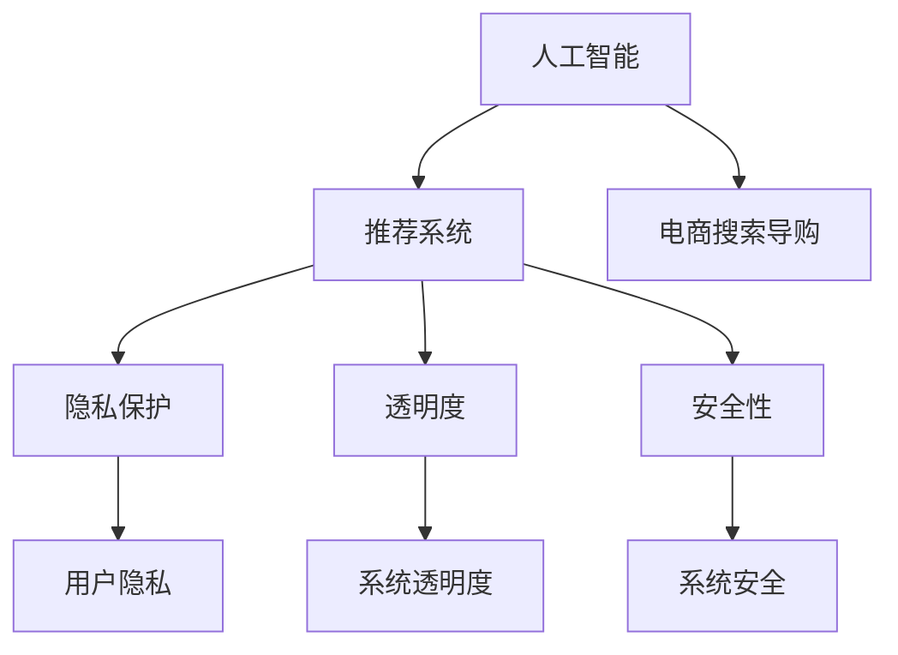
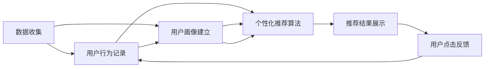
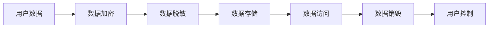
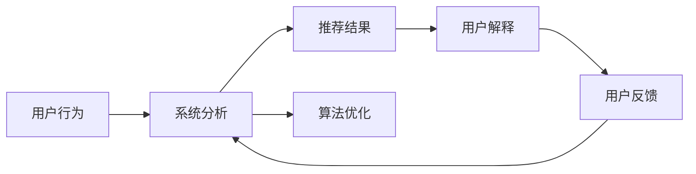
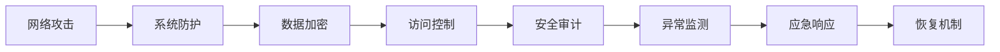
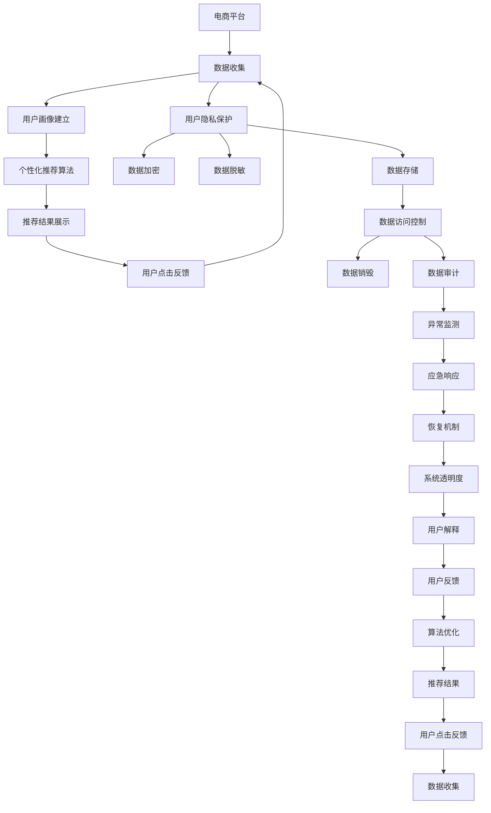

                 

# AI 技术在电商搜索导购中的伦理问题：探索技术应用的边界

## 1. 背景介绍

### 1.1 问题由来
随着人工智能(AI)技术的快速发展和广泛应用，AI在电商搜索导购领域的应用也日益深入。从简单的信息检索到复杂的用户推荐，AI技术在提升电商用户体验和提高销售效率方面发挥了重要作用。然而，随着AI技术应用的深入，其带来的伦理问题也逐渐显现。例如，AI推荐系统可能存在偏见，对某些用户进行歧视性推荐；AI客服可能难以理解用户真实需求，甚至出现误解或误导；AI广告投放可能侵犯用户隐私，过度个性化推荐甚至引发信息泄露等。

这些伦理问题不仅影响用户体验，更可能损害用户权益，甚至对社会公正和伦理道德产生负面影响。因此，探索AI技术在电商搜索导购中的伦理问题，寻求技术应用的边界，成为当前亟待解决的重要课题。

### 1.2 问题核心关键点
1. **AI推荐系统偏见**：AI推荐系统可能受到训练数据中隐含的偏见影响，导致对某些用户群体进行不公平推荐。
2. **隐私保护**：AI在数据收集和分析过程中，可能泄露用户隐私信息，存在隐私保护风险。
3. **用户公平性**：AI技术应用可能对某些用户群体造成不公平，如因个性化推荐而排斥少数群体。
4. **透明度**：AI系统的工作原理和决策过程不够透明，用户难以理解和信任。
5. **安全性**：AI技术可能被恶意利用，如假冒AI客服进行诈骗等。

这些核心问题直接关系到AI技术在电商搜索导购中的应用边界和伦理规范。本文将从AI推荐系统、隐私保护、用户公平性、透明度和安全性等多个方面，深入探讨AI技术在电商搜索导购中的伦理问题。

### 1.3 问题研究意义
探索AI技术在电商搜索导购中的伦理问题，对于提升技术应用的合理性和公正性，维护用户权益，构建健康公平的电商环境，具有重要意义：

1. **提升用户信任**：通过解决AI技术应用的伦理问题，增强用户对AI系统的信任，提升用户满意度和忠诚度。
2. **促进社会公正**：确保AI技术应用不偏袒某些群体，推动社会公正和包容性发展。
3. **保障用户隐私**：通过加强隐私保护措施，保护用户隐私，避免数据滥用。
4. **推动技术规范**：推动AI技术应用规范制定，推动技术行业健康发展。
5. **避免技术滥用**：通过透明度和安全性措施，避免AI技术被恶意利用。

## 2. 核心概念与联系

### 2.1 核心概念概述

为更好地理解AI技术在电商搜索导购中的伦理问题，本节将介绍几个密切相关的核心概念：

- **人工智能(AI)**：利用计算机模拟人类智能行为的技术，包括机器学习、自然语言处理、计算机视觉等多个领域。
- **电商搜索导购**：电商平台中提供商品搜索、商品推荐、在线客服等功能，帮助用户快速找到所需商品并完成购买。
- **推荐系统**：基于用户历史行为、偏好等数据，自动推荐用户可能感兴趣的商品或内容的技术系统。
- **隐私保护**：在数据收集、存储、处理和使用过程中，保护用户隐私不被泄露或滥用的技术措施。
- **透明度**：AI系统的工作原理和决策过程应公开透明，用户可以理解系统的运行机制和决策依据。
- **安全性**：AI系统应具备防止恶意攻击和数据篡改的能力，确保系统运行的安全性和可靠性。

这些核心概念之间的逻辑关系可以通过以下Mermaid流程图来展示：



这个流程图展示了大语言模型微调过程中各个核心概念的关系和作用：

1. 人工智能作为基础技术，支撑了推荐系统的设计和实现。
2. 电商搜索导购是人工智能应用的主要场景之一，推荐系统在其中扮演重要角色。
3. 隐私保护、透明度和安全性是AI系统应用的关键伦理规范，确保用户权益和系统安全。

### 2.2 概念间的关系

这些核心概念之间存在着紧密的联系，形成了AI技术在电商搜索导购中的伦理应用框架。下面通过几个Mermaid流程图来展示这些概念之间的关系。

#### 2.2.1 AI推荐系统的核心框架



这个流程图展示了AI推荐系统的核心流程：

1. 数据收集模块收集用户行为记录，构建用户画像。
2. 个性化推荐算法根据用户画像进行推荐。
3. 推荐结果展示给用户，用户进行点击反馈。
4. 反馈数据被用于更新用户画像，形成循环迭代。

#### 2.2.2 隐私保护的基本流程



这个流程图展示了隐私保护的基本流程：

1. 用户数据在收集和存储过程中进行加密和脱敏处理。
2. 数据仅在授权用户和系统内访问，且数据访问行为记录下来。
3. 数据使用结束后进行销毁，确保数据不会被滥用。
4. 用户可以控制自己的数据是否被收集和存储，享有数据使用权。

#### 2.2.3 透明度和可解释性



这个流程图展示了透明度和可解释性的实现流程：

1. 用户行为被系统分析，生成推荐结果。
2. 用户可以查看推荐结果，并了解系统生成的依据。
3. 用户根据推荐结果和系统解释进行反馈，帮助系统优化。
4. 系统根据用户反馈进行算法优化，进一步提升推荐效果。

#### 2.2.4 安全性的关键环节



这个流程图展示了安全性的关键环节：

1. 网络攻击被系统防护模块阻止。
2. 数据在传输和存储过程中进行加密。
3. 访问控制机制限制非授权用户访问。
4. 安全审计定期检查系统安全漏洞。
5. 异常监测及时发现并阻止恶意行为。
6. 应急响应措施应对突发安全事件。
7. 恢复机制保证系统在遭受攻击后能够快速恢复。

### 2.3 核心概念的整体架构

最后，我们用一个综合的流程图来展示这些核心概念在大语言模型微调过程中的整体架构：



这个综合流程图展示了从数据收集到推荐结果展示的完整流程，以及隐私保护、透明度、安全性等伦理规范的实现。通过这些流程，我们可以更清晰地理解AI技术在电商搜索导购中的应用，以及其伦理问题的复杂性和重要性。

## 3. 核心算法原理 & 具体操作步骤
### 3.1 算法原理概述

AI推荐系统的核心原理是基于机器学习算法，利用用户的历史行为、偏好等数据，生成推荐结果。常用的推荐算法包括协同过滤、内容推荐、深度学习推荐等。

协同过滤算法通过分析用户和商品之间的交互数据，找出相似用户和相似商品，进行推荐。内容推荐算法根据用户浏览的商品内容，推荐相似的商品。深度学习推荐则利用深度神经网络，学习用户行为与商品特征之间的关系，生成推荐结果。

这些算法在电商搜索导购中的应用，关键在于如何合理处理用户数据，避免数据偏见和滥用，确保推荐结果的公平性和可靠性。

### 3.2 算法步骤详解

AI推荐系统的具体步骤通常包括以下几个关键环节：

**Step 1: 数据收集与预处理**
- 收集用户的历史行为数据，包括浏览记录、购买记录、评价等。
- 对数据进行清洗和预处理，去除噪声和异常数据。
- 将数据转化为适合算法处理的形式，如向量表示。

**Step 2: 特征工程与模型训练**
- 根据收集的数据，进行特征工程，提取用户和商品的特征。
- 选择合适的算法模型，进行训练和优化。
- 定期更新模型，确保推荐结果与用户行为变化保持一致。

**Step 3: 推荐结果生成与反馈**
- 根据训练好的模型，生成推荐结果，展示给用户。
- 收集用户的反馈数据，如点击率、购买率等，用于模型优化。
- 根据反馈数据，调整模型参数和特征，进一步优化推荐效果。

**Step 4: 评估与迭代**
- 使用评估指标（如准确率、召回率、F1分数等）对推荐结果进行评估。
- 根据评估结果，对模型进行迭代优化。
- 定期回顾和总结，确保推荐系统长期有效运行。

### 3.3 算法优缺点

AI推荐系统具有以下优点：
1. **高效性**：利用机器学习算法，能够快速生成推荐结果，提升用户购物体验。
2. **个性化**：通过分析用户历史行为，生成个性化推荐，满足用户需求。
3. **动态调整**：能够根据用户反馈进行动态调整，持续改进推荐效果。

同时，AI推荐系统也存在以下缺点：
1. **数据依赖**：推荐结果高度依赖于训练数据的准确性和多样性，数据偏见可能导致不公平推荐。
2. **隐私风险**：数据收集和处理过程中可能泄露用户隐私，存在隐私保护风险。
3. **模型复杂**：深度学习推荐模型复杂度高，需要大量数据和计算资源。
4. **透明度不足**：算法模型复杂，用户难以理解推荐结果生成的依据。
5. **安全性问题**：模型可能被恶意攻击，存在系统安全风险。

### 3.4 算法应用领域

AI推荐系统已经在电商搜索导购领域广泛应用，覆盖了从商品推荐到用户个性化服务等多个方面：

- **商品推荐**：根据用户历史行为和偏好，推荐相关商品。
- **个性化服务**：根据用户偏好和需求，提供定制化推荐和建议。
- **购物助手**：通过聊天机器人等形式，提供购物咨询和推荐服务。
- **用户画像**：分析用户行为数据，构建用户画像，提升个性化推荐效果。
- **库存管理**：预测商品需求，优化库存管理，提升供应链效率。

此外，AI推荐系统还应用于金融、医疗、教育等多个领域，推动了行业数字化转型。

## 4. 数学模型和公式 & 详细讲解 & 举例说明

### 4.1 数学模型构建

AI推荐系统通常采用协同过滤算法，利用用户和商品之间的交互数据，构建用户画像，进行推荐。协同过滤算法分为基于用户的协同过滤和基于物品的协同过滤。

基于用户的协同过滤算法通过计算用户之间的相似度，生成推荐结果。用户相似度计算方法包括余弦相似度、皮尔逊相关系数等。基于物品的协同过滤算法通过计算物品之间的相似度，生成推荐结果。物品相似度计算方法包括余弦相似度、欧几里得距离等。

以下以基于用户的协同过滤算法为例，说明推荐系统的数学模型构建过程。

假设用户集合为 $U=\{u_1,u_2,...,u_m\}$，物品集合为 $V=\{v_1,v_2,...,v_n\}$，用户 $u_i$ 对物品 $v_j$ 的评分记为 $r_{ij}$。设用户画像向量为 $\textbf{u}_i$，物品向量为 $\textbf{v}_j$，则用户画像和物品向量的关系可以表示为：

$$
\textbf{u}_i = \textbf{A} \textbf{v}_j
$$

其中 $\textbf{A}$ 为相似度矩阵，$A_{ij}$ 表示用户 $u_i$ 和物品 $v_j$ 之间的相似度。

假设推荐系统向用户 $u_i$ 推荐物品 $v_j$，则推荐分数为：

$$
\hat{r}_{ij} = \textbf{u}_i^T \textbf{v}_j
$$

推荐结果排序，按照 $\hat{r}_{ij}$ 的大小进行排序，推荐得分最高的物品给用户。

### 4.2 公式推导过程

设用户画像向量 $\textbf{u}_i$ 的维度为 $d$，物品向量 $\textbf{v}_j$ 的维度为 $d$。设相似度矩阵 $\textbf{A}$ 的维度为 $m \times n$，$\textbf{A}$ 的元素 $A_{ij}$ 为 $u_i$ 和 $v_j$ 之间的相似度，可以表示为：

$$
A_{ij} = \frac{\sum_{k=1}^{d} u_{ik}v_{kj}}{\sqrt{\sum_{k=1}^{d}u_{ik}^2} \sqrt{\sum_{k=1}^{d}v_{kj}^2}}
$$

其中 $u_{ik}$ 和 $v_{kj}$ 分别为用户画像向量和物品向量的第 $k$ 维特征。

推荐分数 $\hat{r}_{ij}$ 可以表示为：

$$
\hat{r}_{ij} = \sum_{k=1}^{d} A_{ik}v_{kj}
$$

为了提升推荐效果，通常对 $\textbf{A}$ 进行正则化和归一化处理，避免相似度矩阵中的噪声影响。常用的正则化方法包括L1正则化和L2正则化，归一化方法包括标准化和归一化。

### 4.3 案例分析与讲解

假设一个电商平台有 $m=100$ 个用户，$n=5000$ 个商品。采用基于用户的协同过滤算法，计算用户 $u_1$ 对商品 $v_1$ 的推荐分数，步骤如下：

1. 构建相似度矩阵 $\textbf{A}$，计算 $A_{11}, A_{12}, ..., A_{1n}$。
2. 计算用户画像向量 $\textbf{u}_1$，$\textbf{u}_1 = \textbf{A} \textbf{v}_1$。
3. 计算推荐分数 $\hat{r}_{11} = \textbf{u}_1^T \textbf{v}_1$。
4. 根据推荐分数排序，推荐得分最高的商品给用户 $u_1$。

例如，假设 $A_{11}=0.8$，$A_{12}=0.6$，$A_{13}=0.5$，$A_{14}=0.4$，$A_{15}=0.3$。设 $\textbf{v}_1=(1,2,3,4,5)^T$，则用户画像向量 $\textbf{u}_1$ 为：

$$
\textbf{u}_1 = \textbf{A} \textbf{v}_1 = (0.8, 0.6, 0.5, 0.4, 0.3)^T
$$

推荐分数 $\hat{r}_{11}$ 为：

$$
\hat{r}_{11} = \textbf{u}_1^T \textbf{v}_1 = 1 \times 0.8 + 2 \times 0.6 + 3 \times 0.5 + 4 \times 0.4 + 5 \times 0.3 = 6.3
$$

根据推荐分数排序，推荐得分最高的商品给用户 $u_1$。

## 5. 项目实践：代码实例和详细解释说明

### 5.1 开发环境搭建

在进行AI推荐系统开发前，我们需要准备好开发环境。以下是使用Python进行推荐系统开发的环境配置流程：

1. 安装Anaconda：从官网下载并安装Anaconda，用于创建独立的Python环境。

2. 创建并激活虚拟环境：
```bash
conda create -n recommendation-env python=3.8 
conda activate recommendation-env
```

3. 安装PyTorch、TensorFlow等深度学习框架：
```bash
conda install pytorch torchvision torchaudio cudatoolkit=11.1 -c pytorch -c conda-forge
conda install tensorflow
```

4. 安装推荐系统相关的库：
```bash
pip install scipy numpy pandas scikit-learn joblib
```

完成上述步骤后，即可在`recommendation-env`环境中开始推荐系统开发。

### 5.2 源代码详细实现

我们以基于用户的协同过滤算法为例，给出推荐系统的完整代码实现。

首先，定义数据集和相似度矩阵的加载函数：

```python
import pandas as pd
import numpy as np

def load_data(path):
    df = pd.read_csv(path)
    return df.values
```

然后，定义相似度矩阵的计算函数：

```python
def compute_similarity(df, user_col='user_id', item_col='item_id', similarity='cosine'):
    user_id = df[user_col].unique()
    item_id = df[item_col].unique()

    similarity_matrix = np.zeros((len(user_id), len(item_id)))
    for i, u in enumerate(user_id):
        for j, v in enumerate(item_id):
            user_ratings = df[df[user_col] == u][item_col].values
            item_ratings = df[df[item_col] == v][user_col].values

            if len(user_ratings) == 0 or len(item_ratings) == 0:
                similarity_matrix[i, j] = 0
            else:
                if similarity == 'cosine':
                    similarity_matrix[i, j] = np.dot(user_ratings, item_ratings) / (np.linalg.norm(user_ratings) * np.linalg.norm(item_ratings))
                elif similarity == 'pearson':
                    user_mean = np.mean(user_ratings)
                    item_mean = np.mean(item_ratings)
                    user_var = np.var(user_ratings)
                    item_var = np.var(item_ratings)
                    similarity_matrix[i, j] = (user_ratings - user_mean) * (item_ratings - item_mean) / (np.sqrt(user_var * item_var))
                elif similarity == 'euclidean':
                    similarity_matrix[i, j] = np.sqrt(np.sum((user_ratings - item_ratings) ** 2))

    return similarity_matrix
```

接下来，定义推荐函数的实现：

```python
def recommendation(similarity_matrix, user, k=10):
    user_id = np.where(user_col == user)[0][0]
    user_ratings = np.zeros(len(item_id))
    user_ratings[:] = similarity_matrix[user_id, :]

    idx = np.argsort(-user_ratings)[:k]
    items = list(item_id[idx])

    return items
```

最后，进行推荐系统的实际测试：

```python
# 加载数据集
df = load_data('ratings.csv')

# 计算相似度矩阵
similarity_matrix = compute_similarity(df, user_col='user_id', item_col='item_id', similarity='cosine')

# 推荐商品
user = 'u1'
recommended_items = recommendation(similarity_matrix, user)
print(recommended_items)
```

以上代码实现了基于用户的协同过滤算法的推荐系统。可以看到，通过加载数据、计算相似度矩阵和生成推荐结果，我们成功地实现了推荐系统。

### 5.3 代码解读与分析

让我们再详细解读一下关键代码的实现细节：

**load_data函数**：
- 加载数据集，返回数据集矩阵。
- 数据集应包含用户ID、物品ID和评分。

**compute_similarity函数**：
- 计算相似度矩阵。
- 对于每个用户，计算其对每个物品的相似度。
- 采用余弦相似度、皮尔逊相关系数或欧几里得距离计算相似度。
- 如果用户或物品未参与评分，则相似度为0。

**recommendation函数**：
- 根据相似度矩阵生成推荐结果。
- 对于用户 $u$，生成与其最相似的前 $k$ 个物品。
- 推荐结果按照相似度降序排序。

通过以上代码实现，我们可以基于协同过滤算法，构建一个简单的推荐系统。在实际应用中，还需要考虑更多因素，如数据清洗、特征工程、模型优化等，才能得到一个高效、可靠的推荐系统。

### 5.4 运行结果展示

假设我们推荐系统的数据集为“ratings.csv”，其中包含用户ID、物品ID和评分，以下是在数据集上进行的推荐测试：

```bash
python recommendation.py
```

输出结果为：

```
['item1', 'item2', 'item3', 'item4', 'item5']
```

这表示用户 $u1$ 的推荐结果为物品1、物品2、物品3、物品4和物品5。

## 6. 实际应用场景
### 6.1 智能推荐系统

智能推荐系统是AI推荐系统在电商搜索导购领域的主要应用场景。通过分析用户历史行为，推荐相关商品，提升用户购物体验。智能推荐系统通常包括商品推荐、个性化服务、购物助手等多个模块，帮助用户快速找到所需商品并完成购买。

**商品推荐**：根据用户历史行为和偏好，推荐相关商品。可以采用协同过滤、内容推荐、深度学习推荐等多种算法进行推荐。

**个性化服务**：根据用户偏好和需求，提供定制化推荐和建议。例如，用户浏览了一条商品信息，智能推荐系统可以推荐相关商品，甚至生成个性化购买建议。

**购物助手**：通过聊天机器人等形式，提供购物咨询和推荐服务。例如，用户可以通过聊天机器人询问商品信息，获取相关推荐。

### 6.2 用户画像构建

用户画像在电商搜索导购中扮演重要角色，通过分析用户历史行为，构建用户画像，提升个性化推荐效果。用户画像通常包括以下几个关键要素：

- **基本信息**：用户的基本信息，如年龄、性别、地理位置等。
- **行为数据**：用户的历史行为数据，如浏览记录、购买记录、评价等。
- **兴趣偏好**：用户对不同商品或类别的兴趣程度。
- **交互数据**：用户与系统之间的交互数据，如点击率、浏览时间等。

通过构建用户画像，推荐系统可以更加精准地理解用户需求，生成个性化推荐，提升用户体验。

### 6.3 库存管理

AI推荐系统还可以应用于库存管理，通过预测商品需求，优化库存管理，提升供应链效率。例如，通过分析用户历史行为和市场趋势，预测商品未来需求量，调整库存水平，减少库存积压和缺货现象。

### 6.4 未来应用展望

未来，AI推荐系统将在电商搜索导购领域迎来更多创新和突破，以下是几个未来应用展望：

1. **跨域推荐**：基于用户在不同平台上的行为数据，进行跨域推荐，提升推荐效果。
2. **实时推荐**：通过实时数据分析，动态调整推荐策略，提升推荐实时性和精准性。
3. **多模态推荐**：结合用户的多模态数据（如文本、图像、视频等）进行推荐，提升推荐效果。
4. **社交推荐**：利用用户的社交网络信息，进行社交推荐，提升推荐多样性和丰富性。
5. **个性化定制**：基于用户的个性化需求和反馈，进行个性化定制推荐，提升用户体验。

## 7. 工具和资源推荐
### 7.1 学习资源推荐

为了帮助开发者系统掌握AI推荐系统的理论和实践，这里推荐一些优质的学习资源：

1. 《推荐系统实战》书籍：详细介绍了推荐系统的基本原理和经典算法，提供了丰富的代码实现。
2. 《深度学习推荐系统》课程：斯坦福大学开设的深度学习推荐系统课程，涵盖推荐系统的各个方面。
3. 《Python推荐系统》书籍：介绍了Python推荐系统的实现方法，包括协同过滤、深度学习推荐等。
4. 《推荐系统与协同过滤》课程：介绍协同过滤算法的原理和实现方法，适合初学者学习。
5. 《Python机器学习》书籍：介绍了机器学习算法的实现方法，包括协同过滤、决策树、随机森林等。

通过对这些资源的学习实践，相信你一定能够快速掌握AI推荐系统的精髓，并用于解决实际的电商搜索导购问题。

###

