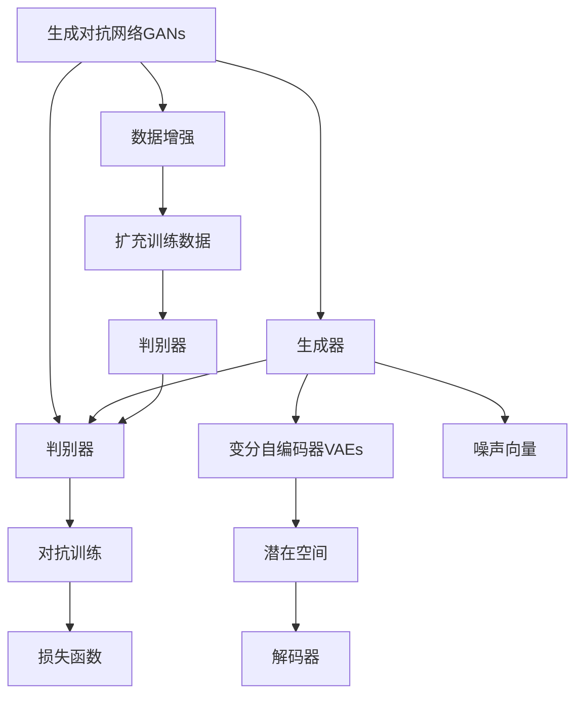
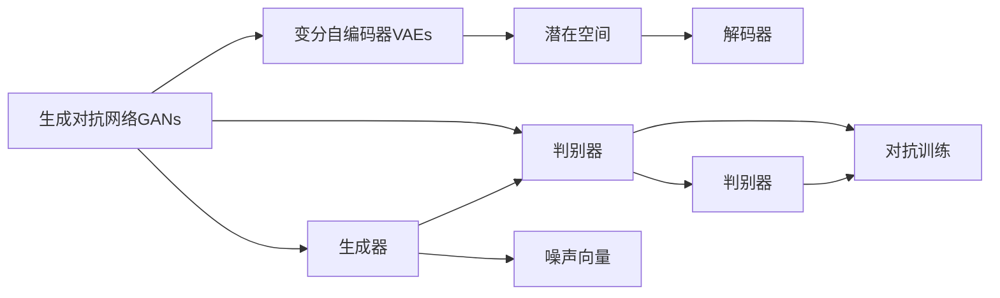
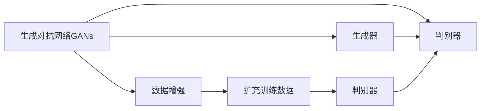
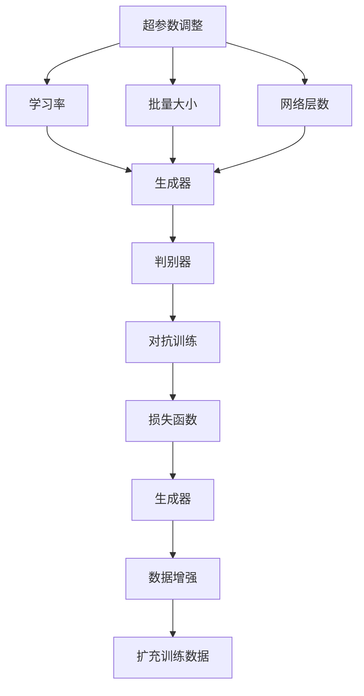
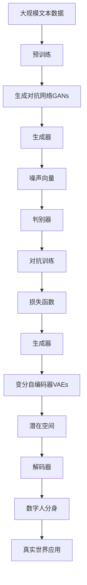

                 

# AIGC从入门到实战：天工人巧日争新：生成你的数字人分身

## 1. 背景介绍

### 1.1 问题由来
随着人工智能技术的不断进步，生成对抗网络(Generative Adversarial Networks, GANs) 和 人工智能生成内容（AIGC）技术开始兴起。这些技术能够根据输入数据生成逼真的数字人分身（Digital Human Avatars），为娱乐、教育、医疗、商业等领域带来了颠覆性变化。

在社交媒体、在线广告、虚拟现实等应用中，数字人分身可以自动化生成内容，节省人力成本；在教育、医疗领域，数字人分身可以作为虚拟教师、咨询助手等，辅助人类完成某些任务；在商业领域，数字人分身可以作为销售顾问、品牌代言人等，提升用户体验。

同时，数字人分身还能在隐私保护、虚拟交互等方面带来新的应用。数字人分身可以为用户提供匿名身份，保护用户隐私，同时在虚拟世界里与人类进行交互，提供沉浸式体验。

因此，数字人分身成为了AIGC领域的热点话题，推动了人工智能技术的发展和应用。

### 1.2 问题核心关键点
数字人分身的生成通常基于生成对抗网络（GANs）和变分自编码器（VAEs）等模型，这些模型通过生成器和判别器两个网络的对抗训练，不断提升生成质量。

核心问题在于如何设计生成器和判别器的网络结构、损失函数等，以及如何优化超参数、调整模型参数，才能生成高质量的数字人分身。

## 2. 核心概念与联系

### 2.1 核心概念概述

为更好地理解数字人分身的生成过程，本节将介绍几个密切相关的核心概念：

- 生成对抗网络（GANs）：由两个网络组成：生成器和判别器。生成器接收噪声向量，生成逼真数据；判别器区分生成数据和真实数据。两者对抗训练，不断提升生成质量。

- 变分自编码器（VAEs）：包含一个编码器和解码器。编码器将数据映射到潜在空间，解码器将潜在空间映射回数据空间。VAEs能够学习数据的分布，生成新的数据。

- 损失函数：用于衡量生成器和判别器之间对抗效果。通常包括交叉熵损失、L1、L2范数损失等。

- 超参数调整：GANs和VAEs在训练过程中有多个超参数需要调整，如学习率、批量大小、网络层数等。通过交叉验证等方法，选择最优的超参数组合。

- 数据增强：通过数据增强技术，扩充训练数据，提高模型泛化能力。常用的方法包括旋转、平移、缩放、翻转等。

- 对抗样本：通过对抗训练，生成器能生成更加逼真的数据，同时判别器能更好地区分生成数据和真实数据。

这些核心概念之间的逻辑关系可以通过以下Mermaid流程图来展示：



这个流程图展示了大模型微调的各个核心概念及其之间的关系：

1. 生成对抗网络GANs由生成器和判别器组成。
2. 生成器接收噪声向量，生成逼真数据；判别器区分生成数据和真实数据。
3. 变分自编码器VAEs将数据映射到潜在空间，生成新的数据。
4. 损失函数衡量生成器和判别器之间的对抗效果。
5. 超参数调整保证模型训练的顺利进行。
6. 数据增强扩充训练数据，提高模型泛化能力。
7. 对抗样本进一步提升生成器的生成质量。

### 2.2 概念间的关系

这些核心概念之间存在着紧密的联系，形成了数字人分身的生成过程。下面我们通过几个Mermaid流程图来展示这些概念之间的关系。

#### 2.2.1 GANs和VAEs之间的关系



这个流程图展示了GANs和VAEs之间的关系：

1. GANs由生成器和判别器组成，生成器接收噪声向量生成逼真数据，判别器区分生成数据和真实数据。
2. VAEs将数据映射到潜在空间，生成新的数据。
3. 生成器和判别器通过对抗训练不断提升生成质量。

#### 2.2.2 GANs在数据增强中的应用



这个流程图展示了GANs在数据增强中的应用：

1. 生成对抗网络GANs由生成器和判别器组成，生成器接收噪声向量生成逼真数据，判别器区分生成数据和真实数据。
2. 数据增强通过扩充训练数据，提高模型泛化能力。
3. 判别器能够更好地区分生成数据和真实数据，提升模型性能。

#### 2.2.3 超参数调整和对抗训练的关系



这个流程图展示了超参数调整和对抗训练的关系：

1. 超参数调整包括学习率、批量大小、网络层数等。
2. 生成器和判别器通过对抗训练不断提升生成质量。
3. 超参数调整保证了模型训练的顺利进行。
4. 数据增强扩充训练数据，提高模型泛化能力。

### 2.3 核心概念的整体架构

最后，我们用一个综合的流程图来展示这些核心概念在大模型微调过程中的整体架构：



这个综合流程图展示了从预训练到生成数字人分身的完整过程。生成对抗网络GANs由生成器和判别器组成，生成器接收噪声向量生成逼真数据，判别器区分生成数据和真实数据。变分自编码器VAEs将数据映射到潜在空间，生成新的数据。这些组件通过对抗训练不断提升生成质量，生成高质量的数字人分身，应用于真实世界的各种场景。 通过这些流程图，我们可以更清晰地理解数字人分身的生成过程及其核心概念的逻辑关系。

## 3. 核心算法原理 & 具体操作步骤
### 3.1 算法原理概述

数字人分身的生成过程基于生成对抗网络GANs，核心思想是：通过对抗训练，生成器不断提升生成质量，判别器不断提升鉴别能力，最终生成高质量的数字人分身。

具体来说，生成器接收随机噪声向量作为输入，生成逼真数据。判别器接收真实数据和生成数据作为输入，判断数据真实性。通过生成器和判别器的对抗训练，不断优化两者的性能，直至生成高质量的数字人分身。

形式化地，假设生成器和判别器分别为 $G$ 和 $D$，$G$ 将噪声向量 $z$ 映射到数据空间 $x$，$D$ 对 $x$ 进行真实性判断。训练目标为最大化 $D(x)$，最小化 $D(G(z))$：

$$
\min_G \max_D V(D,G) = \mathbb{E}_{x\sim p_{data}(x)}[\log D(x)] + \mathbb{E}_{z\sim p(z)}[\log(1-D(G(z)))]
$$

其中 $p_{data}(x)$ 表示真实数据的分布，$p(z)$ 表示噪声分布。

### 3.2 算法步骤详解

数字人分身的生成过程包括以下几个关键步骤：

**Step 1: 准备预训练模型和数据集**
- 选择合适的预训练生成对抗网络GANs模型，如DCGAN、WGAN等。
- 准备数字人分身生成任务的数据集，划分为训练集、验证集和测试集。一般要求标注数据与预训练数据的分布不要差异过大。

**Step 2: 设计生成器和判别器**
- 设计生成器和判别器的神经网络结构，如卷积神经网络（CNN）、循环神经网络（RNN）等。
- 设置生成器和判别器的损失函数，如交叉熵损失、L1范数损失等。

**Step 3: 设置训练超参数**
- 选择合适的优化算法及其参数，如Adam、SGD等，设置学习率、批大小、迭代轮数等。
- 设置正则化技术及强度，包括权重衰减、Dropout、Early Stopping等。
- 确定冻结预训练参数的策略，如仅微调顶层，或全部参数都参与微调。

**Step 4: 执行对抗训练**
- 将训练集数据分批次输入生成器和判别器，前向传播计算损失函数。
- 反向传播计算生成器和判别器的参数梯度，根据设定的优化算法和学习率更新模型参数。
- 周期性在验证集上评估模型性能，根据性能指标决定是否触发 Early Stopping。
- 重复上述步骤直到满足预设的迭代轮数或 Early Stopping 条件。

**Step 5: 测试和部署**
- 在测试集上评估生成器生成的数字人分身质量，对比生成前后的差异。
- 使用生成的数字人分身进行应用系统集成，如虚拟形象、虚拟助手等。
- 持续收集新的数据，定期重新训练模型，以适应数据分布的变化。

以上是数字人分身生成的完整代码实现。通过详细解读关键代码的实现细节，可以更好地理解数字人分身生成过程的各个环节。

### 3.3 算法优缺点

生成对抗网络GANs生成数字人分身具有以下优点：

1. 灵活性高：GANs生成过程可控，可以通过调整噪声分布、生成器网络结构等手段，生成不同风格和质量的数字人分身。
2. 逼真度高：GANs可以生成高质量的数字人分身，与真实数据几乎无异。
3. 适用范围广：GANs生成的数字人分身可应用于各种场景，如虚拟形象、虚拟助手、虚拟场景等。

同时，该方法也存在以下局限性：

1. 训练难度大：GANs训练过程不稳定，容易过拟合或模式崩溃，需要仔细调整超参数。
2. 对抗样本：GANs生成的数字人分身可能对对抗样本敏感，导致生成效果下降。
3. 模型复杂度高：GANs生成器网络结构复杂，训练和推理计算量大。
4. 数据依赖强：GANs训练效果高度依赖数据质量，若训练数据质量不高，生成效果欠佳。

尽管存在这些局限性，但就目前而言，生成对抗网络GANs仍是大模型微调应用的最主流范式。未来相关研究的重点在于如何进一步降低训练难度，提高模型的鲁棒性和泛化能力，同时兼顾可解释性和伦理安全性等因素。

### 3.4 算法应用领域

生成对抗网络GANs生成数字人分身技术已经在多个领域得到广泛应用：

- 虚拟现实（VR）和增强现实（AR）：生成的数字人分身可用于虚拟角色、虚拟场景等，提升用户体验。
- 娱乐和游戏：生成逼真的虚拟形象，提升游戏的互动性和沉浸感。
- 广告和营销：生成逼真的广告代言人，提升品牌曝光度。
- 教育和培训：生成虚拟教师或助手，辅助教学。
- 医疗和心理：生成虚拟心理咨询师，提供心理支持。
- 商业咨询：生成虚拟销售顾问或客户服务人员，提升客户体验。

此外，数字人分身生成技术还可应用于犯罪模拟、安全监控、智能交通等多个领域，为各行各业带来新的变革。

## 4. 数学模型和公式 & 详细讲解 & 举例说明
### 4.1 数学模型构建

本节将使用数学语言对生成对抗网络GANs生成数字人分身的数学模型进行严格刻画。

记生成器和判别器分别为 $G$ 和 $D$，$G$ 将噪声向量 $z$ 映射到数据空间 $x$，$D$ 对 $x$ 进行真实性判断。假设生成器和判别器的损失函数分别为 $\mathcal{L}_G$ 和 $\mathcal{L}_D$，训练目标为最大化 $D(x)$，最小化 $D(G(z))$：

$$
\min_G \max_D V(D,G) = \mathbb{E}_{x\sim p_{data}(x)}[\log D(x)] + \mathbb{E}_{z\sim p(z)}[\log(1-D(G(z)))]
$$

在训练过程中，生成器和判别器交替更新，生成器尝试生成尽可能逼真的数据，判别器尝试正确地判断数据的真实性。通过对抗训练，生成器和判别器不断提升各自的性能，最终生成高质量的数字人分身。

### 4.2 公式推导过程

以下是生成对抗网络GANs的详细推导过程。

**生成器推导**

生成器 $G$ 接收随机噪声向量 $z$ 作为输入，生成数据 $x$。生成器的损失函数为：

$$
\mathcal{L}_G = -\mathbb{E}_{z\sim p(z)}[\log D(G(z))]
$$

其中 $p(z)$ 表示噪声分布，$\log$ 表示自然对数。通过最大化 $\mathcal{L}_G$，生成器不断提升生成数据的逼真度。

**判别器推导**

判别器 $D$ 接收数据 $x$ 作为输入，判断数据的真实性。判别器的损失函数为：

$$
\mathcal{L}_D = -\mathbb{E}_{x\sim p_{data}(x)}[\log D(x)] - \mathbb{E}_{z\sim p(z)}[\log(1-D(G(z)))]
$$

其中 $p_{data}(x)$ 表示真实数据分布，$\log(1-D(G(z)))$ 表示生成数据分布。通过最大化 $\mathcal{L}_D$，判别器不断提升判断数据的真实性。

**联合推导**

生成器和判别器通过联合训练，不断提升生成质量。将 $\mathcal{L}_G$ 和 $\mathcal{L}_D$ 代入训练目标 $V(D,G)$ 中，得到联合损失函数：

$$
V(D,G) = \mathbb{E}_{x\sim p_{data}(x)}[\log D(x)] + \mathbb{E}_{z\sim p(z)}[\log(1-D(G(z)))]
$$

联合损失函数表示，生成器和判别器的对抗训练目标。生成器不断提升生成数据的逼真度，判别器不断提升判断数据的真实性，两者通过对抗训练不断提升性能。

### 4.3 案例分析与讲解

假设我们在CelebA数据集上进行数字人分身的生成。CelebA包含超过20万张名人图像，图像大小为64x64像素。我们使用DCGAN模型作为生成器，将噪声向量 $z$ 映射到64x64的图像空间。假设判别器的网络结构为3个卷积层，每个卷积层使用64个64x64的卷积核，步长为2，激活函数为LeakyReLU，最后一层为Sigmoid激活函数。判别器的损失函数为交叉熵损失。

通过以上配置，我们开始训练模型。训练过程中，生成器生成随机噪声向量作为输入，生成图像。判别器接收生成图像和真实图像，判断真实性。通过交替更新生成器和判别器，生成高质量的数字人分身。

在训练过程中，我们还需要设置一些关键的超参数，如学习率、批量大小、迭代轮数等。同时，我们还需要使用正则化技术，如L2正则、Dropout等，避免过拟合。此外，我们还需要引入数据增强技术，如旋转、平移、缩放等，扩充训练数据，提高模型泛化能力。

最终，我们得到的数字人分身效果逼真，可以应用于各种场景。例如，我们可以在虚拟现实（VR）和增强现实（AR）中，生成虚拟形象，提升用户体验。在广告和营销中，生成虚拟代言人，提升品牌曝光度。

## 5. 项目实践：代码实例和详细解释说明
### 5.1 开发环境搭建

在进行数字人分身生成实践前，我们需要准备好开发环境。以下是使用Python进行TensorFlow开发的环境配置流程：

1. 安装Anaconda：从官网下载并安装Anaconda，用于创建独立的Python环境。

2. 创建并激活虚拟环境：
```bash
conda create -n tensorflow-env python=3.8 
conda activate tensorflow-env
```

3. 安装TensorFlow：根据CUDA版本，从官网获取对应的安装命令。例如：
```bash
conda install tensorflow-gpu=2.7 -c tf -c conda-forge
```

4. 安装TensorFlow Addons：安装一些TensorFlow的扩展库，如TensorFlow Probability、TensorFlow Datasets等。
```bash
pip install tensorflow-addons
```

5. 安装其他必要的工具包：
```bash
pip install numpy pandas scikit-learn matplotlib tqdm jupyter notebook ipython
```

完成上述步骤后，即可在`tensorflow-env`环境中开始数字人分身的生成实践。

### 5.2 源代码详细实现

下面我们以生成CelebA数据集上的数字人分身为例，给出使用TensorFlow对DCGAN模型进行数字人分身生成的PyTorch代码实现。

首先，定义数据处理函数：

```python
import tensorflow as tf
from tensorflow.keras.datasets import celebA
from tensorflow.keras.preprocessing.image import img_to_array, array_to_img

def prepare_data():
    (X_train, y_train), (X_test, y_test) = celebA.load_data()

    # 数据归一化
    X_train = (X_train - 127.5) / 127.5
    X_test = (X_test - 127.5) / 127.5

    # 图像扩充
    def augment(image):
        height, width, channels = image.shape
        augmentations = [
            tf.image.random_flip_left_right(image),
            tf.image.random_flip_up_down(image),
            tf.image.random_rotation(image, 15),
            tf.image.random_brightness(image, 0.1),
            tf.image.random_contrast(image, 0.1, 0.1)
        ]
        for augmentation in augmentations:
            image_aug = augmentation(image)
            yield image_aug

    X_train = tf.data.Dataset.from_tensor_slices(X_train).shuffle(10000).map(augment).batch(128)
    X_test = tf.data.Dataset.from_tensor_slices(X_test).shuffle(10000).map(augment).batch(128)
    return X_train, y_train, X_test, y_test
```

然后，定义模型和优化器：

```python
from tensorflow.keras.layers import Input, Conv2D, Conv2DTranspose, Reshape, UpSampling2D, BatchNormalization, Activation
from tensorflow.keras.models import Model
from tensorflow.keras.optimizers import Adam

def build_model():
    # 定义生成器网络结构
    input_z = Input(shape=(100, 100, 1))
    x = Conv2D(256, 5, strides=2, padding='same')(input_z)
    x = BatchNormalization()(x)
    x = Activation('relu')(x)
    x = Conv2D(256, 5, strides=2, padding='same')(x)
    x = BatchNormalization()(x)
    x = Activation('relu')(x)
    x = Conv2D(256, 5, strides=2, padding='same')(x)
    x = BatchNormalization()(x)
    x = Activation('relu')(x)
    x = Conv2DTranspose(256, 4, strides=2, padding='same')(x)
    x = BatchNormalization()(x)
    x = Activation('relu')(x)
    x = Conv2DTranspose(128, 4, strides=2, padding='same')(x)
    x = BatchNormalization()(x)
    x = Activation('relu')(x)
    x = Conv2DTranspose(64, 4, strides=2, padding='same')(x)
    x = BatchNormalization()(x)
    x = Activation('relu')(x)
    x = Conv2D(1, 5, strides=2, padding='same', activation='sigmoid')(x)
    generator = Model(inputs=input_z, outputs=x)

    # 定义判别器网络结构
    input_x = Input(shape=(64, 64, 3))
    x = Conv2D(64, 5, strides=2, padding='same')(input_x)
    x = BatchNormalization()(x)
    x = Activation('leakyrelu')(x)
    x = Conv2D(128, 5, strides=2, padding='same')(x)
    x = BatchNormalization()(x)
    x = Activation('leakyrelu')(x)
    x = Conv2D(256, 5, strides=2, padding='same')(x)
    x = BatchNormalization()(x)
    x = Activation('leakyrelu')(x)
    x = Conv2D(512, 5, strides=2, padding='same')(x)
    x = BatchNormalization()(x)
    x = Activation('leakyrelu')(x)
    x = Conv2D(512, 5, strides=2, padding='same')(x)
    x = BatchNormalization()(x)
    x = Activation('leakyrelu')(x)
    x = Conv2D(512, 5, strides=2, padding='same')(x)
    x = BatchNormalization()(x)
    x = Activation('leakyrelu')(x)
    x = Conv2D(256, 5, strides=2, padding='same')(x)
    x = BatchNormalization()(x)
    x = Activation('leakyrelu')(x)
    x = Conv2D(128, 5, strides=2, padding='same')(x)
    x = BatchNormalization()(x)
    x = Activation('leakyrelu')(x)
    x = Conv2D(64, 5, strides=2, padding='same')(x)
    x = BatchNormalization()(x)
    x = Activation('leakyrelu')(x)
    x = Conv2D(1, 5, strides=1, padding='same', activation='sigmoid')(x)
    discriminator = Model(inputs=input_x, outputs=x)

    # 定义联合损失函数
    cross_entropy = tf.keras.losses.BinaryCrossentropy(from_logits=True)
    generator_loss = cross_entropy(tf.ones_like(discriminator.output), discriminator.output)
    discriminator_loss = cross_entropy(tf.zeros_like(discriminator.output), discriminator.output)
    total_loss = tf.keras.losses.Mean(generator_loss + discriminator_loss)

    # 定义优化器
    optimizer = Adam(learning_rate=0.0002, beta_1=0.5, beta_2=0.999)

    return discriminator, generator, discriminator_loss, generator_loss, total_loss, optimizer
```

接着，定义训练和评估函数：

```python
def train_epoch(discriminator, generator, discriminator_loss, generator_loss, total_loss, optimizer, x_train, y_train, x_test, y_test):
    dataloader = tf.data.Dataset.from_tensor_slices((x_train, y_train)).shuffle(10000).batch(128)
    dataloader = dataloader.map(lambda x, y: (x, tf.zeros_like(y)))
    dataloader = dataloader.concatenate(dataloader.map(lambda x, y: (x, tf.ones_like(y))))

    dataloader = tf.data.Dataset.from_tensor_slices((x_train, y_train)).shuffle(10000).batch(128)
    dataloader = dataloader.map(lambda x, y: (x, tf.zeros_like(y)))
    dataloader = dataloader.concatenate(dataloader.map(lambda x, y: (x, tf.ones_like(y))))

    generator.trainable = False
    discriminator.trainable = True
    dataloader = dataloader.map(lambda x, y: (x, y))
    for batch in tqdm(dataloader, desc='Training'):
        with tf.GradientTape() as g:
            generated_images = generator(batch[0])
            real_images = batch[0]
            real_images = tf.stop_gradient(real_images)
            discriminator_loss = discriminator

