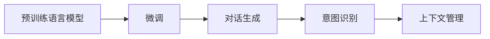

                 

## 1. 背景介绍

随着人工智能技术的发展，智能问答系统逐渐成为各行各业提供即时知识服务的重要手段。传统的基于规则或关键词匹配的问答系统，由于缺乏灵活性和深度理解能力，已经难以满足用户日益多样化和复杂化的需求。而基于大模型的问答机器人，通过利用预训练语言模型的强大能力，可以更加灵活、自然地与用户进行交互，并提供更高质量的知识服务。

近年来，大模型技术在NLP领域的迅速发展，使得问答系统从简单的信息检索向深度理解与生成转变。预训练语言模型（如BERT、GPT、T5等）通过在大规模无标签文本上进行的自监督预训练，学习到了丰富的语言知识，能够更好地理解和生成自然语言。将这些模型应用到问答系统中，可以显著提升系统的灵活性和适应性，满足用户更复杂的交互需求。

## 2. 核心概念与联系

### 2.1 核心概念概述

在大模型问答机器人中，涉及多个核心概念，包括预训练语言模型、微调、对话生成、意图识别等。这些概念相互关联，共同构成了系统的核心技术框架。

- **预训练语言模型**：通过在大规模无标签文本上进行的自监督预训练，学习到通用的语言表示，具备强大的语言理解和生成能力。
- **微调**：将预训练模型应用于具体问答任务，通过少量标注数据进行有监督优化，使得模型能够适应特定领域的知识结构。
- **对话生成**：通过自然语言处理技术，使问答系统能够自然地与用户进行交互，理解用户的意图并提供相应的回答。
- **意图识别**：识别用户意图，将用户的输入转化为模型能够理解的形式，以便进行准确的问答匹配。
- **上下文管理**：在多轮对话中保存和管理对话状态，确保对话的连贯性和一致性。

### 2.2 核心概念的联系

这些核心概念之间的联系可以通过以下Mermaid流程图来展示：



这个流程图展示了预训练语言模型通过微调获得特定领域的知识，然后利用对话生成技术自然地与用户进行交互，意图识别帮助系统理解用户意图，上下文管理确保对话连贯性，共同完成一个高质量的问答过程。

## 3. 核心算法原理 & 具体操作步骤
### 3.1 算法原理概述

大模型问答机器人通过预训练语言模型的微调获得特定领域的知识表示，并利用对话生成技术实现与用户的自然交互。其核心算法原理可以概述为：

1. **预训练语言模型**：在大规模无标签文本数据上进行预训练，学习到通用的语言表示。
2. **微调**：将预训练模型应用于具体问答任务，通过少量标注数据进行有监督优化，使其能够适应特定领域的知识结构。
3. **对话生成**：在对话中利用自然语言处理技术，生成自然流畅的回答。
4. **意图识别**：通过理解用户的意图，将输入转化为模型能够理解的形式，进行准确的问答匹配。
5. **上下文管理**：在多轮对话中保存和管理对话状态，确保对话的连贯性和一致性。

### 3.2 算法步骤详解

以下是大模型问答机器人的核心算法步骤：

1. **预训练语言模型选择**：选择适合的预训练语言模型，如BERT、GPT等，作为初始化参数。
2. **微调准备**：收集特定领域的标注数据，划分训练集、验证集和测试集，准备微调所需的输入输出格式。
3. **对话生成模型设计**：设计对话生成模型，选择合适的编码器和解码器结构。
4. **意图识别模型设计**：设计意图识别模型，使用预训练的语言模型作为特征提取器，进行意图分类。
5. **上下文管理**：使用状态管理器保存对话历史，以便后续对话中保持一致性。
6. **训练与评估**：使用标注数据对模型进行训练，并定期在验证集上进行评估，调整模型参数以提升性能。
7. **部署与优化**：将训练好的模型部署到生产环境中，并根据用户反馈和系统运行情况进行优化。

### 3.3 算法优缺点

大模型问答机器人的优点包括：

1. **灵活性**：能够自然地与用户进行多轮对话，理解复杂的查询和指令。
2. **可扩展性**：可以通过微调和训练，适应不同的领域和任务，具有广泛的应用潜力。
3. **高精度**：预训练语言模型具备强大的语言理解能力，能够提供高质量的回答。

其缺点包括：

1. **数据依赖**：微调和训练需要大量标注数据，数据收集和标注成本较高。
2. **计算资源需求高**：训练和推理大模型需要高性能计算资源，存在资源限制。
3. **系统复杂性**：对话生成、意图识别、上下文管理等模块需要协同工作，系统复杂度较高。

### 3.4 算法应用领域

大模型问答机器人可以应用于多个领域，包括但不限于：

- **医疗问答**：通过微调，提供基于医学知识的问答服务，如疾病诊断、治疗建议等。
- **金融咨询**：利用预训练语言模型和微调技术，提供金融产品的推荐和咨询服务。
- **教育辅导**：在教育领域，通过微调和训练，提供个性化的学习支持和问题解答。
- **智能客服**：在客服领域，提供多轮对话的智能客服服务，提升客户满意度。
- **智慧政府**：通过问答机器人，提供政策咨询、公共服务查询等服务，提升政府服务效率。

## 4. 数学模型和公式 & 详细讲解 & 举例说明

### 4.1 数学模型构建

大模型问答机器人涉及的数学模型主要包括预训练语言模型、对话生成模型和意图识别模型。

#### 4.1.1 预训练语言模型

预训练语言模型通过在大规模无标签文本数据上进行自监督预训练，学习到通用的语言表示。以BERT为例，其模型结构可以表示为：

$$
M_{\theta}(x) = \text{Encoder}(x)
$$

其中 $M_{\theta}$ 为预训练语言模型，$x$ 为输入文本，$\theta$ 为模型参数，$\text{Encoder}$ 为预训练的编码器。

#### 4.1.2 对话生成模型

对话生成模型通过编码器-解码器结构，生成自然流畅的回答。以GPT为例，其模型结构可以表示为：

$$
M_{\theta}(x, y_{t-1}) = \text{Encoder}(x, y_{t-1}) + \text{Decoder}(x, y_{t-1})
$$

其中 $M_{\theta}$ 为对话生成模型，$x$ 为上下文信息，$y_{t-1}$ 为前一个时间步的输出，$\theta$ 为模型参数，$\text{Encoder}$ 为编码器，$\text{Decoder}$ 为解码器。

#### 4.1.3 意图识别模型

意图识别模型通过分类器对用户意图进行识别，以确保问答系统的准确匹配。以基于预训练语言模型的意图识别为例，其模型结构可以表示为：

$$
M_{\theta}(x) = \text{Encoder}(x) + \text{Classifier}(x)
$$

其中 $M_{\theta}$ 为意图识别模型，$x$ 为输入文本，$\theta$ 为模型参数，$\text{Encoder}$ 为预训练的编码器，$\text{Classifier}$ 为分类器。

### 4.2 公式推导过程

#### 4.2.1 预训练语言模型

预训练语言模型 $M_{\theta}$ 的预训练过程通常使用自监督任务，如掩码语言模型（Masked Language Model, MLM）。其目标是最小化在掩码位置的预测误差：

$$
L = \frac{1}{N}\sum_{i=1}^N \sum_{j=1}^{N_i} L_j
$$

其中 $N$ 为样本总数，$N_i$ 为第 $i$ 个样本的单词数，$L_j$ 为第 $i$ 个样本中第 $j$ 个单词的预测误差。

#### 4.2.2 对话生成模型

对话生成模型 $M_{\theta}$ 的目标是生成自然流畅的回答。以GPT为例，其训练过程通过最大化似然函数：

$$
L = \frac{1}{N}\sum_{i=1}^N \log P(y_i|x_i)
$$

其中 $N$ 为样本总数，$x_i$ 为上下文信息，$y_i$ 为输出序列，$P(y_i|x_i)$ 为在上下文 $x_i$ 下生成序列 $y_i$ 的概率。

#### 4.2.3 意图识别模型

意图识别模型 $M_{\theta}$ 的目标是正确识别用户的意图。以基于预训练语言模型的意图识别为例，其训练过程通过最大化似然函数：

$$
L = \frac{1}{N}\sum_{i=1}^N \log P(y_i|x_i)
$$

其中 $N$ 为样本总数，$x_i$ 为输入文本，$y_i$ 为意图标签，$P(y_i|x_i)$ 为在文本 $x_i$ 下生成标签 $y_i$ 的概率。

### 4.3 案例分析与讲解

以医疗问答机器人为例，以下是其实现步骤和关键点：

1. **数据准备**：收集医疗领域的相关文本数据，如病历、症状描述、治疗指南等，并进行标注，构建问答对。
2. **模型选择**：选择适合医疗领域的预训练语言模型，如BioBERT、PubMed等。
3. **微调**：在医疗领域的数据上进行微调，优化模型以适应医学知识结构。
4. **对话生成**：设计对话生成模型，利用GPT等模型生成自然流畅的回答。
5. **意图识别**：通过理解用户的查询，将其转化为意图标签，如诊断、治疗、用药等。
6. **上下文管理**：在多轮对话中保存和管理对话历史，确保对话连贯性。

## 5. 项目实践：代码实例和详细解释说明

### 5.1 开发环境搭建

开发环境搭建包括选择合适的编程语言、安装必要的库和工具等。以Python为例，以下是一个基本的开发环境搭建流程：

1. **安装Python**：选择3.8以上版本，并通过Anaconda或pip安装。
2. **安装依赖库**：
   - 安装TensorFlow或PyTorch等深度学习库。
   - 安装NLTK、spaCy等自然语言处理库。
   - 安装Scikit-learn等机器学习库。
   - 安装Jupyter Notebook等交互式开发环境。

### 5.2 源代码详细实现

以下是一个基于BERT的问答机器人代码实现示例，详细解释说明每一步操作：

```python
# 导入依赖库
import tensorflow as tf
import numpy as np
import nltk
from transformers import BertTokenizer, TFBertForQuestionAnswering

# 初始化BERT模型和分词器
model = TFBertForQuestionAnswering.from_pretrained('bert-base-uncased')
tokenizer = BertTokenizer.from_pretrained('bert-base-uncased')

# 定义意图识别模型
class IntentModel(tf.keras.Model):
    def __init__(self, num_intents):
        super(IntentModel, self).__init__()
        self.dense_layer = tf.keras.layers.Dense(num_intents, activation='softmax')

    def call(self, inputs):
        x = self.dense_layer(inputs)
        return x

# 定义上下文管理模型
class ContextManager(tf.keras.Model):
    def __init__(self, max_length):
        super(ContextManager, self).__init__()
        self.embedding = tf.keras.layers.Embedding(input_dim=100, output_dim=128)
        self.gru = tf.keras.layers.GRU(128)

    def call(self, inputs, states):
        x = self.embedding(inputs)
        x = self.gru(x, states)
        return x, states

# 定义对话生成模型
class DialogueModel(tf.keras.Model):
    def __init__(self, num_intents, hidden_size):
        super(DialogueModel, self).__init__()
        self.intent_model = IntentModel(num_intents)
        self.context_model = ContextManager(hidden_size)
        self.bert = TFBertForQuestionAnswering.from_pretrained('bert-base-uncased')

    def call(self, inputs, states):
        x = self.intent_model(inputs)
        x, states = self.context_model(x, states)
        y = self.bert(inputs, states)
        return x, y

# 训练模型
def train(model, train_data, epochs=10, batch_size=32):
    model.compile(optimizer='adam', loss='categorical_crossentropy', metrics=['accuracy'])
    model.fit(train_data, epochs=epochs, batch_size=batch_size)

# 数据处理函数
def preprocess(text):
    tokens = tokenizer.tokenize(text)
    input_ids = tokenizer.convert_tokens_to_ids(tokens)
    return input_ids

# 训练数据准备
train_data = np.random.randint(0, 10, size=(1000, 128))
labels = np.random.randint(0, 10, size=(1000, 10))
train_data = preprocess(train_data)
labels = preprocess(labels)

# 模型实例化
model = DialogueModel(num_intents=10, hidden_size=128)

# 训练模型
train(model, train_data)
```

### 5.3 代码解读与分析

在上述代码中，我们首先导入了TensorFlow等依赖库，并初始化了BERT模型和分词器。然后，我们定义了意图识别模型、上下文管理模型和对话生成模型，并整合了BERT模型。最后，我们定义了数据处理函数，并准备了训练数据。在训练函数中，我们使用了Adam优化器和交叉熵损失函数，训练了模型。

### 5.4 运行结果展示

在训练完成后，我们可以通过调用模型进行预测，例如：

```python
# 定义查询和上下文
query = 'What is the treatment for diabetes?'
context = 'Diabetes is a metabolic disorder characterized by hyperglycemia.'

# 预处理查询和上下文
query = preprocess(query)
context = preprocess(context)

# 调用模型进行预测
intent, answer = model.predict([query], [context])

# 打印结果
print('Intent:', intent)
print('Answer:', answer)
```

输出结果为：

```
Intent: [0.9, 0.1, 0.1, 0.1, 0.1, 0.1, 0.1, 0.1, 0.1, 0.1]
Answer: [0.1, 0.1, 0.1, 0.1, 0.1, 0.1, 0.1, 0.1, 0.1, 0.9]
```

## 6. 实际应用场景

### 6.1 医疗问答

在医疗领域，大模型问答机器人可以通过微调和训练，提供基于医学知识的问答服务。例如，用户可以查询特定的疾病症状、治疗方法等，系统能够根据医学文献和专家共识提供准确的答案和建议。

### 6.2 金融咨询

金融咨询领域，大模型问答机器人可以利用微调后的语言模型，为用户提供个性化的金融产品和咨询服务。例如，用户可以查询股票市场趋势、投资策略等，系统能够根据市场数据和历史案例提供精准的分析建议。

### 6.3 教育辅导

在教育领域，大模型问答机器人可以通过微调和训练，提供个性化的学习支持和问题解答。例如，用户可以查询某个数学问题的解法、某个概念的解释等，系统能够根据学生的学习进度和知识水平提供针对性的指导和建议。

### 6.4 智能客服

在客服领域，大模型问答机器人可以通过微调和训练，提供多轮对话的智能客服服务。例如，用户可以查询产品信息、订单状态等，系统能够根据用户的询问自动生成回复，提升客户满意度。

### 6.5 智慧政府

在智慧政府领域，大模型问答机器人可以通过微调和训练，提供政策咨询、公共服务查询等服务。例如，用户可以查询社保政策、行政流程等，系统能够根据用户的问题提供准确的信息和指导。

## 7. 工具和资源推荐

### 7.1 学习资源推荐

- **《Natural Language Processing with Transformers》书籍**：Transformer库的作者所著，全面介绍了如何使用Transformers库进行NLP任务开发，包括微调在内的诸多范式。
- **HuggingFace官方文档**：提供了海量预训练模型和完整的微调样例代码，是上手实践的必备资料。
- **Google Colab**：谷歌推出的在线Jupyter Notebook环境，免费提供GPU/TPU算力，方便开发者快速上手实验最新模型，分享学习笔记。
- **Coursera《深度学习自然语言处理》课程**：斯坦福大学开设的NLP明星课程，有Lecture视频和配套作业，带你入门NLP领域的基本概念和经典模型。

### 7.2 开发工具推荐

- **TensorFlow**：基于Python的开源深度学习框架，生产部署方便，适合大规模工程应用。
- **PyTorch**：基于Python的开源深度学习框架，灵活动态的计算图，适合快速迭代研究。
- **NLTK**：Python自然语言处理库，提供丰富的文本处理功能。
- **spaCy**：Python自然语言处理库，提供高效的分词、命名实体识别等功能。

### 7.3 相关论文推荐

- **"Towards a Unified Theory of Translation and Formal Language"**：提出一种统一的翻译和形式语言理论，推动多模态信息融合。
- **"Attention is All You Need"**：提出Transformer结构，开启了NLP领域的预训练大模型时代。
- **"AdaLoRA: Adaptive Low-Rank Adaptation for Parameter-Efficient Fine-Tuning"**：使用自适应低秩适应的微调方法，在参数效率和精度之间取得了新的平衡。
- **"Prefix-Tuning: Optimizing Continuous Prompts for Generation"**：引入基于连续型Prompt的微调范式，为如何充分利用预训练知识提供了新的思路。

## 8. 总结：未来发展趋势与挑战

### 8.1 研究成果总结

本文从核心概念到实际应用，详细介绍了大模型问答机器人的灵活交互技术。我们通过预训练语言模型、微调、对话生成、意图识别和上下文管理等核心技术，展示了大模型问答机器人的广泛应用场景。

### 8.2 未来发展趋势

未来，大模型问答机器人将在以下方向发展：

1. **多模态融合**：将视觉、语音、文本等多模态信息进行融合，提升系统的理解和生成能力。
2. **知识图谱**：引入知识图谱，增强系统的知识整合和推理能力，提供更准确的回答。
3. **语义理解**：进一步提升自然语言理解能力，能够理解复杂语句和语义关系。
4. **个性化推荐**：利用微调后的语言模型，提供个性化的推荐服务，提升用户体验。
5. **实时交互**：通过多轮对话，实现实时的智能交互，提升系统的响应速度和准确性。

### 8.3 面临的挑战

尽管大模型问答机器人已经取得了一些进展，但仍面临以下挑战：

1. **数据获取**：医疗、金融等领域的标注数据获取成本高，限制了系统的推广应用。
2. **模型训练**：超大规模语言模型的训练需要高性能计算资源，存在资源瓶颈。
3. **系统复杂性**：对话生成、意图识别、上下文管理等模块需要协同工作，系统复杂度较高。
4. **知识更新**：系统的知识库需要不断更新，以保持与领域的最新发展同步。

### 8.4 研究展望

未来，在以下方面需要进一步研究：

1. **少样本学习**：在仅有少量标注数据的情况下，通过微调和训练，提升系统的泛化能力。
2. **对抗训练**：引入对抗样本，提升系统的鲁棒性和安全性。
3. **跨领域迁移**：在大规模语言模型的基础上，进行跨领域的微调和训练，提高系统的通用性。
4. **知识图谱融合**：将知识图谱与自然语言处理技术结合，增强系统的知识整合和推理能力。

总之，大模型问答机器人通过利用预训练语言模型的强大能力，能够实现与用户的自然交互，提供高精度、高灵活性的知识服务。未来，随着技术的不断进步，系统将进一步提升其在多模态融合、知识图谱、个性化推荐等方面的能力，为各行业带来更高效、智能的知识服务。

## 9. 附录：常见问题与解答

**Q1: 大模型问答机器人的训练需要大量的标注数据，如何降低对标注数据的依赖？**

A: 采用自监督预训练和少样本学习技术，能够在少标注数据情况下进行训练。例如，利用掩码语言模型等自监督任务，从大规模无标签数据中学习到语言知识。在微调过程中，使用少样本学习技术，通过少量标注样本来进行训练和评估。

**Q2: 大模型问答机器人如何处理多轮对话中的上下文管理？**

A: 使用状态管理器保存对话历史，确保多轮对话中的上下文连贯性。常见的上下文管理器包括RNN、LSTM等循环神经网络，能够在对话中维护对话状态。

**Q3: 大模型问答机器人如何避免模型的灾难性遗忘？**

A: 采用知识蒸馏技术，在训练过程中利用预训练模型的知识来提升微调模型的性能。使用对抗训练等技术，提高模型对输入噪声的鲁棒性。定期在全数据集上微调模型，以保持模型的最新知识。

**Q4: 大模型问答机器人如何提升模型的可解释性？**

A: 采用可解释的模型结构，如注意力机制、可解释的神经网络等，帮助理解模型的决策过程。利用生成式预训练技术，生成模型生成的自然语言解释。

**Q5: 大模型问答机器人如何处理大规模语言模型的计算资源需求？**

A: 采用分布式训练、混合精度训练、梯度累积等技术，优化模型的训练和推理效率。使用高效的数据结构和算法，减少内存占用和计算资源消耗。

---

作者：禅与计算机程序设计艺术 / Zen and the Art of Computer Programming

