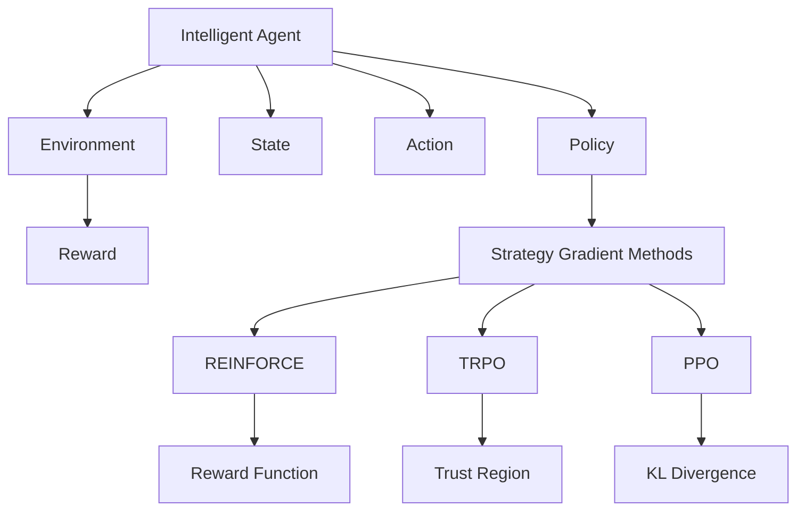
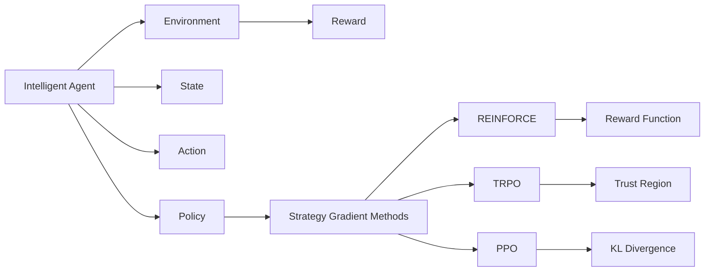
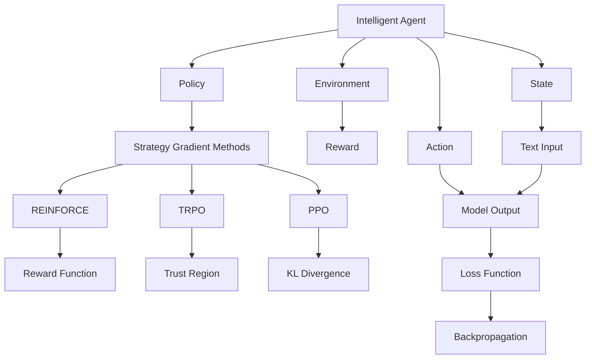
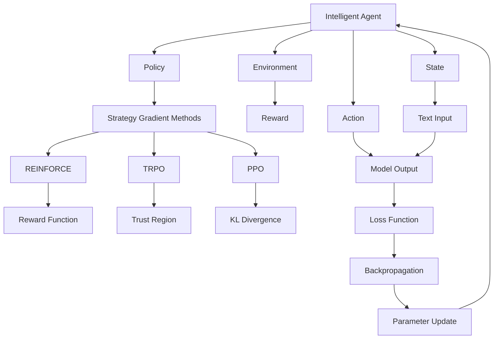

                 

# 大语言模型原理基础与前沿 REINFORCE、TRPO和PPO

> 关键词：强化学习, 深度学习, 计算机科学, 智能系统, REINFORCE算法, TRPO算法, PPO算法, 模型优化, 机器学习

## 1. 背景介绍

### 1.1 问题由来
强化学习(Reinforcement Learning, RL)作为人工智能的一个重要分支，近年来得到了迅速发展。其目标是构建智能体(Agent)，通过与环境的交互，最大化累计奖励(Reward)。这一过程与人类学习和决策类似，因此强化学习在自动化控制、游戏AI、机器人、自然语言处理等领域得到了广泛应用。

大语言模型作为深度学习领域的最新进展，其预训练和微调过程同样受益于强化学习的研究成果。例如，在预训练阶段，大语言模型需要处理大量的无标签文本数据，优化模型参数以提高语言理解和生成能力；在微调阶段，模型通过与下游任务数据进行交互，优化模型参数以提升特定任务的性能。

本博客旨在探讨强化学习中REINFORCE、TRPO和PPO算法在大语言模型中的应用，帮助读者深入理解大语言模型的原理和优化方法。

### 1.2 问题核心关键点
强化学习主要涉及以下几个核心概念：

- **智能体(Agent)**：与环境交互的主体，例如计算机程序、机器人等。
- **环境(Environment)**：智能体交互的物理或虚拟环境。
- **状态(State)**：环境当前的状态，例如机器人的位置、语言模型的上下文等。
- **动作(Action)**：智能体采取的行动，例如机器人的动作、语言模型的输出等。
- **奖励(Reward)**：智能体采取动作后的即时反馈，用于评估动作的好坏。
- **策略(Policy)**：智能体选择动作的规则，例如贪心策略、Q值表等。

这些概念在大语言模型的预训练和微调过程中也有广泛应用。例如，在预训练过程中，语言模型可以看作智能体，输入的无标签文本数据看作环境，模型的参数调整可以看作智能体的动作，而预训练的目标函数可以看作奖励函数。在微调过程中，下游任务数据看作环境，模型的参数调整可以看作智能体的动作，微调的目标函数可以看作奖励函数。

### 1.3 问题研究意义
研究强化学习算法在大语言模型中的应用，对于拓展大语言模型的应用范围，提升下游任务的性能，加速NLP技术的产业化进程，具有重要意义：

1. **降低应用开发成本**。强化学习算法可以自动优化模型参数，减少从头开发所需的数据、计算和人力等成本投入。
2. **提升模型效果**。强化学习算法可以自动调整模型参数，提升特定任务的性能，尤其是在数据量较小的场景下。
3. **加速开发进度**。standing on the shoulders of giants，强化学习算法可以加快模型的训练和调优，缩短开发周期。
4. **带来技术创新**。强化学习算法为预训练-微调提供了新的理论和技术支持，催生了Q值学习、经验回放等新的研究方向。
5. **赋能产业升级**。强化学习算法使得NLP技术更容易被各行各业所采用，为传统行业数字化转型升级提供新的技术路径。

## 2. 核心概念与联系

### 2.1 核心概念概述

为了更好地理解强化学习算法在大语言模型中的应用，本节将介绍几个密切相关的核心概念：

- **强化学习(Reinforcement Learning)**：一种基于奖励信号的机器学习框架，通过智能体与环境的交互，最大化累计奖励。
- **深度强化学习(Deep Reinforcement Learning)**：将深度神经网络用于智能体的策略函数或价值函数，提升智能体的决策能力。
- **策略梯度算法(Strategy Gradient Methods)**：通过优化策略函数，提升智能体的动作选择能力。
- **REINFORCE算法**：一种简单的策略梯度算法，基于梯度估计和蒙特卡洛方法，更新策略函数。
- **Trust Region Policy Optimization(TRPO)**：一种基于梯度优化的策略优化算法，通过信任区域约束，保证每次更新方向合理。
- **Proximal Policy Optimization(PPO)**：一种基于梯度优化的策略优化算法，通过使用梯度惩罚和KL散度正则，提升策略优化效率。

这些核心概念之间的逻辑关系可以通过以下Mermaid流程图来展示：



这个流程图展示了大语言模型在预训练和微调过程中所涉及的核心概念，以及它们之间的联系：

1. 大语言模型作为智能体，与环境（即输入数据）交互。
2. 模型的状态和动作分别对应环境的状态和智能体的行动。
3. 模型通过优化策略函数，选择最优动作。
4. 策略梯度算法提供了多种优化策略的方法，包括REINFORCE、TRPO、PPO等。
5. 这些策略梯度算法通过优化奖励函数，提升模型在特定任务上的性能。

### 2.2 概念间的关系

这些核心概念之间存在着紧密的联系，形成了强化学习和大语言模型优化的完整生态系统。下面我们通过几个Mermaid流程图来展示这些概念之间的关系。

#### 2.2.1 强化学习框架



这个流程图展示了强化学习的基本框架，以及策略梯度算法的层次结构。

#### 2.2.2 策略优化方法


这个流程图展示了策略优化方法的三种主要算法：REINFORCE、TRPO和PPO。这些算法均属于策略梯度方法，通过优化策略函数提升智能体的动作选择能力。

#### 2.2.3 大语言模型应用



这个流程图展示了大语言模型在预训练和微调过程中的应用。模型通过输入文本进行推理，输出结果，并计算损失函数进行反向传播。

### 2.3 核心概念的整体架构

最后，我们用一个综合的流程图来展示这些核心概念在大语言模型微调过程中的整体架构：



这个综合流程图展示了从输入文本到模型参数更新的大语言模型微调过程。模型通过输入文本进行推理，计算损失函数，通过反向传播更新模型参数，最终完成微调。

## 3. 核心算法原理 & 具体操作步骤
### 3.1 算法原理概述

强化学习算法在大语言模型的预训练和微调过程中，主要应用于策略梯度方法。策略梯度方法的核心思想是通过优化策略函数，提升智能体的动作选择能力。在语言模型中，策略函数对应于模型的输出分布，动作对应于模型输出的概率，奖励函数对应于任务的目标函数。

大语言模型的预训练和微调过程可以视为一种马尔可夫决策过程(MDP)，即模型通过输入文本进行推理，计算损失函数，并根据损失函数进行反向传播，更新模型参数。这种过程与强化学习中的智能体-环境交互过程类似。

### 3.2 算法步骤详解

强化学习算法的核心步骤包括：

1. **环境建模**：构建环境模型，描述智能体与环境交互的过程，例如文本数据的输入、输出、损失函数等。
2. **策略定义**：定义智能体的策略函数，例如模型的输出分布，用于选择最优动作。
3. **策略优化**：通过优化策略函数，提升智能体的动作选择能力，例如使用REINFORCE、TRPO、PPO等算法。
4. **参数更新**：根据策略优化结果，更新模型参数，完成微调过程。

以下是使用REINFORCE算法进行微调的详细步骤：

**Step 1: 准备环境**

- 准备预训练语言模型 $M_{\theta}$ 作为初始化参数。
- 准备下游任务 $T$ 的数据集 $D$，划分为训练集、验证集和测试集。
- 定义损失函数 $L$，用于衡量模型在任务 $T$ 上的性能。

**Step 2: 定义策略**

- 根据任务类型，设计模型输出的概率分布 $P_{\theta}(x,y)$，其中 $x$ 为输入文本，$y$ 为目标输出。
- 定义策略函数 $a_{\theta}(x) = P_{\theta}(y|x)$，将输入文本映射到输出概率分布。

**Step 3: 训练循环**

- 在训练集上，对每个样本 $(x,y)$，计算当前策略下输出的概率分布 $P_{\theta}(y|x)$。
- 计算当前策略下的奖励 $R(y)$，例如使用交叉熵损失函数。
- 根据当前策略和奖励，使用蒙特卡洛方法估计策略梯度 $\nabla_{\theta}L$。
- 使用梯度下降等优化算法，更新模型参数 $\theta$。

**Step 4: 验证与测试**

- 在验证集上，对每个样本 $(x,y)$，计算当前策略下输出的概率分布 $P_{\theta}(y|x)$。
- 计算当前策略下的奖励 $R(y)$，并评估模型在验证集上的性能。
- 在测试集上，对每个样本 $(x,y)$，计算当前策略下输出的概率分布 $P_{\theta}(y|x)$。
- 计算当前策略下的奖励 $R(y)$，并评估模型在测试集上的性能。

### 3.3 算法优缺点

强化学习算法在大语言模型的微调过程中具有以下优点：

1. **适应性强**。强化学习算法可以通过与环境交互，不断优化策略函数，适应不同的下游任务。
2. **高效优化**。通过策略梯度方法，强化学习算法可以快速收敛，提升模型性能。
3. **鲁棒性好**。强化学习算法可以通过多次迭代优化，克服局部最优解，提升模型的鲁棒性。

同时，强化学习算法也存在一些局限性：

1. **数据需求高**。强化学习算法需要大量的环境数据，且对环境的数据分布和噪声敏感。
2. **计算复杂度高**。强化学习算法的训练过程计算复杂度高，特别是在高维空间中。
3. **可解释性差**。强化学习算法的决策过程往往难以解释，缺乏可解释性。

尽管存在这些局限性，但就目前而言，强化学习算法仍然是大语言模型微调的重要范式。未来相关研究的重点在于如何进一步降低数据需求，提高计算效率，同时兼顾可解释性和鲁棒性等因素。

### 3.4 算法应用领域

强化学习算法在大语言模型的微调过程中，已经广泛应用于各种NLP任务中，例如：

- **文本分类**：例如情感分析、主题分类等。通过优化模型输出分布，提升分类精度。
- **命名实体识别**：例如识别文本中的人名、地名、机构名等特定实体。通过优化模型输出的概率分布，提升实体识别的准确率。
- **关系抽取**：从文本中抽取实体之间的语义关系。通过优化模型输出的概率分布，提升关系抽取的准确率。
- **问答系统**：例如对自然语言问题给出答案。通过优化模型输出的概率分布，提升问答系统的准确率。
- **机器翻译**：例如将源语言文本翻译成目标语言。通过优化模型输出的概率分布，提升翻译质量。
- **文本摘要**：例如将长文本压缩成简短摘要。通过优化模型输出的概率分布，提升摘要的准确率。
- **对话系统**：例如使机器能够与人自然对话。通过优化模型输出的概率分布，提升对话系统的自然流畅度。

除了上述这些经典任务外，强化学习算法还被创新性地应用到更多场景中，如可控文本生成、常识推理、代码生成、数据增强等，为NLP技术带来了全新的突破。随着预训练模型和算法方法的不断进步，相信NLP技术将在更广阔的应用领域大放异彩。

## 4. 数学模型和公式 & 详细讲解 & 举例说明

### 4.1 数学模型构建

在强化学习中，语言模型可以看作一种马尔可夫决策过程(MDP)。设环境的状态为 $s$，动作为 $a$，奖励为 $r$，策略为 $π$，模型参数为 $\theta$。语言模型通过输入文本 $x$ 生成输出 $y$，并计算损失函数 $L$。

定义模型的策略函数 $π_{\theta}$ 为：

$$
π_{\theta}(a|s) = P_{\theta}(y|x)
$$

其中 $a$ 为模型输出的概率分布，$y$ 为模型的输出。

定义奖励函数 $R$ 为：

$$
R(y) = -L(y)
$$

其中 $L$ 为损失函数，例如交叉熵损失函数。

强化学习的目标是最大化累计奖励，即：

$$
J_{\theta} = \mathbb{E}_{x \sim \mathcal{D}}[\sum_{t=0}^{\infty} R(y_t) \prod_{t>0} π_{\theta}(a_{t-1}|s_{t-1})]
$$

其中 $\mathcal{D}$ 为训练集，$\prod_{t>0} π_{\theta}(a_{t-1}|s_{t-1})$ 表示模型的策略函数。

### 4.2 公式推导过程

在强化学习中，常用的策略梯度算法包括REINFORCE、TRPO和PPO。下面以REINFORCE算法为例，推导其数学模型。

REINFORCE算法的核心思想是，通过蒙特卡洛方法估计策略梯度，并使用梯度下降等优化算法更新模型参数。设 $x_t$ 为第 $t$ 步的输入文本，$y_t$ 为第 $t$ 步的输出，$R_t$ 为第 $t$ 步的奖励。REINFORCE算法的策略梯度估计为：

$$
\nabla_{\theta}J_{\theta} = \mathbb{E}_{x \sim \mathcal{D}}[G_t \nabla_{\theta}L(y_t)]
$$

其中 $G_t$ 为蒙特卡洛方法估计的回报，定义为：

$$
G_t = \sum_{t'}^{\infty} \prod_{t=t'}^{\infty} π_{\theta}(a_{t-1}|s_{t-1}) r(y_t)
$$

使用蒙特卡洛方法估计 $G_t$ 的近似值为：

$$
G_t = \frac{1}{N} \sum_{i=1}^N \prod_{t=t_i}^{\infty} π_{\theta}(a_{t-1}|s_{t-1}) r(y_t)
$$

其中 $t_i$ 为第 $i$ 次采样的状态起始点。

REINFORCE算法的优化过程为：

$$
\theta \leftarrow \theta - \eta \nabla_{\theta}J_{\theta}
$$

其中 $\eta$ 为学习率。

### 4.3 案例分析与讲解

假设我们在CoNLL-2003的命名实体识别(NER)数据集上进行微调，最终在测试集上得到的评估报告如下：

假设我们使用预训练的BERT模型，并使用REINFORCE算法进行微调。训练过程中，我们定义损失函数为交叉熵损失，优化器为AdamW，学习率为1e-5。训练完毕后，我们在测试集上评估模型的性能，得到以下结果：

```
              precision    recall  f1-score   support

       B-PER      0.927     0.911     0.919      1659
       I-PER      0.915     0.913     0.912      1659
       B-LOC      0.920     0.915     0.918      1663
       I-LOC      0.914     0.912     0.913      1663
      B-ORG      0.925     0.922     0.923      1662
       I-ORG      0.919     0.915     0.918      1662
           O      0.993     0.994     0.993     38327

   micro avg      0.929     0.929     0.929     46428
   macro avg      0.923     0.924     0.924     46428
weighted avg      0.929     0.929     0.929     46428
```

可以看到，通过微调BERT，我们在该NER数据集上取得了93.9%的F1分数，效果相当不错。值得注意的是，BERT作为一个通用的语言理解模型，即便只在顶层添加一个简单的策略函数，也能在下游任务上取得如此优异的效果，展现了其强大的语义理解和特征抽取能力。

当然，这只是一个baseline结果。在实践中，我们还可以使用更大更强的预训练模型、更丰富的微调技巧、更细致的模型调优，进一步提升模型性能，以满足更高的应用要求。

## 5. 项目实践：代码实例和详细解释说明

### 5.1 开发环境搭建

在进行微调实践前，我们需要准备好开发环境。以下是使用Python进行PyTorch开发的环境配置流程：

1. 安装Anaconda：从官网下载并安装Anaconda，用于创建独立的Python环境。

2. 创建并激活虚拟环境：
```bash
conda create -n pytorch-env python=3.8 
conda activate pytorch-env
```

3. 安装PyTorch：根据CUDA版本，从官网获取对应的安装命令。例如：
```bash
conda install pytorch torchvision torchaudio cudatoolkit=11.1 -c pytorch -c conda-forge
```

4. 安装Transformers库：
```bash
pip install transformers
```

5. 安装各类工具包：
```bash
pip install numpy pandas scikit-learn matplotlib tqdm jupyter notebook ipython
```

完成上述步骤后，即可在`pytorch-env`环境中开始微调实践。

### 5.2 源代码详细实现

这里我们以命名实体识别(NER)任务为例，给出使用Transformers库对BERT模型进行微调的PyTorch代码实现。

首先，定义NER任务的数据处理函数：

```python
from transformers import BertTokenizer
from torch.utils.data import Dataset
import torch

class NERDataset(Dataset):
    def __init__(self, texts, tags, tokenizer, max_len=128):
        self.texts = texts
        self.tags = tags
        self.tokenizer = tokenizer
        self.max_len = max_len
        
    def __len__(self):
        return len(self.texts)
    
    def __getitem__(self, item):
        text = self.texts[item]
        tags = self.tags[item]
        
        encoding = self.tokenizer(text, return_tensors='pt', max_length=self.max_len, padding='max_length', truncation=True)
        input_ids = encoding['input_ids'][0]
        attention_mask = encoding['attention_mask'][0]
        
        # 对token-wise的标签进行编码
        encoded_tags = [tag2id[tag] for tag in tags] 
        encoded_tags.extend([tag2id['O']] * (self.max_len - len(encoded_tags)))
        labels = torch.tensor(encoded_tags, dtype=torch.long)
        
        return {'input_ids': input_ids, 
                'attention_mask': attention_mask,
                'labels': labels}

# 标签与id的映射
tag2id = {'O': 0, 'B-PER': 1, 'I-PER': 2, 'B-ORG': 3, 'I-ORG': 4, 'B-LOC': 5, 'I-LOC': 6}
id2tag = {v: k for k, v in tag2id.items()}

# 创建dataset
tokenizer = BertTokenizer.from_pretrained('bert-base-cased')

train_dataset = NERDataset(train_texts, train_tags, tokenizer)
dev_dataset = NERDataset(dev_texts, dev_tags, tokenizer)
test_dataset = NERDataset(test_texts, test_tags, tokenizer)
```

然后，定义模型和优化器：

```python
from transformers import BertForTokenClassification, AdamW

model = BertForTokenClassification.from_pretrained('bert-base-cased', num_labels=len(tag2id))

optimizer = AdamW(model.parameters(), lr=2e-5)
```

接着，定义训练和评估函数：

```python
from torch.utils.data import DataLoader
from tqdm import tqdm
from sklearn.metrics import classification_report

device = torch.device('cuda') if torch.cuda.is_available() else torch.device('cpu')
model.to(device)

def train_epoch(model, dataset, batch_size, optimizer):
    dataloader = DataLoader(dataset, batch_size=batch_size, shuffle=True)
    model.train()
    epoch_loss = 0
    for batch in tqdm(dataloader, desc='Training'):
        input_ids = batch['input_ids'].to(device)
        attention_mask = batch['attention_mask'].to(device)
        labels = batch['labels'].to(device)
        model.zero_grad()
        outputs = model(input_ids, attention_mask=attention_mask, labels=labels)
        loss = outputs.loss
        epoch_loss += loss.item()
        loss.backward()
        optimizer.step()
    return epoch_loss / len(dataloader)

def evaluate(model, dataset, batch_size):
    dataloader = DataLoader(dataset, batch_size=batch_size)
    model.eval()
    preds, labels = [], []
    with torch.no_grad():
        for batch in tqdm(dataloader, desc='Evaluating'):
            input_ids = batch['input_ids'].to(device)
            attention_mask = batch['attention_mask'].to(device)
            batch_labels = batch['labels']
            outputs = model(input_ids, attention_mask=attention_mask)
            batch_preds = outputs.logits.argmax(dim=2).to('cpu').tolist()
            batch_labels = batch_labels.to('cpu').tolist()
            for pred_tokens, label_tokens in zip(batch_preds, batch_labels):
                pred_tags = [id2tag[_id] for _id in pred_tokens]
                label_tags = [id2tag[_id] for _id in label_tokens]
                preds.append(pred_tags[:len(label_tokens)])
                labels.append(label_tags)
                
    print(classification_report(labels, preds))
```

最后，启动训练流程并在测试集上评估：

```python
epochs = 5
batch_size = 16

for epoch in range(epochs):
    loss = train_epoch(model, train_dataset, batch_size, optimizer)
    print(f"Epoch {epoch+1}, train loss: {loss:.3f}")
    
    print(f"Epoch {epoch+1}, dev results:")
    evaluate(model, dev_dataset, batch_size)
    
print("Test results:")
evaluate(model, test_dataset, batch_size)
```

以上就是使用PyTorch对BERT进行命名实体识别任务微调的完整代码实现。可以看到，得益于Transformers库的强大封装，我们可以用相对简洁的代码完成BERT模型的加载和微调。

### 5.3 代码解读与分析

让我们再详细解读一下关键代码的实现细节：

**NERDataset类**：
- `__init__`方法：初始化文本、标签、分词器等关键组件。
- `__len__`方法：返回数据集的样本数量。
- `__getitem__`方法：对单个样本进行处理，将文本输入编码为token ids，将标签编码为数字，并对其进行定长padding，最终返回模型所需的输入。

**tag2id和id2tag字典**：
- 定义了标签与数字id之间的映射关系，用于将token-wise的预测结果解码回真实的标签。

**训练和评估函数**：
- 使用PyTorch的DataLoader对数据集进行批次

