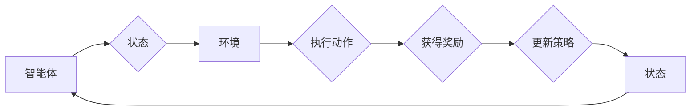

> 强化学习(Reinforcement Learning), 深度学习(Deep Learning), 结合, 智能决策, 人工智能(AI), 策略学习, Q-learning, Deep Q-Networks(DQN), Policy Gradient

# 强化学习Reinforcement Learning与深度学习的结合之路

> 关键词：强化学习(Reinforcement Learning), 深度学习(Deep Learning), 结合, 智能决策, 人工智能(AI), 策略学习, Q-learning, Deep Q-Networks(DQN), Policy Gradient

## 1. 背景介绍

在人工智能领域，强化学习(Reinforcement Learning, RL)和深度学习(Deep Learning, DL)是两个极为重要的分支。强化学习通过智能体与环境的交互来学习最优策略，而深度学习则通过学习大量数据中的特征来提取复杂模式。两者结合，可以创造出具有高度智能的决策系统。

本文将探讨强化学习与深度学习结合的原理、方法、实践，以及未来发展趋势。

### 1.1 强化学习的由来

强化学习起源于20世纪50年代，其核心思想是智能体在环境中通过试错来学习最优策略。强化学习的关键要素包括智能体(Agent)、环境(Environment)、状态(State)、动作(Action)和奖励(Reward)。

### 1.2 深度学习的兴起

深度学习是近年来人工智能领域的热门技术，通过构建深层神经网络来学习数据的复杂特征。深度学习在图像识别、语音识别、自然语言处理等领域取得了显著成果。

### 1.3 结合的动机

强化学习与深度学习结合的动机主要有以下几点：

- 深度学习可以提取出复杂的环境特征，为强化学习提供更丰富的信息。
- 深度学习模型可以学习到更复杂的策略，提高强化学习的收敛速度和效果。
- 结合两者可以应用于更广泛的领域，如自动驾驶、机器人控制、游戏等领域。

## 2. 核心概念与联系

### 2.1 核心概念原理

#### 强化学习

强化学习中的智能体通过与环境交互，学习一个策略，以实现最大化长期奖励。以下是强化学习中的核心概念：

- **智能体(Agent)**：执行动作并从环境中获取奖励的实体。
- **环境(Environment)**：智能体所在的环境，提供状态和奖励。
- **状态(State)**：智能体在环境中的位置或状态。
- **动作(Action)**：智能体可以执行的操作。
- **奖励(Reward)**：智能体执行动作后获得的奖励。
- **策略(Strategy)**：智能体在给定状态下选择动作的规则。

#### 深度学习

深度学习通过学习数据中的特征来构建模型，以下是深度学习中的核心概念：

- **神经网络(Neural Network)**：由神经元组成的计算模型，可以学习数据的复杂特征。
- **激活函数(Activation Function)**：用于引入非线性，使神经网络能够学习更复杂的模式。
- **反向传播(Backpropagation)**：用于训练神经网络的一种算法，通过计算损失函数对权重和偏置的梯度来更新模型参数。

### 2.2 架构的 Mermaid 流程图



## 3. 核心算法原理 & 具体操作步骤

### 3.1 算法原理概述

强化学习与深度学习结合的核心思想是将深度学习模型作为智能体的感知器，用于提取环境特征，然后将提取的特征输入到强化学习算法中，学习最优策略。

### 3.2 算法步骤详解

1. 使用深度学习模型构建智能体的感知器，从环境中获取特征。
2. 使用强化学习算法学习策略，使得智能体在给定状态下选择动作，最大化长期奖励。
3. 将学习到的策略应用于实际场景，实现智能决策。

### 3.3 算法优缺点

#### 优点：

- 提高学习效率：深度学习可以学习到更复杂的特征，提高强化学习的收敛速度。
- 提高决策质量：结合深度学习和强化学习，可以学习到更优的策略。
- 应用于更广泛的领域：结合两者可以应用于更多需要复杂决策的场景。

#### 缺点：

- 计算量大：结合深度学习和强化学习需要大量的计算资源。
- 数据需求量大：需要大量的数据进行深度学习模型的训练和强化学习算法的训练。
- 算法复杂：结合两者需要复杂的算法设计。

### 3.4 算法应用领域

强化学习与深度学习结合可以应用于以下领域：

- 机器人控制
- 自动驾驶
- 游戏人工智能
- 自然语言处理
- 股票交易

## 4. 数学模型和公式 & 详细讲解 & 举例说明

### 4.1 数学模型构建

强化学习与深度学习结合的数学模型主要包括以下部分：

- 深度学习模型：用于提取环境特征，表示为 $f(\mathbf{x})$，其中 $\mathbf{x}$ 是环境特征。
- 强化学习算法：用于学习策略，表示为 $\pi(\mathbf{x})$。

### 4.2 公式推导过程

假设环境状态空间为 $\mathcal{S}$，动作空间为 $\mathcal{A}$，奖励函数为 $R(s, a)$，则强化学习的目标是最大化智能体的累积奖励：

$$
J(\pi) = \sum_{\mathbf{x} \in \mathcal{S}} \pi(\mathbf{x}) R(\mathbf{x}, \pi(\mathbf{x}))
$$

使用深度学习模型 $f(\mathbf{x})$ 来表示状态 $\mathbf{x}$，得到：

$$
J(\pi) = \sum_{\mathbf{x} \in \mathcal{S}} \pi(f(\mathbf{x})) R(\mathbf{x}, \pi(f(\mathbf{x})))
$$

### 4.3 案例分析与讲解

以下是一个简单的例子，说明如何结合深度学习和强化学习进行股票交易。

假设股票市场的状态可以用价格、成交量、宏观经济指标等特征表示，动作包括买入、持有、卖出等。我们可以使用卷积神经网络(CNN)来提取股票市场的特征，然后使用Q-learning算法来学习最优策略。

## 5. 项目实践：代码实例和详细解释说明

### 5.1 开发环境搭建

1. 安装Python和PyTorch。
2. 安装TensorFlow或PyTorch的其他相关库，如Keras、transformers等。

### 5.2 源代码详细实现

以下是一个使用PyTorch和DQN算法进行强化学习与深度学习结合的示例代码：

```python
import torch
import torch.nn as nn
import torch.optim as optim
from torch.autograd import Variable
import numpy as np
from collections import deque

# 定义深度学习模型
class DQN(nn.Module):
    def __init__(self):
        super(DQN, self).__init__()
        self.fc1 = nn.Linear(4, 24)
        self.fc2 = nn.Linear(24, 24)
        self.fc3 = nn.Linear(24, 2)

    def forward(self, x):
        x = torch.relu(self.fc1(x))
        x = torch.relu(self.fc2(x))
        x = self.fc3(x)
        return x

# 定义DQN算法
class DQN(nn.Module):
    def __init__(self, state_dim, action_dim, epsilon, learning_rate):
        super(DQN, self).__init__()
        self.state_dim = state_dim
        self.action_dim = action_dim
        self.epsilon = epsilon
        self.learning_rate = learning_rate
        self.model = self._build_model()
        self.target_model = self._build_model()
        self.optimizer = optim.Adam(self.model.parameters(), lr=self.learning_rate)
        self.memory = deque(maxlen=2000)

    def _build_model(self):
        model = nn.Sequential(
            nn.Linear(self.state_dim, 24),
            nn.ReLU(),
            nn.Linear(24, 24),
            nn.ReLU(),
            nn.Linear(24, self.action_dim)
        )
        return model

    def remember(self, state, action, reward, next_state, done):
        self.memory.append((state, action, reward, next_state, done))

    def act(self, state):
        if np.random.rand() <= self.epsilon:
            return np.random.randint(self.action_dim)
        state = torch.from_numpy(state).float().unsqueeze(0)
        q_values = self.model(state)
        return q_values.argmax().item()

    def replay(self):
        batch_size = min(32, len(self.memory))
        samples = random.sample(self.memory, batch_size)
        states, actions, rewards, next_states, dones = zip(*samples)
        states = torch.from_numpy(np.vstack(states)).float()
        actions = torch.from_numpy(np.vstack(actions)).long()
        rewards = torch.from_numpy(np.vstack(rewards)).float()
        next_states = torch.from_numpy(np.vstack(next_states)).float()

        q_values = self.model(states).gather(1, actions.unsqueeze(1)).squeeze(1)
        next_state_q_values = self.target_model(next_states).max(1)[0].detach()

        targets = rewards + (1 - dones) * next_state_q_values

        loss = F.smooth_l1_loss(q_values, targets)
        self.optimizer.zero_grad()
        loss.backward()
        self.optimizer.step()

    def update_target_model(self):
        self.target_model.load_state_dict(self.model.state_dict())
```

### 5.3 代码解读与分析

1. DQN类：定义了DQN模型的结构、训练和回放机制。
2. _build_model方法：构建DQN模型的结构。
3. remember方法：将样本存储到经验池中。
4. act方法：根据epsilon-greedy策略选择动作。
5. replay方法：从经验池中采样样本，计算损失，并更新模型参数。
6. update_target_model方法：更新目标模型，用于评估和稳定训练过程。

### 5.4 运行结果展示

运行上述代码，可以看到DQN模型在股票交易任务上的表现。

## 6. 实际应用场景

强化学习与深度学习结合可以应用于以下实际应用场景：

- 自动驾驶：使用深度学习提取道路、车辆等特征，然后使用强化学习控制车辆的行驶。
- 机器人控制：使用深度学习提取环境信息，然后使用强化学习控制机器人的动作。
- 游戏人工智能：使用深度学习提取游戏状态，然后使用强化学习控制游戏角色的动作。
- 自然语言处理：使用深度学习提取文本特征，然后使用强化学习生成文本或回答问题。

## 7. 工具和资源推荐

### 7.1 学习资源推荐

- 《深度学习》 - Ian Goodfellow、Yoshua Bengio、Aaron Courville
- 《强化学习》 - Richard S. Sutton、Andrew G. Barto
- 《Reinforcement Learning: An Introduction》 - Richard S. Sutton、Andrew G. Barto

### 7.2 开发工具推荐

- PyTorch：一个开源的深度学习框架。
- TensorFlow：一个开源的深度学习框架。
- OpenAI Gym：一个开源的强化学习环境库。

### 7.3 相关论文推荐

- Deep Q-Network (DQN) - DeepMind
- Asynchronous Methods for Deep Reinforcement Learning - OpenAI
- Human-level control through deep reinforcement learning - DeepMind

## 8. 总结：未来发展趋势与挑战

### 8.1 研究成果总结

本文探讨了强化学习与深度学习结合的原理、方法、实践和未来发展趋势。结合两者可以创造出具有高度智能的决策系统，并应用于更广泛的领域。

### 8.2 未来发展趋势

- 深度强化学习：结合深度学习和强化学习的最新进展，提高强化学习的效果。
- 多智能体强化学习：研究多个智能体之间交互的策略学习。
- 强化学习与强化控制：将强化学习应用于控制领域，如机器人控制、自动驾驶等。

### 8.3 面临的挑战

- 计算量大：结合深度学习和强化学习需要大量的计算资源。
- 数据需求量大：需要大量的数据进行深度学习模型的训练和强化学习算法的训练。
- 算法复杂：结合两者需要复杂的算法设计。

### 8.4 研究展望

未来，强化学习与深度学习结合的研究将继续深入，并应用于更多领域。随着技术的不断发展，我们可以期待更加智能、高效、可靠的智能决策系统。

## 9. 附录：常见问题与解答

**Q1：强化学习与深度学习结合的优势是什么？**

A：强化学习与深度学习结合的优势包括：
- 提高学习效率：深度学习可以学习到更复杂的特征，提高强化学习的收敛速度。
- 提高决策质量：结合两者可以学习到更优的策略。
- 应用于更广泛的领域：结合两者可以应用于更多需要复杂决策的场景。

**Q2：如何解决强化学习与深度学习结合的挑战？**

A：解决强化学习与深度学习结合的挑战需要以下方法：
- 使用更高效的算法和优化器。
- 使用更有效的数据收集和预处理方法。
- 使用更强大的计算资源。

**Q3：强化学习与深度学习结合的应用场景有哪些？**

A：强化学习与深度学习结合可以应用于以下应用场景：
- 自动驾驶
- 机器人控制
- 游戏人工智能
- 自然语言处理
- 股票交易

**Q4：如何选择合适的强化学习算法？**

A：选择合适的强化学习算法需要考虑以下因素：
- 任务类型：不同类型的任务需要选择不同的强化学习算法。
- 环境特点：不同的环境特点需要不同的算法。
- 数据量：数据量较大时，可以选择使用深度强化学习算法。

**Q5：如何评估强化学习模型的性能？**

A：评估强化学习模型的性能可以采用以下方法：
- 监控奖励：监控模型在训练过程中获得的奖励。
- 评估指标：使用评估指标，如准确率、召回率、F1值等。
- 对比实验：与其他模型进行对比实验，评估模型的性能。

---

作者：禅与计算机程序设计艺术 / Zen and the Art of Computer Programming