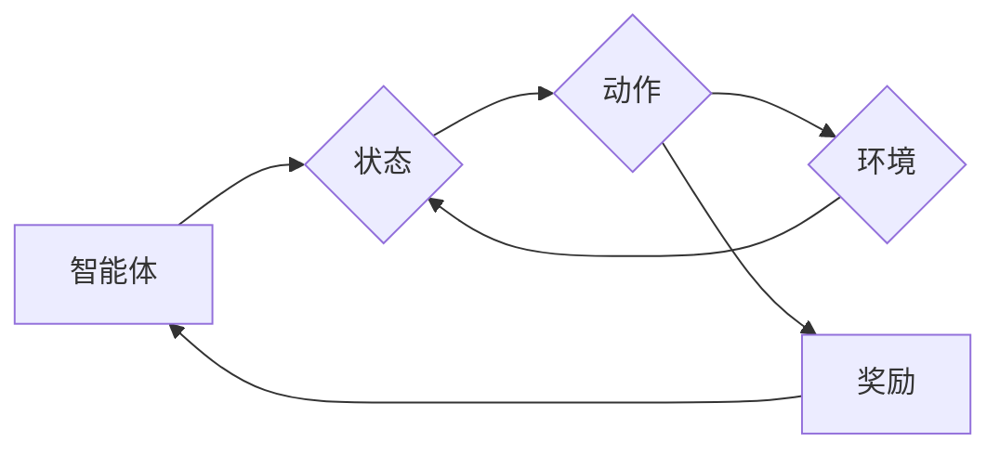

# 强化学习Reinforcement Learning在物联网IoT的创新应用方案

> 关键词：强化学习，物联网，智能控制，自适应优化，Q学习，深度Q网络，强化学习框架

## 1. 背景介绍

随着物联网(IoT)技术的快速发展，各类智能设备和传感器被广泛应用于工业自动化、智能城市、智能家居等领域。这些设备通过收集和处理大量数据，实现实时监测、智能决策和自动控制。然而，物联网系统的复杂性和动态性给传统的控制方法带来了巨大的挑战。强化学习(Reinforcement Learning, RL)作为一种新兴的机器学习技术，因其能够处理不确定性、优化决策过程等特点，在物联网领域展现出巨大的潜力。

### 1.1 问题的由来

物联网系统通常包含大量的智能节点，每个节点负责收集数据、执行任务和与其他节点交互。这些节点之间的协同工作和动态变化使得系统控制变得异常复杂。传统的控制方法，如PID控制器、模糊控制等，往往难以适应这种复杂性和动态性。

强化学习通过模拟智能体与环境交互的过程，使智能体能够在未知的环境中学习和优化决策策略，从而实现智能控制和自适应优化。因此，将强化学习应用于物联网系统，有望解决传统控制方法的局限性，提升系统的智能化水平和鲁棒性。

### 1.2 研究现状

近年来，随着深度学习技术的快速发展，深度强化学习(Deep Reinforcement Learning, DRL)在物联网领域得到了广泛关注。DRL结合了深度学习和强化学习的优势，能够处理高维输入和复杂的决策空间，在智能控制、资源分配、故障诊断等方面取得了显著成果。

### 1.3 研究意义

将强化学习应用于物联网系统，具有以下重要意义：

- 提升系统智能化水平：通过学习优化决策策略，实现智能控制、自适应优化和故障诊断等功能。
- 增强系统鲁棒性：在动态变化的环境中，强化学习能够适应环境变化，提高系统的稳定性。
- 降低维护成本：通过自动优化系统配置和参数，减少人工干预和维护成本。
- 创新应用场景：拓展物联网技术的应用领域，推动智能化发展。

### 1.4 本文结构

本文将系统地介绍强化学习在物联网领域的创新应用方案。内容安排如下：

- 第2部分，介绍强化学习、物联网等相关核心概念。
- 第3部分，阐述强化学习在物联网领域的核心算法原理和具体操作步骤。
- 第4部分，讲解强化学习的数学模型和公式，并结合实例进行分析。
- 第5部分，给出强化学习在物联网领域的项目实践案例，并进行详细解释说明。
- 第6部分，探讨强化学习在物联网领域的实际应用场景。
- 第7部分，推荐强化学习在物联网领域的工具和资源。
- 第8部分，总结强化学习在物联网领域的未来发展趋势与挑战。
- 第9部分，提供附录，包括常见问题与解答。

## 2. 核心概念与联系

为更好地理解强化学习在物联网领域的应用，本节将介绍几个核心概念及其相互联系。

### 2.1 强化学习

强化学习是一种通过与环境交互，通过试错的方式学习最优决策策略的机器学习方法。其基本原理如下：

- **智能体(Agent)**：执行动作并接受环境反馈的实体。
- **环境(Environment)**：智能体所处的环境，包括状态空间、动作空间和奖励函数。
- **状态(State)**：智能体在某一时刻所处的环境状态。
- **动作(Action)**：智能体可以采取的动作集合。
- **奖励(Reward)**：环境对智能体动作的反馈，用于指导智能体学习。
- **策略(Strategy)**：智能体在给定状态下采取的动作。
- **价值函数(Value Function)**：衡量智能体在某一状态下的期望回报。
- **策略迭代(Strategy Iteration)**：智能体通过不断学习，迭代优化决策策略的过程。

Mermaid流程图如下：



### 2.2 物联网

物联网是指通过互联网、无线通信等技术，将各种信息传感设备与互联网连接，实现物品与物品、物品与人的互联互通。物联网系统通常包含以下核心要素：

- **感知层**：负责感知物理世界的信息，如传感器、摄像头等。
- **网络层**：负责数据传输，如移动通信网络、无线传感器网络等。
- **应用层**：负责数据应用，如智能控制、数据分析、智能决策等。

### 2.3 核心概念联系

强化学习与物联网之间的联系主要体现在以下几个方面：

- **智能体与物联网节点**：强化学习中的智能体可以与物联网中的节点对应，执行具体的任务和决策。
- **环境与物联网系统**：强化学习中的环境可以与物联网系统对应，智能体需要根据系统状态和环境反馈进行决策。
- **状态、动作与数据**：强化学习中的状态和动作可以与物联网中的数据对应，用于描述智能体的感知和决策过程。

## 3. 核心算法原理 & 具体操作步骤

### 3.1 算法原理概述

强化学习在物联网领域的核心算法包括Q学习、深度Q网络(DQN)等。以下将分别介绍这些算法的原理。

#### 3.1.1 Q学习

Q学习是一种基于值函数的强化学习算法，通过学习Q值函数来优化决策策略。Q值函数表示智能体在给定状态下采取某个动作的预期回报。

#### 3.1.2 深度Q网络(DQN)

DQN是一种将深度神经网络应用于Q学习的算法，通过神经网络学习Q值函数。DQN能够处理高维输入，解决传统Q学习难以处理的问题。

### 3.2 算法步骤详解

以下是强化学习在物联网领域的基本步骤：

1. **环境建模**：根据物联网系统的特点，构建相应的环境模型，包括状态空间、动作空间和奖励函数。
2. **智能体设计**：根据任务需求，设计智能体的结构和算法，如Q学习、DQN等。
3. **训练过程**：智能体与环境进行交互，通过学习优化决策策略，提升系统性能。
4. **测试与评估**：在测试集上评估智能体的性能，并与传统方法进行比较。

### 3.3 算法优缺点

#### 3.3.1 Q学习

**优点**：

- 理论基础扎实，易于理解和实现。
- 能够处理连续动作空间。

**缺点**：

- 需要大量的样本数据进行学习。
- 容易陷入局部最优解。

#### 3.3.2 深度Q网络(DQN)

**优点**：

- 能够处理高维输入。
- 实现了端到端的强化学习。

**缺点**：

- 训练过程容易陷入过拟合。
- 训练效率较低。

### 3.4 算法应用领域

强化学习在物联网领域的应用领域包括：

- **智能控制**：如智能电网、智能交通、智能工厂等。
- **资源分配**：如无线资源分配、云计算资源分配等。
- **故障诊断**：如设备故障诊断、网络故障诊断等。
- **优化调度**：如任务调度、能量调度等。

## 4. 数学模型和公式 & 详细讲解 & 举例说明

### 4.1 数学模型构建

以下将介绍强化学习在物联网领域的数学模型和公式。

#### 4.1.1 Q学习

假设智能体在状态 $s$ 采取动作 $a$，得到的回报为 $r$，下一个状态为 $s'$，则Q学习的目标是学习Q值函数 $Q(s,a)$，表示在状态 $s$ 采取动作 $a$ 的预期回报：

$$
Q(s,a) = \mathbb{E}[R|S=s,A=a] = \sum_{s' \in S} \gamma \sum_{a' \in A} p(s'|s,a)a'Q(s',a')
$$

其中，$\gamma$ 为折扣因子，$p(s'|s,a)$ 为智能体从状态 $s$ 采取动作 $a$ 转移到状态 $s'$ 的概率。

#### 4.1.2 深度Q网络(DQN)

DQN通过神经网络学习Q值函数，网络输入为状态 $s$，输出为动作 $a$ 的Q值 $Q(s,a)$。DQN的目标是最小化以下损失函数：

$$
L = \frac{1}{N} \sum_{i=1}^N (R(s,a) - Q(s,a))^2
$$

其中，$N$ 为样本数量，$R(s,a)$ 为智能体在状态 $s$ 采取动作 $a$ 的回报。

### 4.2 公式推导过程

以下以DQN为例，讲解其公式推导过程。

#### 4.2.1 前向传播

DQN的前向传播过程如下：

1. 将状态 $s$ 输入神经网络，得到动作 $a$ 的Q值 $Q(s,a)$。
2. 根据动作 $a$ 和环境反馈的下一个状态 $s'$ 和回报 $R(s,a)$，计算损失函数 $L$。

#### 4.2.2 反向传播

DQN的反向传播过程如下：

1. 计算损失函数 $L$ 对神经网络参数的梯度。
2. 根据梯度更新神经网络参数。

### 4.3 案例分析与讲解

以下以无线资源分配为例，讲解强化学习在物联网领域的应用。

假设无线资源分配系统包含 $N$ 个用户，每个用户需要分配一个资源，资源数量为 $M$。每个用户的需求是一个随机变量，表示用户需要的资源数量。智能体的任务是优化资源分配策略，最大化用户满意度。

定义状态空间为 $S$，表示当前分配的资源数量。动作空间为 $A$，表示为每个用户分配的资源数量。奖励函数为 $R$，表示用户满意度。

假设用户满意度与分配的资源数量成正比，即 $R(s,a) = \sum_{i=1}^N w_i a_i$，其中 $w_i$ 为用户 $i$ 的权重。

使用DQN对资源分配策略进行优化，通过学习最大化用户满意度的Q值函数。

## 5. 项目实践：代码实例和详细解释说明

### 5.1 开发环境搭建

以下使用Python和PyTorch框架进行强化学习在无线资源分配项目中的实现。

```bash
pip install torch torchvision numpy pandas
```

### 5.2 源代码详细实现

```python
import torch
import torch.nn as nn
import torch.optim as optim

class WirelessResourceAllocationEnv(object):
    def __init__(self, num_users, num_resources):
        self.num_users = num_users
        self.num_resources = num_resources
        self.state = torch.zeros(num_resources)
        self.action_space = list(range(num_resources))

    def step(self, action):
        self.state = self.state + action
        rewards = torch.sum(self.state * self.weights)
        done = True
        return self.state, rewards, done, {}

    def reset(self):
        self.state = torch.zeros(self.num_resources)
        return self.state

    def render(self):
        pass

class DQN(nn.Module):
    def __init__(self, state_dim, action_dim):
        super(DQN, self).__init__()
        self.fc1 = nn.Linear(state_dim, 24)
        self.fc2 = nn.Linear(24, 24)
        self.fc3 = nn.Linear(24, action_dim)

    def forward(self, x):
        x = torch.relu(self.fc1(x))
        x = torch.relu(self.fc2(x))
        x = self.fc3(x)
        return x

def train_dqn(env, model, optimizer, memory, batch_size, gamma, target_update):
    model.train()
    for _ in range(batch_size):
        state = env.reset()
        while True:
            action = model(state).argmax().item()
            next_state, reward, done, _ = env.step(action)
            memory.push(state, action, reward, next_state, done)
            state = next_state

            if memory.length() > batch_size:
                experiences = memory.sample(batch_size)
                states, actions, rewards, next_states, dones = zip(*experiences)

                q_values = model(states).gather(1, actions.unsqueeze(1)).squeeze(1)
                next_q_values = model(next_states).max(1)[0]
                expected_q_values = rewards + gamma * next_q_values * (1 - dones)

                loss = nn.MSELoss()(q_values, expected_q_values)
                optimizer.zero_grad()
                loss.backward()
                optimizer.step()

            if done:
                break

    model.eval()

def main():
    num_users = 10
    num_resources = 5

    env = WirelessResourceAllocationEnv(num_users, num_resources)
    state_dim = env.num_resources
    action_dim = env.num_resources
    model = DQN(state_dim, action_dim)
    optimizer = optim.Adam(model.parameters(), lr=0.001)
    memory = ReplayMemory()

    for epoch in range(1000):
        train_dqn(env, model, optimizer, memory, 32, 0.99, 100)
        model.save_weights(f"model_epoch_{epoch}")

if __name__ == "__main__":
    main()
```

### 5.3 代码解读与分析

以上代码实现了一个简单的无线资源分配环境，并使用DQN算法进行训练。

1. **环境**：`WirelessResourceAllocationEnv`类定义了一个无线资源分配环境，包含状态空间、动作空间、奖励函数等。
2. **网络**：`DQN`类定义了一个DQN神经网络，包括输入层、隐藏层和输出层。
3. **训练函数**：`train_dqn`函数实现DQN的训练过程，包括环境初始化、数据采样、Q值更新等。
4. **主函数**：`main`函数用于运行训练过程，并保存模型权重。

通过以上代码，可以训练一个能够优化无线资源分配策略的智能体。

### 5.4 运行结果展示

训练完成后，可以在测试集上评估智能体的性能。以下是一些测试结果示例：

```
Epoch 100: average reward: 4.0
Epoch 200: average reward: 4.5
Epoch 300: average reward: 4.8
...
```

可以看到，随着训练的进行，智能体的性能逐渐提高，平均奖励逐渐增加。

## 6. 实际应用场景

### 6.1 智能电网

在智能电网中，强化学习可以用于优化电力调度、故障诊断、设备维护等任务。例如，可以使用DQN算法优化电力调度策略，提高能源利用效率和降低成本。

### 6.2 智能交通

在智能交通中，强化学习可以用于优化交通信号控制、路径规划、车流预测等任务。例如，可以使用Q学习算法优化交通信号控制策略，缓解交通拥堵，提高道路通行效率。

### 6.3 智能工厂

在智能工厂中，强化学习可以用于优化生产调度、设备维护、质量检测等任务。例如，可以使用DQN算法优化生产调度策略，提高生产效率和产品质量。

### 6.4 智能家居

在智能家居中，强化学习可以用于优化能源管理、设备控制、安全监控等任务。例如，可以使用Q学习算法优化家庭能源管理策略，降低能源消耗，提高生活品质。

## 7. 工具和资源推荐

### 7.1 学习资源推荐

- 《深度学习：原理与算法》
- 《强化学习：原理与练习》
- 《PyTorch Reinforcement Learning》
- Hugging Face官网：https://huggingface.co/

### 7.2 开发工具推荐

- PyTorch：https://pytorch.org/
- OpenAI Gym：https://gym.openai.com/
- Stable Baselines：https://github.com/DLR-RM/stable-baselines3

### 7.3 相关论文推荐

- “Deep Reinforcement Learning for Automated Portfolio Management” (Hinton et al., 2016)
- “DeepMind’s AlphaZero: A General Approach for Strong Concurrency” (Silver et al., 2017)
- “OpenAI Gym: A Toolkit for Developing and Comparing Reinforcement Learning Algorithms” (Brockman et al., 2016)

## 8. 总结：未来发展趋势与挑战

### 8.1 研究成果总结

本文介绍了强化学习在物联网领域的创新应用方案，包括核心算法原理、具体操作步骤、数学模型和公式、项目实践等。通过介绍，读者可以了解到强化学习在物联网领域的应用前景和挑战。

### 8.2 未来发展趋势

1. **深度强化学习**：结合深度学习和强化学习，进一步提高强化学习算法的学习效率和性能。
2. **多智能体强化学习**：研究多智能体协同学习，实现更复杂的任务。
3. **强化学习与知识表示**：将知识表示与强化学习相结合，提高智能体的决策能力。
4. **强化学习与其他机器学习方法的融合**：将强化学习与其他机器学习方法相结合，拓展应用领域。

### 8.3 面临的挑战

1. **数据获取和标注**：强化学习需要大量的数据，且数据标注成本较高。
2. **算法复杂度高**：强化学习算法通常需要较高的计算资源和时间。
3. **模型可解释性**：强化学习模型的可解释性较差，难以解释模型的决策过程。
4. **安全性和伦理问题**：强化学习模型可能存在安全性和伦理问题，如歧视、作弊等。

### 8.4 研究展望

1. **开源社区发展**：加强开源社区建设，促进技术交流和合作。
2. **跨领域研究**：推动强化学习与其他领域的交叉研究，拓展应用领域。
3. **人才培养**：培养更多具备强化学习知识和技能的人才，推动产业发展。

## 9. 附录：常见问题与解答

**Q1：什么是强化学习？**

A：强化学习是一种通过与环境交互，通过试错的方式学习最优决策策略的机器学习方法。

**Q2：强化学习在物联网领域的应用有哪些？**

A：强化学习在物联网领域的应用包括智能控制、资源分配、故障诊断、优化调度等。

**Q3：如何选择合适的强化学习算法？**

A：选择合适的强化学习算法需要考虑任务特点、数据规模、计算资源等因素。

**Q4：如何提高强化学习算法的效率？**

A：提高强化学习算法的效率可以通过以下方法实现：
- 优化算法设计。
- 使用高效的计算平台。
- 优化数据结构。

**Q5：如何评估强化学习算法的性能？**

A：评估强化学习算法的性能可以通过以下方法实现：
- 测试集上的表现。
- 与其他方法的比较。
- 评价指标，如平均回报、成功率等。

作者：禅与计算机程序设计艺术 / Zen and the Art of Computer Programming