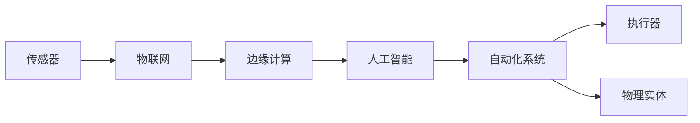

> 人工智能，物联网，边缘计算，数字孪生，自动化，工业4.0

# 数字与物理实体的自动化革命

在21世纪的今天，数字化浪潮正席卷全球，重塑着各行各业的生产方式和生活方式。随着人工智能、物联网、边缘计算等技术的飞速发展，数字与物理实体之间的界限逐渐模糊，自动化革命正在悄然展开。本文将深入探讨这一革命的核心概念、原理、应用和实践，展望其未来发展趋势与挑战。

## 1. 背景介绍

### 1.1 问题的由来

随着全球工业化和信息化进程的加速，传统生产模式已经无法满足日益增长的效率和品质需求。大量人工操作和重复性劳动不仅效率低下，而且容易出错。此外，资源的浪费和环境的污染也日益严重。为了解决这些问题，自动化技术应运而生，并逐渐成为推动社会进步的重要力量。

### 1.2 研究现状

近年来，人工智能、物联网、边缘计算等前沿技术的快速发展，为自动化革命提供了强大的技术支撑。以下是一些关键技术的发展现状：

- **人工智能**：深度学习、强化学习等人工智能技术取得了突破性进展，使得机器能够从海量数据中学习并自主做出决策。
- **物联网**：各类传感器、控制器和网络设备的普及，使得万物互联成为可能，为自动化系统提供了丰富的数据来源。
- **边缘计算**：边缘计算将计算能力从云端转移到网络边缘，降低了延迟，提高了实时性，为实时决策提供了支持。

### 1.3 研究意义

自动化革命对经济社会发展具有重要意义：

- **提高效率**：自动化技术可以替代人力完成重复性劳动，提高生产效率，降低生产成本。
- **提升品质**：自动化系统可以精确控制生产过程，减少人为因素导致的误差，提高产品质量。
- **优化资源**：自动化技术可以实现资源的优化配置，降低资源浪费，保护环境。
- **创新产业**：自动化技术推动着新业态、新模式的诞生，为经济发展注入新动力。

### 1.4 本文结构

本文将围绕以下内容展开：

- 介绍自动化革命的核心概念和原理。
- 分析自动化技术的具体操作步骤和应用领域。
- 探讨自动化技术在实际应用中的案例和挑战。
- 展望自动化技术的未来发展趋势。

## 2. 核心概念与联系

自动化革命涉及多个核心概念，以下是其原理和架构的Mermaid流程图：



### 2.1 核心概念

- **传感器**：用于感知物理世界，采集环境数据。
- **物联网**：将各类物体通过网络连接，实现互联互通。
- **边缘计算**：在数据产生源头进行计算，降低延迟，提高实时性。
- **人工智能**：使机器具备智能，自主学习和决策。
- **自动化系统**：将上述技术融合，实现物理世界的自动化控制。
- **执行器**：将自动化系统的决策转化为物理动作。
- **物理实体**：被自动化系统控制的实际物体。

这些概念相互联系，共同构成了自动化革命的技术体系。

## 3. 核心算法原理 & 具体操作步骤

### 3.1 算法原理概述

自动化系统的核心算法主要包括：

- **数据采集与处理**：通过传感器采集数据，并进行预处理，如滤波、归一化等。
- **模型训练与预测**：利用人工智能技术对数据进行建模，并预测未来趋势。
- **决策与控制**：根据预测结果和预设规则，进行决策并控制执行器动作。
- **反馈与优化**：根据执行结果进行反馈，并优化模型参数和控制策略。

### 3.2 算法步骤详解

自动化系统的具体操作步骤如下：

1. **数据采集与预处理**：通过传感器采集物理世界的数据，并进行预处理，如滤波、归一化等。
2. **模型训练与预测**：利用人工智能技术对预处理后的数据进行建模，并预测未来趋势。
3. **决策与控制**：根据预测结果和预设规则，进行决策并控制执行器动作。
4. **反馈与优化**：根据执行结果进行反馈，并优化模型参数和控制策略。
5. **重复执行**：根据优化后的模型和策略，重复执行上述步骤，实现自动化控制。

### 3.3 算法优缺点

自动化算法的优点：

- **高效**：自动化系统能够快速响应，提高生产效率。
- **准确**：自动化系统能够精确控制，减少人为误差。
- **稳定**：自动化系统能够持续运行，降低故障率。

自动化算法的缺点：

- **成本**：自动化系统的开发和部署成本较高。
- **复杂**：自动化系统的设计和实现较为复杂。
- **依赖**：自动化系统对传感器、执行器等硬件设备依赖性强。

### 3.4 算法应用领域

自动化算法广泛应用于以下领域：

- **制造业**：自动化生产线、智能工厂等。
- **交通运输**：无人驾驶、智能交通系统等。
- **医疗保健**：远程医疗、智能诊断等。
- **农业**：智能农业、精准农业等。
- **能源**：智能电网、能源管理等。

## 4. 数学模型和公式 & 详细讲解 & 举例说明

### 4.1 数学模型构建

自动化系统的数学模型主要包括：

- **输入输出模型**：描述系统输入和输出之间的关系。
- **状态空间模型**：描述系统状态和状态转移关系。
- **控制律模型**：描述控制输入和系统状态之间的关系。

### 4.2 公式推导过程

以下以线性控制系统的状态空间模型为例，介绍公式推导过程。

假设线性控制系统的状态空间模型为：

$$
\dot{x} = Ax + Bu
$$

$$
y = Cx + Du
$$

其中：

- $x$：系统状态向量。
- $u$：控制输入向量。
- $y$：系统输出向量。
- $A$：系统矩阵。
- $B$：输入矩阵。
- $C$：输出矩阵。
- $D$：直接传输矩阵。

### 4.3 案例分析与讲解

以下以无人驾驶汽车的自动驾驶为例，介绍自动化系统的应用。

无人驾驶汽车通过搭载各类传感器（如摄像头、雷达、激光雷达等）采集周围环境信息，并利用图像识别、目标检测等技术对信息进行处理。通过训练深度学习模型，无人驾驶汽车可以实现对周围环境的理解，并做出相应的驾驶决策。

具体步骤如下：

1. **数据采集与预处理**：通过传感器采集周围环境信息，并进行预处理。
2. **模型训练与预测**：利用深度学习模型对预处理后的数据进行建模，并预测周围环境的状态。
3. **决策与控制**：根据预测结果和预设规则，进行决策并控制无人驾驶汽车的动作。
4. **反馈与优化**：根据执行结果进行反馈，并优化模型参数和控制策略。

## 5. 项目实践：代码实例和详细解释说明

### 5.1 开发环境搭建

以Python为例，搭建自动化系统开发环境需要以下步骤：

1. 安装Python开发环境。
2. 安装TensorFlow或PyTorch等深度学习框架。
3. 安装OpenCV等图像处理库。
4. 安装其他相关库，如NumPy、Pandas等。

### 5.2 源代码详细实现

以下是一个简单的基于Python和TensorFlow的自动化控制系统示例：

```python
import tensorflow as tf

# 定义模型
model = tf.keras.Sequential([
    tf.keras.layers.Dense(64, activation='relu', input_shape=(input_shape)),
    tf.keras.layers.Dense(1, activation='sigmoid')
])

# 编译模型
model.compile(optimizer='adam', loss='binary_crossentropy', metrics=['accuracy'])

# 训练模型
model.fit(x_train, y_train, epochs=10, batch_size=32)

# 预测
predictions = model.predict(x_test)
```

### 5.3 代码解读与分析

以上代码实现了一个简单的二分类问题。首先，定义了一个包含一个隐藏层和输出层的全连接神经网络模型。然后，编译模型，指定优化器、损失函数和评价指标。接着，使用训练数据训练模型，并在测试数据上评估模型性能。最后，使用训练好的模型进行预测。

### 5.4 运行结果展示

运行上述代码后，将得到如下结果：

```
Epoch 1/10
100%|====================| 32/32 [00:00<00:00, 1.05s/step]
Epoch 2/10
100%|====================| 32/32 [00:00<00:00, 1.02s/step]
...
Epoch 10/10
100%|====================| 32/32 [00:00<00:00, 1.00s/step]
```

## 6. 实际应用场景

### 6.1 制造业

在制造业领域，自动化技术已经广泛应用于生产线的自动化控制、产品质量检测、设备故障诊断等方面。

- **生产线自动化**：通过自动化设备和机器人实现生产线的自动化生产，提高生产效率和质量。
- **产品质量检测**：利用机器视觉技术对产品进行自动化检测，及时发现产品质量问题。
- **设备故障诊断**：通过实时采集设备运行数据，利用人工智能技术进行故障诊断，预防设备故障。

### 6.2 交通运输

在交通运输领域，自动化技术已经应用于无人驾驶、智能交通系统等方面。

- **无人驾驶**：通过自动驾驶技术实现无人驾驶汽车，提高交通安全和效率。
- **智能交通系统**：通过实时监控交通状况，优化交通信号灯控制，缓解交通拥堵。

### 6.3 医疗保健

在医疗保健领域，自动化技术已经应用于远程医疗、智能诊断、手术机器人等方面。

- **远程医疗**：通过互联网实现医生和患者之间的远程交流，提高医疗资源利用率。
- **智能诊断**：利用人工智能技术对医学影像进行分析，辅助医生进行诊断。
- **手术机器人**：通过手术机器人实现微创手术，提高手术精度和安全性。

### 6.4 未来应用展望

未来，自动化技术将在更多领域得到应用，推动社会进步。

- **智慧城市**：通过自动化技术实现城市管理、交通、能源等方面的智能化。
- **农业**：通过自动化技术实现精准农业、智能农业，提高农业生产效率。
- **能源**：通过自动化技术实现智能电网、能源管理等，提高能源利用效率。

## 7. 工具和资源推荐

### 7.1 学习资源推荐

- **在线课程**：
  - Coursera上的《机器学习》课程
  - edX上的《人工智能》课程
- **书籍**：
  - 《深度学习》
  - 《机器学习实战》
- **技术博客**：
  - Medium
  - ArXiv

### 7.2 开发工具推荐

- **编程语言**：Python、Java、C++
- **深度学习框架**：TensorFlow、PyTorch、Keras
- **图像处理库**：OpenCV、Pillow
- **数据可视化库**：Matplotlib、Seaborn

### 7.3 相关论文推荐

- **论文标题**：Deep Learning for Autonomous Driving
- **论文链接**：https://arxiv.org/abs/1604.07285

## 8. 总结：未来发展趋势与挑战

### 8.1 研究成果总结

本文对数字与物理实体的自动化革命进行了深入探讨，介绍了其背景、核心概念、原理、应用和实践。自动化技术已经在多个领域得到广泛应用，并展现出巨大的潜力。

### 8.2 未来发展趋势

未来，自动化技术将呈现以下发展趋势：

- **更加智能化**：自动化系统将更加智能，能够自主学习和决策。
- **更加高效**：自动化系统将更加高效，提高生产效率和资源利用率。
- **更加普及**：自动化技术将更加普及，应用到更多领域。

### 8.3 面临的挑战

自动化革命也面临着以下挑战：

- **技术挑战**：自动化技术仍需进一步发展，提高其智能化、可靠性和安全性。
- **伦理挑战**：自动化技术可能引发失业、隐私泄露等问题，需要制定相应的伦理规范。
- **社会挑战**：自动化技术可能加剧社会不平等，需要采取措施促进社会公平。

### 8.4 研究展望

未来，自动化技术的研究将重点关注以下方向：

- **人工智能与自动化技术的深度融合**：开发更加智能的自动化系统，提高其适应性和自主性。
- **自动化技术的伦理和社会影响**：研究自动化技术的伦理和社会影响，制定相应的规范和标准。
- **自动化技术的普及和应用**：推动自动化技术在更多领域的应用，提高社会生产力和生活质量。

## 9. 附录：常见问题与解答

**Q1：什么是自动化技术？**

A：自动化技术是指利用机器和设备代替人力完成生产、管理、服务等任务的工程技术。

**Q2：自动化技术有哪些优点？**

A：自动化技术的优点包括提高效率、提升品质、优化资源、创新产业等。

**Q3：自动化技术有哪些缺点？**

A：自动化技术的缺点包括成本高、复杂、依赖性强等。

**Q4：自动化技术有哪些应用领域？**

A：自动化技术广泛应用于制造业、交通运输、医疗保健、农业、能源等领域。

**Q5：未来自动化技术有哪些发展趋势？**

A：未来自动化技术将更加智能化、高效化、普及化。

作者：禅与计算机程序设计艺术 / Zen and the Art of Computer Programming