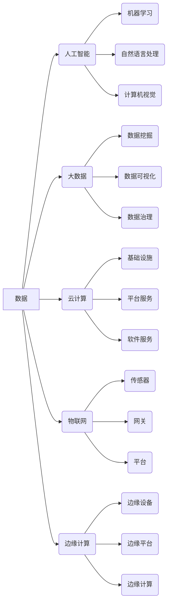

# 数智新时代的特征与发展

> 关键词：数智化、数字化转型、人工智能、大数据、物联网、云计算、边缘计算、智能技术、产业升级

## 1. 背景介绍

随着信息技术的飞速发展，我们正迈入一个全新的时代——数智新时代。这是一个以数据为核心驱动力，以智能化技术为支撑，推动社会经济发展和产业升级的时代。数智化转型已成为各国政府和企业共同追求的目标，成为推动全球经济增长的新引擎。

### 1.1 问题的由来

在传统经济发展模式中，资源、能源、人力等生产要素是经济增长的主要动力。然而，随着全球资源的日益紧张和人口红利的逐渐消失，传统经济发展模式难以为继。为此，各国政府和企业纷纷寻求新的发展模式，以应对日益严峻的挑战。

### 1.2 研究现状

数智化转型已成为全球共识，各国政府和企业纷纷投入巨资进行数字化、智能化改造。目前，数智化转型已取得了显著成果，主要体现在以下几个方面：

- **数字化转型**：企业通过引入信息化技术，优化业务流程，提高运营效率。
- **智能化升级**：利用人工智能、大数据、物联网等技术，提升产品和服务的智能化水平。
- **产业升级**：推动传统产业向高技术、高附加值产业转型升级。

### 1.3 研究意义

研究数智新时代的特征与发展，对于推动我国经济社会发展具有重要意义：

- **提升产业竞争力**：通过数智化转型，提高企业生产效率和产品质量，增强产业竞争力。
- **优化资源配置**：利用大数据、云计算等技术，实现资源优化配置，提高资源利用率。
- **创新社会治理**：利用智能化技术，提升政府治理能力，提高公共服务水平。
- **改善民生福祉**：通过智能技术，改善人民生活质量，提高幸福感。

### 1.4 本文结构

本文将从以下方面对数智新时代的特征与发展进行探讨：

- 核心概念与联系
- 核心算法原理与操作步骤
- 数学模型与公式
- 项目实践
- 实际应用场景
- 未来应用展望
- 工具和资源推荐
- 总结与展望

## 2. 核心概念与联系

### 2.1 核心概念

数智新时代涉及多个核心概念，以下是其中一些关键概念：

- **数据**：数据是数智新时代的核心驱动力，是各类智能技术的基础。
- **人工智能**：通过模拟、延伸和扩展人类智能，实现机器学习、自然语言处理、计算机视觉等应用。
- **大数据**：指规模巨大、类型多样的数据集合，通过分析挖掘，发现有价值的信息和知识。
- **云计算**：通过互联网提供计算资源，实现弹性、按需的IT服务。
- **物联网**：将万物互联，实现设备之间的智能交互和协同。
- **边缘计算**：将计算任务从云端迁移到边缘设备，降低延迟，提高效率。

### 2.2 核心概念联系

以下Mermaid流程图展示了数智新时代核心概念之间的联系：



从图中可以看出，数据是数智新时代的核心，是连接各个智能化技术的纽带。人工智能、大数据、云计算、物联网、边缘计算等技术在数智化转型中发挥着重要作用，共同推动产业升级和社会发展。

## 3. 核心算法原理 & 具体操作步骤

### 3.1 算法原理概述

数智新时代的核心算法主要包括以下几种：

- **机器学习**：通过训练模型，使模型能够从数据中学习规律，进行预测和决策。
- **深度学习**：一种特殊的机器学习算法，通过模拟人脑神经元结构，实现复杂任务的学习。
- **自然语言处理**：使计算机能够理解和生成人类语言，实现人机交互。
- **计算机视觉**：使计算机能够理解和解释图像和视频，实现图像识别、目标检测等应用。

### 3.2 算法步骤详解

以下以机器学习为例，介绍核心算法的步骤：

1. **数据收集**：从各种渠道收集数据，如传感器数据、网络数据、企业数据等。
2. **数据预处理**：对收集到的数据进行清洗、转换、标准化等处理，提高数据质量。
3. **特征工程**：从原始数据中提取有价值的特征，为模型学习提供支持。
4. **模型选择**：根据任务需求，选择合适的机器学习模型。
5. **模型训练**：使用训练数据对模型进行训练，使模型学会数据中的规律。
6. **模型评估**：使用验证数据对模型进行评估，判断模型的性能。
7. **模型部署**：将训练好的模型部署到实际应用中。

### 3.3 算法优缺点

以下列举几种核心算法的优缺点：

- **机器学习**：
  - 优点：通用性强，适用于各种数据类型和任务。
  - 缺点：需要大量标注数据，模型可解释性较差。
- **深度学习**：
  - 优点：能够处理复杂任务，模型性能优越。
  - 缺点：训练数据量大，训练时间长，模型可解释性较差。
- **自然语言处理**：
  - 优点：能够理解和生成人类语言，实现人机交互。
  - 缺点：数据依赖性强，模型复杂度高。
- **计算机视觉**：
  - 优点：能够理解和解释图像和视频，实现图像识别、目标检测等应用。
  - 缺点：数据依赖性强，模型复杂度高。

### 3.4 算法应用领域

核心算法在数智新时代的应用领域非常广泛，以下列举一些典型应用：

- **智能推荐**：根据用户行为和喜好，推荐个性化内容。
- **智能客服**：实现自动问答、智能客服等应用。
- **智能驾驶**：实现自动驾驶、辅助驾驶等功能。
- **智能医疗**：辅助医生诊断、预测疾病等应用。
- **智能金融**：实现智能风控、智能投顾等应用。

## 4. 数学模型和公式 & 详细讲解 & 举例说明

### 4.1 数学模型构建

以下以线性回归为例，介绍数学模型构建过程：

- **假设**：输入特征为 $x$，输出值为 $y$，模型假设为 $y = w_0 + w_1x + \varepsilon$，其中 $w_0, w_1$ 为模型参数，$\varepsilon$ 为误差项。
- **损失函数**：采用均方误差损失函数，即 $L(w_0, w_1) = \frac{1}{2}\sum_{i=1}^n (y_i - (w_0 + w_1x_i))^2$。
- **优化目标**：最小化损失函数，即 $\min_{w_0, w_1} L(w_0, w_1)$。

### 4.2 公式推导过程

以下是线性回归损失函数的推导过程：

$$
\begin{aligned}
L(w_0, w_1) &= \frac{1}{2}\sum_{i=1}^n (y_i - (w_0 + w_1x_i))^2 \\
&= \frac{1}{2}\sum_{i=1}^n (y_i^2 + w_1^2x_i^2 - 2w_1x_iy_i - 2w_0y_i) \\
&= \frac{1}{2}\sum_{i=1}^n y_i^2 + \frac{1}{2}w_1^2\sum_{i=1}^n x_i^2 - w_1\sum_{i=1}^n x_iy_i - w_0\sum_{i=1}^n y_i \\
&= \frac{1}{2}\sum_{i=1}^n y_i^2 + \frac{1}{2}w_1^2x_1^2 - w_1x_1y_1 - w_0y_1 + \frac{1}{2}w_1^2x_2^2 - w_1x_2y_2 - w_0y_2 + \cdots + \frac{1}{2}w_1^2x_n^2 - w_1x_ny_n - w_0y_n
\end{aligned}
$$

### 4.3 案例分析与讲解

以下以房价预测为例，讲解线性回归的应用：

- **数据集**：收集多个城市的房价、面积、绿化率等数据。
- **模型**：选择线性回归模型，假设房价 $y$ 与面积 $x$ 之间满足线性关系。
- **训练**：使用房价和面积数据训练线性回归模型。
- **预测**：使用训练好的模型预测新城市的房价。

## 5. 项目实践：代码实例和详细解释说明

### 5.1 开发环境搭建

使用Python进行项目开发，需要安装以下库：

- NumPy：用于科学计算。
- Pandas：用于数据处理。
- Matplotlib：用于数据可视化。
- Scikit-learn：用于机器学习。

### 5.2 源代码详细实现

以下是一个简单的线性回归项目示例：

```python
import numpy as np
import pandas as pd
from sklearn.linear_model import LinearRegression
from sklearn.metrics import mean_squared_error

# 加载数据
data = pd.read_csv('data.csv')

# 特征和标签
X = data[['area', 'green_area']]
y = data['price']

# 训练模型
model = LinearRegression()
model.fit(X, y)

# 预测
predictions = model.predict(X)

# 评估
mse = mean_squared_error(y, predictions)
print(f'Mean Squared Error: {mse}')
```

### 5.3 代码解读与分析

以上代码展示了使用Scikit-learn库进行线性回归的完整过程。首先，我们加载数据并提取特征和标签。然后，使用`LinearRegression`类创建线性回归模型，并通过`fit`方法进行训练。最后，使用训练好的模型对特征进行预测，并计算均方误差(MSE)评估模型性能。

### 5.4 运行结果展示

运行以上代码，将输出均方误差(MSE)结果。MSE越低，说明模型预测精度越高。

## 6. 实际应用场景

### 6.1 智能推荐

智能推荐系统在电商、视频、音乐等领域得到广泛应用。通过分析用户行为数据，推荐用户可能感兴趣的商品或内容。

### 6.2 智能客服

智能客服系统可以自动回答用户问题，提高客户服务效率，降低企业运营成本。

### 6.3 智能驾驶

智能驾驶技术可以帮助汽车实现自动驾驶，提高行车安全，降低交通事故发生率。

### 6.4 智能医疗

智能医疗技术可以帮助医生进行诊断、治疗和康复，提高医疗质量，降低医疗成本。

### 6.5 智能金融

智能金融技术可以帮助金融机构进行风险评估、欺诈检测和投资决策，提高金融效率，降低金融风险。

## 7. 未来应用展望

未来，数智化技术将在更多领域得到应用，推动产业升级和社会发展。

### 7.1 智能城市

通过物联网、大数据、人工智能等技术，实现城市智能管理、智慧交通、智慧环保等功能。

### 7.2 智能制造

通过工业互联网、智能制造技术，实现生产过程的自动化、智能化，提高生产效率和产品质量。

### 7.3 智慧农业

通过物联网、人工智能等技术，实现农业生产过程的智能化管理，提高农业生产效率，保障粮食安全。

### 7.4 智慧教育

通过人工智能、虚拟现实等技术，实现个性化教育、远程教育等功能，提高教育质量。

## 8. 工具和资源推荐

### 8.1 学习资源推荐

- 《Python编程：从入门到实践》
- 《深度学习》
- 《人工智能：一种现代的方法》
- 《机器学习实战》
- 《大数据时代》

### 8.2 开发工具推荐

- Python：一门解释型、高级编程语言，广泛应用于数据科学、机器学习等领域。
- Jupyter Notebook：一款流行的数据科学工具，支持代码、公式、图表等多种内容。
- TensorFlow：一款开源的机器学习框架，支持多种机器学习算法。
- PyTorch：一款开源的深度学习框架，具有良好的可扩展性和灵活性。
- Scikit-learn：一款开源的机器学习库，包含多种机器学习算法和工具。

### 8.3 相关论文推荐

- "Deep Learning: A Brief Overview" by Yoshua Bengio
- "The Unreasonable Effectiveness of Deep Learning" by Geoffrey Hinton
- "Large-scale Language Modeling for Unsupervised Learning" by Tomas Mikolov, Kai Chen, Greg Corrado, and Jeffrey Dean
- "BERT: Pre-training of Deep Bidirectional Transformers for Language Understanding" by Jacob Devlin, Ming-Wei Chang, Kenton Lee, and Kristina Toutanova
- "Attention Is All You Need" by Ashish Vaswani, Noam Shazeer, Niki Parmar, Jakob Uszkoreit, Llion Jones, Aidan N. Gomez, Jesus Luis Gomez, Christopher Chiang, and Ilya Sutskever

## 9. 总结：未来发展趋势与挑战

### 9.1 研究成果总结

数智化转型已成为全球共识，数智新时代的特征与发展主要体现在数据驱动、智能化升级、产业升级等方面。核心算法如机器学习、深度学习、自然语言处理等在数智化转型中发挥着重要作用。

### 9.2 未来发展趋势

未来，数智化技术将在更多领域得到应用，推动产业升级和社会发展。以下是未来发展趋势：

- **数据驱动**：数据将成为企业、产业和社会发展的重要驱动力。
- **智能化升级**：智能化技术将在各个领域得到广泛应用，提高生产效率和产品质量。
- **产业升级**：传统产业将向高技术、高附加值产业转型升级。
- **跨界融合**：数智化技术与各个领域的跨界融合将不断涌现，创造新的应用场景。

### 9.3 面临的挑战

数智化转型也面临着诸多挑战，主要包括：

- **数据安全与隐私保护**：数据安全和隐私保护是数智化转型面临的重要挑战。
- **算法偏见与公平性**：算法偏见和公平性问题是数智化技术发展的重要瓶颈。
- **技术伦理与责任**：数智化技术发展需要关注技术伦理和责任问题。
- **人才短缺**：数智化转型需要大量具备相关技能的人才。

### 9.4 研究展望

未来，数智化技术将在以下方面进行深入研究：

- **数据治理**：研究数据治理的最佳实践，确保数据安全和隐私保护。
- **算法公平性**：研究算法公平性方法，消除算法偏见。
- **技术伦理**：研究数智化技术伦理，确保技术发展符合人类价值观。
- **人才培养**：加强数智化人才培养，为数智化转型提供人才保障。

数智化转型是时代发展的必然趋势，只有积极应对挑战，抓住机遇，才能在数智新时代立于不败之地。

---

作者：禅与计算机程序设计艺术 / Zen and the Art of Computer Programming