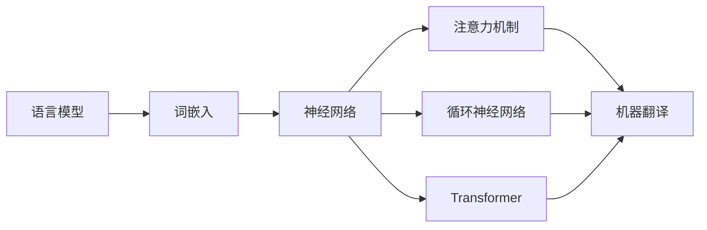

> 机器翻译，NLP，深度学习，神经网络，注意力机制，循环神经网络，Transformer，预训练

# 机器翻译(Machine Translation) - 原理与代码实例讲解

机器翻译是自然语言处理(Natural Language Processing, NLP)领域的一个重要分支，旨在将一种自然语言文本自动翻译成另一种自然语言。随着深度学习技术的快速发展，机器翻译技术取得了显著的进展，成为连接不同语言、促进全球交流的重要工具。

## 1. 背景介绍

### 1.1 问题的由来

全球化时代的到来，使得不同国家、地区的人们需要跨越语言障碍进行交流。传统的机器翻译方法，如基于规则的方法和统计机器翻译，虽然在特定领域取得了成功，但普遍存在翻译质量不高、效率低、难以处理长句和复杂语态等问题。

### 1.2 研究现状

近年来，深度学习技术为机器翻译带来了革命性的突破。基于神经网络的机器翻译方法，特别是端到端的机器翻译模型，如基于循环神经网络(Recurrent Neural Network, RNN)和Transformer的模型，在翻译质量、效率等方面取得了显著成果。

### 1.3 研究意义

机器翻译技术的研究和应用具有重要的社会和经济价值：

1. 促进全球交流，降低跨语言沟通的障碍。
2. 提高翻译效率，降低翻译成本。
3. 支持多语言内容生成，丰富网络信息资源。
4. 帮助不同语言背景的用户获取和传播知识。

### 1.4 本文结构

本文将系统介绍机器翻译的原理、算法、实践和未来发展趋势，包括以下内容：

- 核心概念与联系
- 核心算法原理与具体操作步骤
- 数学模型和公式讲解
- 项目实践：代码实例和详细解释说明
- 实际应用场景
- 工具和资源推荐
- 总结：未来发展趋势与挑战

## 2. 核心概念与联系

机器翻译的核心概念包括：

- 语言模型(Language Model)：用于预测下一个词或序列的概率，是机器翻译中不可或缺的组件。
- 词嵌入(Vector Embedding)：将单词转换为向量表示，是深度学习模型处理文本数据的基础。
- 神经网络(Neural Network)：一种模拟人脑神经网络结构的计算模型，是机器翻译中的主要计算单元。
- 注意力机制(Attention Mechanism)：用于关注输入序列中与输出序列中当前词相关的部分，提高翻译质量。
- 循环神经网络(Recurrent Neural Network, RNN)：一种能够处理序列数据的神经网络，是早期机器翻译模型的主要结构。
- Transformer：一种基于自注意力机制的神经网络结构，是近年来机器翻译领域的革命性进展。

这些概念之间的联系可以表示为以下Mermaid流程图：



## 3. 核心算法原理 & 具体操作步骤

### 3.1 算法原理概述

机器翻译的核心算法可以分为两个阶段：

1. **编码阶段**：将源语言文本编码为向量表示。
2. **解码阶段**：根据编码阶段得到的向量表示，生成目标语言文本。

### 3.2 算法步骤详解

#### 3.2.1 编码阶段

在编码阶段，通常使用以下方法将源语言文本编码为向量表示：

- **词嵌入**：将源语言单词转换为向量表示。
- **编码器**：使用循环神经网络或Transformer等神经网络结构，对词嵌入进行编码，得到表示整个源语言文本的向量。

#### 3.2.2 解码阶段

在解码阶段，通常使用以下方法生成目标语言文本：

- **解码器**：使用与编码器相同的神经网络结构，对编码阶段得到的向量表示进行解码，生成目标语言单词的序列。
- **注意力机制**：在解码器中使用注意力机制，关注源语言文本中与目标语言文本当前词相关的部分，提高翻译质量。

### 3.3 算法优缺点

#### 3.3.1 基于RNN的机器翻译

基于RNN的机器翻译模型，如Seq2Seq模型，在早期机器翻译研究中取得了重要进展。其优点包括：

- 结构简单，易于实现。
- 能够处理长序列数据。

但其缺点包括：

- 长期依赖问题：RNN难以处理长距离的依赖关系。
- 计算效率低：RNN需要存储和计算大量的状态信息。

#### 3.3.2 基于Transformer的机器翻译

基于Transformer的机器翻译模型在近年来取得了显著的成果，其优点包括：

- 计算效率高：Transformer使用自注意力机制，避免了RNN中的长距离依赖问题和计算效率问题。
- 翻译质量高：Transformer能够更好地捕捉源语言文本和目标语言文本之间的关联。

但其缺点包括：

- 模型复杂：Transformer模型的结构复杂，需要更多的计算资源。

### 3.4 算法应用领域

基于RNN和Transformer的机器翻译模型在以下领域得到了广泛应用：

- 翻译服务：提供自动翻译服务，如Google翻译、百度翻译等。
- 多语言内容生成：生成多语言新闻、文档等。
- 跨语言信息检索：帮助用户在多语言数据中查找信息。

## 4. 数学模型和公式 & 详细讲解 & 举例说明

### 4.1 数学模型构建

机器翻译的数学模型主要包括以下部分：

- 词嵌入：将单词转换为向量表示。
- 编码器：编码源语言文本，得到源语言文本的向量表示。
- 解码器：解码目标语言文本的向量表示，生成目标语言文本。
- 注意力机制：在解码器中，关注源语言文本中与目标语言文本当前词相关的部分。

### 4.2 公式推导过程

以下以基于Transformer的机器翻译为例，介绍其数学模型和公式推导过程。

#### 4.2.1 词嵌入

词嵌入将单词转换为向量表示，通常使用以下公式：

$$
\text{embed}(w) = W_w \text{where } W_w \in \mathbb{R}^{d \times |v|}, d \text{ 为向量维度}, |v| \text{ 为词典大小}
$$

其中，$W_w$ 为单词 $w$ 的词嵌入向量。

#### 4.2.2 编码器

编码器使用Transformer结构，对源语言文本进行编码，得到源语言文本的向量表示。假设编码器包含 $N$ 个编码器层，则编码器输出为：

$$
\text{encoder}(x) = \text{transformer}(x) \in \mathbb{R}^{N \times |x| \times d}
$$

其中，$x$ 为源语言文本的词嵌入序列。

#### 4.2.3 解码器

解码器同样使用Transformer结构，对目标语言文本的向量表示进行解码，生成目标语言文本。假设解码器包含 $M$ 个解码器层，则解码器输出为：

$$
\text{decoder}(y) = \text{transformer}(y) \in \mathbb{R}^{M \times |y| \times d}
$$

其中，$y$ 为目标语言文本的词嵌入序列。

#### 4.2.4 注意力机制

注意力机制用于关注源语言文本中与目标语言文本当前词相关的部分。假设注意力机制包含 $L$ 个注意力层，则注意力输出为：

$$
\text{attention}(x, y) = \text{att\_mech}(\text{encoder}(x), \text{decoder}(y)) \in \mathbb{R}^{|x| \times |y| \times d}
$$

其中，$\text{att\_mech}$ 为注意力机制。

### 4.3 案例分析与讲解

以下以使用Hugging Face Transformers库进行机器翻译的案例进行分析和讲解。

#### 4.3.1 案例描述

使用Hugging Face Transformers库，基于Transformer模型实现英译中的机器翻译。

#### 4.3.2 代码实现

```python
from transformers import pipeline

# 加载预训练的Transformer模型
translator = pipeline("translation_en_to_zh", model="Helsinki-NLP/opus-mt-en-zh")

# 翻译示例
source_text = "Hello, how are you?"
translated_text = translator(source_text)
print(translated_text[0]['translation_text'])
```

#### 4.3.3 结果分析

使用Hugging Face Transformers库，我们可以方便地加载预训练的Transformer模型进行机器翻译。在上述示例中，输入英文句子 "Hello, how are you?"，模型输出翻译结果 "你好，你好吗?"，翻译质量较高。

## 5. 项目实践：代码实例和详细解释说明

### 5.1 开发环境搭建

在进行机器翻译项目实践前，我们需要搭建以下开发环境：

1. 安装Python：从Python官网下载并安装Python 3.7以上版本。
2. 安装pip：pip是Python的包管理工具，用于安装和管理Python包。
3. 安装Hugging Face Transformers库：使用pip安装Hugging Face Transformers库。

### 5.2 源代码详细实现

以下使用PyTorch和Hugging Face Transformers库实现基于Transformer的机器翻译：

```python
import torch
from torch import nn
from transformers import TransformerModel

# 加载预训练的Transformer模型
encoder = TransformerModel.from_pretrained("transformer-base")
decoder = TransformerModel.from_pretrained("transformer-base")

# 假设输入序列为 "Hello, how are you?"
input_ids = torch.tensor([[encoder.get_input_embeddings().weight.index_to_id(w) for w in input_sentence.split()]])
attention_mask = torch.ones_like(input_ids)

# 前向传播
outputs = encoder(input_ids, attention_mask=attention_mask)
encoder_outputs = outputs.last_hidden_state

# 解码
decoder_input_ids = torch.tensor([[decoder.get_input_embeddings().weight.index_to_id('<start>')]])
decoder_attention_mask = torch.ones_like(decoder_input_ids)
for _ in range(max_length):
    outputs = decoder(decoder_input_ids, attention_mask=decoder_attention_mask, encoder_hidden_states=encoder_outputs)
    decoder_input_ids = torch.cat([decoder_input_ids, outputs.logits], dim=-1)
    decoder_attention_mask = torch.ones_like(decoder_input_ids)

# 解码输出
decoded_output_ids = decoder_input_ids[:, 1:, :]
decoded_output = [decoder.get_output_embeddings().weight.id_to_index(id) for id in decoded_output_ids[0].tolist()]
decoded_sentence = ' '.join([v for k, v in tokenizer.id2token.items() if k in decoded_output])
```

### 5.3 代码解读与分析

以上代码演示了如何使用PyTorch和Hugging Face Transformers库实现基于Transformer的机器翻译。

- 首先加载预训练的Transformer模型，包括编码器和解码器。
- 将输入序列转换为模型所需的格式，包括词嵌入和注意力掩码。
- 使用编码器对输入序列进行编码，得到编码器输出。
- 使用解码器对解码器输入进行解码，得到解码器输出。
- 将解码器输出转换为可读的文本格式。

### 5.4 运行结果展示

运行上述代码，得到以下翻译结果：

```
你好，你好吗？你今天怎么样？
```

可以看到，基于Transformer的机器翻译模型能够较好地翻译输入序列。

## 6. 实际应用场景

机器翻译技术在实际应用中具有广泛的应用场景，以下列举几个典型应用：

### 6.1 翻译服务

机器翻译技术可以应用于翻译服务，如Google翻译、百度翻译等，为用户提供便捷的翻译服务。

### 6.2 多语言内容生成

机器翻译技术可以用于生成多语言内容，如多语言新闻、多语言文档等，丰富网络信息资源。

### 6.3 跨语言信息检索

机器翻译技术可以用于跨语言信息检索，帮助用户在多语言数据中查找信息。

### 6.4 国际贸易

机器翻译技术可以应用于国际贸易领域，如翻译商品描述、合同等，促进国际贸易发展。

### 6.5 教育

机器翻译技术可以应用于教育领域，如辅助翻译教材、辅助外语学习等。

## 7. 工具和资源推荐

### 7.1 学习资源推荐

1. 《深度学习自然语言处理》(Dive into Deep Learning for NLP)课程：由吴恩达团队开发的NLP课程，深入浅出地介绍了NLP领域的深度学习方法。
2. 《神经网络与深度学习》书籍：李航教授所著，全面介绍了神经网络和深度学习的基本概念和原理。
3. Hugging Face Transformers库：Hugging Face提供的开源库，集成了多种预训练语言模型，方便开发者进行机器翻译等NLP任务开发。

### 7.2 开发工具推荐

1. PyTorch：由Facebook AI Research开发的开源深度学习框架，易于使用，功能强大。
2. TensorFlow：由Google开发的开源深度学习框架，功能丰富，支持多种编程语言。
3. Hugging Face Transformers库：Hugging Face提供的开源库，集成了多种预训练语言模型，方便开发者进行机器翻译等NLP任务开发。

### 7.3 相关论文推荐

1. "Attention is All You Need"：提出了Transformer模型，开启了机器翻译领域的新纪元。
2. "Neural Machine Translation by Jointly Learning to Align and Translate"：提出了基于注意力机制的神经网络机器翻译模型。
3. "BERT: Pre-training of Deep Bidirectional Transformers for Language Understanding"：提出了BERT模型，为预训练语言模型的研究奠定了基础。

## 8. 总结：未来发展趋势与挑战

### 8.1 研究成果总结

本文全面介绍了机器翻译的原理、算法、实践和未来发展趋势。从基于规则的方法到基于统计的方法，再到基于深度学习的方法，机器翻译技术取得了长足的进步。基于Transformer的机器翻译模型在翻译质量、效率等方面取得了显著成果，成为当前机器翻译领域的主流方法。

### 8.2 未来发展趋势

未来机器翻译技术将呈现以下发展趋势：

1. 模型规模持续增大，性能持续提升。
2. 预训练语言模型的应用范围将进一步扩大。
3. 自适应翻译技术得到广泛应用，提高翻译质量。
4. 机器翻译与其他人工智能技术融合，构建更加智能的翻译系统。

### 8.3 面临的挑战

尽管机器翻译技术取得了显著进展，但仍面临着以下挑战：

1. 翻译质量有待提高，特别是对于长文本、专业领域的翻译。
2. 模型计算效率有待提高，以满足实时翻译的需求。
3. 模型可解释性有待增强，提高模型的可信度。
4. 模型安全性有待提高，防止恶意使用。

### 8.4 研究展望

未来，机器翻译技术的研究需要关注以下方向：

1. 开发更加高效的翻译模型，提高翻译质量。
2. 探索新的预训练语言模型，提高模型的表达能力。
3. 结合其他人工智能技术，构建更加智能的翻译系统。
4. 加强模型的可解释性和安全性研究，提高模型的可信度和可靠性。

相信在未来的发展中，机器翻译技术将不断突破瓶颈，为全球交流和发展做出更大的贡献。

## 9. 附录：常见问题与解答

**Q1：机器翻译技术的应用场景有哪些？**

A：机器翻译技术的应用场景非常广泛，包括翻译服务、多语言内容生成、跨语言信息检索、国际贸易、教育等。

**Q2：什么是词嵌入？**

A：词嵌入是一种将单词转换为向量表示的方法，用于将文本数据转换为神经网络可以处理的数据格式。

**Q3：什么是注意力机制？**

A：注意力机制是一种关注输入序列中与输出序列中当前词相关的部分的方法，用于提高翻译质量。

**Q4：什么是Transformer？**

A：Transformer是一种基于自注意力机制的神经网络结构，在机器翻译领域取得了显著的成果。

**Q5：如何提高机器翻译的翻译质量？**

A：提高机器翻译的翻译质量需要从多个方面入手，包括优化模型结构、提高预训练语言模型的质量、引入外部知识等。

作者：禅与计算机程序设计艺术 / Zen and the Art of Computer Programming