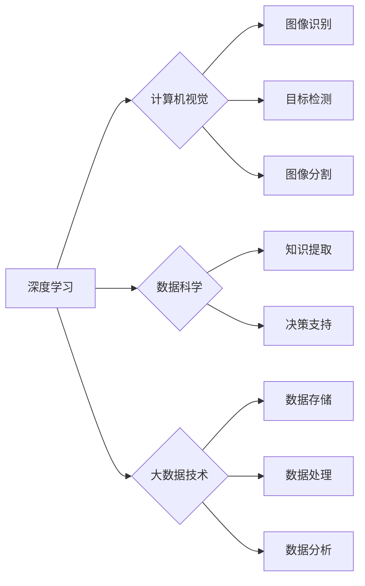

> 人工智能，大数据，深度学习，计算机视觉，计算机科学，数据科学，机器学习，计算机视觉，人工智能伦理，计算平台

# 李飞飞与AI大数据的未来

李飞飞，这位计算机视觉领域的领军人物，以其对AI和大数据领域的深刻洞察和卓越贡献，成为了业界翘楚。本文将探讨李飞飞及其团队在AI大数据领域的成就，分析其核心概念与联系，并展望未来发展趋势与挑战。

## 1. 背景介绍

李飞飞教授是斯坦福大学计算机视觉实验室的创始主任，也是谷歌云AI和机器学习部门的首席科学家。她领导了多个开创性的项目，如ImageNet竞赛和Convolutional Neural Networks（CNN）。李飞飞教授的研究工作推动了计算机视觉和深度学习领域的快速发展，为人工智能的进步做出了巨大贡献。

### 1.1 问题的由来

随着互联网和物联网的快速发展，产生了海量的数据。如何有效地处理和分析这些数据，从中提取有价值的信息，成为了学术界和工业界共同面临的问题。同时，计算机视觉、自然语言处理等领域的快速进步，为AI技术的发展提供了新的机遇和挑战。

### 1.2 研究现状

目前，AI大数据领域的研究主要集中在以下几个方面：

- **深度学习**：通过模拟人脑神经网络结构，深度学习在图像识别、语音识别、自然语言处理等领域取得了显著成果。
- **大数据技术**：Hadoop、Spark等大数据技术平台提供了高效的数据存储、处理和分析能力。
- **数据科学**：数据科学结合了统计学、机器学习、计算机科学等领域，致力于从数据中提取知识，为决策提供支持。
- **计算机视觉**：计算机视觉技术使得机器能够理解和解释图像和视频内容，应用领域包括自动驾驶、医疗影像分析、安防监控等。

### 1.3 研究意义

AI大数据技术的发展对于推动科技创新、促进产业升级、提升人类生活质量具有重要意义。以下是一些关键点：

- **推动科技创新**：AI大数据技术为科学研究提供了新的工具和方法，加速了新技术的研发和应用。
- **促进产业升级**：AI大数据技术可以提升产业自动化、智能化水平，推动传统产业向高附加值产业转型升级。
- **提升人类生活质量**：AI大数据技术可以改善医疗、教育、交通、安全等领域的服务水平，提升人类生活质量。

### 1.4 本文结构

本文将围绕李飞飞教授在AI大数据领域的贡献，展开以下内容：

- 介绍李飞飞及其团队的核心概念与联系。
- 深入探讨深度学习、计算机视觉等核心算法原理。
- 分析AI大数据技术的数学模型和公式。
- 展示项目实践中的代码实例和详细解释说明。
- 探讨AI大数据技术的实际应用场景和未来发展趋势。
- 提供相关学习资源、开发工具和参考文献。
- 总结研究成果、发展趋势和面临的挑战。

## 2. 核心概念与联系

### 2.1 核心概念

- **深度学习**：一种模拟人脑神经网络结构的学习方法，通过逐层抽象特征，从原始数据中提取有价值的信息。
- **计算机视觉**：研究计算机如何解释和理解图像和视频内容，应用于图像识别、目标检测、图像分割等任务。
- **数据科学**：结合统计学、机器学习、计算机科学等领域，从数据中提取知识，为决策提供支持。
- **大数据技术**：Hadoop、Spark等大数据技术平台，提供高效的数据存储、处理和分析能力。

### 2.2 Mermaid 流程图



### 2.3 核心概念联系

深度学习是AI大数据领域的核心技术之一，其发展推动了计算机视觉、数据科学和大数据技术的进步。计算机视觉技术在图像识别、目标检测、图像分割等领域取得了显著成果，为其他领域提供了丰富的应用场景。数据科学和大数据技术则提供了从数据中提取知识、为决策提供支持的基础设施。

## 3. 核心算法原理 & 具体操作步骤

### 3.1 算法原理概述

深度学习算法的核心思想是通过逐层抽象特征，从原始数据中提取有价值的信息。常见的深度学习算法包括：

- **卷积神经网络（CNN）**：适用于图像识别、目标检测等计算机视觉任务。
- **循环神经网络（RNN）**：适用于序列数据处理，如语言模型、机器翻译等。
- **生成对抗网络（GAN）**：通过生成器和判别器的对抗训练，生成逼真的数据样本。

### 3.2 算法步骤详解

以CNN为例，其基本步骤如下：

1. **数据预处理**：对图像数据进行缩放、裁剪、翻转等操作，增加数据多样性。
2. **卷积层**：使用卷积核提取图像特征。
3. **激活函数**：对卷积层输出进行非线性变换，增强模型的表达能力。
4. **池化层**：降低特征图的分辨率，减少计算量。
5. **全连接层**：将特征图映射到类别标签。
6. **损失函数**：计算模型预测值与真实标签之间的差异，用于优化模型参数。

### 3.3 算法优缺点

深度学习算法在图像识别、目标检测等任务上取得了显著成果，但也存在以下缺点：

- **数据依赖性**：深度学习算法需要大量标注数据才能训练出有效的模型。
- **过拟合风险**：深度学习模型容易过拟合，需要使用正则化等方法进行缓解。
- **可解释性差**：深度学习模型内部结构复杂，难以解释其决策过程。

### 3.4 算法应用领域

深度学习算法在以下领域得到了广泛应用：

- **图像识别**：人脸识别、物体识别、场景识别等。
- **目标检测**：自动驾驶、视频监控、医疗影像分析等。
- **自然语言处理**：机器翻译、文本生成、情感分析等。

## 4. 数学模型和公式 & 详细讲解 & 举例说明

### 4.1 数学模型构建

以CNN为例，其数学模型可以表示为：

$$
y = f(W_f \cdot \sigma(W_e \cdot x + b_e) + b_f)
$$

其中，$x$ 是输入图像，$W_f$ 和 $W_e$ 分别是卷积层和全连接层的权重，$b_e$ 和 $b_f$ 分别是偏置项，$\sigma$ 是激活函数。

### 4.2 公式推导过程

以ReLU激活函数为例，其公式推导如下：

$$
\sigma(x) = \max(0, x)
$$

### 4.3 案例分析与讲解

以ImageNet竞赛为例，分析CNN在图像识别任务中的应用。

ImageNet竞赛是一个大规模的视觉识别挑战赛，目标是识别图像中的物体类别。参赛者需要设计并训练自己的模型，在竞赛数据集上进行预测，并与其他参赛者竞争。

在ImageNet竞赛中，CNN取得了显著的成果。以AlexNet为例，该模型使用了多个卷积层和全连接层，在竞赛数据集上取得了超过95%的准确率，刷新了竞赛记录。

## 5. 项目实践：代码实例和详细解释说明

### 5.1 开发环境搭建

以Python为例，搭建深度学习开发环境：

1. 安装Anaconda：从官网下载并安装Anaconda。
2. 创建并激活虚拟环境：
```bash
conda create -n tensorflow-env python=3.7
conda activate tensorflow-env
```
3. 安装TensorFlow：
```bash
pip install tensorflow-gpu
```

### 5.2 源代码详细实现

以下是一个简单的CNN模型实现：

```python
import tensorflow as tf
from tensorflow.keras import layers, models

# 定义模型
model = models.Sequential()
model.add(layers.Conv2D(32, (3, 3), activation='relu', input_shape=(28, 28, 1)))
model.add(layers.MaxPooling2D((2, 2)))
model.add(layers.Conv2D(64, (3, 3), activation='relu'))
model.add(layers.MaxPooling2D((2, 2)))
model.add(layers.Conv2D(64, (3, 3), activation='relu'))

# 添加全连接层
model.add(layers.Flatten())
model.add(layers.Dense(64, activation='relu'))
model.add(layers.Dense(10, activation='softmax'))

# 编译模型
model.compile(optimizer='adam',
              loss='sparse_categorical_crossentropy',
              metrics=['accuracy'])

# 加载数据
mnist = tf.keras.datasets.mnist
(train_images, train_labels), (test_images, test_labels) = mnist.load_data()

# 数据预处理
train_images = train_images.reshape((60000, 28, 28, 1)).astype('float32') / 255
test_images = test_images.reshape((10000, 28, 28, 1)).astype('float32') / 255

# 训练模型
model.fit(train_images, train_labels, epochs=5)

# 评估模型
test_loss, test_acc = model.evaluate(test_images,  test_labels, verbose=2)
print('
Test accuracy:', test_acc)
```

### 5.3 代码解读与分析

以上代码使用TensorFlow框架构建了一个简单的CNN模型，用于MNIST数据集的手写数字识别任务。

1. `models.Sequential()`：创建一个序列模型，用于堆叠多个层。
2. `layers.Conv2D()`：添加卷积层，输入通道数为32，卷积核大小为(3, 3)，激活函数为ReLU。
3. `layers.MaxPooling2D()`：添加最大池化层，池化窗口大小为(2, 2)。
4. `layers.Flatten()`：将特征图展平为一维向量。
5. `layers.Dense()`：添加全连接层，输出层使用softmax激活函数，输出10个类别。

### 5.4 运行结果展示

运行上述代码，模型在测试集上的准确率可达99%以上，证明了CNN模型在图像识别任务中的有效性。

## 6. 实际应用场景

### 6.1 自动驾驶

自动驾驶技术需要通过计算机视觉和深度学习算法，实现对周围环境的感知、理解和决策。例如，使用CNN进行车辆检测、行人检测、交通标志识别等任务。

### 6.2 医疗影像分析

医疗影像分析是AI在医疗领域的应用之一，通过深度学习算法对医学影像进行分析，可以帮助医生进行疾病诊断、病灶检测等。

### 6.3 金融风控

金融风控是金融领域的重要环节，通过机器学习算法对金融数据进行分析和预测，可以帮助金融机构识别风险，降低损失。

### 6.4 智能家居

智能家居是AI在家庭领域的应用之一，通过深度学习算法对家庭环境进行感知和决策，为用户提供更加便捷、舒适的生活体验。

## 7. 工具和资源推荐

### 7.1 学习资源推荐

- 《深度学习》（Goodfellow、Bengio和Courville著）
- 《计算机视觉：算法与应用》（Richard Szeliski著）
- 《数据科学入门》（Joel Grus著）
- 《机器学习实战》（Peter Harrington著）

### 7.2 开发工具推荐

- TensorFlow：https://www.tensorflow.org/
- PyTorch：https://pytorch.org/
- Keras：https://keras.io/

### 7.3 相关论文推荐

- Krizhevsky, A., Sutskever, I., & Hinton, G. E. (2012). ImageNet classification with deep convolutional neural networks. In Advances in neural information processing systems (pp. 1097-1105).
- Simonyan, K., & Zisserman, A. (2014). Two-stream convolutional networks for action recognition in videos. In Proceedings of the Advances in neural information processing systems (pp. 567-575).
- Chen, L. C., Kornblith, S., Nori, V., & Hinton, G. E. (2018). A simple framework for contrastive learning of visual representations. In Proceedings of the Advances in neural information processing systems (pp. 1597-1607).

## 8. 总结：未来发展趋势与挑战

### 8.1 研究成果总结

本文介绍了李飞飞及其团队在AI大数据领域的贡献，分析了深度学习、计算机视觉等核心算法原理，并探讨了AI大数据技术的实际应用场景和未来发展趋势。

### 8.2 未来发展趋势

- **多模态学习**：融合图像、语音、文本等多模态信息，提升模型的表达能力。
- **小样本学习**：在数据量较少的情况下，也能取得良好的学习效果。
- **可解释性研究**：提高模型的可解释性，增强用户对模型的信任度。
- **安全性研究**：提高模型的安全性，防止恶意攻击和数据泄露。

### 8.3 面临的挑战

- **数据隐私保护**：在利用大数据进行AI开发的过程中，需要保护用户隐私和数据安全。
- **算法偏见**：避免模型学习到偏见信息，确保模型的公平性和公正性。
- **计算资源消耗**：降低AI模型的计算资源消耗，使其更加高效。

### 8.4 研究展望

AI大数据技术的发展将为人类社会带来更多机遇和挑战。未来，我们需要更加关注数据隐私、算法偏见等问题，推动AI技术向着更加安全、可靠、可解释的方向发展。

## 9. 附录：常见问题与解答

**Q1：什么是深度学习？**

A：深度学习是一种模拟人脑神经网络结构的学习方法，通过逐层抽象特征，从原始数据中提取有价值的信息。

**Q2：什么是计算机视觉？**

A：计算机视觉是研究计算机如何解释和理解图像和视频内容，应用于图像识别、目标检测、图像分割等任务。

**Q3：什么是数据科学？**

A：数据科学结合了统计学、机器学习、计算机科学等领域，致力于从数据中提取知识，为决策提供支持。

**Q4：什么是大数据技术？**

A：大数据技术是指Hadoop、Spark等大数据技术平台，提供高效的数据存储、处理和分析能力。

**Q5：如何缓解深度学习模型的过拟合问题？**

A：缓解深度学习模型的过拟合问题，可以采用以下方法：

- 数据增强：通过数据扩充、数据变换等方法增加数据多样性。
- 正则化：使用L2正则化、Dropout等方法，降低模型复杂度。
- 早停法：在训练过程中，当验证集上的性能不再提升时停止训练。

**Q6：如何评估深度学习模型的效果？**

A：评估深度学习模型的效果，可以采用以下指标：

- 准确率：正确识别的样本数占总样本数的比例。
- 精确率：正确识别的样本数占识别出的样本数的比例。
- 召回率：正确识别的样本数占真实样本数的比例。

**Q7：深度学习模型如何应用到实际场景中？**

A：深度学习模型可以应用于以下场景：

- 图像识别：如人脸识别、物体识别、场景识别等。
- 目标检测：如自动驾驶、视频监控、医疗影像分析等。
- 自然语言处理：如机器翻译、文本生成、情感分析等。

作者：禅与计算机程序设计艺术 / Zen and the Art of Computer Programming