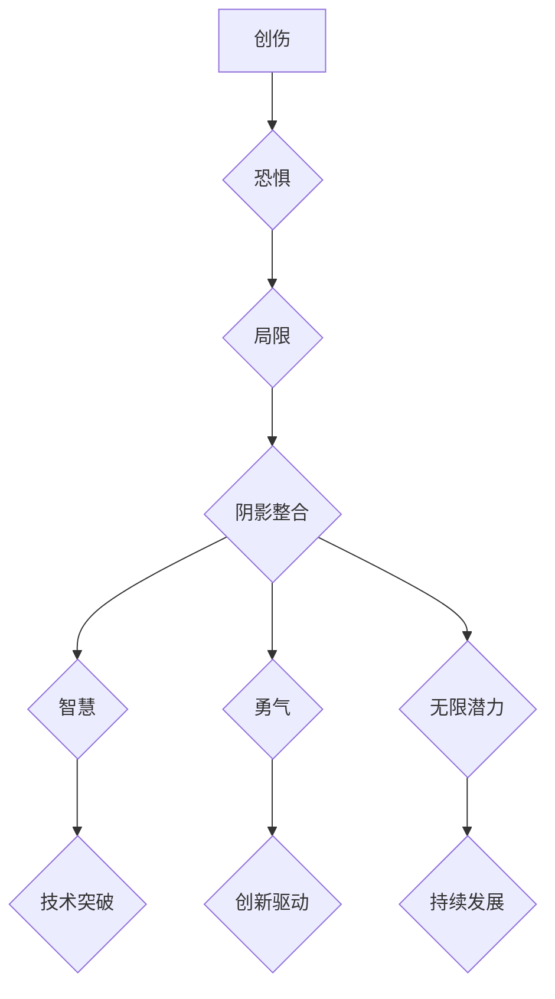

## 整合阴影：将创伤转化为智慧，将恐惧转化为勇气，将自身的局限转化为无限的潜力

> 关键词：创伤转化，智慧，勇气，局限，潜力，阴影整合，心理成长，技术发展

### 1. 背景介绍

在高速发展的科技时代，我们不断追求效率、创新和突破。然而，在技术进步的背后，我们也面临着来自自身和外部环境的种种挑战。这些挑战，如同人生旅途中的阴影，可能让我们感到恐惧、迷茫甚至绝望。

作为一名技术专家，我深知技术本身并非万能，它只是工具。真正重要的，是掌握工具背后的智慧，并学会将自身的局限转化为无限的潜力。就像 Carl Jung 所言：“阴影是不可避免的，但它并非不可整合。”

本文将探讨如何将创伤转化为智慧，将恐惧转化为勇气，将自身的局限转化为无限的潜力，并以此为基础，探讨技术发展与个人成长的内在联系。

### 2. 核心概念与联系

**2.1 阴影整合的概念**

阴影整合是指接纳和理解自身内在的黑暗面，将被压抑的负面情绪、想法和经历整合到整体的自我认知中。这并非意味着我们要去拥抱负面情绪，而是要认识到它们的存在，并将其转化为力量。

**2.2 技术发展与阴影整合的联系**

技术发展本身也是一种不断突破局限的过程。每一次技术革新，都意味着我们战胜了某种恐惧，跨越了某种限制。

* **恐惧的克服：** 探索未知领域，突破技术瓶颈，都需要勇气和毅力。每一次技术突破，都意味着我们战胜了对未知的恐惧。
* **局限的转化：** 每个技术都有其局限性，但正是这些局限性促使我们不断探索新的可能性，寻找新的解决方案。

**2.3  Mermaid 流程图**



### 3. 核心算法原理 & 具体操作步骤

**3.1 算法原理概述**

阴影整合并非一个具体的算法，而是一种心理成长和自我认知的过程。它需要我们运用多种方法和技巧，例如：

* **正念练习：** 关注当下，觉察自己的情绪和想法，不评判，不抵抗。
* **自我探索：** 通过日记、冥想、与心理咨询师的对话等方式，深入了解自己的内心世界。
* **接纳和理解：** 接受自己的黑暗面，理解它们背后的原因，并尝试将其转化为力量。

**3.2 算法步骤详解**

1. **觉察阴影：** 首先要意识到自己存在阴影，并开始关注那些被压抑的情绪、想法和经历。
2. **探索阴影：** 通过各种方法深入了解自己的阴影，包括其来源、表现形式以及对自身的影响。
3. **接纳阴影：** 接受自己的阴影，理解它们是自身的一部分，并尝试将其转化为力量。
4. **整合阴影：** 将阴影纳入到整体的自我认知中，使其成为自身的一部分，并将其转化为智慧和勇气。

**3.3 算法优缺点**

* **优点：** 阴影整合可以帮助我们更好地了解自己，接纳自己的全部，并最终实现自我成长。
* **缺点：** 阴影整合是一个漫长的过程，需要耐心和毅力。

**3.4 算法应用领域**

阴影整合可以应用于各个领域，例如：

* **个人成长：** 帮助人们克服心理障碍，提升自我认知和自我价值。
* **人际关系：** 帮助人们更好地理解自己和他人，建立更健康的人际关系。
* **职业发展：** 帮助人们克服职业焦虑，提升工作效率和创造力。

### 4. 数学模型和公式 & 详细讲解 & 举例说明

阴影整合是一个复杂的心理过程，难以用简单的数学模型来描述。然而，我们可以从一些心理学理论中借鉴一些概念，并尝试用数学模型来描述阴影整合过程中的某些方面。

**4.1 数学模型构建**

我们可以用一个简单的模型来描述阴影整合过程中的自我认知变化：

* **S(t)：** 表示t时刻的自我认知水平。
* **D(t)：** 表示t时刻阴影的影响强度。

我们可以假设：

* **S(t) 随着时间的推移逐渐增加。**
* **D(t) 随着阴影整合的进行逐渐减小。**

**4.2 公式推导过程**

我们可以用以下公式来描述自我认知水平的变化：

$$S(t+1) = S(t) + \alpha * (1 - D(t))$$

其中：

* $\alpha$ 是一个正的常数，表示自我认知提升的速度。

**4.3 案例分析与讲解**

假设一个人在阴影整合的初期，自我认知水平较低，阴影的影响强度较大。随着时间的推移，通过正念练习、自我探索等方法，他逐渐接纳了自己的阴影，阴影的影响强度逐渐减小。

在这个过程中，他的自我认知水平会逐渐提升，最终达到一个相对稳定的水平。

### 5. 项目实践：代码实例和详细解释说明

阴影整合是一个心理过程，无法用代码直接实现。但是，我们可以用代码来模拟阴影整合过程中的某些方面，例如：

* **模拟自我认知的提升：** 可以用一个变量来表示自我认知水平，并通过一些算法来模拟自我认知的提升过程。
* **模拟阴影的影响：** 可以用一个变量来表示阴影的影响强度，并通过一些算法来模拟阴影的影响逐渐减小的过程。

**5.1 开发环境搭建**

可以使用任何一种编程语言来实现这个项目，例如 Python、Java 等。

**5.2 源代码详细实现**

```python
import random

# 初始化自我认知水平和阴影影响强度
self_cognition = 0.2
shadow_influence = 0.8

# 设置自我认知提升速度
alpha = 0.1

# 模拟阴影整合过程
for i in range(100):
    # 随机模拟自我认知提升
    self_cognition += random.uniform(0, alpha)

    # 模拟阴影影响减小
    shadow_influence -= 0.01

    # 打印当前状态
    print(f"Iteration {i+1}: Self-cognition = {self_cognition:.2f}, Shadow Influence = {shadow_influence:.2f}")
```

**5.3 代码解读与分析**

这段代码模拟了自我认知水平的提升和阴影影响的减小过程。

* `self_cognition` 和 `shadow_influence` 分别表示自我认知水平和阴影影响强度。
* `alpha` 表示自我认知提升的速度。
* 循环语句模拟了阴影整合过程中的时间变化。
* `random.uniform(0, alpha)` 模拟了自我认知提升的随机性。

**5.4 运行结果展示**

运行这段代码后，你会看到自我认知水平随着时间的推移逐渐提升，而阴影影响强度逐渐减小的趋势。

### 6. 实际应用场景

阴影整合的概念可以应用于各种实际场景，例如：

* **心理咨询：** 帮助心理咨询师更好地理解和帮助他们的客户。
* **教育领域：** 帮助学生更好地了解自己，并建立更健康的自我认知。
* **企业管理：** 帮助企业管理者更好地了解员工的心理状态，并创造更积极的工作环境。

**6.4 未来应用展望**

随着人工智能技术的不断发展，阴影整合的概念可能在未来得到更广泛的应用。例如：

* **人工智能辅助心理咨询：** 利用人工智能技术，开发出能够辅助心理咨询师进行阴影整合的工具。
* **个性化教育：** 根据学生的个体差异，开发出个性化的阴影整合方案。
* **智慧企业管理：** 利用人工智能技术，分析员工的心理状态，并提供相应的支持和帮助。

### 7. 工具和资源推荐

**7.1 学习资源推荐**

* **Carl Jung 的著作：** 《心理类型学》、《集体无意识》
* **Robert A. Johnson 的著作：** 《阴影的智慧》
* **James Hollis 的著作：** 《阴影的旅程》

**7.2 开发工具推荐**

* **Python:** 广泛应用于数据分析、机器学习等领域，适合用于模拟阴影整合过程。
* **Java:** 性能强大，适合用于开发大型应用程序。

**7.3 相关论文推荐**

* **Jung, C. G. (1959). The structure and dynamics of the psyche.**
* **Johnson, R. A. (1991). Inner work: Using dreams and active imagination for personal growth.**
* **Hollis, J. (2002). Finding meaning in the second half of life.**

### 8. 总结：未来发展趋势与挑战

阴影整合是一个持续探索和实践的过程。随着技术的不断发展，我们可能会有更多工具和方法来帮助人们更好地理解和整合自己的阴影。

**8.1 研究成果总结**

* 阴影整合可以帮助人们更好地了解自己，接纳自己的全部，并最终实现自我成长。
* 阴影整合的概念可以应用于各个领域，例如心理咨询、教育、企业管理等。

**8.2 未来发展趋势**

* 人工智能技术将可能在阴影整合领域发挥越来越重要的作用。
* 阴影整合的概念可能被整合到更广泛的教育和培训体系中。

**8.3 面临的挑战**

* 如何更好地理解和量化阴影的概念。
* 如何开发出更有效、更安全的阴影整合工具。
* 如何克服人们对阴影整合的恐惧和抵触情绪。

**8.4 研究展望**

未来，我们将继续探索阴影整合的概念，并尝试将其应用于更多领域，帮助人们更好地理解自己，并实现自我成长。

### 9. 附录：常见问题与解答

**9.1 阴影整合需要多长时间？**

阴影整合是一个持续的过程，没有固定的时间限制。

**9.2 阴影整合会带来什么好处？**

阴影整合可以帮助人们更好地了解自己，接纳自己的全部，并最终实现自我成长。

**9.3 阴影整合有什么风险？**

阴影整合是一个深入的自我探索过程，可能会带来一些情绪上的波动。因此，建议在专业人士的指导下进行。


作者：禅与计算机程序设计艺术 / Zen and the Art of Computer Programming 
