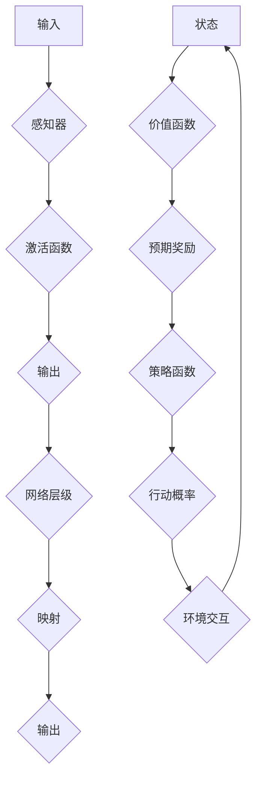

## 神经网络与深度强化学习：一切皆是映射

> 关键词：神经网络、深度强化学习、映射、函数逼近、价值函数、策略梯度、强化学习算法、应用场景

## 1. 背景介绍

在现代人工智能领域，神经网络和深度强化学习（Deep Reinforcement Learning，DRL）作为两大重要支柱，在各个领域取得了令人瞩目的成就。从图像识别、自然语言处理到游戏策略学习，它们展现出强大的学习能力和解决复杂问题的能力。

神经网络，以其模仿人脑神经元结构的网络架构，能够学习复杂的非线性关系，并通过大量的训练数据实现对各种模式的识别和预测。深度强化学习则将神经网络与强化学习算法相结合，赋予智能体学习决策策略的能力。智能体通过与环境交互，获得奖励信号，并不断调整策略以最大化累积奖励。

然而，神经网络和深度强化学习的本质，都源于一个核心概念：**映射**。无论是神经网络的层级结构，还是强化学习中的价值函数和策略函数，都本质上是将输入映射到输出的过程。

## 2. 核心概念与联系

**2.1 神经网络的映射本质**

神经网络的核心是**感知器**，每个感知器接收多个输入信号，并通过加权求和和激活函数进行处理，输出一个信号。多个感知器通过连接形成网络层级结构，每一层都对输入进行特征提取和抽象，最终将输入映射到输出。

**2.2 强化学习的映射关系**

在强化学习中，智能体通过与环境交互，获得状态和奖励信号。价值函数和策略函数则是将状态映射到相应的价值和策略。

* **价值函数**：将状态映射到该状态的预期累积奖励。
* **策略函数**：将状态映射到智能体在该状态下采取的行动概率分布。

**2.3 核心概念的联系**

神经网络和深度强化学习的核心概念相互联系，共同构成了智能体学习决策的框架。

* 神经网络提供强大的函数逼近能力，可以学习复杂的价值函数和策略函数。
* 强化学习算法利用价值函数和策略函数，引导智能体不断调整策略，以最大化累积奖励。

**Mermaid 流程图**



## 3. 核心算法原理 & 具体操作步骤

### 3.1 算法原理概述

深度强化学习算法的核心是利用神经网络学习价值函数和策略函数，并通过策略梯度或值函数迭代等方法不断优化策略，以最大化累积奖励。

**3.1.1 策略梯度算法**

策略梯度算法直接优化策略函数，通过计算策略函数梯度，更新策略参数，使其朝着提高累积奖励的方向调整。

**3.1.2 值函数迭代算法**

值函数迭代算法通过学习价值函数，估计不同状态的预期奖励，并根据价值函数的梯度更新策略参数。

### 3.2 算法步骤详解

**3.2.1 策略梯度算法步骤**

1. 初始化策略函数参数。
2. 与环境交互，收集状态、动作和奖励数据。
3. 计算策略梯度，更新策略参数。
4. 重复步骤2-3，直到策略收敛。

**3.2.2 值函数迭代算法步骤**

1. 初始化价值函数参数。
2. 与环境交互，收集状态、动作和奖励数据。
3. 利用价值函数估计不同状态的预期奖励。
4. 计算价值函数梯度，更新价值函数参数。
5. 根据价值函数更新策略参数。
6. 重复步骤2-5，直到策略收敛。

### 3.3 算法优缺点

**3.3.1 策略梯度算法**

* **优点:** 能够直接优化策略，避免值函数估计的误差。
* **缺点:** 训练过程可能不稳定，需要仔细调参。

**3.3.2 值函数迭代算法**

* **优点:** 训练过程相对稳定，更容易收敛。
* **缺点:** 需要估计价值函数，容易受到价值函数估计误差的影响。

### 3.4 算法应用领域

深度强化学习算法在各个领域都有广泛的应用，例如：

* **游戏AI:** AlphaGo、AlphaStar等游戏AI都利用深度强化学习算法取得了人类难以企及的成绩。
* **机器人控制:** 深度强化学习可以训练机器人完成复杂的运动控制任务，例如自主导航、抓取物体等。
* **医疗诊断:** 深度强化学习可以辅助医生进行疾病诊断，提高诊断准确率。
* **金融交易:** 深度强化学习可以训练智能交易系统，进行股票交易等金融活动。

## 4. 数学模型和公式 & 详细讲解 & 举例说明

### 4.1 数学模型构建

**4.1.1 状态空间和动作空间**

强化学习问题通常定义在一个状态空间和动作空间中。状态空间表示智能体可能处于的所有状态，动作空间表示智能体在每个状态下可以采取的所有动作。

**4.1.2 奖励函数**

奖励函数将智能体在每个状态采取的动作映射到一个奖励值，奖励值表示智能体在该状态采取该动作的“好坏”。

**4.1.3 价值函数**

价值函数估计智能体在某个状态下采取某个动作的预期累积奖励。

**4.1.4 策略函数**

策略函数将状态映射到智能体在该状态下采取每个动作的概率分布。

### 4.2 公式推导过程

**4.2.1 价值函数的Bellman方程**

Bellman方程描述了价值函数的递推关系，可以用来估计不同状态的价值。

$$
V(s) = \max_a \left[ R(s, a) + \gamma \sum_{s'} P(s' | s, a) V(s') \right]
$$

其中：

* $V(s)$ 表示状态 $s$ 的价值。
* $R(s, a)$ 表示在状态 $s$ 采取动作 $a$ 得到的奖励。
* $\gamma$ 表示折扣因子，控制未来奖励的权重。
* $P(s' | s, a)$ 表示从状态 $s$ 采取动作 $a$ 到达状态 $s'$ 的概率。

**4.2.2 策略梯度的公式**

策略梯度算法的目标是最大化累积奖励，可以使用梯度上升法更新策略参数。

$$
\theta_{t+1} = \theta_t + \alpha \nabla_{\theta} J(\theta)
$$

其中：

* $\theta$ 表示策略函数的参数。
* $J(\theta)$ 表示策略函数的期望累积奖励。
* $\alpha$ 表示学习率。

### 4.3 案例分析与讲解

**4.3.1 CartPole问题**

CartPole问题是一个经典的强化学习问题，智能体需要控制一个推车，使其保持平衡。

* 状态空间：推车的位移和角度。
* 动作空间：向左或向右推车。
* 奖励函数：在推车保持平衡时给予奖励，否则给予惩罚。

可以使用深度强化学习算法，例如DQN或A2C，训练智能体解决CartPole问题。

## 5. 项目实践：代码实例和详细解释说明

### 5.1 开发环境搭建

* Python 3.x
* TensorFlow 或 PyTorch
* OpenAI Gym

### 5.2 源代码详细实现

```python
import gym
import tensorflow as tf

# 定义神经网络模型
model = tf.keras.Sequential([
    tf.keras.layers.Dense(128, activation='relu', input_shape=(4,)),
    tf.keras.layers.Dense(64, activation='relu'),
    tf.keras.layers.Dense(2, activation='softmax')
])

# 定义损失函数和优化器
loss_fn = tf.keras.losses.CategoricalCrossentropy()
optimizer = tf.keras.optimizers.Adam(learning_rate=0.001)

# 训练循环
for episode in range(1000):
    state = env.reset()
    done = False
    total_reward = 0

    while not done:
        # 选择动作
        action_probs = model(state)
        action = tf.random.categorical(tf.math.log(action_probs), num_samples=1)[0, 0]

        # 执行动作
        next_state, reward, done, _ = env.step(action)

        # 更新状态
        state = next_state

        # 计算损失
        with tf.GradientTape() as tape:
            action_probs = model(state)
            loss = loss_fn(tf.one_hot(action, depth=2), action_probs)

        # 更新参数
        gradients = tape.gradient(loss, model.trainable_variables)
        optimizer.apply_gradients(zip(gradients, model.trainable_variables))

        # 更新总奖励
        total_reward += reward

    print(f"Episode {episode+1}, Total Reward: {total_reward}")
```

### 5.3 代码解读与分析

* 代码首先定义了神经网络模型，使用两层全连接层和softmax激活函数，输出两个动作的概率分布。
* 然后定义了损失函数和优化器，使用交叉熵损失函数和Adam优化器。
* 训练循环中，智能体与环境交互，根据策略函数选择动作，执行动作后更新状态，并计算损失。
* 最后使用梯度下降法更新策略函数参数，并记录总奖励。

### 5.4 运行结果展示

运行代码后，可以观察到智能体的奖励随着训练的进行而逐渐提高，最终能够完成CartPole问题。

## 6. 实际应用场景

### 6.1 游戏AI

深度强化学习在游戏AI领域取得了突破性进展，例如AlphaGo、AlphaStar等游戏AI都利用深度强化学习算法取得了人类难以企及的成绩。

### 6.2 机器人控制

深度强化学习可以训练机器人完成复杂的运动控制任务，例如自主导航、抓取物体等。

### 6.3 医疗诊断

深度强化学习可以辅助医生进行疾病诊断，提高诊断准确率。

### 6.4 未来应用展望

深度强化学习的应用前景广阔，未来可能在更多领域发挥重要作用，例如自动驾驶、个性化教育、金融交易等。

## 7. 工具和资源推荐

### 7.1 学习资源推荐

* **书籍:**
    * Deep Reinforcement Learning Hands-On by Maxim Lapan
    * Reinforcement Learning: An Introduction by Richard S. Sutton and Andrew G. Barto
* **在线课程:**
    * Deep Reinforcement Learning Specialization by DeepLearning.AI
    * Reinforcement Learning by David Silver (University of DeepMind)

### 7.2 开发工具推荐

* **TensorFlow:** https://www.tensorflow.org/
* **PyTorch:** https://pytorch.org/
* **OpenAI Gym:** https://gym.openai.com/

### 7.3 相关论文推荐

* **Deep Q-Network (DQN):** https://arxiv.org/abs/1312.5602
* **Proximal Policy Optimization (PPO):** https://arxiv.org/abs/1707.06347
* **Asynchronous Advantage Actor-Critic (A2C):** https://arxiv.org/abs/1602.01783

## 8. 总结：未来发展趋势与挑战

### 8.1 研究成果总结

深度强化学习取得了令人瞩目的成果，在游戏AI、机器人控制、医疗诊断等领域展现出强大的应用潜力