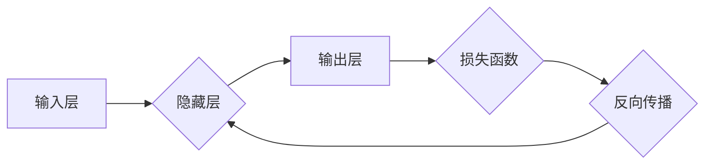

## 神经网络：改变世界的技术

> 关键词：神经网络、深度学习、机器学习、人工智能、卷积神经网络、循环神经网络、自然语言处理

## 1. 背景介绍

人工智能（AI）正以惊人的速度发展，深刻地改变着我们生活和工作的方式。其中，神经网络作为人工智能的核心技术之一，在图像识别、自然语言处理、语音识别等领域取得了突破性的进展，并逐渐渗透到各个行业，例如医疗、金融、交通等。

神经网络的灵感来源于人类大脑的结构和功能。它由相互连接的神经元组成，这些神经元通过权重来传递信息。通过训练，神经网络可以学习复杂的模式和关系，从而实现各种智能任务。

近年来，随着计算能力的提升和海量数据的积累，深度学习技术蓬勃发展，推动了神经网络的快速进步。深度学习是指使用多层神经网络来学习更深层次的特征表示，从而提高模型的性能。

## 2. 核心概念与联系

**2.1 神经网络的基本结构**

神经网络由三层组成：输入层、隐藏层和输出层。

* **输入层:**接收原始数据，每个神经元代表一个特征。
* **隐藏层:**对输入数据进行处理和转换，提取特征，可以有多层。
* **输出层:**输出最终结果，每个神经元代表一个类别或预测值。

**2.2 激活函数**

激活函数是神经网络中一个重要的组成部分，它决定了神经元的输出是否被激活。常见的激活函数包括 sigmoid 函数、ReLU 函数、tanh 函数等。

**2.3 权重和偏置**

权重和偏置是神经网络的参数，它们决定了神经元之间的连接强度和激活阈值。通过训练，神经网络会不断调整权重和偏置，以最小化预测误差。

**2.4 前向传播和反向传播**

* **前向传播:**将输入数据通过神经网络传递，得到最终输出。
* **反向传播:**计算输出与真实值的误差，并根据误差反向调整权重和偏置，以减少误差。

**2.5 损失函数**

损失函数用于衡量模型的预测误差，常用的损失函数包括均方误差、交叉熵等。

**2.6 优化算法**

优化算法用于更新权重和偏置，以最小化损失函数。常见的优化算法包括梯度下降、Adam 算法等。

**Mermaid 流程图**



## 3. 核心算法原理 & 具体操作步骤

### 3.1 算法原理概述

神经网络的核心算法是反向传播算法，它通过迭代更新权重和偏置，使模型的预测误差最小化。

反向传播算法的基本步骤如下：

1. 将输入数据通过神经网络进行前向传播，得到输出结果。
2. 计算输出结果与真实值的误差。
3. 根据误差反向传播，计算每个神经元的梯度。
4. 使用优化算法更新权重和偏置。
5. 重复步骤 1-4，直到模型的预测误差达到预设阈值。

### 3.2 算法步骤详解

1. **前向传播:**

   * 将输入数据输入到神经网络的输入层。
   * 每个神经元接收来自前一层神经元的输入，并将其与自身的权重相乘。
   * 将所有输入加权求和后，通过激活函数得到该神经元的输出。
   * 将输出传递到下一层神经元，直到输出层。

2. **损失函数计算:**

   * 将输出层输出与真实值进行比较，计算损失函数的值。
   * 损失函数衡量模型预测误差的大小。

3. **反向传播:**

   * 从输出层开始，计算每个神经元的梯度。
   * 梯度表示权重和偏置调整的方向和幅度。
   * 使用链式法则，将梯度反向传播到上一层神经元。

4. **权重和偏置更新:**

   * 使用优化算法，根据梯度更新权重和偏置。
   * 常见的优化算法包括梯度下降、Adam 算法等。

5. **迭代训练:**

   * 重复步骤 1-4，直到模型的预测误差达到预设阈值。

### 3.3 算法优缺点

**优点:**

* 能够学习复杂的非线性关系。
* 具有强大的泛化能力，可以应用于各种不同的任务。
* 随着数据量的增加，模型性能会不断提高。

**缺点:**

* 训练时间长，需要大量的计算资源。
* 容易过拟合，需要进行正则化处理。
* 难以解释模型的决策过程。

### 3.4 算法应用领域

神经网络在各个领域都有广泛的应用，例如：

* **图像识别:** 人脸识别、物体检测、图像分类等。
* **自然语言处理:** 机器翻译、文本摘要、情感分析等。
* **语音识别:** 语音转文本、语音助手等。
* **推荐系统:** 商品推荐、内容推荐等。
* **医疗诊断:** 疾病预测、图像分析等。

## 4. 数学模型和公式 & 详细讲解 & 举例说明

### 4.1 数学模型构建

神经网络可以看作是一个复杂的函数映射，其输入是原始数据，输出是预测结果。

假设一个神经网络有 $n$ 个输入节点，$h$ 个隐藏节点，$m$ 个输出节点。

* **输入层:** $x_1, x_2,..., x_n$
* **隐藏层:** $h_1, h_2,..., h_h$
* **输出层:** $y_1, y_2,..., y_m$

### 4.2 公式推导过程

**隐藏层激活函数:**

$$h_i = f(\sum_{j=1}^{n} w_{ij}x_j + b_i)$$

其中:

* $h_i$ 是隐藏层第 $i$ 个神经元的输出。
* $f$ 是激活函数。
* $w_{ij}$ 是隐藏层第 $i$ 个神经元与输入层第 $j$ 个神经元的权重。
* $b_i$ 是隐藏层第 $i$ 个神经元的偏置。

**输出层激活函数:**

$$y_k = f(\sum_{i=1}^{h} w_{ki}h_i + b_k)$$

其中:

* $y_k$ 是输出层第 $k$ 个神经元的输出。
* $w_{ki}$ 是输出层第 $k$ 个神经元与隐藏层第 $i$ 个神经元的权重。
* $b_k$ 是输出层第 $k$ 个神经元的偏置。

**损失函数:**

$$L = \frac{1}{m}\sum_{k=1}^{m} (y_k - t_k)^2$$

其中:

* $L$ 是损失函数的值。
* $m$ 是样本数量。
* $y_k$ 是模型预测的第 $k$ 个输出。
* $t_k$ 是真实值的第 $k$ 个输出。

**梯度下降算法:**

$$w_{ij} = w_{ij} - \alpha \frac{\partial L}{\partial w_{ij}}$$

$$b_i = b_i - \alpha \frac{\partial L}{\partial b_i}$$

其中:

* $\alpha$ 是学习率。

### 4.3 案例分析与讲解

**图像分类:**

假设我们有一个图像分类任务，需要将图像分类为猫、狗、鸟三种类别。

我们可以使用卷积神经网络（CNN）来解决这个问题。CNN 是一种专门用于处理图像数据的深度学习模型。

CNN 的结构包括卷积层、池化层和全连接层。

* **卷积层:** 使用卷积核提取图像特征。
* **池化层:** 降低图像尺寸，提高模型的鲁棒性。
* **全连接层:** 将提取的特征进行分类。

通过训练 CNN 模型，它可以学习到猫、狗、鸟的特征，并能够准确地将图像分类到相应的类别。

## 5. 项目实践：代码实例和详细解释说明

### 5.1 开发环境搭建

* **操作系统:** Linux, macOS, Windows
* **编程语言:** Python
* **深度学习框架:** TensorFlow, PyTorch
* **其他工具:** Jupyter Notebook, Git

### 5.2 源代码详细实现

```python
import tensorflow as tf

# 定义模型结构
model = tf.keras.models.Sequential([
    tf.keras.layers.Conv2D(32, (3, 3), activation='relu', input_shape=(28, 28, 1)),
    tf.keras.layers.MaxPooling2D((2, 2)),
    tf.keras.layers.Conv2D(64, (3, 3), activation='relu'),
    tf.keras.layers.MaxPooling2D((2, 2)),
    tf.keras.layers.Flatten(),
    tf.keras.layers.Dense(10, activation='softmax')
])

# 编译模型
model.compile(optimizer='adam',
              loss='sparse_categorical_crossentropy',
              metrics=['accuracy'])

# 加载数据集
(x_train, y_train), (x_test, y_test) = tf.keras.datasets.mnist.load_data()

# 数据预处理
x_train = x_train.astype('float32') / 255.0
x_test = x_test.astype('float32') / 255.0
x_train = x_train.reshape((x_train.shape[0], 28, 28, 1))
x_test = x_test.reshape((x_test.shape[0], 28, 28, 1))

# 训练模型
model.fit(x_train, y_train, epochs=5)

# 评估模型
loss, accuracy = model.evaluate(x_test, y_test)
print('Test loss:', loss)
print('Test accuracy:', accuracy)
```

### 5.3 代码解读与分析

* **模型结构:** 代码定义了一个简单的 CNN 模型，包含两层卷积层、两层池化层和一层全连接层。
* **模型编译:** 使用 Adam 优化器、交叉熵损失函数和准确率作为评估指标。
* **数据集加载:** 使用 MNIST 手写数字数据集进行训练和测试。
* **数据预处理:** 将图像数据归一化到 0 到 1 之间，并调整形状以适应模型输入。
* **模型训练:** 使用 `fit()` 方法训练模型，训练 5 个 epochs。
* **模型评估:** 使用 `evaluate()` 方法评估模型在测试集上的性能。

### 5.4 运行结果展示

训练完成后，模型会输出测试集上的损失值和准确率。

## 6. 实际应用场景

### 6.1 图像识别

* **人脸识别:** 用于解锁手机、身份验证、人脸搜索等。
* **物体检测:** 用于自动驾驶、安防监控、工业缺陷检测等。
* **图像分类:** 用于医疗影像诊断、产品分类、场景识别等。

### 6.2 自然语言处理

* **机器翻译:** 将文本从一种语言翻译成另一种语言。
* **文本摘要:** 自动生成文本的简短摘要。
* **情感分析:** 分析文本的情感倾向，例如正面、负面、中性。
* **聊天机器人:** 与用户进行自然语言对话。

### 6.3 语音识别

* **语音转文本:** 将语音转换为文本。
* **语音助手:** 例如 Siri、Alexa、Google Assistant。

### 6.4 未来应用展望

* **个性化推荐:** 基于用户的行为和偏好，提供个性化的商品、内容推荐。
* **医疗诊断辅助:** 帮助医生更快、更准确地诊断疾病