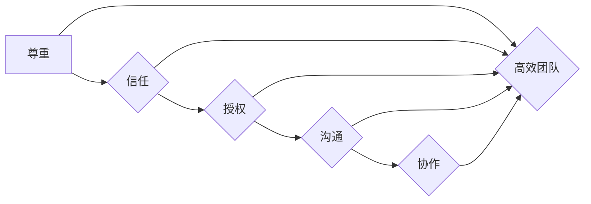

## 管理之道：激发人性的善意和潜能

> 关键词：团队管理、人性、领导力、沟通、协作、创新、高效

### 1. 背景介绍

在当今科技飞速发展的时代，软件开发行业竞争日益激烈。优秀的团队和高效的管理模式已成为企业核心竞争力的关键因素。然而，单纯依靠技术手段和流程规范难以真正激发团队成员的潜能，提升团队整体效能。管理之道，在于理解和激发人性的善意和潜能。

传统管理模式往往强调控制和监督，忽视了团队成员的个体差异和内在驱动力。这种管理方式容易导致团队成员缺乏自主性和创造力，最终影响团队绩效。而人性化的管理模式则强调尊重、信任和授权，激发团队成员的积极性和主动性，从而构建高效、和谐的团队氛围。

### 2. 核心概念与联系

**2.1 人性化管理的核心概念**

人性化管理的核心概念包括：

* **尊重：** 尊重每个团队成员的价值和尊严，认可他们的贡献和想法。
* **信任：** 对团队成员的能力和意愿表示信任，给予他们自主权和决策空间。
* **授权：** 将决策权和执行权下放至团队成员，鼓励他们承担责任和发挥潜力。
* **沟通：** 建立开放、透明的沟通机制，及时了解团队成员的需求和想法，并及时反馈信息。
* **协作：** 营造团队合作的氛围，鼓励成员互相帮助、共同进步。

**2.2 人性化管理与软件开发团队**

在软件开发团队中，人性化管理可以有效提升团队成员的士气、创造力和工作效率。

* **激发创新：** 尊重和信任团队成员的创意，鼓励他们提出新的想法和解决方案，从而促进团队创新。
* **提高效率：** 授权团队成员自主决策和执行，减少不必要的层级审批，提高工作效率。
* **增强凝聚力：** 建立良好的沟通机制和团队合作氛围，增强团队成员之间的归属感和凝聚力。

**2.3 人性化管理流程图**



### 3. 核心算法原理 & 具体操作步骤

**3.1 算法原理概述**

人性化管理并非一种固定的算法，而是一种基于对人性的理解和洞察的管理理念和实践方法。其核心在于通过尊重、信任、授权、沟通和协作等原则，激发团队成员的积极性和创造力，从而提升团队整体效能。

**3.2 算法步骤详解**

1. **建立信任关系：** 领导者需要真诚地对待团队成员，倾听他们的意见和建议，并给予他们充分的尊重和信任。
2. **授权和赋能：** 将决策权和执行权下放至团队成员，鼓励他们承担责任和发挥潜力。
3. **促进沟通和协作：** 建立开放、透明的沟通机制，鼓励团队成员互相帮助、共同进步。
4. **提供成长机会：** 为团队成员提供学习和成长的机会，帮助他们提升技能和知识水平。
5. **建立激励机制：** 通过合理的薪酬福利和绩效考核，激励团队成员积极工作，不断进步。

**3.3 算法优缺点**

**优点：**

* 能够激发团队成员的积极性和创造力。
* 提升团队凝聚力和协作效率。
* 增强团队成员的归属感和责任感。

**缺点：**

* 需要领导者具备较高的管理能力和沟通技巧。
* 需要建立良好的团队文化和氛围。
* 需要投入更多的时间和精力进行管理。

**3.4 算法应用领域**

人性化管理适用于各种类型的团队，包括软件开发团队、销售团队、营销团队等。

### 4. 数学模型和公式 & 详细讲解 & 举例说明

**4.1 数学模型构建**

虽然人性化管理并非纯粹的数学模型，但我们可以通过一些数学模型来分析其影响因素和效果。例如，我们可以使用以下模型来衡量团队成员的士气和工作效率：

* **士气指数 (Morale Index)：**

$$Morale Index = \frac{\sum_{i=1}^{n} (Satisfaction_i + Motivation_i)}{2n}$$

其中：

* $Satisfaction_i$ 表示第 i 个团队成员的满意度。
* $Motivation_i$ 表示第 i 个团队成员的动机。
* $n$ 表示团队成员的数量。

* **工作效率 (Work Efficiency)：**

$$Work Efficiency = \frac{\sum_{i=1}^{n} (Output_i - Input_i)}{n}$$

其中：

* $Output_i$ 表示第 i 个团队成员的产出。
* $Input_i$ 表示第 i 个团队成员的投入。

**4.2 公式推导过程**

以上公式的推导过程基于以下假设：

* 团队成员的满意度和动机直接影响其工作效率。
* 团队成员的产出与投入成正比。

**4.3 案例分析与讲解**

假设一个软件开发团队有 5 名成员，他们的满意度和动机分别为：

* $Satisfaction_1 = 8$, $Motivation_1 = 9$
* $Satisfaction_2 = 7$, $Motivation_2 = 8$
* $Satisfaction_3 = 9$, $Motivation_3 = 7$
* $Satisfaction_4 = 6$, $Motivation_4 = 6$
* $Satisfaction_5 = 8$, $Motivation_5 = 9$

则团队的士气指数为：

$$Morale Index = \frac{(8+9)+(7+8)+(9+7)+(6+6)+(8+9)}{2*5} = \frac{70}{10} = 7$$

如果团队成员的产出和投入分别为：

* $Output_1 = 12$, $Input_1 = 8$
* $Output_2 = 10$, $Input_2 = 6$
* $Output_3 = 11$, $Input_3 = 7$
* $Output_4 = 9$, $Input_4 = 5$
* $Output_5 = 13$, $Input_5 = 9$

则团队的工作效率为：

$$Work Efficiency = \frac{(12-8)+(10-6)+(11-7)+(9-5)+(13-9)}{5} = \frac{35}{5} = 7$$

从以上案例分析可以看出，团队的士气指数和工作效率都较高，这表明人性化管理可以有效提升团队成员的积极性和工作效率。

### 5. 项目实践：代码实例和详细解释说明

**5.1 开发环境搭建**

为了更好地实践人性化管理理念，我们可以开发一个基于协作和沟通的项目管理工具。

* **操作系统：** Linux/macOS/Windows
* **编程语言：** Python/Java/JavaScript
* **数据库：** MySQL/PostgreSQL/MongoDB
* **框架：** Django/Spring Boot/React

**5.2 源代码详细实现**

以下是一个简单的项目管理工具代码示例，使用 Python 和 Django 框架实现：

```python
# models.py
from django.db import models

class Task(models.Model):
    title = models.CharField(max_length=200)
    description = models.TextField()
    status = models.CharField(max_length=10, choices=[('TODO', '待完成'), ('IN_PROGRESS', '进行中'), ('DONE', '已完成')])
    assigned_to = models.ForeignKey('User', on_delete=models.CASCADE)

# views.py
from django.shortcuts import render
from.models import Task

def task_list(request):
    tasks = Task.objects.all()
    return render(request, 'task_list.html', {'tasks': tasks})

# task_list.html
<h1>任务列表</h1>
<ul>
    
    <li>
        {{ task.title }} - {{ task.status }}
    </li>
    
</ul>
```

**5.3 代码解读与分析**

* **models.py:** 定义了任务模型，包含任务标题、描述、状态和负责人等字段。
* **views.py:** 定义了任务列表视图，从数据库中获取所有任务并渲染到模板中。
* **task_list.html:** 模板文件，展示任务列表。

**5.4 运行结果展示**

运行以上代码，可以访问一个简单的任务列表页面，展示所有任务信息。

### 6. 实际应用场景

人性化管理在软件开发团队的实际应用场景非常广泛，例如：

* **团队建设：** 通过团队建设活动，增强团队成员之间的沟通和协作，建立良好的团队氛围。
* **任务分配：** 根据团队成员的技能和兴趣，合理分配任务，激发他们的积极性和主动性。
* **绩效考核：** 采用更加人性化的绩效考核方式，注重团队成员的贡献和成长，而不是仅仅关注个人指标。
* **职业发展：** 为团队成员提供学习和成长的机会，帮助他们提升技能和知识水平，实现职业发展。

### 6.4 未来应用展望

随着人工智能和自动化技术的不断发展，人性化管理将更加重要。未来，我们可以利用人工智能技术，更加精准地了解团队成员的需求和状态，并提供更加个性化的管理方案。

### 7. 工具和资源推荐

**7.1 学习资源推荐**

* **书籍：**
    * 《管理的艺术》 - 彼得·德鲁克
    * 《高效能人士的七个习惯》 - 斯蒂芬·柯维
    * 《领导力》 - 罗伯特·格雷
* **网站：**
    * Harvard Business Review (HBR)
    * Forbes
    * MIT Sloan Management Review

**7.2 开发工具推荐**

* **项目管理工具：**
    * Jira
    * Trello
    * Asana
* **沟通协作工具：**
    * Slack
    * Microsoft Teams
    * Zoom

**7.3 相关论文推荐**

* **《人性化管理与员工绩效的关系》**
* **《人工智能与人性化管理的融合》**
* **《团队协作与创新：人性化管理的视角》**

### 8. 总结：未来发展趋势与挑战

**8.1 研究成果总结**

人性化管理的研究表明，尊重、信任、授权、沟通和协作等原则可以有效提升团队成员的积极性和工作效率，从而促进团队创新和发展。

**8.2 未来发展趋势**

未来，人性化管理将更加注重个性化和智能化。人工智能技术将被更加广泛地应用于人性化管理领域，帮助企业更加精准地了解团队成员的需求和状态，并提供更加个性化的管理方案。

**8.3 面临的挑战**

人性化管理的实施也面临着一些挑战，例如：

* **文化差异：** 不同文化背景的团队成员对人性化管理的理解和接受程度可能不同。
* **管理者能力：** 领导者需要具备较高的管理能力和沟通技巧，才能有效实施人性化管理。
* **组织结构：** 一些传统的组织结构可能不利于人性化管理的实施。

**8.4 研究展望**

未来，我们需要进一步研究人性化管理的理论和实践，探索更加有效的管理方法，帮助企业构建更加高效、和谐的团队氛围。

### 9. 附录：常见问题与解答

**9.1 如何建立信任关系？**

* 领导者需要真诚地对待团队成员，倾听他们的意见和建议，并给予他们充分的尊重和信任。
* 团队成员之间需要互相尊重、互相帮助，建立良好的沟通和协作关系。

**9.2 如何授权和赋能团队成员？**

* 领导者需要根据团队成员的技能和