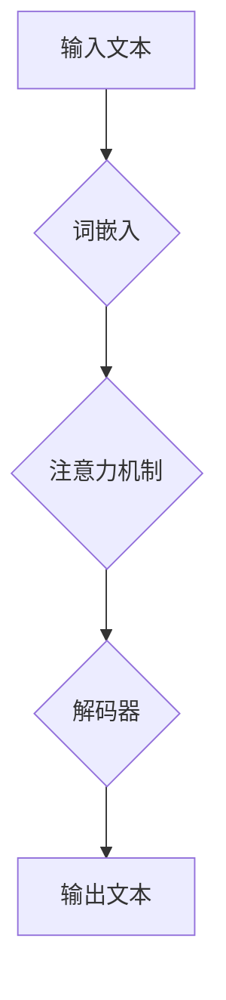

## 语言与思维的差异：大模型的困境

> 关键词：大语言模型、人工智能、自然语言处理、思维模拟、认知科学、知识表示、逻辑推理

### 1. 背景介绍

近年来，大语言模型（Large Language Models，LLM）在自然语言处理（Natural Language Processing，NLP）领域取得了令人瞩目的成就。从文本生成、翻译到问答和代码编写，LLM展现出强大的能力，甚至被认为是人工智能领域的一项重大突破。然而，尽管LLM在模拟人类语言能力方面取得了显著进展，但它们与真正的“理解”和“思考”之间仍然存在着本质的差异。

### 2. 核心概念与联系

**2.1 语言与思维的本质区别**

语言是人类用来表达和交流思想的工具，而思维则是人类认知世界、解决问题和做出决策的抽象过程。虽然语言是思维的载体，但它们并非完全等同。

* **语言是符号系统：** 语言由有限的符号组合而成，这些符号代表着特定的概念、关系和动作。
* **思维是抽象概念：** 思维涉及到对概念、关系和情境的抽象理解，它超越了语言符号的局限性。

**2.2 大模型的局限性**

大语言模型本质上是一个复杂的统计机器学习模型，它通过学习海量文本数据来预测下一个词的出现概率。虽然这种统计学习能力使得LLM能够生成流畅自然的文本，但它并不意味着LLM真正理解了文本中的含义。

* **缺乏语义理解：** LLM主要依赖于词语之间的统计关联，难以捕捉文本中的深层语义和上下文关系。
* **不能进行逻辑推理：** LLM缺乏人类的逻辑推理能力，难以从已知信息中推导出新的结论。
* **缺乏世界知识：** LLM的知识主要来自于训练数据，缺乏对现实世界的丰富理解和常识知识。

**2.3 Mermaid 流程图**



### 3. 核心算法原理 & 具体操作步骤

**3.1 算法原理概述**

大语言模型的核心算法是基于Transformer架构的深度神经网络。Transformer模型利用注意力机制来捕捉文本中的长距离依赖关系，并通过多层编码器-解码器结构来实现文本的生成和理解。

**3.2 算法步骤详解**

1. **词嵌入:** 将输入文本中的每个词转换为一个低维向量表示，以便模型能够处理文本数据。
2. **编码器:** 将词嵌入向量输入到多层编码器中，通过自注意力机制和前馈神经网络来提取文本的语义特征和上下文关系。
3. **解码器:** 将编码器的输出作为输入，通过自注意力机制和前馈神经网络来生成目标文本。
4. **损失函数:** 使用交叉熵损失函数来衡量模型生成的文本与真实文本之间的差异。
5. **反向传播:** 利用梯度下降算法来更新模型参数，降低损失函数的值。

**3.3 算法优缺点**

* **优点:**
    * 能够捕捉文本中的长距离依赖关系。
    * 训练效率高，能够处理海量文本数据。
    * 在文本生成、翻译和问答等任务中取得了优异的性能。
* **缺点:**
    * 训练成本高，需要大量的计算资源和数据。
    * 缺乏对语义和逻辑的深刻理解。
    * 容易受到训练数据中的偏差和错误的影响。

**3.4 算法应用领域**

* 文本生成：小说、诗歌、剧本、新闻报道等。
* 机器翻译：将一种语言翻译成另一种语言。
* 问答系统：回答用户提出的问题。
* 代码生成：自动生成代码。
* 聊天机器人：与用户进行自然语言对话。

### 4. 数学模型和公式 & 详细讲解 & 举例说明

**4.1 数学模型构建**

大语言模型的数学模型主要基于概率论和统计学。模型的目标是学习一个概率分布，该分布能够描述文本序列的生成概率。

**4.2 公式推导过程**

* **词嵌入:** 使用词向量模型（如Word2Vec或GloVe）将每个词映射到一个低维向量空间。
* **注意力机制:** 使用注意力机制来计算每个词对其他词的权重，从而捕捉文本中的长距离依赖关系。
* **解码器:** 使用循环神经网络（RNN）或Transformer解码器来生成目标文本序列。

**4.3 案例分析与讲解**

例如，在机器翻译任务中，模型需要将源语言文本翻译成目标语言文本。模型可以学习一个概率分布，该分布描述了每个目标语言词语在给定源语言词语序列的条件下的出现概率。

**4.4 数学公式**

* **词嵌入:**

$$
\mathbf{w}_i = \text{Embedding}(i)
$$

其中，$\mathbf{w}_i$ 是词 $i$ 的词向量，Embedding() 是词嵌入函数。

* **注意力机制:**

$$
\text{Attention}(Q, K, V) = \text{softmax}\left(\frac{Q K^T}{\sqrt{d_k}}\right) V
$$

其中，$Q$, $K$, $V$ 分别是查询矩阵、键矩阵和值矩阵，$d_k$ 是键向量的维度。

### 5. 项目实践：代码实例和详细解释说明

**5.1 开发环境搭建**

* Python 3.7+
* PyTorch 或 TensorFlow
* CUDA 和 cuDNN

**5.2 源代码详细实现**

```python
import torch
import torch.nn as nn

class Transformer(nn.Module):
    def __init__(self, vocab_size, embedding_dim, num_heads, num_layers):
        super(Transformer, self).__init__()
        self.embedding = nn.Embedding(vocab_size, embedding_dim)
        self.encoder = nn.TransformerEncoder(nn.TransformerEncoderLayer(embedding_dim, num_heads), num_layers)
        self.decoder = nn.TransformerDecoder(nn.TransformerDecoderLayer(embedding_dim, num_heads), num_layers)
        self.linear = nn.Linear(embedding_dim, vocab_size)

    def forward(self, src, tgt):
        src = self.embedding(src)
        tgt = self.embedding(tgt)
        encoder_output = self.encoder(src)
        decoder_output = self.decoder(tgt, encoder_output)
        output = self.linear(decoder_output)
        return output
```

**5.3 代码解读与分析**

* `Transformer` 类定义了一个基于Transformer架构的模型。
* `embedding` 层将输入词语转换为词向量。
* `encoder` 和 `decoder` 层分别负责编码和解码文本序列。
* `linear` 层将解码器的输出映射到目标词汇表。

**5.4 运行结果展示**

模型训练完成后，可以将其用于文本生成、机器翻译等任务。

### 6. 实际应用场景

* **聊天机器人:** LLM可以用于构建更自然、更智能的聊天机器人，能够理解用户的意图并提供更准确的回复。
* **文本摘要:** LLM可以自动生成文本摘要，提取文本的关键信息。
* **代码生成:** LLM可以根据自然语言描述自动生成代码，提高开发效率。
* **教育领域:** LLM可以用于个性化学习，提供定制化的学习内容和辅导。

**6.4 未来应用展望**

* **更深入的语义理解:** 未来LLM可能会更加深入地理解文本的语义和逻辑关系，能够更好地理解人类的意图和需求。
* **跨模态理解:** LLM可能会与其他模态数据（如图像、音频）融合，实现跨模态的理解和生成。
* **个性化定制:** LLM可能会根据用户的个人喜好和需求进行个性化定制，提供更符合用户需求的服务。

### 7. 工具和资源推荐

**7.1 学习资源推荐**

* **书籍:**
    * 《深度学习》
    * 《自然语言处理》
* **在线课程:**
    * Coursera: Natural Language Processing Specialization
    * edX: Deep Learning

**7.2 开发工具推荐**

* **PyTorch:** 深度学习框架
* **TensorFlow:** 深度学习框架
* **Hugging Face Transformers:** 预训练模型库

**7.3 相关论文推荐**

* Attention Is All You Need
* BERT: Pre-training of Deep Bidirectional Transformers for Language Understanding

### 8. 总结：未来发展趋势与挑战

**8.1 研究成果总结**

大语言模型在自然语言处理领域取得了显著进展，展现出强大的文本生成、翻译和理解能力。

**8.2 未来发展趋势**

* 更大的模型规模和更丰富的训练数据
* 更深入的语义理解和逻辑推理能力
* 跨模态理解和生成
* 个性化定制和服务

**8.3 面临的挑战**

* 训练成本高
* 缺乏对语义和逻辑的深刻理解
* 容易受到训练数据中的偏差和错误的影响
* 伦理和安全问题

**8.4 研究展望**

未来研究将重点关注解决大语言模型的局限性，使其能够更深入地理解人类语言和思维，并应用于更广泛的领域。

### 9. 附录：常见问题与解答

* **Q: 大语言模型是如何训练的？**
* **A:** 大语言模型通过大量的文本数据进行监督学习，学习文本序列的生成概率。

* **Q: 大语言模型的应用场景有哪些？**
* **A:** 大语言模型的应用场景包括文本生成、机器翻译、问答系统、代码生成等。

* **Q: 大语言模型的伦理问题有哪些？**

* **A:** 大语言模型可能存在生成虚假信息、传播偏见和侵犯版权等伦理问题。


作者：禅与计算机程序设计艺术 / Zen and the Art of Computer Programming 
