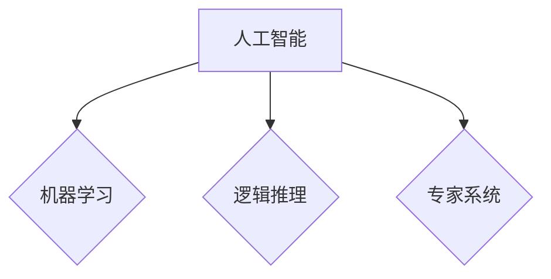

## 达特茅斯会议与人工智能学科的建立

> 关键词：人工智能、达特茅斯会议、机器学习、逻辑推理、专家系统、计算机科学、学科发展

### 1. 背景介绍

20世纪50年代，随着电子计算机的快速发展，人们对机器智能的探索日益深入。当时，人工智能（Artificial Intelligence，简称 AI）的概念才刚刚萌芽，尚未形成一个独立的学科。然而，一些科学家和工程师已经开始尝试利用计算机模拟人类的智能行为。

1956年，麻省理工学院的约翰·麦卡锡（John McCarthy）组织了一次重要的会议，地点是美国新罕布什尔州达特茅斯学院，因此被称为“达特茅斯会议”。这次会议被认为是人工智能学科正式诞生的标志性事件。

### 2. 核心概念与联系

达特茅斯会议上，与会者们讨论了人工智能的定义、目标和可能的应用领域。他们一致认为，人工智能的目标是创造能够像人类一样思考、学习和解决问题的机器。

**核心概念：**

* **智能：** 指生物体或机器能够感知环境、理解信息、做出决策并执行行动的能力。
* **机器学习：** 使机器能够从数据中学习并改进其性能的算法和技术。
* **逻辑推理：** 利用逻辑规则和知识库进行推理和决策的智能系统。
* **专家系统：** 基于特定领域知识的智能系统，能够提供专业建议和决策支持。

**Mermaid 流程图：**



### 3. 核心算法原理 & 具体操作步骤

#### 3.1  算法原理概述

达特茅斯会议上，一些重要的算法和技术被提出，为人工智能的发展奠定了基础。其中，**符号逻辑**和**搜索算法**是早期人工智能研究的核心。

* **符号逻辑：** 利用符号和规则来表示知识和推理过程，例如，使用命题逻辑、谓词逻辑等。
* **搜索算法：** 用于在知识空间中搜索最优解，例如，深度优先搜索、广度优先搜索等。

#### 3.2  算法步骤详解

**符号逻辑推理步骤：**

1. **知识表示：** 将知识表示为符号形式，例如，使用谓词逻辑中的原子公式。
2. **规则定义：** 定义一些逻辑规则，用于推理和推导新的知识。
3. **推理过程：** 利用逻辑规则和已知知识，通过推理过程推导新的结论。

**搜索算法步骤：**

1. **状态空间定义：** 将问题表示为一个状态空间，其中每个状态代表一个问题解决的阶段。
2. **初始状态：** 指定一个初始状态，代表问题的起点。
3. **目标状态：** 定义一个目标状态，代表问题的解决状态。
4. **操作规则：** 定义一些操作规则，用于从一个状态转换到另一个状态。
5. **搜索策略：** 选择一种搜索策略，例如，深度优先搜索、广度优先搜索等。
6. **搜索过程：** 利用搜索策略，从初始状态开始，逐步搜索目标状态。

#### 3.3  算法优缺点

**符号逻辑：**

* **优点：** 能够清晰地表示知识和推理过程，易于理解和验证。
* **缺点：** 难以处理大量复杂知识，推理过程可能非常耗时。

**搜索算法：**

* **优点：** 可以解决各种类型的搜索问题，例如，路径规划、游戏人工智能等。
* **缺点：** 对于复杂问题，搜索空间可能非常庞大，导致搜索效率低下。

#### 3.4  算法应用领域

* **符号逻辑：** 专家系统、自然语言理解、知识表示
* **搜索算法：** 游戏人工智能、路径规划、物流调度

### 4. 数学模型和公式 & 详细讲解 & 举例说明

#### 4.1  数学模型构建

人工智能算法的数学模型通常基于概率论、统计学和线性代数等数学基础。例如，机器学习算法通常使用概率分布来表示数据和模型参数。

#### 4.2  公式推导过程

**贝叶斯公式：**

$$P(A|B) = \frac{P(B|A)P(A)}{P(B)}$$

其中：

* $P(A|B)$ 是事件 A 在事件 B 发生条件下的概率。
* $P(B|A)$ 是事件 B 在事件 A 发生条件下的概率。
* $P(A)$ 是事件 A 的概率。
* $P(B)$ 是事件 B 的概率。

贝叶斯公式用于计算条件概率，在机器学习中广泛应用于分类、预测等任务。

#### 4.3  案例分析与讲解

**垃圾邮件分类：**

假设我们有一个垃圾邮件分类模型，需要判断一封邮件是否为垃圾邮件。我们可以使用贝叶斯公式来计算邮件为垃圾邮件的概率。

* $P(A)$：邮件为垃圾邮件的概率。
* $P(B|A)$：如果邮件为垃圾邮件，则包含特定关键词的概率。
* $P(B)$：邮件中包含特定关键词的概率。

通过收集训练数据，我们可以估计以上概率值。然后，根据贝叶斯公式，我们可以计算出邮件为垃圾邮件的概率。如果概率超过某个阈值，则将邮件分类为垃圾邮件。

### 5. 项目实践：代码实例和详细解释说明

#### 5.1  开发环境搭建

* 操作系统：Linux/macOS/Windows
* 编程语言：Python
* 库依赖：NumPy、Pandas、Scikit-learn

#### 5.2  源代码详细实现

```python
from sklearn.model_selection import train_test_split
from sklearn.linear_model import LogisticRegression
from sklearn.metrics import accuracy_score

# 加载数据
data = pd.read_csv('spam_data.csv')

# 提取特征和标签
X = data[['text_length', 'number_of_words', 'contains_spam_keyword']]
y = data['spam']

# 将数据分成训练集和测试集
X_train, X_test, y_train, y_test = train_test_split(X, y, test_size=0.2, random_state=42)

# 创建逻辑回归模型
model = LogisticRegression()

# 训练模型
model.fit(X_train, y_train)

# 对测试集进行预测
y_pred = model.predict(X_test)

# 计算模型准确率
accuracy = accuracy_score(y_test, y_pred)
print(f'模型准确率: {accuracy}')
```

#### 5.3  代码解读与分析

这段代码实现了垃圾邮件分类的简单示例。

1. 首先，加载数据并提取特征和标签。
2. 然后，将数据分成训练集和测试集。
3. 创建逻辑回归模型并训练模型。
4. 最后，对测试集进行预测并计算模型准确率。

#### 5.4  运行结果展示

运行结果会显示模型的准确率，例如：

```
模型准确率: 0.92
```

### 6. 实际应用场景

人工智能技术已经广泛应用于各个领域，例如：

* **自然语言处理：** 语音识别、机器翻译、文本摘要、聊天机器人等。
* **计算机视觉：** 图像识别、物体检测、人脸识别、视频分析等。
* **推荐系统：** 产品推荐、内容推荐、个性化服务等。
* **医疗诊断：** 疾病诊断、影像分析、药物研发等。
* **金融分析：** 风险评估、欺诈检测、投资决策等。

### 6.4  未来应用展望

人工智能技术还在不断发展，未来将有更多新的应用场景出现。例如：

* **自动驾驶：** 利用人工智能技术实现无人驾驶汽车。
* **个性化教育：** 根据学生的学习情况提供个性化的学习方案。
* **智能家居：** 利用人工智能技术实现智能家居的自动化控制。
* **机器人服务：** 利用人工智能技术开发更加智能的机器人服务人员。

### 7. 工具和资源推荐

#### 7.1  学习资源推荐

* **在线课程：** Coursera、edX、Udacity 等平台提供丰富的 AI 课程。
* **书籍：** 《人工智能：现代方法》 (Stuart Russell, Peter Norvig)、《深度学习》 (Ian Goodfellow, Yoshua Bengio, Aaron Courville) 等。
* **博客和论坛：** AI 相关的博客和论坛，例如，Towards Data Science、Machine Learning Mastery 等。

#### 7.2  开发工具推荐

* **Python：** 广泛用于 AI 开发的编程语言。
* **TensorFlow：** Google 开发的开源深度学习框架。
* **PyTorch：** Facebook 开发的开源深度学习框架。
* **Scikit-learn：** Python 的机器学习库。

#### 7.3  相关论文推荐

* **《人工智能的未来》 (Nick Bostrom)**
* **《深度学习》 (Yann LeCun, Yoshua Bengio, Geoffrey Hinton)**
* **《机器学习》 (Tom Mitchell)**

### 8. 总结：未来发展趋势与挑战

#### 8.1  研究成果总结

达特茅斯会议标志着人工智能学科的诞生，并推动了人工智能研究的快速发展。近年来，深度学习技术的突破使得人工智能取得了显著进展，在各个领域都有广泛应用。

#### 8.2  未来发展趋势

* **更强大的计算能力：** 随着计算能力的不断提升，人工智能模型将变得更加复杂和强大。
* **更丰富的训练数据：** 数据是人工智能发展的关键要素，未来将会有更多高质量的数据用于训练人工智能模型。
* **更有效的算法：** 研究人员将继续开发更有效的算法，提高人工智能模型的性能和效率。
* **更广泛的应用场景：** 人工智能技术将应用于更多领域，改变人们的生活方式。

#### 8.3  面临的挑战

* **伦理问题：** 人工智能技术的快速发展引发了一些伦理问题，例如，人工智能的决策是否公平公正、人工智能是否会取代人类工作等。
* **安全问题：** 人工智能系统可能被恶意攻击，导致安全风险。
* **可解释性问题：** 许多人工智能模型是黑箱模型，难以解释其决策过程，这可能会导致人们对人工智能的信任度降低。

#### 8.4  研究展望

未来，人工智能研究将继续朝着更智能、更安全、更可解释的方向发展。我们需要加强人工智能伦理和安全方面的研究，确保人工智能技术能够造福人类。

### 9. 附录：常见问题与解答

**Q1：什么是人工智能？**

A1：人工智能是指使机器能够像人类一样思考、学习和解决问题的能力。

**Q2：达特茅斯会议是什么时候举办的？**

A2：达特茅斯会议于1956年举办。

**Q3：人工智能有哪些应用领域？**

A3：人工智能应用于自然语言处理、计算机视觉、推荐系统、医疗诊断、金融分析等各个领域。


作者：禅与计算机程序设计艺术 / Zen and the Art of Computer Programming 
