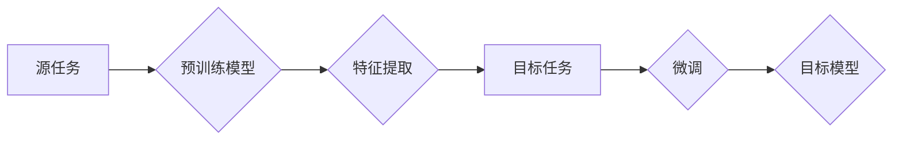

## 迁移学习Transfer Learning原理与代码实例讲解

> 关键词：迁移学习、深度学习、预训练模型、特征提取、领域适应、Fine-tuning、Transfer Learning

## 1. 背景介绍

在深度学习领域，训练一个强大的模型通常需要大量的 labeled 数据和大量的计算资源。然而，在许多实际应用场景中，获取大量 labeled 数据往往非常困难和昂贵。迁移学习 (Transfer Learning) 应运而生，它是一种利用已训练好的模型在新的任务或领域上进行学习的机器学习技术。

迁移学习的核心思想是：将预先训练好的模型在源任务上的知识迁移到目标任务中，从而提高目标任务模型的性能，并减少对目标任务 labeled 数据的需求。

迁移学习在近年来取得了显著的进展，并在图像识别、自然语言处理、语音识别等领域取得了令人瞩目的成果。

## 2. 核心概念与联系

**2.1 核心概念**

* **源任务 (Source Task):** 预训练模型在训练过程中使用的任务，通常拥有大量的 labeled 数据。
* **目标任务 (Target Task):** 迁移学习的目标任务，通常数据量较少，或者与源任务存在一定的差异。
* **特征提取 (Feature Extraction):** 利用预训练模型提取源任务的特征，作为目标任务模型的输入。
* **微调 (Fine-tuning):** 对预训练模型进行微调，使其适应目标任务的特定数据分布。

**2.2 迁移学习架构**



**2.3 迁移学习类型**

* **特征提取式迁移学习:** 直接使用预训练模型提取特征，不进行模型参数的更新。
* **微调式迁移学习:** 对预训练模型进行微调，更新部分或全部模型参数，使其适应目标任务。

## 3. 核心算法原理 & 具体操作步骤

**3.1 算法原理概述**

迁移学习的核心原理是利用源任务中学习到的通用特征，来帮助目标任务模型更快地学习目标任务的知识。

预训练模型在源任务上训练时，学习到了底层特征，这些特征对于多种任务都具有普遍意义。例如，在图像识别任务中，预训练模型学习到了边缘、纹理、形状等底层特征，这些特征对于识别不同的物体类型都很有帮助。

迁移学习通过将预训练模型的特征提取层作为目标任务模型的一部分，可以有效地减少目标任务模型的训练时间和数据需求。

**3.2 算法步骤详解**

1. **选择预训练模型:** 根据目标任务选择合适的预训练模型。
2. **特征提取:** 将预训练模型的特征提取层作为目标任务模型的一部分，并冻结其参数。
3. **数据预处理:** 对目标任务的数据进行预处理，使其与预训练模型的输入格式一致。
4. **模型训练:** 使用目标任务的数据训练目标任务模型，并根据目标任务的损失函数进行优化。
5. **微调:** 如果需要，可以对预训练模型的部分或全部参数进行微调，以进一步提高目标任务模型的性能。

**3.3 算法优缺点**

* **优点:**
    * 减少数据需求
    * 提高模型性能
    * 缩短训练时间
* **缺点:**
    * 需要找到合适的预训练模型
    * 预训练模型的特征可能与目标任务不完全匹配
    * 微调过程可能需要大量的计算资源

**3.4 算法应用领域**

* **图像识别:** 使用预训练的图像分类模型进行目标检测、图像分割等任务。
* **自然语言处理:** 使用预训练的语言模型进行文本分类、情感分析、机器翻译等任务。
* **语音识别:** 使用预训练的语音识别模型进行语音转文本等任务。

## 4. 数学模型和公式 & 详细讲解 & 举例说明

**4.1 数学模型构建**

迁移学习的数学模型可以看作是一个多层神经网络，其中包含预训练模型的特征提取层和目标任务模型的分类层。

**4.2 公式推导过程**

目标任务模型的损失函数可以定义为：

$$L = \sum_{i=1}^{N} \mathcal{L}(y_i, \hat{y}_i)$$

其中：

* $N$ 是样本数量
* $y_i$ 是第 $i$ 个样本的真实标签
* $\hat{y}_i$ 是第 $i$ 个样本的预测标签
* $\mathcal{L}$ 是损失函数

**4.3 案例分析与讲解**

假设我们使用预训练的图像分类模型进行目标检测任务。

* **源任务:** 图像分类
* **目标任务:** 目标检测

我们可以将预训练模型的特征提取层作为目标检测模型的一部分，并冻结其参数。然后，我们使用目标检测任务的数据训练目标检测模型的分类层。

在训练过程中，目标检测模型的损失函数会根据目标检测任务的实际情况进行调整。

## 5. 项目实践：代码实例和详细解释说明

**5.1 开发环境搭建**

* Python 3.6+
* TensorFlow 2.0+
* PyTorch 1.0+
* CUDA 10.0+ (可选)

**5.2 源代码详细实现**

```python
import tensorflow as tf

# 加载预训练模型
model = tf.keras.applications.ResNet50(weights='imagenet', include_top=False)

# 冻结预训练模型的权重
for layer in model.layers:
    layer.trainable = False

# 添加目标任务的分类层
x = model.output
x = tf.keras.layers.GlobalAveragePooling2D()(x)
x = tf.keras.layers.Dense(1024, activation='relu')(x)
predictions = tf.keras.layers.Dense(num_classes, activation='softmax')(x)

# 创建模型
model = tf.keras.Model(inputs=model.input, outputs=predictions)

# 编译模型
model.compile(optimizer='adam',
              loss='categorical_crossentropy',
              metrics=['accuracy'])

# 训练模型
model.fit(train_data, train_labels, epochs=10)
```

**5.3 代码解读与分析**

* 我们使用 TensorFlow 的 `keras.applications.ResNet50` 函数加载预训练的 ResNet50 模型。
* `include_top=False` 表示不包含预训练模型的分类层。
* 我们冻结预训练模型的所有层，防止其参数在训练过程中更新。
* 我们添加一个新的分类层，用于预测目标任务的类别。
* 我们使用 Adam 优化器、交叉熵损失函数和准确率作为评估指标编译模型。
* 我们使用训练数据训练模型 10 个 epochs。

**5.4 运行结果展示**

训练完成后，我们可以使用测试数据评估模型的性能。

```python
loss, accuracy = model.evaluate(test_data, test_labels)
print('Test Loss:', loss)
print('Test Accuracy:', accuracy)
```

## 6. 实际应用场景

**6.1 医疗诊断**

迁移学习可以用于训练医疗图像分类模型，例如用于识别肿瘤、骨折等疾病。

**6.2 自然语言处理**

迁移学习可以用于训练文本分类模型，例如用于识别垃圾邮件、情感分析等任务。

**6.3 自动驾驶**

迁移学习可以用于训练自动驾驶汽车的图像识别模型，例如用于识别交通信号灯、行人等物体。

**6.4 未来应用展望**

随着深度学习技术的不断发展，迁移学习将在更多领域得到应用，例如：

* **个性化推荐:** 利用用户行为数据训练个性化推荐模型。
* **机器翻译:** 利用多语言数据训练更准确的机器翻译模型。
* **语音合成:** 利用语音数据训练更自然的人工语音合成模型。

## 7. 工具和资源推荐

**7.1 学习资源推荐**

* **书籍:**
    * Deep Learning with Python by Francois Chollet
    * Transfer Learning in Natural Language Processing by Sebastian Ruder
* **课程:**
    * Stanford CS231n: Convolutional Neural Networks for Visual Recognition
    * Deep Learning Specialization by Andrew Ng

**7.2 开发工具推荐**

* **TensorFlow:** https://www.tensorflow.org/
* **PyTorch:** https://pytorch.org/
* **Keras:** https://keras.io/

**7.3 相关论文推荐**

* **ImageNet Classification with Deep Convolutional Neural Networks** by Alex Krizhevsky, Ilya Sutskever, and Geoffrey E. Hinton
* **Transfer Learning** by Pan, S. J., & Yang, Q.

## 8. 总结：未来发展趋势与挑战

**8.1 研究成果总结**

迁移学习在近年来取得了显著的进展，并在许多领域取得了令人瞩目的成果。

**8.2 未来发展趋势**

* **更有效的迁移学习算法:** 研究更有效的迁移学习算法，例如基于对抗训练的迁移学习算法。
* **跨模态迁移学习:** 研究跨模态迁移学习，例如将图像识别模型迁移到语音识别任务。
* **联邦迁移学习:** 研究联邦迁移学习，例如在不共享原始数据的情况下进行迁移学习。

**8.3 面临的挑战**

* **数据分布不一致:** 源任务和目标任务的数据分布可能存在差异，这会影响迁移学习的性能。
* **模型选择:** 选择合适的预训练模型对于迁移学习的成功至关重要。
* **计算资源:** 微调预训练模型可能需要大量的计算资源。

**8.4 研究展望**

迁移学习是一个充满挑战和机遇的领域，未来将会有更多的研究工作投入到该领域，以解决上述挑战，并推动迁移学习技术的进一步发展。

## 9. 附录：常见问题与解答

**9.1 如何选择合适的预训练模型？**

选择合适的预训练模型取决于目标任务和数据特点。

* **任务相似性:** 选择与目标任务相似的预训练模型。
* **数据规模:** 选择与目标任务数据规模相匹配的预训练模型。
* **模型大小:** 选择合适的模型大小，平衡性能和计算资源。

**9.2 如何处理数据分布不一致？**

可以使用数据增强、领域自适应等技术来处理数据分布不一致问题。

**9.3 如何评估迁移学习模型的性能？**

可以使用与目标任务相关的指标来评估迁移学习模型的性能，例如准确率、召回率、F1-score等。


作者：禅与计算机程序设计艺术 / Zen and the Art of Computer Programming 
