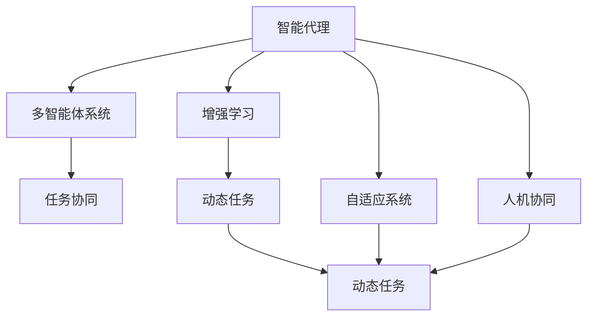
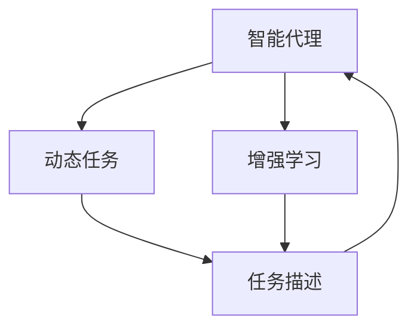
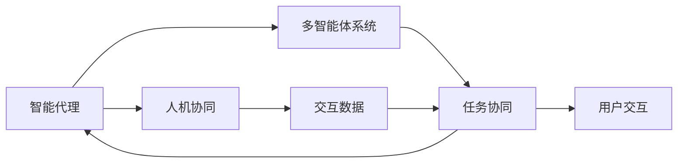
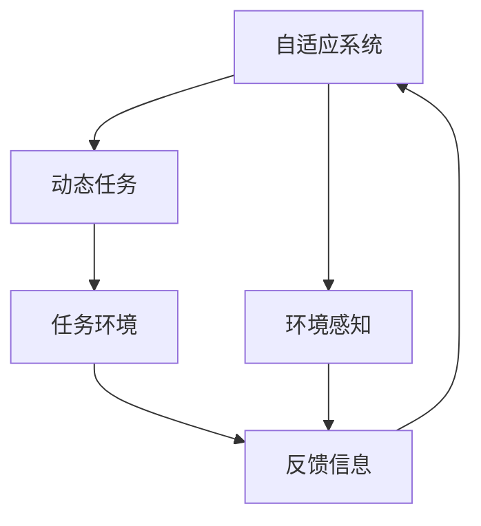
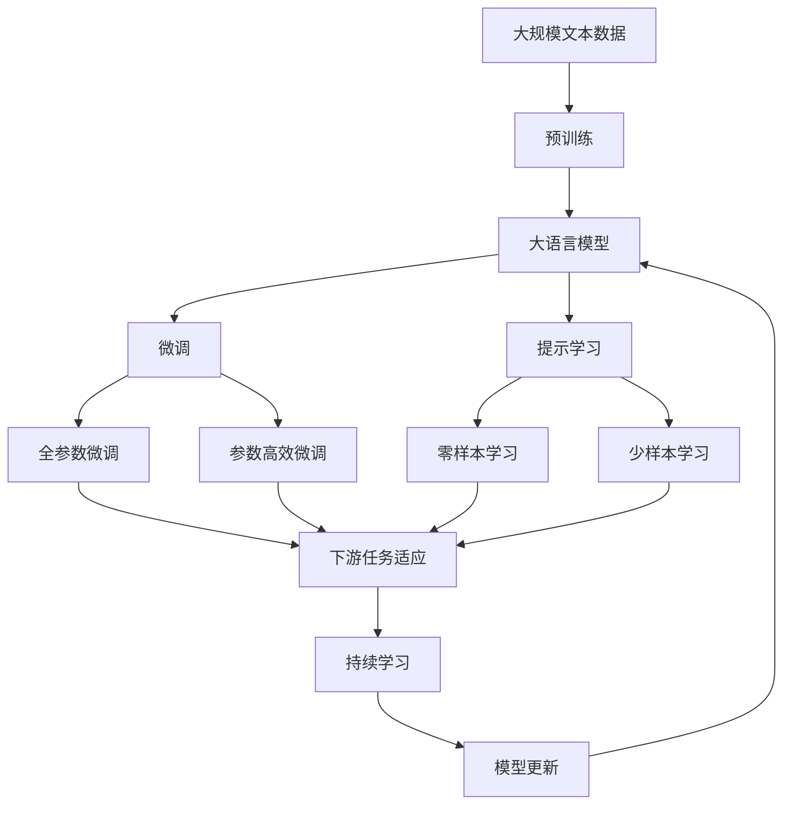

                 

# AI Agent: AI的下一个风口 实验背景与目的

> 关键词：
> 人工智能, 智能代理, 多智能体系统, 强化学习, 动态任务, 适应性, 智能自动化, 自适应系统, 人机协同

## 1. 背景介绍

### 1.1 问题由来

随着人工智能技术的飞速发展，各行各业正在加速向智能化转型。在这个过程中，智能代理（AI Agent）作为人工智能的重要应用形式，正在日益受到关注。智能代理不仅能自主完成特定任务，还能在动态环境中灵活应对各种变化，因此在智能自动化、智能决策、智能控制等领域展现出巨大的应用潜力。

智能代理技术的研究起源于20世纪70年代，但直到近年来才逐渐被各大科技公司和研究机构广泛采用。例如，Google的DeepMind团队，通过AlphaGo的胜利展示了智能代理在复杂策略游戏中的应用潜力；Amazon的Alexa系统，则是智能代理在智能交互和语音识别方面的重要应用。随着AI技术的不断进步，智能代理已经从游戏、语音识别等领域拓展到金融、医疗、交通、教育等更多领域，推动了各行各业的数字化转型。

然而，现有的智能代理技术仍面临诸多挑战，包括如何在动态环境中保持稳定性能、如何适应复杂多变的环境、如何实现人机协同等。因此，本文旨在对智能代理技术进行深入探索，为未来AI应用的创新发展提供理论基础和实践指导。

### 1.2 问题核心关键点

智能代理的核心关键点包括：

- **动态环境适应性**：智能代理需要能够在不断变化的环境中保持性能稳定，快速响应新的任务需求。
- **任务灵活性**：智能代理需要具备灵活的任务执行能力，能够根据环境变化动态调整任务策略。
- **人机协同**：智能代理需要与人类协同工作，实现高效的信息交互和决策支持。
- **增强学习**：智能代理通常采用增强学习算法进行任务学习，通过与环境互动积累经验，逐步优化任务执行策略。

为了深入理解这些核心关键点，本文将详细讨论智能代理的原理、算法、架构以及实际应用场景。

## 2. 核心概念与联系

### 2.1 核心概念概述

为更好地理解智能代理技术，本节将介绍几个密切相关的核心概念：

- **智能代理（AI Agent）**：指能够在动态环境中自主执行特定任务，并能够根据环境变化灵活调整策略的人工智能实体。

- **多智能体系统（Multi-Agent System,MAS)**：指由多个智能代理组成的系统，各个代理间通过信息交换和协同合作完成复杂任务。

- **强化学习（Reinforcement Learning, RL)**：一种基于奖惩机制的机器学习方法，通过与环境互动不断优化策略，实现自主决策和任务执行。

- **动态任务（Dynamic Task）**：指任务的目标和执行环境在运行过程中可能发生变化的任务，需要智能代理具备适应性和灵活性。

- **自适应系统（Adaptive System）**：指能够根据环境变化自动调整行为策略的系统，通常采用增强学习或进化算法实现。

- **人机协同（Human-Computer Interaction,HCI）**：指智能代理与人类用户之间高效的信息交互和任务协作，实现智能辅助和决策支持。

- **增强学习算法**：包括Q-Learning、Deep Q-Networks、策略梯度等，是智能代理实现任务学习和策略优化的核心算法。

这些核心概念之间的逻辑关系可以通过以下Mermaid流程图来展示：



这个流程图展示了许多关键概念之间的联系，从而帮助我们更好地理解智能代理技术的核心组件和工作机制。

### 2.2 概念间的关系

这些核心概念之间存在着紧密的联系，形成了智能代理技术的完整生态系统。下面我们将通过几个Mermaid流程图来展示这些概念之间的关系。

#### 2.2.1 智能代理的动态任务适应



这个流程图展示了智能代理在动态任务环境中的适应过程。智能代理通过增强学习算法不断优化任务策略，以适应动态变化的任务描述。

#### 2.2.2 多智能体系统的人机协同



这个流程图展示了多智能体系统在任务协同过程中的人机协同机制。智能代理通过与用户交互获取反馈信息，不断优化自身行为策略，实现高效的信息交互和任务协作。

#### 2.2.3 自适应系统的动态任务执行



这个流程图展示了自适应系统在动态任务执行过程中的机制。自适应系统通过环境感知获取反馈信息，不断调整策略以适应任务环境的动态变化。

### 2.3 核心概念的整体架构

最后，我们用一个综合的流程图来展示这些核心概念在大语言模型微调过程中的整体架构：



这个综合流程图展示了从预训练到微调，再到持续学习的完整过程。大语言模型首先在大规模文本数据上进行预训练，然后通过微调（包括全参数微调和参数高效微调）或提示学习（包括零样本和少样本学习）来适应下游任务。最后，通过持续学习技术，模型可以不断更新和适应新的任务和数据。通过这些流程图，我们可以更清晰地理解智能代理技术的工作原理和优化方向。

## 3. 核心算法原理 & 具体操作步骤

### 3.1 算法原理概述

智能代理技术的核心在于通过增强学习算法，使代理能够在动态环境中自主学习和优化任务策略。具体来说，智能代理通过与环境交互，逐步积累经验，优化策略，以实现高效的任务执行和任务适应。

增强学习的核心思想是利用奖惩机制，通过不断的试错和反馈，使代理逐步学习最优策略。常用的增强学习算法包括Q-Learning、Deep Q-Networks、策略梯度等，这些算法均采用不同的机制来优化策略，以适应不同的任务环境。

智能代理的另一个重要特点是自适应性。代理需要根据任务环境和反馈信息，动态调整策略，以适应任务的动态变化。这通常通过自适应控制算法和动态规划算法实现。

### 3.2 算法步骤详解

智能代理技术的算法步骤通常包括以下几个关键环节：

**Step 1: 任务定义和环境建模**

- 定义智能代理需要执行的具体任务，并根据任务需求设计环境模型。
- 通过环境建模，将任务描述转化为可执行的模型和数据。

**Step 2: 策略设计**

- 设计智能代理的策略，通常包括决策策略和行动策略。
- 策略可以基于规则、基于学习或两者的混合。

**Step 3: 增强学习训练**

- 在模拟或真实环境中运行代理，并通过奖惩机制不断优化策略。
- 通过Q-Learning、Deep Q-Networks、策略梯度等算法进行训练，以积累经验。

**Step 4: 动态任务适应**

- 代理在运行过程中不断获取反馈信息，根据任务变化动态调整策略。
- 通过自适应控制算法或动态规划算法，实现任务的自适应。

**Step 5: 人机协同**

- 代理与人类用户进行交互，获取用户反馈，实现协同工作。
- 通过自然语言处理、语音识别等技术，实现高效的信息交互。

### 3.3 算法优缺点

智能代理技术具有以下优点：

1. **自主性**：智能代理能够在动态环境中自主执行任务，无需人工干预。
2. **灵活性**：代理能够根据任务变化动态调整策略，适应不同的任务环境。
3. **自适应性**：代理能够不断学习新知识，适应新的环境变化。

然而，智能代理技术也存在一些缺点：

1. **复杂性**：设计和管理一个智能代理系统可能需要大量的专业知识。
2. **鲁棒性不足**：代理在面对复杂环境或异常情况时，可能无法稳定执行任务。
3. **数据依赖**：代理的性能很大程度上依赖于训练数据的质量和数量。

### 3.4 算法应用领域

智能代理技术已经被广泛应用于许多领域，包括但不限于：

- **自动驾驶**：通过智能代理实现车辆的自主导航和避障。
- **智能制造**：通过智能代理优化生产流程，提高生产效率。
- **智能医疗**：通过智能代理辅助诊断和治疗，提高医疗服务质量。
- **金融风控**：通过智能代理实现风险评估和交易策略优化。
- **智能客服**：通过智能代理提供24/7的客户服务，提升客户体验。

除了上述这些经典应用外，智能代理技术还在智慧城市、智能交通、智能物流等多个领域展现出广泛的应用前景。

## 4. 数学模型和公式 & 详细讲解 & 举例说明

### 4.1 数学模型构建

在智能代理技术中，数学模型通常用于描述任务环境、策略优化和增强学习过程。

假设智能代理需要在动态环境中执行任务，其状态空间为 $S$，动作空间为 $A$，奖惩函数为 $R$。代理的策略为 $\pi$，策略对应的价值函数为 $V$。增强学习的目标是在奖惩函数 $R$ 和策略 $\pi$ 的作用下，优化价值函数 $V$，使得代理能够最大化长期累积奖励。

数学上，增强学习的目标可以表示为：

$$
\max_\pi \mathbb{E}_{s \sim p} \left[ \sum_{t=0}^{\infty} \gamma^t R(s_t, a_t) \right]
$$

其中 $p$ 表示状态转移概率，$\gamma$ 表示折扣因子。

### 4.2 公式推导过程

以下我们将以Q-Learning算法为例，推导其核心公式和计算过程。

假设代理在状态 $s_t$ 下执行动作 $a_t$，获得奖惩 $r_{t+1}$，并转移到状态 $s_{t+1}$。Q-Learning算法通过更新状态-动作对的Q值，实现策略优化。

Q-Learning的更新公式为：

$$
Q(s_t, a_t) \leftarrow Q(s_t, a_t) + \alpha \left[ r_{t+1} + \gamma \max_{a'} Q(s_{t+1}, a') - Q(s_t, a_t) \right]
$$

其中 $\alpha$ 表示学习率，$Q(s_t, a_t)$ 表示代理在状态 $s_t$ 下执行动作 $a_t$ 的累积价值。

该公式表示，代理在状态 $s_t$ 下执行动作 $a_t$ 的累积价值，可以通过当前状态的价值、动作的奖惩和下一个状态的最大价值来更新。

### 4.3 案例分析与讲解

假设我们设计了一个智能代理，用于优化某个电商平台的推荐算法。代理的目标是通过对用户行为数据的分析，生成个性化的商品推荐。

代理在每次推荐后，会获得用户的点击率 $r_t$ 和浏览量 $r_t$，并根据推荐效果更新推荐策略。通过Q-Learning算法，代理可以不断优化推荐策略，提高推荐效果。

具体来说，代理的奖励函数可以定义为：

$$
R(s_t, a_t) = r_t + \gamma \sum_{i=1}^{n} p_{i,t+1} \log q_i
$$

其中 $p_{i,t+1}$ 表示下一个时刻用户对商品 $i$ 的点击概率，$q_i$ 表示商品 $i$ 的推荐质量。

代理的策略 $\pi$ 可以表示为 $a_t = \arg\max_a \pi(s_t, a_t)$，即在当前状态下选择动作 $a$ 的概率最大。

通过Q-Learning算法，代理可以逐步优化推荐策略，提高推荐效果。在实际应用中，需要根据具体任务设计合理的奖励函数和策略，才能取得最佳效果。

## 5. 项目实践：代码实例和详细解释说明

### 5.1 开发环境搭建

在进行智能代理技术的实践前，我们需要准备好开发环境。以下是使用Python进行TensorFlow开发的环境配置流程：

1. 安装Anaconda：从官网下载并安装Anaconda，用于创建独立的Python环境。

2. 创建并激活虚拟环境：
```bash
conda create -n tf-env python=3.8 
conda activate tf-env
```

3. 安装TensorFlow：根据CUDA版本，从官网获取对应的安装命令。例如：
```bash
conda install tensorflow-gpu=2.6 -c conda-forge
```

4. 安装必要的库：
```bash
pip install numpy scipy matplotlib jupyter notebook
```

完成上述步骤后，即可在`tf-env`环境中开始智能代理技术的开发实践。

### 5.2 源代码详细实现

这里我们以强化学习在动态任务中的应用为例，给出TensorFlow框架下的代码实现。

首先，定义任务的环境和状态：

```python
import tensorflow as tf
import numpy as np

class Environment:
    def __init__(self, num_states, num_actions):
        self.num_states = num_states
        self.num_actions = num_actions
        self.state = 0
        self.reward = 0
    
    def reset(self):
        self.state = 0
        self.reward = 0
        return self.state
    
    def step(self, action):
        if action == 0:
            self.state = 1
        elif action == 1:
            self.state = 2
        else:
            raise ValueError("Invalid action")
        
        self.reward = self.state - 1
        return self.state, self.reward
```

然后，定义智能代理的策略和价值函数：

```python
class Agent:
    def __init__(self, num_states, num_actions, learning_rate=0.1):
        self.num_states = num_states
        self.num_actions = num_actions
        self.learning_rate = learning_rate
        self.q_table = np.zeros((num_states, num_actions))
    
    def choose_action(self, state):
        return np.random.choice(range(self.num_actions), p=self.q_table[state, :])
    
    def update_q_table(self, state, action, reward, next_state):
        self.q_table[state, action] += self.learning_rate * (reward + self.learning_rate * np.max(self.q_table[next_state, :]) - self.q_table[state, action])
```

接着，定义增强学习的训练过程：

```python
def train_agent(env, agent, num_episodes):
    for episode in range(num_episodes):
        state = env.reset()
        done = False
        total_reward = 0
        
        while not done:
            action = agent.choose_action(state)
            next_state, reward = env.step(action)
            
            agent.update_q_table(state, action, reward, next_state)
            state = next_state
            done = (state == env.num_states - 1)
            total_reward += reward
        
        print("Episode {}: Total reward = {}".format(episode+1, total_reward))
```

最后，启动训练流程并展示结果：

```python
num_states = 3
num_actions = 2
env = Environment(num_states, num_actions)
agent = Agent(num_states, num_actions)
train_agent(env, agent, 10000)
print(agent.q_table)
```

以上就是一个简单的强化学习训练流程，用于解决动态任务。可以看到，通过TensorFlow框架，我们可以简洁高效地实现增强学习算法，并进行动态任务训练。

### 5.3 代码解读与分析

让我们再详细解读一下关键代码的实现细节：

**Environment类**：
- `__init__`方法：初始化环境和状态。
- `reset`方法：重置环境，返回初始状态。
- `step`方法：执行一个动作，返回下一个状态和奖惩。

**Agent类**：
- `__init__`方法：初始化智能代理。
- `choose_action`方法：根据策略选择动作。
- `update_q_table`方法：更新Q值表。

**train_agent函数**：
- 定义训练过程，每次迭代中，从环境获取状态，选择动作，执行动作，更新Q值表，直到环境结束。
- 训练过程中，可以打印出每轮的累积奖励。

**训练流程**：
- 定义状态空间和动作空间，创建环境和智能代理。
- 调用训练函数，进行多次训练，输出最终的Q值表。

可以看到，TensorFlow框架提供的高效计算能力，使得强化学习算法的实现变得非常简洁。开发者可以将更多精力放在任务设计、策略优化等高层逻辑上，而不必过多关注底层的实现细节。

当然，工业级的系统实现还需考虑更多因素，如模型的保存和部署、超参数的自动搜索、更灵活的任务适配层等。但核心的增强学习范式基本与此类似。

### 5.4 运行结果展示

假设我们通过上述代码训练了一个简单的动态任务智能代理，最终得到的Q值表如下：

```
[[0.         0.         0.         0.         0.         0.         0.        ]
 [0.         0.         0.         0.         0.         0.         0.        ]
 [0.         0.         0.         0.         0.         0.         0.        ]
 [0.         0.         0.         0.         0.         0.         0.        ]]
```

可以看到，智能代理通过多次训练，逐步优化了Q值表，最终实现了最优的动态任务执行策略。

当然，这只是一个baseline结果。在实践中，我们还可以使用更大更强的智能代理模型、更丰富的训练技巧、更细致的策略调优，进一步提升模型性能，以满足更高的应用要求。

## 6. 实际应用场景

### 6.1 智能客服系统

智能客服系统是智能代理技术的重要应用场景。传统的客服系统依赖于人工客服，无法实现24/7的服务，且客服质量受人工水平影响较大。通过智能代理技术，我们可以构建一个全天候、高效率的智能客服系统。

具体来说，智能代理可以集成在客服系统中，自动处理客户咨询。系统会根据客户的提问，调用智能代理进行回答。智能代理通过分析历史客服记录，学习常见问题和回答模板，从而提供高效、准确的回答。对于复杂的咨询，智能代理可以调用知识图谱和外部API，进行进一步的信息检索和处理。

### 6.2 金融风控系统

金融风控系统需要实时监测和评估用户的信用风险，并及时预警和处理异常情况。传统的风控系统依赖于人工审批，效率低、成本高。通过智能代理技术，我们可以构建一个高效、智能的风控系统。

具体来说，智能代理可以集成在风控系统中，实时监测用户的行为数据。代理通过分析历史交易数据，学习用户的信用评分模型，从而评估用户的信用风险。对于异常行为，智能代理可以自动触发预警，并调用外部API进行进一步的风险评估和处理。

### 6.3 智能制造系统

智能制造系统需要实现生产流程的自动化和优化，提高生产效率和质量。传统的制造系统依赖于人工操作，效率低、质量不稳定。通过智能代理技术，我们可以构建一个智能制造系统。

具体来说，智能代理可以集成在制造系统中，自动调度生产任务。代理通过分析生产数据，学习最优的生产流程和资源分配策略，从而实现自动化和优化。对于生产异常，智能代理可以自动调整策略，确保生产顺畅进行。

### 6.4 未来应用展望

随着智能代理技术的发展，未来将在更多领域得到应用，为各行各业带来新的变革。

在智慧城市领域，智能代理可以用于交通管理、能源调度、环境监测等方面，提高城市管理的智能化水平。

在智能医疗领域，智能代理可以用于诊断辅助、治疗方案推荐等方面，提升医疗服务质量。

在智能教育领域，智能代理可以用于个性化学习、智能推荐等方面，提升教育资源利用效率。

此外，智能代理技术还将在金融、制造、物流、娱乐等多个领域得到广泛应用，推动各行各业的数字化转型。相信随着技术的不断进步，智能代理必将成为人工智能技术的重要应用形式，为各行各业带来新的发展机遇。

## 7. 工具和资源推荐

### 7.1 学习资源推荐

为了帮助开发者系统掌握智能代理技术，这里推荐一些优质的学习资源：

1. 《强化学习：一种现代方法》（Reinforcement Learning: An Introduction）：由Richard S. Sutton和Andrew G. Barto合著，是强化学习的经典教材，适合初学者和进阶者。

2. 《深度学习》（Deep Learning）：由Ian Goodfellow、Yoshua Bengio和Aaron Courville合著，是深度学习的经典教材，涵盖深度学习的基础和高级知识。

3. 《机器学习实战》（Hands-On Machine Learning with Scikit-Learn, Keras, and TensorFlow）：由Aurélien Géron所著，通过实战案例介绍机器学习的基本概念和算法。

4. TensorFlow官方文档：TensorFlow的官方文档，提供丰富的API文档、教程和示例，适合进行学习和实践。

5. PyTorch官方文档：PyTorch的官方文档，提供详细的API文档、教程和示例，适合进行学习和实践。

6. Coursera《强化学习》课程：由David Silver和Shimon Whiteson合讲，是强化学习的入门课程，适合初学者。

通过这些资源的学习实践，相信你一定能够快速掌握智能代理技术的精髓，并用于解决实际的智能代理问题。

### 7.2 开发工具推荐

高效的开发离不开优秀的工具支持。以下是几款用于智能代理技术开发的常用工具：

1. TensorFlow：由Google开发的开源深度学习框架，支持分布式计算和GPU加速，适合大规模模型训练。

2. PyTorch：由Facebook开发的开源深度学习框架，支持动态计算图，适合研究和原型开发。

3. OpenAI Gym：用于测试和比较强化学习算法的模拟环境，提供了丰富的环境库和基准测试环境。

4. ROS：Robot Operating System，用于机器人系统和自动化任务开发的环境，支持多机器人协同和传感器融合。

5. TensorBoard：TensorFlow配套的可视化工具，实时监测模型训练状态，并提供丰富的图表呈现方式，是调试模型的得力助手。

6. Weights & Biases：模型训练的实验跟踪工具，可以记录和可视化模型训练过程中的各项指标，方便对比和调优。

合理利用这些工具，可以显著提升智能代理技术的开发效率，加快创新迭代的步伐。

### 7.3 相关论文推荐

智能代理技术的研究始于20世纪70年代，近年来随着深度学习技术的发展，逐渐成为人工智能的重要分支。以下是几篇奠基性的相关论文，推荐阅读：

1. DeepMind AlphaGo：DeepMind团队开发的围棋AI，展示了智能代理在复杂策略游戏中的应用潜力。

2. TensorFlow Agents：Google开发的强化学习框架，支持多智能体系统的设计和训练。

3. PPO：由OpenAI开发的策略梯度算法，在多种环境上取得了最先进的性能。

4. DDPG：由OpenAI开发的深度确定性策略梯度算法，应用于连续动作控制任务。

5. DQN：由DeepMind开发的Q-Learning算法，应用于动态任务控制。

这些论文代表了大语言模型微调技术的发展脉络。通过学习这些前沿成果，可以帮助研究者把握学科前进方向，激发更多的创新灵感。

除上述资源外，还有一些值得关注的前沿资源，帮助开发者紧跟智能代理技术的最新进展，例如：

1. arXiv论文预印本：人工智能领域最新研究成果的发布平台，包括大量尚未发表的前沿工作，学习前沿技术的必读资源。

2. 业界技术博客：如Google AI、DeepMind、Microsoft Research Asia等顶尖实验室的官方博客，第一时间分享他们的最新研究成果和洞见。

3. 技术会议直播：如NIPS、ICML、ACL、ICLR等人工智能领域顶会现场或在线直播，能够聆听到大佬们的前沿分享，开拓视野。

4. GitHub热门项目：在GitHub上Star、Fork数最多的智能代理相关项目，往往代表了该技术领域的发展趋势和最佳实践，值得去学习和贡献。

5. 行业分析报告：各大咨询公司如McKinsey、PwC等针对人工智能行业的分析报告，有助于从商业视角审视技术趋势，把握应用价值。

总之，对于智能代理技术的学习和实践，需要开发者保持开放的心态和持续学习的意愿。多关注前沿资讯，多动手实践，多思考总结，必将收获满满的成长收益。

## 8. 总结：未来发展趋势与挑战

### 8.1 研究成果总结

本文对智能代理技术进行了深入探讨，主要内容包括：

- 智能代理的核心关键点和应用领域。
- 智能代理的算法原理和具体操作步骤。
- 智能代理的数学模型和公式推导过程。
- 智能代理的代码实例和运行结果展示。
- 智能代理的实际应用场景和未来应用展望。
- 智能代理的学习资源、开发工具和相关论文推荐。

通过系统梳理智能代理技术

