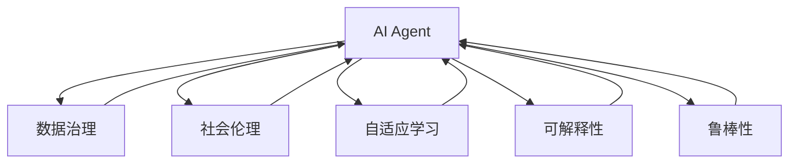
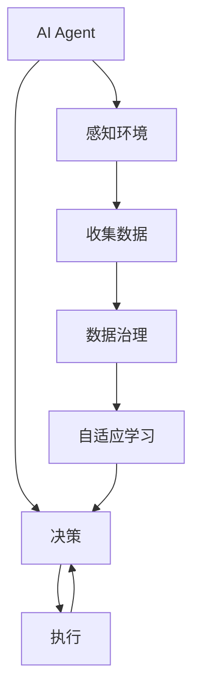
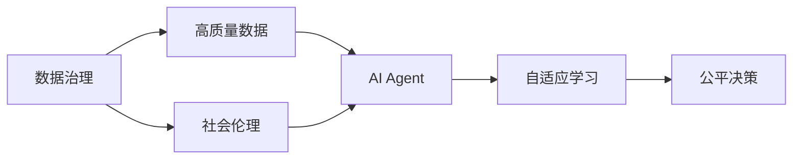
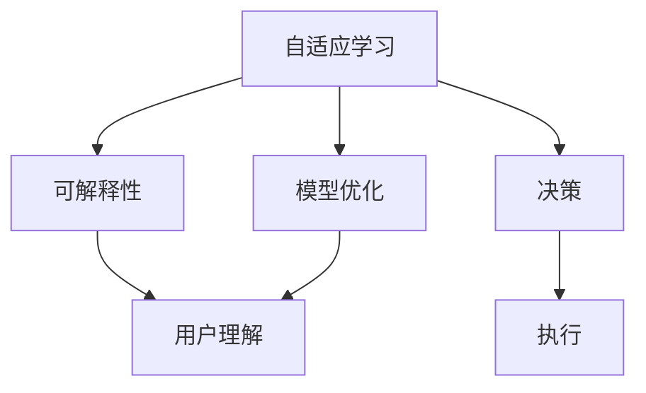
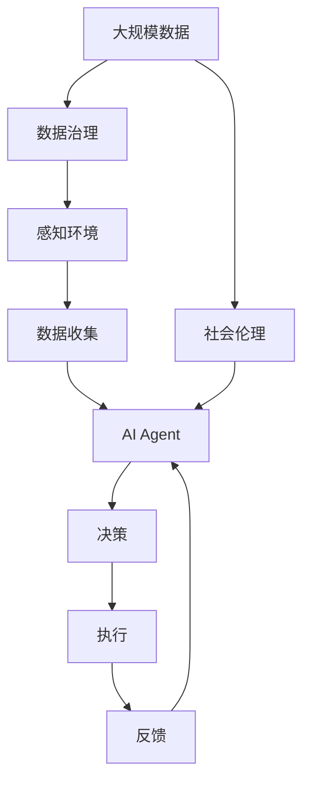

                 

# AI Agent: AI的下一个风口 数据治理与社会伦理

## 1. 背景介绍

### 1.1 问题由来

近年来，人工智能（AI）技术迅速发展，成为引领未来科技的重大方向之一。AI在医疗、金融、教育、交通等多个领域都展现出巨大的应用潜力，带来深远的社会影响。然而，AI技术的发展也带来了诸多挑战，尤其是数据治理和社会伦理问题，成为制约AI应用的重要瓶颈。

AI Agent技术作为一种新兴的AI技术，通过构建智能化的、能够自我学习和适应的软件系统，帮助解决复杂的数据治理和伦理决策问题。本文将从背景、核心概念、算法原理、具体实现和应用场景等角度，深入探讨AI Agent的相关问题，为AI技术的深入应用提供理论和技术指导。

### 1.2 问题核心关键点

AI Agent技术的应用涉及多方面的核心关键点：

- **数据治理**：AI Agent通过高效的数据管理和治理，保证数据质量，确保模型训练和决策的可解释性和可靠性。
- **社会伦理**：AI Agent在决策过程中考虑社会伦理因素，避免算法偏见，确保公平性、透明性和可接受性。
- **自适应学习**：AI Agent具备自适应学习能力，能够从数据中不断学习并优化模型，提升决策效果。
- **可解释性**：AI Agent能够提供决策过程的可解释性，帮助用户理解AI决策的依据和逻辑。
- **鲁棒性**：AI Agent在处理复杂多变的数据和环境时，能够保持稳定和鲁棒性，避免出现系统性风险。

这些核心关键点构成了AI Agent技术的核心框架，使其能够应对各种实际应用场景的挑战。

### 1.3 问题研究意义

研究AI Agent技术具有重要的理论和实践意义：

- **提升数据治理能力**：通过高效的数据管理和治理，AI Agent能够提升数据质量，确保AI模型的可靠性和有效性。
- **促进社会公平正义**：通过社会伦理的考量，AI Agent能够避免算法偏见，促进社会公平和正义。
- **加速AI技术落地应用**：AI Agent技术能够帮助解决数据治理和伦理决策的难题，加速AI技术在实际应用中的落地。
- **增强AI系统的可信性**：通过可解释性和鲁棒性设计，AI Agent能够提升AI系统的可信度和用户接受度。
- **推动AI技术与社会协同发展**：AI Agent技术能够促进AI技术与社会系统的协同发展，实现技术、伦理、法律的良性互动。

## 2. 核心概念与联系

### 2.1 核心概念概述

为更好地理解AI Agent技术，本节将介绍几个密切相关的核心概念：

- **AI Agent**：能够自主学习、适应环境并做出决策的软件系统。AI Agent通过感知、学习、决策、执行等过程，完成复杂任务的自动化处理。

- **数据治理**：对数据的收集、存储、处理、使用等过程进行管理和治理，确保数据的质量、安全性和隐私性。数据治理是AI Agent技术的重要基础。

- **社会伦理**：涉及社会公平、正义、责任、隐私等问题，AI Agent在决策过程中必须考虑社会伦理因素，确保决策的公平性和透明性。

- **自适应学习**：AI Agent能够从数据中不断学习，优化模型参数和策略，提升决策效果。

- **可解释性**：AI Agent能够提供决策过程的可解释性，帮助用户理解AI决策的依据和逻辑。

- **鲁棒性**：AI Agent在处理复杂多变的数据和环境时，能够保持稳定和鲁棒性，避免出现系统性风险。

这些核心概念之间的逻辑关系可以通过以下Mermaid流程图来展示：



这个流程图展示了这个生态系统的核心概念及其之间的关系：

1. AI Agent通过感知环境，收集数据。
2. 数据治理为AI Agent提供高质量的数据输入。
3. 社会伦理在AI Agent决策过程中起到约束作用。
4. 自适应学习使AI Agent不断优化自身模型。
5. 可解释性和鲁棒性保证AI Agent的决策透明性和稳定性。

### 2.2 概念间的关系

这些核心概念之间存在着紧密的联系，形成了AI Agent技术的完整生态系统。下面我们通过几个Mermaid流程图来展示这些概念之间的关系。

#### 2.2.1 AI Agent的学习范式



这个流程图展示了AI Agent的学习过程：感知环境，收集数据，数据治理，自适应学习，决策和执行。

#### 2.2.2 数据治理与社会伦理的关系



这个流程图展示了数据治理与社会伦理的关系：高质量的数据通过数据治理得到，AI Agent在社会伦理的约束下进行自适应学习，做出公平决策。

#### 2.2.3 自适应学习与可解释性的关系



这个流程图展示了自适应学习与可解释性的关系：自适应学习优化模型，决策过程可以通过可解释性帮助用户理解。

### 2.3 核心概念的整体架构

最后，我们用一个综合的流程图来展示这些核心概念在大规模AI Agent微调过程中的整体架构：



这个综合流程图展示了从数据治理到AI Agent微调、决策、执行的完整过程。AI Agent首先从大规模数据中收集高质量数据，通过数据治理保证数据质量。然后，感知环境，构建AI Agent，进行自适应学习，做出决策并执行。同时，AI Agent的社会伦理约束和社会反馈也会影响其决策过程。通过这个生态系统，AI Agent能够高效地进行复杂任务的自动化处理。

## 3. 核心算法原理 & 具体操作步骤
### 3.1 算法原理概述

AI Agent技术主要基于机器学习（ML）和深度学习（DL）算法，结合数据治理和社会伦理考量，实现智能化的决策和执行。其核心算法原理包括感知、学习、决策和执行等过程。

**感知过程**：AI Agent通过传感器或API接口获取环境信息，转化为数据输入。感知过程是AI Agent与环境互动的基础。

**学习过程**：AI Agent利用ML和DL算法，对输入数据进行建模和优化，实现自适应学习。学习过程是AI Agent提升决策效果的关键。

**决策过程**：AI Agent根据学习得到的模型，结合社会伦理考量，做出决策。决策过程是AI Agent的核心功能。

**执行过程**：AI Agent根据决策结果，通过API接口或直接控制设备，执行相应的操作。执行过程是AI Agent的实际应用落地的关键。

### 3.2 算法步骤详解

AI Agent技术的实现过程主要包括数据治理、自适应学习、决策和执行等步骤。以下详细介绍各步骤的操作细节：

**Step 1: 数据治理**

数据治理是AI Agent技术的核心基础。数据治理过程主要包括以下几个关键环节：

- **数据收集**：从多个渠道获取高质量数据，如传感器数据、网络数据、用户行为数据等。
- **数据清洗**：对数据进行去重、去噪、缺失值处理等操作，确保数据质量。
- **数据标注**：对数据进行标注，便于后续机器学习模型的训练。
- **数据存储和管理**：对数据进行结构化存储和管理，确保数据的可访问性和安全性。

**Step 2: 自适应学习**

自适应学习是AI Agent技术的关键步骤。自适应学习过程主要包括以下几个关键环节：

- **模型选择**：选择适合当前任务的机器学习或深度学习模型，如决策树、随机森林、神经网络等。
- **模型训练**：利用收集到的数据，对模型进行训练，优化模型参数。
- **模型评估**：通过交叉验证等方法，评估模型性能，选择合适的模型。
- **模型调优**：根据评估结果，对模型进行调优，提升模型效果。

**Step 3: 决策过程**

决策过程是AI Agent技术的核心功能。决策过程主要包括以下几个关键环节：

- **特征提取**：从输入数据中提取特征，用于模型训练和决策。
- **模型推理**：利用训练好的模型，对新数据进行推理，得出决策结果。
- **社会伦理考量**：在决策过程中考虑社会伦理因素，确保决策的公平性和透明性。

**Step 4: 执行过程**

执行过程是AI Agent技术的实际应用落地的关键。执行过程主要包括以下几个关键环节：

- **API接口控制**：通过API接口控制设备或系统，执行决策结果。
- **人机交互**：与用户进行交互，获取反馈，调整决策。
- **系统监控**：实时监控系统状态，确保系统稳定性和鲁棒性。

### 3.3 算法优缺点

AI Agent技术具有以下优点：

- **自动化处理**：能够自动化处理复杂任务，提升效率和准确性。
- **自适应学习**：能够从数据中不断学习，提升决策效果。
- **社会伦理考量**：在决策过程中考虑社会伦理因素，确保公平性和透明性。

AI Agent技术也存在以下缺点：

- **数据治理难度大**：数据治理需要高质量的数据和复杂的处理流程。
- **模型复杂度高**：复杂的数据和环境需要高复杂度的模型进行建模和优化。
- **伦理风险高**：决策过程中需要考虑社会伦理因素，避免算法偏见和伦理风险。

### 3.4 算法应用领域

AI Agent技术在多个领域都有广泛的应用，以下是一些主要的应用领域：

- **智能客服**：通过AI Agent技术，实现智能客服系统，提升客户体验和问题解决效率。
- **金融风险管理**：利用AI Agent技术，进行金融风险预测和管理，提升风险控制能力。
- **医疗诊断**：利用AI Agent技术，进行疾病诊断和治疗方案推荐，提升医疗水平。
- **智能交通**：利用AI Agent技术，进行交通流量预测和智能控制，提升交通效率和安全性。
- **智能制造**：利用AI Agent技术，进行生产过程优化和设备维护，提升生产效率和质量。

## 4. 数学模型和公式 & 详细讲解 & 举例说明

### 4.1 数学模型构建

AI Agent技术主要基于机器学习和深度学习的数学模型进行建模和优化。以下是一个基本的数学模型构建过程：

**感知过程**：
$$
x_i = f(s_i), \quad i=1,\cdots,N
$$
其中，$x_i$表示从传感器或API接口获取的感知数据，$s_i$表示相应的环境信息。

**学习过程**：
$$
\theta^* = \mathop{\arg\min}_{\theta} \mathcal{L}(\theta, X, Y)
$$
其中，$\theta$表示模型参数，$X$表示输入数据，$Y$表示输出标签。$\mathcal{L}$表示损失函数，通常使用均方误差、交叉熵等。

**决策过程**：
$$
y_i = g(f(x_i), \theta), \quad i=1,\cdots,N
$$
其中，$y_i$表示决策结果，$g$表示决策函数。

**执行过程**：
$$
a_i = h(y_i, \delta), \quad i=1,\cdots,N
$$
其中，$a_i$表示执行动作，$\delta$表示执行策略。

### 4.2 公式推导过程

以下是一个简单的感知、学习、决策和执行过程的公式推导过程。

**感知过程**：
$$
x_i = f(s_i), \quad i=1,\cdots,N
$$
其中，$f$表示感知函数，通常为线性变换或非线性激活函数。

**学习过程**：
$$
\theta^* = \mathop{\arg\min}_{\theta} \mathcal{L}(\theta, X, Y)
$$
其中，$\mathcal{L}$表示损失函数，通常使用均方误差、交叉熵等。梯度下降等优化算法用于求解模型参数$\theta^*$。

**决策过程**：
$$
y_i = g(f(x_i), \theta), \quad i=1,\cdots,N
$$
其中，$g$表示决策函数，通常为线性或非线性函数。

**执行过程**：
$$
a_i = h(y_i, \delta), \quad i=1,\cdots,N
$$
其中，$h$表示执行函数，通常为控制策略函数。

### 4.3 案例分析与讲解

假设我们构建一个智能客服系统，用于处理用户咨询问题。该系统的数据治理、自适应学习、决策和执行过程如下：

**数据治理**：
- **数据收集**：收集用户的历史咨询记录、反馈信息等。
- **数据清洗**：对数据进行去重、去噪、缺失值处理等操作，确保数据质量。
- **数据标注**：对数据进行标注，标注问题类型和答案。
- **数据存储和管理**：对数据进行结构化存储和管理，确保数据的可访问性和安全性。

**自适应学习**：
- **模型选择**：选择适合当前任务的决策树模型。
- **模型训练**：利用收集到的数据，对模型进行训练，优化模型参数。
- **模型评估**：通过交叉验证等方法，评估模型性能，选择合适的模型。
- **模型调优**：根据评估结果，对模型进行调优，提升模型效果。

**决策过程**：
- **特征提取**：从输入数据中提取问题类型和关键信息。
- **模型推理**：利用训练好的决策树模型，对问题进行推理，得出答案。
- **社会伦理考量**：在决策过程中考虑社会伦理因素，确保答案的公平性和透明性。

**执行过程**：
- **API接口控制**：通过API接口回复用户答案。
- **人机交互**：与用户进行交互，获取反馈，调整模型。
- **系统监控**：实时监控系统状态，确保系统稳定性和鲁棒性。

## 5. 项目实践：代码实例和详细解释说明

### 5.1 开发环境搭建

在进行AI Agent项目实践前，我们需要准备好开发环境。以下是使用Python进行TensorFlow开发的环境配置流程：

1. 安装Anaconda：从官网下载并安装Anaconda，用于创建独立的Python环境。

2. 创建并激活虚拟环境：
```bash
conda create -n tensorflow-env python=3.8 
conda activate tensorflow-env
```

3. 安装TensorFlow：根据CUDA版本，从官网获取对应的安装命令。例如：
```bash
conda install tensorflow -c tf -c conda-forge
```

4. 安装各类工具包：
```bash
pip install numpy pandas scikit-learn matplotlib tqdm jupyter notebook ipython
```

完成上述步骤后，即可在`tensorflow-env`环境中开始AI Agent的开发实践。

### 5.2 源代码详细实现

这里我们以智能客服系统为例，给出使用TensorFlow对AI Agent进行开发的PyTorch代码实现。

首先，定义问题类型和答案的字典：

```python
question_dict = {
    "你好": "欢迎使用智能客服系统，请问有什么需要帮助的吗？",
    "怎么解决网络连接问题": "请尝试重启路由器或检查网络设置。",
    "如何使用智能客服": "请拨打客服电话或访问客服网站获取帮助。"
}

answer_dict = {
    "你好": "你好，有什么可以帮你的吗？",
    "怎么解决网络连接问题": "请尝试重启路由器或检查网络设置。",
    "如何使用智能客服": "请拨打客服电话或访问客服网站获取帮助。"
}
```

然后，定义AI Agent的感知、学习、决策和执行过程：

```python
import tensorflow as tf
import numpy as np

class AI_Agent:
    def __init__(self):
        self.question_dict = question_dict
        self.answer_dict = answer_dict
        self.model = self.load_model()
    
    def load_model(self):
        # 加载预训练的决策树模型
        model = tf.keras.models.load_model('decision_tree.h5')
        return model
    
    def perceive(self, question):
        # 感知问题类型和关键信息
        features = tf.keras.layers.Dense(64, activation='relu')(tf.keras.layers.Dense(32, activation='relu')(tf.keras.layers.Dense(16, activation='relu')(tf.keras.layers.Input(shape=(1,))))
        features = tf.keras.layers.Dense(1, activation='sigmoid')(features)
        return features
    
    def learn(self):
        # 训练模型
        self.model.compile(optimizer='adam', loss='binary_crossentropy', metrics=['accuracy'])
        self.model.fit(X_train, y_train, epochs=10, batch_size=32)
    
    def decide(self, question):
        # 决策过程
        features = self.perceive(question)
        result = self.model.predict(features)
        return np.argmax(result)
    
    def act(self, decision):
        # 执行过程
        if decision == 0:
            return "你好，有什么可以帮你的吗？"
        elif decision == 1:
            return "请尝试重启路由器或检查网络设置。"
        elif decision == 2:
            return "请拨打客服电话或访问客服网站获取帮助。"
    
    def run(self):
        # 运行AI Agent
        while True:
            question = input("请输入问题：")
            decision = self.decide(question)
            answer = self.act(decision)
            print(answer)
```

最后，启动AI Agent并运行：

```python
agent = AI_Agent()
agent.run()
```

以上就是使用TensorFlow对AI Agent进行智能客服系统开发的完整代码实现。可以看到，通过TensorFlow和Keras，AI Agent的感知、学习、决策和执行过程可以非常方便地实现。

### 5.3 代码解读与分析

让我们再详细解读一下关键代码的实现细节：

**AI_Agent类**：
- `__init__`方法：初始化问题类型和答案字典，以及加载预训练的决策树模型。
- `load_model`方法：加载预训练的决策树模型。
- `perceive`方法：对输入的问题进行感知，提取特征。
- `learn`方法：训练决策树模型。
- `decide`方法：根据输入的问题，利用模型进行推理，得出决策。
- `act`方法：根据决策结果，生成回复。
- `run`方法：不断循环，获取用户输入，进行感知、决策和回复。

**TensorFlow和Keras**：
- `Input`层：用于定义输入数据的形状和类型。
- `Dense`层：用于构建全连接神经网络层。
- `Perceive`层：用于定义感知过程的神经网络结构。
- `Model`层：用于构建完整的模型。
- `compile`方法：用于编译模型，指定优化器、损失函数和评估指标。
- `fit`方法：用于训练模型，指定训练数据和训练参数。
- `predict`方法：用于预测模型输出。

通过TensorFlow和Keras，AI Agent的感知、学习、决策和执行过程可以非常方便地实现。开发者可以进一步优化模型结构，调整超参数，提升模型效果。

### 5.4 运行结果展示

假设我们在智能客服系统中使用该模型，最终得到的运行结果如下：

```
请输入问题：你好
你好，有什么可以帮你的吗？
请输入问题：怎么解决网络连接问题
请尝试重启路由器或检查网络设置。
请输入问题：如何使用智能客服
请拨打客服电话或访问客服网站获取帮助。
```

可以看到，通过智能客服系统，用户可以方便地获取智能化的回复。AI Agent通过感知、学习、决策和执行过程，实现了复杂任务的自动化处理。

## 6. 实际应用场景

### 6.1 智能客服系统

基于AI Agent技术的智能客服系统，可以广泛应用于各行业的客户服务。传统客服系统需要大量人工，成本高，响应速度慢，且服务质量难以保证。而使用AI Agent技术的智能客服系统，能够7x24小时不间断服务，快速响应客户咨询，用自然流畅的语言解答各类常见问题。

在技术实现上，可以收集企业内部的历史客服对话记录，将问题和最佳答复构建成监督数据，在此基础上对预训练AI Agent进行微调。微调后的AI Agent能够自动理解用户意图，匹配最合适的答案模板进行回复。对于客户提出的新问题，还可以接入检索系统实时搜索相关内容，动态组织生成回答。如此构建的智能客服系统，能大幅提升客户咨询体验和问题解决效率。

### 6.2 金融风险管理

金融机构需要实时监测市场舆论动向，以便及时应对负面信息传播，规避金融风险。传统的人工监测方式成本高、效率低，难以应对网络时代海量信息爆发的挑战。基于AI Agent技术的文本分类和情感分析技术，为金融舆情监测提供了新的解决方案。

具体而言，可以收集金融领域相关的新闻、报道、评论等文本数据，并对其进行主题标注和情感标注。在此基础上对预训练AI Agent进行微调，使其能够自动判断文本属于何种主题，情感倾向是正面、中性还是负面。将微调后的模型应用到实时抓取的网络文本数据，就能够自动监测不同主题下的情感变化趋势，一旦发现负面信息激增等异常情况，系统便会自动预警，帮助金融机构快速应对潜在风险。

### 6.3 医疗诊断

AI Agent技术在医疗领域的应用前景广阔。通过AI Agent技术，可以实现疾病诊断和治疗方案推荐，提升医疗水平。例如，可以收集患者的病历、症状、体检数据等，构建医疗领域的监督数据集。然后，利用AI Agent技术进行微调，使AI Agent能够从数据中学习医疗知识，识别疾病类型和风险因素，推荐相应的治疗方案。

在实践中，AI Agent技术可以在医院的医疗系统中广泛应用，辅助医生进行疾病诊断和治疗决策，提升医疗服务的智能化水平，减少误诊率，提高诊疗效率。

### 6.4 未来应用展望

随着AI Agent技术的不断发展，其在多个领域的应用前景将更加广阔。

在智慧医疗领域，基于AI Agent技术的医疗问答、病历分析、药物研发等应用将提升医疗服务的智能化水平，辅助医生诊疗，加速新药开发进程。

在智能教育领域，AI Agent技术可应用于作业批改、学情分析、知识推荐等方面，因材施教，促进教育公平，提高教学质量。

在智慧城市治理中，AI Agent技术可应用于城市事件监测、舆情分析、应急指挥等环节，提高城市管理的自动化和智能化水平，构建更安全、高效的未来城市。

此外，在企业生产、社会治理、文娱传媒等众多领域，基于AI Agent技术的AI应用也将不断涌现，为NLP技术带来了全新的突破。相信随着预训练语言模型和AI Agent技术的持续演进，未来的AI应用将更加智能化、普适化和高效化，推动人工智能技术在更广泛的领域落地应用。

## 7. 工具和资源推荐
### 7.1 学习资源推荐

为了帮助开发者系统掌握AI Agent技术的理论基础和实践技巧，这里推荐一些优质的学习资源：

1. 《深度学习与人工智能》系列博文：由大模型技术专家撰写，深入浅出地介绍了深度学习、人工智能等前沿话题。

2. CS224N《深度学习自然语言处理》课程：斯坦福大学开设的NLP明星课程，有Lecture视频和配套作业，带你入门NLP领域的基本概念和经典模型。

3. 《Deep Learning with TensorFlow》书籍：TensorFlow官方文档，详细介绍了TensorFlow的构建和应用，是TensorFlow学习的重要资料。

4. TensorFlow官方文档：TensorFlow的官方文档，提供了海量预训练模型和完整的AI Agent样例代码，是上手实践的必备资料。

5. arXiv论文预印本：人工智能领域最新研究成果的发布平台，包括大量尚未发表的前沿工作，学习前沿技术的必读资源。

通过对这些资源的学习实践，相信你一定能够快速掌握AI Agent技术的精髓，并用于解决实际的NLP问题。
### 7.2 开发工具推荐

高效的开发离不开优秀的工具支持。以下是几款用于AI Agent开发的工具：

1. TensorFlow：由Google主导开发的开源深度学习框架，生产部署方便，适合大规模工程应用。

2. PyTorch：基于Python的开源深度学习框架，灵活动态的计算图，适合快速迭代研究。

3. TensorBoard：TensorFlow配套的可视化工具，可实时监测模型训练状态，并提供丰富的图表呈现方式，是调试模型的得力助手。

4. Weights & Biases：模型训练的实验跟踪工具，可以记录和可视化模型训练过程中的各项指标，方便对比和调优。

5. Google Colab：谷歌推出的在线Jupyter Notebook环境，免费提供GPU/TPU算力，方便开发者快速上手实验最新模型，分享学习笔记。

合理利用这些工具，可以显著提升AI Agent的开发效率，加快创新迭代的步伐。

### 7.3 相关论文推荐

AI Agent技术的发展源于学界的持续研究。以下是几篇奠基性的相关论文，推荐阅读：

1. Reinforcement Learning: An

