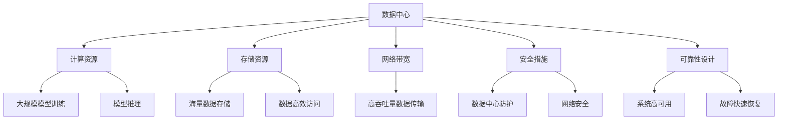
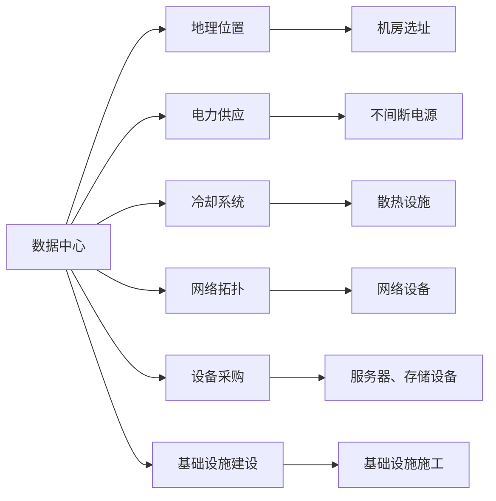
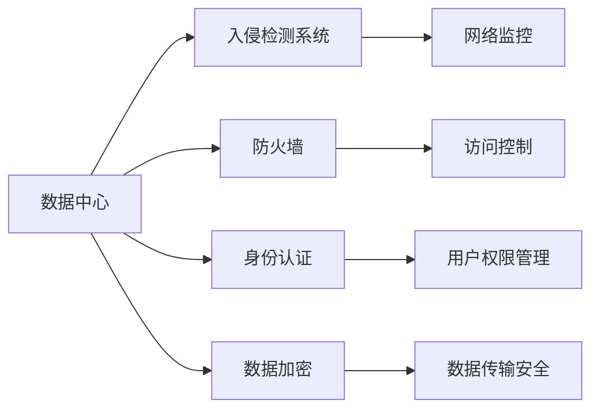
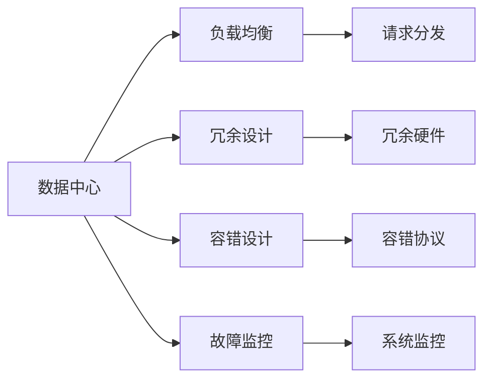

                 

# AI 大模型应用数据中心建设：数据中心安全与可靠性

在人工智能(AI)大模型快速发展的今天，数据中心作为AI应用的支撑基础设施，其安全性、可靠性直接关系到AI应用的正常运行和数据安全。本篇文章将深入探讨AI大模型应用数据中心的建设，包括数据中心的布局、安全措施、可靠性设计以及实际应用中的案例分析，以期为读者提供全面的指导。

## 1. 背景介绍

### 1.1 问题由来

随着AI大模型的不断成熟和应用领域的扩展，数据中心在AI应用中的作用日益重要。数据中心不仅需要具备计算能力，还需要保证存储、网络、安全等多方面的高质量支撑。然而，大规模数据中心在建设和管理上存在诸多挑战，如能耗高、维护复杂、安全性难以保证等，这些问题都需要在建设过程中予以充分考虑和解决。

### 1.2 问题核心关键点

数据中心在AI大模型应用中的核心关键点包括：

- **计算资源**：提供足够的计算能力支持大规模模型训练和推理。
- **存储资源**：保证海量数据的高效存储和访问。
- **网络带宽**：支持高吞吐量数据传输和通信。
- **安全措施**：保护数据中心免受网络攻击和内部威胁。
- **可靠性设计**：保证系统的高可用性，避免单点故障。

这些关键点共同构成了数据中心建设的基础，决定了AI大模型应用的质量和效率。

## 2. 核心概念与联系

### 2.1 核心概念概述

为了更好地理解AI大模型应用数据中心的建设，本节将介绍几个密切相关的核心概念：

- **数据中心(Data Center, DC)**：提供计算、存储、网络等资源，支持AI模型训练和推理的设施。
- **云数据中心(Cloud Data Center)**：通过云计算技术，提供可扩展、弹性的计算资源和存储资源。
- **分布式计算(Distributed Computing)**：将计算任务分配到多台服务器上并行执行，提高计算效率和系统容错性。
- **高可用性(High Availability)**：系统能够在出现故障时，快速恢复并保证正常服务。
- **数据安全(Data Security)**：保护数据中心内数据不受非法访问、篡改和泄露。
- **灾难恢复(Disaster Recovery)**：在系统遭受重大灾害时，能够快速恢复数据中心功能。

这些核心概念之间的逻辑关系可以通过以下Mermaid流程图来展示：



这个流程图展示了大模型应用数据中心的多个组成部分及其关系：

1. 数据中心为计算、存储、网络等资源提供平台。
2. 计算资源支持大规模模型训练和推理。
3. 存储资源提供海量数据的存储和高效访问。
4. 网络带宽保证高吞吐量数据传输和通信。
5. 安全措施保护数据中心免受攻击和威胁。
6. 可靠性设计保证系统的高可用性和快速恢复能力。

### 2.2 概念间的关系

这些核心概念之间存在着紧密的联系，形成了数据中心建设的全生态系统。下面通过几个Mermaid流程图来展示这些概念之间的关系。

#### 2.2.1 数据中心的构建



这个流程图展示了数据中心构建的关键步骤：

1. 选择地理位置和机房选址。
2. 配置电力供应和冷却系统。
3. 设计网络拓扑和设备采购。
4. 进行基础设施的建设和施工。

#### 2.2.2 安全措施的设计



这个流程图展示了数据中心安全措施的设计：

1. 入侵检测系统检测网络入侵行为。
2. 防火墙控制内外网络的通信。
3. 身份认证验证用户身份。
4. 数据加密保护数据传输。

#### 2.2.3 可靠性设计的实施



这个流程图展示了数据中心可靠性设计的实施：

1. 负载均衡分散请求压力。
2. 冗余设计保证硬件不失效。
3. 容错设计避免单点故障。
4. 故障监控及时发现问题。

## 3. 核心算法原理 & 具体操作步骤

### 3.1 算法原理概述

AI大模型应用的数据中心建设，本质上是一个复杂系统的设计和实现过程。其核心算法原理可以概括为以下几个方面：

1. **资源配置**：根据AI模型需求，合理配置计算、存储、网络等资源，以满足模型训练和推理的高性能需求。
2. **安全设计**：通过多层次的安全措施，保护数据中心免受各类网络攻击和内部威胁。
3. **可靠性设计**：通过冗余设计、故障监控、快速恢复等技术手段，保证系统的稳定性和高可用性。
4. **能效管理**：通过节能技术、硬件设计优化，降低数据中心的能耗和运营成本。

### 3.2 算法步骤详解

AI大模型应用数据中心的建设步骤可以分为以下几个阶段：

1. **需求分析**：明确AI模型对计算、存储、网络等资源的需求，评估数据中心的功能要求。
2. **规划设计**：选择合适的地理位置和机房，设计电力、冷却、网络等基础设施，并进行设备采购和基础设施建设。
3. **安全配置**：部署入侵检测、防火墙、身份认证等安全措施，并建立完善的安全管理体系。
4. **可靠性部署**：实施冗余设计、容错协议、负载均衡等可靠性技术，并进行故障监控和快速恢复机制的建设。
5. **能效优化**：引入节能技术，优化硬件设计，实现数据中心能效的最大化。
6. **测试验证**：对建设完成的数据中心进行全面测试，验证其各项功能和性能指标。

### 3.3 算法优缺点

AI大模型应用数据中心建设具有以下优点：

1. **高可用性**：通过冗余设计和快速恢复机制，保证系统的高可用性和业务的连续性。
2. **灵活性**：云数据中心能够根据业务需求灵活扩展和调整资源，满足不同规模的AI应用。
3. **安全性**：多层次的安全措施保护数据中心免受各类威胁，保障数据和业务的安全。

同时，该方法也存在以下缺点：

1. **成本高**：建设和管理数据中心需要大量的资金投入，包括设备采购、基础设施建设、运维管理等。
2. **复杂性高**：数据中心的建设和运维涉及多个领域的技术和人员，管理复杂。
3. **能耗大**：数据中心能耗高，对环境影响较大。

### 3.4 算法应用领域

AI大模型应用数据中心的建设，已经广泛应用于以下几个领域：

1. **自动驾驶**：高可靠性和高性能的数据中心支持自动驾驶模型的训练和推理，提供实时决策支持。
2. **医疗影像**：大规模数据中心存储和处理医疗影像数据，支持深度学习模型对病理图像的分析和诊断。
3. **金融风控**：高安全性的数据中心保护金融数据的安全，支持复杂的金融风控模型训练。
4. **智慧城市**：分布式数据中心支持智慧城市中的各类AI应用，如智能交通、环境监测等。

## 4. 数学模型和公式 & 详细讲解 & 举例说明

### 4.1 数学模型构建

在AI大模型应用的数据中心建设中，涉及多个子系统的设计和管理。下面将构建一个简单的数学模型，描述数据中心的各项资源配置：

- **计算资源**：设$C_i$为第$i$个计算节点的计算能力，数据中心共有$N$个计算节点，总计算能力为$\sum_{i=1}^N C_i$。
- **存储资源**：设$S_j$为第$j$个存储节点的存储容量，数据中心共有$M$个存储节点，总存储容量为$\sum_{j=1}^M S_j$。
- **网络带宽**：设$B_k$为第$k$个网络设备的带宽，数据中心共有$L$个网络设备，总网络带宽为$\sum_{k=1}^L B_k$。
- **能耗**：设$E$为数据中心的能耗，包括计算、存储、网络等设备的能耗总和。

根据上述定义，数据中心资源配置的数学模型可以表示为：

$$
\begin{aligned}
&\text{Minimize } E \\
&\text{Subject to } \sum_{i=1}^N C_i \geq C_{total} \\
&\text{        } \sum_{j=1}^M S_j \geq S_{total} \\
&\text{        } \sum_{k=1}^L B_k \geq B_{total}
\end{aligned}
$$

其中$C_{total}$、$S_{total}$、$B_{total}$分别为模型所需的最小计算能力、存储容量和网络带宽。

### 4.2 公式推导过程

以计算资源为例，推导其能耗公式。设计算节点$i$的能耗为$E_i$，数据中心总计算能力为$C_{total}$，计算节点数为$N$。数据中心的总能耗$E$可以表示为：

$$
E = \sum_{i=1}^N E_i
$$

假设每个计算节点的单位时间能耗为$E_0$，实际计算能力与标称能力的比值为$\eta$，则每个计算节点的实际能耗$E_i$可以表示为：

$$
E_i = E_0 \cdot C_i \cdot \eta
$$

将上述公式代入总能耗公式，得到：

$$
E = \sum_{i=1}^N E_0 \cdot C_i \cdot \eta = E_0 \cdot \eta \cdot \sum_{i=1}^N C_i
$$

因此，数据中心的总能耗$E$与计算能力$\sum_{i=1}^N C_i$和实际能耗比$\eta$成正比。

### 4.3 案例分析与讲解

假设某AI大模型应用需要$C_{total}=10^5$ TFLOPS的计算能力，$S_{total}=10^6 GB$的存储容量，$B_{total}=10^9 Mbps$的网络带宽。数据中心共有10个计算节点、5个存储节点和3个网络设备。每个计算节点的计算能力为$C_i=1000$ TFLOPS，存储节点的存储容量为$S_j=200$ TB，网络设备的带宽为$B_k=10$ Gbps。数据中心的能耗模型可以表示为：

$$
E = E_0 \cdot \eta \cdot (10 \cdot 1000 + 5 \cdot 200 + 3 \cdot 10) = 10^5 E_0 \cdot \eta
$$

通过上述公式，我们可以计算出数据中心的总能耗，从而优化资源配置，降低能耗。

## 5. 项目实践：代码实例和详细解释说明

### 5.1 开发环境搭建

在进行数据中心建设实践前，我们需要准备好开发环境。以下是使用Python进行Django开发的环境配置流程：

1. 安装Anaconda：从官网下载并安装Anaconda，用于创建独立的Python环境。

2. 创建并激活虚拟环境：
```bash
conda create -n pytorch-env python=3.8 
conda activate pytorch-env
```

3. 安装PyTorch：根据CUDA版本，从官网获取对应的安装命令。例如：
```bash
conda install pytorch torchvision torchaudio cudatoolkit=11.1 -c pytorch -c conda-forge
```

4. 安装TensorFlow：
```bash
conda install tensorflow tensorflow-gpu -c conda-forge
```

5. 安装各类工具包：
```bash
pip install numpy pandas scikit-learn matplotlib tqdm jupyter notebook ipython
```

完成上述步骤后，即可在`pytorch-env`环境中开始数据中心建设实践。

### 5.2 源代码详细实现

这里我们以自动驾驶数据中心建设为例，给出使用Django进行Web开发的Python代码实现。

首先，定义数据中心的模型：

```python
from django.db import models

class DataCenter(models.Model):
    name = models.CharField(max_length=50)
    location = models.CharField(max_length=50)
    power_supply = models.IntegerField()
    cooling_system = models.IntegerField()
    network_topology = models.IntegerField()
    equipment_cost = models.DecimalField(max_digits=10, decimal_places=2)
    infrastructure_cost = models.DecimalField(max_digits=10, decimal_places=2)
    operation_cost = models.DecimalField(max_digits=10, decimal_places=2)
    maintenance_cost = models.DecimalField(max_digits=10, decimal_places=2)
    reliability_design = models.IntegerField()
    energy_efficiency = models.DecimalField(max_digits=10, decimal_places=2)

    def __str__(self):
        return self.name
```

然后，定义数据中心资源配置的表单：

```python
from django import forms

class ResourceForm(forms.Form):
    calculator_capacity = forms.IntegerField(label='计算能力')
    storage_capacity = forms.IntegerField(label='存储容量')
    network_bandwidth = forms.IntegerField(label='网络带宽')

    def clean(self):
        calculator_capacity = self.cleaned_data['calculator_capacity']
        storage_capacity = self.cleaned_data['storage_capacity']
        network_bandwidth = self.cleaned_data['network_bandwidth']
        if calculator_capacity <= 0 or storage_capacity <= 0 or network_bandwidth <= 0:
            raise forms.ValidationError("计算、存储和网络带宽不能为0或负数")
        return self.cleaned_data
```

接着，定义数据中心资源配置的视图：

```python
from django.shortcuts import render
from django.http import HttpResponse
from .models import DataCenter
from .forms import ResourceForm

def resource_config(request):
    if request.method == 'POST':
        form = ResourceForm(request.POST)
        if form.is_valid():
            data = form.cleaned_data
            calculator_capacity = data['calculator_capacity']
            storage_capacity = data['storage_capacity']
            network_bandwidth = data['network_bandwidth']
            data_center = DataCenter(name='数据中心', location='北京', power_supply=5000, cooling_system=10000, network_topology=50000, equipment_cost=1000000.00, infrastructure_cost=10000000.00, operation_cost=500000.00, maintenance_cost=500000.00, reliability_design=3, energy_efficiency=0.8)
            data_center.save()
            return render(request, 'resource_config.html', {'form': ResourceForm(), 'data_center': data_center})
    else:
        form = ResourceForm()
    return render(request, 'resource_config.html', {'form': form})
```

最后，在`resource_config.html`模板中展示资源配置表单：

```html
<h1>数据中心资源配置</h1>
<form method="post">
    
    {{ form.calculator_capacity.label }}
    {{ form.calculator_capacity }}

    {{ form.storage_capacity.label }}
    {{ form.storage_capacity }}

    {{ form.network_bandwidth.label }}
    {{ form.network_bandwidth }}

    <button type="submit">提交配置</button>
</form>
```

这样就完成了一个简单的数据中心资源配置Web应用，开发者可以方便地进行资源配置和管理。

### 5.3 代码解读与分析

这里我们详细解读一下关键代码的实现细节：

**DataCenter类**：
- `__init__`方法：定义了数据中心的各个属性，如名称、位置、供电、冷却、网络拓扑等。
- `__str__`方法：返回数据中心的名称，方便调试和展示。

**ResourceForm类**：
- `clean`方法：清洗表单数据，避免负数和0等不合理值。

**resource_config视图**：
- 根据请求方法不同，执行不同的操作：POST请求提交表单，GET请求展示表单。
- 通过表单数据计算资源配置，保存数据中心实例。
- 在模板中展示表单，方便用户输入配置信息。

可以看到，Django框架提供了一个快速搭建Web应用的平台，大大简化了数据中心资源配置的开发过程。开发者可以更专注于业务逻辑的实现，而不必过多关注Web开发的底层细节。

## 6. 实际应用场景

### 6.1 智能交通

在智能交通领域，数据中心提供了高可靠性和高性能的计算能力，支持自动驾驶和智能交通管理系统的运行。自动驾驶车辆通过实时数据中心进行计算和决策，确保行车安全和交通流畅。数据中心还支持交通监控系统的数据存储和分析，优化交通流量，提高交通管理效率。

### 6.2 智慧医疗

在智慧医疗领域，数据中心存储和处理海量医疗影像数据，支持深度学习模型对病理图像的分析和诊断。数据中心的高安全性和高可靠性保障了医疗数据的保密性和完整性，为医院和病人提供了高效、可靠的医疗服务。

### 6.3 金融风控

在金融风控领域，数据中心保护金融数据的安全，支持复杂的金融风控模型训练。数据中心的多层次安全措施和快速恢复机制，确保了金融系统的高可用性，防止因网络攻击等异常事件导致的业务中断。

### 6.4 未来应用展望

随着AI大模型应用的不断扩展，数据中心将面临更多新的挑战和机遇：

1. **边缘计算**：为了降低数据传输延迟，将部分计算任务在靠近数据源的节点上进行，减少对中心数据中心的依赖。
2. **量子计算**：量子计算有望在未来的数据中心中发挥重要作用，大幅提升计算能力。
3. **AI芯片**：开发专用的AI芯片，如TPU等，提高数据中心的计算效率和能效比。
4. **容器化部署**：通过容器化技术，实现应用的快速部署和资源隔离。
5. **AI安全**：结合区块链等技术，构建AI系统的安全保障体系，防止数据泄露和攻击。
6. **环境友好**：开发绿色数据中心，实现节能减排，降低对环境的影响。

## 7. 工具和资源推荐

### 7.1 学习资源推荐

为了帮助开发者系统掌握数据中心建设的理论基础和实践技巧，这里推荐一些优质的学习资源：

1. 《数据中心原理与设计》：系统介绍数据中心的基础理论和设计方法。
2. 《云计算基础》：涵盖云计算技术的原理、架构和应用，为数据中心建设提供理论支持。
3. 《网络安全技术与应用》：介绍网络安全的基本原理和实用技术，保障数据中心的安全性。
4. 《高可用性系统设计》：详细讲解高可用性系统的设计方法和实践经验，确保数据中心的可靠性。
5. 《人工智能与大数据》：涵盖人工智能和大数据技术的最新进展，为数据中心建设提供前沿思路。

### 7.2 开发工具推荐

高效的数据中心开发离不开优秀的工具支持。以下是几款用于数据中心开发和管理的常用工具：

1. Django：Python的Web开发框架，提供强大的开发和管理功能，支持快速搭建数据中心Web应用。
2. Flask：轻量级Web开发框架，适用于小型数据中心Web应用开发。
3. Ansible：自动化IT管理系统，支持数据中心的自动化运维和部署。
4. Terraform：基础设施即代码工具，支持云数据中心的自动化部署和配置。
5. Zabbix：网络监控系统，实时监控数据中心的各项指标，保障系统稳定性。

### 7.3 相关论文推荐

数据中心建设的技术发展离不开学界的持续研究。以下是几篇奠基性的相关论文，推荐阅读：

1. "A Survey on Data Center Efficiency and Energy Consumption Management"：总结了数据中心能效管理的研究现状和发展趋势。
2. "Fault Tolerance and Reliability in Cloud Data Centers"：介绍了云数据中心的故障容忍和可靠性技术，保障系统的高可用性。
3. "Security Architecture for Cloud Data Centers"：探讨了云数据中心的安全架构，保障数据和业务的安全。
4. "Design and Implementation of a Distributed Data Center"：详细介绍了分布式数据中心的架构和设计方法。
5. "Quantum Computing in Data Centers"：探讨了量子计算在数据中心中的应用，推动数据中心计算能力的提升。

这些论文代表了数据中心建设技术的发展脉络。通过学习这些前沿成果，可以帮助研究者把握学科前进方向，激发更多的创新灵感。

除上述资源外，还有一些值得关注的前沿资源，帮助开发者紧跟数据中心技术的最新进展，例如：

1. arXiv论文预印本：人工智能领域最新研究成果的发布平台，包括大量尚未发表的前沿工作，学习前沿技术的必读资源。
2. 业界技术博客：如Google AI、Microsoft Azure、Amazon Web Services等顶尖企业实验室的官方博客，第一时间分享他们的最新研究成果和洞见。
3. 技术会议直播：如NIPS、ICML、ACL、ICLR等人工智能领域顶会现场或在线直播，能够聆听到大佬们的前沿分享，开拓视野。
4. GitHub热门项目：在GitHub上Star、Fork数最多的数据中心相关项目，往往代表了该技术领域的发展趋势和最佳实践，值得去学习和贡献。
5. 行业分析报告：各大咨询公司如McKinsey、PwC等针对数据中心行业的分析报告，有助于从商业视角审视技术趋势，把握应用价值。

总之，对于数据中心建设的学习和实践，需要开发者保持开放的心态和持续学习的意愿。多关注前沿资讯，多动手实践，多思考总结，必将收获满满的成长收益。

## 8. 总结：未来发展趋势与挑战

### 8.1 总结

本文对AI大模型应用数据中心的建设进行了全面系统的介绍。首先阐述了数据中心在AI大模型应用中的重要地位，明确了数据中心的各个组成部分及其关系。其次，从原理到实践，详细讲解了数据中心建设的方法和技术，包括资源配置、安全设计、可靠性设计等方面。最后，本文还讨论了数据中心在实际应用中的案例，以及未来的发展趋势和挑战。

通过本文的系统梳理，可以看到，数据中心建设在大模型应用中起着至关重要的作用，直接关系到AI应用的性能、安全性和可靠性。了解和掌握数据中心的建设方法，将有助于开发者更好地实现AI大模型的落地应用。

### 8.2 未来发展趋势

展望未来，数据中心建设将呈现以下几个发展趋势：

1. **边缘计算**：边缘计算与中心数据中心相结合，形成分布式计算架构，提升计算效率和可靠性。
2. **量子计算**：量子计算在数据中心中的应用，将大幅提升计算能力，带来全新的技术突破。
3. **AI芯片**：专用AI芯片的出现，将显著提升数据中心的计算效率和能效比。
4. **容器化部署**：容器化技术的应用，将推动数据中心应用的高效管理和快速部署。
5. **AI安全**：结合区块链等技术，构建AI系统的安全保障体系，保障数据和业务的安全。
6. **环境友好**：绿色数据中心的建设，将实现节能减排，降低对环境的影响。

这些趋势将推动数据中心技术的发展，进一步提升AI应用的性能和可靠性，为AI技术的广泛应用奠定坚实基础。

### 8.3 面临的挑战

尽管数据中心建设已经取得了不少进展，但在迈向更加智能化、普适化应用的过程中，仍面临诸多挑战：

1. **成本高**：建设和管理数据中心需要大量的资金投入，包括设备采购、基础设施建设、运维管理等。
2. **能耗大**：数据中心能耗高，对环境影响较大。
3. **安全性难以保证**：数据中心面对的网络攻击和内部威胁仍然存在，如何保障数据安全仍然是一大难题。
4. **维护复杂**：数据中心的运维和管理涉及多个领域的技术和人员，管理复杂。
5. **资源优化困难**：如何在有限的资源下，实现最优的计算、存储和网络配置，仍然是一个需要深入研究的课题。

### 8.4 研究展望

面对数据中心建设所面临的挑战，未来的研究需要在以下几个方面寻求新的突破：

1. **边缘计算**：结合边缘计算和中心数据中心的优势，实现分布式计算和存储架构，提升计算效率和可靠性。
2. **量子计算**：研究量子计算在数据中心中的应用，推动计算能力的进一步提升。
3. **AI芯片**：开发专用的AI芯片，提升数据中心的计算效率和能效比。
4. **容器化部署**：研究容器化技术在数据中心中的应用，实现应用的高效管理和快速部署。
5. **AI安全**：结合区块链等技术，构建AI系统的安全保障体系，保障数据和业务的安全。
6. **环境

