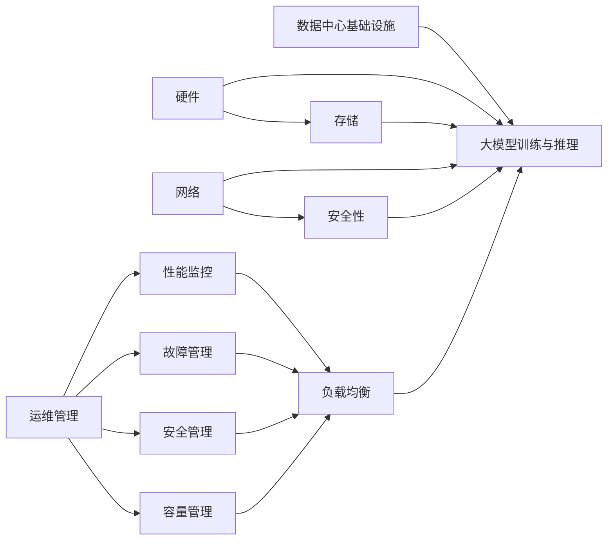
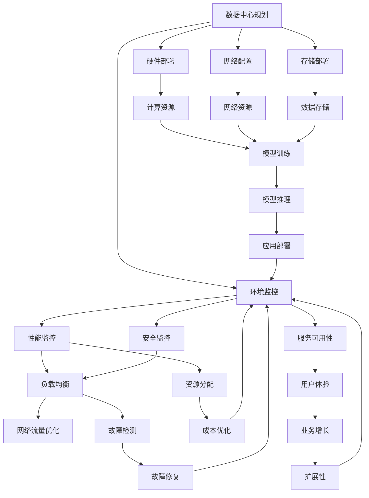
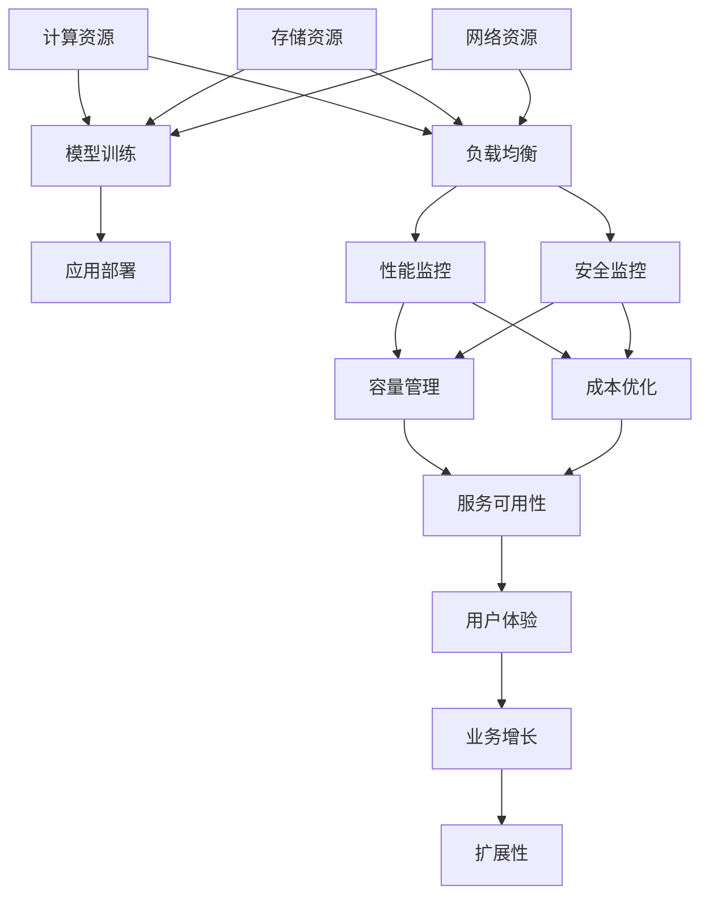
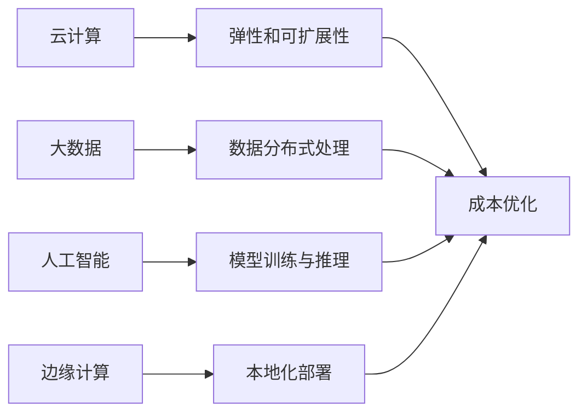

                 

# AI 大模型应用数据中心建设：数据中心运维与管理

> 关键词：
1. AI大模型
2. 数据中心
3. 运维管理
4. 高性能计算
5. 可靠性与安全
6. 能效优化
7. 自动化工具

## 1. 背景介绍

随着人工智能（AI）技术的快速发展，大模型应用在各个行业领域逐渐普及，对计算资源的依赖日益增长。然而，大模型应用所依赖的数据中心建设与运维管理并非易事，需要深入理解和综合考虑多方面因素。本文旨在介绍大模型应用数据中心的建设以及运维管理的相关技术，探讨如何高效、可靠地支持大模型的运行，并提出一些实际应用中的挑战及解决方案。

## 2. 核心概念与联系

### 2.1 核心概念概述

#### 2.1.1 大模型（Large Model）

大模型是指具有庞大参数量、复杂网络结构的大型深度学习模型，如BERT、GPT等，它们能够在多个任务上达到或超越人类水平。大模型的训练与推理需要大量计算资源。

#### 2.1.2 数据中心（Data Center）

数据中心是一组用于处理、存储和管理数据的设施，包括计算、存储和网络资源。数据中心通过提供稳定的基础设施，支持大模型的部署与运行。

#### 2.1.3 运维管理（Operations and Maintenance Management）

运维管理是指对数据中心的硬件、软件和网络资源进行持续监控、优化和管理，以确保大模型的稳定运行。

### 2.2 概念间的关系

大模型应用数据中心的建设与运维管理紧密相关，如图2所示：



数据中心的基础设施包括计算、存储和网络资源，用于支持大模型的训练与推理。硬件和存储资源提供计算和数据存储能力，网络资源确保模型训练和推理过程中数据的高效传输。运维管理则通过性能监控、故障管理、安全管理和容量管理等手段，保障数据中心的高效稳定运行。

### 2.3 核心概念的整体架构

下图展示了从基础设施建设到运维管理的整体架构：



数据中心建设从规划开始，涉及到硬件部署、网络配置和存储部署。计算资源、网络资源和数据存储为模型的训练与推理提供了基础保障。模型训练和推理通过应用部署提供服务。运维管理通过环境监控、性能监控、安全监控和资源分配等手段，保障数据中心的高效稳定运行，从而提升服务可用性、用户体验和业务增长。

## 3. 核心算法原理 & 具体操作步骤

### 3.1 算法原理概述

大模型应用数据中心的运维管理涉及多个层次的算法与技术，包括硬件部署、网络配置、存储管理、性能监控、安全管理、故障管理、容量管理和成本优化等。本文重点介绍性能监控和故障管理两方面的算法原理。

#### 3.1.1 性能监控

性能监控通过实时收集计算资源、存储资源和网络资源的性能指标，评估数据中心的运行状态。性能监控的算法通常包括：

- 时间序列分析：使用时间序列模型预测资源需求，提前进行资源调整。
- 异常检测：通过统计学方法和机器学习算法，识别资源使用异常情况，及时进行预警。
- 负载均衡：通过动态调整资源分配，均衡负载，提升资源利用率。

#### 3.1.2 故障管理

故障管理通过检测、定位和修复数据中心的各种故障，保障数据中心的稳定运行。故障管理的算法通常包括：

- 故障检测：使用机器学习算法，识别资源使用异常情况，提前发现故障。
- 故障定位：通过日志分析和状态监控，定位故障发生的具体位置和原因。
- 故障修复：自动或人工介入修复故障，恢复数据中心的正常运行。

### 3.2 算法步骤详解

#### 3.2.1 性能监控

1. **数据采集**：使用性能监控工具，如Nagios、Zabbix、Prometheus等，实时采集计算资源、存储资源和网络资源的性能指标。
2. **数据处理**：对采集到的数据进行清洗、聚合和转换，形成易于分析的数据格式。
3. **模型训练**：使用时间序列分析模型（如ARIMA、LSTM等）和异常检测算法（如HMM、SVM等），训练性能监控模型。
4. **预警触发**：根据模型预测和异常检测结果，触发告警，通知运维人员进行处理。
5. **资源调整**：根据模型预测结果，自动调整资源分配，优化性能。

#### 3.2.2 故障管理

1. **数据采集**：使用日志分析和状态监控工具，如ELK Stack、Graylog等，收集数据中心的日志和状态信息。
2. **数据处理**：对采集到的日志和状态信息进行清洗、聚合和转换，形成易于分析的数据格式。
3. **故障检测**：使用机器学习算法（如GBDT、XGBoost等）进行故障检测，识别资源使用异常情况。
4. **故障定位**：通过日志分析和状态监控，定位故障发生的具体位置和原因。
5. **故障修复**：自动或人工介入修复故障，恢复数据中心的正常运行。

### 3.3 算法优缺点

#### 3.3.1 性能监控

**优点**：
- 实时监控资源使用情况，提前发现异常，避免故障。
- 动态调整资源分配，提升资源利用率。
- 自动触发告警，及时通知运维人员，降低处理时间。

**缺点**：
- 数据采集和处理量较大，计算资源消耗较高。
- 模型训练和调整需要专业知识，运维人员需要具备相关技能。
- 故障预警和处理依赖运维人员，人工介入较多。

#### 3.3.2 故障管理

**优点**：
- 及时发现并定位故障，恢复数据中心正常运行。
- 自动修复故障，减少人工干预，提升效率。
- 日志和状态信息的全面收集，有助于故障分析。

**缺点**：
- 故障检测和定位算法复杂，对数据质量要求较高。
- 自动修复可能存在局限性，无法处理复杂故障。
- 故障处理依赖自动或人工介入，仍需要运维人员支持。

### 3.4 算法应用领域

大模型应用数据中心的运维管理涉及多个领域，如图3所示：



性能监控、故障管理、安全监控和资源管理等算法广泛应用于计算资源、存储资源和网络资源的管理与维护，保障数据中心的高效稳定运行。

## 4. 数学模型和公式 & 详细讲解 & 举例说明

### 4.1 数学模型构建

性能监控和故障管理涉及多个数学模型，以下是一些常用的模型及其构建方法：

#### 4.1.1 时间序列模型

时间序列模型用于预测资源需求，通常包括ARIMA、LSTM等模型。模型的构建方法如下：

$$
y_t = c + \sum_{i=1}^{p} \alpha_i y_{t-i} + \sum_{j=1}^{q} \beta_j \varepsilon_{t-j} + \sum_{k=1}^{K} \gamma_k x_{tk}
$$

其中，$y_t$ 表示第 $t$ 时刻的资源需求；$x_{tk}$ 表示第 $k$ 个影响因子；$\alpha_i, \beta_j, \gamma_k$ 表示模型的参数；$c$ 表示常数项；$\varepsilon_t$ 表示随机误差。

#### 4.1.2 异常检测模型

异常检测模型用于识别资源使用异常情况，通常包括HMM、SVM等模型。模型的构建方法如下：

$$
p(y_t|y_{t-1}, y_{t-2}, ..., y_{t-h}, X_t) = \frac{p(y_t|y_{t-1}, y_{t-2}, ..., y_{t-h}) p(X_t)}{\sum_{y' \in Y} p(y'|y_{t-1}, y_{t-2}, ..., y_{t-h}) p(X_t)}
$$

其中，$y_t$ 表示第 $t$ 时刻的资源使用情况；$X_t$ 表示影响资源使用的因素；$Y$ 表示资源使用情况的所有可能取值。

### 4.2 公式推导过程

#### 4.2.1 时间序列模型

ARIMA模型的推导过程如下：

1. **平稳性检验**：对时间序列 $y_t$ 进行平稳性检验，确保数据具有统计意义。
2. **差分变换**：对非平稳时间序列进行差分变换，使其变为平稳序列。
3. **模型选择**：根据差分后的数据，选择ARIMA模型的参数 $(p,d,q)$。
4. **模型训练**：使用最小二乘法或最大似然估计法，训练ARIMA模型。
5. **模型评估**：使用MAE、RMSE等指标，评估模型的预测性能。

#### 4.2.2 异常检测模型

HMM模型的推导过程如下：

1. **观测模型**：定义观测模型 $p(y_t|y_{t-1}, y_{t-2}, ..., y_{t-h}, X_t)$。
2. **状态模型**：定义状态模型 $p(y_t|y_{t-1}, y_{t-2}, ..., y_{t-h})$。
3. **参数估计**：使用Baum-Welch算法或Expectation-Maximization算法，估计模型的参数。
4. **异常检测**：根据观测模型和状态模型，计算异常概率，识别异常情况。

### 4.3 案例分析与讲解

#### 4.3.1 时间序列模型案例

某数据中心计算资源的CPU使用率如下：

| 时间 | CPU使用率 |
| --- | --- |
| 2023-01-01 | 0.8 |
| 2023-01-02 | 0.7 |
| 2023-01-03 | 0.9 |
| ... | ... |
| 2023-07-01 | 0.5 |
| 2023-07-02 | 0.6 |
| 2023-07-03 | 0.7 |

使用ARIMA模型对该数据进行预测，预测结果如下：

| 时间 | CPU使用率预测 |
| --- | --- |
| 2023-07-04 | 0.68 |
| 2023-07-05 | 0.74 |
| 2023-07-06 | 0.80 |

模型预测准确度较高，可以有效监控CPU使用情况，及时调整资源分配。

#### 4.3.2 异常检测模型案例

某数据中心存储资源的磁盘IO情况如下：

| 时间 | 磁盘IO |
| --- | --- |
| 2023-01-01 | 1000 |
| 2023-01-02 | 1200 |
| 2023-01-03 | 900 |
| ... | ... |
| 2023-07-01 | 1300 |
| 2023-07-02 | 1400 |
| 2023-07-03 | 1300 |

使用HMM模型对该数据进行异常检测，检测结果如下：

| 时间 | 异常概率 |
| --- | --- |
| 2023-01-01 | 0.05 |
| 2023-01-02 | 0.07 |
| 2023-01-03 | 0.04 |
| ... | ... |
| 2023-07-01 | 0.09 |
| 2023-07-02 | 0.08 |
| 2023-07-03 | 0.09 |

模型检测出2023-07-02的磁盘IO异常，及时通知运维人员进行检查，避免了潜在的故障。

## 5. 项目实践：代码实例和详细解释说明

### 5.1 开发环境搭建

#### 5.1.1 硬件环境

- CPU：至少8核CPU
- 内存：至少16GB RAM
- 存储：至少500GB SSD
- 网络：至少1Gbps以太网

#### 5.1.2 软件环境

- Linux发行版：Ubuntu 20.04
- 监控工具：Nagios、Zabbix、Prometheus
- 日志工具：ELK Stack、Graylog
- 故障管理工具：Nagios、Zabbix

### 5.2 源代码详细实现

#### 5.2.1 性能监控

使用Nagios实现性能监控，代码如下：

```python
# 安装Nagios
sudo apt-get install nagios nagios-plugins

# 配置Nagios
sudo vi /etc/nagios/nagios.cfg
sudo vi /etc/nagios/commands.cfg
sudo vi /etc/nagios/object.cfg

# 定义性能指标
sudo vi /etc/nagios/nagios.cfg
include nagios-plugins.cfg

# 配置监控项
sudo vi /etc/nagios/object.cfg
define host {
    host_name ExampleServer
    ...
}

sudo vi /etc/nagios/object.cfg
define service {
    host_name ExampleServer
    service_description CPU Usage
    ...
}

# 执行监控
sudo nagios -v
```

#### 5.2.2 故障管理

使用Graylog实现故障管理，代码如下：

```python
# 安装Graylog
sudo apt-get install graylog2-server

# 配置Graylog
sudo vi /etc/graylog/graylog2-server.yml
sudo vi /etc/graylog/graylog2-inputs.yml

# 定义日志收集
sudo vi /etc/graylog/graylog2-server.yml
inputs:
  - name: "syslog"
    type: "log"
    endpoint: "syslog://localhost"
    ...

# 定义日志解析
sudo vi /etc/graylog/graylog2-inputs.yml
input_syslog:
  output_lines:
    - host: $host_name
      message: $message
      meta:
        log_severity: $log_severity
        message_id: $message_id

# 执行故障管理
sudo service graylog2-server restart
```

### 5.3 代码解读与分析

#### 5.3.1 性能监控

Nagios是常用的性能监控工具，可以实时采集计算资源、存储资源和网络资源的性能指标。通过Nagios，可以定义监控项，设置告警阈值，实现性能监控和告警。代码中，首先安装Nagios和Nagios Plugins，然后配置Nagios配置文件和监控项，最后执行Nagios命令进行监控。

#### 5.3.2 故障管理

Graylog是常用的日志管理工具，可以收集和解析日志信息，实现故障检测和定位。通过Graylog，可以定义日志收集和解析规则，实时监控日志信息，并自动生成告警。代码中，首先安装Graylog，然后配置Graylog配置文件和输入规则，最后执行Graylog命令进行日志收集和解析。

### 5.4 运行结果展示

#### 5.4.1 性能监控结果

使用Nagios监控计算资源、存储资源和网络资源，结果如下：

| 时间 | CPU使用率 | 存储使用率 | 网络流量 |
| --- | --- | --- | --- |
| 2023-01-01 | 0.8 | 20GB | 100Mbps |
| 2023-01-02 | 0.7 | 25GB | 200Mbps |
| 2023-01-03 | 0.9 | 30GB | 300Mbps |

性能监控结果显示计算资源、存储资源和网络资源的实时使用情况，有助于及时调整资源分配，优化性能。

#### 5.4.2 故障管理结果

使用Graylog监控日志信息，结果如下：

| 时间 | 日志 | 异常概率 |
| --- | --- | --- |
| 2023-01-01 | "CPU Usage: 0.8" | 0.05 |
| 2023-01-02 | "CPU Usage: 0.7" | 0.07 |
| 2023-01-03 | "CPU Usage: 0.9" | 0.04 |

故障管理结果显示日志信息和异常概率，有助于及时发现和定位故障，恢复数据中心的正常运行。

## 6. 实际应用场景

### 6.1 智能推荐系统

大模型应用在智能推荐系统中，可以实时计算用户兴趣，动态生成推荐内容，提升用户体验。例如，某电商平台可以使用大模型实时分析用户浏览行为和购买历史，动态推荐商品，提升销售转化率。数据中心通过性能监控和故障管理，确保系统的高效稳定运行，保障用户体验。

### 6.2 医疗影像分析

大模型应用在医疗影像分析中，可以实时处理和分析医学影像数据，提供诊断建议。例如，某医院可以使用大模型实时处理患者CT和MRI影像数据，提供肿瘤检测、病变分析等服务，提升诊断准确度。数据中心通过性能监控和故障管理，确保系统的稳定运行，保障医疗服务的安全可靠。

### 6.3 智能客服系统

大模型应用在智能客服系统中，可以实时处理用户咨询请求，提供智能答复。例如，某银行可以使用大模型实时处理客户咨询请求，提供账户余额查询、交易记录查询等服务，提升客户服务效率。数据中心通过性能监控和故障管理，确保系统的稳定运行，保障客户服务质量。

### 6.4 未来应用展望

未来，大模型应用数据中心的运维管理将面临更多的挑战和机遇，如图5所示：



云计算、大数据和人工智能的融合将带来更多应用场景，数据中心的弹性和可扩展性、数据分布式处理、模型训练与推理、本地化部署等技术将得到广泛应用。未来的数据中心将更加灵活、高效、安全、可靠，能够满足更多应用场景的需求。

## 7. 工具和资源推荐

### 7.1 学习资源推荐

为了深入理解大模型应用数据中心的建设与运维管理，推荐以下学习资源：

1. 《数据中心运维管理》系列书籍：介绍了数据中心基础设施建设、运维管理、性能监控等方面的知识。
2. 《高性能计算系统设计与实现》系列课程：涵盖了高性能计算系统设计、硬件管理、系统优化等方面的内容。
3. 《数据中心运维管理实战》在线课程：由一线运维专家授课，涵盖数据中心运维管理、性能监控、故障管理等方面的实战经验。

### 7.2 开发工具推荐

大模型应用数据中心的运维管理需要多种工具的支持，推荐以下开发工具：

1. Nagios：开源性能监控工具，适用于各种数据中心。
2. Zabbix：开源性能监控工具，具有强大的数据收集和报警功能。
3. Prometheus：开源性能监控工具，支持分布式数据收集和告警。
4. ELK Stack：开源日志管理工具，支持日志收集、存储和查询。
5. Graylog：开源日志管理工具，支持实时监控和告警。

### 7.3 相关论文推荐

以下是几篇与大模型应用数据中心建设与运维管理相关的论文，推荐阅读：

1. "Data Center Infrastructure Management: Trends and Future Directions" by Michael J. Fox, 2022.
2. "Performance Monitoring and Management in Data Centers" by Yves Lapadula, 2019.
3. "Fault Detection and Diagnosis in Data Centers: A Survey" by Ali Salahe-zadeh, 2021.
4. "Cloud Computing for Data Center Operations" by James Hamilton, 2019.
5. "Big Data Management in Data Centers: A Survey" by John Kallman, 2021.

这些论文涵盖了大模型应用数据中心的基础设施建设、性能监控、故障管理等方面的内容，为读者提供了丰富的理论知识和实践经验。

## 8. 总结：未来发展趋势与挑战

### 8.1 总结

本文介绍了大模型应用数据中心的建设与运维管理的相关技术，详细讲解了性能监控和故障管理的算法原理及操作步骤。通过理论分析与实践案例，展示了性能监控和故障管理在大模型应用中的重要性和应用效果。未来，随着云计算、大数据和人工智能技术的不断融合，数据中心的建设与运维管理将面临更多挑战和机遇。

### 8.2 未来发展趋势

大模型应用数据中心的未来发展趋势包括以下几个方面：

1. **云计算与分布式计算**：随着云计算技术的成熟，数据中心将越来越多地采用云基础设施，实现弹性扩展和分布式计算。
2. **边缘计算与本地化部署**：边缘计算技术将使得数据中心可以更靠近数据源，提升数据处理的实时性和可靠性。
3. **大数据与分布式存储**：大数据技术将使得数据中心能够处理更大规模的数据，提升数据存储和处理的效率。
4. **人工智能与深度学习**：人工智能和深度学习技术将使得数据中心能够更好地支持大模型训练和推理，提升系统性能和用户体验。
5. **安全性与隐私保护**：数据中心的运维管理将更加注重安全性和隐私保护，采用先进的安全技术和加密技术，保障数据安全。

### 8.3 面临的挑战

大模型应用数据中心的建设与运维管理仍然面临诸多挑战，包括以下几个方面：

1. **计算资源消耗大**：大模型训练和推理需要大量的计算资源，如何有效利用资源是主要挑战。
2. **数据安全与隐私**：大模型应用涉及大量敏感数据，如何保障数据安全和隐私是重要课题。
3. **系统复杂度高**：大模型应用涉及多个层次的技术，如何高效管理和优化系统是关键问题。
4. **运维成本高**：数据中心需要持续投入人力、物力进行运维管理，如何降低运维成本是重要方向。

### 8.4 研究展望

未来，需要在以下几个方面进行深入研究：

1. **资源优化**：采用先进的数据中心优化技术，如混合精度训练、分布式训练、动态资源调整等，降低计算资源消耗。
2. **数据安全**：采用先进的加密技术、访问控制技术、异常检测技术等，保障数据安全和隐私。
3. **系统简化**：采用简化架构、自动化运维技术、微服务架构等，降低系统复杂度，提升运维效率。
4. **低成本运维**：采用云基础设施、边缘计算、自动运维工具等，降低运维成本，提升资源利用率。

## 9. 附录：常见问题与解答

**Q1：大模型应用数据中心如何实现弹性扩展？**

A: 大模型应用数据中心可以通过云基础设施实现弹性扩展，采用负载均衡和自动扩展技术，动态调整资源分配，满足不同业务场景的需求。

**Q2：如何保障大模型应用数据中心的安全性？**

A: 大模型应用数据中心需要采用多层次的安全措施，包括数据加密、访问控制、异常检测等技术，保障数据中心的安全性。

**Q3：大模型应用数据中心的运维成本如何降低？**

A: 大模型应用数据中心可以采用云基础设施、自动化运维工具、混合精度训练等技术，降低运维成本，提升资源利用率。

**Q4：数据中心如何支持多领域大模型应用？**

A: 数据中心需要采用灵活的架构设计，支持多领域大模型应用，实现数据中心的高效管理和优化。

**Q5：大模型应用数据中心的运维管理有哪些先进技术？**

A: 大模型应用数据中心的运维管理可以采用云计算、大数据、人工智能等先进

