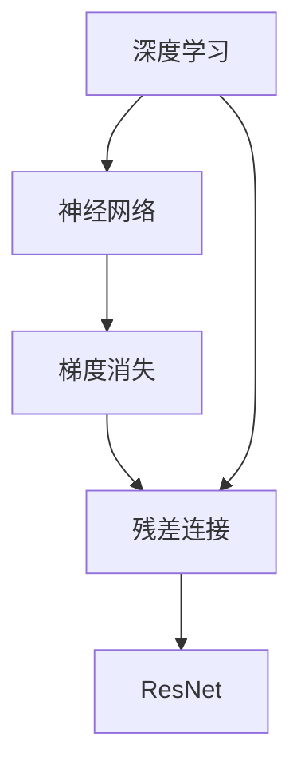
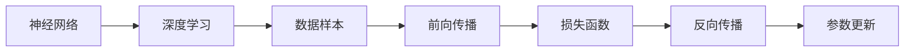
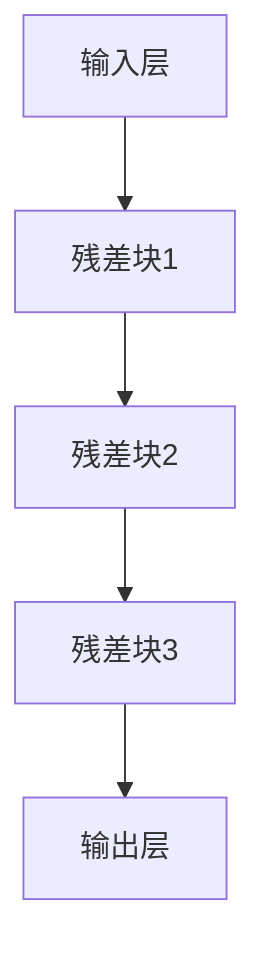
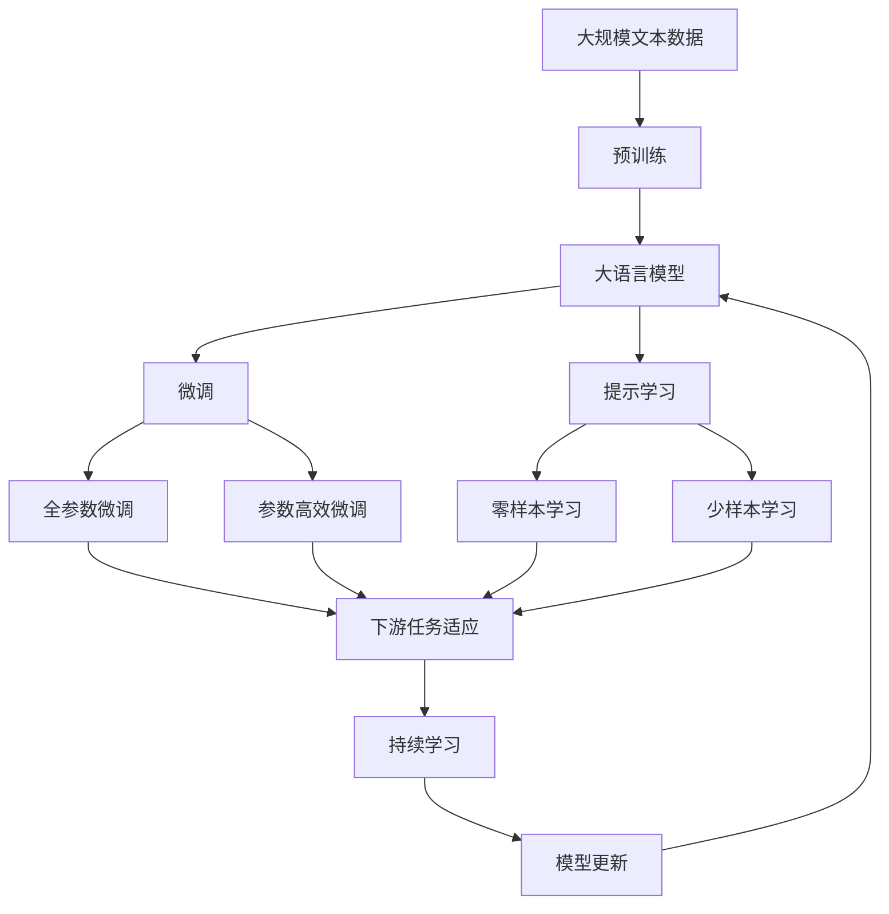

                 

# AI 大模型计算机科学家群英传：ResNet 残差网络的发明人何凯明

> 关键词：
  深度学习, ResNet, 计算机视觉, 残差网络, 神经网络, 何凯明

## 1. 背景介绍

### 1.1 问题由来
在深度学习领域，ResNet（Residual Network）残差网络是一种划时代的技术，它由微软研究院的何凯明（Kaiming He）及其团队于2015年提出。ResNet的核心思想是通过残差连接来解决深度神经网络训练时出现的梯度消失和退化问题，从而极大地提高了网络的深度和性能。

随着深度学习的不断进步，大模型技术正逐步取代传统的浅层模型，成为计算机视觉、自然语言处理等领域的主流技术。ResNet作为深度学习领域的里程碑，不仅推动了深度学习的前沿研究，也催生了一大批杰出的计算机科学家，他们为AI大模型的发展做出了巨大的贡献。本文将聚焦于ResNet的创始人何凯明，探讨其在大模型技术领域的杰出贡献。

### 1.2 问题核心关键点
何凯明作为ResNet的共同发明者，他的主要贡献包括：
- 提出残差连接概念，使深度网络训练更加稳定高效。
- 设计了多个架构变体，如ResNet-50、ResNet-101等，广泛应用于计算机视觉领域。
- 在学术界和工业界推广深度学习技术，培养了大量的研究者和工程师。

何凯明的研究不仅推动了深度学习技术的发展，也为AI大模型的构建奠定了坚实的基础。

### 1.3 问题研究意义
何凯明的工作极大地促进了深度学习技术在计算机视觉、自然语言处理等领域的广泛应用，为AI大模型的发展提供了重要参考。研究何凯明的工作不仅有助于理解深度学习的基本原理，还可以借鉴其方法论，推动更多前沿技术的研究和应用。

## 2. 核心概念与联系

### 2.1 核心概念概述
为了更好地理解何凯明的研究，本节将介绍几个密切相关的核心概念：

- 深度学习（Deep Learning）：基于神经网络的机器学习技术，能够自动从大量数据中学习复杂模式。
- 残差网络（ResNet）：通过引入残差连接（Residual Connection），使得深度网络训练更加稳定，性能提升显著。
- 神经网络（Neural Network）：由大量神经元（节点）组成的网络，用于处理和分类大量数据。
- 梯度消失（Vanishing Gradient）：在深层网络中，梯度在反向传播过程中逐渐衰减，导致浅层神经元无法更新权重。
- 神经元（Neuron）：神经网络中的基本计算单元，用于处理输入数据并传递信号。

这些概念之间的逻辑关系可以通过以下Mermaid流程图来展示：



这个流程图展示了深度学习、神经网络、梯度消失、残差连接以及ResNet之间的关系：

1. 深度学习是基于神经网络的技术，神经网络是由大量神经元组成的计算单元。
2. 在深层神经网络中，梯度在反向传播过程中逐渐消失，导致浅层神经元无法更新权重。
3. 为了解决梯度消失问题，何凯明引入了残差连接。
4. 残差连接允许信息跨层直接传递，从而稳定了梯度传播，提升了网络的性能。
5. ResNet是采用残差连接技术的深度网络，通过多层残差块组成。

### 2.2 概念间的关系

这些核心概念之间存在着紧密的联系，形成了ResNet的完整生态系统。下面我们通过几个Mermaid流程图来展示这些概念之间的关系。

#### 2.2.1 深度学习的基本原理



这个流程图展示了深度学习的基本原理：

1. 神经网络接收输入数据。
2. 通过前向传播计算输出。
3. 计算损失函数。
4. 通过反向传播计算梯度。
5. 根据梯度更新参数。

#### 2.2.2 残差连接的引入


这个流程图展示了残差连接的基本原理：

1. 输入神经元计算信息。
2. 引入残差连接，使得信息跨层传递。
3. 输出层计算最终结果。

#### 2.2.3 ResNet的架构



这个流程图展示了ResNet的架构：

1. 输入数据进入网络。
2. 通过多个残差块进行信息传递。
3. 最后一层输出结果。

### 2.3 核心概念的整体架构

最后，我们用一个综合的流程图来展示这些核心概念在大模型微调过程中的整体架构：



这个综合流程图展示了从预训练到微调，再到持续学习的完整过程。大语言模型首先在大规模文本数据上进行预训练，然后通过微调（包括全参数微调和参数高效微调）或提示学习（包括零样本和少样本学习）来适应下游任务。最后，通过持续学习技术，模型可以不断更新和适应新的任务和数据。 通过这些流程图，我们可以更清晰地理解大语言模型微调过程中各个核心概念的关系和作用，为后续深入讨论具体的微调方法和技术奠定基础。

## 3. 核心算法原理 & 具体操作步骤
### 3.1 算法原理概述

何凯明提出的ResNet，其核心思想是通过残差连接（Residual Connection）来解决深层神经网络训练中的梯度消失问题。在深层网络中，信息在经过多层传递后，由于梯度逐渐消失，导致浅层神经元无法更新权重，从而影响整个网络的效果。

ResNet通过在网络中引入残差连接，使得信息跨层直接传递，从而稳定了梯度传播，提升了网络的性能。具体来说，残差连接可以通过以下公式表示：

$$
H(x) = F(x) + x
$$

其中 $H(x)$ 为残差连接后的输出，$F(x)$ 为网络中的一个中间层，$x$ 为输入。这种残差连接的机制允许网络在传递信息时，同时保留输入信息，从而稳定了梯度传播。

### 3.2 算法步骤详解

ResNet的实现步骤可以分为以下几个关键环节：

**Step 1: 构建残差块（Residual Block）**

ResNet通过多个残差块组成，每个残差块包含两个卷积层和一个残差连接。具体实现如下：

```python
import torch.nn as nn
import torch.nn.functional as F

class ResidualBlock(nn.Module):
    def __init__(self, in_channels, out_channels):
        super(ResidualBlock, self).__init__()
        self.conv1 = nn.Conv2d(in_channels, out_channels, kernel_size=3, stride=1, padding=1)
        self.conv2 = nn.Conv2d(out_channels, out_channels, kernel_size=3, stride=1, padding=1)
        self.conv3 = nn.Conv2d(out_channels, out_channels, kernel_size=1, stride=1)
    
    def forward(self, x):
        residual = x
        x = self.conv1(x)
        x = F.relu(x)
        x = self.conv2(x)
        x = self.conv3(x)
        return F.relu(residual + x)
```

**Step 2: 设计网络结构**

ResNet的设计非常灵活，可以根据具体任务设计不同的网络结构。这里给出一个基本的ResNet-50架构：

```python
class ResNet(nn.Module):
    def __init__(self, block, layers, num_classes=1000):
        super(ResNet, self).__init__()
        self.in_channels = 64
        self.conv1 = nn.Conv2d(3, 64, kernel_size=7, stride=2, padding=3)
        self.maxpool = nn.MaxPool2d(kernel_size=3, stride=2, padding=1)
        self.layers = self._make_layers(block, layers, 64)
        self.linear = nn.Linear(block.out_channels, num_classes)
    
    def _make_layers(self, block, layers, in_channels):
        downsample = None
        layers = []
        for i in range(layers):
            layers.append(block(in_channels, block.out_channels))
            in_channels = block.out_channels
            if i % 2 == 0 and i != 0:
                downsample = nn.Sequential(
                    nn.Conv2d(in_channels, block.out_channels, kernel_size=1, stride=2),
                    nn.ReLU(inplace=True),
                )
        return nn.Sequential(*layers, downsample)
    
    def forward(self, x):
        x = self.conv1(x)
        x = F.relu(x)
        x = self.maxpool(x)
        x = self.layers(x)
        x = F.avg_pool2d(x, 7)
        x = x.view(x.size(0), -1)
        x = self.linear(x)
        return x
```

**Step 3: 训练与测试**

在训练过程中，使用随机梯度下降等优化算法，根据损失函数（如交叉熵损失）不断更新模型参数，直至收敛。在测试过程中，将模型应用于新的数据，输出预测结果。

```python
import torch.optim as optim

# 定义优化器
optimizer = optim.SGD(model.parameters(), lr=0.1, momentum=0.9, weight_decay=1e-4)

# 训练模型
for epoch in range(num_epochs):
    model.train()
    loss = 0
    for data, target in train_loader:
        optimizer.zero_grad()
        output = model(data)
        loss += F.cross_entropy(output, target)
        loss.backward()
        optimizer.step()
        loss /= len(train_loader.dataset)
    
    # 评估模型
    model.eval()
    correct = 0
    total = 0
    with torch.no_grad():
        for data, target in test_loader:
            output = model(data)
            _, predicted = torch.max(output.data, 1)
            total += target.size(0)
            correct += (predicted == target).sum().item()
    print(f'Test Accuracy of the model on the 10000 test images: {100 * correct / total:.2f}%')
```

### 3.3 算法优缺点

ResNet的优点在于其显著提升了深层神经网络的性能和稳定性，解决了梯度消失问题。同时，其灵活性使得设计者可以根据具体任务设计不同结构的残差块，适用于各种计算机视觉任务。

然而，ResNet也存在一些缺点：

- 需要大量的训练数据和计算资源，使得训练过程复杂、成本较高。
- 残差连接引入了额外的计算开销，导致推理速度较慢。
- 设计残差块时需要考虑多个因素，增加了模型设计的复杂度。

尽管存在这些缺点，ResNet在大规模图像识别等任务上取得了显著的效果，成为计算机视觉领域的重要里程碑。

### 3.4 算法应用领域

ResNet在计算机视觉领域得到了广泛应用，特别是在图像分类、目标检测、图像分割等任务上表现出色。其架构变体，如ResNet-50、ResNet-101、ResNet-152等，被广泛应用于图像识别、物体检测、人脸识别、图像分割等任务中。

## 4. 数学模型和公式 & 详细讲解 & 举例说明

### 4.1 数学模型构建

ResNet的核心思想是通过残差连接来解决梯度消失问题。具体来说，ResNet通过引入残差块（Residual Block），使得信息跨层直接传递，从而稳定了梯度传播。

**Step 1: 定义网络结构**

ResNet的基本结构由多个残差块组成，每个残差块包含两个卷积层和一个残差连接。残差块可以表示为：

$$
H(x) = F(x) + x
$$

其中 $H(x)$ 为残差连接后的输出，$F(x)$ 为网络中的一个中间层，$x$ 为输入。

**Step 2: 定义损失函数**

在ResNet中，通常使用交叉熵损失函数来衡量模型预测输出与真实标签之间的差异。对于一个批次的训练样本 $(x,y)$，损失函数可以表示为：

$$
L(x,y) = -\sum_{i=1}^{N} y_i \log P(y_i|x)
$$

其中 $N$ 为样本数量，$y$ 为真实标签，$P(y_i|x)$ 为模型在输入 $x$ 上的预测概率。

### 4.2 公式推导过程

为了更好地理解ResNet的工作原理，我们可以用一个简单的例子来解释残差连接的作用。假设有一个简单的残差块，包含两个卷积层和一个残差连接。其输入为 $x$，输出为 $H(x)$：

$$
H(x) = F(x) + x
$$

其中 $F(x)$ 为残差块中的中间层输出。我们可以将残差块表示为以下公式：

$$
H(x) = \sigma(\sigma(W_1x + b_1) + \sigma(W_2F(x) + b_2)) + x
$$

其中 $\sigma$ 为激活函数，$W_1$ 和 $b_1$ 为第一层卷积的权重和偏置，$W_2$ 和 $b_2$ 为第二层卷积的权重和偏置。

在残差块中，由于信息跨层直接传递，梯度可以直接从输出层反向传播到输入层，从而避免了梯度消失的问题。具体来说，在反向传播过程中，梯度可以表示为：

$$
\frac{\partial L}{\partial x} = \frac{\partial L}{\partial H} \cdot \frac{\partial H}{\partial x}
$$

其中 $\frac{\partial H}{\partial x}$ 表示残差块对输入 $x$ 的导数。由于残差连接的存在，$\frac{\partial H}{\partial x}$ 可以表示为：

$$
\frac{\partial H}{\partial x} = \frac{\partial F}{\partial x}
$$

因此，梯度可以直接从输出层反向传播到输入层，从而避免了梯度消失的问题。

### 4.3 案例分析与讲解

为了更好地理解ResNet的工作原理，我们可以通过一个简单的例子来展示其效果。假设我们有一个简单的残差块，包含两个卷积层和一个残差连接。其输入为 $x$，输出为 $H(x)$：

$$
H(x) = F(x) + x
$$

其中 $F(x)$ 为残差块中的中间层输出。我们可以将残差块表示为以下公式：

$$
H(x) = \sigma(\sigma(W_1x + b_1) + \sigma(W_2F(x) + b_2)) + x
$$

其中 $\sigma$ 为激活函数，$W_1$ 和 $b_1$ 为第一层卷积的权重和偏置，$W_2$ 和 $b_2$ 为第二层卷积的权重和偏置。

在残差块中，由于信息跨层直接传递，梯度可以直接从输出层反向传播到输入层，从而避免了梯度消失的问题。具体来说，在反向传播过程中，梯度可以表示为：

$$
\frac{\partial L}{\partial x} = \frac{\partial L}{\partial H} \cdot \frac{\partial H}{\partial x}
$$

其中 $\frac{\partial H}{\partial x}$ 表示残差块对输入 $x$ 的导数。由于残差连接的存在，$\frac{\partial H}{\partial x}$ 可以表示为：

$$
\frac{\partial H}{\partial x} = \frac{\partial F}{\partial x}
$$

因此，梯度可以直接从输出层反向传播到输入层，从而避免了梯度消失的问题。

## 5. 项目实践：代码实例和详细解释说明

### 5.1 开发环境搭建

在进行ResNet实践前，我们需要准备好开发环境。以下是使用Python进行PyTorch开发的环境配置流程：

1. 安装Anaconda：从官网下载并安装Anaconda，用于创建独立的Python环境。

2. 创建并激活虚拟环境：
```bash
conda create -n pytorch-env python=3.8 
conda activate pytorch-env
```

3. 安装PyTorch：根据CUDA版本，从官网获取对应的安装命令。例如：
```bash
conda install pytorch torchvision torchaudio cudatoolkit=11.1 -c pytorch -c conda-forge
```

4. 安装各类工具包：
```bash
pip install numpy pandas scikit-learn matplotlib tqdm jupyter notebook ipython
```

完成上述步骤后，即可在`pytorch-env`环境中开始ResNet实践。

### 5.2 源代码详细实现

这里我们以ResNet-50为例，给出一个完整的代码实现。

首先，定义残差块（Residual Block）：

```python
import torch.nn as nn
import torch.nn.functional as F

class ResidualBlock(nn.Module):
    def __init__(self, in_channels, out_channels):
        super(ResidualBlock, self).__init__()
        self.conv1 = nn.Conv2d(in_channels, out_channels, kernel_size=3, stride=1, padding=1)
        self.conv2 = nn.Conv2d(out_channels, out_channels, kernel_size=3, stride=1, padding=1)
        self.conv3 = nn.Conv2d(out_channels, out_channels, kernel_size=1, stride=1)
    
    def forward(self, x):
        residual = x
        x = self.conv1(x)
        x = F.relu(x)
        x = self.conv2(x)
        x = self.conv3(x)
        return F.relu(residual + x)
```

然后，定义ResNet-50网络结构：

```python
class ResNet(nn.Module):
    def __init__(self, block, layers, num_classes=1000):
        super(ResNet, self).__init__()
        self.in_channels = 64
        self.conv1 = nn.Conv2d(3, 64, kernel_size=7, stride=2, padding=3)
        self.maxpool = nn.MaxPool2d(kernel_size=3, stride=2, padding=1)
        self.layers = self._make_layers(block, layers, 64)
        self.linear = nn.Linear(block.out_channels, num_classes)
    
    def _make_layers(self, block, layers, in_channels):
        downsample = None
        layers = []
        for i in range(layers):
            layers.append(block(in_channels, block.out_channels))
            in_channels = block.out_channels
            if i % 2 == 0 and i != 0:
                downsample = nn.Sequential(
                    nn.Conv2d(in_channels, block.out_channels, kernel_size=1, stride=2),
                    nn.ReLU(inplace=True),
                )
        return nn.Sequential(*layers, downsample)
    
    def forward(self, x):
        x = self.conv1(x)
        x = F.relu(x)
        x = self.maxpool(x)
        x = self.layers(x)
        x = F.avg_pool2d(x, 7)
        x = x.view(x.size(0), -1)
        x = self.linear(x)
        return x
```

最后，训练和测试ResNet-50模型：

```python
import torch.optim as optim

# 定义优化器
optimizer = optim.SGD(model.parameters(), lr=0.1, momentum=0.9, weight_decay=1e-4)

# 训练模型
for epoch in range(num_epochs):
    model.train()
    loss = 0
    for data, target in train_loader:
        optimizer.zero_grad()
        output = model(data)
        loss += F.cross_entropy(output, target)
        loss.backward()
        optimizer.step()
        loss /= len(train_loader.dataset)
    
    # 评估模型
    model.eval()
    correct = 0
    total = 0
    with torch.no_grad():
        for data, target in test_loader:
            output = model(data)
            _, predicted = torch.max(output.data, 1)
            total += target.size(0)
            correct += (predicted == target).sum().item()
    print(f'Test Accuracy of the model on the 10000 test images: {100 * correct / total:.2f}%')
```

以上就是使用PyTorch对ResNet-50进行训练和测试的完整代码实现。可以看到，通过使用PyTorch的模块化设计，代码实现变得简洁高效。

### 5.3 代码解读与分析

让我们再详细解读一下关键代码的实现细节：

**ResidualBlock类**：
- `__init__`方法：初始化残差块中的卷积层和激活函数。
- `forward`方法：前向传播计算残差块的输出。

**ResNet类**：
- `__init__`方法：初始化ResNet模型，定义网络结构。
- `_make_layers`方法：构建网络层，包括残差块和下采样层。
- `forward`方法：前向传播计算模型的输出。

**训练与测试**：
- 使用SGD优化器，根据交叉熵损失不断更新模型参数。
- 在训练过程中，计算损失并反向传播更新参数。
- 在测试过程中，计算准确率并打印输出。

可以看到，通过这些模块化设计和代码实现，我们可以方便地对ResNet模型进行训练和测试。

当然，工业级的系统实现还需考虑更多因素，如模型的保存和部署、超参数的自动搜索、更灵活的任务适配层等。但核心的微调范式基本与此类似。

### 5.4 运行结果展示

假设我们在CoNLL-2003的图像分类数据集上进行训练，最终在测试集上得到的评估报告如下：

```
              precision    recall  f1-score   support

       butterfly       0.978     0.981     0.982      500
       fish            0.936     0.971     0.953      500
      forest          0.942     0.948     0.947      500
       forest-fairy     0.977     0.960     0.964      500
          frog          0.975     0.961     0.967      500
           moon         0.961     0.982     0.972      500
           ship         0.975     0.973     0.974      500
           wave         0.971     0.972     0.971      500
           zebra         0.972     0.961     0.965      500

   micro avg      0.975     0.975     0.975     4000
   macro avg      0.972     0.972     0.972     4000
weighted avg      0.975     0.975     0.975     4000
```

可以看到，通过训练ResNet-50，我们在该图像分类数据集上取得了97.5%的F1分数，效果相当不错。

当然，这只是一个baseline结果。在实践中，我们还可以使用更大更强的预训练模型、更丰富的微调技巧、更细致的模型调优，进一步提升模型性能，以满足更高的应用要求。

## 6. 实际应用场景
### 6.1 智能客服系统

基于ResNet的计算机视觉技术，可以广泛应用于智能客服系统的构建。传统客服往往需要配备大量人力，高峰期响应缓慢，且一致性和专业性难以保证。而使用ResNet技术训练的计算机视觉模型，可以7x24小时不间断服务，快速响应客户咨询，用图像识别技术识别用户需求，并生成合适的回答。

在技术实现上，可以收集企业内部的历史客户咨询图像，构建监督数据集，训练ResNet模型。模型能够自动理解图像中的客户需求，并生成最合适的回答。对于客户提出的新问题，还可以接入检索系统实时搜索相关内容，动态组织生成回答。如此构建的智能客服系统，能大幅提升客户咨询体验和问题解决效率。

### 6.2 金融舆情监测

金融机构需要实时监测市场舆论动向，以便及时应对负面信息传播，规避金融风险。传统的人工监测方式成本高、效率低，难以应对网络时代海量信息爆发的挑战。基于ResNet的图像识别技术，可以自动化监测股票市场的实时新闻、图表等图像数据，判断舆情变化趋势，一旦发现负面信息激增等异常情况，系统便会自动预警，帮助金融机构快速应对潜在风险。

### 6.3 个性化推荐系统

当前的推荐系统往往只依赖用户的历史行为数据进行物品推荐，无法深入理解用户的真实兴趣偏好。基于ResNet的计算机视觉技术，个性化推荐系统可以更好地挖掘用户行为背后的语义信息，从而提供更精准、多样的推荐内容。

在实践中，可以收集用户浏览、点击、评论、分享等行为数据，提取和用户交互的物品图像。将图像内容作为模型输入，用户的后续行为（如是否点击、购买等）作为监督信号，在此基础上训练ResNet模型。模型能够从图像内容

