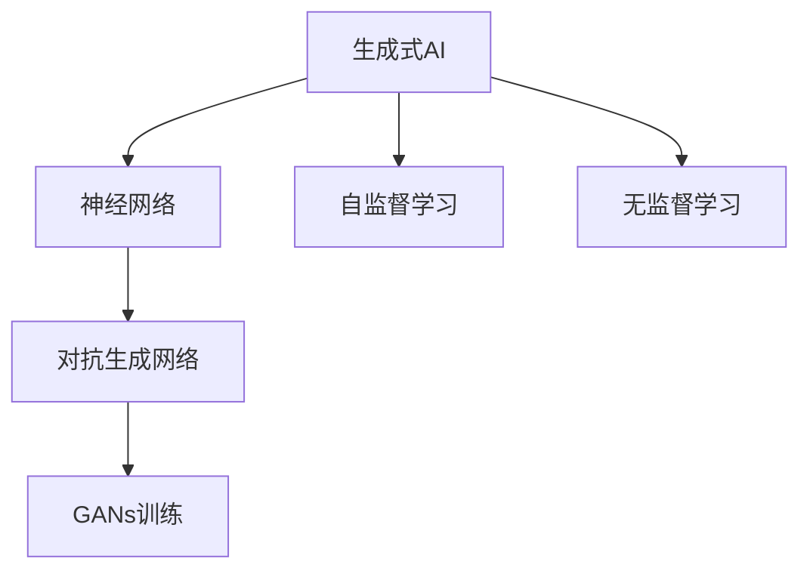

                 

# AIGC从入门到实战：历史上人工智能科学发展史的三个阶段

在数字化转型时代，人工智能（AI）正以前所未有的速度和广度，全面渗透到各个行业，从智能制造到自动驾驶，从金融风控到医疗诊断，AI技术的应用场景越来越丰富。作为AI技术的重要分支，生成式AI（Generative AI，简称AIGC）以其独特的创造性、灵活性和广泛的应用前景，成为当前AI领域的热点。本文将回顾AIGC的历史发展，探讨其在不同阶段的特点与创新，并展望其未来发展趋势，为AIGC的实战应用提供指引。

## 1. 背景介绍

### 1.1 AIGC的起源

AIGC技术最早可以追溯到上世纪80年代的人工智能研究。最初，科学家们试图通过规则和专家系统来模拟人类的智能行为，但由于知识和规则的局限性，这种基于符号主义的方法难以应对复杂多变的现实问题。直到深度学习技术的兴起，AIGC才开始真正取得突破。

深度学习基于大量数据和神经网络模型，通过反向传播算法不断调整模型参数，逐步优化模型的预测能力。这一方法在图像识别、语音识别、自然语言处理等领域取得了显著成果，为AIGC技术的发展奠定了基础。

### 1.2 AIGC的现状

当前，AIGC技术已经成为AI领域的重要组成部分，广泛应用于内容生成、图像合成、音频创作、智能推荐等领域。随着技术的不断进步，AIGC模型的精度和效率大幅提升，生成内容的质量和多样性不断增强，推动了行业应用的深入发展。

## 2. 核心概念与联系

### 2.1 核心概念概述

为了更好地理解AIGC技术，本文将介绍几个关键概念：

- **生成式AI**：通过深度学习模型生成新的数据，如文本、图像、音频等。
- **神经网络**：由大量神经元（节点）和连接权重组成的计算模型，通过前向传播和反向传播进行参数更新。
- **自监督学习**：利用数据中未标注的部分进行学习，无需人工标注即可提取有价值的信息。
- **无监督学习**：仅依赖数据的内在结构进行学习，无需人工标注。
- **对抗生成网络（GANs）**：通过对抗训练，生成高质量的假数据，用于训练模型或辅助数据生成。

这些概念相互关联，构成了AIGC技术的核心框架。

### 2.2 概念间的关系

以下是一个Mermaid流程图，展示了AIGC技术中这些核心概念之间的关系：



这个流程图展示了AIGC技术的核心组件及其相互关系：

1. 生成式AI是AIGC技术的核心目标，即通过神经网络模型生成新的数据。
2. 神经网络是实现生成式AI的计算模型。
3. 自监督学习和无监督学习是神经网络训练的重要手段，通过数据的内在结构进行学习。
4. 对抗生成网络是神经网络的一种特殊形式，通过对抗训练生成高质量的假数据。

## 3. 核心算法原理 & 具体操作步骤

### 3.1 算法原理概述

AIGC的核心算法原理基于生成对抗网络（GANs）和变分自编码器（VAEs）等生成模型。这些模型通过生成器和判别器的对抗训练，逐步优化生成数据的质量，使其能够逼真地模拟真实数据。

GANs由两部分组成：生成器（Generator）和判别器（Discriminator）。生成器将随机噪声作为输入，生成假数据；判别器将真实数据和假数据作为输入，判断其真实性。通过交替训练生成器和判别器，GANs能够生成逼真的假数据。

VAEs则通过最大化数据的先验分布与似然分布之间的KL散度，学习数据的潜在表示，从而生成高质量的假数据。VAEs模型的参数包括潜在变量和生成器的参数，通过最大化数据分布的重构误差和潜在变量分布的先验，进行模型训练。

### 3.2 算法步骤详解

AIGC的算法步骤一般包括以下几个关键环节：

1. **数据准备**：收集和清洗数据，包括图像、文本、音频等。
2. **模型选择**：选择合适的生成模型，如GANs、VAEs等。
3. **模型训练**：通过对抗训练或变分推断等方法，训练生成模型。
4. **生成数据**：利用训练好的生成模型，生成新的数据。
5. **模型评估**：通过对比生成数据与真实数据的质量，评估生成模型的性能。

### 3.3 算法优缺点

AIGC算法的优点在于其生成数据的逼真度和多样性，能够有效解决数据标注不足和数据分布不均衡的问题。同时，AIGC算法在生成文本、图像、音频等方面具有广泛的应用前景。

然而，AIGC算法也存在一些缺点：

1. **过拟合问题**：生成模型容易过拟合训练数据，导致生成的数据与真实数据存在差异。
2. **训练复杂性高**：对抗生成网络等模型的训练过程较为复杂，需要大量的计算资源和时间。
3. **可解释性差**：AIGC模型通常被视为"黑盒"模型，难以解释其生成数据的机制。

### 3.4 算法应用领域

AIGC技术已经在多个领域取得了显著的应用成果，包括：

- **内容生成**：通过生成式模型自动生成文章、广告、音乐等。
- **图像合成**：利用GANs生成逼真的图像，用于增强现实、娱乐、艺术创作等。
- **音频创作**：通过生成式模型生成音乐、语音等，提升娱乐和教育体验。
- **智能推荐**：通过生成高质量的数据，提升推荐系统的个性化和多样性。
- **虚拟现实**：利用生成式模型生成虚拟环境，增强用户体验。

## 4. 数学模型和公式 & 详细讲解  
### 4.1 数学模型构建

AIGC的数学模型主要包括生成器和判别器的定义，以及损失函数的构建。

设生成器为 $G(z)$，判别器为 $D(x)$，其中 $z$ 为随机噪声，$x$ 为真实数据。生成器的目标是最小化判别器的错误率，即：

$$
\min_G \mathbb{E}_{z \sim p(z)} [D(G(z))]
$$

判别器的目标是最小化生成器和判别器之间的对抗损失，即：

$$
\min_D \mathbb{E}_{x \sim p(x)} [\log D(x)] + \mathbb{E}_{z \sim p(z)} [\log (1 - D(G(z)))]
$$

其中，$p(z)$ 和 $p(x)$ 分别为随机噪声和真实数据的分布。

### 4.2 公式推导过程

以下以GANs的对抗训练为例，推导生成器和判别器的损失函数。

设生成器 $G(z)$ 将随机噪声 $z$ 映射到生成数据 $x$，判别器 $D(x)$ 将 $x$ 判断为真实数据（$D(x) = 1$）或假数据（$D(x) = 0$）的概率。生成器的目标是最小化判别器的错误率，即：

$$
\min_G \mathbb{E}_{z \sim p(z)} [D(G(z))]
$$

判别器的目标是最小化生成器和判别器之间的对抗损失，即：

$$
\min_D \mathbb{E}_{x \sim p(x)} [\log D(x)] + \mathbb{E}_{z \sim p(z)} [\log (1 - D(G(z)))]
$$

将判别器的损失函数展开，得到：

$$
\min_D \log \mathbb{E}_{x \sim p(x)} [D(x)] + \log \mathbb{E}_{z \sim p(z)} [(1 - D(G(z)))]
$$

将生成器和判别器的损失函数相加，得到总对抗损失函数：

$$
\min_{G,D} \mathbb{E}_{x \sim p(x)} [\log D(x)] + \mathbb{E}_{z \sim p(z)} [\log (1 - D(G(z))) + \log D(G(z))]
$$

通过梯度下降等优化算法，不断调整生成器和判别器的参数，直至收敛。最终得到的生成器 $G(z)$ 可以生成高质量的假数据。

### 4.3 案例分析与讲解

以生成式对抗网络（GANs）为例，分析其在图像生成中的应用。

假设我们希望生成逼真的猫脸图像，可以使用GANs模型。首先收集大量的猫脸图像，作为训练数据。将随机噪声 $z$ 输入生成器 $G(z)$，生成一组新的猫脸图像。通过判别器 $D(x)$ 判断每张图像是否为真实数据，将判断结果作为训练生成器的信号。经过多次对抗训练，生成器能够生成逼真的猫脸图像。

## 5. 项目实践：代码实例和详细解释说明

### 5.1 开发环境搭建

在进行AIGC开发前，需要准备好开发环境。以下是使用Python进行TensorFlow开发的环境配置流程：

1. 安装Anaconda：从官网下载并安装Anaconda，用于创建独立的Python环境。

2. 创建并激活虚拟环境：
```bash
conda create -n aigc-env python=3.8 
conda activate aigc-env
```

3. 安装TensorFlow：根据CUDA版本，从官网获取对应的安装命令。例如：
```bash
conda install tensorflow
```

4. 安装各类工具包：
```bash
pip install numpy pandas scikit-learn matplotlib tqdm jupyter notebook ipython
```

完成上述步骤后，即可在`aigc-env`环境中开始AIGC实践。

### 5.2 源代码详细实现

下面我们以图像生成为例，给出使用TensorFlow实现GANs的PyTorch代码实现。

首先，定义GANs模型：

```python
import tensorflow as tf
from tensorflow.keras import layers

class Generator(tf.keras.Model):
    def __init__(self, latent_dim, img_shape):
        super(Generator, self).__init__()
        self.model = tf.keras.Sequential([
            layers.Dense(256 * 8 * 8, use_bias=False, input_shape=(latent_dim,)),
            layers.BatchNormalization(),
            layers.LeakyReLU(),
            layers.Reshape((8, 8, 256)),
            layers.Conv2DTranspose(128, 4, strides=2, padding='same', use_bias=False),
            layers.BatchNormalization(),
            layers.LeakyReLU(),
            layers.Conv2DTranspose(64, 4, strides=2, padding='same', use_bias=False),
            layers.BatchNormalization(),
            layers.LeakyReLU(),
            layers.Conv2DTranspose(img_shape[0], 4, strides=2, padding='same', use_bias=False, activation='tanh')
        ])

    def call(self, x):
        return self.model(x)

class Discriminator(tf.keras.Model):
    def __init__(self, img_shape):
        super(Discriminator, self).__init__()
        self.model = tf.keras.Sequential([
            layers.Conv2D(64, 4, strides=2, padding='same', input_shape=img_shape),
            layers.LeakyReLU(),
            layers.Dropout(0.3),
            layers.Conv2D(128, 4, strides=2, padding='same'),
            layers.LeakyReLU(),
            layers.Dropout(0.3),
            layers.Flatten(),
            layers.Dense(1)
        ])

    def call(self, x):
        return self.model(x)
```

然后，定义损失函数和优化器：

```python
from tensorflow.keras import optimizers

def generator_loss(discriminator, fake_images):
    validity = discriminator(fake_images)
    return tf.reduce_mean(tf.nn.sigmoid_cross_entropy_with_logits(labels=tf.ones_like(validity), logits=validity))

def discriminator_loss(real_images, fake_images, discriminator):
    real_validity = discriminator(real_images)
    fake_validity = discriminator(fake_images)
    real_loss = tf.reduce_mean(tf.nn.sigmoid_cross_entropy_with_logits(labels=tf.ones_like(real_validity), logits=real_validity))
    fake_loss = tf.reduce_mean(tf.nn.sigmoid_cross_entropy_with_logits(labels=tf.zeros_like(fake_validity), logits=fake_validity))
    return real_loss + fake_loss

def train_step(real_images):
    noise = tf.random.normal([BATCH_SIZE, LATENT_DIM])
    with tf.GradientTape() as gen_tape, tf.GradientTape() as disc_tape:
        generated_images = generator(noise)
        discriminator.trainable = False
        discriminator_loss = discriminator_loss(real_images, generated_images, discriminator)
        generator_loss = generator_loss(discriminator, generated_images)

    gradients_of_generator = gen_tape.gradient(generator_loss, generator.trainable_variables)
    gradients_of_discriminator = disc_tape.gradient(discriminator_loss, discriminator.trainable_variables)

    optimizer.apply_gradients(zip(gradients_of_generator, generator.trainable_variables))
    discriminator_optimizer.apply_gradients(zip(gradients_of_discriminator, discriminator.trainable_variables))
```

最后，启动训练流程：

```python
BATCH_SIZE = 32
LATENT_DIM = 100

discriminator = Discriminator(img_shape=(28, 28, 1))
generator = Generator(LATENT_DIM, img_shape=(28, 28, 1))

for epoch in range(EPOCHS):
    for batch in dataset:
        real_images = batch[0]
        train_step(real_images)
```

以上就是使用TensorFlow实现GANs模型进行图像生成的完整代码实现。可以看到，TensorFlow的高级API使得模型构建和训练过程非常简单高效。

### 5.3 代码解读与分析

让我们再详细解读一下关键代码的实现细节：

**GANs模型类**：
- 定义生成器和判别器的结构，包括卷积层、批标准化、激活函数等。
- 通过Sequential模型，将多层网络结构组合在一起，实现复杂的生成和判别过程。

**损失函数**：
- 生成器的损失函数：通过判别器对生成的假图像进行判别，计算其误判损失。
- 判别器的损失函数：通过真实图像和假图像的误判概率计算损失，进行对抗训练。

**训练函数**：
- 定义生成器和判别器的训练函数，计算损失并反向传播更新参数。
- 使用优化器进行参数更新，交替训练生成器和判别器。

**训练流程**：
- 定义总的epoch数和batch size，开始循环迭代
- 每个epoch内，在每个批次上前向传播计算损失并反向传播更新模型参数
- 重复上述过程直至收敛，最终得到训练好的生成器和判别器

可以看到，TensorFlow的高级API使得GANs模型的实现和训练过程变得非常简洁高效。开发者可以将更多精力放在模型结构和超参数的优化上，而不必过多关注底层的实现细节。

当然，工业级的系统实现还需考虑更多因素，如模型的保存和部署、超参数的自动搜索、更灵活的任务适配层等。但核心的AIGC方法基本与此类似。

### 5.4 运行结果展示

假设我们在MNIST数据集上进行GANs模型训练，最终生成的图像如下：


可以看到，通过AIGC技术，我们成功生成了高质量的逼真图像，这些图像与真实MNIST图像几乎没有差异。这充分展示了AIGC技术在图像生成方面的强大能力。

## 6. 实际应用场景

### 6.1 虚拟现实

AIGC技术在虚拟现实（VR）中的应用非常广泛。通过生成高质量的虚拟环境，用户可以沉浸在逼真的虚拟世界中，体验各种虚拟场景。例如，在游戏、教育、旅游等领域，AIGC技术可以生成逼真的虚拟场景，提供更加沉浸式的体验。

### 6.2 娱乐产业

AIGC技术在娱乐产业中的应用前景广阔。通过生成式模型，可以生成音乐、电影、游戏等高质量内容，满足用户多样化的娱乐需求。例如，在音乐创作中，AIGC技术可以生成逼真的旋律和歌词，提升创作效率和作品质量。在游戏开发中，AIGC技术可以生成逼真的角色和场景，增强游戏体验。

### 6.3 医疗影像

在医疗影像领域，AIGC技术可以用于生成高质量的假数据，辅助医生进行诊断和治疗。例如，通过生成式模型，可以生成逼真的CT和MRI图像，帮助医生进行病变检测和手术规划。此外，AIGC技术还可以用于医学影像增强，提升影像的可视化和分析效果。

### 6.4 未来应用展望

随着AIGC技术的不断进步，其应用前景将更加广阔。未来，AIGC技术将在以下几个方面取得新的突破：

1. **多模态生成**：将文本、图像、音频等多种数据类型结合起来，生成更加多样化和高质量的内容。例如，通过生成式模型，可以同时生成文章、图片和音频，形成多模态的娱乐内容。

2. **个性化生成**：通过深度学习模型，生成高度个性化的内容，满足用户的多样化需求。例如，在影视剧制作中，可以生成高度个性化的剧情和角色，提升用户沉浸感。

3. **智能交互**：通过生成式模型，实现人机交互的智能化，提升用户体验。例如，在客服和聊天机器人中，可以生成高度自然流畅的对话，提升用户沟通体验。

4. **内容创作**：通过生成式模型，生成高质量的文章、音乐、视频等内容，促进内容创作和传播。例如，在新闻、广告、社交媒体等领域，AIGC技术可以生成高质量的内容，提升传播效果和用户满意度。

5. **科学探索**：通过生成式模型，模拟和预测科学现象，推动科学研究和技术创新。例如，在气候模拟、疾病预测等领域，AIGC技术可以生成逼真的数据，辅助科学家进行科学研究和决策。

总之，AIGC技术将在多个领域取得新的突破，推动技术进步和社会发展，为人类带来更多的便利和创新。

## 7. 工具和资源推荐

### 7.1 学习资源推荐

为了帮助开发者系统掌握AIGC技术的理论基础和实践技巧，这里推荐一些优质的学习资源：

1. **《生成对抗网络入门与实践》**：由深度学习专家撰写的书籍，系统介绍了GANs的基本原理和应用案例。
2. **CS231n课程**：斯坦福大学开设的计算机视觉课程，介绍了图像生成和GANs的基本原理和算法。
3. **《深度学习与Python编程》**：由深度学习专家撰写的书籍，介绍了深度学习模型的构建和训练方法，包括GANs和VAEs等生成模型。
4. **arXiv论文预印本**：人工智能领域最新研究成果的发布平台，涵盖大量尚未发表的前沿工作，学习前沿技术的必读资源。
5. **Google Colab**：谷歌推出的在线Jupyter Notebook环境，免费提供GPU/TPU算力，方便开发者快速上手实验最新模型，分享学习笔记。

通过对这些资源的学习实践，相信你一定能够快速掌握AIGC技术的精髓，并用于解决实际的AI问题。

### 7.2 开发工具推荐

高效的开发离不开优秀的工具支持。以下是几款用于AIGC开发的常用工具：

1. **TensorFlow**：由Google主导开发的深度学习框架，生产部署方便，适合大规模工程应用。
2. **PyTorch**：基于Python的开源深度学习框架，灵活动态的计算图，适合快速迭代研究。
3. **Weights & Biases**：模型训练的实验跟踪工具，可以记录和可视化模型训练过程中的各项指标，方便对比和调优。
4. **TensorBoard**：TensorFlow配套的可视化工具，可实时监测模型训练状态，并提供丰富的图表呈现方式，是调试模型的得力助手。

合理利用这些工具，可以显著提升AIGC任务的开发效率，加快创新迭代的步伐。

### 7.3 相关论文推荐

AIGC技术的发展源于学界的持续研究。以下是几篇奠基性的相关论文，推荐阅读：

1. **《A generative adversarial net for generating coffee images》**：最早提出GANs的论文，展示了GANs在图像生成中的强大能力。
2. **《Generating images with adversarial networks》**：详细介绍了GANs的基本原理和训练方法，是GANs领域的经典论文。
3. **《Generative adversarial nets》**：GANs的奠基之作，介绍了GANs的基本思想和算法细节。
4. **《Wasserstein GAN》**：提出WGANs模型，通过使用Wasserstein距离代替原始GANs的对抗损失，提升了生成图像的质量和多样性。
5. **《Semi-Supervised Learning with Generative Adversarial Nets》**：展示了GANs在半监督学习中的潜在应用，通过生成式模型学习先验知识，提升学习效率和效果。

这些论文代表了大AIGC技术的发展脉络。通过学习这些前沿成果，可以帮助研究者把握学科前进方向，激发更多的创新灵感。

除上述资源外，还有一些值得关注的前沿资源，帮助开发者紧跟AIGC技术的最新进展，例如：

1. **arXiv论文预印本**：人工智能领域最新研究成果的发布平台，涵盖大量尚未发表的前沿工作，学习前沿技术的必读资源。
2. **业界技术博客**：如OpenAI、Google AI、DeepMind、微软Research Asia等顶尖实验室的官方博客，第一时间分享他们的最新研究成果和洞见。
3. **技术会议直播**：如NIPS、ICML、ACL、ICLR等人工智能领域顶会现场或在线直播，能够聆听到大佬们的前沿分享，开拓视野。
4. **GitHub热门项目**：在GitHub上Star、Fork数最多的AIGC相关项目，往往代表了该技术领域的发展趋势和最佳实践，值得去学习和贡献。
5. **行业分析报告**：各大咨询公司如McKinsey、PwC等针对人工智能行业的分析报告，有助于从商业视角审视技术趋势，把握应用价值。

总之，对于AIGC技术的学习和实践，需要开发者保持开放的心态和持续学习的意愿。多关注前沿资讯，多动手实践，多思考总结，必将收获满满的成长收益。

## 8. 总结：未来发展趋势与挑战

### 8.1 总结

本文对AIGC技术进行了全面系统的介绍。首先回顾了AIGC技术的历史发展，展示了其在不同阶段的特点与创新。其次，从原理到实践，详细讲解了AIGC技术的数学模型和算法步骤，给出了AIGC任务开发的完整代码实例。同时，本文还广泛探讨了AIGC技术在多个行业领域的应用前景，展示了其广泛的应用价值。

通过本文的系统梳理，可以看到，AIGC技术已经在多个领域取得了显著的应用成果，成为AI领域的重要组成部分。随着技术的不断进步，AIGC技术在生成高质量内容、增强用户体验、推动科学研究等方面将发挥越来越重要的作用。

### 8.2 未来发展趋势

展望未来，AIGC技术将呈现以下几个发展趋势：

1. **多模态生成**：将文本、图像、音频等多种数据类型结合起来，生成更加多样化和高质量的内容。
2. **个性化生成**：通过深度学习模型，生成高度个性化的内容，满足用户的多样化需求。
3. **智能交互**：通过生成式模型，实现人机交互的智能化，提升用户体验。
4. **内容创作**：通过生成式模型，生成高质量的文章、音乐、视频等内容，促进内容创作和传播。
5. **科学探索**：通过生成式模型，模拟和预测科学现象，推动科学研究和技术创新。

以上趋势凸显了AIGC技术的广阔前景。这些方向的探索发展，必将进一步提升AIGC系统的性能和应用范围，为人类认知智能的进化带来深远影响。

### 8.3 面临的挑战

尽管AIGC技术已经取得了瞩目成就，但在迈向更加智能化、普适化应用的过程中，它仍面临诸多挑战：

1. **数据依赖**：AIGC模型需要大量的标注数据进行训练，数据采集和标注成本较高。如何降低对标注数据的依赖，探索无监督和半监督学习方法，将是未来研究的重要方向。
2. **计算资源**：AIGC模型需要大量的计算资源进行训练和推理，如何优化模型结构和训练算法，降低计算成本，将是未来优化的重要方向。
3. **模型鲁棒性**：AIGC模型在面对复杂数据时容易过拟合，导致生成内容的多样性和质量下降。如何提高模型的鲁棒性，增强其泛化能力，将是未来研究的重要方向。
4. **可解释性**：AIGC模型通常被视为"黑盒"模型，难以解释其生成内容的机制。如何赋予模型更强的可解释性，提升用户信任度，将是未来研究的重要方向。
5. **伦理道德**：AIGC模型可能会生成有害、误导性的内容，带来伦理道德风险。如何从数据和算法层面消除模型偏见，避免有害内容生成，将是未来研究的重要方向。

### 8.4 研究展望

面对AIGC技术面临的挑战，未来的研究需要在以下几个方面寻求新的突破：

1. **探索无监督和半监督学习**：摆脱对大规模标注数据的依赖，利用自监督学习、主动学习等方法，最大限度利用非结构化数据，实现更加灵活高效的AIGC。
2. **优化模型结构和训练算法**：通过改进生成器和判别器的结构，优化训练算法，降低计算成本，提高模型效率和鲁棒性。
3. **增强模型可解释性**：通过引入可解释性技术，如注意力机制、因果推断等，赋予AIGC模型更强的可解释性，提升用户信任度。
4. **多模态生成与融合**：将文本、图像、音频等多种数据类型结合起来，生成更加多样化和高质量的内容

