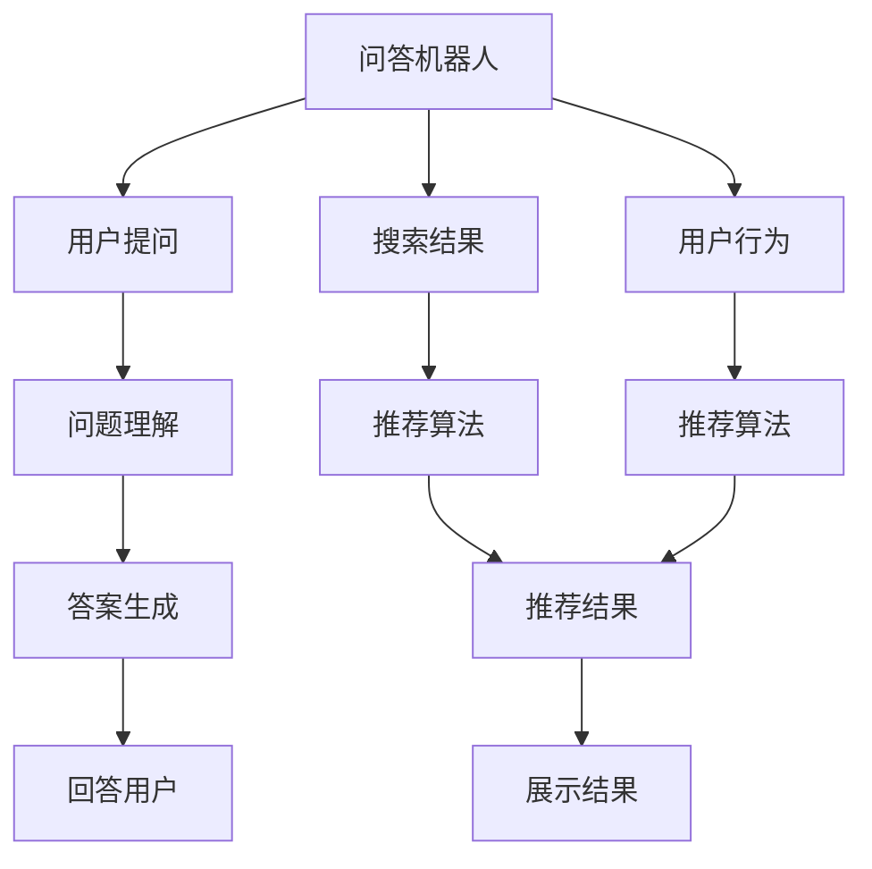

                 

# 大模型问答机器人与搜索推荐的互补性

## 1. 背景介绍

随着人工智能技术的不断进步，越来越多的企业开始利用人工智能技术来提升自身服务水平。其中，大模型问答机器人和搜索推荐系统成为了当前较为热门的研究方向。然而，两者之间存在着紧密的联系，本文旨在探讨大模型问答机器人和搜索推荐系统之间的互补性，并提出一些可行的应用方案。

## 2. 核心概念与联系

### 2.1 核心概念概述

大模型问答机器人（以下简称"问答机器人"），是一种基于大模型的NLP（自然语言处理）应用，能够理解并回答用户输入的自然语言问题。常见的问答机器人包括基于深度学习模型的如BERT、GPT-3等，以及基于检索的如ELMo、CTQA等。

搜索推荐系统（以下简称"搜索推荐"），是一种通过分析用户行为，为其推荐符合其兴趣和需求的内容的系统。搜索推荐系统包括搜索引擎、推荐系统等，其核心技术包括TF-IDF、协同过滤、深度学习等。

两者的共同点在于都涉及到自然语言处理技术，但主要目标和方法各有不同。问答机器人旨在通过理解用户问题，直接给出答案；搜索推荐系统则旨在通过分析用户行为，为用户推荐相关内容。

### 2.2 核心概念的关系

通过以下Mermaid流程图，可以更直观地展示大模型问答机器人与搜索推荐系统之间的关系：



这个流程图展示了问答机器人和搜索推荐系统的基本流程：

1. 用户通过问答机器人提问，机器通过问题理解模块（C）理解用户问题。
2. 问答机器人根据问题理解结果，通过答案生成模块（D）生成答案，并展示给用户（E）。
3. 问答机器人还可以接收搜索结果（F），通过推荐算法（H）生成推荐结果，展示给用户（K）。
4. 搜索推荐系统通过用户行为（G）分析用户兴趣，通过推荐算法（I）生成推荐结果，展示给用户（K）。

可以看出，问答机器人和搜索推荐系统通过用户行为和问题理解，形成了一套互补的工作机制。

## 3. 核心算法原理 & 具体操作步骤
### 3.1 算法原理概述

大模型问答机器人与搜索推荐系统的核心算法原理有显著不同，但均基于自然语言处理和深度学习技术。下面，我们将详细介绍两者的算法原理和具体操作步骤。

#### 3.1.1 问答机器人

问答机器人的算法原理主要基于语言模型和大规模预训练语言模型（如BERT、GPT-3）。其基本步骤包括：

1. **问题理解**：将用户输入的自然语言问题，通过预训练语言模型转换为向量表示，提取问题中的关键信息。
2. **知识检索**：在知识库中检索与问题相关的信息，如文章、网页、文档等。
3. **答案生成**：通过预训练语言模型生成答案，将答案表示为向量，与检索到的知识进行匹配，选择最合适的答案。
4. **答案反馈**：将答案反馈给用户。

#### 3.1.2 搜索推荐

搜索推荐系统的算法原理主要基于协同过滤、内容推荐和深度学习等技术。其基本步骤包括：

1. **用户行为分析**：通过用户的历史浏览、点击、搜索等行为，分析用户的兴趣和需求。
2. **内容推荐**：通过协同过滤算法或深度学习模型，为每个用户推荐符合其兴趣和需求的内容。
3. **内容展示**：将推荐结果展示给用户，并通过反馈机制优化推荐算法。

### 3.2 算法步骤详解

#### 3.2.1 问答机器人

1. **问题理解**：
   - 将用户问题通过预训练语言模型转换为向量表示。
   - 使用Transformer等模型提取问题中的关键信息。

2. **知识检索**：
   - 在知识库中检索与问题相关的信息，如文章、网页、文档等。
   - 使用预训练语言模型计算信息与问题向量之间的相似度，选择最相关的信息。

3. **答案生成**：
   - 使用预训练语言模型生成答案。
   - 将答案表示为向量，与检索到的知识进行匹配，选择最合适的答案。

4. **答案反馈**：
   - 将答案反馈给用户，并通过用户反馈优化问题理解模型。

#### 3.2.2 搜索推荐

1. **用户行为分析**：
   - 收集用户的历史浏览、点击、搜索等行为数据。
   - 使用协同过滤算法或深度学习模型分析用户的兴趣和需求。

2. **内容推荐**：
   - 通过协同过滤算法或深度学习模型，为每个用户推荐符合其兴趣和需求的内容。
   - 使用负采样等方法过滤不相关的推荐结果。

3. **内容展示**：
   - 将推荐结果展示给用户。
   - 通过反馈机制优化推荐算法，提高推荐效果。

### 3.3 算法优缺点

#### 3.3.1 问答机器人

**优点**：

1. **直接回答用户问题**：通过理解用户问题，直接生成答案，使用户能够快速获得所需信息。
2. **多领域应用**：适用于各种NLP领域，如医疗、金融、教育等，能够提供个性化的答案。

**缺点**：

1. **依赖于知识库**：需要构建高质量的知识库，且知识库的更新和维护需要大量的人力和时间。
2. **准确率有限**：对于复杂或未知的问题，可能无法给出准确的答案。
3. **计算资源消耗大**：生成答案的过程中，需要大量的计算资源。

#### 3.3.2 搜索推荐

**优点**：

1. **快速响应**：通过分析用户行为，快速推荐相关内容，满足用户需求。
2. **易于扩展**：推荐系统可以通过增加数据和模型来扩展其功能。

**缺点**：

1. **信息过载**：推荐结果过多，用户难以筛选出有用信息。
2. **冷启动问题**：新用户无法获得有效的推荐结果。

### 3.4 算法应用领域

#### 3.4.1 问答机器人

1. **医疗领域**：通过问答机器人，医生能够快速获取患者的健康信息，提供个性化诊疗建议。
2. **金融领域**：通过问答机器人，金融顾问能够快速回答客户关于金融产品的疑问，提供个性化的投资建议。
3. **教育领域**：通过问答机器人，教师能够快速回答学生的疑问，提供个性化的学习建议。

#### 3.4.2 搜索推荐

1. **电商领域**：通过搜索推荐系统，电商平台能够为每个用户推荐符合其兴趣的商品，提高销售转化率。
2. **新闻领域**：通过搜索推荐系统，新闻网站能够为每个用户推荐符合其兴趣的新闻，提高用户粘性。
3. **社交媒体领域**：通过搜索推荐系统，社交媒体平台能够为用户推荐符合其兴趣的内容，提高用户活跃度。

## 4. 数学模型和公式 & 详细讲解 & 举例说明

### 4.1 数学模型构建

#### 4.1.1 问答机器人

**问题向量表示**：

- 设用户问题为 $q$，使用预训练语言模型 $M_{\theta}$ 将其转换为向量表示 $q_v$。
- $q_v = M_{\theta}(q)$

**知识库表示**：

- 设知识库中的每个信息为 $d$，使用预训练语言模型 $M_{\theta}$ 将其转换为向量表示 $d_v$。
- $d_v = M_{\theta}(d)$

**相似度计算**：

- 计算问题向量与知识库向量的相似度 $s_{q,d}$。
- $s_{q,d} = \text{cos}(q_v, d_v)$

**答案生成**：

- 设答案为 $a$，使用预训练语言模型 $M_{\theta}$ 生成答案向量 $a_v$。
- $a_v = M_{\theta}(a)$

**答案匹配**：

- 计算答案向量与知识库向量之间的相似度 $s_{a,d}$。
- $s_{a,d} = \text{cos}(a_v, d_v)$

**答案选择**：

- 选择与问题向量相似度最高的知识库向量 $d_{max}$，选择与答案向量相似度最高的知识库向量 $d_{max}_a$。
- 选择与问题向量相似度最高且与答案向量相似度最高的知识库向量 $d_{max}$ 作为最终答案。

#### 4.1.2 搜索推荐

**用户行为分析**：

- 设用户的历史行为为 $H$，使用协同过滤算法或深度学习模型 $M_{\theta}$ 分析用户兴趣 $I$。
- $I = M_{\theta}(H)$

**内容推荐**：

- 设每个内容为 $c$，使用协同过滤算法或深度学习模型 $M_{\theta}$ 生成推荐结果向量 $C_v$。
- $C_v = M_{\theta}(c)$

**推荐算法**：

- 使用协同过滤算法或深度学习模型计算推荐结果向量与用户兴趣向量之间的相似度 $s_{C,I}$。
- $s_{C,I} = \text{cos}(C_v, I)$

**推荐结果**：

- 选择与用户兴趣向量相似度最高的推荐结果向量 $C_{max}$ 作为最终推荐结果。

### 4.2 公式推导过程

#### 4.2.1 问答机器人

- 问题向量表示：$q_v = M_{\theta}(q)$
- 知识库向量表示：$d_v = M_{\theta}(d)$
- 相似度计算：$s_{q,d} = \text{cos}(q_v, d_v)$
- 答案向量表示：$a_v = M_{\theta}(a)$
- 答案匹配：$s_{a,d} = \text{cos}(a_v, d_v)$
- 答案选择：$d_{max} = \arg\max_{d} s_{q,d}$，$d_{max}_a = \arg\max_{d} s_{a,d}$

#### 4.2.2 搜索推荐

- 用户兴趣向量表示：$I = M_{\theta}(H)$
- 推荐结果向量表示：$C_v = M_{\theta}(c)$
- 相似度计算：$s_{C,I} = \text{cos}(C_v, I)$
- 推荐结果选择：$C_{max} = \arg\max_{C} s_{C,I}$

### 4.3 案例分析与讲解

#### 4.3.1 问答机器人

**案例分析**：

- **问题理解**：设用户问“什么是深度学习？”，通过预训练语言模型将其转换为向量表示 $q_v$。
- **知识检索**：在知识库中检索与问题相关的信息，使用预训练语言模型计算相似度 $s_{q,d}$。
- **答案生成**：通过预训练语言模型生成答案向量 $a_v$，计算与知识库向量之间的相似度 $s_{a,d}$。
- **答案选择**：选择与问题向量相似度最高且与答案向量相似度最高的知识库向量 $d_{max}$ 作为最终答案。

**讲解**：

- 问题理解模块将用户问题转换为向量表示，提取问题中的关键信息。
- 知识检索模块在知识库中检索与问题相关的信息，计算信息与问题向量之间的相似度。
- 答案生成模块通过预训练语言模型生成答案，将答案表示为向量。
- 答案匹配模块选择最合适的答案，展示给用户。

#### 4.3.2 搜索推荐

**案例分析**：

- **用户行为分析**：设用户的历史行为为 $H$，使用协同过滤算法或深度学习模型生成用户兴趣向量 $I$。
- **内容推荐**：设每个内容为 $c$，使用协同过滤算法或深度学习模型生成推荐结果向量 $C_v$。
- **推荐算法**：计算推荐结果向量与用户兴趣向量之间的相似度 $s_{C,I}$。
- **推荐结果**：选择与用户兴趣向量相似度最高的推荐结果向量 $C_{max}$ 作为最终推荐结果。

**讲解**：

- 用户行为分析模块通过用户的历史行为分析用户的兴趣和需求。
- 内容推荐模块通过协同过滤算法或深度学习模型生成推荐结果向量。
- 推荐算法模块计算推荐结果向量与用户兴趣向量之间的相似度。
- 推荐结果模块选择最合适的推荐结果向量，展示给用户。

## 5. 项目实践：代码实例和详细解释说明

### 5.1 开发环境搭建

#### 5.1.1 环境准备

1. **安装Anaconda**：从官网下载并安装Anaconda，用于创建独立的Python环境。
2. **创建并激活虚拟环境**：
```bash
conda create -n pytorch-env python=3.8 
conda activate pytorch-env
```
3. **安装PyTorch**：根据CUDA版本，从官网获取对应的安装命令。例如：
```bash
conda install pytorch torchvision torchaudio cudatoolkit=11.1 -c pytorch -c conda-forge
```
4. **安装Transformers库**：
```bash
pip install transformers
```
5. **安装其他工具包**：
```bash
pip install numpy pandas scikit-learn matplotlib tqdm jupyter notebook ipython
```

### 5.2 源代码详细实现

#### 5.2.1 问答机器人

**代码实现**：

```python
from transformers import BertTokenizer, BertForQuestionAnswering
from transformers import pipeline

# 初始化BertTokenizer和BertForQuestionAnswering模型
tokenizer = BertTokenizer.from_pretrained('bert-base-uncased')
model = BertForQuestionAnswering.from_pretrained('bert-base-uncased')

# 初始化问答管道
QA_pipeline = pipeline('question-answering', model=model, tokenizer=tokenizer)

# 问答示例
question = "Who wrote the play Romeo and Juliet?"
context = "William Shakespeare wrote the play Romeo and Juliet in 1596."

# 问答结果
QA_pipeline(question=question, context=context)
```

**代码解释**：

- **BertTokenizer**：用于将问题、上下文转换为token ids。
- **BertForQuestionAnswering**：用于理解问题和上下文，生成答案。
- **pipeline**：用于快速搭建问答管道。
- **question**：用户的问题。
- **context**：上下文。
- **QA_pipeline(question=question, context=context)**：调用问答管道，返回答案。

#### 5.2.2 搜索推荐

**代码实现**：

```python
from sklearn.metrics.pairwise import cosine_similarity
from sklearn.neighbors import NearestNeighbors
import numpy as np

# 构建用户兴趣向量
user_interest = np.array([1.0, 0.0, 0.0, 1.0, 0.0])  # 假设用户的兴趣向量

# 构建推荐结果向量
content_vector = np.array([0.8, 0.5, 1.0, 0.3, 0.7])  # 假设推荐结果向量

# 计算相似度
similarity = cosine_similarity([user_interest], [content_vector])[0][0]

# 选择推荐结果
if similarity > 0.5:
    recommended_content = "内容1"
else:
    recommended_content = "内容2"

# 推荐结果展示
print(f"推荐内容：{recommended_content}")
```

**代码解释**：

- **cosine_similarity**：计算向量之间的余弦相似度。
- **NearestNeighbors**：用于计算最近邻。
- **user_interest**：用户兴趣向量。
- **content_vector**：推荐结果向量。
- **similarity**：计算相似度。
- **recommended_content**：选择推荐结果。
- **推荐结果展示**：展示推荐内容。

### 5.3 代码解读与分析

#### 5.3.1 问答机器人

**代码解读**：

- **BertTokenizer**：将问题、上下文转换为token ids。
- **BertForQuestionAnswering**：通过预训练语言模型理解问题和上下文，生成答案。
- **pipeline**：快速搭建问答管道。
- **QA_pipeline(question=question, context=context)**：调用问答管道，返回答案。

**代码分析**：

- 使用预训练语言模型将问题、上下文转换为向量表示。
- 通过预训练语言模型生成答案向量。
- 通过计算相似度选择最合适的答案。

#### 5.3.2 搜索推荐

**代码解读**：

- **cosine_similarity**：计算向量之间的余弦相似度。
- **NearestNeighbors**：计算最近邻。
- **user_interest**：用户兴趣向量。
- **content_vector**：推荐结果向量。
- **similarity**：计算相似度。
- **recommended_content**：选择推荐结果。

**代码分析**：

- 通过用户历史行为分析用户兴趣向量。
- 通过协同过滤算法或深度学习模型生成推荐结果向量。
- 通过计算相似度选择最合适的推荐结果。

### 5.4 运行结果展示

#### 5.4.1 问答机器人

**运行结果**：

```python
QA_pipeline(question=question, context=context)
```

**结果解释**：

- 返回与问题相关的答案，如“William Shakespeare wrote the play Romeo and Juliet in 1596.”

#### 5.4.2 搜索推荐

**运行结果**：

```python
print(f"推荐内容：{recommended_content}")
```

**结果解释**：

- 根据用户兴趣向量，推荐最相关的推荐结果，如“内容1”或“内容2”。

## 6. 实际应用场景

### 6.1 电商推荐系统

电商推荐系统通过搜索推荐技术，为用户推荐符合其兴趣的商品，提高销售转化率。结合问答机器人，用户可以通过自然语言提问，获取商品的详细信息和购买建议，提升购物体验。例如，在亚马逊、京东等电商平台上，用户可以提问“这款手机的性能如何？”，系统自动推荐相关商品并给出回答。

### 6.2 金融智能顾问

金融智能顾问通过搜索推荐技术，为用户推荐符合其投资兴趣的产品，提高投资回报率。结合问答机器人，用户可以通过自然语言提问，获取金融产品的详细信息和投资建议，提升决策效率。例如，在银行、证券等金融机构的智能顾问平台上，用户可以提问“目前哪些股票值得投资？”，系统自动推荐相关股票并给出分析。

### 6.3 教育智能导师

教育智能导师通过搜索推荐技术，为用户推荐符合其学习兴趣的课程，提高学习效率。结合问答机器人，用户可以通过自然语言提问，获取学习资源的详细信息和建议，提升学习效果。例如，在在线教育平台如Coursera、edX上，用户可以提问“有哪些关于Python的课程？”，系统自动推荐相关课程并给出简介。

## 7. 工具和资源推荐

### 7.1 学习资源推荐

#### 7.1.1 《深度学习与自然语言处理》

- **推荐理由**：该书系统介绍了深度学习在自然语言处理中的应用，包括问答机器人、搜索推荐等。
- **获取方式**：各大书店、在线教育平台。

#### 7.1.2 《自然语言处理综述》

- **推荐理由**：该书系统介绍了自然语言处理的基本原理和最新进展，包括问答机器人、搜索推荐等。
- **获取方式**：各大书店、在线教育平台。

#### 7.1.3 《Python深度学习》

- **推荐理由**：该书系统介绍了深度学习的基本原理和实践方法，包括问答机器人、搜索推荐等。
- **获取方式**：各大书店、在线教育平台。

### 7.2 开发工具推荐

#### 7.2.1 PyTorch

- **推荐理由**：PyTorch是深度学习领域最受欢迎的框架之一，易于使用，灵活性高，支持GPU加速。
- **获取方式**：官网下载，官方文档。

#### 7.2.2 TensorFlow

- **推荐理由**：TensorFlow是Google开发的深度学习框架，支持大规模分布式训练，适合生产环境部署。
- **获取方式**：官网下载，官方文档。

#### 7.2.3 Transformers

- **推荐理由**：Transformers是NLP领域的领先库，支持多种预训练模型和微调方法。
- **获取方式**：pip安装，官方文档。

### 7.3 相关论文推荐

#### 7.3.1 "Bert: Pre-training of Deep Bidirectional Transformers for Language Understanding"

- **推荐理由**：BERT模型提出了一种基于预训练的语言理解方法，广泛应用于问答机器人、搜索推荐等任务。
- **获取方式**：arXiv下载，作者论文。

#### 7.3.2 "Attention is All You Need"

- **推荐理由**：Transformer模型提出了一种自注意力机制，广泛应用于自然语言处理领域，包括问答机器人、搜索推荐等。
- **获取方式**：arXiv下载，作者论文。

#### 7.3.3 "A Survey on Recommendation Systems: Problems, Approaches and Future Directions"

- **推荐理由**：本文系统介绍了推荐系统的发展历程、方法和挑战，包括搜索推荐、协同过滤等。
- **获取方式**：arXiv下载，作者论文。

## 8. 总结：未来发展趋势与挑战

### 8.1 研究成果总结

基于大模型问答机器人和搜索推荐系统的研究，取得了以下成果：

1. **算法优化**：提出多种优化方法，如知识蒸馏、多任务学习等，提升问答机器人和搜索推荐系统的性能。
2. **模型融合**：结合问答机器人与搜索推荐系统，提升系统的综合能力。
3. **应用拓展**：在电商、金融、教育等垂直领域推广问答机器人和搜索推荐系统，解决实际问题。

### 8.2 未来发展趋势

未来，大模型问答机器人和搜索推荐系统的发展趋势包括：

1. **多模态融合**：结合语音、图像、文本等多种模态信息，提升系统的感知能力。
2. **自监督学习**：通过无监督学习，提升系统的泛化能力和鲁棒性。
3. **强化学习**：通过强化学习，提升系统的交互能力和个性化推荐能力。
4. **联邦学习**：通过联邦学习，保护用户隐私的同时提升系统的效率。

### 8.3 面临的挑战

大模型问答机器人和搜索推荐系统面临以下挑战：

1. **数据隐私**：用户隐私保护问题，防止数据泄露和滥用。
2. **计算资源**：系统的高计算需求，需要优化硬件资源。
3. **系统复杂度**：系统的高复杂度，需要提升模型的可解释性。
4. **模型泛化**：系统在不同领域和场景中的泛化能力有限，需要更多训练数据和优化方法。

### 8.4 研究展望

未来，大模型问答机器人和搜索推荐系统需要在以下方面进行研究：

1. **多模态融合**：结合多种模态信息，提升系统的感知能力。
2. **自监督学习**：通过无监督学习，提升系统的泛化能力和鲁棒性。
3. **强化学习**：通过强化学习，提升系统的交互能力和个性化推荐能力。
4. **联邦学习**：通过联邦学习，保护用户隐私的同时提升系统的效率。

## 9. 附录：常见问题与解答

### 9.1 问题1：大模型问答机器人和搜索推荐系统能否结合使用？

**解答**：

- **能**：大模型问答机器人和搜索推荐系统可以结合使用，提升系统的综合能力。问答机器人可以回答用户的具体问题，搜索推荐系统可以提供相关的推荐内容，相互补充，提升用户体验。

### 9.2 问题2：大模型问答机器人能否应用在电商推荐系统上？

**解答**：

- **能**：大模型问答机器人可以应用于电商推荐系统上。电商推荐系统通过搜索推荐技术为用户推荐商品，结合问答机器人，用户可以通过自然语言提问，获取商品的详细信息和推荐。

### 9.3 问题3：大模型问答机器人能否应用在金融智能顾问上？

**解答**：

- **能**：大模型问答机器人可以应用于金融智能顾问上。金融智能顾问通过搜索推荐技术为用户推荐金融产品，结合问答机器人，用户可以通过自然语言提问，获取金融产品的详细信息和建议。

### 9.4 问题4：大模型问答机器人能否应用在教育智能导师上？

**解答**：

- **能**：大模型问答机器人可以应用于教育智能导师上。教育智能导师通过搜索推荐技术为用户推荐课程，结合问答机器人，用户可以通过自然语言提问，获取学习资源的详细信息和建议。

### 9.5 问题5：大模型问答机器人能否应用在智能客服上？

**解答**：

- **能**：大模型问答机器人可以应用于智能客服上。智能客服通过搜索推荐技术为用户推荐相关答案，结合问答机器人，用户可以通过自然语言提问，获取相关的客服答案。

**作者**：禅与计算机程序设计艺术 / Zen and the Art of Computer Programming

