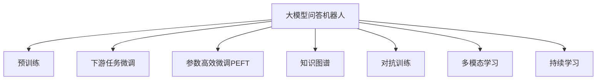
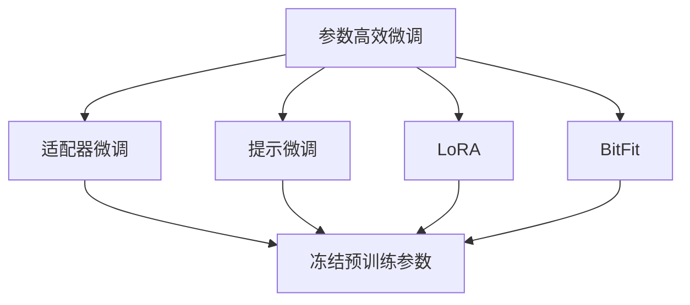
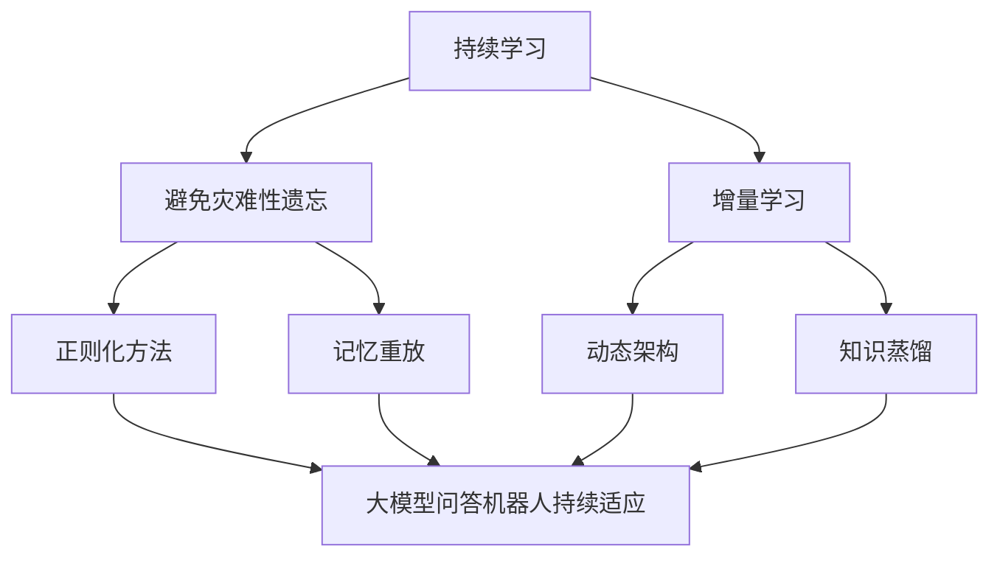
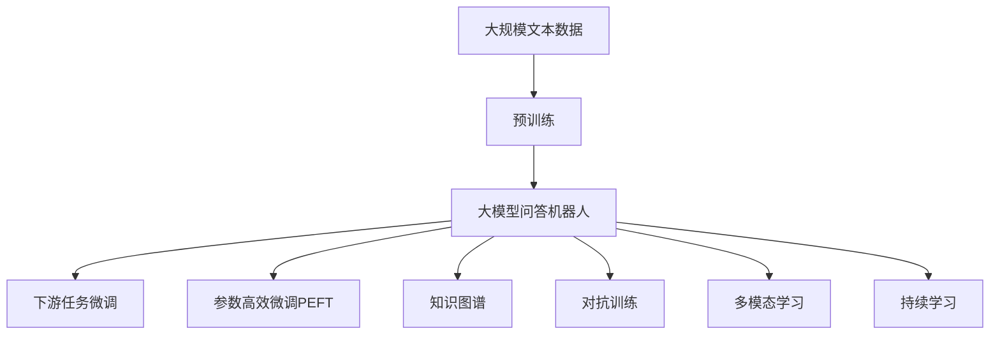

                 

# 大模型问答机器人的任务完成能力

> 关键词：大模型问答机器人,自然语言处理,NLP,深度学习,对话系统,Transformer,BERT,预训练,下游任务,模型微调,参数高效微调,自然语言理解,回答准确率,用户满意度,对话系统设计,深度学习模型优化,持续学习

## 1. 背景介绍

### 1.1 问题由来
近年来，随着深度学习技术和大规模预训练模型的快速发展，大模型问答机器人（Large Model-based Conversational Robots）在自然语言处理（NLP）领域取得了显著的突破。这些问答机器人通过在大规模文本语料上进行预训练，学习到丰富的语言知识和常识，能够执行各种复杂的自然语言理解和生成任务。

问答机器人技术的应用场景广泛，从智能客服、在线教育到医疗咨询、金融理财等，为各行各业带来了智能化和自动化水平的提升。然而，随着应用场景的不断扩展，对问答机器人的任务完成能力提出了更高的要求。本文将深入探讨大模型问答机器人的任务完成能力，分析其优缺点和应用领域，并展望未来的发展方向。

### 1.2 问题核心关键点
问答机器人的任务完成能力主要体现在以下几个方面：

- **语言理解能力**：能否准确理解用户输入的自然语言，提取关键信息，进行正确的语义分析。
- **知识整合能力**：能否有效整合知识库中的信息，回答涉及多事实、多领域的问题。
- **逻辑推理能力**：能否在处理复杂问题时，进行合理的推理和推断。
- **多轮对话能力**：能否在多轮对话中维持对话的连贯性和上下文一致性。
- **个性化推荐能力**：能否根据用户的个性化需求和历史行为，提供定制化的答案和服务。
- **鲁棒性和泛化能力**：能否在面对噪声数据、新领域数据和对抗攻击时，保持稳定的性能。

这些能力是问答机器人任务完成能力的重要组成部分，也是评价其性能的关键指标。

### 1.3 问题研究意义
研究大模型问答机器人的任务完成能力，对于提升其性能和应用价值，推动NLP技术的发展，具有重要意义：

1. **优化模型设计**：通过分析问答机器人的任务完成能力，可以发现模型设计中的不足，指导后续的模型优化和改进。
2. **提升用户体验**：通过优化问答机器人的任务完成能力，可以提升用户的满意度，增强用户体验。
3. **拓展应用场景**：提升问答机器人的任务完成能力，可以拓展其应用场景，推动其在更多领域中的应用。
4. **促进技术进步**：问答机器人的任务完成能力提升，可以带动NLP技术的整体进步，推动AI技术的产业化进程。
5. **增强伦理安全性**：提升问答机器人的任务完成能力，可以增强其伦理和安全性能，确保在多模态数据交互中不产生有害行为。

## 2. 核心概念与联系

### 2.1 核心概念概述

为了更好地理解大模型问答机器人的任务完成能力，本节将介绍几个密切相关的核心概念：

- **大模型问答机器人**：以Transformer、BERT等预训练模型为基础，在大规模文本语料上进行预训练，学习通用的语言表示和知识表示，能够执行各种自然语言理解和生成任务的机器人。
- **预训练**：指在大规模无标签文本语料上，通过自监督学习任务训练模型，学习到通用的语言和知识表示的过程。
- **下游任务微调**：指在预训练模型的基础上，使用特定任务的少量标注数据，通过有监督学习优化模型在该任务上的性能。
- **参数高效微调（PEFT）**：指在微调过程中，只更新少量的模型参数，而固定大部分预训练权重不变，以提高微调效率和避免过拟合。
- **知识图谱**：用于表示实体之间的关系和属性，为问答机器人提供结构化的知识支持。
- **对抗训练**：通过引入对抗样本，提高模型鲁棒性，减少模型对噪声和攻击的敏感性。
- **多模态学习**：指结合文本、图像、语音等多种数据模态，增强模型的理解和生成能力。
- **持续学习**：指模型能够不断学习新知识，同时保持已学习的知识，适应数据分布的变化。

这些核心概念之间的逻辑关系可以通过以下Mermaid流程图来展示：



这个流程图展示了大模型问答机器人的核心概念及其之间的关系：

1. 大模型问答机器人通过预训练学习通用的语言和知识表示。
2. 通过下游任务微调，适应特定的应用场景和任务。
3. 参数高效微调提高微调效率，避免过拟合。
4. 知识图谱提供结构化的知识支持。
5. 对抗训练提高模型的鲁棒性。
6. 多模态学习增强模型的理解和生成能力。
7. 持续学习使模型能够不断学习新知识，保持性能。

### 2.2 概念间的关系

这些核心概念之间存在着紧密的联系，形成了大模型问答机器人的完整生态系统。下面我们通过几个Mermaid流程图来展示这些概念之间的关系。

#### 2.2.1 问答机器人的学习范式


这个流程图展示了大模型问答机器人的主要学习范式，即预训练和下游任务微调。预训练使得模型学习到通用的语言和知识表示，微调则根据特定任务进一步优化。

#### 2.2.2 参数高效微调方法



这个流程图展示了几种常见的参数高效微调方法，包括适配器微调、提示微调、LoRA和BitFit。这些方法的共同特点是冻结大部分预训练参数，只更新少量参数，从而提高微调效率。

#### 2.2.3 持续学习在大模型问答机器人中的应用



这个流程图展示了持续学习在大模型问答机器人中的应用。持续学习的主要目标是避免灾难性遗忘和实现增量学习。通过正则化方法、记忆重放、动态架构和知识蒸馏等技术，可以使大模型问答机器人持续适应新的任务和数据。

### 2.3 核心概念的整体架构

最后，我们用一个综合的流程图来展示这些核心概念在大模型问答机器人微调过程中的整体架构：



这个综合流程图展示了从预训练到微调，再到持续学习的完整过程。大模型问答机器人首先在大规模文本数据上进行预训练，然后通过下游任务微调（包括全参数微调和参数高效微调）和知识图谱、对抗训练等技术，进一步优化模型性能。最后，通过持续学习技术，模型可以不断学习新知识，保持性能。 通过这些流程图，我们可以更清晰地理解大模型问答机器人微调过程中各个核心概念的关系和作用，为后续深入讨论具体的微调方法和技术奠定基础。

## 3. 核心算法原理 & 具体操作步骤
### 3.1 算法原理概述

大模型问答机器人任务完成能力的基础是其语言理解和生成能力。预训练模型在大量无标签文本数据上进行自监督学习，学习到通用的语言表示和知识表示。下游任务微调则在此基础上，通过有监督学习，进一步优化模型在特定任务上的性能。

具体而言，大模型问答机器人的任务完成能力可以分解为以下几个关键步骤：

1. **预训练**：在大量无标签文本数据上，通过自监督学习任务训练预训练模型，学习通用的语言和知识表示。
2. **下游任务微调**：使用下游任务的少量标注数据，通过有监督学习优化模型在特定任务上的性能。
3. **参数高效微调**：通过只更新少量的模型参数，提高微调效率，避免过拟合。
4. **知识图谱整合**：通过将知识图谱与预训练模型融合，增强模型的知识表示能力。
5. **对抗训练**：通过引入对抗样本，提高模型的鲁棒性和泛化能力。
6. **多模态学习**：结合文本、图像、语音等多种数据模态，增强模型的理解和生成能力。
7. **持续学习**：通过不断学习新知识，保持模型性能，适应数据分布的变化。

这些步骤共同构成了大模型问答机器人任务完成能力的核心算法原理。

### 3.2 算法步骤详解

以下是大模型问答机器人任务完成能力的具体算法步骤：

#### 3.2.1 预训练

预训练是构建大模型问答机器人的基础步骤。预训练模型的目的是通过自监督学习，学习到通用的语言和知识表示。常见的预训练任务包括掩码语言模型（Masked Language Model, MLM）、下一句预测（Next Sentence Prediction, NSP）等。

具体而言，预训练过程可以分为以下几个步骤：

1. 数据准备：收集大规模无标签文本数据，如维基百科、新闻报道、书籍等。
2. 模型初始化：选择合适的预训练模型，如BERT、GPT等，并进行初始化。
3. 自监督学习：在预训练模型上进行自监督学习，学习通用的语言和知识表示。常用的自监督任务包括MLM和NSP。
4. 模型评估：在验证集上评估预训练模型的性能，确保预训练效果良好。
5. 保存模型：将预训练模型保存下来，以便后续下游任务微调使用。

#### 3.2.2 下游任务微调

下游任务微调是提升大模型问答机器人任务完成能力的关键步骤。微调的目标是根据特定任务，进一步优化预训练模型的性能。常见的下游任务包括文本分类、命名实体识别、问答等。

具体而言，下游任务微调过程可以分为以下几个步骤：

1. 数据准备：收集下游任务的标注数据，如问题-答案对、文本分类标注等。
2. 模型初始化：加载预训练模型，并进行微调前的初始化。
3. 任务适配层设计：根据下游任务类型，设计合适的输出层和损失函数。
4. 微调模型：使用下游任务的标注数据，通过有监督学习优化模型性能。
5. 模型评估：在验证集上评估微调模型的性能，确保微调效果良好。
6. 保存模型：将微调模型保存下来，以便后续使用。

#### 3.2.3 参数高效微调

参数高效微调（Parameter-Efficient Fine-Tuning, PEFT）是大模型问答机器人任务完成能力的一个重要提升方法。通过只更新少量的模型参数，可以显著提高微调效率，避免过拟合。

常用的参数高效微调方法包括适配器微调（Adapter）、提示微调（Prompt Tuning）等。这些方法的基本思想是在预训练模型基础上，只更新与任务相关的部分参数，而保留大部分预训练权重不变。

#### 3.2.4 知识图谱整合

知识图谱是一种用于表示实体之间关系的结构化数据，为大模型问答机器人提供了结构化的知识支持。通过将知识图谱与预训练模型融合，可以增强模型的知识表示能力。

具体而言，知识图谱整合过程可以分为以下几个步骤：

1. 知识图谱构建：构建知识图谱，包含实体、属性、关系等结构化信息。
2. 图谱嵌入：将知识图谱中的信息嵌入到预训练模型中，增强模型的知识表示能力。
3. 知识图谱推理：利用知识图谱中的信息，增强模型的逻辑推理能力。

#### 3.2.5 对抗训练

对抗训练是一种提高大模型问答机器人鲁棒性的方法。通过引入对抗样本，可以增强模型对噪声和攻击的鲁棒性，提高模型的泛化能力。

具体而言，对抗训练过程可以分为以下几个步骤：

1. 对抗样本生成：通过对抗样本生成算法，生成与输入数据相似的对抗样本。
2. 模型训练：在训练过程中，加入对抗样本，进行有监督学习。
3. 模型评估：在测试集上评估模型的鲁棒性，确保对抗训练效果良好。

#### 3.2.6 多模态学习

多模态学习是指结合文本、图像、语音等多种数据模态，增强模型的理解和生成能力。通过多模态数据的融合，可以提升模型的综合能力。

具体而言，多模态学习过程可以分为以下几个步骤：

1. 数据准备：收集多模态数据，如文本、图像、语音等。
2. 模型初始化：加载预训练模型，并进行多模态学习前的初始化。
3. 多模态融合：将多模态数据融合到预训练模型中，增强模型的综合能力。
4. 模型评估：在验证集上评估多模态模型的性能，确保多模态学习效果良好。
5. 保存模型：将多模态模型保存下来，以便后续使用。

#### 3.2.7 持续学习

持续学习是一种使大模型问答机器人能够不断学习新知识，保持性能的方法。通过持续学习，模型可以适应数据分布的变化，提高模型的适应性和鲁棒性。

具体而言，持续学习过程可以分为以下几个步骤：

1. 数据流设计：设计数据流，将新数据持续流到模型中。
2. 模型初始化：加载预训练模型，并进行持续学习前的初始化。
3. 增量学习：在持续学习过程中，不断学习新数据，更新模型参数。
4. 模型评估：在测试集上评估模型的性能，确保持续学习效果良好。
5. 模型更新：将持续学习后的模型更新，以便后续使用。

### 3.3 算法优缺点

大模型问答机器人的任务完成能力具有以下优点：

1. **通用性**：预训练模型具有通用语言和知识表示，能够适应多种下游任务。
2. **高效性**：下游任务微调参数较少，训练速度快，易于部署。
3. **可扩展性**：可以通过添加任务适配层、参数高效微调等方法，提升模型性能。
4. **灵活性**：结合知识图谱、对抗训练、多模态学习等技术，增强模型的适应性和鲁棒性。

然而，大模型问答机器人也存在以下缺点：

1. **资源消耗大**：预训练模型和微调模型参数量大，需要高性能计算资源。
2. **对标注数据依赖高**：微调效果依赖于标注数据的质量和数量，标注成本高。
3. **模型的公平性和安全性**：可能学习到偏见和有害信息，影响模型公平性和安全性。
4. **模型的可解释性**：模型的决策过程缺乏可解释性，难以理解和调试。

### 3.4 算法应用领域

大模型问答机器人的任务完成能力已经在多个领域得到了广泛应用，例如：

1. **智能客服**：使用问答机器人进行客户咨询，提升客户服务体验。
2. **在线教育**：使用问答机器人进行答疑解惑，提高教学效果。
3. **医疗咨询**：使用问答机器人进行健康咨询，提供个性化医疗建议。
4. **金融理财**：使用问答机器人进行理财咨询，提供个性化投资建议。
5. **智能家居**：使用问答机器人进行智能交互，提升家居智能水平。
6. **智能制造**：使用问答机器人进行设备维护，提高生产效率。
7. **智慧城市**：使用问答机器人进行城市管理，提升城市治理水平。

除了上述这些经典应用外，大模型问答机器人还被创新性地应用于更多场景中，如可控文本生成、常识推理、代码生成等，为人工智能技术带来了全新的突破。

## 4. 数学模型和公式 & 详细讲解  
### 4.1 数学模型构建

本节将使用数学语言对大模型问答机器人任务完成能力的理论基础进行更加严格的刻画。

记大模型问答机器人为 $M_{\theta}:\mathcal{X} \rightarrow \mathcal{Y}$，其中 $\mathcal{X}$ 为输入空间，$\mathcal{Y}$ 为输出空间，$\theta \in \mathbb{R}^d$ 为模型参数。假设问答机器人的下游任务 $T$ 的训练集为 $D=\{(x_i,y_i)\}_{i=1}^N, x_i \in \mathcal{X}, y_i \in \mathcal{Y}$。

定义模型 $M_{\theta}$ 在输入 $x$ 上的输出为 $y=M_{\theta}(x) \in \mathcal{Y}$，表示模型的预测结果。在任务 $T$ 上，模型 $M_{\theta}$ 的损失函数为：

$$
\mathcal{L}(\theta) = \frac{1}{N} \sum_{i=1}^N \ell(y_i, M_{\theta}(x_i))
$$

其中 $\ell(y_i, M_{\theta}(x_i))$ 为模型在输入 $x_i$ 上的预测结果 $y_i$ 与真实标签 $y_i$ 之间的损失函数。常见的损失函数包括交叉熵损失、均方误差损失等。

通过梯度下降等优化算法，微调过程不断更新模型参数 $\theta$，最小化损失函数 $\mathcal{L}$，使得模型输出逼近真实标签。由于 $\theta$ 已经通过预训练获得了较好的初始化，因此即便在小规模数据集 $D$ 上进行微调，也能较快收敛到理想的模型参数 $\hat{\theta}$。

### 4.2 公式推导过程

以下我们以问答任务为例，推导交叉熵损失函数及其梯度的计算公式。

假设模型 $M_{\theta}$ 在输入 $x$ 上的输出为 $\hat{y}=M_{\theta}(x) \in \mathbb{R}^C$，表示模型在 $C$ 个候选答案中的概率分布。真实标签 $y \in \{1,2,\ldots,C\}$。则交叉熵损失函数定义为：

$$
\ell(M_{\theta}(x),y) = -\log \hat{y}_y
$$

将其代入经验风险公式，得：

$$
\mathcal{L}(\theta) = -\frac{1}{N}\sum_{i=1}^N [y_i \log \hat{y}_y]
$$

根据链式法则，损失函数对参数 $\theta_k$ 的梯度为：

$$
\frac{\partial \mathcal{L}(\theta)}{\partial \theta_k} = -\frac{1}{N}\sum_{i=1}^N \frac{y_i}{\hat{y}_y} \frac{\partial \hat{y}_y}{\partial \theta_k}
$$

其中 $\frac{\partial \hat{y}_y}{\partial \theta_k}$ 可进一步递归展开，利用自动微分技术完成计算。

在得到损失函数的梯度后，即可带入参数更新公式，完成模型的迭代优化。重复上述过程直至收敛，最终得到适应下游任务的最优模型参数 $\hat{\theta}$。

## 5. 项目实践：代码实例和详细解释说明
### 5.1 开发环境搭建

在进行问答机器人实践前，我们需要准备好开发环境。以下是使用Python进行PyTorch开发的环境配置流程：

1. 安装Anaconda：从官网下载并安装Anaconda，用于创建独立的Python环境。

2. 创建并激活虚拟环境：
```bash
conda create -n pytorch-env python=3.8 
conda activate pytorch-env
```

3. 安装PyTorch：根据CUDA版本，从官网获取对应的安装命令。例如：
```bash
conda install pytorch torchvision torchaudio cudatoolkit=11.1 -c pytorch -c conda-forge
```

4. 安装Transformers库：
```bash
pip install transformers
```

5. 安装各类工具包：
```bash
pip install numpy pandas scikit-learn matplotlib tqdm jupyter notebook ipython
```

完成上述步骤后，即可在`pytorch-env`环境中开始问答机器人实践。

### 5.2 源代码详细实现

下面我们以问答任务为例，给出使用Transformers库对BERT模型进行微调的PyTorch代码实现。

首先，定义问答任务的数据处理函数：

```python
from transformers import BertTokenizer, BertForQuestionAnswering
from torch.utils.data import Dataset
import torch

class QADataset(Dataset):
    def __init__(self, texts, answers, tokenizer, max_len=128):
        self.texts = texts
        self.answers = answers
        self.tokenizer = tokenizer
        self.max_len = max_len
        
    def __len__(self):
        return len(self.texts)
    
    def __getitem__(self, item):
        text = self.texts[item]
        answer = self.answers[item]
        
        encoding = self.tokenizer(text, return_tensors='pt', max_length=self.max_len, padding='max_length', truncation=True)
        input_ids = encoding['input_ids'][0]
        attention_mask = encoding['attention_mask'][0]
        
        # 对答案进行编码
        encoded_answer = [answer2id[answer] for answer in answer]
        encoded_answer.extend([answer2id['']]*(self.max_len-len(encoded_answer)))
        labels = torch.tensor(encoded_answer, dtype=torch.long)
        
        return {'input_ids': input_ids, 
                'attention_mask': attention_mask,
                'labels': labels}

# 标签与id的映射
answer2id = {'answer': 0, 'no_answer': 1}
id2answer = {v: k for k, v in answer2id.items()}
```

然后，定义模型和优化器：

```python
from transformers import BertForQuestionAnswering, AdamW

model = BertForQuestionAnswering.from_pretrained('bert-base-cased')

optimizer = AdamW(model.parameters(), lr=2e-5)
```

接着，定义训练和评估函数：

```python
from torch.utils.data import DataLoader
from tqdm import tqdm
from sklearn.metrics import accuracy_score, precision_score, recall_score

device = torch.device('cuda') if torch.cuda.is_available() else torch.device('cpu')
model.to(device)

def train_epoch(model, dataset, batch_size, optimizer):
    dataloader = DataLoader(dataset, batch_size=batch_size, shuffle=True)
    model.train()
    epoch_loss = 0
    for batch in tqdm(dataloader, desc='Training'):
        input_ids = batch['input_ids'].to(device)
        attention_mask = batch['attention_mask'].to(device)
        labels = batch['labels'].to(device)
        model.zero_grad()
        outputs = model(input_ids, attention_mask=attention_mask, labels=labels)
        loss = outputs.loss
        epoch_loss += loss.item()
        loss.backward()
        optimizer.step()
    return epoch_loss / len(dataloader)

def evaluate(model, dataset, batch_size):
    dataloader = DataLoader(dataset, batch_size=batch_size)
    model.eval()
    preds, labels = [], []
    with torch.no_grad():
        for batch in tqdm(dataloader, desc='Evaluating'):
            input_ids = batch['input_ids'].to(device)
            attention_mask = batch['attention_mask'].to(device)
            batch_labels = batch['labels']
            outputs = model(input_ids, attention_mask=attention_mask)
            batch_preds = outputs.logits.argmax(dim=2).to('cpu').tolist()
            batch_labels = batch_labels.to('cpu').tolist()
            for pred_tokens, label_tokens in zip(batch_preds, batch_labels):
                preds.append(pred_tokens[:len(label_tokens)])
                labels.append(label_tokens)
                
    print('Accuracy:', accuracy_score(labels, preds))
    print('Precision:', precision_score(labels, preds))
    print('Recall:', recall_score(labels, preds))
```

最后，启动训练流程并在测试集上评估：

```python
epochs = 5
batch_size = 16

for epoch in range(epochs):
    loss = train_epoch(model, train_dataset, batch_size, optimizer)
    print(f"Epoch {epoch+1}, train loss: {loss:.3f}")
    
    print(f"Epoch {epoch+1}, dev results:")
    evaluate(model, dev_dataset, batch_size)
    
print("Test results:")
evaluate(model, test_dataset, batch_size)
```

以上就是使用PyTorch对BERT进行问答任务微调的完整代码实现。可以看到，得益于Transformers库的强大封装，我们可以用相对简洁的代码完成BERT模型的加载和微调。

### 5.3 代码解读与分析

让我们再详细解读一下关键代码的实现细节：

**QADataset类**：
- `__init__`方法：初始化文本、答案、分词器等关键组件。
- `__len__`方法：返回数据集的样本数量。
- `__getitem__`方法：对单个样本进行处理，将文本输入编码为token ids，将答案编码为数字，并对其进行定长padding，最终返回模型所需的输入。


